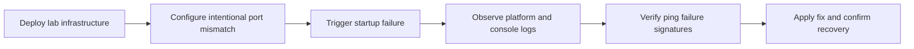

# Lab: Container Didn't Respond to HTTP Pings



## Objective

Reproduce the "Container didn't respond to HTTP pings" error on Azure App Service Linux by deploying a Python/Flask app with an intentional port mismatch between WEBSITES_PORT and the app's actual listen port.

## Prerequisites

- Azure subscription
- Azure CLI installed and logged in
- Bash shell

## Deploy

```bash
az group create --name rg-lab-pings --location koreacentral
az deployment group create \
  --resource-group rg-lab-pings \
  --template-file lab-guides/container-http-pings/main.bicep \
  --parameters baseName=labping
```

## Observe the Failure

```bash
APP_NAME=$(az webapp list --resource-group rg-lab-pings --query "[0].name" --output tsv)
bash lab-guides/container-http-pings/trigger.sh rg-lab-pings "$APP_NAME"
```

The app is intentionally configured to fail startup because App Service probes port 8080 while the Flask app listens on 8000.

Check AppServicePlatformLogs:

```kusto
AppServicePlatformLogs
| where TimeGenerated > ago(1h)
| where ResultDescription has "didn't respond"
| project TimeGenerated, ContainerId, OperationName, ResultDescription
| order by TimeGenerated desc
```

Check AppServiceConsoleLogs for the actual bind port:

```kusto
AppServiceConsoleLogs
| where TimeGenerated > ago(1h)
| where ResultDescription has_any ("Listening on", "0.0.0.0")
| project TimeGenerated, ResultDescription
| order by TimeGenerated desc
```

## Apply the Fix

```bash
bash lab-guides/container-http-pings/fix.sh rg-lab-pings "$APP_NAME"
```

This sets WEBSITES_PORT=8000 to match the app's listen port, then restarts.

## Expected Signals

- Before fix: "Container didn't respond to HTTP pings on port: 8080" in platform logs
- Before fix: Console logs show app listening on 8000
- After fix: App responds successfully on the correct port

## Clean Up

```bash
az group delete --name rg-lab-pings --yes --no-wait
```

## Related Playbook

- [Container Didn't Respond to HTTP Pings](../playbooks/startup-availability/container-didnt-respond-to-http-pings.md)

## References

- [Configure a custom container for Azure App Service](https://learn.microsoft.com/en-us/azure/app-service/configure-custom-container)
- [Configure a Linux Python app for Azure App Service](https://learn.microsoft.com/en-us/azure/app-service/configure-language-python)
- [Quickstart: Create Bicep files with Visual Studio Code](https://learn.microsoft.com/en-us/azure/azure-resource-manager/bicep/quickstart-create-bicep-use-visual-studio-code)
- [Enable diagnostic logging for apps in Azure App Service](https://learn.microsoft.com/en-us/azure/app-service/troubleshoot-diagnostic-logs)
