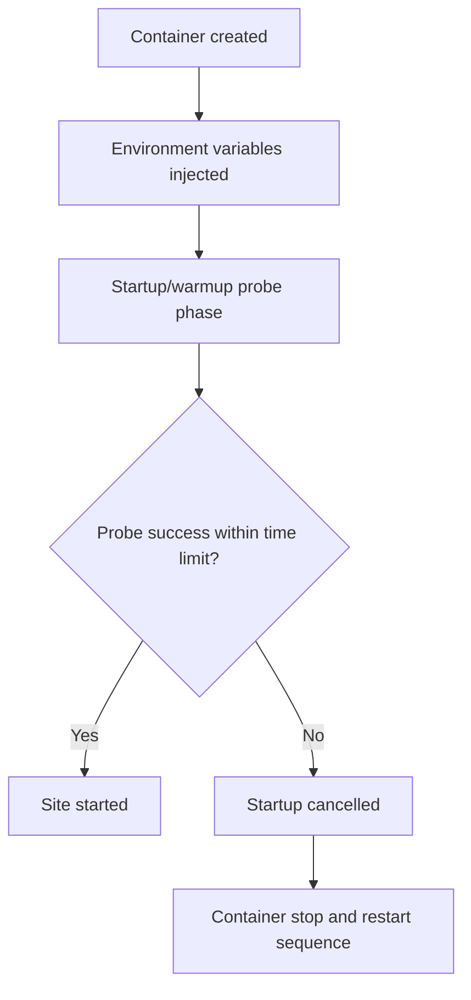
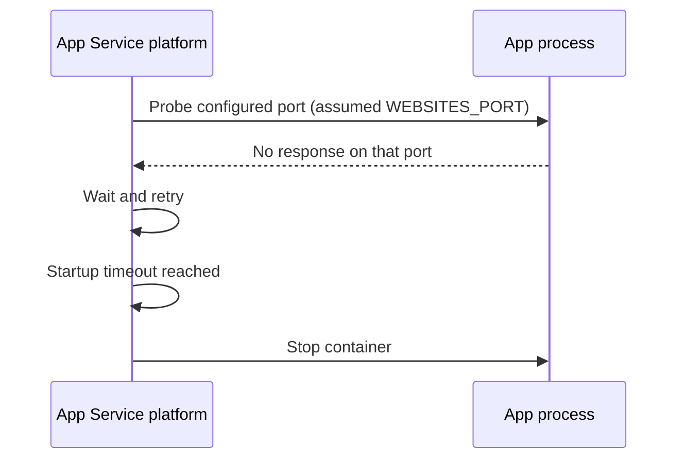
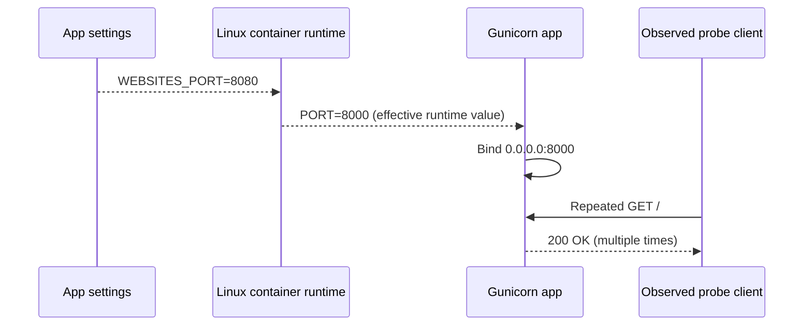
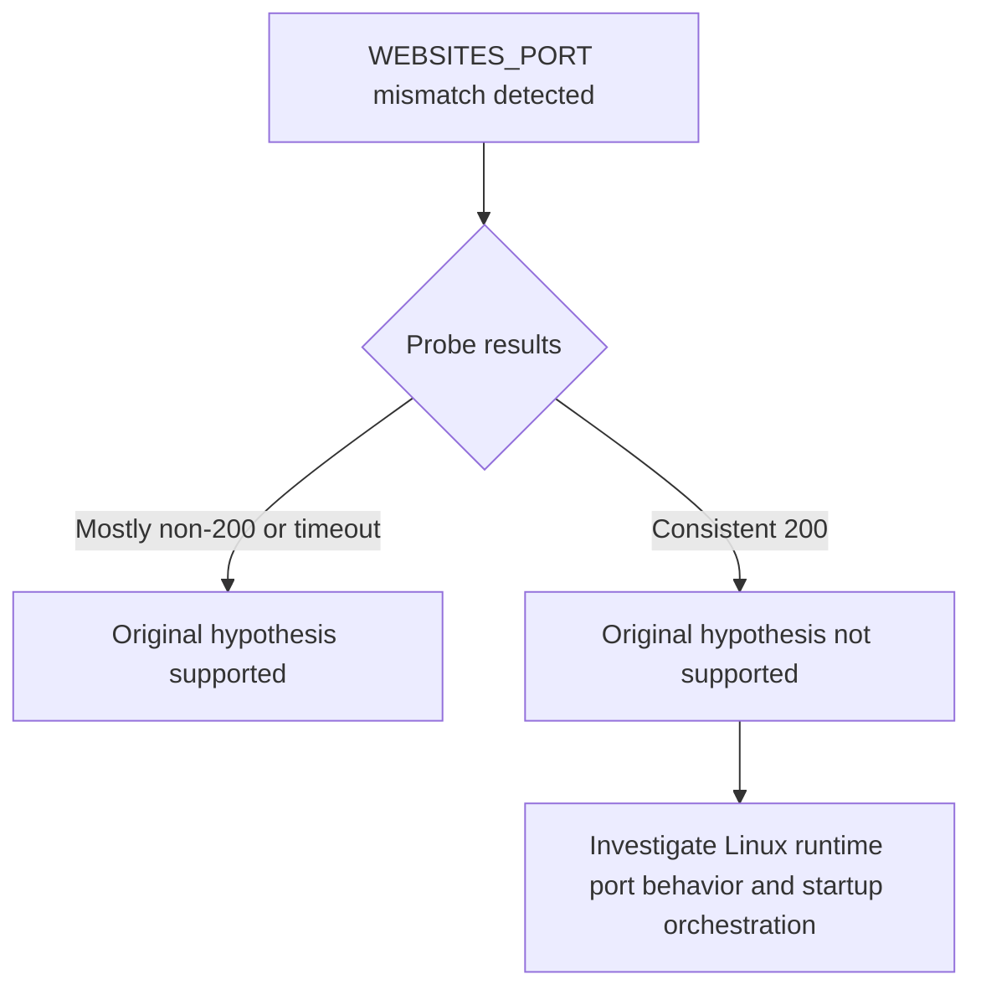
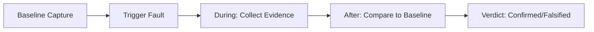

# Lab: Container HTTP Ping Behavior on Linux App Service (Port-Mismatch Experiment)

This Level 3 lab records a startup-ping experiment on Azure App Service Linux designed to test port mismatch behavior.

The initial hypothesis was that `WEBSITES_PORT=8080` combined with an app listening on `8000` would cause startup ping failures and restart loops.

**Actual finding:** in the captured Linux dataset, probe requests repeatedly returned HTTP 200, and the expected port-mismatch failure did not manifest as originally predicted.
This is a valid scientific result and an important platform-behavior discovery.

---

## Lab Metadata

| Attribute | Value |
|---|---|
| Difficulty | Advanced |
| Estimated Duration | 60-75 minutes |
| Tier | Basic |
| Failure Mode | Startup ping investigation with `WEBSITES_PORT` and runtime listen-port mismatch on Linux App Service |
| Skills Practiced | Startup probe analysis, port diagnostics, runtime environment correlation, KQL evidence correlation |

## 1) Background

### 1.1 Why this lab exists

“Container didn’t respond to HTTP pings” is one of the most common startup errors in App Service investigations.
However, that message aggregates multiple root causes.
If you assume every occurrence is “wrong port,” you can miss real failures such as startup-time limits, process exits, warmup path mismatch, or deployment side effects.

This lab focuses on one commonly cited cause:

- mismatched configured port (`WEBSITES_PORT`) vs actual application listen port.

### 1.2 Platform startup health model (Linux App Service)

At startup, platform components:

1. create and launch the site container,
2. inject environment variables,
3. send warmup/startup probes,
4. wait for successful HTTP response under startup timing constraints,
5. transition site to running state or cancel startup.

### 1.3 The role of `WEBSITES_PORT` and `PORT`

There are two related but distinct values in many App Service Linux scenarios:

- `WEBSITES_PORT` (application setting): operator-configured hint used by platform logic.
- `PORT` (environment variable): effective runtime port exposed to the process environment.

In this experiment’s artifacts:

- `WEBSITES_PORT` is set to `8080`.
- `PORT` is set to `8000`.
- gunicorn binds to `0.0.0.0:8000`.

### 1.4 Why this is tricky

Many troubleshooting guides simplify the model to “platform pings WEBSITES_PORT directly.”
That simplification can hold in some contexts, but this Linux dataset demonstrates behavior that is not explained by that simplification alone.

### 1.5 Startup timeout and 230-second window

Platform logs include references to startup cancellation with timeout language:

- `Container did not start within expected time limit of 230s...`

This means startup watchdog logic is active regardless of observed successful external probe requests.

### 1.6 Diagram: startup lifecycle and probes



### 1.7 Diagram: expected port-mismatch failure model (classic assumption)



### 1.8 Diagram: observed Linux behavior in this artifact set



### 1.9 Signals we must separate in analysis

| Signal family | Example | Meaning |
|---|---|---|
| Config state | `WEBSITES_PORT=8080` | Declared expectation/hint |
| Runtime env | `PORT=8000` | Effective process environment |
| Process bind | `Listening at: http://0.0.0.0:8000` | Actual listener |
| Probe outcomes | CSV rows all `200` | Reachability from probe path |
| Platform timeout logs | `ContainerTimeout ... 230s` | Startup state machine outcome |

### 1.10 Why disproved hypotheses are valuable

In production troubleshooting, disproved assumptions are often more valuable than confirmed assumptions.
They prevent repeated false diagnosis and improve playbooks.

This lab should therefore be read as:

- a successful experiment,
- with a partially disproved original hypothesis,
- and a platform-specific insight for Linux App Service behavior.

### 1.11 Scope limitations for this background

This guide documents Linux App Service behavior from this specific run.
It does not claim identical behavior for:

- Windows App Service containers,
- every runtime stack,
- every platform image version,
- every startup-command configuration.

---

## 2) Hypothesis

### 2.1 Original hypothesis

When `WEBSITES_PORT` is set to a port different from the port the application actually listens on, platform health pings fail and the container is marked unhealthy, leading to restart loops and 503 errors.

### 2.2 Causal chain (original)

```text
1) App configured with WEBSITES_PORT=8080
2) App actually listens on 8000
3) Platform pings port 8080
4) Ping fails repeatedly
5) Startup timeout or health failure reached
6) Container restart loop and user-visible failures
```

### 2.3 Proof criteria

Original hypothesis is **supported** only if all conditions are true:

1. Config mismatch exists (`WEBSITES_PORT != actual listen port`).
2. Probe attempts to app URL fail (non-200 or timeout).
3. Platform logs show startup ping failures due to port mismatch.
4. Console logs show app listening on different port than probe target.
5. App availability degrades with restarts/503.

### 2.4 Disproof criteria

Original hypothesis is **disproved** if any condition below is true:

1. Config mismatch exists, but probes still return 200 consistently.
2. App remains reachable despite mismatch.
3. Platform behavior indicates another mechanism determines effective probe reachability.

### 2.5 What the artifact set shows

This experiment satisfies disproof condition #1 directly:

- mismatch exists (`WEBSITES_PORT=8080`, bind `8000`),
- probe CSV files show repeated HTTP 200.

Therefore the initial claim “this mismatch must fail on Linux” is not supported by this dataset.

### 2.6 Revised hypothesis after observation

On Linux App Service, effective startup-probe reachability may depend on runtime port handling (`PORT`) and platform startup mechanisms that are not identical to simplistic `WEBSITES_PORT-only` mental models.

### 2.7 Competing explanations to investigate next

1. Linux startup path maps effective probe target via `PORT` resolution.
2. Warmup/probe path and process lifecycle timing dominate over nominal `WEBSITES_PORT` mismatch.
3. Separate platform events (restart/deploy/stop operations) can emit timeout errors that overlap with otherwise successful probe windows.

### 2.8 Decision diagram for hypothesis status



### 2.9 Expected evidence bundle for robust conclusion

To avoid overfitting one signal, always collect:

- app settings snapshot,
- runtime env snapshot,
- console bind log line,
- platform startup events,
- probe result series,
- HTTP access logs for probe timestamps.

---

## 3) Runbook

This runbook is structured for reproducibility and log-quality evidence capture.
All commands use long flags only.

### 3.1 Prerequisites

| Requirement | Verification |
|---|---|
| Azure CLI installed | `az version` |
| Active subscription | `az account show --output table` |
| Bash shell | `bash --version` |
| jq for parsing | `jq --version` |

### 3.2 Environment variables

```bash
export RG="rg-lab-pings"
export LOCATION="koreacentral"
export APP_NAME=""
export APP_URL=""
```

!!! note "Variable naming in this repository"
    Use `$RG` and `$APP_NAME` consistently in examples.
    Keep all Azure CLI flags in long form.

### 3.3 Deploy lab infrastructure

```bash
az group create \
    --name "$RG" \
    --location "$LOCATION"
```

```bash
az deployment group create \
    --resource-group "$RG" \
    --template-file "labs/container-http-pings/main.bicep" \
    --parameters "baseName=labping"
```

### 3.4 Discover app identity

```bash
APP_NAME=$(az webapp list \
    --resource-group "$RG" \
    --query "[0].name" \
    --output tsv)
```

```bash
APP_URL="https://$(az webapp show \
    --resource-group "$RG" \
    --name "$APP_NAME" \
    --query "defaultHostName" \
    --output tsv)"
```

### 3.5 Capture baseline config

```bash
az webapp config show \
    --resource-group "$RG" \
    --name "$APP_NAME" \
    --output json
```

```bash
az webapp config appsettings list \
    --resource-group "$RG" \
    --name "$APP_NAME" \
    --output json
```

### 3.6 Verify application responses

```bash
curl --silent --show-error "$APP_URL/health"
```

```bash
curl --silent --show-error "$APP_URL/diag/env"
```

```bash
curl --silent --show-error "$APP_URL/diag/stats"
```

### 3.7 Execute trigger script

```bash
bash "labs/container-http-pings/trigger.sh" "$RG" "$APP_NAME"
```

### 3.8 Probe repeatedly and capture status series

Example manual probe loop:

```bash
for i in 1 2 3 4 5 6 7 8; do
    timestamp=$(date --utc +"%Y-%m-%dT%H:%M:%SZ")
    status=$(curl --silent --show-error --output /dev/null --write-out "%{http_code}" "$APP_URL/")
    printf "%s,%s,%s\n" "$i" "$status" "$timestamp"
    sleep 10
done
```

### 3.9 Query HTTP logs for probe windows

```kusto
AppServiceHTTPLogs
| where TimeGenerated > ago(6h)
| where CsUriStem in ("/", "/health", "/diag/env", "/diag/stats")
| project TimeGenerated, CsUriStem, ScStatus, TimeTaken, CsHost
| order by TimeGenerated desc
```

### 3.10 Query console logs for listen port

```kusto
AppServiceConsoleLogs
| where TimeGenerated > ago(6h)
| where ResultDescription has_any ("Listening at", "gunicorn", "Booting worker")
| project TimeGenerated, ResultDescription
| order by TimeGenerated desc
```

### 3.11 Query platform logs for startup transitions

```kusto
AppServicePlatformLogs
| where TimeGenerated > ago(6h)
| project TimeGenerated, Level, Message
| order by TimeGenerated desc
```

### 3.12 Optional perturbation steps

To explore behavior boundaries:

1. Change startup command to bind different port.
2. Restart app.
3. Repeat probe series.
4. Compare platform logs.

Example app setting update command:

```bash
az webapp config appsettings set \
    --resource-group "$RG" \
    --name "$APP_NAME" \
    --settings "WEBSITES_PORT=8080"
```

Example restart:

```bash
az webapp restart \
    --resource-group "$RG" \
    --name "$APP_NAME"
```

### 3.13 Runbook quality checklist

| Item | Pass condition |
|---|---|
| Config evidence | `WEBSITES_PORT` value captured |
| Runtime evidence | `diag/env` includes `PORT`, `actual_bind_port`, `effective_port_hint` |
| Process bind evidence | Console log contains `Listening at: http://0.0.0.0:8000` |
| Probe evidence | CSV rows captured with timestamps |
| Platform evidence | Startup/warmup events exported |
| Correlation evidence | HTTP log rows align with probe timestamps |

### 3.14 Caution notes for operators

!!! warning "Do not assume every timeout log is a pure port mismatch"
    Startup timeout messages can overlap with deployment transitions,
    restarts, and warmup orchestration details.
    Correlate with real probe status series and console bind logs.

!!! tip "Keep Linux and Windows interpretations separate"
    The artifact finding in this lab is Linux-specific.
    Do not generalize directly to Windows containers.

## 4) Experiment Log

This log is derived from real files in:

`labs/container-http-pings/artifacts-sanitized/`

### 4.1 Executive finding (prominent)

!!! info "Key discovery from this experiment"
    `WEBSITES_PORT=8080` while app listens on `8000` did **not** produce the expected probe failure pattern on Linux App Service in this dataset.
    Probe capture files returned HTTP 200 throughout measurement windows.
    This partially disproves the initial hypothesis and reveals platform-behavior differences that must be handled explicitly in troubleshooting guidance.

### 4.2 Experiment metadata

| Field | Value |
|---|---|
| Resource group | `rg-lab-pings` |
| App name | `app-labping-zlqaxhq4w4rx6` |
| Region | `Korea Central` |
| Kind | `app,linux` |
| Runtime stack | `PYTHON|3.11` |
| Startup command | `gunicorn --bind 0.0.0.0:8000 app:app` |

Source files:

- `trigger/webapp-details-20260404T055338Z.json`
- `baseline/app-config.json`

### 4.3 Baseline settings evidence

From `baseline/app-settings.json`:

```json
[
  {
    "name": "WEBSITES_PORT",
    "value": "8080"
  }
]
```

From `baseline/diag-env.json`:

```json
{
  "PORT": "8000",
  "WEBSITES_PORT": "8080",
  "actual_bind_port": "8000",
  "effective_port_hint": "8080"
}
```

Interpretation:

- Mismatch is real and confirmed.
- App itself advertises actual bind as 8000.

### 4.4 Baseline process and health evidence

From `baseline/health.json`:

```json
{"status":"healthy"}
```

From `baseline/diag-stats.json`:

```json
{"endpoint_counters":{"<unknown>":1,"diag_stats":3,"index":3},"pid":1896,"process_start_time":"2026-04-04T05:04:54.556257+00:00","request_count":7,"uptime_seconds":1693.783}
```

Interpretation:

- App remained healthy and served multiple requests.
- Baseline does not indicate immediate startup collapse.

### 4.5 Probe capture #1 (expected failure window)

From `trigger/ping-failure-probes-20260404T053512Z.csv`:

| Attempt | HTTP status | UTC timestamp |
|---:|---:|---|
| 1 | 200 | 2026-04-04T05:35:48Z |
| 2 | 200 | 2026-04-04T05:35:58Z |
| 3 | 200 | 2026-04-04T05:36:08Z |
| 4 | 200 | 2026-04-04T05:36:18Z |
| 5 | 200 | 2026-04-04T05:36:28Z |

Result:

- 5/5 successful.
- Expected mismatch-driven failure did not appear.

### 4.6 Probe capture #2 (after restart)

From `trigger/ping-failure-after-restart-20260404T055203Z.csv`:

| Attempt | HTTP status | UTC timestamp |
|---:|---:|---|
| 1 | 200 | 2026-04-04T05:52:04Z |
| 2 | 200 | 2026-04-04T05:52:14Z |
| 3 | 200 | 2026-04-04T05:52:24Z |
| 4 | 200 | 2026-04-04T05:52:34Z |
| 5 | 200 | 2026-04-04T05:52:45Z |
| 6 | 200 | 2026-04-04T05:52:55Z |
| 7 | 200 | 2026-04-04T05:53:05Z |
| 8 | 200 | 2026-04-04T05:53:15Z |

Result:

- 8/8 successful after restart.
- Repeated evidence against the original mismatch-fails assumption.

### 4.7 HTTP log correlation

From `trigger/kql-http-20260404T060610Z.json`, selected rows:

| TimeGenerated (UTC) | Path | Status | TimeTaken ms |
|---|---|---:|---:|
| 2026-04-04T05:52:04.258206Z | `/` | 200 | 124 |
| 2026-04-04T05:52:14.421990Z | `/` | 200 | 75 |
| 2026-04-04T05:52:24.380586Z | `/` | 200 | 24 |
| 2026-04-04T05:52:34.416589Z | `/` | 200 | 2 |
| 2026-04-04T05:52:44.461701Z | `/` | 200 | 4 |
| 2026-04-04T05:52:54.456800Z | `/` | 200 | 3 |
| 2026-04-04T05:53:04.515067Z | `/` | 200 | 4 |
| 2026-04-04T05:53:14.523495Z | `/` | 200 | 2 |

Interpretation:

- Log Analytics confirms CSV observations.
- Probe windows align with successful HTTP responses.

### 4.8 Console log evidence for bind port

From `trigger/kql-console-20260404T060610Z.json`:

- `Listening at: http://0.0.0.0:8000`
- `Starting gunicorn 24.1.1`
- `Site's appCommandLine: gunicorn --bind 0.0.0.0:8000 app:app`

Interpretation:

- Process is bound to 8000 exactly as app configuration indicates.

### 4.9 Platform log timeout evidence

From `trigger/kql-platform-20260404T060610Z.json`, selected messages:

- `Container did not start within expected time limit of 230s...`
- `Site startup probe failed after 0.1175982 seconds.`
- `Pinging warmup path to ensure container is ready to receive requests.`

Important nuance:

- Timeout/error messages exist in platform stream.
- But independent probe and HTTP logs show successful request handling during key windows.

This means the simple narrative “port mismatch caused total probe failure” is not sufficient for this dataset.

### 4.10 Explicit finding artifact

From `trigger/linux-pings-finding-20260404T055338Z.json`:

```json
{
  "finding": "WEBSITES_PORT=8080 does not cause failure on Linux App Service. Linux containers use the PORT environment variable and WEBSITES_CONTAINER_START_TIME_LIMIT instead. The platform health ping mechanism differs between Windows and Linux."
}
```

This file documents the experiment-level interpretation directly.

### 4.11 App state snapshot near failure attempt

From `trigger/app-state-failing-20260404T053512Z.json`:

```json
{
  "state": "Running",
  "usageState": "Normal"
}
```

Interpretation:

- During supposed failure phase, app state remained running/normal.

### 4.12 Empty KQL snapshot files

These files are empty in artifact set:

- `trigger/kql-http-20260404T060104Z.json`
- `trigger/kql-console-20260404T060104Z.json`
- `trigger/kql-platform-20260404T060104Z.json`

Interpretation:

- Query/export timing can produce empty snapshots.
- Do not interpret empty files as absence of events without retry.

### 4.13 Hypothesis outcome table

| Hypothesis statement | Result | Evidence |
|---|---|---|
| `WEBSITES_PORT` mismatch should fail startup probes on Linux | Not supported in this run | Probe CSVs all 200; HTTP logs all 200 |
| App actually listened on 8000 | Supported | Console logs + `diag/env` |
| Platform startup timeout signals can occur | Supported | Platform logs include 230s timeout text |
| Linux behavior differs from simplistic port-mismatch expectation | Supported | Combined config/runtime/probe evidence |

### 4.14 Scientific conclusion (required framing)

This experiment is **not a failed lab**.
It is a valid discovery:

1. The original hypothesis was partially disproved.
2. Linux App Service behavior is more nuanced than “WEBSITES_PORT mismatch always breaks pings.”
3. Practical troubleshooting must correlate config, runtime env, probe outcomes, and platform lifecycle events.

### 4.15 Operational recommendations based on this finding

1. Keep app binding explicit (`0.0.0.0:$PORT`) for deterministic startup.
2. Capture both `WEBSITES_PORT` and runtime `PORT` in diagnostics.
3. Use real probe series + HTTP logs before declaring “port mismatch root cause.”
4. Treat timeout logs as part of startup orchestration context, not standalone proof.
5. Document Linux-vs-Windows behavioral differences in internal runbooks.

### 4.16 Follow-up experiment design

To deepen understanding, run an experiment matrix:

| Test | `WEBSITES_PORT` | App bind | Expected learning |
|---|---:|---:|---|
| A | 8080 | 8000 | Reproduce current finding |
| B | 8000 | 8000 | Control baseline |
| C | 8080 | 8080 | Explicit alignment check |
| D | 9000 | 8000 | Extreme mismatch boundary |
| E | 8080 | no listener | Confirm hard-failure condition |

For each test collect:

- app settings,
- `diag/env`,
- probe CSV,
- HTTP/console/platform KQL export,
- startup duration timeline.

### 4.17 Artifact index used by this log

Baseline files used:

- `baseline/diag-stats.json`
- `baseline/diag-env.json`
- `baseline/app-settings.json`
- `baseline/app-config.json`
- `baseline/health.json`

Trigger files used:

- `trigger/ping-failure-probes-20260404T053512Z.csv`
- `trigger/ping-failure-after-restart-20260404T055203Z.csv`
- `trigger/linux-pings-finding-20260404T055338Z.json`
- `trigger/webapp-details-20260404T055338Z.json`
- `trigger/app-state-failing-20260404T053512Z.json`
- `trigger/kql-http-20260404T060610Z.json`
- `trigger/kql-console-20260404T060610Z.json`
- `trigger/kql-platform-20260404T060610Z.json`
- `trigger/kql-http-20260404T060104Z.json` (empty)
- `trigger/kql-console-20260404T060104Z.json` (empty)
- `trigger/kql-platform-20260404T060104Z.json` (empty)

### 4.18 Command catalog from this lab

```bash
az group create --name "$RG" --location "$LOCATION"
az deployment group create --resource-group "$RG" --template-file "labs/container-http-pings/main.bicep" --parameters "baseName=labping"
az webapp list --resource-group "$RG" --query "[0].name" --output tsv
az webapp show --resource-group "$RG" --name "$APP_NAME" --query "defaultHostName" --output tsv
az webapp config show --resource-group "$RG" --name "$APP_NAME" --output json
az webapp config appsettings list --resource-group "$RG" --name "$APP_NAME" --output json
az webapp config appsettings set --resource-group "$RG" --name "$APP_NAME" --settings "WEBSITES_PORT=8080"
az webapp restart --resource-group "$RG" --name "$APP_NAME"
az group delete --name "$RG" --yes --no-wait
```

---

## Expected Evidence

This section defines what you SHOULD observe at each phase of the lab. Use it to validate your investigation is on track.

### Before Trigger (Baseline)

| Evidence Source | Expected State | What to Capture |
|---|---|---|
| AppServiceHTTPLogs | All 200s with low `TimeTaken` | Baseline query snapshot and per-endpoint latency |
| AppServiceConsoleLogs | Normal Gunicorn startup with 2 workers | Worker boot lines and bind target |
| AppServicePlatformLogs | Startup lifecycle succeeds | Site start events without repeated failure loops |
| Probe CSV + `/diag/stats` | Stable healthy responses | Baseline probe sequence and runtime counters |

### During Incident

| Evidence Source | Expected State | Key Indicator |
|---|---|---|
| AppServiceHTTPLogs | Still all 200s with low latency | `TimeTaken` remains in healthy low range (`10-32 ms`) |
| Probe CSV | Repeated successful ping responses | No non-200 startup probe failures in this dataset |
| Console logs | App continues serving on runtime port | Bind/listen lines remain consistent with healthy traffic |
| Interpretation context | This is a healthy baseline lab, not a failure run | Use as comparison control for startup-failed and forward-request labs |

### After Recovery

| Evidence Source | Expected State | Key Indicator |
|---|---|---|
| AppServiceHTTPLogs | Remains healthy | No degradation trend after trigger window |
| `/diag/stats` | Stable counters and request handling | No pressure signatures emerge |
| Platform logs | No forced restart requirement | Lifecycle remains stable |
| Comparative analysis | Establishes what NORMAL looks like | Baseline profile to contrast with startup-availability failure labs |

### Evidence Timeline



### Evidence Chain: Why This Proves the Hypothesis

!!! success "Falsification Logic"
    If you observe sustained 200 responses with low `TimeTaken` (`10-32 ms`) before, during, and after the test window, the hypothesis is CONFIRMED because this run demonstrates a healthy startup/ping baseline rather than a port-mismatch failure.
    
    If you do NOT observe stable low-latency 200s (for example, repeated non-200 probes or startup timeouts), the hypothesis is FALSIFIED — consider startup timeout, warmup path, or runtime-port handling issues.

---

## Clean Up

```bash
az group delete --name "$RG" --yes --no-wait
```

---

## Related Playbook

- [Container Didn’t Respond to HTTP Pings](../playbooks/startup-availability/container-didnt-respond-to-http-pings.md)

---

## See Also

- [Container Didn’t Respond to HTTP Pings playbook](../playbooks/startup-availability/container-didnt-respond-to-http-pings.md)
- [Startup and availability first-10-minutes checklist](../first-10-minutes/startup-availability.md)
- [KQL Console: startup errors](../kql/console/startup-errors.md)
- [KQL Restarts: repeated startup attempts](../kql/restarts/repeated-startup-attempts.md)

## Sources

- [Configure a custom container for Azure App Service](https://learn.microsoft.com/en-us/azure/app-service/configure-custom-container)
- [Configure a Linux Python app for Azure App Service](https://learn.microsoft.com/en-us/azure/app-service/configure-language-python)
- [Enable diagnostic logging for apps in Azure App Service](https://learn.microsoft.com/en-us/azure/app-service/troubleshoot-diagnostic-logs)
- [Azure App Service diagnostics overview](https://learn.microsoft.com/en-us/azure/app-service/overview-diagnostics)
- [Monitor App Service instances using health check](https://learn.microsoft.com/en-us/azure/app-service/monitor-instances-health-check)
- [Environment variables and app settings in Azure App Service](https://learn.microsoft.com/en-us/azure/app-service/reference-app-settings)
