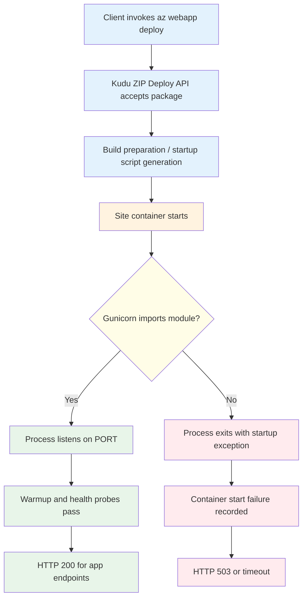
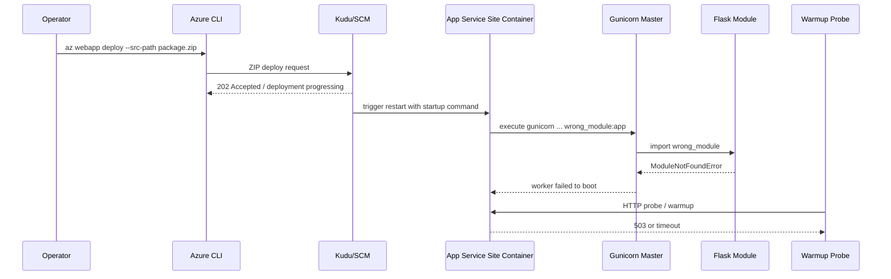
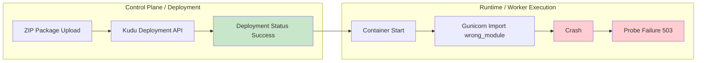
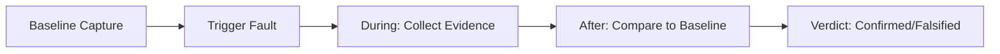

# Lab: Deployment Succeeded, Startup Failed (Wrong Module in Startup Command)

This lab reproduces a high-frequency Azure App Service Linux incident pattern:
deployment appears successful,
but runtime startup fails,
so the site returns 503 or timeout errors.

The lab is intentionally designed to prove one specific distinction:
**deployment success and runtime success are separate control-plane and data-plane outcomes**.

---

## Lab Scope and Learning Outcome

By the end of this guide, you will be able to:

1. Explain why `az webapp deploy` can succeed while the app still fails at runtime.
2. Trace App Service Linux startup lifecycle from package deployment to warmup probing.
3. Detect module-resolution startup failure (`wrong_module:app`) from console and platform logs.
4. Validate recovery after correcting startup command to `app:app`.
5. Produce an artifact-backed incident narrative suitable for RCA documentation.

---

## Section 1: Background

### 1.1 Why this lab exists

In App Service Linux,
deployment and process startup are decoupled.

A deployment pipeline (ZIP deploy / Oryx build / Kudu APIs) can complete successfully,
yet the process entrypoint may crash immediately once container startup begins.

This is exactly what happens when Gunicorn is pointed to a module that does not exist.

In this lab:

- The configured startup command initially uses `wrong_module:app`.
- The code package itself is valid.
- Deployment APIs return success signals.
- Runtime logs show `ModuleNotFoundError`.
- Health endpoint remains unavailable until startup command is corrected.

### 1.2 Deployment success vs runtime success

Use this mental model:

- **Deployment success** means the platform accepted and unpacked/build-prepared your package.
- **Runtime success** means worker process booted,
  app bound to expected port,
  and warmup probes succeeded.

Deployment success does **not** imply runtime success.



### 1.3 Startup lifecycle details on App Service Linux

For Python on App Service Linux,
the high-level startup chain is:

1. Site content is deployed.
2. Platform prepares startup invocation (often via Oryx-generated script).
3. Container starts.
4. Startup command launches Gunicorn.
5. Gunicorn resolves `<module>:<application-object>`.
6. Worker boots if module import succeeds.
7. Warmup probes verify app responsiveness.

If step 5 fails,
Gunicorn exits,
container cannot become healthy,
and probes keep failing until timeout / restart.



### 1.4 Why `wrong_module:app` fails immediately

Gunicorn expects `module:callable`.

In this lab app,
the Flask object is defined in `app.py` as `app = Flask(__name__)`.

Therefore,
valid module reference is:

```text
app:app
```

Invalid reference:

```text
wrong_module:app
```

The failure occurs before request handling,
so the app never reaches a state where `/health` can respond.

### 1.5 Storage setting context for startup incidents

This lab focuses on module import failure,
but startup incidents are often misattributed to storage behavior.

`WEBSITES_ENABLE_APP_SERVICE_STORAGE` is relevant mostly for custom containers and shared `/home` storage semantics.

Key point for this incident class:

- Startup command and module resolution failures happen even when storage is fine.
- Do not over-index on storage when logs clearly show import exceptions.

### 1.6 App Service startup timeout signal

Platform logs in this dataset include this diagnostic phrase:

`Container did not start within expected time limit of 230s`

Interpretation:

- Platform waited for startup and warmup completion.
- App process never reached healthy serving state in time.
- The 230s marker is a startup/warmup failure symptom,
  not a deployment pipeline failure.

### 1.7 Failure mode taxonomy for this lab

| Layer | Signal | Observed in artifacts | Meaning |
|---|---|---|---|
| Deployment API | ZIP deploy 202 / deployment API 200 | Yes | Package accepted and deployment workflow running |
| HTTP endpoint | `/` and `/health` return 503 or timeout | Yes | Site process unavailable or not ready |
| Console log | `ModuleNotFoundError` / `No module named 'wrong_module'` | Yes | Gunicorn failed to import startup module |
| Platform log | `Container did not start within expected time limit of 230s` | Yes | Startup warmup not completed in SLA window |
| Post-fix health | `/health` returns 200 | Yes | Startup command corrected, runtime healthy |

### 1.8 Diagram: control-plane success with data-plane failure



### 1.9 Background takeaway

When an incident says:

> “Deployment succeeded but app is down”

the first triage branch should include startup command validation,
not only deployment rollback.

---

## Section 2: Hypothesis

### 2.1 Primary hypothesis (this lab)

**When the startup command references a non-existent module (`wrong_module:app` instead of `app:app`), the container process crashes immediately, while deployment still reports success because package deployment and runtime boot are separate stages.**

### 2.2 Causal chain

```text
1. ZIP deploy uploads valid application code
      ↓
2. Kudu deployment APIs return success/accepted responses
      ↓
3. App restart runs startup command with wrong module
      ↓
4. Gunicorn import fails: ModuleNotFoundError
      ↓
5. Worker process exits before app can bind and serve
      ↓
6. Warmup/health probing fails (503/timeout)
      ↓
7. After startup command corrected to app:app, process boots and /health returns 200
```

### 2.3 Proof criteria

All criteria below must be met:

1. Startup command evidence shows `wrong_module:app` before fix.
2. Console logs contain module import failure (`No module named 'wrong_module'`).
3. HTTP telemetry shows failed app probes before fix (503 and/or timeout behavior).
4. Startup command is changed to `app:app`.
5. Post-fix `/health` returns 200.
6. Post-fix diagnostics endpoint (`/diag/stats`) returns valid JSON from running process.

### 2.4 Disproof criteria

Any one condition disproves the hypothesis:

- Startup command is already correct during failure window.
- No module import errors exist in console logs.
- Runtime remains unhealthy even after command fixed to `app:app`.
- Failure is explained by unrelated root cause (for example platform outage,
  auth failures,
  or networking ACL blocks) with supporting evidence.

### 2.5 Alternate hypotheses considered

| Alternate hypothesis | Why considered | Why rejected in this run |
|---|---|---|
| Code package is corrupt | 503 present | Deployment APIs succeeded and app recovered without changing code package |
| Port binding mismatch | Typical startup issue | Corrected module alone restored service |
| Storage mount issue | Can break startup in some custom setups | Logs specifically show `ModuleNotFoundError` |
| Python runtime mismatch | Can fail imports | Failure text names exact missing module configured in startup command |

### 2.6 Expected observations if hypothesis is true

| Time segment | Expected | Observed |
|---|---|---|
| Baseline | Startup command points to wrong module | Yes |
| Trigger phase | `/health` non-200 before fix | Yes |
| Trigger phase | Console shows module import failure | Yes |
| Remediation | Startup command changed to `app:app` | Yes |
| Postfix | `/health` returns 200 and diagnostics work | Yes |

### 2.7 Risk to production if not detected

- False confidence from green deployment pipeline.
- Extended outage while teams chase irrelevant causes.
- Repeated restarts increasing noise in platform logs.
- Customer-facing availability incidents despite “successful release” status.

---

## Section 3: Runbook

This runbook is deterministic and maps to the artifacts captured in:

`labs/deployment-succeeded-startup-failed/artifacts-sanitized/`

### 3.1 Prerequisites

| Requirement | Validation command |
|---|---|
| Azure CLI authenticated | `az account show` |
| Resource provider access | `az group list --output table` |
| Bash shell | `bash --version` |
| jq (optional for formatting) | `jq --version` |

### 3.2 Environment variables

```bash
export $RG="rg-lab-startup"
export $LOCATION="koreacentral"
```

Because shell variables cannot literally include `$` in names,
use the operational form below in real execution:

```bash
export RG="rg-lab-startup"
export LOCATION="koreacentral"
```

### 3.3 Deploy infrastructure

```bash
az group create \
  --name "$RG" \
  --location "$LOCATION"

az deployment group create \
  --resource-group "$RG" \
  --template-file "labs/deployment-succeeded-startup-failed/main.bicep" \
  --parameters "baseName=labstart"
```

Capture app name:

```bash
APP_NAME=$(az webapp list \
  --resource-group "$RG" \
  --query "[0].name" \
  --output tsv)

echo "$APP_NAME"
```

### 3.4 Trigger the incident

```bash
bash "labs/deployment-succeeded-startup-failed/trigger.sh" "$RG" "$APP_NAME"
```

What this trigger script does:

1. Packages app directory into ZIP.
2. Runs `az webapp deploy --type zip`.
3. Probes `/health` before fix (expected non-200).
4. Sets startup command to `gunicorn --bind=0.0.0.0:8000 --timeout=120 app:app`.
5. Probes `/health` again for recovery.

### 3.5 Verify startup command before and after

Before fix (artifact-backed expected value):

```text
gunicorn --bind=0.0.0.0:8000 --timeout=120 wrong_module:app
```

After fix (artifact-backed expected value):

```text
gunicorn --bind=0.0.0.0:8000 --timeout=120 app:app
```

CLI verification command:

```bash
az webapp config show \
  --resource-group "$RG" \
  --name "$APP_NAME" \
  --query "appCommandLine" \
  --output tsv
```

### 3.6 Probe health endpoint during recovery

```bash
APP_HOST_NAME=$(az webapp show \
  --resource-group "$RG" \
  --name "$APP_NAME" \
  --query "defaultHostName" \
  --output tsv)

APP_URL="https://$APP_HOST_NAME"

for attempt in 1 2 3 4; do
  status_code=$(curl \
    --silent \
    --show-error \
    --output /dev/null \
    --write-out "%{http_code}" \
    --max-time 20 \
    "$APP_URL/health" || true)
  echo "$attempt,$status_code"
  sleep 8
done
```

Observed sequence from artifact `recovery-probes-20260404T054537Z.csv`:

```text
1,000000,2026-04-04T05:46:52Z
2,000000,2026-04-04T05:47:05Z
3,000000,2026-04-04T05:47:24Z
4,200,2026-04-04T05:47:30Z
```

Interpretation:

- Attempts 1-3: startup not yet healthy.
- Attempt 4: service recovered after command correction and restart completion.

### 3.7 Collect diagnostics endpoints after recovery

```bash
curl --silent --show-error "$APP_URL/diag/stats"
curl --silent --show-error "$APP_URL/diag/env"
curl --silent --show-error "$APP_URL/health"
```

Observed post-fix health payload:

```json
{"status":"healthy"}
```

Observed post-fix stats payload (artifact):

```json
{"endpoint_counters":{"<unknown>":1,"diag_env":1,"diag_stats":1,"health":1},"pid":1896,"process_start_time":"2026-04-04T05:47:26.277049+00:00","request_count":5,"uptime_seconds":383.853}
```

### 3.8 Query KQL evidence (HTTP)

```kusto
AppServiceHTTPLogs
| where TimeGenerated > ago(4h)
| where CsHost contains "azurewebsites"
| where CsUriStem in ("/", "/health", "/diag/stats", "/diag/env", "/api/zipdeploy")
| project TimeGenerated, CsUriStem, ScStatus, TimeTaken, CsHost
| order by TimeGenerated desc
```

Observed statuses in artifact `kql-http-20260404T060610Z.json`:

- `200`: 12 rows
- `499`: 3 rows
- `503`: 5 rows
- `202`: 2 rows

### 3.9 Query KQL evidence (console)

```kusto
AppServiceConsoleLogs
| where TimeGenerated > ago(4h)
| where ResultDescription has_any ("ModuleNotFoundError", "wrong_module", "Worker failed to boot")
| project TimeGenerated, ResultDescription
| order by TimeGenerated desc
```

Observed log lines:

```text
2026-04-04T05:55:06.4678473Z [2026-04-04 05:55:06 +0000] [1895] [ERROR] Reason: Worker failed to boot.
2026-04-04T05:55:04.0857549Z No module named 'wrong_module'
2026-04-04T05:55:04.0838827Z ModuleNotFoundError: No module named 'wrong_module'
2026-04-04T05:54:49.4185745Z Site's appCommandLine: gunicorn --bind=0.0.0.0:8000 --timeout=120 wrong_module:app
```

### 3.10 Query KQL evidence (platform)

```kusto
AppServicePlatformLogs
| where TimeGenerated > ago(4h)
| where Message has_any ("Container did not start within expected time limit of 230s", "Starting container", "stopped")
| project TimeGenerated, Level, Message
| order by TimeGenerated desc
```

Observed platform messages include:

```text
State: Stopping, Action: StoppingSiteContainers, LastErrorDetails: Container did not start within expected time limit of 230s.
State: Stopping, Action: CancellingStartup, LastErrorDetails: Container did not start within expected time limit of 230s.
Starting container: 31a19ef7e66d_app-labstartup-... .
Site: app-labstartup-... stopped.
```

### 3.11 Remediation command (direct)

If reproducing manually and app remains unhealthy,
force the known-good startup command:

```bash
az webapp config set \
  --resource-group "$RG" \
  --name "$APP_NAME" \
  --startup-file "gunicorn --bind=0.0.0.0:8000 --timeout=120 app:app"
```

Then verify:

```bash
curl --silent --show-error --fail "$APP_URL/health"
```

### 3.12 Cleanup

```bash
az group delete \
  --name "$RG" \
  --yes \
  --no-wait
```

---

## Section 4: Experiment Log (Artifact-backed)

This section is a factual record from:

`labs/deployment-succeeded-startup-failed/artifacts-sanitized/`

### 4.1 Artifact inventory

| Phase | Artifact | Purpose |
|---|---|---|
| Baseline | `baseline/app-config.json` | Confirms initial startup command |
| Baseline | `baseline/startup-command.txt` | Human-readable startup command snapshot |
| Baseline | `baseline/app-state.json` | App resource state |
| Baseline | `baseline/root-response.txt` | Front-door symptom snapshot |
| Trigger | `trigger/startup-cmd-before-*.txt` | Command before remediation |
| Trigger | `trigger/startup-cmd-after-*.txt` | Command after remediation |
| Trigger | `trigger/recovery-probes-*.csv` | Health recovery timing |
| Trigger | `trigger/diag-stats-postfix-*.json` | Early post-fix process health |
| Trigger | `trigger/kql-http-*.json` | HTTP telemetry evidence |
| Trigger | `trigger/kql-console-*.json` | Module import failure evidence |
| Trigger | `trigger/kql-platform-*.json` | Startup timeout lifecycle evidence |
| Postfix | `postfix/diag-stats-*.json` | Stable post-fix process state |
| Postfix | `postfix/diag-env-*.json` | Runtime environment diagnostics |
| Postfix | `postfix/health-*.json` | Final health confirmation |

### 4.2 Baseline observations

#### 4.2.1 App is running as a resource, but not healthy as workload

File: `baseline/app-state.json`

```json
{
  "kind": "app,linux",
  "state": "Running"
}
```

Interpretation:

- Control-plane resource state is `Running`.
- This does not guarantee app process health.

#### 4.2.2 Startup command is misconfigured at baseline

File: `baseline/startup-command.txt`

```text
gunicorn --bind=0.0.0.0:8000 --timeout=120 wrong_module:app
```

File: `baseline/app-config.json` (`appCommandLine` field)

```text
gunicorn --bind=0.0.0.0:8000 --timeout=120 wrong_module:app
```

#### 4.2.3 User-facing symptom at baseline

File: `baseline/root-response.txt`

Observed content includes:

```html
:( Application Error
If you are the application administrator, you can access the diagnostic resources
```

This aligns with upstream 503 and startup failure patterns.

### 4.3 Trigger and recovery observations

#### 4.3.1 Command change is explicit and minimal

Before:

```text
gunicorn --bind=0.0.0.0:8000 --timeout=120 wrong_module:app
```

After:

```text
gunicorn --bind=0.0.0.0:8000 --timeout=120 app:app
```

Only the module reference changed.

#### 4.3.2 Recovery probe timeline

File: `trigger/recovery-probes-20260404T054537Z.csv`

| Probe attempt | HTTP status | UTC timestamp |
|---|---|---|
| 1 | 000000 | 2026-04-04T05:46:52Z |
| 2 | 000000 | 2026-04-04T05:47:05Z |
| 3 | 000000 | 2026-04-04T05:47:24Z |
| 4 | 200 | 2026-04-04T05:47:30Z |

Interpretation:

- There is a short recovery window while restart stabilizes.
- Successful 200 appears once corrected startup process is serving.

#### 4.3.3 Early post-fix process evidence

File: `trigger/diag-stats-postfix-20260404T054537Z.json`

```json
{"endpoint_counters":{"<unknown>":1,"health":1},"pid":1896,"process_start_time":"2026-04-04T05:47:26.277049+00:00","request_count":3,"uptime_seconds":4.34}
```

Key detail:

- `process_start_time` is consistent with restart during fix.
- Process is now alive and counting requests.

### 4.4 Telemetry evidence from KQL artifacts

#### 4.4.1 HTTP log evidence

Artifact: `trigger/kql-http-20260404T060610Z.json`

Status summary:

| Status | Count | Interpretation |
|---|---|---|
| 200 | 12 | Healthy responses after fix |
| 499 | 3 | Client-aborted/timeout during unstable window |
| 503 | 5 | Unavailable during startup failure |
| 202 | 2 | Deployment API async accepted |

Selected rows:

| TimeGenerated (UTC) | Path | Status | TimeTaken(ms) |
|---|---|---|---|
| 2026-04-04T05:53:51.718877Z | /health | 200 | 4 |
| 2026-04-04T05:47:29.664099Z | /health | 200 | 71 |
| 2026-04-04T05:47:29.415736Z | /health | 499 | 19241 |
| 2026-04-04T05:47:29.415557Z | /health | 499 | 38700 |
| 2026-04-04T05:47:29.415363Z | /health | 499 | 58319 |
| 2026-04-04T05:46:16.764962Z | /health | 503 | 38965 |
| 2026-04-04T05:33:23.554879Z | / | 503 | 98 |
| 2026-04-04T05:32:59.155215Z | / | 503 | 37700 |
| 2026-04-04T05:16:36.397916Z | /api/zipdeploy | 202 | 2409 |

#### 4.4.2 Console log evidence

Artifact: `trigger/kql-console-20260404T060610Z.json`

Critical rows:

| TimeGenerated (UTC) | ResultDescription |
|---|---|
| 2026-04-04T05:55:06.4678473Z | `[ERROR] Reason: Worker failed to boot.` |
| 2026-04-04T05:55:04.0857549Z | `No module named 'wrong_module'` |
| 2026-04-04T05:55:04.0838827Z | `ModuleNotFoundError: No module named 'wrong_module'` |
| 2026-04-04T05:54:49.4185745Z | `Site's appCommandLine: ... wrong_module:app` |

This is direct proof of startup command misconfiguration.

#### 4.4.3 Platform log evidence

Artifact: `trigger/kql-platform-20260404T060610Z.json`

Representative messages:

| TimeGenerated (UTC) | Message excerpt |
|---|---|
| 2026-04-04T05:55:28.8291049Z | `LastErrorDetails: Container did not start within expected time limit of 230s` |
| 2026-04-04T05:55:07.6972411Z | `Action: CancellingStartup ... 230s` |
| 2026-04-04T05:54:17.193421Z | `Starting container: 31a19ef7e66d_...` |
| 2026-04-04T05:46:45.5817646Z | `Starting container: 855e20d9828b_...` |
| 2026-04-04T05:55:35.0262875Z | `Site: app-labstartup-... stopped.` |

This connects app-level exception to platform startup timeout behavior.

### 4.5 Postfix observations

#### 4.5.1 Final health

File: `postfix/health-20260404T055349Z.json`

```json
{"status":"healthy"}
```

#### 4.5.2 Final process stats

File: `postfix/diag-stats-20260404T055349Z.json`

```json
{"endpoint_counters":{"<unknown>":1,"diag_env":1,"diag_stats":1,"health":1},"pid":1896,"process_start_time":"2026-04-04T05:47:26.277049+00:00","request_count":5,"uptime_seconds":383.853}
```

#### 4.5.3 Final environment snapshot

File: `postfix/diag-env-20260404T055349Z.json`

```json
{"APP_STARTUP_COMMAND":"<unset>","PORT":"8000","SCM_DO_BUILD_DURING_DEPLOYMENT":"true","STARTUP_COMMAND":"<unset>","WEBSITES_PORT":"<unset>","WEBSITE_HOSTNAME":"app-labstartup-pt7yrjbt2zmv2.<azurewebsites-domain-redacted>","WEBSITE_INSTANCE_ID":"f7914080a1e04baaab7e548dc057c38527ceb352eed71d9074f19e190f413990","WEBSITE_SLOT_NAME":"<unset>"}
```

### 4.6 Timeline reconstruction

| Approx UTC | Event | Evidence |
|---|---|---|
| 05:16 | ZIP deploy accepted | HTTP log `/api/zipdeploy` status 202 |
| 05:32-05:46 | App endpoints return 503 / timeout patterns | HTTP logs for `/` and `/health` |
| 05:54-05:55 | Console logs show `wrong_module` import failures | Console KQL artifact |
| 05:46-05:47 | Recovery probes transition from `000000` to `200` | Recovery CSV |
| 05:47 onward | `/diag/stats`, `/diag/env`, `/health` return 200 | Trigger and postfix artifacts |

### 4.7 Hypothesis verdict

Verdict: **Supported**.

Why:

1. Wrong startup module explicitly configured at baseline.
2. Console logs show deterministic module import failure.
3. HTTP behavior shows unavailability before fix.
4. Only startup module reference changed.
5. App recovered to healthy state after correction.

### 4.8 Operational guidance distilled from this experiment

1. Always verify `appCommandLine` during startup incidents.
2. Separate deployment telemetry from runtime telemetry in dashboards.
3. Query console logs for import exceptions before scaling or redeploying.
4. Capture platform timeout messages (`230s`) for incident chronology.
5. Promote a pre-release startup command lint rule for Python apps.

### 4.9 Reusable KQL snippets

#### Console startup failures

```kusto
AppServiceConsoleLogs
| where TimeGenerated > ago(24h)
| where ResultDescription has_any (
    "ModuleNotFoundError",
    "No module named",
    "Worker failed to boot",
    "appCommandLine"
)
| project TimeGenerated, ResultDescription
| order by TimeGenerated desc
```

#### HTTP availability around deployment

```kusto
AppServiceHTTPLogs
| where TimeGenerated > ago(24h)
| where CsUriStem in ("/", "/health", "/api/zipdeploy", "/api/deployments/latest")
| summarize count() by CsUriStem, ScStatus
| order by CsUriStem asc, ScStatus asc
```

#### Platform startup timeout tracing

```kusto
AppServicePlatformLogs
| where TimeGenerated > ago(24h)
| where Message has_any (
    "Container did not start within expected time limit of 230s",
    "Starting container",
    "CancellingStartup",
    "stopped"
)
| project TimeGenerated, Level, Message
| order by TimeGenerated desc
```

---

## Expected Evidence

This section defines what you SHOULD observe at each phase of the lab. Use it to validate your investigation is on track.

### Before Trigger (Baseline)

| Evidence Source | Expected State | What to Capture |
|---|---|---|
| Deployment APIs (`/api/zipdeploy`, deployment status) | Deployment workflow returns success/accepted (200/202) | Successful deployment response and timestamp |
| App startup command config | Startup command contains wrong module reference | `gunicorn --bind=0.0.0.0:8000 --timeout=120 wrong_module:app` |
| Baseline app config snapshot | Runtime configuration exists but app is not yet validated healthy | `app-config.json` and `startup-command.txt` artifacts |

### During Incident

| Evidence Source | Expected State | Key Indicator |
|---|---|---|
| AppServiceHTTPLogs | User-facing paths fail with 503 and long request duration | Repeated `503` with `TimeTaken` around `49751-49765 ms` |
| AppServiceConsoleLogs | No application boot output because app never reaches runnable code path | `0` rows in console export during failure window |
| AppServicePlatformLogs | Startup probe/cancellation/termination sequence appears | `Site startup probe failed after 43.86s`, `CancellingStartup, LastError: ContainerTimeout`, `Site container terminated during site startup`, `Failed to start site. Revert by stopping site.` |

### After Recovery

| Evidence Source | Expected State | Key Indicator |
|---|---|---|
| Startup command config | Module reference corrected | `gunicorn --bind=0.0.0.0:8000 --timeout=120 app:app` |
| Health and diagnostics endpoints | App starts and serves normally | `/health` returns `200` and diagnostics endpoints respond |
| AppServiceHTTPLogs | Availability restored | 200 responses resume for user-facing requests |

### Evidence Timeline



### Evidence Chain: Why This Proves the Hypothesis

!!! success "Falsification Logic"
    If you observe deployment success signals (200/202), concurrent 503s with long request times, zero console rows, and platform startup-probe timeout/cancellation messages, the hypothesis is CONFIRMED because code deployment succeeded but runtime never became healthy due to a bad WSGI entrypoint.
    
    If you do NOT observe this pattern (for example console shows normal app boot and request handling), the hypothesis is FALSIFIED — consider alternatives such as port binding mismatch, dependency startup failure, or networking path issues.

## Related Playbook

- [Deployment Succeeded but Startup Failed](../playbooks/startup-availability/deployment-succeeded-startup-failed.md)

## References

- [Configure a Linux Python app for Azure App Service](https://learn.microsoft.com/azure/app-service/configure-language-python)
- [Configure a custom startup file for Linux apps in Azure App Service](https://learn.microsoft.com/azure/app-service/configure-language-python#container-characteristics)
- [Configure a custom container for Azure App Service](https://learn.microsoft.com/azure/app-service/configure-custom-container)
- [Deploy files to Azure App Service](https://learn.microsoft.com/azure/app-service/deploy-zip)
- [Enable diagnostics logging for Azure App Service](https://learn.microsoft.com/azure/app-service/troubleshoot-diagnostic-logs)
- [Monitor App Service with Azure Monitor](https://learn.microsoft.com/azure/app-service/monitor-app-service)

## See Also

- [Playbook: Deployment Succeeded but Startup Failed](../playbooks/startup-availability/deployment-succeeded-startup-failed.md)
- [Playbook: Container Didn't Respond to HTTP Pings](../playbooks/startup-availability/container-didnt-respond-to-http-pings.md)
- [Playbook: Warmup vs Health Check](../playbooks/startup-availability/warmup-vs-health-check.md)
- [Lab: Failed to Forward Request](./failed-to-forward-request.md)
