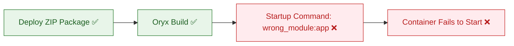

# Lab: Deployment Succeeded but Startup Failed

Reproduce the most common App Service Linux beginner confusion: CI/CD shows a successful deployment, but the app is unavailable because the startup command is incorrect.

## Objective

Deploy a valid Python/Flask application to Azure App Service Linux where Oryx build succeeds, then observe runtime failure caused only by a bad startup command (`wrong_module:app`).

## Failure Flow



## Prerequisites

- Azure subscription
- Azure CLI installed and logged in
- Bash shell

## Deploy

```bash
# Create resource group
az group create --name rg-lab-startup --location koreacentral

# Deploy lab infrastructure (B1 Linux App Service + Python 3.11)
az deployment group create \
  --resource-group rg-lab-startup \
  --template-file lab-guides/deployment-succeeded-startup-failed/main.bicep \
  --parameters baseName=labstart

# Capture deployed web app name
APP_NAME=$(az webapp list --resource-group rg-lab-startup --query "[0].name" --output tsv)
```

## Trigger the Symptom

```bash
bash lab-guides/deployment-succeeded-startup-failed/trigger.sh rg-lab-startup "$APP_NAME"
```

What this script does:

1. Deploys the app code via `az webapp deploy` (deployment succeeds).
2. Calls `/health` and shows failure (often HTTP 503 or timeout).
3. Fixes startup command to `gunicorn --bind=0.0.0.0:8000 app:app`.
4. Calls `/health` again and shows recovery (HTTP 200).

## Observe

Run verification to confirm startup-failure fingerprints in console logs:

```bash
bash lab-guides/deployment-succeeded-startup-failed/verify.sh rg-lab-startup
```

Manual KQL query:

```kusto
AppServiceConsoleLogs
| where TimeGenerated > ago(2h)
| where ResultDescription has_any ("ModuleNotFoundError", "wrong_module", "No module named")
| project TimeGenerated, ResultDescription
| order by TimeGenerated desc
```

## Expected Signals

- `az webapp deploy` returns success
- App endpoint still fails before startup fix (503/timeout)
- Console logs show startup import errors referencing `wrong_module`
- App becomes healthy after updating startup command

## Key Insight

Deployment and startup are separate phases. Oryx build success means the package was built and deployed, not that your runtime command can start the app process.

## Clean Up

```bash
az group delete --name rg-lab-startup --yes --no-wait
```

## References

- [Configure a Linux Python app for Azure App Service](https://learn.microsoft.com/en-us/azure/app-service/configure-language-python)
- [Configure a custom container for Azure App Service](https://learn.microsoft.com/en-us/azure/app-service/configure-custom-container)
- [Quickstart: Create Bicep files with Visual Studio Code](https://learn.microsoft.com/en-us/azure/azure-resource-manager/bicep/quickstart-create-bicep-use-visual-studio-code)
- [Enable diagnostic logging for apps in Azure App Service](https://learn.microsoft.com/en-us/azure/app-service/troubleshoot-diagnostic-logs)
