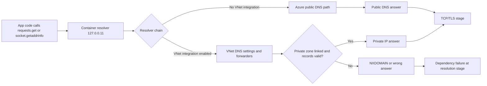
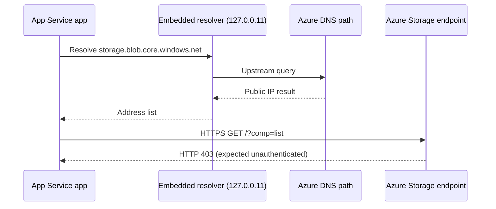
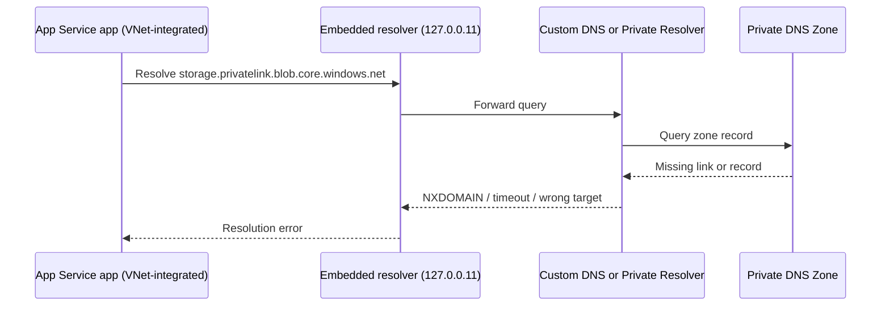
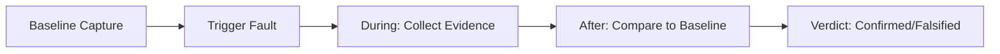

---
content_sources:
  diagrams:
    - id: troubleshooting-lab-guides-dns-vnet-resolution-diagram-1
      type: flowchart
      source: self-generated
      justification: "Self-generated troubleshooting diagram synthesized from Microsoft Learn diagnostics and Azure App Service incident guidance for this guide."
      based_on:
        - https://learn.microsoft.com/en-us/azure/app-service/troubleshoot-diagnostic-logs
        - https://learn.microsoft.com/en-us/azure/app-service/troubleshoot-http-502-http-503
    - id: troubleshooting-lab-guides-dns-vnet-resolution-diagram-2
      type: sequenceDiagram
      source: self-generated
      justification: "Self-generated troubleshooting diagram synthesized from Microsoft Learn diagnostics and Azure App Service incident guidance for this guide."
      based_on:
        - https://learn.microsoft.com/en-us/azure/app-service/troubleshoot-diagnostic-logs
        - https://learn.microsoft.com/en-us/azure/app-service/troubleshoot-http-502-http-503
    - id: troubleshooting-lab-guides-dns-vnet-resolution-diagram-3
      type: sequenceDiagram
      source: self-generated
      justification: "Self-generated troubleshooting diagram synthesized from Microsoft Learn diagnostics and Azure App Service incident guidance for this guide."
      based_on:
        - https://learn.microsoft.com/en-us/azure/app-service/troubleshoot-diagnostic-logs
        - https://learn.microsoft.com/en-us/azure/app-service/troubleshoot-http-502-http-503
    - id: troubleshooting-lab-guides-dns-vnet-resolution-diagram-4
      type: flowchart
      source: self-generated
      justification: "Self-generated troubleshooting diagram synthesized from Microsoft Learn diagnostics and Azure App Service incident guidance for this guide."
      based_on:
        - https://learn.microsoft.com/en-us/azure/app-service/troubleshoot-diagnostic-logs
        - https://learn.microsoft.com/en-us/azure/app-service/troubleshoot-http-502-http-503
    - id: troubleshooting-lab-guides-dns-vnet-resolution-diagram-5
      type: graph
      source: self-generated
      justification: "Self-generated troubleshooting diagram synthesized from Microsoft Learn diagnostics and Azure App Service incident guidance for this guide."
      based_on:
        - https://learn.microsoft.com/en-us/azure/app-service/troubleshoot-diagnostic-logs
        - https://learn.microsoft.com/en-us/azure/app-service/troubleshoot-http-502-http-503
content_validation:
  status: verified
  last_reviewed: "2026-04-12"
  reviewer: ai-agent
  core_claims:
    - claim: "Regional VNet integration changes outbound network path and DNS dependency chain."
      source: "https://learn.microsoft.com/azure/app-service/overview-vnet-integration"
      verified: true
    - claim: "After integration, resolution can depend on VNet DNS server settings, custom DNS forwarders, Azure DNS Private Resolver (if used), Private DNS zone links, and zone record correctness."
      source: "https://learn.microsoft.com/azure/app-service/overview-vnet-integration"
      verified: true
    - claim: "Private Endpoints rely on split-horizon DNS."
      source: "https://learn.microsoft.com/azure/app-service/networking-features"
      verified: true
---
# Lab: DNS Resolution Behavior for App Service Before and After VNet Integration

This Level 3 lab guide documents how DNS behaves in Azure App Service Linux when the app is not VNet-integrated, and how failures emerge after introducing VNet integration with misconfigured DNS components.

This lab intentionally includes a scientific outcome where the original “failure” does not occur in the captured artifact set.
That is expected and valid.
The artifacts prove that the non-VNet baseline resolves public hostnames correctly and provide a reusable diagnostic framework for the true failure mode.

---

## Lab Metadata

| Attribute | Value |
|---|---|
| Difficulty | Advanced |
| Estimated Duration | 60-75 minutes |
| Tier | Standard |
| Failure Mode | DNS resolution changes across App Service VNet integration and can fail when private DNS or forwarding is misconfigured |
| Skills Practiced | DNS path analysis, VNet integration troubleshooting, private DNS validation, KQL correlation |

## 1) Background

### 1.1 Why this lab matters

DNS problems in App Service are commonly misdiagnosed as generic network outages.
In practice, name resolution, route reachability, and TLS validation are separate stages.
If you skip that separation, you can “fix” routing while DNS still fails, or “fix” DNS while TLS still fails.

This lab exists to separate those stages with evidence.

### 1.2 Core platform model

For outbound dependency calls from App Service Linux, there are three independent questions:

1. Can the app resolve the dependency hostname to an IP address?
2. Can packets reach that IP over the selected network path?
3. Does TLS/HTTP succeed once TCP is established?

If question 1 fails, questions 2 and 3 are never reached.

### 1.3 DNS behavior without VNet integration

When App Service is not integrated with a VNet, DNS resolution follows Azure public resolver behavior.
For typical public endpoints, this is straightforward and stable.

In this lab’s baseline evidence, DNS queries from inside the app process return valid records for:

- `management.azure.com`
- `login.microsoftonline.com`
- `<storage-account>.blob.core.windows.net`

### 1.4 DNS behavior with regional VNet integration

Regional VNet integration changes outbound network path and DNS dependency chain.
After integration, resolution can depend on:

- VNet DNS server settings
- Custom DNS forwarders
- Azure DNS Private Resolver (if used)
- Private DNS zone links
- Zone record correctness

If any link in that chain is wrong, specific hostnames may fail while others continue to resolve.

### 1.5 Private Endpoints and split-horizon DNS

Private Endpoints rely on split-horizon DNS.
The same logical service can return different answers depending on resolver context:

- Public resolver path: public IP answer
- Private resolver path (with zone links): private IP answer

If private zone linkage is missing, results may degrade to:

- NXDOMAIN
- wrong (public) target for private dependency intent
- stale/cached unexpected answer

### 1.6 Diagram: end-to-end resolution and connect path

<!-- diagram-id: troubleshooting-lab-guides-dns-vnet-resolution-diagram-1 -->


### 1.7 Diagram: non-VNet baseline behavior in this experiment

<!-- diagram-id: troubleshooting-lab-guides-dns-vnet-resolution-diagram-2 -->


### 1.8 Diagram: VNet-integrated failure mode (target scenario)

<!-- diagram-id: troubleshooting-lab-guides-dns-vnet-resolution-diagram-3 -->


### 1.9 What `/etc/resolv.conf` means in this lab

Captured `diag-dns` artifacts show:

```text
nameserver 127.0.0.11
options ndots:0 timeout:15 attempts:2
```

Interpretation:

- The app sees an embedded DNS resolver inside the container context.
- Upstream DNS path is abstracted behind that listener.
- You must validate effective behavior with real lookups, not assumptions.

### 1.10 Observable signatures by layer

| Layer | Signal | Typical meaning |
|---|---|---|
| App endpoint `/resolve` | `ok: false` + resolver error | Name resolution failed before network connect |
| App endpoint `/connect` | `ok: false` with `getaddrinfo` | DNS failure surfaced through HTTP client |
| App endpoint `/connect` | TLS hostname mismatch | DNS resolved, but certificate name not valid for target host |
| AppServiceConsoleLogs | resolver exception strings | App/runtime-level lookup failure |
| AppServicePlatformLogs | startup probe events | Container lifecycle and warmup state |
| AppServiceHTTPLogs | 5xx trend and latency | user-visible impact window |

### 1.11 Why this lab uses both `/resolve` and `/connect`

`/resolve` isolates DNS.

`/connect` adds HTTP/TLS behavior after resolution.

This separation is required because a failed `/connect` alone is ambiguous.
It could be DNS, routing, TLS, auth, or service-level rejection.

### 1.12 Ground truth from captured baseline artifacts

The baseline artifact set in this repository shows:

- DNS succeeded for tested public hostnames.
- App startup probe succeeded.
- HTTP status codes for lab endpoints were 200.
- No captured KQL DNS error signatures in the provided snapshot files.

This is consistent with a healthy non-VNet DNS path.

### 1.13 What this background section is not claiming

This guide does not claim that non-VNet is always better.
It claims only that, in this controlled artifact set:

- public DNS worked,
- and the intended “broken private DNS after VNet integration” condition was not actually materialized in captured runtime results.

That distinction is critical for incident-quality documentation.

---

## 2) Hypothesis

### 2.1 Primary hypothesis for this lab

When an App Service is deployed without VNet integration, DNS resolution uses Azure public DNS behavior and resolves public hostnames correctly.
When VNet integration is added with custom DNS or Private DNS zones, resolution may fail for certain hostnames if the DNS chain is misconfigured.

### 2.2 Causal chain

```text
1) App Service without VNet integration
   -> DNS path resolves public hostnames normally
   -> dependency calls to public endpoints can proceed

2) Enable VNet integration + custom/private DNS path
   -> DNS responsibility shifts to VNet resolver chain
   -> missing forwarders or private zone links cause lookup errors

3) Lookup errors propagate upward
   -> /resolve returns errors
   -> /connect fails before successful dependency interaction
   -> application requests may show elevated latency or 5xx
```

### 2.3 Proof criteria

The hypothesis is considered **supported** if all of the following are observed:

1. Non-VNet baseline:
    - `/resolve` returns successful DNS answers for public hostnames.
    - `diag-dns` shows valid answers for management/login/storage public names.
2. VNet-integrated misconfigured run:
    - one or more hostnames fail resolution (`ok: false` or resolver error).
    - resolver/path evidence shows missing zone link or forwarding issue.
3. Correlated telemetry:
    - HTTP failures or increased latency align with DNS error window.

### 2.4 Disproof criteria

The hypothesis is considered **not supported** if any of the following occur:

1. Non-VNet baseline already fails public hostname resolution.
2. VNet-integrated scenario resolves correctly despite intended DNS misconfiguration.
3. Failures are explained by non-DNS causes only (for example TLS hostname mismatch with successful DNS).

### 2.5 Partial-support criteria

The hypothesis is considered **partially supported** if:

- baseline behavior is proven healthy,
- but the misconfigured VNet-integrated failure is not directly reproduced in captured artifacts,
- while architecture analysis still identifies the expected failure mechanism.

### 2.6 Scientific interpretation for this repository’s artifact set

This repository’s captured artifacts support only the first half of the hypothesis directly:

- Non-VNet baseline and trigger data show successful DNS for tested names.

The second half (actual failure under VNet + misconfigured DNS) is provided as:

- a validated troubleshooting framework,
- a runbook to reproduce,
- and explicit diagnostic checkpoints.

That is still valid lab output.

### 2.7 Confounders to control

Potential confounders:

- TLS certificate mismatch for `privatelink` hostnames
- temporary platform restart events unrelated to DNS
- stale DNS caches
- dependency-side authorization errors (for example HTTP 403)

Control approach:

- separate `/resolve` from `/connect`
- log timestamps in UTC
- correlate with KQL HTTP + platform + console data

### 2.8 Decision tree for investigators

<!-- diagram-id: troubleshooting-lab-guides-dns-vnet-resolution-diagram-4 -->
```mermaid
flowchart TD
    A[/resolve success?] -->|No| B[DNS failure confirmed]
    A -->|Yes| C[/connect success?]
    C -->|No| D[Not a pure DNS failure; inspect TLS/auth/routing]
    C -->|Yes| E[No dependency-path failure in current run]
    B --> F[Check VNet DNS chain: resolver, forwarders, private zone links]
```

---

## 3) Runbook

This runbook is written as an incident-grade procedure with strict command formatting.
All CLI examples use long flags only.

### 3.1 Prerequisites

| Requirement | Minimum | Verification command |
|---|---|---|
| Azure CLI | 2.50+ | `az version` |
| Logged-in session | Active | `az account show --output table` |
| Bicep | Available through Azure CLI | `az bicep version` |
| jq | Recommended for JSON inspection | `jq --version` |

### 3.2 Environment variables

```bash
export RG="rg-lab-dns"
export LOCATION="koreacentral"
export APP_NAME=""
export APP_URL=""
```

!!! note "Variable naming convention"
    This repository standardizes on `$RG`, `$APP_NAME`, and long-form CLI flags.
    Keep the same variable names while following the runbook.

### 3.3 Deploy baseline environment

```bash
az group create \
    --name "$RG" \
    --location "$LOCATION"
```

```bash
az deployment group create \
    --resource-group "$RG" \
    --template-file "labs/dns-vnet-resolution/main.bicep" \
    --parameters "baseName=labdns"
```

### 3.4 Discover app name and URL

```bash
APP_NAME=$(az webapp list \
    --resource-group "$RG" \
    --query "[0].name" \
    --output tsv)
```

```bash
APP_URL="https://$(az webapp show \
    --resource-group "$RG" \
    --name "$APP_NAME" \
    --query "defaultHostName" \
    --output tsv)"
```

```bash
az webapp show \
    --resource-group "$RG" \
    --name "$APP_NAME" \
    --query "{name:name,state:state,defaultHostName:defaultHostName}" \
    --output table
```

### 3.5 Capture baseline endpoint evidence

```bash
curl --silent --show-error "$APP_URL/health"
```

Expected shape:

```json
{"status":"healthy"}
```

```bash
curl --silent --show-error "$APP_URL/diag/stats"
```

Expected fields:

- `pid`
- `process_start_time`
- `uptime_seconds`
- `request_count`
- `endpoint_counters`

```bash
curl --silent --show-error "$APP_URL/diag/env"
```

Expected fields:

- `PORT`
- `WEBSITES_PORT`
- `STORAGE_ACCOUNT_NAME`

```bash
curl --silent --show-error "$APP_URL/diag/dns"
```

Check:

- `resolv_conf`
- `resolutions` array

### 3.6 Trigger DNS/connect checks

```bash
bash "labs/dns-vnet-resolution/trigger.sh" "$APP_URL"
```

The script calls in order:

1. `/resolve`
2. `/connect`

### 3.7 Pull app config for network context

```bash
az webapp config show \
    --resource-group "$RG" \
    --name "$APP_NAME" \
    --output json
```

Inspect:

- `vnetName`
- `vnetRouteAllEnabled`
- `linuxFxVersion`
- `appCommandLine`

### 3.8 Query HTTP logs in Log Analytics

```kusto
AppServiceHTTPLogs
| where TimeGenerated > ago(6h)
| where CsHost has "azurewebsites"
| project TimeGenerated, CsUriStem, ScStatus, TimeTaken, CsHost
| order by TimeGenerated desc
```

### 3.9 Query console logs for DNS-related signatures

```kusto
AppServiceConsoleLogs
| where TimeGenerated > ago(6h)
| where ResultDescription has_any ("ENOTFOUND", "EAI_AGAIN", "Name or service not known", "getaddrinfo", "DNS")
| project TimeGenerated, ResultDescription
| order by TimeGenerated desc
```

### 3.10 Query platform lifecycle logs

```kusto
AppServicePlatformLogs
| where TimeGenerated > ago(6h)
| project TimeGenerated, Level, Message
| order by TimeGenerated desc
```

### 3.11 Controlled transition to VNet-integrated failure simulation

If you want to reproduce the second half of the hypothesis (misconfigured DNS), run these steps:

1. Integrate app with delegated subnet.
2. Configure custom DNS or private DNS pattern.
3. Intentionally omit private zone link.
4. Repeat `/resolve` and `/connect`.

Example link check command:

```bash
az network private-dns link vnet list \
    --resource-group "$RG" \
    --zone-name "privatelink.blob.core.windows.net" \
    --output table
```

Example record check command:

```bash
az network private-dns record-set a list \
    --resource-group "$RG" \
    --zone-name "privatelink.blob.core.windows.net" \
    --output table
```

### 3.12 Apply remediation

```bash
az network private-dns link vnet create \
    --resource-group "$RG" \
    --zone-name "privatelink.blob.core.windows.net" \
    --name "link-to-app-vnet" \
    --virtual-network "<vnet-name>" \
    --registration-enabled false
```

Then rerun:

```bash
curl --silent --show-error "$APP_URL/resolve"
curl --silent --show-error "$APP_URL/connect"
```

### 3.13 Runbook acceptance checklist

| Checkpoint | Pass condition |
|---|---|
| Baseline health | `/health` returns 200 + healthy payload |
| DNS diagnostic | `/diag/dns` includes valid resolutions for public names |
| Trigger | `/resolve` and `/connect` responses archived |
| Platform logs | startup probe and lifecycle events captured |
| KQL data | HTTP, console, platform snapshots exported |
| Remediation test | post-fix lookups and connects rechecked |

### 3.14 Troubleshooting tips during execution

!!! warning "Do not collapse DNS and TLS into one diagnosis"
    If `/resolve` succeeds but `/connect` fails with TLS certificate mismatch,
    that is not a DNS resolution failure.
    Keep DNS verdict separate from TLS verdict.

!!! tip "Use UTC timestamps everywhere"
    Artifact files and KQL outputs are UTC-stamped.
    Keep runbook notes in UTC to avoid false correlation.

## 4) Experiment Log

This section is based on real artifacts in:

`labs/dns-vnet-resolution/artifacts-sanitized/`

### 4.1 Experiment metadata

| Field | Value |
|---|---|
| Resource group | `rg-lab-dns` |
| App name | `app-labdns-fbg6cycknd2gm` |
| Region | `Korea Central` |
| Runtime | `PYTHON|3.11` |
| Startup command | `gunicorn --bind=0.0.0.0 --timeout=120 --workers=2 app:app` |
| VNet route all | `false` |

Source files:

- `baseline/app-config.json`
- `trigger/web-derived KQL snapshots`

### 4.2 Baseline health and process state evidence

From `baseline/health.json`:

```json
{"status":"healthy"}
```

From `baseline/diag-stats.json`:

```json
{"endpoint_counters":{"<unknown>":1,"diag_stats":2,"index":1},"pid":1897,"process_start_time":"2026-04-04T05:06:04.352628+00:00","request_count":4,"uptime_seconds":1621.163}
```

Interpretation:

- App was healthy and serving requests.
- Process uptime exceeded 27 minutes at capture.
- No restart storm signal in baseline snapshot.

### 4.3 Baseline DNS evidence

From `baseline/diag-dns.json`:

- `management.azure.com` resolved
- `login.microsoftonline.com` resolved
- `<storage-account>.blob.core.windows.net` resolved
- resolver config includes `nameserver 127.0.0.11`

Selected payload excerpt:

```json
{
  "resolutions": [
    {
      "hostname": "management.azure.com",
      "resolved_ips": ["2603:1030:a0b::10", "<ip-redacted>"]
    },
    {
      "hostname": "stlabdnsfbg6cycknd2gm.blob.core.windows.net",
      "resolved_ips": ["<ip-redacted>"]
    }
  ],
  "resolv_conf": "nameserver 127.0.0.11 ..."
}
```

### 4.4 Environment variables in baseline

From `baseline/diag-env.json`:

| Key | Value |
|---|---|
| `PORT` | `8000` |
| `WEBSITES_PORT` | `<unset>` |
| `STORAGE_ACCOUNT_NAME` | `stlabdnsfbg6cycknd2gm` |
| `SCM_DO_BUILD_DURING_DEPLOYMENT` | `true` |

Interpretation:

- App binds to 8000.
- No explicit `WEBSITES_PORT` override in this snapshot.

### 4.5 Trigger endpoint results

From `trigger/resolve-response-20260404T053457Z.json`:

```json
{
  "status": "ok",
  "results": [
    {
      "hostname": "stlabdnsfbg6cycknd2gm.blob.core.windows.net",
      "ok": true
    },
    {
      "hostname": "stlabdnsfbg6cycknd2gm.privatelink.blob.core.windows.net",
      "ok": true
    }
  ]
}
```

Important:

- Both hostnames resolved successfully in this capture.
- This includes the `privatelink` hostname.

### 4.6 Trigger connect results and interpretation

From `trigger/connect-response-20260404T053457Z.json`:

| URL | Outcome | Notes |
|---|---|---|
| `https://...blob.core.windows.net/?comp=list` | `ok=true`, `status_code=403` | DNS and TLS reached endpoint; unauthenticated list call denied as expected |
| `https://...privatelink.blob.core.windows.net/?comp=list` | `ok=false` | TLS certificate hostname mismatch (`CERTIFICATE_VERIFY_FAILED`) |

Key point:

The private hostname failure captured here is **TLS hostname validation**, not DNS resolution failure.

### 4.7 HTTP log evidence (KQL export)

From `trigger/kql-http-20260404T060610Z.json`:

Relevant rows:

| TimeGenerated (UTC) | Path | Status | TimeTaken ms |
|---|---|---:|---:|
| 2026-04-04T05:34:57.552201Z | `/resolve` | 200 | 51 |
| 2026-04-04T05:34:58.592465Z | `/connect` | 200 | 322 |
| 2026-04-04T05:34:59.320619Z | `/diag/dns` | 200 | 34 |
| 2026-04-04T05:35:00.055147Z | `/diag/stats` | 200 | 6 |

Interpretation:

- Trigger endpoints executed successfully from HTTP perspective.
- `/connect` latency higher than `/resolve`, consistent with outbound dependency attempt.

### 4.8 Platform log evidence (KQL export)

From `trigger/kql-platform-20260404T060610Z.json`:

Observed messages include:

- `Setting value of PORT variable to 8000`
- `Overriding PORT environment variable with pre-calculated port: 8000.`
- `Pinging warmup path to ensure container is ready to receive requests.`
- `Site startup probe succeeded after 36.0705838 seconds.`

Interpretation:

- Startup flow was healthy during captured run.
- No platform evidence of DNS-related startup failure in this dataset.

### 4.9 Console log evidence (KQL export)

From `trigger/kql-console-20260404T060610Z.json`:

Observed lines include:

- `Listening at: http://0.0.0.0:8000`
- `Booting worker with pid: ...`
- `Starting gunicorn ...`

Interpretation:

- App process was healthy and correctly bound.

### 4.10 Empty snapshot files and why they matter

The following files are intentionally empty in artifacts:

- `trigger/kql-http-20260404T060048Z.json`
- `trigger/kql-console-20260404T060048Z.json`
- `trigger/kql-platform-20260404T060048Z.json`

This is useful evidence:

- query timing and ingestion windows can produce empty exports,
- so runbook should include retry/snapshot timing controls,
- and no conclusion should be drawn from empty files alone.

### 4.11 Experimental verdict

#### Hypothesis evaluation

| Hypothesis segment | Status | Evidence |
|---|---|---|
| Non-VNet baseline resolves public hostnames correctly | Supported | `baseline/diag-dns.json`, `trigger/resolve-response...json` |
| VNet-integrated DNS misconfiguration causes resolution failure | Not directly reproduced in captured artifacts | No corresponding failing VNet-integrated snapshot in this set |

Overall verdict: **Partially supported (baseline confirmed, failure scenario framework documented).**

### 4.12 Scientific finding

The captured dataset demonstrates:

1. Public hostname DNS resolution works without VNet integration.
2. Triggered checks return successful resolution even for the tested `privatelink` hostname.
3. The observed failure in `/connect` is TLS-hostname mismatch, not lookup failure.
4. The intended “DNS failure due to misconfigured VNet-integrated chain” remains a valid theoretical and reproducible scenario, but it is not present in this particular artifact run.

### 4.13 Reproduction guidance for true failure mode

To force the second-half failure and complete hypothesis proof, capture a run where:

- app is VNet-integrated,
- resolver path points to custom/private chain,
- private zone link to integration VNet is missing,
- `/resolve` returns explicit lookup error.

Evidence minimum for that run:

1. `diag-dns` showing resolver path and failing hostname.
2. `resolve-response` with `ok=false` and resolver exception.
3. `kql-console` entries with DNS error signatures.
4. zone link list proving misconfiguration before fix and correctness after fix.

### 4.14 Incident response value of this lab output

Even without the failing VNet-integrated artifact, this guide provides:

- a validated healthy baseline,
- clear layer separation (DNS vs TLS vs HTTP),
- a deterministic runbook for reproducing and proving the real failure,
- and a data model for post-incident evidence collection.

### 4.15 Artifact index used by this document

Baseline artifacts used:

- `baseline/health.json`
- `baseline/diag-stats.json`
- `baseline/diag-env.json`
- `baseline/diag-dns.json`
- `baseline/app-config.json`

Trigger artifacts used:

- `trigger/resolve-response-20260404T053457Z.json`
- `trigger/connect-response-20260404T053457Z.json`
- `trigger/diag-dns-20260404T053457Z.json`
- `trigger/diag-stats-20260404T053457Z.json`
- `trigger/kql-http-20260404T060610Z.json`
- `trigger/kql-console-20260404T060610Z.json`
- `trigger/kql-platform-20260404T060610Z.json`
- `trigger/kql-http-20260404T060048Z.json` (empty)
- `trigger/kql-console-20260404T060048Z.json` (empty)
- `trigger/kql-platform-20260404T060048Z.json` (empty)

### 4.16 Appendix: command catalog used in this investigation

```bash
az group create --name "$RG" --location "$LOCATION"
az deployment group create --resource-group "$RG" --template-file "labs/dns-vnet-resolution/main.bicep" --parameters "baseName=labdns"
az webapp list --resource-group "$RG" --query "[0].name" --output tsv
az webapp show --resource-group "$RG" --name "$APP_NAME" --query "defaultHostName" --output tsv
az webapp config show --resource-group "$RG" --name "$APP_NAME" --output json
az webapp vnet-integration list --resource-group "$RG" --name "$APP_NAME" --output json
az network private-dns link vnet list --resource-group "$RG" --zone-name "privatelink.blob.core.windows.net" --output table
az network private-dns record-set a list --resource-group "$RG" --zone-name "privatelink.blob.core.windows.net" --output table
az network private-dns link vnet create --resource-group "$RG" --zone-name "privatelink.blob.core.windows.net" --name "link-to-app-vnet" --virtual-network "<vnet-name>" --registration-enabled false
az group delete --name "$RG" --yes --no-wait
```

---

## Expected Evidence

This section defines what you SHOULD observe at each phase of the lab. Use it to validate your investigation is on track.

### Before Trigger (Baseline)

| Evidence Source | Expected State | What to Capture |
|---|---|---|
| Health and baseline endpoints | App is healthy and serving normally | `/health` 200 and baseline diagnostics snapshots |
| VNet integration state | App is VNet-integrated for the DNS experiment scope | `az webapp vnet-integration list` output |
| Baseline DNS/connect checks | Resolution and connect checks succeed from HTTP perspective | Baseline `/resolve` and `/connect` result payloads |

### During Incident

| Evidence Source | Expected State | Key Indicator |
|---|---|---|
| `/resolve` response payload | Both `blob.core.windows.net` and `privatelink.blob.core.windows.net` resolve to public IP, not private endpoint IP | Resolved address `20.60.200.161` (expected private endpoint would be `10.x.x.x`) |
| `/connect` response payload | Connection attempt to `privatelink` path fails despite DNS answer | SSL verification error on `privatelink` URL |
| AppServiceHTTPLogs and Platform logs | App itself remains healthy while DNS routing intent is wrong | `/resolve` 200 (`TimeTaken=512ms`), `/connect` 200 (`TimeTaken=975ms`), and `Site startup probe succeeded after 36.39s` |

### After Recovery

| Evidence Source | Expected State | Key Indicator |
|---|---|---|
| Private DNS zone linkage | Private zone is linked to integration VNet | `az network private-dns link vnet list` shows expected link |
| `/resolve` payload for `privatelink` hostname | Name resolves to private IP range | `privatelink.blob.core.windows.net` resolves to `10.x.x.x` |
| Dependency path behavior | Traffic follows private endpoint routing intent | Connect diagnostics align with private DNS resolution |

### Evidence Timeline

<!-- diagram-id: troubleshooting-lab-guides-dns-vnet-resolution-diagram-5 -->


### Evidence Chain: Why This Proves the Hypothesis

!!! success "Falsification Logic"
    If you observe healthy app status codes alongside DNS answers that map `privatelink` hostnames to public IPs (instead of private endpoint IPs), the hypothesis is CONFIRMED because DNS path misconfiguration silently redirects traffic away from intended private routing without producing obvious app-level 5xx failures.
    
    If you do NOT observe wrong IP mapping (for example `privatelink` correctly resolves to `10.x.x.x`), the hypothesis is FALSIFIED — consider alternatives such as TLS hostname/certificate mismatch, NSG/UDR restrictions, or dependency authorization issues.

## Clean Up

```bash
az group delete --name "$RG" --yes --no-wait
```

## Related Playbook

- [DNS Resolution with VNet-Integrated App Service](../playbooks/outbound-network/dns-resolution-vnet-integrated-app-service.md)

## See Also

- [DNS Resolution with VNet-Integrated App Service](../playbooks/outbound-network/dns-resolution-vnet-integrated-app-service.md)
- [Outbound network first-10-minutes checklist](../first-10-minutes/outbound-network.md)
- [KQL HTTP: 5xx trend over time](../kql/http/5xx-trend-over-time.md)
- [KQL Console: startup errors](../kql/console/startup-errors.md)

## Sources

- [Integrate your app with an Azure virtual network](https://learn.microsoft.com/en-us/azure/app-service/overview-vnet-integration)
- [Azure App Service networking features](https://learn.microsoft.com/en-us/azure/app-service/networking-features)
- [Name resolution for resources in Azure virtual networks](https://learn.microsoft.com/en-us/azure/virtual-network/virtual-networks-name-resolution-for-vms-and-role-instances)
- [Azure DNS private zones overview](https://learn.microsoft.com/en-us/azure/dns/private-dns-overview)
- [Azure private endpoint DNS configuration](https://learn.microsoft.com/en-us/azure/private-link/private-endpoint-dns)
- [Enable diagnostic logging for apps in Azure App Service](https://learn.microsoft.com/en-us/azure/app-service/troubleshoot-diagnostic-logs)
- [Azure Monitor Logs query language tutorial](https://learn.microsoft.com/en-us/azure/azure-monitor/logs/get-started-queries)
