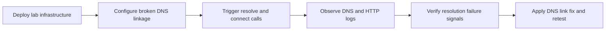

# Lab: DNS Resolution Failure in VNet-Integrated App Service

Reproduce DNS resolution and outbound connection failures in Azure App Service Linux by deploying a VNet-integrated Python app with an intentionally broken Private DNS configuration.



## Objective

Deploy an App Service connected to a delegated subnet, then force DNS failures to a Storage Private Endpoint by omitting the Private DNS Zone VNet link.

## Prerequisites

- Azure subscription
- Azure CLI installed and logged in
- Bash shell

## Deploy

```bash
# Create resource group
az group create --name rg-lab-dns --location koreacentral

# Deploy lab infrastructure (intentionally broken DNS linkage)
az deployment group create \
  --resource-group rg-lab-dns \
  --template-file lab-guides/dns-vnet-resolution/main.bicep \
  --parameters baseName=labdns
```

## Trigger the Symptom

```bash
# Get the app URL
APP_URL=$(az webapp show --resource-group rg-lab-dns --name <app-name> --query "defaultHostName" --output tsv)

# Run the trigger script
bash lab-guides/dns-vnet-resolution/trigger.sh "https://$APP_URL"
```

## Observe

1. Open Azure Portal → App Service → Diagnose and Solve Problems.
2. Confirm outbound dependency failures after hitting `/resolve` and `/connect`.
3. Query Log Analytics for DNS signatures in console logs:

```kusto
AppServiceConsoleLogs
| where TimeGenerated > ago(1h)
| where ResultDescription has_any ("DNS", "resolve", "Name or service not known", "getaddrinfo")
| project TimeGenerated, Host, ContainerId, ResultDescription
| order by TimeGenerated desc
```

4. Query HTTP failures and latency impact:

```kusto
AppServiceHTTPLogs
| where TimeGenerated > ago(1h)
| summarize Requests = count(), Failures = countif(ScStatus >= 500), P95DurationMs = percentile(TimeTaken, 95)
    by bin(TimeGenerated, 5m), CsUriStem, SPort
| order by TimeGenerated desc
```

## Expected Signals

- `/resolve` returns DNS errors (for example `Name or service not known` or `getaddrinfo` failures)
- `/connect` shows outbound request failures to Storage blob endpoints
- AppServiceConsoleLogs contains DNS resolution error signatures
- AppServiceHTTPLogs may show elevated 5xx responses and higher `TimeTaken`

## Fix

Link the Private DNS Zone to the VNet used by App Service integration:

```bash
az network private-dns link vnet create \
  --resource-group rg-lab-dns \
  --zone-name "privatelink.blob.core.windows.net" \
  --name link-to-vnet \
  --virtual-network <vnet-name> \
  --registration-enabled false
```

After creating the VNet link, rerun `trigger.sh` and verify that DNS resolution and connectivity improve.

## Clean Up

```bash
az group delete --name rg-lab-dns --yes --no-wait
```

## Related Playbook

- [DNS Resolution with VNet-Integrated App Service](../playbooks/outbound-network/dns-resolution-vnet-integrated-app-service.md)

## References

- [Integrate your app with an Azure virtual network](https://learn.microsoft.com/en-us/azure/app-service/overview-vnet-integration)
- [Azure DNS private zones overview](https://learn.microsoft.com/en-us/azure/dns/private-dns-overview)
- [Quickstart: Create Bicep files with Visual Studio Code](https://learn.microsoft.com/en-us/azure/azure-resource-manager/bicep/quickstart-create-bicep-use-visual-studio-code)
- [Enable diagnostic logging for apps in Azure App Service](https://learn.microsoft.com/en-us/azure/app-service/troubleshoot-diagnostic-logs)
