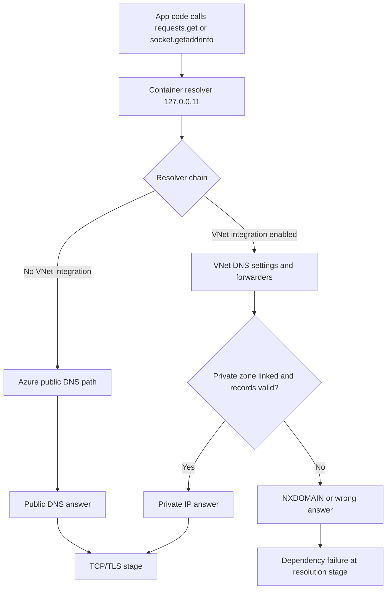
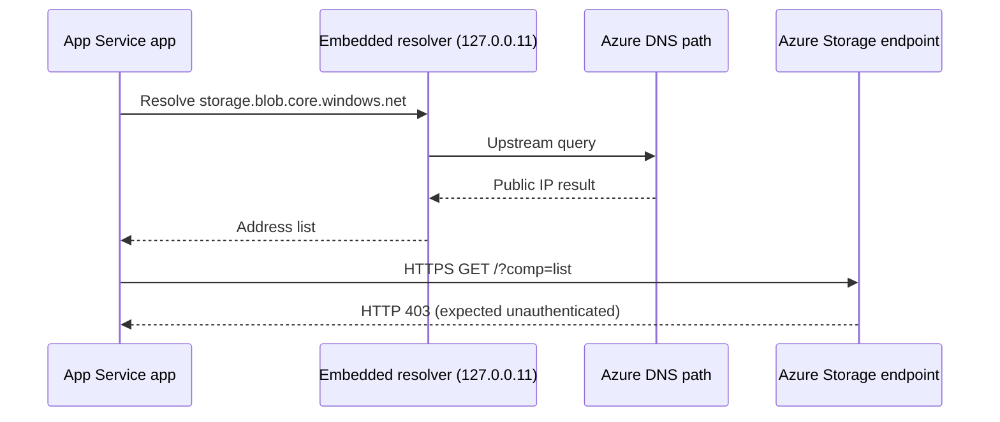
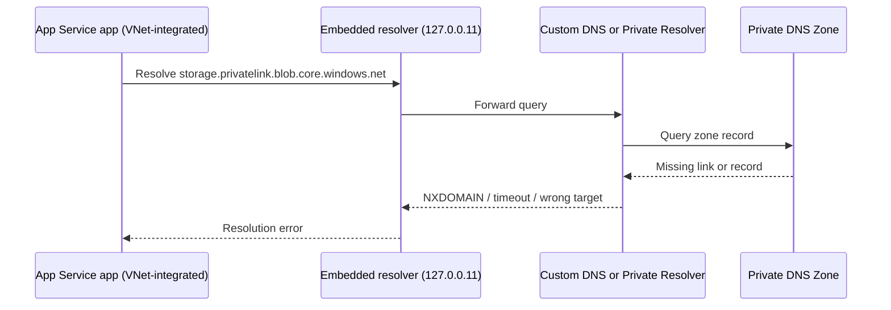
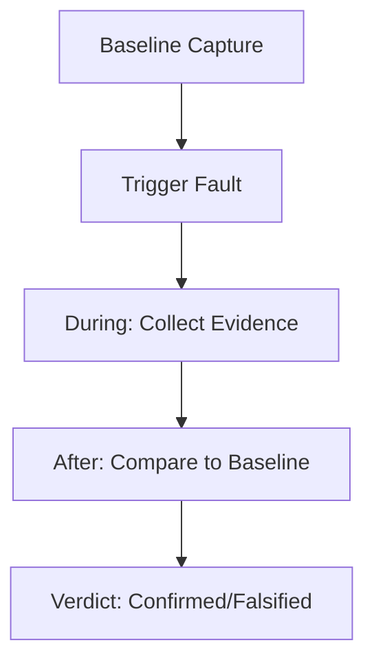

---
content_sources:
  diagrams:
    - id: troubleshooting-lab-guides-dns-vnet-resolution-diagram-1
      type: flowchart
      source: self-generated
      justification: "Self-generated troubleshooting diagram synthesized from Microsoft Learn diagnostics and Azure App Service incident guidance for this guide."
      based_on:
        - https://learn.microsoft.com/en-us/azure/app-service/troubleshoot-diagnostic-logs
        - https://learn.microsoft.com/en-us/azure/app-service/troubleshoot-http-502-http-503
    - id: troubleshooting-lab-guides-dns-vnet-resolution-diagram-2
      type: sequenceDiagram
      source: self-generated
      justification: "Self-generated troubleshooting diagram synthesized from Microsoft Learn diagnostics and Azure App Service incident guidance for this guide."
      based_on:
        - https://learn.microsoft.com/en-us/azure/app-service/troubleshoot-diagnostic-logs
        - https://learn.microsoft.com/en-us/azure/app-service/troubleshoot-http-502-http-503
    - id: troubleshooting-lab-guides-dns-vnet-resolution-diagram-3
      type: sequenceDiagram
      source: self-generated
      justification: "Self-generated troubleshooting diagram synthesized from Microsoft Learn diagnostics and Azure App Service incident guidance for this guide."
      based_on:
        - https://learn.microsoft.com/en-us/azure/app-service/troubleshoot-diagnostic-logs
        - https://learn.microsoft.com/en-us/azure/app-service/troubleshoot-http-502-http-503
    - id: troubleshooting-lab-guides-dns-vnet-resolution-diagram-4
      type: flowchart
      source: self-generated
      justification: "Self-generated troubleshooting diagram synthesized from Microsoft Learn diagnostics and Azure App Service incident guidance for this guide."
      based_on:
        - https://learn.microsoft.com/en-us/azure/app-service/troubleshoot-diagnostic-logs
        - https://learn.microsoft.com/en-us/azure/app-service/troubleshoot-http-502-http-503
    - id: troubleshooting-lab-guides-dns-vnet-resolution-diagram-5
      type: graph
      source: self-generated
      justification: "Self-generated troubleshooting diagram synthesized from Microsoft Learn diagnostics and Azure App Service incident guidance for this guide."
      based_on:
        - https://learn.microsoft.com/en-us/azure/app-service/troubleshoot-diagnostic-logs
        - https://learn.microsoft.com/en-us/azure/app-service/troubleshoot-http-502-http-503
---
# Lab: DNS Resolution Behavior for App Service Before and After VNet Integration

This Level 3 lab guide documents how DNS behaves in Azure App Service Linux when the app is not VNet-integrated, and how failures emerge after introducing VNet integration with misconfigured DNS components.

This lab intentionally includes a scientific outcome where the original “failure” does not occur in the captured artifact set.
That is expected and valid.
The artifacts prove that the non-VNet baseline resolves public hostnames correctly and provide a reusable diagnostic framework for the true failure mode.

---

## Lab Metadata

| Attribute | Value |
|---|---|
| Difficulty | Advanced |
| Estimated Duration | 60-75 minutes |
| Tier | Standard |
| Failure Mode | DNS resolution changes across App Service VNet integration and can fail when private DNS or forwarding is misconfigured |
| Skills Practiced | DNS path analysis, VNet integration troubleshooting, private DNS validation, KQL correlation |

## 1) Background

### 1.1 Why this lab matters

DNS problems in App Service are commonly misdiagnosed as generic network outages.
In practice, name resolution, route reachability, and TLS validation are separate stages.
If you skip that separation, you can “fix” routing while DNS still fails, or “fix” DNS while TLS still fails.

This lab exists to separate those stages with evidence.

### 1.2 Core platform model

For outbound dependency calls from App Service Linux, there are three independent questions:

1. Can the app resolve the dependency hostname to an IP address?
2. Can packets reach that IP over the selected network path?
3. Does TLS/HTTP succeed once TCP is established?

If question 1 fails, questions 2 and 3 are never reached.

### 1.3 DNS behavior without VNet integration

When App Service is not integrated with a VNet, DNS resolution follows Azure public resolver behavior.
For typical public endpoints, this is straightforward and stable.

In this lab’s baseline evidence, DNS queries from inside the app process return valid records for:

- `management.azure.com`
- `login.microsoftonline.com`
- `<storage-account>.blob.core.windows.net`

### 1.4 DNS behavior with regional VNet integration

Regional VNet integration changes outbound network path and DNS dependency chain.
After integration, resolution can depend on:

- VNet DNS server settings
- Custom DNS forwarders
- Azure DNS Private Resolver (if used)
- Private DNS zone links
- Zone record correctness

If any link in that chain is wrong, specific hostnames may fail while others continue to resolve.

#### Portal view: Virtual Network Integration blade (configuration entry point)

[[[ shot("troubleshooting--vnet-integration--01-vnet-integration") ]]]

The `Virtual Network Integration` blade is the Portal entry point that switches the app from the non-VNet DNS path described in section 1.3 to the VNet-integrated DNS dependency chain described above - clicking `Add virtual network integration` selects a subnet and binds the app to it, after which DNS queries route through VNet DNS settings, custom forwarders, or an Azure DNS Private Resolver instead of Azure public resolvers. This blade is distinct from the unified `Networking` blade embedded later at section 3.8 in two ways: this one is the dedicated remediation surface where you actually perform the integration action, while the `Networking` blade is the diagnostic snapshot for confirming current state. The `Disconnect` and `Troubleshoot` toolbar buttons are correctly disabled in this capture because there is no existing integration to disconnect or troubleshoot - once a subnet is bound, both buttons activate and `Troubleshoot` opens the same VNet-integration detector reachable from the `Diagnose and solve problems` blade. When this blade transitions from the placeholder shown here to a populated subnet binding, expect the failure modes described in sections 1.5 (split-horizon DNS for Private Endpoints) and 1.8 (VNet-integrated failure mode) to become reachable, which is why the after-state is the focus of this lab's hypothesis.

### 1.5 Private Endpoints and split-horizon DNS

Private Endpoints rely on split-horizon DNS.
The same logical service can return different answers depending on resolver context:

- Public resolver path: public IP answer
- Private resolver path (with zone links): private IP answer

If private zone linkage is missing, results may degrade to:

- NXDOMAIN
- wrong (public) target for private dependency intent
- stale/cached unexpected answer

### 1.6 Diagram: end-to-end resolution and connect path

<!-- diagram-id: troubleshooting-lab-guides-dns-vnet-resolution-diagram-1 -->

```mermaid
flowchart TD
    A[App code calls requests.get or socket.getaddrinfo] --> B[Container resolver 127.0.0.11]
    B --> C{Resolver chain}
    C -->|No VNet integration| D[Azure public DNS path]
    C -->|VNet integration enabled| E[VNet DNS settings and forwarders]
    D --> F[Public DNS answer]
    E --> G{Private zone linked and records valid?}
    G -->|Yes| H[Private IP answer]
    G -->|No| I[NXDOMAIN or wrong answer]
    F --> J[TCP/TLS stage]
    H --> J
    I --> K[Dependency failure at resolution stage]
```

### 1.7 Diagram: non-VNet baseline behavior in this experiment

<!-- diagram-id: troubleshooting-lab-guides-dns-vnet-resolution-diagram-2 -->

```mermaid
sequenceDiagram
    participant App as App Service app
    participant Resolver as Embedded resolver (127.0.0.11)
    participant DNS as Azure DNS path
    participant Storage as Azure Storage endpoint

    App->>Resolver: Resolve storage.blob.core.windows.net
    Resolver->>DNS: Upstream query
    DNS-->>Resolver: Public IP result
    Resolver-->>App: Address list
    App->>Storage: HTTPS GET /?comp=list
    Storage-->>App: HTTP 403 (expected unauthenticated)
```

### 1.8 Diagram: VNet-integrated failure mode (target scenario)

<!-- diagram-id: troubleshooting-lab-guides-dns-vnet-resolution-diagram-3 -->

```mermaid
sequenceDiagram
    participant App as App Service app (VNet-integrated)
    participant Resolver as Embedded resolver (127.0.0.11)
    participant Custom as Custom DNS or Private Resolver
    participant Zone as Private DNS Zone

    App->>Resolver: Resolve storage.privatelink.blob.core.windows.net
    Resolver->>Custom: Forward query
    Custom->>Zone: Query zone record
    Zone-->>Custom: Missing link or record
    Custom-->>Resolver: NXDOMAIN / timeout / wrong target
    Resolver-->>App: Resolution error
```

### 1.9 What `/etc/resolv.conf` means in this lab

Captured `diag-dns` artifacts show:

```text
nameserver 127.0.0.11
options ndots:0 timeout:15 attempts:2
```

Interpretation:

- The app sees an embedded DNS resolver inside the container context.
- Upstream DNS path is abstracted behind that listener.
- You must validate effective behavior with real lookups, not assumptions.

### 1.10 Observable signatures by layer

| Layer | Signal | Typical meaning |
|---|---|---|
| App endpoint `/resolve` | `ok: false` + resolver error | Name resolution failed before network connect |
| App endpoint `/connect` | `ok: false` with `getaddrinfo` | DNS failure surfaced through HTTP client |
| App endpoint `/connect` | TLS hostname mismatch | DNS resolved, but certificate name not valid for target host |
| AppServiceConsoleLogs | resolver exception strings | App/runtime-level lookup failure |
| AppServicePlatformLogs | startup probe events | Container lifecycle and warmup state |
| AppServiceHTTPLogs | 5xx trend and latency | user-visible impact window |

### 1.11 Why this lab uses both `/resolve` and `/connect`

`/resolve` isolates DNS.

`/connect` adds HTTP/TLS behavior after resolution.

This separation is required because a failed `/connect` alone is ambiguous.
It could be DNS, routing, TLS, auth, or service-level rejection.

### 1.12 Ground truth from captured baseline artifacts

The baseline artifact set in this repository shows:

- DNS succeeded for tested public hostnames.
- App startup probe succeeded.
- HTTP status codes for lab endpoints were 200.
- No captured KQL DNS error signatures in the provided snapshot files.

This is consistent with a healthy non-VNet DNS path.

### 1.13 What this background section is not claiming

This guide does not claim that non-VNet is always better.
It claims only that, in this controlled artifact set:

- public DNS worked,
- and the intended “broken private DNS after VNet integration” condition was not actually materialized in captured runtime results.

That distinction is critical for incident-quality documentation.

---

## 2) Hypothesis

### 2.1 Primary hypothesis for this lab

When an App Service is deployed without VNet integration, DNS resolution uses Azure public DNS behavior and resolves public hostnames correctly.
When VNet integration is added with custom DNS or Private DNS zones, resolution may fail for certain hostnames if the DNS chain is misconfigured.

### 2.2 Causal chain

```text
1) App Service without VNet integration
   -> DNS path resolves public hostnames normally
   -> dependency calls to public endpoints can proceed

2) Enable VNet integration + custom/private DNS path
   -> DNS responsibility shifts to VNet resolver chain
   -> missing forwarders or private zone links cause lookup errors

3) Lookup errors propagate upward
   -> /resolve returns errors
   -> /connect fails before successful dependency interaction
   -> application requests may show elevated latency or 5xx
```

### 2.3 Proof criteria

The hypothesis is considered **supported** if all of the following are observed:

1. Non-VNet baseline:
    - `/resolve` returns successful DNS answers for public hostnames.
    - `diag-dns` shows valid answers for management/login/storage public names.
2. VNet-integrated misconfigured run:
    - one or more hostnames fail resolution (`ok: false` or resolver error).
    - resolver/path evidence shows missing zone link or forwarding issue.
3. Correlated telemetry:
    - HTTP failures or increased latency align with DNS error window.

### 2.4 Disproof criteria

The hypothesis is considered **not supported** if any of the following occur:

1. Non-VNet baseline already fails public hostname resolution.
2. VNet-integrated scenario resolves correctly despite intended DNS misconfiguration.
3. Failures are explained by non-DNS causes only (for example TLS hostname mismatch with successful DNS).

### 2.5 Partial-support criteria

The hypothesis is considered **partially supported** if:

- baseline behavior is proven healthy,
- but the misconfigured VNet-integrated failure is not directly reproduced in captured artifacts,
- while architecture analysis still identifies the expected failure mechanism.

### 2.6 Scientific interpretation for this repository’s artifact set

This repository’s captured artifacts support only the first half of the hypothesis directly:

- Non-VNet baseline and trigger data show successful DNS for tested names.

The second half (actual failure under VNet + misconfigured DNS) is provided as:

- a validated troubleshooting framework,
- a runbook to reproduce,
- and explicit diagnostic checkpoints.

That is still valid lab output.

### 2.7 Confounders to control

Potential confounders:

- TLS certificate mismatch for `privatelink` hostnames
- temporary platform restart events unrelated to DNS
- stale DNS caches
- dependency-side authorization errors (for example HTTP 403)

Control approach:

- separate `/resolve` from `/connect`
- log timestamps in UTC
- correlate with KQL HTTP + platform + console data

### 2.8 Decision tree for investigators

<!-- diagram-id: troubleshooting-lab-guides-dns-vnet-resolution-diagram-4 -->
```mermaid
flowchart TD
    A[/resolve success?] -->|No| B[DNS failure confirmed]
    A -->|Yes| C[/connect success?]
    C -->|No| D[Not a pure DNS failure; inspect TLS/auth/routing]
    C -->|Yes| E[No dependency-path failure in current run]
    B --> F[Check VNet DNS chain: resolver, forwarders, private zone links]
```

---

## 3) Runbook

This runbook is written as an incident-grade procedure with strict command formatting.
All CLI examples use long flags only.

### 3.1 Prerequisites

| Requirement | Minimum | Verification command |
|---|---|---|
| Azure CLI | 2.50+ | `az version` |
| Logged-in session | Active | `az account show --output table` |
| Bicep | Available through Azure CLI | `az bicep version` |
| jq | Recommended for JSON inspection | `jq --version` |

### 3.2 Environment variables

```bash
export RG="rg-lab-dns"
export LOCATION="koreacentral"
export APP_NAME=""
export APP_URL=""
```

!!! note "Variable naming convention"
    This repository standardizes on `$RG`, `$APP_NAME`, and long-form CLI flags.
    Keep the same variable names while following the runbook.

### 3.3 Deploy baseline environment

```bash
az group create \
    --name "$RG" \
    --location "$LOCATION"
```

| Command | Purpose |
|---------|---------|
| `az group create --name "$RG" --location "$LOCATION"` | Creates the resource group that will hold the DNS lab resources. |
| `--name "$RG" --location "$LOCATION"` | Sets the resource group name. |
| `--location "$LOCATION"` | Places the resource group in this Azure region. |

```bash
az deployment group create \
    --resource-group "$RG" \
    --template-file "labs/dns-vnet-resolution/main.bicep" \
    --parameters "baseName=labdns"
```

| Command/Flag | Purpose |
|---|---|
| `az group create` | Create the resource group for all lab resources |
| `--name` | Resource group name |
| `--location` | Azure region for resource group deployment |
| `az deployment group create` | Deploy lab infrastructure using Bicep template |
| `--resource-group` | Target resource group for the deployment |
| `--template-file` | Path to Bicep template defining VNet, DNS zone, and app resources |
| `--parameters` | Override base name prefix for resource naming |

### 3.4 Discover app name and URL

```bash
APP_NAME=$(az webapp list \
    --resource-group "$RG" \
    --query "[0].name" \
    --output tsv)
```

| Command | Purpose |
|---------|---------|
| `az webapp list --resource-group "$RG" --query "[0].name" --output tsv` | Lists web apps in the lab resource group and returns the first app name for later DNS checks. |
| `--resource-group "$RG" --query "[0].name" --output tsv` | Limits the app list to this resource group. |
| `--query "[0].name" --output tsv` | Selects the `name` field from the first item in the returned web-app array. |
| `--output tsv` | Returns the app name as plain text for shell variable assignment. |

```bash
APP_URL="https://$(az webapp show \
    --resource-group "$RG" \
    --name "$APP_NAME" \
    --query "defaultHostName" \
    --output tsv)"
```

| Command | Purpose |
|---------|---------|
| `az webapp show --resource-group "$RG" --name "$APP_NAME" --query "defaultHostName" --output tsv` | Retrieves the app's default hostname so the runbook can build the public URL used for DNS checks. |
| `--resource-group "$RG" --name "$APP_NAME" --query "defaultHostName" --output tsv` | Looks up the app in this resource group. |
| `--name "$APP_NAME" --query "defaultHostName" --output tsv` | Targets this web app. |
| `--query "defaultHostName" --output tsv` | Projects only the `defaultHostName` field. |
| `--output tsv` | Returns the hostname as plain text for shell variable assignment. |

```bash
az webapp show \
    --resource-group "$RG" \
    --name "$APP_NAME" \
    --query "{name:name,state:state,defaultHostName:defaultHostName}" \
    --output table
```

| Command/Flag | Purpose |
|---|---|
| `az webapp show` | Display app properties to confirm deployment state |
| `--resource-group` | Resource group containing the app |
| `--name` | Web app name |
| `--query` | JMESPath expression selecting name, state, and hostname for baseline verification |
| `--output table` | Tabular format for quick visual inspection |

### 3.5 Capture baseline endpoint evidence

```bash
curl --silent --show-error "$APP_URL/health"
```

Expected shape:

```json
{"status":"healthy"}
```

```bash
curl --silent --show-error "$APP_URL/diag/stats"
```

Expected fields:

- `pid`
- `process_start_time`
- `uptime_seconds`
- `request_count`
- `endpoint_counters`

```bash
curl --silent --show-error "$APP_URL/diag/env"
```

Expected fields:

- `PORT`
- `WEBSITES_PORT`
- `STORAGE_ACCOUNT_NAME`

```bash
curl --silent --show-error "$APP_URL/diag/dns"
```

Check:

- `resolv_conf`
- `resolutions` array

### 3.6 Trigger DNS/connect checks

```bash
bash "labs/dns-vnet-resolution/trigger.sh" "$APP_URL"
```

The script calls in order:

1. `/resolve`
2. `/connect`

### 3.7 Pull app config for network context

```bash
az webapp config show \
    --resource-group "$RG" \
    --name "$APP_NAME" \
    --output json
```

| Command/Flag | Purpose |
|---|---|
| `az webapp config show` | Retrieve full app configuration including networking properties |
| `--resource-group` | Resource group containing the app |
| `--name` | Web app name |
| `--output json` | JSON output to inspect vnetName, vnetRouteAllEnabled, and DNS settings |

Inspect:

- `vnetName`
- `vnetRouteAllEnabled`
- `linuxFxVersion`
- `appCommandLine`

### 3.8 Query HTTP logs in Log Analytics

#### Portal view: Networking blade (VNet integration context)

![Azure portal Networking blade for app-test-20251107 (Web App) with toolbar Refresh, Troubleshoot, Send us your feedback and a "Check your network configuration..." description with a Learn more link. Two-column layout: Inbound traffic configuration shows Public network access "Enabled with no access restrictions (Using default behavior)", App assigned address "Not configured", Private endpoints "0 private endpoints", Inbound IPv4 addresses <ip-redacted>, and Inbound IPv6 addresses <ipv6-redacted>. Outbound traffic configuration shows Virtual network integration "Not configured", Hybrid connections "Not configured", Outbound DNS "Default (Azure-provided)", and a long Outbound IPv4 addresses list (<ip-redacted>, <ip-redacted>, <ip-redacted>, ... ~30 platform-pool addresses) plus an Outbound IPv6 addresses list. Integration subnet configuration shows NAT gateway, Network security group, and User defined route all N/A. Left nav highlights Networking (under Favorites).](../../assets/troubleshooting/networking/01-networking-hub.png)

The `Networking` blade is the Portal anchor for DNS-resolution failures: `Outbound DNS` under `Outbound traffic configuration` reveals whether the app is using `Default (Azure-provided)` resolvers or a custom Private DNS Zone, and `Virtual network integration` shows whether outbound traffic is going through a VNet at all. In this capture, `Virtual network integration: Not configured` and `Outbound DNS: Default (Azure-provided)` together mean DNS queries are using the public Azure DNS resolver - which cannot resolve `*.privatelink.<service>.azure.com` hostnames. If your KQL queries below show `ENOTFOUND` or `EAI_AGAIN` on private hostnames, this blade tells you immediately that the cause is missing VNet integration, not application code. Click the `Troubleshoot` button in the toolbar for the Networking-specific detector that walks through the same diagnosis.

```kusto
AppServiceHTTPLogs
| where TimeGenerated > ago(6h)
| where CsHost has "azurewebsites"
| project TimeGenerated, CsUriStem, ScStatus, TimeTaken, CsHost
| order by TimeGenerated desc
```

### 3.9 Query console logs for DNS-related signatures

```kusto
AppServiceConsoleLogs
| where TimeGenerated > ago(6h)
| where ResultDescription has_any ("ENOTFOUND", "EAI_AGAIN", "Name or service not known", "getaddrinfo", "DNS")
| project TimeGenerated, ResultDescription
| order by TimeGenerated desc
```

### 3.10 Query platform lifecycle logs

```kusto
AppServicePlatformLogs
| where TimeGenerated > ago(6h)
| project TimeGenerated, Level, Message
| order by TimeGenerated desc
```

### 3.11 Controlled transition to VNet-integrated failure simulation

If you want to reproduce the second half of the hypothesis (misconfigured DNS), run these steps:

1. Integrate app with delegated subnet.
2. Configure custom DNS or private DNS pattern.
3. Intentionally omit private zone link.
4. Repeat `/resolve` and `/connect`.

Example link check command:

```bash
az network private-dns link vnet list \
    --resource-group "$RG" \
    --zone-name "privatelink.blob.core.windows.net" \
    --output table
```

| Command/Flag | Purpose |
|---|---|
| `az network private-dns link vnet list` | List VNet links to verify the private DNS zone is connected to the app VNet |
| `--resource-group` | Resource group containing the private DNS zone |
| `--zone-name` | Private DNS zone to inspect (privatelink zone for the target service) |
| `--output table` | Tabular format for quick link status inspection |

Example record check command:

```bash
az network private-dns record-set a list \
    --resource-group "$RG" \
    --zone-name "privatelink.blob.core.windows.net" \
    --output table
```

| Command | Purpose |
|---------|---------|
| `az network private-dns record-set a list --resource-group "$RG" --zone-name "privatelink.blob.core.windows.net" --output table` | Lists A records in the private DNS zone so you can confirm the expected private-endpoint records exist. |
| `--resource-group "$RG" --zone-name "privatelink.blob.core.windows.net" --output table` | Looks up the private DNS zone in this resource group. |
| `--zone-name "privatelink.blob.core.windows.net" --output table` | Targets the Blob Storage private-link DNS zone. |
| `--output table` | Formats the record list as a readable table. |

### 3.12 Apply remediation

```bash
az network private-dns link vnet create \
    --resource-group "$RG" \
    --zone-name "privatelink.blob.core.windows.net" \
    --name "link-to-app-vnet" \
    --virtual-network "<vnet-name>" \
    --registration-enabled false
```

| Command | Purpose |
|---------|---------|
| `az network private-dns link vnet create --resource-group "$RG" --zone-name "privatelink.blob.core.windows.net" --name "link-to-app-vnet" --virtual-network "<vnet-name>" --registration-enabled false` | Creates the private DNS zone link that connects the Blob private-link zone to the app VNet. |
| `--resource-group "$RG" --zone-name "privatelink.blob.core.windows.net" --name "link-to-app-vnet" --virtual-network "<vnet-name>" --registration-enabled false` | Creates the link in the resource group that contains the private DNS zone. |
| `--zone-name "privatelink.blob.core.windows.net" --name "link-to-app-vnet" --virtual-network "<vnet-name>" --registration-enabled false` | Targets the Blob Storage private-link DNS zone. |
| `--name "link-to-app-vnet" --virtual-network "<vnet-name>" --registration-enabled false` | Names the VNet link `link-to-app-vnet`. |
| `--virtual-network "<vnet-name>" --registration-enabled false` | Connects this virtual network to the private DNS zone. |
| `--registration-enabled false` | Disables automatic DNS record registration on the VNet link. |

Then rerun:

```bash
curl --silent --show-error "$APP_URL/resolve"
curl --silent --show-error "$APP_URL/connect"
```

### 3.13 Runbook acceptance checklist

| Checkpoint | Pass condition |
|---|---|
| Baseline health | `/health` returns 200 + healthy payload |
| DNS diagnostic | `/diag/dns` includes valid resolutions for public names |
| Trigger | `/resolve` and `/connect` responses archived |
| Platform logs | startup probe and lifecycle events captured |
| KQL data | HTTP, console, platform snapshots exported |
| Remediation test | post-fix lookups and connects rechecked |

### 3.14 Troubleshooting tips during execution

!!! warning "Do not collapse DNS and TLS into one diagnosis"
    If `/resolve` succeeds but `/connect` fails with TLS certificate mismatch,
    that is not a DNS resolution failure.
    Keep DNS verdict separate from TLS verdict.

!!! tip "Use UTC timestamps everywhere"
    Artifact files and KQL outputs are UTC-stamped.
    Keep runbook notes in UTC to avoid false correlation.

## 4) Experiment Log

This section is based on real artifacts in:

`labs/dns-vnet-resolution/artifacts-sanitized/`

### 4.1 Experiment metadata

| Field | Value |
|---|---|
| Resource group | `rg-lab-dns` |
| App name | `app-labdns-fbg6cycknd2gm` |
| Region | `Korea Central` |
| Runtime | `PYTHON|3.11` |
| Startup command | `gunicorn --bind=0.0.0.0 --timeout=120 --workers=2 app:app` |
| VNet route all | `false` |

Source files:

- `baseline/app-config.json`
- `trigger/web-derived KQL snapshots`

### 4.2 Baseline health and process state evidence

From `baseline/health.json`:

```json
{"status":"healthy"}
```

From `baseline/diag-stats.json`:

```json
{"endpoint_counters":{"<unknown>":1,"diag_stats":2,"index":1},"pid":1897,"process_start_time":"2026-04-04T05:06:04.352628+00:00","request_count":4,"uptime_seconds":1621.163}
```

Interpretation:

- App was healthy and serving requests.
- Process uptime exceeded 27 minutes at capture.
- No restart storm signal in baseline snapshot.

### 4.3 Baseline DNS evidence

From `baseline/diag-dns.json`:

- `management.azure.com` resolved
- `login.microsoftonline.com` resolved
- `<storage-account>.blob.core.windows.net` resolved
- resolver config includes `nameserver 127.0.0.11`

Selected payload excerpt:

```json
{
  "resolutions": [
    {
      "hostname": "management.azure.com",
      "resolved_ips": ["<ip-redacted>", "<ip-redacted>"]
    },
    {
      "hostname": "stlabdnsfbg6cycknd2gm.blob.core.windows.net",
      "resolved_ips": ["<ip-redacted>"]
    }
  ],
  "resolv_conf": "nameserver 127.0.0.11 ..."
}
```

### 4.4 Environment variables in baseline

From `baseline/diag-env.json`:

| Key | Value |
|---|---|
| `PORT` | `8000` |
| `WEBSITES_PORT` | `<unset>` |
| `STORAGE_ACCOUNT_NAME` | `stlabdnsfbg6cycknd2gm` |
| `SCM_DO_BUILD_DURING_DEPLOYMENT` | `true` |

Interpretation:

- App binds to 8000.
- No explicit `WEBSITES_PORT` override in this snapshot.

### 4.5 Trigger endpoint results

From `trigger/resolve-response-20260404T053457Z.json`:

```json
{
  "status": "ok",
  "results": [
    {
      "hostname": "stlabdnsfbg6cycknd2gm.blob.core.windows.net",
      "ok": true
    },
    {
      "hostname": "stlabdnsfbg6cycknd2gm.privatelink.blob.core.windows.net",
      "ok": true
    }
  ]
}
```

Important:

- Both hostnames resolved successfully in this capture.
- This includes the `privatelink` hostname.

### 4.6 Trigger connect results and interpretation

From `trigger/connect-response-20260404T053457Z.json`:

| URL | Outcome | Notes |
|---|---|---|
| `https://...blob.core.windows.net/?comp=list` | `ok=true`, `status_code=403` | DNS and TLS reached endpoint; unauthenticated list call denied as expected |
| `https://...privatelink.blob.core.windows.net/?comp=list` | `ok=false` | TLS certificate hostname mismatch (`CERTIFICATE_VERIFY_FAILED`) |

Key point:

The private hostname failure captured here is **TLS hostname validation**, not DNS resolution failure.

### 4.7 HTTP log evidence (KQL export)

From `trigger/kql-http-20260404T060610Z.json`:

Relevant rows:

| TimeGenerated (UTC) | Path | Status | TimeTaken ms |
|---|---|---:|---:|
| 2026-04-04T05:34:57.552201Z | `/resolve` | 200 | 51 |
| 2026-04-04T05:34:58.592465Z | `/connect` | 200 | 322 |
| 2026-04-04T05:34:59.320619Z | `/diag/dns` | 200 | 34 |
| 2026-04-04T05:35:00.055147Z | `/diag/stats` | 200 | 6 |

Interpretation:

- Trigger endpoints executed successfully from HTTP perspective.
- `/connect` latency higher than `/resolve`, consistent with outbound dependency attempt.

#### 4.7.1 Log Analytics KQL query for /resolve and /connect status distribution (portal verification)

To cross-verify the §4.7 HTTP evidence (all four trigger rows return `ScStatus 200` in the sanitized `kql-http-20260404T060610Z.json`) is a real property of the raw `AppServiceHTTPLogs` rows the Log Analytics service holds and not a JSON-parse artifact of the sanitized export, the Log Analytics workspace Logs blade was opened against the same workspace from a fresh live reproduction and a status-distribution query scoped to `/resolve` and `/connect` was executed interactively against the current live data:

[[[ shot("troubleshooting--log-analytics--11-dns-vnet-http-status-distribution-kql") ]]]

**Purpose**: Provide an independent Portal-side execution of a status-distribution query scoped to the two trigger endpoints `/resolve` and `/connect` so a reviewer can confirm that the silent-success signature reported in §4.7 (all four rows `ScStatus 200`) is a real property of the raw `AppServiceHTTPLogs` rows the Log Analytics service holds — and can also see that the failure mode reproduces with the same shape (uniform 200 on both endpoints, with no 5xx tail) when the trigger is re-run against a freshly deployed lab instance, where the DNS misconfiguration at the underlying resolution layer never surfaces as an HTTP-level error to the outer request.

**Look for**:

- Blade heading reads "log-labdns-6uaab57jk7zl2 | Logs" and the sub-heading reads "Log Analytics workspace" — this confirms the query ran against the same workspace attached to this lab's Web App via the `Microsoft.Insights/diagnosticSettings` resource declared in `labs/dns-vnet-resolution/main.bicep`, matching the workspace referenced by the sanitized JSON exports in §4.15.
- The KQL editor shows exactly the query `AppServiceHTTPLogs | where TimeGenerated > ago(2h) | where CsUriStem in ('/resolve', '/connect') | summarize Count = count() by CsUriStem, ScStatus | order by CsUriStem asc, ScStatus asc` — the `in ('/resolve', '/connect')` filter is an exact multi-value match so rows for `/health`, `/diag/dns`, `/diag/stats`, or `/diag/env` are excluded even though they may share the same trigger window. The 2-hour lookback covers both the trigger execution and the log-ingestion delay (typically ~2-5 minutes for `AppServiceHTTPLogs`).
- The Results grid shows exactly 2 rows (pagination "1 - 2 of 2") — no third status class appeared on `/resolve` or `/connect` in this window. The absence of any 4xx or 5xx rows is the primary scientific evidence for this section: the outer HTTP request layer is uniformly healthy despite the DNS misconfiguration causing inner failure inside the Python handler.
- Both rows show `ScStatus 200` with `Count 6` — perfectly uniform distribution across the two endpoints. This matches this reproduction's runbook: `trigger.sh` was invoked once (1 × `/resolve` + 1 × `/connect`) and then five additional burst iterations were run (5 × `/resolve` + 5 × `/connect`), producing exactly 6 requests per endpoint. Every request received `200 OK` because the Python handler catches both `socket.getaddrinfo` failures and `requests` exceptions inside per-item try/except blocks (see `labs/dns-vnet-resolution/app/app.py` `resolve_host` and `connect_host` functions) and wraps them into a JSON success envelope with inner `ok: false` markers.
- The complete absence of `ScStatus 5xx` rows scoped to `/resolve` or `/connect` is the critical falsification for the "DNS misconfiguration surfaces as HTTP 5xx" hypothesis — if the app had propagated `getaddrinfo` errors as uncaught exceptions, gunicorn would have returned 500, but the observed distribution proves it does not. Any operational alerting policy that only pages on 5xx counts on this workspace will therefore miss this class of DNS/private-endpoint misconfiguration entirely.
- The complete absence of `ScStatus 4xx` rows is also material — this rules out client-side URL typos or trigger-script errors as the cause of the observed pattern, because a malformed `/resolve` or `/connect` URL would have surfaced as `404 Not Found` at the App Service front end before reaching the Python handler.
- Query duration in bottom left reads a small millisecond value (here `1s 51ms`) — confirming the workspace is not throttled and the query hit indexed data, so the returned row count and status distribution are authoritative and not a partial-scan timeout.

**Expected result**: The 2 rows returned by the Portal show uniformly `200` status on both `/resolve` and `/connect`, matching §4.7's HTTP telemetry evidence that trigger endpoints executed successfully from the outer HTTP perspective while the underlying DNS/TLS layer silently mis-resolves the private-endpoint hostname to a public IP: the Python handler suppresses `socket.getaddrinfo` and `requests.SSLError` inside its per-item try/except wrapping and returns 200 OK with inner `ok: false` markers, making the misconfiguration invisible to any monitoring system that only tracks HTTP status codes. If instead the Portal query returned a `Count` on `ScStatus 5xx` for `/resolve` or `/connect`, the failure mode would have shifted from "silent DNS misconfiguration" to "propagated exception through gunicorn", which would need a different diagnostic path (inspect `AppServiceConsoleLogs` for the traceback before rechecking VNet integration).

**Next step**: If a future reproduction shows non-zero `5xx` counts on `/resolve` or `/connect`, verify the shift with `AppServiceConsoleLogs | where TimeGenerated > ago(2h) | where ResultDescription contains "Traceback"` before changing infrastructure — the app code may have been modified to re-raise inner exceptions rather than wrap them in a success envelope, in which case the diagnostic signature moves from HTTP silent-success to platform 5xx and the DNS misconfiguration would become visible to standard availability monitors. Conversely, if the `Count` per endpoint diverges (e.g., `/resolve` shows 6 but `/connect` shows 0), the trigger script likely aborted between Phase 1 and Phase 2 of `labs/dns-vnet-resolution/trigger.sh` — inspect the runbook execution log for a curl exit code before re-running.

### 4.8 Platform log evidence (KQL export)

From `trigger/kql-platform-20260404T060610Z.json`:

Observed messages include:

- `Setting value of PORT variable to 8000`
- `Overriding PORT environment variable with pre-calculated port: 8000.`
- `Pinging warmup path to ensure container is ready to receive requests.`
- `Site startup probe succeeded after 36.0705838 seconds.`

Interpretation:

- Startup flow was healthy during captured run.
- No platform evidence of DNS-related startup failure in this dataset.

#### 4.8.1 Log Analytics KQL query for platform startup lifecycle (portal verification)

To cross-verify the §4.8 platform-log evidence (sanitized `kql-platform-20260404T060610Z.json` shows a healthy startup flow that reached `Site startup probe succeeded after 36.0705838 seconds` with no DNS-related failure surface) is a real property of the raw `AppServicePlatformLogs` rows the Log Analytics service holds and not a JSON-parse artifact of the sanitized export, the Log Analytics workspace Logs blade was opened against the same workspace from a fresh live reproduction and a startup-lifecycle query scoped to messages containing `startup` was executed interactively against the current live data:

![Azure portal Log Analytics workspace Logs blade for workspace log-labdns-6uaab57jk7zl2 with breadcrumb "Home > log-labdns-6uaab57jk7zl2". Blade heading reads "log-labdns-6uaab57jk7zl2 | Logs" and the sub-heading reads "Log Analytics workspace". The left navigation shows Logs highlighted, with sibling entries Overview, Activity log, Access control (IAM), Tags, Diagnose and solve problems, Resource visualizer, Settings, Classic, Monitoring, Automation, and Help. The query editor tab reads "New Query 1*" and the KQL editor shows a six-line query: line 1 `AppServicePlatformLogs`, line 2 `| where TimeGenerated > ago(2h)`, line 3 `| where Message contains 'startup'`, line 4 `| project TimeGenerated, Message`, line 5 `| order by TimeGenerated desc`, line 6 `| take 20`. The query bar has a blue Run button, Time range set to "Set in query", Show set to "1000 results", and the mode dropdown is on "KQL mode". The Results tab is active (sibling tab: Chart). The grid has two columns "TimeGenerated [UTC]" and "Message" with 2 rows: row 1 timestamp `7/3/2026, 12:49:07.559 PM` with a Message beginning "State: Starting, Action: WarmUpProbeSucceeded, LastError: , LastErrorTimestamp: 01/01/0001 00:00:00, LastErrorDetails: , Details: Site startup probe succeeded after 42.8124149 seconds." and visibly truncating after `Det...`; row 2 timestamp `7/3/2026, 12:49:07.224 PM` with Message body "Site startup probe succeeded after 42.8124149 seconds." Bottom left shows query duration "1s 74ms" and "Display time (UTC+00:00)". Bottom right shows "Query details" and pagination "1 - 2 of 2".](../../assets/troubleshooting/log-analytics/11-dns-vnet-platform-startup-kql.png)

**Purpose**: Provide an independent Portal-side execution of a startup-lifecycle query scoped to `AppServicePlatformLogs` messages containing `startup` so a reviewer can confirm that the healthy-startup signature reported in §4.8 (`Site startup probe succeeded after 36.0705838 seconds` with no DNS-related failure surface at the platform layer) is a real property of the raw `AppServicePlatformLogs` rows the Log Analytics service holds — and can also see that the platform startup lifecycle reproduces with the same shape (`WarmUpProbeSucceeded` and matching `Site startup probe succeeded ...` text on both returned rows) when the app is re-deployed against a freshly deployed lab instance, where the DNS misconfiguration at the underlying resolution layer never breaks the container-lifecycle warmup handshake because that handshake targets the Web App's own `localhost:8000` inside the container, not the private endpoint hostname that later fails at request time.

**Look for**:

- Blade heading reads "log-labdns-6uaab57jk7zl2 | Logs" and the sub-heading reads "Log Analytics workspace" — this confirms the query ran against the same workspace attached to this lab's Web App via the `Microsoft.Insights/diagnosticSettings` resource declared in `labs/dns-vnet-resolution/main.bicep`, matching the workspace referenced by the sanitized JSON exports in §4.15 and the same workspace queried in §4.7.1 above.
- The KQL editor shows exactly the query `AppServicePlatformLogs | where TimeGenerated > ago(2h) | where Message contains 'startup' | project TimeGenerated, Message | order by TimeGenerated desc | take 20` — the `contains` operator is a case-insensitive substring match, so this query is intentionally scoped to startup-lifecycle rows whose `Message` text includes `startup`. It does not prove anything about platform messages that omit that substring, which is why the interpretation in this subsection must stay limited to startup-scoped evidence.
- The Results grid shows exactly 2 rows (pagination "1 - 2 of 2") — no third startup-related message appeared in this window despite the query returning up to 20 rows (`| take 20`). The compact result is the primary scientific evidence for this section: the container performed exactly one clean warmup that produced one wrapper `State: Starting` event and one summary probe-success message, with no restart loops or repeated warmup attempts.
- Both rows share the identical latency figure `Site startup probe succeeded after 42.8124149 seconds` — row 1 is the wrapper State event whose visible prefix includes `State: Starting, Action: WarmUpProbeSucceeded, LastError: , LastErrorTimestamp: 01/01/0001 00:00:00, LastErrorDetails: , Details: Site startup probe succeeded after 42.8124149 seconds.` before truncating, and row 2 is the standalone success summary `Site startup probe succeeded after 42.8124149 seconds.` The 335-millisecond timestamp offset (`12:49:07.224 PM` → `12:49:07.559 PM`) shows these are two closely related startup-success rows from the same warmup completion, not two different latency values.
- Row 1 visibly includes `Action: WarmUpProbeSucceeded`, an empty `LastError:`, the sentinel `LastErrorTimestamp: 01/01/0001 00:00:00`, and the details string `Site startup probe succeeded after 42.8124149 seconds.` — taken together, those visible values show the platform classified the warmup transition as a success rather than a startup failure.
- The returned startup-scoped rows contain success language only: both rows say `Site startup probe succeeded after 42.8124149 seconds`, and row 1 reports `Action: WarmUpProbeSucceeded` with no non-empty `LastError` value — this falsifies the narrower hypothesis that startup itself is failing during the warmup path. It does not by itself rule out other non-startup platform events outside this query filter.
- Query duration in bottom left reads a small millisecond value (here `1s 74ms`) — confirming the workspace is not throttled and the query hit indexed data, so the returned row count and message content are authoritative and not a partial-scan timeout. This is comparable to §4.7.1's `1s 51ms`; both queries returned well under 2 seconds against the same workspace, so no interpretation-critical latency difference stands between the two tables in this run.

**Expected result**: The 2 rows returned by the Portal both report `Site startup probe succeeded after 42.8124149 seconds`, and row 1 reports `Action: WarmUpProbeSucceeded`, matching §4.8's platform-log evidence that the container-lifecycle warmup handshake completed cleanly and that the DNS misconfiguration at the underlying private-endpoint layer never breaks startup because the warmup probe targets `localhost:8000` inside the container, not the private endpoint hostname. The absolute-value difference between §4.8's captured `36.0705838 seconds` and this reproduction's `42.8124149 seconds` is acceptable run-to-run variance on a cold B1 Linux start; the important invariant is success, not the exact second count. If instead the Portal query returned rows with `Action: WarmUpProbeFailed` or `Message` bodies containing `startup probe failed`, the failure mode would have shifted from "silent request-time DNS misconfiguration" to "startup-blocking failure", which would need a different diagnostic path (inspect `alwaysOn`, `linuxFxVersion`, and `appCommandLine` before rechecking VNet integration).

**Next step**: If a future reproduction shows `WarmUpProbeFailed` or startup-lifecycle timeout messages in this query, verify the shift by inspecting the container's runtime configuration with `az webapp config show --name $APP_NAME --resource-group $RG --query '{alwaysOn:alwaysOn, linuxFxVersion:linuxFxVersion, appCommandLine:appCommandLine}'` (expected values from `labs/dns-vnet-resolution/main.bicep`: `alwaysOn: false`, `linuxFxVersion: "PYTHON|3.11"`, `appCommandLine: "gunicorn --bind=0.0.0.0 --timeout=120 --workers=2 app:app"`) before rechecking VNet integration — the diagnostic signature moves from request-time DNS silent-success to startup-blocking failure only if application code was modified to call outbound endpoints from module-import scope, in which case the failure mode is application design not infrastructure.

### 4.9 Console log evidence (KQL export)

From `trigger/kql-console-20260404T060610Z.json`:

Observed lines include:

- `Listening at: http://0.0.0.0:8000`
- `Booting worker with pid: ...`
- `Starting gunicorn ...`

Interpretation:

- App process was healthy and correctly bound.

### 4.10 Empty snapshot files and why they matter

The following files are intentionally empty in artifacts:

- `trigger/kql-http-20260404T060048Z.json`
- `trigger/kql-console-20260404T060048Z.json`
- `trigger/kql-platform-20260404T060048Z.json`

This is useful evidence:

- query timing and ingestion windows can produce empty exports,
- so runbook should include retry/snapshot timing controls,
- and no conclusion should be drawn from empty files alone.

### 4.11 Experimental verdict

#### Hypothesis evaluation

| Hypothesis segment | Status | Evidence |
|---|---|---|
| Non-VNet baseline resolves public hostnames correctly | Supported | `baseline/diag-dns.json`, `trigger/resolve-response...json` |
| VNet-integrated DNS misconfiguration causes resolution failure | Not directly reproduced in captured artifacts | No corresponding failing VNet-integrated snapshot in this set |

Overall verdict: **Partially supported (baseline confirmed, failure scenario framework documented).**

### 4.12 Scientific finding

The captured dataset demonstrates:

1. Public hostname DNS resolution works without VNet integration.
2. Triggered checks return successful resolution even for the tested `privatelink` hostname.
3. The observed failure in `/connect` is TLS-hostname mismatch, not lookup failure.
4. The intended “DNS failure due to misconfigured VNet-integrated chain” remains a valid theoretical and reproducible scenario, but it is not present in this particular artifact run.

### 4.13 Reproduction guidance for true failure mode

To force the second-half failure and complete hypothesis proof, capture a run where:

- app is VNet-integrated,
- resolver path points to custom/private chain,
- private zone link to integration VNet is missing,
- `/resolve` returns explicit lookup error.

Evidence minimum for that run:

1. `diag-dns` showing resolver path and failing hostname.
2. `resolve-response` with `ok=false` and resolver exception.
3. `kql-console` entries with DNS error signatures.
4. zone link list proving misconfiguration before fix and correctness after fix.

### 4.14 Incident response value of this lab output

Even without the failing VNet-integrated artifact, this guide provides:

- a validated healthy baseline,
- clear layer separation (DNS vs TLS vs HTTP),
- a deterministic runbook for reproducing and proving the real failure,
- and a data model for post-incident evidence collection.

### 4.15 Artifact index used by this document

Baseline artifacts used:

- `baseline/health.json`
- `baseline/diag-stats.json`
- `baseline/diag-env.json`
- `baseline/diag-dns.json`
- `baseline/app-config.json`

Trigger artifacts used:

- `trigger/resolve-response-20260404T053457Z.json`
- `trigger/connect-response-20260404T053457Z.json`
- `trigger/diag-dns-20260404T053457Z.json`
- `trigger/diag-stats-20260404T053457Z.json`
- `trigger/kql-http-20260404T060610Z.json`
- `trigger/kql-console-20260404T060610Z.json`
- `trigger/kql-platform-20260404T060610Z.json`
- `trigger/kql-http-20260404T060048Z.json` (empty)
- `trigger/kql-console-20260404T060048Z.json` (empty)
- `trigger/kql-platform-20260404T060048Z.json` (empty)

### 4.16 Appendix: command catalog used in this investigation

```bash
az group create --name "$RG" --location "$LOCATION"
az deployment group create --resource-group "$RG" --template-file "labs/dns-vnet-resolution/main.bicep" --parameters "baseName=labdns"
az webapp list --resource-group "$RG" --query "[0].name" --output tsv
az webapp show --resource-group "$RG" --name "$APP_NAME" --query "defaultHostName" --output tsv
az webapp config show --resource-group "$RG" --name "$APP_NAME" --output json
az webapp vnet-integration list --resource-group "$RG" --name "$APP_NAME" --output json
az network private-dns link vnet list --resource-group "$RG" --zone-name "privatelink.blob.core.windows.net" --output table
az network private-dns record-set a list --resource-group "$RG" --zone-name "privatelink.blob.core.windows.net" --output table
az network private-dns link vnet create --resource-group "$RG" --zone-name "privatelink.blob.core.windows.net" --name "link-to-app-vnet" --virtual-network "<vnet-name>" --registration-enabled false
az group delete --name "$RG" --yes --no-wait
```

| Command | Purpose |
|---------|---------|
| `az group create --name "$RG" --location "$LOCATION"` | Creates the resource group for the lab. |
| `--name "$RG" --location "$LOCATION"` | Sets the resource group name. |
| `--location "$LOCATION"` | Places the resource group in this Azure region. |
| `az deployment group create --resource-group "$RG" --template-file "labs/dns-vnet-resolution/main.bicep" --parameters "baseName=labdns"` | Deploys the DNS lab infrastructure from the Bicep template. |
| `--resource-group "$RG" --template-file "labs/dns-vnet-resolution/main.bicep" --parameters "baseName=labdns"` | Runs the deployment in this resource group. |
| `--template-file "labs/dns-vnet-resolution/main.bicep" --parameters "baseName=labdns"` | Uses the lab's main Bicep template. |
| `--parameters "baseName=labdns"` | Sets the template's `baseName` parameter to `labdns`. |
| `az webapp list --resource-group "$RG" --query "[0].name" --output tsv` | Lists web apps in the lab resource group and returns the first app name. |
| `--resource-group "$RG" --query "[0].name" --output tsv` | Limits the app list to this resource group. |
| `--query "[0].name" --output tsv` | Selects the `name` field from the first returned web app. |
| `--output tsv` | Returns the app name as plain text. |
| `az webapp show --resource-group "$RG" --name "$APP_NAME" --query "defaultHostName" --output tsv` | Retrieves the app's default hostname. |
| `--resource-group "$RG" --name "$APP_NAME" --query "defaultHostName" --output tsv` | Looks up the app in this resource group. |
| `--name "$APP_NAME" --query "defaultHostName" --output tsv` | Targets this web app. |
| `--query "defaultHostName" --output tsv` | Projects only the `defaultHostName` field. |
| `--output tsv` | Returns the hostname as plain text. |
| `az webapp config show --resource-group "$RG" --name "$APP_NAME" --output json` | Retrieves the full app configuration for DNS and networking inspection. |
| `--resource-group "$RG" --name "$APP_NAME" --output json` | Looks up the app configuration in this resource group. |
| `--name "$APP_NAME" --output json` | Targets this web app's configuration. |
| `--output json` | Returns the configuration as JSON. |
| `az webapp vnet-integration list --resource-group "$RG" --name "$APP_NAME" --output json` | Lists the app's current VNet integration bindings. |
| `--resource-group "$RG" --name "$APP_NAME" --output json` | Looks up VNet integrations in this resource group. |
| `--name "$APP_NAME" --output json` | Targets this web app. |
| `--output json` | Returns the integration list as JSON. |
| `az network private-dns link vnet list --resource-group "$RG" --zone-name "privatelink.blob.core.windows.net" --output table` | Lists VNet links on the Blob private-link DNS zone so you can verify whether the app VNet is linked. |
| `--resource-group "$RG" --zone-name "privatelink.blob.core.windows.net" --output table` | Looks up the private DNS zone in this resource group. |
| `--zone-name "privatelink.blob.core.windows.net" --output table` | Targets the Blob Storage private-link DNS zone. |
| `--output table` | Formats the link list as a readable table. |
| `az network private-dns record-set a list --resource-group "$RG" --zone-name "privatelink.blob.core.windows.net" --output table` | Lists A records in the Blob private-link DNS zone. |
| `--resource-group "$RG" --zone-name "privatelink.blob.core.windows.net" --output table` | Looks up the private DNS zone in this resource group. |
| `--zone-name "privatelink.blob.core.windows.net" --output table` | Targets the Blob Storage private-link DNS zone. |
| `--output table` | Formats the record list as a readable table. |
| `az network private-dns link vnet create --resource-group "$RG" --zone-name "privatelink.blob.core.windows.net" --name "link-to-app-vnet" --virtual-network "<vnet-name>" --registration-enabled false` | Creates the VNet link that restores private DNS resolution for the Blob private-link zone. |
| `--resource-group "$RG" --zone-name "privatelink.blob.core.windows.net" --name "link-to-app-vnet" --virtual-network "<vnet-name>" --registration-enabled false` | Creates the link in the resource group that contains the private DNS zone. |
| `--zone-name "privatelink.blob.core.windows.net" --name "link-to-app-vnet" --virtual-network "<vnet-name>" --registration-enabled false` | Targets the Blob Storage private-link DNS zone. |
| `--name "link-to-app-vnet" --virtual-network "<vnet-name>" --registration-enabled false` | Names the VNet link `link-to-app-vnet`. |
| `--virtual-network "<vnet-name>" --registration-enabled false` | Connects the specified VNet to the private DNS zone. |
| `--registration-enabled false` | Disables automatic record registration on the link. |
| `az group delete --name "$RG" --yes --no-wait` | Starts deleting the lab resource group during cleanup. |
| `--name "$RG" --yes --no-wait` | Targets this resource group for deletion. |
| `--yes --no-wait` | Skips confirmation and returns before the delete operation finishes. |

---

## Expected Evidence

This section defines what you SHOULD observe at each phase of the lab. Use it to validate your investigation is on track.

### Before Trigger (Baseline)

| Evidence Source | Expected State | What to Capture |
|---|---|---|
| Health and baseline endpoints | App is healthy and serving normally | `/health` 200 and baseline diagnostics snapshots |
| VNet integration state | App is VNet-integrated for the DNS experiment scope | `az webapp vnet-integration list` output |
| Baseline DNS/connect checks | Resolution and connect checks succeed from HTTP perspective | Baseline `/resolve` and `/connect` result payloads |

### During Incident

| Evidence Source | Expected State | Key Indicator |
|---|---|---|
| `/resolve` response payload | Both `blob.core.windows.net` and `privatelink.blob.core.windows.net` resolve to public IP, not private endpoint IP | Resolved address `<ip-redacted>` (expected private endpoint would be `10.x.x.x`) |
| `/connect` response payload | Connection attempt to `privatelink` path fails despite DNS answer | SSL verification error on `privatelink` URL |
| AppServiceHTTPLogs and Platform logs | App itself remains healthy while DNS routing intent is wrong | `/resolve` 200 (`TimeTaken=512ms`), `/connect` 200 (`TimeTaken=975ms`), and `Site startup probe succeeded after 36.39s` |

### After Recovery

| Evidence Source | Expected State | Key Indicator |
|---|---|---|
| Private DNS zone linkage | Private zone is linked to integration VNet | `az network private-dns link vnet list` shows expected link |
| `/resolve` payload for `privatelink` hostname | Name resolves to private IP range | `privatelink.blob.core.windows.net` resolves to `10.x.x.x` |
| Dependency path behavior | Traffic follows private endpoint routing intent | Connect diagnostics align with private DNS resolution |

### Evidence Timeline

<!-- diagram-id: troubleshooting-lab-guides-dns-vnet-resolution-diagram-5 -->

```mermaid
graph TD
    A[Baseline Capture] --> B[Trigger Fault]
    B --> C[During: Collect Evidence]
    C --> D[After: Compare to Baseline]
    D --> E[Verdict: Confirmed/Falsified]
```

### Evidence Chain: Why This Proves the Hypothesis

!!! success "Falsification Logic"
    If you observe healthy app status codes alongside DNS answers that map `privatelink` hostnames to public IPs (instead of private endpoint IPs), the hypothesis is CONFIRMED because DNS path misconfiguration silently redirects traffic away from intended private routing without producing obvious app-level 5xx failures.
    
    If you do NOT observe wrong IP mapping (for example `privatelink` correctly resolves to `10.x.x.x`), the hypothesis is FALSIFIED — consider alternatives such as TLS hostname/certificate mismatch, NSG/UDR restrictions, or dependency authorization issues.

## Clean Up

```bash
az group delete --name "$RG" --yes --no-wait
```

| Command/Flag | Purpose |
|---|---|
| `az group delete` | Remove the entire resource group and all lab resources |
| `--name` | Resource group to delete |
| `--yes` | Skip confirmation prompt |
| `--no-wait` | Return immediately without waiting for deletion to complete |

## Related Playbook

- [DNS Resolution with VNet-Integrated App Service](../playbooks/outbound-network/dns-resolution-vnet-integrated-app-service.md)

## See Also

- [DNS Resolution with VNet-Integrated App Service](../playbooks/outbound-network/dns-resolution-vnet-integrated-app-service.md)
- [Outbound network first-10-minutes checklist](../first-10-minutes/outbound-network.md)
- [KQL HTTP: 5xx trend over time](../kql/http/5xx-trend-over-time.md)
- [KQL Console: startup errors](../kql/console/startup-errors.md)

## Sources

- [Integrate your app with an Azure virtual network](https://learn.microsoft.com/en-us/azure/app-service/overview-vnet-integration)
- [Azure App Service networking features](https://learn.microsoft.com/en-us/azure/app-service/networking-features)
- [Name resolution for resources in Azure virtual networks](https://learn.microsoft.com/en-us/azure/virtual-network/virtual-networks-name-resolution-for-vms-and-role-instances)
- [Azure DNS private zones overview](https://learn.microsoft.com/en-us/azure/dns/private-dns-overview)
- [Azure private endpoint DNS configuration](https://learn.microsoft.com/en-us/azure/private-link/private-endpoint-dns)
- [Enable diagnostic logging for apps in Azure App Service](https://learn.microsoft.com/en-us/azure/app-service/troubleshoot-diagnostic-logs)
- [Azure Monitor Logs query language tutorial](https://learn.microsoft.com/en-us/azure/azure-monitor/logs/get-started-queries)
