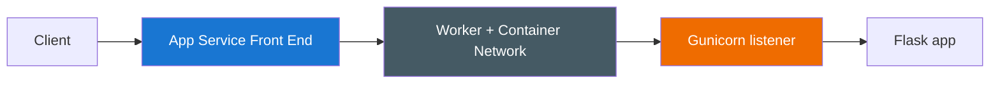
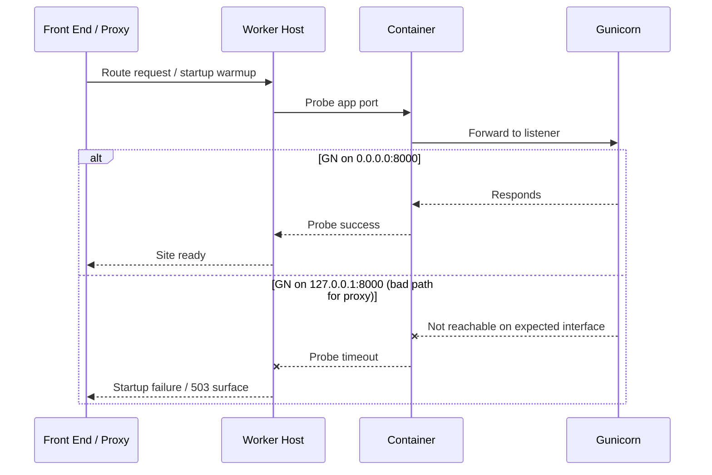
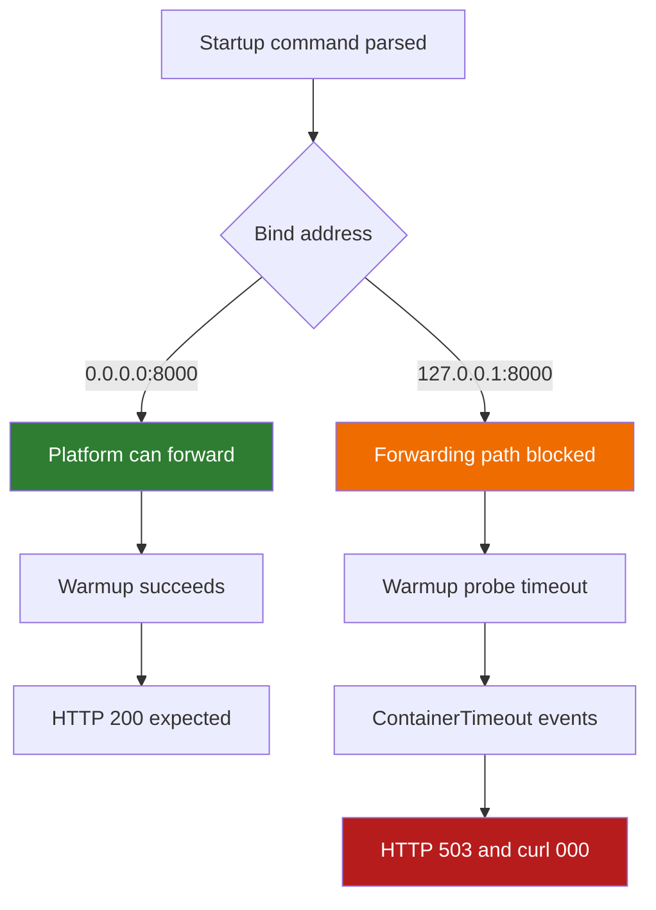
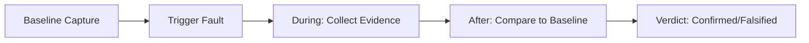

---
hide:
  - toc
content_sources:
  diagrams:
    - id: troubleshooting-lab-guides-failed-to-forward-request-diagram-1
      type: flowchart
      source: self-generated
      justification: "Self-generated troubleshooting diagram synthesized from Microsoft Learn diagnostics and Azure App Service incident guidance for this guide."
      based_on:
        - https://learn.microsoft.com/en-us/azure/app-service/troubleshoot-diagnostic-logs
        - https://learn.microsoft.com/en-us/azure/app-service/troubleshoot-http-502-http-503
    - id: troubleshooting-lab-guides-failed-to-forward-request-diagram-2
      type: sequenceDiagram
      source: self-generated
      justification: "Self-generated troubleshooting diagram synthesized from Microsoft Learn diagnostics and Azure App Service incident guidance for this guide."
      based_on:
        - https://learn.microsoft.com/en-us/azure/app-service/troubleshoot-diagnostic-logs
        - https://learn.microsoft.com/en-us/azure/app-service/troubleshoot-http-502-http-503
    - id: troubleshooting-lab-guides-failed-to-forward-request-diagram-3
      type: flowchart
      source: self-generated
      justification: "Self-generated troubleshooting diagram synthesized from Microsoft Learn diagnostics and Azure App Service incident guidance for this guide."
      based_on:
        - https://learn.microsoft.com/en-us/azure/app-service/troubleshoot-diagnostic-logs
        - https://learn.microsoft.com/en-us/azure/app-service/troubleshoot-http-502-http-503
    - id: troubleshooting-lab-guides-failed-to-forward-request-diagram-4
      type: flowchart
      source: self-generated
      justification: "Self-generated troubleshooting diagram synthesized from Microsoft Learn diagnostics and Azure App Service incident guidance for this guide."
      based_on:
        - https://learn.microsoft.com/en-us/azure/app-service/troubleshoot-diagnostic-logs
        - https://learn.microsoft.com/en-us/azure/app-service/troubleshoot-http-502-http-503
    - id: troubleshooting-lab-guides-failed-to-forward-request-diagram-5
      type: timeline
      source: self-generated
      justification: "Self-generated troubleshooting diagram synthesized from Microsoft Learn diagnostics and Azure App Service incident guidance for this guide."
      based_on:
        - https://learn.microsoft.com/en-us/azure/app-service/troubleshoot-diagnostic-logs
        - https://learn.microsoft.com/en-us/azure/app-service/troubleshoot-http-502-http-503
    - id: troubleshooting-lab-guides-failed-to-forward-request-diagram-6
      type: graph
      source: self-generated
      justification: "Self-generated troubleshooting diagram synthesized from Microsoft Learn diagnostics and Azure App Service incident guidance for this guide."
      based_on:
        - https://learn.microsoft.com/en-us/azure/app-service/troubleshoot-diagnostic-logs
        - https://learn.microsoft.com/en-us/azure/app-service/troubleshoot-http-502-http-503
---
# Lab Guide (Level 3): Failed to Forward Request on Azure App Service Linux

This lab is a full reference investigation for the App Service Linux startup/binding failure pattern where the app process listens on loopback (`127.0.0.1`) and the platform reverse proxy cannot reach it. The guide includes deep background, a falsifiable hypothesis, a deterministic runbook, and an artifact-backed experiment log.

---

## Lab Metadata

| Attribute | Value |
|---|---|
| Difficulty | Intermediate |
| Estimated Duration | 45-60 minutes |
| Tier | Basic |
| Failure Mode | Reverse proxy forwarding fails because Gunicorn listens on `127.0.0.1` instead of `0.0.0.0` |
| Skills Practiced | Startup command validation, bind-address diagnostics, platform and console log correlation, recovery verification |

!!! info "Audience"
    This document targets incident responders, platform engineers, and support engineers who need a **forensic-quality** runbook for this failure mode.

!!! warning "PII safety"
    All IDs are sanitized in this repository. Keep them sanitized when reusing these examples.

---

## 1) Background

### 1.1 What “failed to forward request” means on Linux App Service

Inbound traffic to App Service Linux does not connect directly from internet clients to your Gunicorn process. There is an App Service front-end/reverse-proxy chain and warmup/startup probes before the site is considered ready.

If your app listens only on loopback (`127.0.0.1`) inside the container, proxy-to-container forwarding can fail because the proxy expects the application to be reachable on the container interface.

### 1.2 Request forwarding chain

<!-- diagram-id: troubleshooting-lab-guides-failed-to-forward-request-diagram-1 -->


When D binds to `0.0.0.0:8000`, C can reach D.
When D binds to `127.0.0.1:8000`, forwarding can fail depending on network path assumptions.

### 1.3 Why `127.0.0.1` can fail while app is “running”

A process can be healthy in-process but unreachable from platform forwarding path.

You can see this paradox in incidents:

- Gunicorn boots workers normally.
- App process exists.
- Startup probe still fails (`ContainerTimeout`, warmup not successful).
- External requests return `503` or probe `000`.

### 1.4 Startup command and port environment mechanics

On App Service Linux, startup behavior commonly depends on:

- Startup file (`az webapp config set --startup-file ...`)
- `PORT`
- `WEBSITES_PORT` (in certain deployment modes)

If startup command explicitly hardcodes `--bind=127.0.0.1:8000`, it can override otherwise-correct defaults and make forwarding fail.

### 1.5 Causal path with warmup probes

<!-- diagram-id: troubleshooting-lab-guides-failed-to-forward-request-diagram-2 -->


### 1.6 Why this appears as startup timeout, not bind syntax error

In this lab, `127.0.0.1` is a valid socket bind. Gunicorn starts successfully.

Therefore logs often show:

- Gunicorn startup lines present.
- Worker boot lines present.
- Yet platform logs report probe timeout and container startup timeout.

This is why naive “process started = app reachable” assumptions fail.

### 1.7 Diagram: bind decision outcomes

<!-- diagram-id: troubleshooting-lab-guides-failed-to-forward-request-diagram-3 -->


### 1.8 Relevant lab app endpoints

| Endpoint | Purpose |
|---|---|
| `/health` | Health status for startup/recovery checks |
| `/diag/stats` | Request counters + PID/uptime |
| `/diag/env` | Effective env and inferred gunicorn bind |
| `/diag/bind` | Runtime bind inference from cmdline + host hints |

### 1.9 Baseline evidence from artifacts

Primary baseline files:

- `baseline/app-config.json`
- `baseline/startup-command.txt`

Observed baseline startup command:

```text
gunicorn --bind=127.0.0.1:8000 --timeout=120 --workers=2 app:app
```

This baseline directly encodes the fault condition.

---

## 2) Hypothesis

### 2.1 Statement (falsifiable)

**Hypothesis:**

When a Gunicorn process binds to `127.0.0.1` instead of `0.0.0.0`, the App Service reverse proxy cannot forward requests to the container, resulting in `container didn't respond to HTTP pings`-class startup/probe failures.

### 2.2 Causal chain under test

<!-- diagram-id: troubleshooting-lab-guides-failed-to-forward-request-diagram-4 -->


### 2.3 Proof criteria

All must be observed:

1. Baseline startup command shows `--bind=127.0.0.1:8000`.
2. Failure probes show `000` and/or HTTP logs show sustained `503` with long `TimeTaken`.
3. Platform logs contain startup probe timeout and container timeout language.
4. Post-fix diagnostics show effective bind as `0.0.0.0:8000`.
5. Post-fix health reaches HTTP 200.

### 2.4 Disproof criteria

Any one disconfirms the hypothesis for this run:

- Startup command was already `0.0.0.0` before failures.
- Platform logs show a different root cause (for example image pull failure) with no probe timeout pattern.
- Switching bind to `0.0.0.0` does not restore reachability.

### 2.5 Confounders and interpretation notes

| Confounder | Handling in this guide |
|---|---|
| Deployment restart noise | Use artifact timestamps and compare before/after bind evidence |
| Delayed warmup completion | Distinguish immediate probe file vs later postfix diagnostics |
| Log query window overlap | Use bind-specific artifacts (`diag-bind`, `diag-env`) for decisive state |

---

## 3) Runbook

This runbook reproduces the failure and verifies fix using long-form flags.

### 3.1 Prerequisites

| Tool | Check command |
|---|---|
| Azure CLI | `az version` |
| Bash | `bash --version` |
| jq | `jq --version` |
| Authenticated account | `az account show` |

### 3.2 Variables

```bash
export RG="rg-lab-forward"
export LOCATION="koreacentral"
export TEMPLATE_FILE="labs/failed-to-forward-request/main.bicep"
```

### 3.3 Deploy infrastructure

```bash
az group create --name "$RG" --location "$LOCATION"

az deployment group create \
  --resource-group "$RG" \
  --template-file "$TEMPLATE_FILE" \
  --parameters baseName="labfwd"
```

### 3.4 Resolve app name and URL

```bash
export APP_NAME=$(az webapp list \
  --resource-group "$RG" \
  --query "[0].name" \
  --output tsv)

export APP_HOST=$(az webapp show \
  --resource-group "$RG" \
  --name "$APP_NAME" \
  --query "defaultHostName" \
  --output tsv)

export APP_URL="https://$APP_HOST"
```

### 3.5 Confirm baseline startup command

```bash
az webapp config show \
  --resource-group "$RG" \
  --name "$APP_NAME" \
  --query "appCommandLine" \
  --output tsv
```

Expected failure-mode baseline:

```text
gunicorn --bind=127.0.0.1:8000 --timeout=120 --workers=2 app:app
```

### 3.6 Deploy app package

```bash
az webapp deploy \
  --resource-group "$RG" \
  --name "$APP_NAME" \
  --src-path "labs/failed-to-forward-request/app" \
  --type zip \
  --restart true
```

### 3.7 Trigger script (reproduce + fix)

```bash
bash "labs/failed-to-forward-request/trigger.sh" "$RG" "$APP_NAME"
```

Script behavior summary:

1. Deploys app code.
2. Calls app while bind is `127.0.0.1`.
3. Applies startup fix: `--bind=0.0.0.0:8000`.
4. Polls `/health` for recovery.

### 3.8 Manual probe loop (optional)

Before fix:

```bash
for attempt in $(seq 1 5); do
  curl \
    --silent \
    --show-error \
    --max-time 15 \
    --output /dev/null \
    --write-out "%{http_code},%{time_total}\n" \
    "$APP_URL/"
done
```

Apply fix explicitly:

```bash
az webapp config set \
  --resource-group "$RG" \
  --name "$APP_NAME" \
  --startup-file "gunicorn --bind=0.0.0.0:8000 --timeout=120 --workers=2 app:app"
```

After fix:

```bash
for attempt in $(seq 1 12); do
  curl \
    --silent \
    --show-error \
    --max-time 15 \
    --output /dev/null \
    --write-out "%{http_code},%{time_total}\n" \
    "$APP_URL/health"
  sleep 5
done
```

### 3.9 KQL queries

#### HTTP behavior

```kusto
AppServiceHTTPLogs
| where TimeGenerated > ago(2h)
| where CsUriStem in ("/", "/health", "/diag/stats", "/diag/env", "/diag/bind")
| project TimeGenerated, CsUriStem, ScStatus, TimeTaken, CsHost
| order by TimeGenerated desc
```

#### Platform startup/probe behavior

```kusto
AppServicePlatformLogs
| where TimeGenerated > ago(2h)
| where Message has_any (
    "startup probe failed",
    "Container did not start within expected time limit",
    "Pinging warmup path",
    "Failed to start site"
)
| project TimeGenerated, Level, Message
| order by TimeGenerated desc
```

#### Console startup bind evidence

```kusto
AppServiceConsoleLogs
| where TimeGenerated > ago(2h)
| where ResultDescription has_any (
    "Site's appCommandLine",
    "Listening at:",
    "Starting gunicorn"
)
| project TimeGenerated, ResultDescription
| order by TimeGenerated desc
```

### 3.10 Post-fix verification endpoints

```bash
curl --silent --show-error "$APP_URL/health"
curl --silent --show-error "$APP_URL/diag/stats"
curl --silent --show-error "$APP_URL/diag/env"
curl --silent --show-error "$APP_URL/diag/bind"
```

Expected post-fix:

- `/health` returns HTTP 200.
- `/diag/bind` infers `gunicorn_bind_from_cmdline` as `0.0.0.0:8000`.

## 4) Experiment Log

This section uses real files from:

`labs/failed-to-forward-request/artifacts-sanitized/`

### 4.1 Artifact inventory used

| Category | File |
|---|---|
| Baseline | `baseline/app-config.json` |
| Baseline | `baseline/startup-command.txt` |
| Baseline | `baseline/app-state.json` |
| Trigger | `trigger/startup-cmd-before-20260404T054545Z.txt` |
| Trigger | `trigger/failure-probes-20260404T054545Z.csv` |
| Trigger | `trigger/recovery-probes-20260404T054545Z.csv` |
| Trigger | `trigger/kql-http-20260404T060610Z.json` |
| Trigger | `trigger/kql-console-20260404T060610Z.json` |
| Trigger | `trigger/kql-platform-20260404T060610Z.json` |
| Postfix | `postfix/diag-bind-20260404T055117Z.json` |
| Postfix | `postfix/diag-env-20260404T055117Z.json` |
| Postfix | `postfix/diag-stats-20260404T055117Z.json` |
| Postfix | `postfix/health-20260404T055117Z.json` |

### 4.2 Baseline evidence

#### 4.2.1 Baseline startup command

Source: `baseline/startup-command.txt`

```text
gunicorn --bind=127.0.0.1:8000 --timeout=120 --workers=2 app:app
```

Source: `baseline/app-config.json` (`appCommandLine`)

```json
"appCommandLine": "gunicorn --bind=127.0.0.1:8000 --timeout=120 --workers=2 app:app"
```

This fully satisfies proof criterion #1 (faulting bind present pre-trigger).

#### 4.2.2 Baseline app-state artifact

`baseline/app-state.json` is empty in this dataset. This does not block diagnosis because startup command state is already captured in two independent artifacts.

### 4.3 Trigger probe evidence

#### 4.3.1 Failure probes

Source: `trigger/failure-probes-20260404T054545Z.csv`

Rows:

```text
1,000000,2026-04-04T05:46:16Z
2,000000,2026-04-04T05:46:29Z
3,000000,2026-04-04T05:46:41Z
4,000000,2026-04-04T05:46:54Z
5,000000,2026-04-04T05:47:07Z
```

Summary:

| Metric | Value |
|---|---|
| Probe attempts | 5 |
| Transport failures (`000000`) | 5 |
| Successes | 0 |

#### 4.3.2 Recovery probes

Source: `trigger/recovery-probes-20260404T054545Z.csv`

Rows:

```text
1,000000,2026-04-04T05:48:03Z
2,000000,2026-04-04T05:48:22Z
3,000000,2026-04-04T05:48:35Z
```

Summary:

| Metric | Value |
|---|---|
| Probe attempts | 3 |
| Transport failures (`000000`) | 3 |

Important interpretation:

- Recovery probe capture appears to have occurred during restart/warmup churn.
- Postfix diagnostics (below) later prove successful recovery and corrected bind.

### 4.4 HTTP KQL analysis

Source: `trigger/kql-http-20260404T060610Z.json`

Dataset summary:

| Metric | Value |
|---|---|
| Total rows | 34 |
| Status 200 | 14 |
| Status 202 | 2 |
| Status 499 | 3 |
| Status 503 | 15 |
| `503` rows with `TimeTaken >= 60000ms` | 15 |

Interpretation:

- Long-duration `503` rows align with startup forwarding failures.
- Later `200` rows on `/health` and diag endpoints indicate eventual recovery.

Representative sequence from the same dataset:

| Time (UTC) | URI | Status | TimeTaken (ms) |
|---|---|---:|---:|
| 05:49:48 | `/` | 503 | 242197 |
| 05:49:48 | `/` | 503 | 221425 |
| 05:49:48 | `/health` | 503 | 126898 |
| 05:51:02 | `/health` | 499 | 40052 |
| 05:51:05 | `/health` | 200 | 17 |
| 05:51:20 | `/health` | 200 | 5 |

### 4.5 Console KQL analysis (bind evidence)

Source: `trigger/kql-console-20260404T060610Z.json`

Rows: **47**

Key lines:

```text
Site's appCommandLine: gunicorn --bind=127.0.0.1:8000 --timeout=120 --workers=2 app:app
[2026-04-04 05:55:02 +0000] [1896] [INFO] Listening at: http://127.0.0.1:8000 (1896)
```

Interpretation:

- Confirms runtime listener used loopback during failing phase.
- This supports the exact hypothesized mechanism.

### 4.6 Platform KQL analysis (startup/probe timeout evidence)

Source: `trigger/kql-platform-20260404T060610Z.json`

Rows: **200**

Signal counts (from this snapshot):

| Pattern | Count |
|---|---:|
| Messages containing `Container did not start within expected time limit` | 24 |
| Messages containing warmup/startup probe timeout language | 15 |

Representative platform messages:

```text
Site startup probe failed after 231.0055547 seconds.
State: Starting, Action: WaitingForSiteWarmUpProbeSuccess, LastError: ContainerTimeout ...
Failed to start site. Revert by stopping site.
```

This satisfies proof criterion #3.

### 4.7 Postfix diagnostics (recovery and fixed bind)

#### 4.7.1 Bind corrected to 0.0.0.0

Source: `postfix/diag-bind-20260404T055117Z.json`

Core fields:

| Field | Value |
|---|---|
| `gunicorn_bind_from_cmdline` | `0.0.0.0:8000` |
| `cmdline.argv` includes | `--bind=0.0.0.0:8000` |
| `port_env` | `8000` |

Raw excerpt:

```json
{"gunicorn_bind_from_cmdline":"0.0.0.0:8000","cmdline":{"argv":["...","gunicorn","--bind=0.0.0.0:8000","--timeout=120","--workers=2","app:app"]}}
```

#### 4.7.2 Health recovered

Source: `postfix/health-20260404T055117Z.json`

```json
{"status":"healthy"}
```

#### 4.7.3 Process stats after recovery

Source: `postfix/diag-stats-20260404T055117Z.json`

```json
{"endpoint_counters":{"health":1},"pid":1898,"process_start_time":"2026-04-04T05:51:00.340146+00:00","request_count":2,"uptime_seconds":17.466}
```

### 4.8 Experiment timeline (reconstructed)

<!-- diagram-id: troubleshooting-lab-guides-failed-to-forward-request-diagram-5 -->
```mermaid
timeline
    title Failed-to-forward-request lab timeline
    05:46:16 : Failure probes start returning 000
    05:47:07 : Failure probe series still all 000
    05:48:03 : Recovery probe capture begins (still 000 during churn)
    05:49:48 : HTTP logs show long 503 responses
    05:51:02 : Transitional 499 entries on /health
    05:51:05 : /health returns 200 in HTTP logs
    05:55:xx : Postfix diagnostics confirm 0.0.0.0:8000 bind
```

### 4.9 Data quality notes

| Observation | Impact | Resolution |
|---|---|---|
| `baseline/app-state.json` empty | Minor | Baseline still confirmed by config + startup-command files |
| Recovery probe CSV remains `000000` | Medium | Use postfix diag and HTTP logs to confirm eventual recovery |
| Console snapshot emphasizes failing bind | None | Postfix artifacts provide corrected bind evidence |

### 4.10 Hypothesis verdict

| Proof criterion | Status | Evidence |
|---|---|---|
| Baseline bad bind present | ✅ Met | `baseline/startup-command.txt`, `app-config.json` |
| Failure surface observed | ✅ Met | failure probes all `000000`, HTTP `503` long tail |
| Platform startup timeout signals | ✅ Met | 24 timeout-related platform messages |
| Post-fix bind corrected | ✅ Met | `postfix/diag-bind...` shows `0.0.0.0:8000` |
| Post-fix health success | ✅ Met | `postfix/health...` returns `{"status":"healthy"}` |

**Final verdict: Hypothesis supported by artifacts.**

### 4.11 Root-cause statement

The dominant root cause in this lab run is startup command misbinding (`127.0.0.1`) that prevented successful proxy forwarding/warmup. Changing listener bind to `0.0.0.0:8000` restored endpoint reachability.

### 4.12 Recommended production guardrails

| Guardrail | Why |
|---|---|
| Standardize startup command templates | Prevent accidental loopback bind regressions |
| Add synthetic `/health` monitor | Detect warmup/forwarding issues quickly |
| Alert on startup probe timeout platform logs | Catch failures before customer reports |
| Add config drift checks in CI/CD | Verify bind and port settings pre-release |

### 4.13 Suggested continuous validation checklist

Before each deployment to Linux App Service:

1. Validate startup command bind address is `0.0.0.0`.
2. Validate listener port matches expected platform port (`8000` in this lab).
3. Deploy and check `/health` externally.
4. Query platform logs for startup probe anomalies in first 10 minutes.
5. Record artifact snapshot for incident regression history.

---

## Expected Evidence

This section defines what you SHOULD observe at each phase of the lab. Use it to validate your investigation is on track.

### Before Trigger (Baseline)

| Evidence Source | Expected State | What to Capture |
|---|---|---|
| Deployment APIs (`/api/zipdeploy`, deployment status) | Deployment path succeeds (200/202) before runtime symptom appears | Deployment status responses and timestamps |
| Startup command config | Gunicorn is configured with loopback bind | `gunicorn --bind=127.0.0.1:8000 --timeout=120 --workers=2 app:app` |
| Baseline app config artifacts | App configuration shows intended runtime but bad bind target | `baseline/startup-command.txt` and `baseline/app-config.json` |

### During Incident

| Evidence Source | Expected State | Key Indicator |
|---|---|---|
| AppServiceHTTPLogs | User traffic is not successfully forwarded | Only SCM/Kudu traffic appears or user-path requests fail/timeout |
| AppServiceConsoleLogs | App process starts but listens on localhost only | `Listening at: http://127.0.0.1:8000` |
| AppServicePlatformLogs | Platform treats startup as failed due to unreachable warmup path | `CancellingStartup, LastError: ContainerTimeout` and probe-timeout messages |

### After Recovery

| Evidence Source | Expected State | Key Indicator |
|---|---|---|
| Startup command config | Bind address corrected for platform reachability | `--bind=0.0.0.0:8000` |
| `/health` and diagnostics endpoints | Endpoint reachability restored | HTTP `200` responses resume |
| Postfix bind evidence | Runtime cmdline reflects corrected bind | `gunicorn_bind_from_cmdline: 0.0.0.0:8000` |

### Evidence Timeline

<!-- diagram-id: troubleshooting-lab-guides-failed-to-forward-request-diagram-6 -->


### Evidence Chain: Why This Proves the Hypothesis

!!! success "Falsification Logic"
    If you observe deployment success, console logs showing Gunicorn listening on `127.0.0.1:8000`, and platform startup timeout/cancellation signals, the hypothesis is CONFIRMED because the app process is running but unreachable to the App Service forwarding/warmup path.
    
    If you do NOT observe localhost-only bind evidence (for example bind is already `0.0.0.0`), the hypothesis is FALSIFIED — consider alternatives such as wrong startup module, port mismatch, or image/runtime startup failure.

## Clean Up

```bash
az group delete --name "$RG" --yes --no-wait
```

## Related Playbook

- [Failed to Forward Request](../playbooks/startup-availability/failed-to-forward-request.md)

## See Also

- [Playbook: Failed to Forward Request](../playbooks/startup-availability/failed-to-forward-request.md)
- [Troubleshooting: First 10 Minutes](../first-10-minutes/index.md)

## Sources

- [Configure a custom container for Azure App Service](https://learn.microsoft.com/en-us/azure/app-service/configure-custom-container)
- [Troubleshoot HTTP 502/503 errors in Azure App Service](https://learn.microsoft.com/en-us/azure/app-service/troubleshoot-http-502-http-503)
- [Enable diagnostic logging for apps in Azure App Service](https://learn.microsoft.com/en-us/azure/app-service/troubleshoot-diagnostic-logs)
- [Azure App Service diagnostics overview](https://learn.microsoft.com/en-us/azure/app-service/overview-diagnostics)
- [App Service Linux FAQ and runtime behavior](https://learn.microsoft.com/en-us/azure/app-service/containers/app-service-linux-faq)
