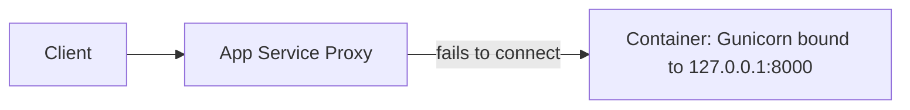

# Lab: Failed to Forward Request (Linux App Service)

Reproduce the common Azure App Service Linux failure mode where the application binds Gunicorn to `127.0.0.1` instead of `0.0.0.0`, causing the platform proxy to fail forwarding requests to the container.

## Objective

Deploy a Python/Flask app on Linux App Service with an intentionally incorrect startup bind address, trigger request failures, then fix the startup command and confirm recovery.

## Prerequisites

- Azure subscription
- Azure CLI installed and logged in
- Bash shell

## Architecture and Failure Path



## Deploy Infrastructure

```bash
# Create resource group
az group create --name rg-lab-forward --location koreacentral

# Deploy lab infrastructure
az deployment group create \
  --resource-group rg-lab-forward \
  --template-file lab-guides/failed-to-forward-request/main.bicep \
  --parameters baseName=labfwd
```

## Trigger the Symptom and Apply the Fix

```bash
# The trigger script deploys app code, validates failure, applies startup fix, and validates success
bash lab-guides/failed-to-forward-request/trigger.sh rg-lab-forward
```

What the script does:

1. Deploys Flask app code.
2. Calls the app while startup is `--bind=127.0.0.1:8000` (expected failure: HTTP 503 or timeout).
3. Updates startup to `--bind=0.0.0.0:8000`.
4. Calls `/health` again and expects HTTP 200.

## Verify Log Signals

```bash
bash lab-guides/failed-to-forward-request/verify.sh rg-lab-forward
```

This checks for:

- `Failed to forward request`
- `Container didn't respond`
- HTTP 503 spikes in `AppServiceHTTPLogs`

## Manual Kusto Query (Optional)

```kusto
AppServicePlatformLogs
| where TimeGenerated > ago(2h)
| where ResultDescription has_any ("Failed to forward request", "Container didn't respond")
| project TimeGenerated, ResultDescription
| order by TimeGenerated desc
```

## Expected Signals

- Initial requests fail with HTTP 503 or timeout when binding to `127.0.0.1`
- Platform log entries indicating forward/probe failure
- Requests recover after changing bind address to `0.0.0.0`

## Why This Happens

On Linux App Service, an internal reverse proxy forwards requests to your container. If your app listens only on loopback (`127.0.0.1`), the proxy cannot reach it over container networking. Binding to `0.0.0.0` makes the app reachable from the platform proxy.

## Clean Up

```bash
az group delete --name rg-lab-forward --yes --no-wait
```

## References

- [Configure a custom container for Azure App Service](https://learn.microsoft.com/en-us/azure/app-service/configure-custom-container)
- [Troubleshoot HTTP errors of "502 bad gateway" and "503 service unavailable"](https://learn.microsoft.com/en-us/azure/app-service/troubleshoot-http-502-http-503)
- [Quickstart: Create Bicep files with Visual Studio Code](https://learn.microsoft.com/en-us/azure/azure-resource-manager/bicep/quickstart-create-bicep-use-visual-studio-code)
- [Enable diagnostic logging for apps in Azure App Service](https://learn.microsoft.com/en-us/azure/app-service/troubleshoot-diagnostic-logs)
