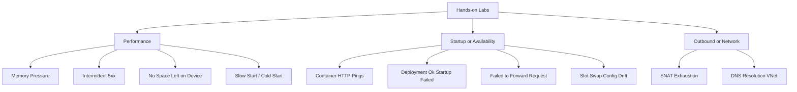

---
content_sources:
  diagrams:
    - id: troubleshooting-lab-guides-index-diagram-1
      type: graph
      source: self-generated
      justification: "Self-generated troubleshooting diagram synthesized from Microsoft Learn diagnostics and Azure App Service incident guidance for this guide."
      based_on:
        - https://learn.microsoft.com/en-us/azure/app-service/troubleshoot-diagnostic-logs
        - https://learn.microsoft.com/en-us/azure/app-service/troubleshoot-http-502-http-503
---
# Hands-on Labs

Bicep-based reproduction environments for each troubleshooting scenario. Deploy to your Azure subscription, trigger the symptom, observe signals, then clean up.

<!-- diagram-id: troubleshooting-lab-guides-index-diagram-1 -->


## How Labs Work

Each lab includes:

1. **main.bicep** — Infrastructure template (App Service Plan B1, App Service Python 3.11 Linux, Log Analytics, Diagnostic Settings)
2. **app/** — Flask application designed to reproduce a specific symptom
3. **trigger.sh** — Script to trigger the symptom
4. **verify.sh** — Script to query Log Analytics and confirm expected signals appeared
5. **Documentation page** — Step-by-step walkthrough with KQL queries and expected observations

## Available Labs

### Performance

| Lab | Symptom | Related Playbook |
|-----|---------|-----------------|
| [Memory Pressure](memory-pressure.md) | Rising memory, worker timeouts, container restarts | [Memory Pressure & Worker Degradation](../playbooks/performance/memory-pressure-and-worker-degradation.md) |
| [Intermittent 5xx Under Load](intermittent-5xx.md) | Sporadic 5xx responses during traffic spikes | [Intermittent 5xx Under Load](../playbooks/performance/intermittent-5xx-under-load.md) |
| [No Space Left on Device](no-space-left-on-device.md) | Disk full errors from /home or /tmp exhaustion | [No Space Left on Device](../playbooks/performance/no-space-left-on-device.md) |
| [Slow Start / Cold Start](slow-start-cold-start.md) | First request slow after deploy or idle | [Slow Start / Cold Start vs Regression](../playbooks/performance/slow-start-cold-start.md) |

### Startup / Availability

| Lab | Symptom | Related Playbook |
|-----|---------|-----------------|
| [Container Didn't Respond to HTTP Pings](container-http-pings.md) | Container fails to start — no HTTP response on expected port | [Container Didn't Respond to HTTP Pings](../playbooks/startup-availability/container-didnt-respond-to-http-pings.md) |
| [Deployment Succeeded but Startup Failed](deployment-succeeded-startup-failed.md) | Deploy green but app down — wrong startup command | [Deployment Succeeded but Startup Failed](../playbooks/startup-availability/deployment-succeeded-startup-failed.md) |
| [Failed to Forward Request](failed-to-forward-request.md) | Platform proxy can't reach app — wrong bind address | [Failed to Forward Request](../playbooks/startup-availability/failed-to-forward-request.md) |
| [Slot Swap Config Drift](slot-swap-config-drift.md) | Swap succeeds but production restarts or config breaks | [Slot Swap Config Drift / Restart Race](../playbooks/startup-availability/slot-swap-config-drift.md) |

### Outbound / Network

| Lab | Symptom | Related Playbook |
|-----|---------|-----------------|
| [SNAT Exhaustion](snat-exhaustion.md) | Outbound connection failures from SNAT port exhaustion | [SNAT or Application Issue?](../playbooks/outbound-network/snat-or-application-issue.md) |
| [DNS Resolution (VNet)](dns-vnet-resolution.md) | DNS resolution failure for private endpoints in VNet-integrated apps | [DNS Resolution (VNet)](../playbooks/outbound-network/dns-resolution-vnet-integrated-app-service.md) |

## Prerequisites

All labs require:

- Azure subscription with Contributor access
- Azure CLI installed and logged in (`az login`)
- Bash shell (Linux, macOS, or WSL)

## General Workflow

```bash
# 1. Create resource group
az group create --name rg-lab-<name> --location koreacentral

# 2. Deploy infrastructure
az deployment group create \
  --resource-group rg-lab-<name> \
  --template-file labs/<name>/main.bicep \
  --parameters baseName=lab<short>

# 3. Deploy app code (zip deploy or local git)
# 4. Run trigger script
# 5. Wait 2-5 minutes for logs to appear
# 6. Run verify script or query Log Analytics manually

# 7. Clean up
az group delete --name rg-lab-<name> --yes --no-wait
```

!!! warning "Cost"
    Each lab deploys a B1 App Service Plan. Delete the resource group after completing the lab to avoid ongoing charges.

## See Also

- [Troubleshooting](../index.md)
- [First 10 Minutes Checklists](../first-10-minutes/index.md)
- [Playbooks](../playbooks/index.md)
