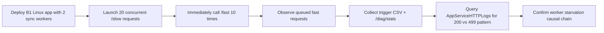
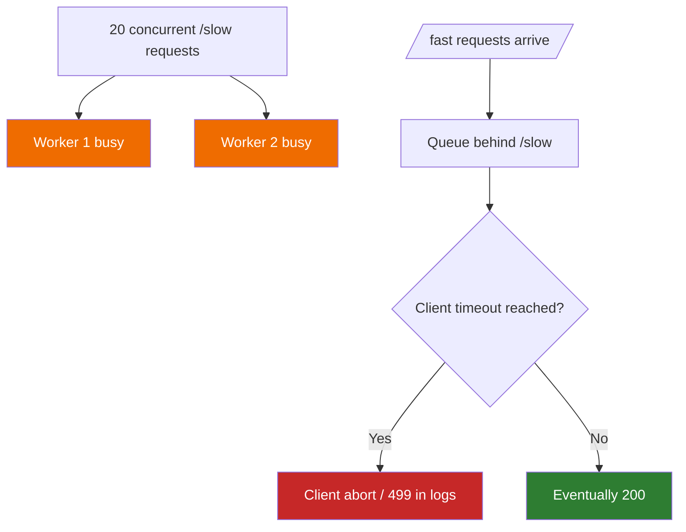
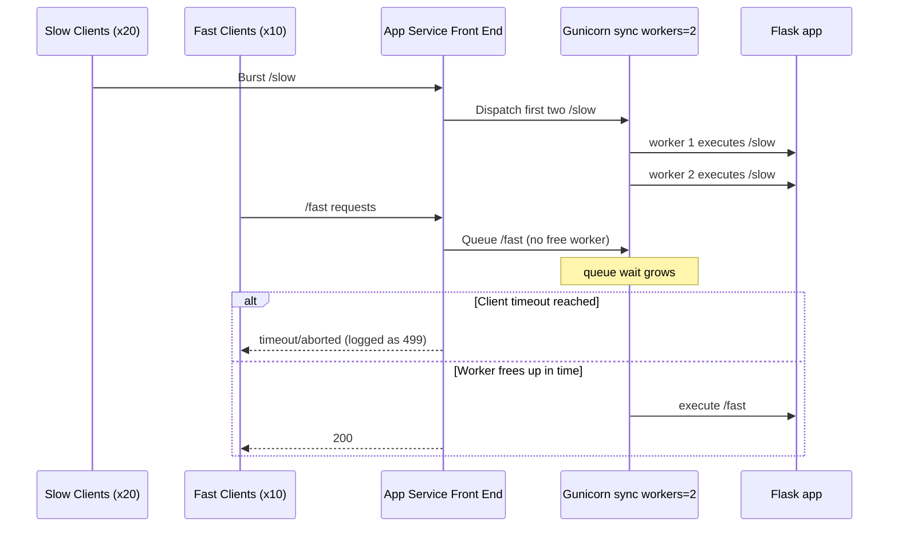
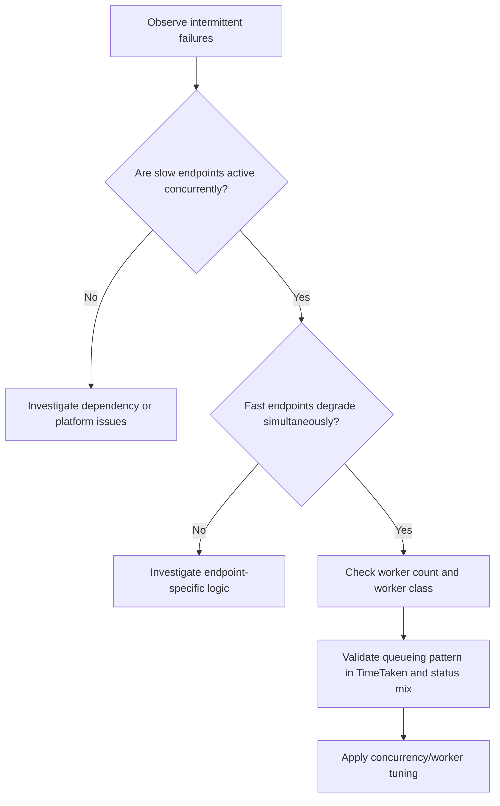

# Lab: Intermittent 5xx Under Load

This lab reproduces intermittent request failures caused by **sync worker starvation** on Azure App Service Linux.

The app intentionally mixes slow and fast endpoints:

- `/slow` sleeps 5-15 seconds.
- `/fast` returns immediately.

When a burst of concurrent slow requests occupies the limited Gunicorn sync workers, fast requests queue behind them and start timing out.



This guide is designed to diagnose intermittent 5xx-like customer symptoms where the root cause is worker pool saturation and request queueing rather than random platform instability, using a B1 Linux Python 3.11 app with Gunicorn `sync`, `--workers 2`, `--timeout 30`, a trigger of 20 concurrent `/slow` requests followed by 10 `/fast` requests, and sanitized artifacts from a real run.

## Lab Metadata

| Attribute | Value |
|---|---|
| Difficulty | Intermediate |
| Estimated Duration | 45-60 minutes |
| Tier | Basic |
| Failure Mode | Intermittent request failures caused by sync-worker starvation and request queueing under mixed slow and fast load |
| Skills Practiced | Load-pattern analysis, worker-model troubleshooting, HTTP log interpretation, queueing correlation |

!!! info "Status code interpretation"
    The artifact run primarily shows HTTP `499` in App Service HTTP logs for timed-out client-side requests.
    
    In customer incidents this usually appears as intermittent "5xx/unavailable" behavior from the caller perspective, even when backend logs include `499` rather than `500`.

---

## 1) Background

### 1.1 Mechanism overview

This failure mode is a queueing problem:

1. A small sync worker pool accepts work.
2. Long-running requests occupy workers.
3. New requests cannot execute until a worker is free.
4. Waiting clients hit timeout thresholds.
5. Logs show a mixed pattern of successes and timeouts.

### 1.2 App and process model in this lab

From `baseline/app-config.json`:

| Setting | Value | Why it matters |
|---|---|---|
| `linuxFxVersion` | `PYTHON|3.11` | Linux Python runtime |
| `appCommandLine` | `gunicorn --bind 0.0.0.0:8000 --workers 2 --worker-class sync --timeout 30 app:app` | Hard cap of 2 concurrent request executions |
| `alwaysOn` | `false` | Startup behavior not primary in this run |
| `numberOfWorkers` | `1` | Single app instance for deterministic load |

With `sync` workers, a worker handles one request at a time. If two workers are blocked on `/slow`, `/fast` waits in queue.

### 1.3 Request starvation diagram



### 1.4 Endpoint behavior from app code

| Endpoint | Behavior | Typical duration |
|---|---|---|
| `/slow` | Random sleep between 5 and 15 seconds | seconds to tens of seconds when queued |
| `/fast` | Immediate JSON response | milliseconds when not queued |
| `/diag/stats` | Process and endpoint counters | milliseconds |

Because `/slow` blocks worker threads in sync mode, it is an ideal lab endpoint to reproduce starvation.

### 1.5 Why this resembles intermittent 5xx incidents

In real systems, users often report:

- Some requests succeed.
- Some requests fail with gateway/service-unavailable messages.
- Failures are clustered during brief load bursts.

That pattern matches this lab's mixed-success output under constrained workers.

### 1.6 Internal queueing timeline



### 1.7 Signal map for this failure mode

| Signal | Expected direction under starvation |
|---|---|
| `/slow` request durations | high (often near timeout bounds) |
| `/fast` request durations | bimodal (very fast or near timeout) |
| `/fast` timeout count | increases during slow burst |
| HTTP status mix | 200 mixed with timeout-like statuses (499 in this run) |
| Console worker timeout entries | possible but not guaranteed in short runs |

### 1.8 Distinguishing from other incident classes

| Incident class | Primary signal | How this lab differs |
|---|---|---|
| Dependency outage | external dependency errors | Here, failure appears even without dependency calls |
| CPU saturation | high CPU, slow compute everywhere | Here, queueing from sync workers dominates |
| Memory pressure | reclaim/swap trends | Here, fast endpoint fails due queue delay, not low memory |
| Platform restart | platform lifecycle errors | Here, platform logs mainly startup informational events |

### 1.9 Practical troubleshooting takeaway

If fast endpoints fail only when slow endpoints are concurrent, investigate worker model first:

1. Worker class (`sync` vs async/threaded)
2. Worker count
3. Timeout alignment between client and server
4. Concurrency profile of requests

---

## 2) Hypothesis

### 2.1 Falsifiable hypothesis statement

If we run 20 concurrent `/slow` requests against a Gunicorn app configured with only 2 sync workers and then send 10 `/fast` requests, then:

- a significant share of `/fast` will time out,
- `/slow` will also partially time out,
- HTTP logs will show mixed 200/499 pattern,

which confirms worker starvation and queueing.

### 2.2 Causal chain

1. `SLOW_CONCURRENCY=20` saturates the two sync workers.
2. `/fast` requests queue behind `/slow`.
3. Client-side timeout thresholds are reached (`15s` for fast, `45s` for slow in trigger artifacts).
4. Timed-out requests surface as status `000` in trigger output and `499` in App Service HTTP logs.

```mermaid
flowchart LR
    A[Limited sync workers=2] --> B[Concurrent /slow saturates workers]
    B --> C[/fast cannot start promptly]
    C --> D[Queue wait increases]
    D --> E[Client timeout threshold exceeded]
    E --> F[499 in HTTP logs and timeout at caller]
```

### 2.3 Proof criteria

| Proof criterion | Threshold | Evidence source |
|---|---|---|
| Slow endpoint stress is real | At least 20 slow attempts with multiple long durations | `slow-responses-*.csv` |
| Fast endpoint starvation | At least 50% fast timeout rate during slow burst | `fast-responses-*.csv` |
| Mixed status pattern | Both success and timeout-like statuses in same run | Trigger CSV + KQL HTTP |
| Queueing signature | Fast endpoint durations include near-timeout values | Trigger CSV + KQL `TimeTaken` |
| No mandatory platform crash | Platform logs can remain informational | KQL platform export |

### 2.4 Disproof criteria

Any of these weaken/disprove starvation hypothesis:

- Fast requests remain consistently low-latency under slow concurrency burst.
- Slow requests do not occupy workers long enough to cause queueing.
- Timeouts occur without corresponding slow burst.
- Failures align with platform restarts instead of queueing behavior.

### 2.5 Variables

#### Independent variables

| Variable | Value in this run |
|---|---|
| Gunicorn worker count | 2 |
| Worker class | sync |
| Gunicorn timeout | 30 seconds |
| Slow concurrency burst | 20 requests |
| Fast request volume | 10 requests |
| Client max-time used by trigger | 45 seconds (for both endpoints in script) |

#### Dependent variables

| Variable | Source |
|---|---|
| Per-request status and latency | trigger CSV artifacts |
| Endpoint status distribution | KQL HTTP export |
| Endpoint `TimeTaken` | KQL HTTP export |
| Endpoint hit counters | `/diag/stats` artifacts |
| Runtime/platform error messages | KQL console/platform exports |

#### Controlled conditions

| Control | Value |
|---|---|
| SKU | B1 |
| Region | Korea Central |
| Runtime | Python 3.11 |
| App version | same Flask code and trigger |

### 2.6 Causal validation matrix

| Observation | Expected if hypothesis true | Actual artifact result |
|---|---|---|
| Slow request long tails | Yes | Yes (`~45s` timeouts present) |
| Fast requests time out under slow load | Yes | Yes (6/10 timeout in fast CSV) |
| Status mix in logs | Yes | Yes (200 and 499 both present) |
| Clear platform crash required | No | No (platform logs informational) |

### 2.7 Confounders and boundaries

- Trigger script captures one burst window; repeated runs can vary slightly.
- App Service HTTP status `499` indicates client abort/timeouts; external monitoring may categorize this as availability impact akin to intermittent 5xx symptoms.
- Console timeout logs may be absent for short windows even when queueing is evident.

!!! warning "Do not overfit on one status code"
    For this incident class, causal interpretation should prioritize **timing and queueing behavior** over a single status code family.

---

## 3) Runbook

### 3.1 Prerequisites

```bash
az version
az bicep version
az account show --output table
```

### 3.2 Set standard variables

```bash
export RG="rg-lab-5xx"
export LOCATION="koreacentral"
export BASE_NAME="lab5xx"
export APP_PACKAGE_PATH="/tmp/intermittent-5xx-app.zip"
```

### 3.3 Create resource group

```bash
az group create --name "$RG" --location "$LOCATION"
```

### 3.4 Deploy Bicep (actual lab template path)

```bash
az deployment group create \
  --resource-group "$RG" \
  --template-file "labs/intermittent-5xx/main.bicep" \
  --parameters baseName="$BASE_NAME" location="$LOCATION"
```

Extract deployment outputs:

```bash
export APP_NAME=$(az deployment group show \
  --resource-group "$RG" \
  --name "main" \
  --query "properties.outputs.appName.value" \
  --output tsv)

export APP_HOSTNAME=$(az deployment group show \
  --resource-group "$RG" \
  --name "main" \
  --query "properties.outputs.defaultHostName.value" \
  --output tsv)

export APP_URL="https://${APP_HOSTNAME}"
```

### 3.5 Deploy application package

```bash
cd "labs/intermittent-5xx/app"
zip --recurse-paths "$APP_PACKAGE_PATH" .

az webapp deploy \
  --resource-group "$RG" \
  --name "$APP_NAME" \
  --src-path "$APP_PACKAGE_PATH" \
  --type zip
```

Restart app for clean test state:

```bash
az webapp restart --resource-group "$RG" --name "$APP_NAME"
```

### 3.6 Baseline health checks

```bash
curl --silent "$APP_URL/"
curl --silent "$APP_URL/health"
curl --silent "$APP_URL/fast"
curl --silent "$APP_URL/diag/stats"
```

Baseline artifact values from this run:

| Artifact | Key values |
|---|---|
| `baseline/diag-stats.json` | `request_count=3`, `active_slow_requests=0`, `endpoint_counters={diag_stats:2, root:1}` |
| `baseline/app-config.json` | `gunicorn --workers 2 --worker-class sync --timeout 30` |

### 3.7 Trigger starvation workload (actual trigger script)

```bash
bash "labs/intermittent-5xx/trigger.sh" "$APP_URL"
```

Script behavior:

1. Launches 20 concurrent `/slow` requests.
2. Immediately sends 10 `/fast` requests.
3. Prints per-request status and elapsed time.

### 3.8 Capture post-trigger diagnostics

```bash
curl --silent "$APP_URL/diag/stats" > /tmp/intermittent-5xx-diag-stats-after.json
curl --silent "$APP_URL/diag/env" > /tmp/intermittent-5xx-diag-env-after.json
```

### 3.9 Query Log Analytics

Resolve workspace identifiers:

```bash
export LOG_WORKSPACE_NAME=$(az deployment group show \
  --resource-group "$RG" \
  --name "main" \
  --query "properties.outputs.logAnalyticsWorkspaceName.value" \
  --output tsv)

export LOG_WORKSPACE_ID=$(az monitor log-analytics workspace show \
  --resource-group "$RG" \
  --workspace-name "$LOG_WORKSPACE_NAME" \
  --query "customerId" \
  --output tsv)
```

#### HTTP detail query

```bash
az monitor log-analytics query \
  --workspace "$LOG_WORKSPACE_ID" \
  --analytics-query "AppServiceHTTPLogs | where TimeGenerated > ago(2h) | project TimeGenerated, CsUriStem, ScStatus, TimeTaken, CsHost | order by TimeGenerated desc" \
  --output json
```

#### Status by endpoint query

```bash
az monitor log-analytics query \
  --workspace "$LOG_WORKSPACE_ID" \
  --analytics-query "AppServiceHTTPLogs | where TimeGenerated > ago(2h) | summarize total=count(), s200=countif(ScStatus==200), s499=countif(ScStatus==499), s5xx=countif(ScStatus>=500) by CsUriStem | order by total desc" \
  --output json
```

#### Endpoint latency profile query

```bash
az monitor log-analytics query \
  --workspace "$LOG_WORKSPACE_ID" \
  --analytics-query "AppServiceHTTPLogs | where TimeGenerated > ago(2h) | summarize avgMs=avg(TimeTaken), p95Ms=percentile(TimeTaken,95), maxMs=max(TimeTaken) by CsUriStem | order by p95Ms desc" \
  --output json
```

#### Console and platform query

```bash
az monitor log-analytics query \
  --workspace "$LOG_WORKSPACE_ID" \
  --analytics-query "AppServiceConsoleLogs | where TimeGenerated > ago(2h) | project TimeGenerated, ResultDescription | order by TimeGenerated desc" \
  --output json

az monitor log-analytics query \
  --workspace "$LOG_WORKSPACE_ID" \
  --analytics-query "AppServicePlatformLogs | where TimeGenerated > ago(2h) | project TimeGenerated, Level, Message | order by TimeGenerated desc" \
  --output json
```

### 3.10 KQL snippets for portal troubleshooting

```kusto
AppServiceHTTPLogs
| where TimeGenerated > ago(2h)
| summarize total=count(), s200=countif(ScStatus==200), s499=countif(ScStatus==499), s5xx=countif(ScStatus>=500) by CsUriStem
| order by total desc
```

```kusto
AppServiceHTTPLogs
| where TimeGenerated > ago(2h)
| summarize avgMs=avg(TimeTaken), p95Ms=percentile(TimeTaken, 95), maxMs=max(TimeTaken) by CsUriStem, ScStatus
| order by p95Ms desc
```

```kusto
AppServiceHTTPLogs
| where TimeGenerated > ago(2h)
| where CsUriStem in ("/slow", "/fast")
| project TimeGenerated, CsUriStem, ScStatus, TimeTaken
| order by TimeGenerated asc
```

```kusto
AppServicePlatformLogs
| where TimeGenerated > ago(2h)
| project TimeGenerated, Level, Message
| order by TimeGenerated desc
```

### 3.11 Verification checklist

- [ ] Trigger executed with 20 `/slow` and 10 `/fast`.
- [ ] Slow and fast CSV artifacts captured.
- [ ] `/fast` timeout ratio increased during `/slow` burst.
- [ ] KQL HTTP logs show mixed status pattern.
- [ ] `/diag/stats` shows endpoint counters after run.
- [ ] Console/platform exports checked.

### 3.12 Common pitfalls

| Pitfall | Symptom | Fix |
|---|---|---|
| Wrong Bicep path | Deployment error | Use `labs/intermittent-5xx/main.bicep` |
| Trigger against wrong app URL | No expected pattern | Re-resolve `APP_URL` from deployment outputs |
| Missing diagnostics linkage | Empty KQL tables | Verify diagnostic setting on web app |
| Running trigger repeatedly without waiting | Mixed windows hard to interpret | Label each run and time-bound KQL queries |

### 3.13 Decision tree for incident triage



---

## 4) Experiment Log

### 4.1 Artifact inventory used

All values below come from:

`labs/intermittent-5xx/artifacts-sanitized/`

| Category | Files used |
|---|---|
| Baseline | `baseline/diag-stats.json`, `baseline/app-config.json` |
| Trigger response files | `trigger/slow-responses-20260404T053453Z.csv`, `trigger/fast-responses-20260404T053453Z.csv` |
| Post-trigger state | `trigger/diag-stats-after-20260404T053453Z.json` |
| KQL exports | `trigger/kql-http-20260404T060610Z.json`, `trigger/kql-console-20260404T060610Z.json`, `trigger/kql-platform-20260404T060610Z.json` |

### 4.2 Baseline state

From `baseline/diag-stats.json`:

| Metric | Value |
|---|---:|
| `request_count` | 3 |
| `active_slow_requests` | 0 |
| `endpoint_counters.diag_stats` | 2 |
| `endpoint_counters.root` | 1 |
| `pid` | 1897 |

From `baseline/app-config.json`:

| Config key | Value |
|---|---|
| `appCommandLine` | `gunicorn --bind 0.0.0.0:8000 --workers 2 --worker-class sync --timeout 30 app:app` |
| `linuxFxVersion` | `PYTHON|3.11` |
| `resourceGroup` | `rg-lab-5xx` |

### 4.3 Trigger CSV evidence: slow endpoint

From `slow-responses-20260404T053453Z.csv` (20 requests):

| Metric | Value |
|---|---:|
| Total requests | 20 |
| `200` responses | 9 |
| `000` timeout responses | 11 |
| Success ratio | 45% |
| Timeout ratio | 55% |
| Average elapsed (s) | 35.924 |
| p95 elapsed (s) | 45.001 |
| Max elapsed (s) | 45.001 |

Representative rows:

| Endpoint | Index | Status | Elapsed (s) |
|---|---:|---:|---:|
| slow | 1 | 200 | 36.720223 |
| slow | 10 | 200 | 12.683494 |
| slow | 11 | 000 | 44.999914 |
| slow | 16 | 000 | 45.001025 |
| slow | 20 | 000 | 45.000372 |

### 4.4 Trigger CSV evidence: fast endpoint

From `fast-responses-20260404T053453Z.csv` (10 requests):

| Metric | Value |
|---|---:|
| Total requests | 10 |
| `200` responses | 4 |
| `000` timeout responses | 6 |
| Success ratio | 40% |
| Timeout ratio | 60% |
| Average elapsed (s) | 9.404 |
| p95 elapsed (s) | 15.001 |
| Max elapsed (s) | 15.001 |

Per-request rows (exact):

| Endpoint | Index | Status | Elapsed (s) |
|---|---:|---:|---:|
| fast | 1 | 200 | 0.646940 |
| fast | 2 | 000 | 15.000374 |
| fast | 3 | 000 | 15.000239 |
| fast | 4 | 000 | 15.001060 |
| fast | 5 | 000 | 15.000587 |
| fast | 6 | 000 | 15.000307 |
| fast | 7 | 000 | 15.000966 |
| fast | 8 | 200 | 2.012888 |
| fast | 9 | 200 | 0.719541 |
| fast | 10 | 200 | 0.656119 |

### 4.5 Post-trigger app state

From `diag-stats-after-20260404T053453Z.json`:

| Metric | Value |
|---|---:|
| `request_count` | 17 |
| `active_slow_requests` | 0 |
| `endpoint_counters.slow` | 10 |
| `endpoint_counters.fast` | 1 |
| `endpoint_counters.diag_stats` | 3 |
| `endpoint_counters.health` | 1 |
| `endpoint_counters.diag_env` | 1 |
| `endpoint_counters.root` | 1 |

Interpretation:

- Endpoint counters reflect requests that reached the app handler.
- Trigger CSV includes client-observed timeouts before some requests completed server-side.

### 4.6 KQL HTTP aggregate summary

From `kql-http-20260404T060610Z.json`:

| Aggregate metric | Value |
|---|---:|
| Total rows | 60 |
| `200` rows | 29 |
| `499` rows | 31 |

Status by endpoint:

| Endpoint | 200 | 499 | Total |
|---|---:|---:|---:|
| `/slow` | 16 | 24 | 40 |
| `/fast` | 5 | 7 | 12 |
| `/diag/stats` | 4 | 0 | 4 |
| `/health` | 2 | 0 | 2 |
| `/diag/env` | 1 | 0 | 1 |
| `/` | 1 | 0 | 1 |

### 4.7 KQL latency profile by endpoint

From KQL HTTP export (`TimeTaken` in milliseconds):

| Endpoint | Count | Avg ms | p95 ms | Max ms |
|---|---:|---:|---:|---:|
| `/slow` | 40 | 36,440.3 | 44,894 | 44,921 |
| `/fast` | 12 | 11,046.8 | 14,484 | 44,865 |
| `/diag/stats` | 4 | 11.5 | 6 | 33 |
| `/health` | 2 | 19.0 | 3 | 35 |

Key signature:

- `/fast` shows both very low and very high durations in the same run, which is expected when queueing behind occupied sync workers.

### 4.8 Raw KQL sample rows (sanitized)

Representative rows from `kql-http-20260404T060610Z.json`:

| TimeGenerated | CsUriStem | ScStatus | TimeTaken |
|---|---|---:|---:|
| `2026-04-04T05:36:26.941612Z` | `/fast` | 200 | 1 |
| `2026-04-04T05:36:23.677624Z` | `/fast` | 499 | 14411 |
| `2026-04-04T05:35:37.981987Z` | `/slow` | 499 | 44430 |
| `2026-04-04T05:35:30.516813Z` | `/slow` | 200 | 37019 |
| `2026-04-04T05:35:23.646864Z` | `/fast` | 499 | 14393 |

### 4.9 Console and platform exports

#### Console log export

From `kql-console-20260404T060610Z.json`:

- `rows: []`

No console entries were captured in this window.

#### Platform log export

From `kql-platform-20260404T060610Z.json`:

- Lifecycle informational events (site start, warmup probe success, container running).
- No explicit failure/restart entry in sampled period.

Sample rows:

| TimeGenerated | Level | Message |
|---|---|---|
| `2026-04-04T05:05:05.5422387Z` | Informational | `Site started.` |
| `2026-04-04T05:05:05.0599636Z` | Informational | `Site startup probe succeeded after 8.0666499 seconds.` |
| `2026-04-04T05:04:56.9229799Z` | Informational | `Container is running.` |

### 4.10 Hypothesis verdict

#### Result: **Supported**

Why supported:

1. Under a 20-request slow burst, slow endpoint timeout ratio reached 55%.
2. Fast endpoint timeout ratio reached 60% despite fast handler logic.
3. KQL HTTP logs show mixed 200/499 pattern with high durations for `/fast` and `/slow`.
4. Pattern is strongly consistent with sync worker starvation and queueing.

Not required for support in this run:

- Console timeout text was absent.
- Platform restart event was absent.

These are optional corroborators, not mandatory if timing/status pattern already proves queueing.

### 4.11 Recommendations

1. Increase Gunicorn worker capacity or move to async/threaded worker model for mixed latency workloads.
2. Isolate slow operations from front-door request path (queue, background job, or dedicated endpoint plan).
3. Align client timeout and server timeout intentionally (avoid accidental mismatch where client cancels first).
4. Monitor endpoint-specific latency and status distribution, not only aggregate app success rate.
5. Use synthetic mixed-load probes (`/slow` + `/fast`) in pre-production to detect starvation early.

### 4.12 Suggested follow-up experiments

| Experiment | Change | Expected outcome |
|---|---|---|
| Worker count increase | `--workers 2` → `--workers 4` | Reduced queue timeout rate |
| Worker class change | `sync` → `gthread` or async worker | Better tolerance to mixed slow/fast traffic |
| Slow concurrency reduction | 20 → 8 | Lower timeout ratios |
| Timeout tuning | Increase client timeout, evaluate tail | Fewer client-abort events but longer waits |

---

## Expected Evidence

This section defines what you SHOULD observe at each phase of the lab. Use it to validate your investigation is on track.

### Before Trigger (Baseline)

| Evidence Source | Expected State | What to Capture |
|---|---|---|
| AppServiceHTTPLogs | All 200s with low latency | Baseline query snapshot for `/fast`, `/slow`, `/diag/stats` |
| AppServiceConsoleLogs | Normal Gunicorn startup with sync workers | Boot line showing 3 sync workers and timeout settings |
| AppServicePlatformLogs | Normal startup sequence only | "Site started" and no restart loop |
| `/diag/stats` | Balanced counters, no queue stress | Baseline endpoint counters and process info |

### During Incident

| Evidence Source | Expected State | Key Indicator |
|---|---|---|
| AppServiceHTTPLogs (`/slow`) | Predominant `499` near timeout edge | `TimeTaken ~4877-4918 ms` on timed-out slow requests |
| Trigger CSV + HTTP logs | Mixed success and timeout pattern | Concurrent burst yields 200+499 in same window |
| Worker model evidence | Sync workers blocked by long CPU-bound work | `/fast` waits behind occupied workers |
| Client-side observations | Caller sees intermittent unavailability | `499` indicates client disconnect before completion |

### After Recovery

| Evidence Source | Expected State | Key Indicator |
|---|---|---|
| AppServiceHTTPLogs | 200 responses return to normal after burst ends | Fast-path latency normalizes when slow load stops |
| `/diag/stats` | Queue-pressure behavior subsides | Request handling resumes without timeout-like clustering |
| Platform/Console logs | No mandatory platform crash required | Recovery can occur without restart |
| Incident interpretation | 499 treated as timeout symptom, not server 5xx | Confirms worker exhaustion pattern rather than random platform failure |

### Evidence Timeline


### Evidence Chain: Why This Proves the Hypothesis

!!! success "Falsification Logic"
    If you observe `/slow` requests clustering near timeout with `499`, plus concurrent degradation of `/fast` while sync workers are occupied, the hypothesis is CONFIRMED because queueing and worker starvation explain the intermittent failures.
    
    If you do NOT observe timeout clustering during slow-request bursts, the hypothesis is FALSIFIED — consider dependency failures, platform restarts, or non-worker bottlenecks.

---

## Clean Up

```bash
az group delete --name "$RG" --yes --no-wait
```

---

## Related Playbook

- [Intermittent 5xx Under Load](../playbooks/performance/intermittent-5xx-under-load.md)

---

## See Also

- [Memory Pressure and Worker Degradation Lab](./memory-pressure.md)
- [First 10 Minutes: App Service Troubleshooting](../first-10-minutes/index.md)

---

## Sources

- [Troubleshoot HTTP 502 and 503 in Azure App Service](https://learn.microsoft.com/en-us/azure/app-service/troubleshoot-http-502-http-503)
- [Monitor Azure App Service](https://learn.microsoft.com/en-us/azure/app-service/monitor-app-service)
- [Enable diagnostics logging in Azure App Service](https://learn.microsoft.com/en-us/azure/app-service/troubleshoot-diagnostic-logs)
- [Configure Python apps in Azure App Service](https://learn.microsoft.com/en-us/azure/app-service/configure-language-python)
- [Azure App Service plan overview](https://learn.microsoft.com/en-us/azure/app-service/overview-hosting-plans)
- [Quickstart: Build Bicep templates](https://learn.microsoft.com/en-us/azure/azure-resource-manager/bicep/quickstart-create-bicep-use-visual-studio-code)
