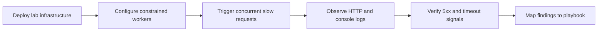

# Lab: Intermittent 5xx Under Load



## Objective
Reproduce intermittent HTTP 500/502/503 errors on Azure App Service Linux by deploying a Python/Flask app with limited sync workers, then overwhelming it with concurrent slow requests.

## Prerequisites
- Azure subscription
- Azure CLI installed and logged in
- Bash shell

## Deploy
```bash
az group create --name rg-lab-5xx --location koreacentral
az deployment group create \
  --resource-group rg-lab-5xx \
  --template-file lab-guides/intermittent-5xx/main.bicep \
  --parameters baseName=lab5xx
```

## Trigger the Symptom
```bash
APP_URL=$(az webapp show --resource-group rg-lab-5xx --name <app-name> --query "defaultHostName" --output tsv)
bash lab-guides/intermittent-5xx/trigger.sh "https://$APP_URL"
```

## Observe
1. Check HTTP status distribution in AppServiceHTTPLogs
2. Look for WORKER TIMEOUT in AppServiceConsoleLogs
3. Compare /slow vs /fast latency

```kusto
AppServiceHTTPLogs
| where TimeGenerated > ago(1h)
| summarize total=count(), err5xx=countif(ScStatus >= 500) by bin(TimeGenerated, 1m), CsUriStem
| order by TimeGenerated asc
```

## Expected Signals
- 502/503 errors when concurrent requests exceed worker count
- Worker timeout messages in console logs
- Fast endpoints queued behind slow ones

## Clean Up
```bash
az group delete --name rg-lab-5xx --yes --no-wait
```

## Related Playbook
- [Intermittent 5xx Under Load](../playbooks/performance/intermittent-5xx-under-load.md)

## References

- [Troubleshoot HTTP errors of "502 bad gateway" and "503 service unavailable"](https://learn.microsoft.com/en-us/azure/app-service/troubleshoot-http-502-http-503)
- [Monitor Azure App Service](https://learn.microsoft.com/en-us/azure/app-service/monitor-app-service)
- [Quickstart: Create Bicep files with Visual Studio Code](https://learn.microsoft.com/en-us/azure/azure-resource-manager/bicep/quickstart-create-bicep-use-visual-studio-code)
- [Enable diagnostic logging for apps in Azure App Service](https://learn.microsoft.com/en-us/azure/app-service/troubleshoot-diagnostic-logs)
