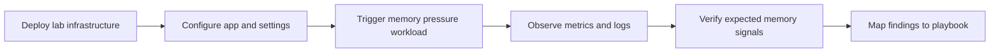

# Lab: Memory Pressure and Worker Degradation

Reproduce memory pressure symptoms on Azure App Service Linux by deploying a Python/Flask app with an intentionally oversized worker model on a B1 plan, then triggering memory leaks and heavy allocation patterns.



## Objective

Deploy and stress a Python App Service workload so you can observe memory growth, worker instability, and degraded request behavior in logs and metrics.

## Prerequisites

- Azure subscription
- Azure CLI installed and logged in
- Bash shell

## Deploy

```bash
# Create resource group
az group create --name rg-lab-memory --location koreacentral

# Deploy lab infrastructure
az deployment group create \
  --resource-group rg-lab-memory \
  --template-file lab-guides/memory-pressure/main.bicep \
  --parameters baseName=labmem
```

## Trigger the Symptom

```bash
# Get the app URL
APP_URL=$(az webapp show --resource-group rg-lab-memory --name <app-name> --query "defaultHostName" --output tsv)

# Run the trigger script
bash lab-guides/memory-pressure/trigger.sh "https://$APP_URL"
```

## Observe

1. Open Azure Portal → App Service → Diagnose and Solve Problems.
2. Check the App Service Plan **Memory Percentage** metric.
3. Query Log Analytics:

```kusto
AppServiceConsoleLogs
| where TimeGenerated > ago(1h)
| where ResultDescription has_any ("OutOfMemory", "OOM", "Killed", "worker timeout", "memory")
| project TimeGenerated, ResultDescription
| order by TimeGenerated desc
```

## Expected Signals

- Memory Percentage metric climbing over time
- Worker timeout messages in AppServiceConsoleLogs
- Latency degradation in AppServiceHTTPLogs
- Potential container restart events in AppServicePlatformLogs

## Clean Up

```bash
az group delete --name rg-lab-memory --yes --no-wait
```

## Related Playbook

- [Memory Pressure and Worker Degradation](../playbooks/performance/memory-pressure-and-worker-degradation.md)

## References

- [Monitor Azure App Service](https://learn.microsoft.com/en-us/azure/app-service/monitor-app-service)
- [Azure App Service plan overview](https://learn.microsoft.com/en-us/azure/app-service/overview-hosting-plans)
- [Quickstart: Create Bicep files with Visual Studio Code](https://learn.microsoft.com/en-us/azure/azure-resource-manager/bicep/quickstart-create-bicep-use-visual-studio-code)
- [Enable diagnostic logging for apps in Azure App Service](https://learn.microsoft.com/en-us/azure/app-service/troubleshoot-diagnostic-logs)
