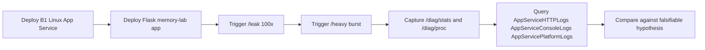
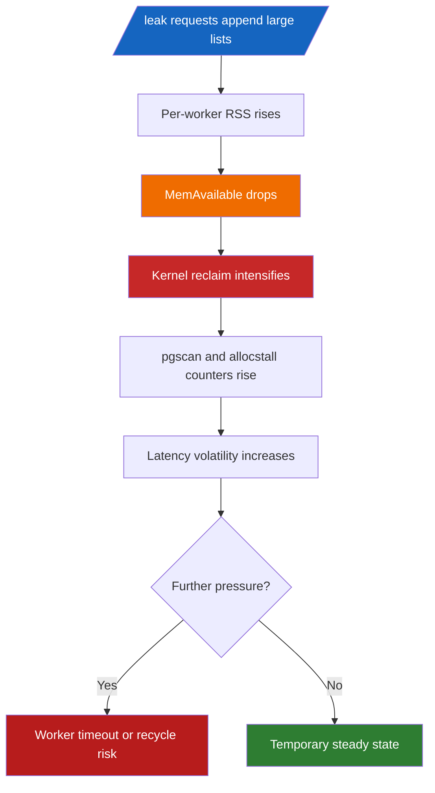
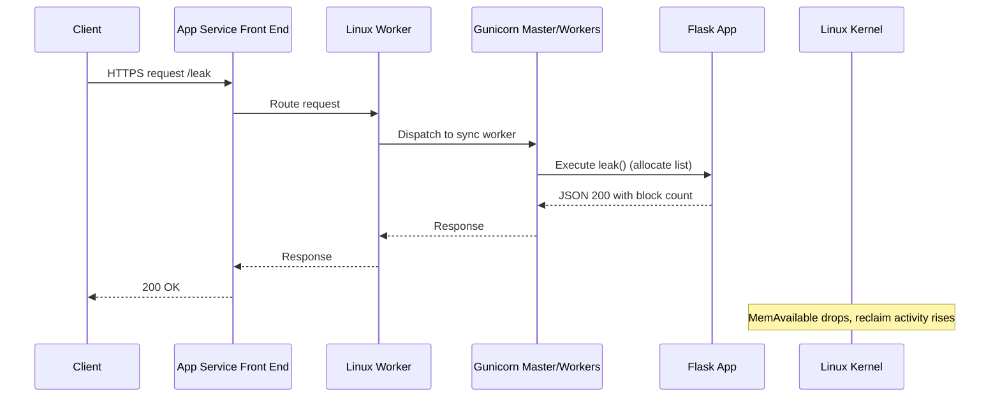
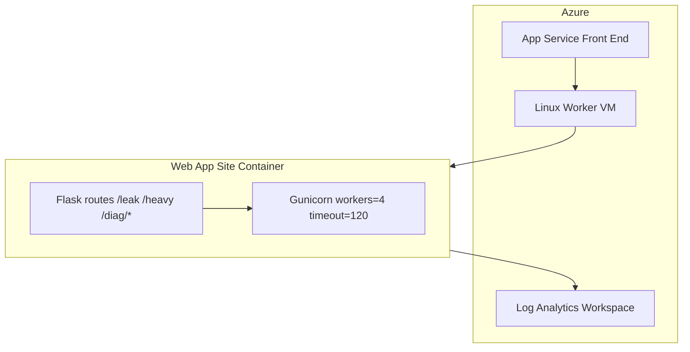
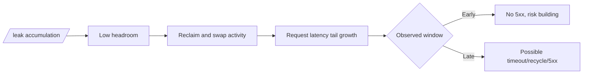
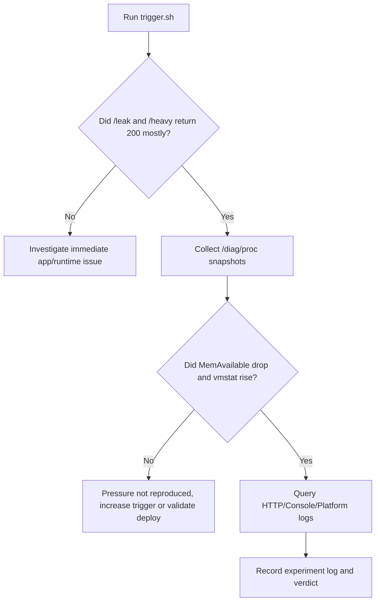
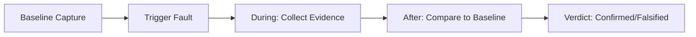

# Lab: Memory Pressure and Worker Degradation

This lab reproduces memory pressure behavior on Azure App Service (Linux, B1) using a Python Flask app that intentionally grows heap allocations (`/leak`) and triggers CPU/memory-intensive work (`/heavy`).

The goal is not only to "cause load," but to understand the full chain from user traffic to Gunicorn process behavior to Linux memory reclaim and App Service platform signals.



## Lab Metadata

| Field | Value |
|---|---|
| Lab name | `memory-pressure` |
| Platform | Azure App Service (Linux, B1) |
| Runtime | Python 3.11 + Gunicorn |
| App path | `labs/memory-pressure/app` |
| Trigger script | `labs/memory-pressure/trigger.sh` |
| Artifact root | `labs/memory-pressure/artifacts-sanitized/` |
| Focus | Memory pressure and worker degradation under leak + heavy workload |
| Expected anti-pattern | Retained heap growth with constrained memory headroom across multiple sync workers |
| Expected symptom family | Low `MemAvailable`, reclaim/swap growth, latency tail expansion before potential hard failures |

!!! info "What this lab demonstrates"
    This run captured **strong memory pressure signals** and **reclaim activity**, but did **not** produce 5xx during the observed window.
    
    That is still valuable troubleshooting evidence: you can prove a memory-stress mechanism is active before user-visible failure occurs.

---

## 1) Background

### 1.1 Why this failure mode happens

Memory-pressure incidents in App Service are usually multi-layer issues:

1. **Application layer** allocates memory over time (intentional leak in this lab).
2. **Worker process layer** (Gunicorn) competes for RSS across multiple workers.
3. **Linux kernel layer** starts reclaim/scanning under pressure.
4. **Platform layer** may still report mostly healthy requests until pressure crosses a tipping point.

In short: rising memory pressure can be present long before obvious 5xx appears.

### 1.2 App Service Linux execution model in this lab

From the deployed app configuration artifact:

| Setting | Value (artifact) | Impact |
|---|---|---|
| `linuxFxVersion` | `PYTHON|3.11` | Linux Python runtime image |
| `appCommandLine` | `gunicorn --bind=0.0.0.0 --timeout=120 --workers=4 app:app` | Four sync workers share limited memory |
| `alwaysOn` | `false` | Worker can cold-start, not central to this test |
| `numberOfWorkers` | `1` | Single App Service instance |

Because B1 is constrained and this app uses `--workers=4`, memory fragmentation and worker-level RSS contention become visible faster under leak growth.

### 1.3 Failure progression model



### 1.4 Request path and where memory accumulates



### 1.5 Why `/leak` + `/heavy` is a useful pair

- `/leak` stresses **persistent memory growth** (retained list in `LEAK_BUCKET`).
- `/heavy` stresses **CPU + transient allocations** (500k list creation + sort).
- Combined workload reveals whether the system is:
    - still handling requests,
    - but already paying increasing reclaim cost.

### 1.6 Signals used in this lab

| Signal Source | Endpoint / Table | What it indicates |
|---|---|---|
| App self-observation | `/diag/stats` | request count, leak block count, endpoint distribution |
| OS memory and reclaim | `/diag/proc` | `meminfo`, `vmstat`, `pressure_memory`, `loadavg` |
| HTTP pipeline | `AppServiceHTTPLogs` | status code, endpoint, server-side `TimeTaken` |
| App console | `AppServiceConsoleLogs` | runtime warnings/timeouts (none in this run) |
| Platform events | `AppServicePlatformLogs` | startup/restart/platform lifecycle events |

### 1.7 Linux counters that matter most here

From the app code (`/diag/proc`) and artifacts:

| Counter | Meaning | Why it matters |
|---|---|---|
| `MemAvailable` | Est. readily usable memory | Earliest practical low-memory signal |
| `SwapFree` | Available swap | Falling trend shows memory spillover |
| `pgscan_kswapd` | Background page scans | Reclaim pressure intensity |
| `pgscan_direct` | Direct reclaim scans | Allocation stress spilling into request path |
| `allocstall_normal` / `allocstall_movable` | Allocation stalls | Thread-level blocking pressure |
| `pswpin` / `pswpout` | Swap read/write events | Active swap churn |
| PSI (`some`, `full`) | Stall pressure averages | Direct pressure severity signal |

### 1.8 Architectural context diagram



### 1.9 Practical troubleshooting interpretation

Memory-pressure troubleshooting should not depend on a single symptom (for example, only 5xx rate).

Use a stacked interpretation:

1. **Pressure trend** (MemAvailable, SwapFree, reclaim counters)
2. **Latency trend** (`TimeTaken`, trigger timings)
3. **Error trend** (5xx, 499)
4. **Lifecycle trend** (restart/recycle events)

This lab gives a full chain for (1) and (2), with a "no 5xx yet" outcome for (3).

---

## 2) Hypothesis

### 2.1 Falsifiable hypothesis statement

If repeated `/leak` requests are used to consume memory on a B1 Linux App Service with 4 Gunicorn workers, then:

- `MemAvailable` will drop materially,
- reclaim/swap counters will increase,
- latency variance will rise,

even if HTTP 5xx does not immediately appear.

### 2.2 Causal chain

1. `/leak` appends large lists to `LEAK_BUCKET`.
2. Process RSS grows and available memory shrinks.
3. Kernel reclaim mechanisms intensify (`pgscan_*`, allocstall, swap churn).
4. `/heavy` runs under less headroom and produces longer tail latency.
5. Platform may still return mostly HTTP 200 during this intermediate state.



### 2.3 Proof criteria

All criteria below should be met to support the hypothesis:

| Criterion | Threshold | Artifact Evidence |
|---|---|---|
| Memory headroom collapse | `MemAvailable` large drop from baseline | baseline vs mid/post `/diag/proc` |
| Reclaim growth | `pgscan_*` and allocstall increase | baseline vs mid/post `/diag/proc` |
| Swap activity growth | `pswp*` increases and `SwapFree` decreases | baseline vs mid/post `/diag/proc` |
| App-level leak progression | `leak_block_count` grows | `/diag/stats` mid/post |
| Requests still mostly succeed | HTTP 200 dominant | trigger CSV + KQL HTTP logs |

### 2.4 Disproof criteria

Any one of the following would weaken/disprove this hypothesis:

- `MemAvailable` stays near baseline despite `/leak` volume.
- Reclaim counters stay flat while leak count grows.
- Swap does not change at all and no reclaim counters move.
- No measurable latency impact in trigger/KQL while pressure counters remain flat.

### 2.5 Variables

#### Independent variables (controlled)

| Variable | Value in this run |
|---|---|
| App plan SKU | B1 Linux |
| Gunicorn worker count | 4 |
| Gunicorn timeout | 120 seconds |
| Leak trigger volume | 100 sequential `/leak` requests |
| Heavy trigger volume | 50 concurrent `/heavy` requests (script target) |

#### Dependent variables (measured)

| Variable | Source |
|---|---|
| `MemAvailable`, `SwapFree`, `vmstat`, PSI | `/diag/proc` artifacts |
| `leak_block_count`, endpoint counters | `/diag/stats` artifacts |
| Endpoint status and duration | Trigger CSV + `AppServiceHTTPLogs` export |
| Runtime/platform error records | Console and platform KQL exports |

#### Controlled conditions

| Control | Value |
|---|---|
| Region | Korea Central |
| Runtime family | Python 3.11 |
| App shape | Same Flask routes and trigger scripts |
| Diagnostics destination | Single Log Analytics workspace |

### 2.6 Confounders and caveats

- KQL export windows may include extra baseline requests.
- Concurrent requests can be load-balanced across Gunicorn workers; one worker's leak count does not represent all workers.
- The `heavy-responses` artifact format is concatenated in one line; status extraction is still possible, and KQL cross-check is used for latency analysis.

!!! warning "Interpretation boundary"
    This run demonstrates **active memory stress and reclaim** but not final outage.
    
    Treat this as a **pre-failure signature** reference, not a complete outage profile.

---

## 3) Runbook

### 3.1 Prerequisite checks

Use these commands before deployment.

```bash
az version
az bicep version
az account show --output table
```

Expected checks:

- Azure CLI installed and authenticated
- Bicep available via Azure CLI
- Correct subscription context selected

### 3.2 Set standard variables

Use repository variable conventions.

```bash
export RG="rg-lab-memory"
export LOCATION="koreacentral"
export BASE_NAME="labmem"
export APP_PACKAGE_PATH="/tmp/memory-pressure-app.zip"
```

### 3.3 Create resource group

```bash
az group create --name "$RG" --location "$LOCATION"
```

Example output (sanitized):

```json
{
  "location": "koreacentral",
  "name": "rg-lab-memory",
  "properties": {
    "provisioningState": "Succeeded"
  }
}
```

### 3.4 Deploy the lab infrastructure (actual Bicep path)

```bash
az deployment group create \
  --resource-group "$RG" \
  --template-file "labs/memory-pressure/main.bicep" \
  --parameters baseName="$BASE_NAME" location="$LOCATION"
```

Capture outputs:

```bash
export APP_NAME=$(az deployment group show \
  --resource-group "$RG" \
  --name "main" \
  --query "properties.outputs.webAppName.value" \
  --output tsv)

export APP_HOSTNAME=$(az deployment group show \
  --resource-group "$RG" \
  --name "main" \
  --query "properties.outputs.webAppDefaultHostName.value" \
  --output tsv)

export APP_URL="https://${APP_HOSTNAME}"
```

### 3.5 Package and deploy the lab app code

```bash
cd "labs/memory-pressure/app"
zip --recurse-paths "$APP_PACKAGE_PATH" .

az webapp deploy \
  --resource-group "$RG" \
  --name "$APP_NAME" \
  --src-path "$APP_PACKAGE_PATH" \
  --type zip
```

Restart app after deployment:

```bash
az webapp restart --resource-group "$RG" --name "$APP_NAME"
```

### 3.6 Verify baseline endpoints

```bash
curl --silent "$APP_URL/"
curl --silent "$APP_URL/health"
curl --silent "$APP_URL/diag/stats"
curl --silent "$APP_URL/diag/proc"
```

Baseline artifact snapshot from this run:

| Artifact | Key values |
|---|---|
| `baseline/diag-stats.json` | `request_count=4`, `leak_block_count=0`, `pid=1901` |
| `baseline/diag-proc.json` | `MemTotal=1955532 kB`, `MemAvailable=523896 kB`, `SwapFree=3809772 kB` |
| `baseline/app-config.json` | `gunicorn --timeout=120 --workers=4` |

### 3.7 Confirm App Service runtime configuration

```bash
az webapp config show \
  --resource-group "$RG" \
  --name "$APP_NAME" \
  --output json
```

Look specifically for:

- `linuxFxVersion`
- `appCommandLine`
- `alwaysOn`
- `numberOfWorkers`

### 3.8 Trigger memory pressure (actual trigger script)

```bash
bash "labs/memory-pressure/trigger.sh" "$APP_URL"
```

Script behavior:

1. Sends 100 sequential `/leak` requests.
2. Sends 50 concurrent `/heavy` requests with max 10 concurrent curl jobs.
3. Prints 5xx failure counts for each phase.

### 3.9 Mid-run diagnostic capture

During the leak phase, capture diagnostics:

```bash
curl --silent "$APP_URL/diag/stats" > /tmp/memory-mid-diag-stats.json
curl --silent "$APP_URL/diag/proc" > /tmp/memory-mid-diag-proc.json
```

After heavy phase:

```bash
curl --silent "$APP_URL/diag/stats" > /tmp/memory-post-diag-stats.json
curl --silent "$APP_URL/diag/proc" > /tmp/memory-post-diag-proc.json
```

### 3.10 Query Log Analytics workspace

Resolve workspace name from deployment output or resource query:

```bash
export LOG_WORKSPACE_NAME=$(az deployment group show \
  --resource-group "$RG" \
  --name "main" \
  --query "properties.outputs.logAnalyticsWorkspaceName.value" \
  --output tsv)

export LOG_WORKSPACE_ID=$(az monitor log-analytics workspace show \
  --resource-group "$RG" \
  --workspace-name "$LOG_WORKSPACE_NAME" \
  --query "customerId" \
  --output tsv)
```

#### HTTP logs query

```bash
az monitor log-analytics query \
  --workspace "$LOG_WORKSPACE_ID" \
  --analytics-query "AppServiceHTTPLogs | where TimeGenerated > ago(2h) | where CsHost has 'app-' | project TimeGenerated, CsUriStem, ScStatus, TimeTaken, CsHost | order by TimeGenerated desc" \
  --output json
```

#### Console logs query

```bash
az monitor log-analytics query \
  --workspace "$LOG_WORKSPACE_ID" \
  --analytics-query "AppServiceConsoleLogs | where TimeGenerated > ago(2h) | where ResultDescription has_any ('OutOfMemory','OOM','Killed','WORKER TIMEOUT','memory') | project TimeGenerated, ResultDescription | order by TimeGenerated desc" \
  --output json
```

#### Platform logs query

```bash
az monitor log-analytics query \
  --workspace "$LOG_WORKSPACE_ID" \
  --analytics-query "AppServicePlatformLogs | where TimeGenerated > ago(2h) | project TimeGenerated, Level, Message | order by TimeGenerated desc" \
  --output json
```

### 3.11 KQL query snippets for portal use

```kusto
AppServiceHTTPLogs
| where TimeGenerated > ago(2h)
| summarize total=count(), errors5xx=countif(ScStatus >= 500) by CsUriStem
| order by total desc
```

```kusto
AppServiceHTTPLogs
| where TimeGenerated > ago(2h)
| summarize avgMs=avg(TimeTaken), p95Ms=percentile(TimeTaken, 95), maxMs=max(TimeTaken) by CsUriStem, ScStatus
| order by p95Ms desc
```

```kusto
AppServiceConsoleLogs
| where TimeGenerated > ago(2h)
| where ResultDescription has_any ("WORKER TIMEOUT", "OutOfMemory", "OOM", "Killed")
| project TimeGenerated, ResultDescription
| order by TimeGenerated desc
```

```kusto
AppServicePlatformLogs
| where TimeGenerated > ago(2h)
| project TimeGenerated, Level, Message
| order by TimeGenerated desc
```

### 3.12 Verification checklist

Use this checklist to determine whether the lab produced useful memory-pressure evidence:

- [ ] Leak endpoint count increased significantly.
- [ ] `MemAvailable` dropped materially from baseline.
- [ ] `pgscan_kswapd` and/or `pgscan_direct` increased.
- [ ] Swap counters changed (`SwapFree`, `pswp*`).
- [ ] KQL HTTP data shows endpoint timing under pressure.
- [ ] Console/platform logs captured (even if no errors).

### 3.13 Common execution pitfalls

| Pitfall | Symptom | Fix |
|---|---|---|
| Wrong template path | Deployment fails | Use `labs/memory-pressure/main.bicep` |
| App not deployed | `/leak` returns 404 | Re-run `az webapp deploy` and restart |
| Workspace query empty | No logs returned | Confirm diagnostic settings attached to web app |
| Trigger URL includes trailing slash mismatch | malformed URL | Script already normalizes trailing slash |

### 3.14 Runbook decision tree



---

## 4) Experiment Log

### 4.1 Artifact inventory used

All values below are taken directly from sanitized artifacts:

`labs/memory-pressure/artifacts-sanitized/`

| Category | Files used |
|---|---|
| Baseline | `baseline/diag-stats.json`, `baseline/diag-proc.json`, `baseline/app-config.json` |
| Trigger responses | `trigger/leak-responses-20260404T053438Z.csv`, `trigger/heavy-responses-20260404T053438Z.csv` |
| Mid/Post diagnostics | `trigger/diag-stats-midleak-20260404T053438Z.json`, `trigger/diag-proc-midleak-20260404T053438Z.json`, `trigger/diag-stats-postheavy-20260404T053438Z.json`, `trigger/diag-proc-postheavy-20260404T053438Z.json` |
| KQL exports | `trigger/kql-http-20260404T060610Z.json`, `trigger/kql-console-20260404T060610Z.json`, `trigger/kql-platform-20260404T060610Z.json` |

### 4.2 Baseline measurements

From `baseline/diag-proc.json` and `baseline/diag-stats.json`:

| Metric | Baseline value |
|---|---|
| `MemTotal` | `1955532 kB` |
| `MemFree` | `102240 kB` |
| `MemAvailable` | `523896 kB` |
| `Cached` | `486820 kB` |
| `SwapTotal` | `4194300 kB` |
| `SwapFree` | `3809772 kB` |
| `pgscan_kswapd` | `6114788` |
| `pgscan_direct` | `214825` |
| `pgsteal_kswapd` | `2839945` |
| `pswpin` | `163021` |
| `pswpout` | `223248` |
| `allocstall_normal` | `1122` |
| `allocstall_movable` | `867` |
| PSI some | `avg10=0.02 avg60=0.72 avg300=0.69` |
| PSI full | `avg10=0.01 avg60=0.58 avg300=0.56` |
| Load average | `0.10 0.20 0.35 3/751 1941` |
| App `request_count` | `4` |
| App `leak_block_count` | `0` |

### 4.3 Mid-leak snapshot

From `trigger/diag-proc-midleak-20260404T053438Z.json` and `trigger/diag-stats-midleak-20260404T053438Z.json`:

| Metric | Mid-leak value |
|---|---|
| `MemFree` | `35660 kB` |
| `MemAvailable` | `44760 kB` |
| `Cached` | `160384 kB` |
| `SwapFree` | `2459256 kB` |
| `pgscan_kswapd` | `7789786` |
| `pgscan_direct` | `544771` |
| `pgsteal_kswapd` | `3466908` |
| `pswpin` | `248242` |
| `pswpout` | `615703` |
| `allocstall_normal` | `1214` |
| `allocstall_movable` | `2195` |
| PSI some | `avg10=72.06 avg60=38.69 avg300=11.36` |
| PSI full | `avg10=60.77 avg60=33.35 avg300=9.79` |
| Load average | `5.33 1.48 0.75 2/756 1945` |
| `request_count` | `32` |
| `leak_block_count` | `30` |

### 4.4 Post-heavy snapshot

From `trigger/diag-proc-postheavy-20260404T053438Z.json` and `trigger/diag-stats-postheavy-20260404T053438Z.json`:

| Metric | Post-heavy value |
|---|---|
| `MemFree` | `36576 kB` |
| `MemAvailable` | `63376 kB` |
| `Cached` | `187956 kB` |
| `SwapFree` | `2376396 kB` |
| `pgscan_kswapd` | `7890915` |
| `pgscan_direct` | `613993` |
| `pgsteal_kswapd` | `3508482` |
| `pswpin` | `274069` |
| `pswpout` | `651775` |
| `allocstall_normal` | `1234` |
| `allocstall_movable` | `2461` |
| PSI some | `avg10=59.70 avg60=41.37 avg300=13.06` |
| PSI full | `avg10=48.58 avg60=35.00 avg300=11.11` |
| Load average | `6.35 1.83 0.87 1/762 1945` |
| `request_count` | `47` |
| `leak_block_count` | `30` |
| `heavy` endpoint count (single worker) | `14` |

### 4.5 Delta analysis: baseline → mid-leak

| Metric | Baseline | Mid-leak | Delta | Interpretation |
|---|---:|---:|---:|---|
| `MemAvailable` (kB) | 523,896 | 44,760 | -479,136 | Major headroom collapse |
| `SwapFree` (kB) | 3,809,772 | 2,459,256 | -1,350,516 | Active swap consumption |
| `pgscan_kswapd` | 6,114,788 | 7,789,786 | +1,674,998 | Background reclaim intensified |
| `pgscan_direct` | 214,825 | 544,771 | +329,946 | Direct reclaim pressure rose |
| `pswpout` | 223,248 | 615,703 | +392,455 | Swap-out acceleration |
| `allocstall_movable` | 867 | 2,195 | +1,328 | Allocation stalls increased |

### 4.6 Delta analysis: baseline → post-heavy

| Metric | Baseline | Post-heavy | Delta | Interpretation |
|---|---:|---:|---:|---|
| `MemAvailable` (kB) | 523,896 | 63,376 | -460,520 | Sustained low headroom |
| `SwapFree` (kB) | 3,809,772 | 2,376,396 | -1,433,376 | Continued swap usage |
| `pgscan_kswapd` | 6,114,788 | 7,890,915 | +1,776,127 | Reclaim still elevated |
| `pgscan_direct` | 214,825 | 613,993 | +399,168 | Direct reclaim remained high |
| `pswpin` | 163,021 | 274,069 | +111,048 | Swap-in activity increased |
| `pswpout` | 223,248 | 651,775 | +428,527 | Swap-out sustained high |
| `allocstall_movable` | 867 | 2,461 | +1,594 | Ongoing allocation pressure |

### 4.7 Trigger response evidence

#### Leak phase CSV (`100` rows)

From `leak-responses-20260404T053438Z.csv`:

| Metric | Value |
|---|---:|
| Requests | 100 |
| HTTP 5xx | 0 |
| Avg latency (s) | 1.010 |
| p95 latency (s) | 1.784 |
| Max latency (s) | 3.317 |

Sample rows:

| Request | Status | Time (s) |
|---:|---:|---:|
| 1 | 200 | 0.783594 |
| 48 | 200 | 1.366292 |
| 71 | 200 | 1.999072 |
| 94 | 200 | 3.010348 |
| 96 | 200 | 3.317367 |

#### Heavy phase evidence

The artifact `heavy-responses-20260404T053438Z.csv` is captured as a concatenated one-line stream. Status entries remain 200 in parsed segments, and KQL HTTP export is used as primary timing source.

From KQL HTTP export (`/heavy` endpoint rows):

| Metric | Value |
|---|---:|
| `/heavy` rows in export window | 100 |
| HTTP status | all 200 |
| Avg `TimeTaken` (ms) | 4,983.5 |
| p95 `TimeTaken` (ms) | 14,815 |
| Max `TimeTaken` (ms) | 15,630 |

### 4.8 KQL HTTP summary (real export)

From `kql-http-20260404T060610Z.json`:

| Endpoint | Status distribution |
|---|---|
| `/leak` | 200: 200 |
| `/heavy` | 200: 100 |
| `/diag/stats` | 200: 6 |
| `/diag/proc` | 200: 4 |
| `/health` | 200: 2 |
| `/diag/env` | 200: 1 |
| `/` | 200: 1 |

Total rows: **314**, all status 200.

### 4.9 KQL console and platform evidence

#### Console logs

From `kql-console-20260404T060610Z.json`:

- `rows: []`
- No `WORKER TIMEOUT`, `OOM`, or kill signature during this window.

#### Platform logs

From `kql-platform-20260404T060610Z.json`:

- Site/container startup lifecycle entries present.
- No restart/failure event in observed window.

Representative platform rows:

| TimeGenerated | Level | Message |
|---|---|---|
| `2026-04-04T05:04:41.3166132Z` | Informational | `Site started.` |
| `2026-04-04T05:04:41.0395645Z` | Informational | `Site startup probe succeeded after 8.7320828 seconds.` |
| `2026-04-04T05:04:32.099382Z` | Informational | `Container is running.` |

### 4.10 Raw KQL output sample (sanitized)

Representative rows from HTTP export:

| TimeGenerated | CsUriStem | ScStatus | TimeTaken |
|---|---|---:|---:|
| `2026-04-04T05:36:33.614669Z` | `/diag/stats` | 200 | 11 |
| `2026-04-04T05:36:32.83155Z` | `/diag/proc` | 200 | 205 |
| `2026-04-04T05:36:31.823068Z` | `/heavy` | 200 | 1393 |
| `2026-04-04T05:36:27.173104Z` | `/heavy` | 200 | 4962 |
| `2026-04-04T05:36:29.576105Z` | `/heavy` | 200 | 1540 |

### 4.11 Hypothesis verdict

#### Result: **Supported (pre-failure stage)**

Evidence that supports hypothesis:

1. `MemAvailable` dropped from `523896 kB` to `44760 kB` mid-leak.
2. `pgscan_kswapd` and `pgscan_direct` rose substantially.
3. `SwapFree` dropped by ~1.4 GB from baseline to post-heavy.
4. PSI memory pressure moved from near-zero avg10 to very high values.
5. `/heavy` latency tail in KQL reached 15+ seconds while status remained 200.

Evidence against immediate outage:

- No 5xx in trigger/KQL window.
- No console timeout/OOM records.
- No platform restart event in sampled interval.

Interpretation:

This run captured a **high-risk intermediate state** where memory pressure and reclaim were demonstrably active, but failure thresholds were not yet crossed.

### 4.12 Recommendations

1. Treat low `MemAvailable` + rising `pgscan_direct` as an early warning signal.
2. Reduce worker count or cap per-request memory growth before user-visible errors appear.
3. Add periodic `/diag/proc` telemetry in non-production labs for trend baselining.
4. Correlate HTTP latency tail with reclaim counters, not only with 5xx rate.
5. If this pattern appears in production, scale up plan memory or split workloads.

### 4.13 Reproducibility notes

- Trigger volume and timing are deterministic in script structure but still subject to worker scheduling variance.
- HTTP log windows can include extra baseline requests; always correlate by endpoint and timestamp.
- For strict phase accounting, export logs immediately after each phase boundary.

---

## Expected Evidence

This section defines what you SHOULD observe at each phase of the lab. Use it to validate your investigation is on track.

### Before Trigger (Baseline)

| Evidence Source | Expected State | What to Capture |
|---|---|---|
| AppServiceHTTPLogs | All 200s, low `TimeTaken` | Baseline query snapshot for `/health`, `/diag/stats`, and light traffic |
| AppServiceConsoleLogs | Normal Gunicorn boot lines with 4 workers | Worker PIDs `1892-1895` and startup timestamps |
| AppServicePlatformLogs | Site startup lifecycle only | "Site started" sequence and probe timing |
| `/diag/stats` | Low request volume and low leak counters | Baseline `leak_block_count`, endpoint counts, process counters |

### During Incident

| Evidence Source | Expected State | Key Indicator |
|---|---|---|
| `/leak` responses | HTTP 200 with steadily increasing block count | Leak progression confirms retained allocations are accumulating |
| AppServiceHTTPLogs (`/heavy`) | HTTP 200 with elevated `TimeTaken` | `920-1384 ms` baseline heavy tail, with outliers into multi-second range |
| `/diag/proc` | RSS growth across workers and lower memory headroom | `MemAvailable` falls while per-worker RSS rises |
| `/diag/proc` vmstat counters | Reclaim pressure rises | `pgscan_*` and `allocstall_*` counters increase materially |

### After Recovery

| Evidence Source | Expected State | Key Indicator |
|---|---|---|
| AppServiceHTTPLogs | No 5xx required for hypothesis support | Pressure evidence can exist even with 200-dominant responses |
| `/diag/stats` | Leak counters remain elevated until recycle/reset | Accumulated leak state persists after trigger burst |
| `/diag/proc` | Pressure can ease, but counters remain advanced | Reclaim counters do not roll back, proving pressure occurred |
| Console/Platform logs | No mandatory crash signatures in this run | Absence of restart does not disprove memory pressure |

### Evidence Timeline



### Evidence Chain: Why This Proves the Hypothesis

!!! success "Falsification Logic"
    If you observe rising `/leak` block counts, falling `MemAvailable`, and increasing `pgscan/allocstall` counters while `/heavy` latency expands, the hypothesis is CONFIRMED because memory pressure is demonstrably active before hard failure.
    
    If you do NOT observe memory-headroom collapse or reclaim-counter growth under the same trigger volume, the hypothesis is FALSIFIED — consider CPU-only saturation, dependency latency, or trigger-shape mismatch.

---

## Clean Up

```bash
az group delete --name "$RG" --yes --no-wait
```

---

## Related Playbook

- [Memory Pressure and Worker Degradation](../playbooks/performance/memory-pressure-and-worker-degradation.md)

---

## See Also

- [Intermittent 5xx Under Load Lab](./intermittent-5xx.md)
- [First 10 Minutes: App Service Troubleshooting](../first-10-minutes/index.md)

---

## Sources

- [Monitor Azure App Service](https://learn.microsoft.com/en-us/azure/app-service/monitor-app-service)
- [Azure App Service diagnostics logs](https://learn.microsoft.com/en-us/azure/app-service/troubleshoot-diagnostic-logs)
- [Troubleshoot high memory for an app in Azure App Service](https://learn.microsoft.com/en-us/azure/app-service/troubleshoot-performance-degradation#memory-issues)
- [Overview of Azure App Service plan](https://learn.microsoft.com/en-us/azure/app-service/overview-hosting-plans)
- [Configure Python on Azure App Service](https://learn.microsoft.com/en-us/azure/app-service/configure-language-python)
- [Quickstart: Create Bicep files with Visual Studio Code](https://learn.microsoft.com/en-us/azure/azure-resource-manager/bicep/quickstart-create-bicep-use-visual-studio-code)
