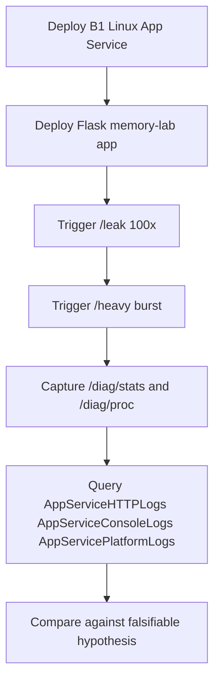
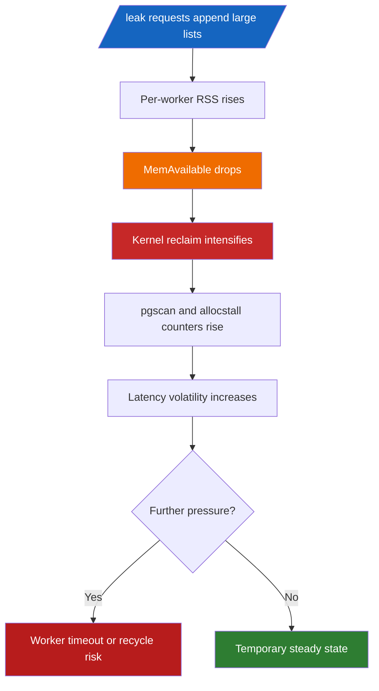
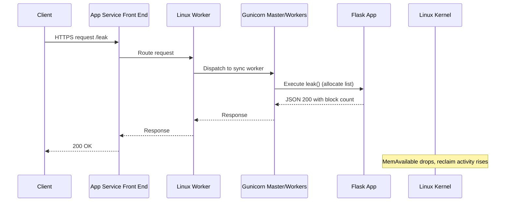
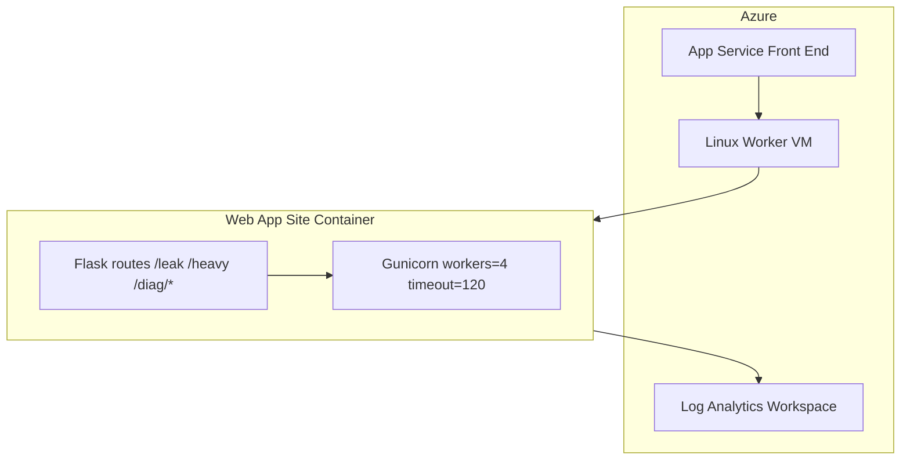
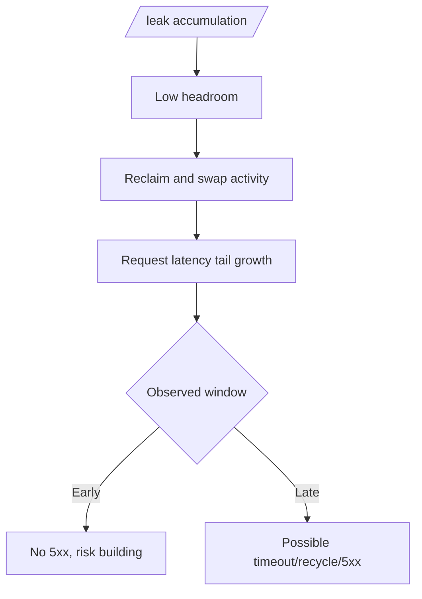
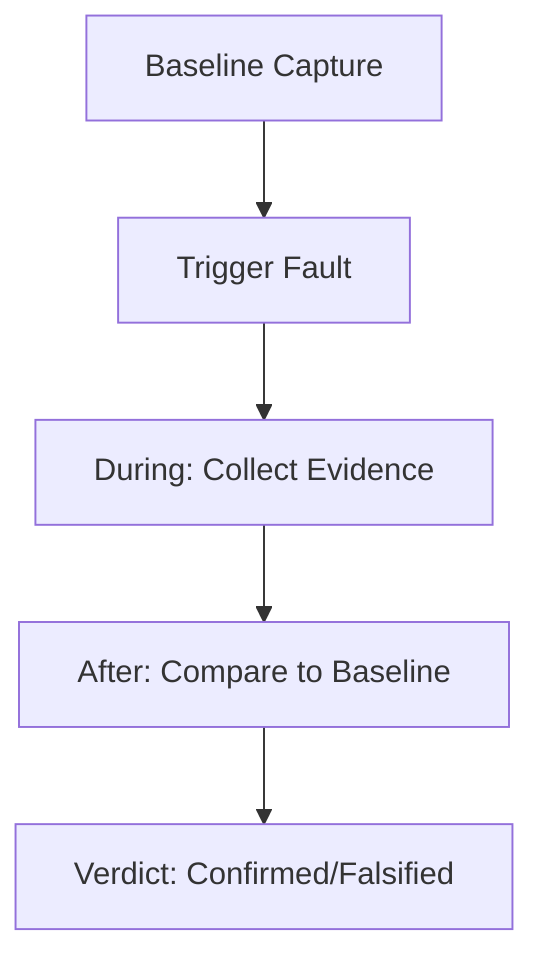

# Lab: Memory Pressure and Worker Degradation

This lab reproduces memory pressure behavior on Azure App Service (Linux, B1) using a Python Flask app that intentionally grows heap allocations (`/leak`) and triggers CPU/memory-intensive work (`/heavy`).

The goal is not only to "cause load," but to understand the full chain from user traffic to Gunicorn process behavior to Linux memory reclaim and App Service platform signals.

<!-- diagram-id: troubleshooting-lab-guides-memory-pressure-diagram-1 -->

```mermaid
graph TD
    A[Deploy B1 Linux App Service] --> B[Deploy Flask memory-lab app]
    B --> C[Trigger /leak 100x]
    C --> D[Trigger /heavy burst]
    D --> E[Capture /diag/stats and /diag/proc]
    E --> F[Query AppServiceHTTPLogs AppServiceConsoleLogs AppServicePlatformLogs]
    F --> G[Compare against falsifiable hypothesis]
```

## Lab Metadata

| Field | Value |
|---|---|
| Lab name | `memory-pressure` |
| Platform | Azure App Service (Linux, B1) |
| Runtime | Python 3.11 + Gunicorn |
| App path | `labs/memory-pressure/app` |
| Trigger script | `labs/memory-pressure/trigger.sh` |
| Artifact root | `labs/memory-pressure/artifacts-sanitized/` |
| Focus | Memory pressure and worker degradation under leak + heavy workload |
| Expected anti-pattern | Retained heap growth with constrained memory headroom across multiple sync workers |
| Expected symptom family | Low `MemAvailable`, reclaim/swap growth, latency tail expansion before potential hard failures |

!!! info "What this lab demonstrates"
    This run captured **strong memory pressure signals** and **reclaim activity**, but did **not** produce 5xx during the observed window.
    
    That is still valuable troubleshooting evidence: you can prove a memory-stress mechanism is active before user-visible failure occurs.

---

## 1) Background

### 1.1 Why this failure mode happens

Memory-pressure incidents in App Service are usually multi-layer issues:

1. **Application layer** allocates memory over time (intentional leak in this lab).
2. **Worker process layer** (Gunicorn) competes for RSS across multiple workers.
3. **Linux kernel layer** starts reclaim/scanning under pressure.
4. **Platform layer** may still report mostly healthy requests until pressure crosses a tipping point.

In short: rising memory pressure can be present long before obvious 5xx appears.

### 1.2 App Service Linux execution model in this lab

From the deployed app configuration artifact:

| Setting | Value (artifact) | Impact |
|---|---|---|
| `linuxFxVersion` | `PYTHON|3.11` | Linux Python runtime image |
| `appCommandLine` | `gunicorn --bind=0.0.0.0 --timeout=120 --workers=4 app:app` | Four sync workers share limited memory |
| `alwaysOn` | `false` | Worker can cold-start, not central to this test |
| `numberOfWorkers` | `1` | Single App Service instance |

Because B1 is constrained and this app uses `--workers=4`, memory fragmentation and worker-level RSS contention become visible faster under leak growth.

### 1.3 Failure progression model

<!-- diagram-id: troubleshooting-lab-guides-memory-pressure-diagram-2 -->

```mermaid
flowchart TD
    A[/leak requests append large lists/] --> B[Per-worker RSS rises]
    B --> C[MemAvailable drops]
    C --> D[Kernel reclaim intensifies]
    D --> E[pgscan and allocstall counters rise]
    E --> F[Latency volatility increases]
    F --> G{Further pressure?}
    G -->|Yes| H[Worker timeout or recycle risk]
    G -->|No| I[Temporary steady state]

    style A fill:#1565c0,color:#fff
    style C fill:#ef6c00,color:#fff
    style D fill:#c62828,color:#fff
    style H fill:#b71c1c,color:#fff
    style I fill:#2e7d32,color:#fff
```

### 1.4 Request path and where memory accumulates

<!-- diagram-id: troubleshooting-lab-guides-memory-pressure-diagram-3 -->

```mermaid
sequenceDiagram
    participant Client
    participant FrontEnd as App Service Front End
    participant Worker as Linux Worker
    participant Gunicorn as Gunicorn Master/Workers
    participant Flask as Flask App
    participant Kernel as Linux Kernel

    Client->>FrontEnd: HTTPS request /leak
    FrontEnd->>Worker: Route request
    Worker->>Gunicorn: Dispatch to sync worker
    Gunicorn->>Flask: Execute leak() (allocate list)
    Flask-->>Gunicorn: JSON 200 with block count
    Gunicorn-->>Worker: Response
    Worker-->>FrontEnd: Response
    FrontEnd-->>Client: 200 OK
    Note over Kernel: MemAvailable drops, reclaim activity rises
```

### 1.5 Why `/leak` + `/heavy` is a useful pair

- `/leak` stresses **persistent memory growth** (retained list in `LEAK_BUCKET`).
- `/heavy` stresses **CPU + transient allocations** (500k list creation + sort).
- Combined workload reveals whether the system is:
    - still handling requests,
    - but already paying increasing reclaim cost.

### 1.6 Signals used in this lab

| Signal Source | Endpoint / Table | What it indicates |
|---|---|---|
| App self-observation | `/diag/stats` | request count, leak block count, endpoint distribution |
| OS memory and reclaim | `/diag/proc` | `meminfo`, `vmstat`, `pressure_memory`, `loadavg` |
| HTTP pipeline | `AppServiceHTTPLogs` | status code, endpoint, server-side `TimeTaken` |
| App console | `AppServiceConsoleLogs` | runtime warnings/timeouts (none in this run) |
| Platform events | `AppServicePlatformLogs` | startup/restart/platform lifecycle events |

### 1.7 Linux counters that matter most here

From the app code (`/diag/proc`) and artifacts:

| Counter | Meaning | Why it matters |
|---|---|---|
| `MemAvailable` | Est. readily usable memory | Earliest practical low-memory signal |
| `SwapFree` | Available swap | Falling trend shows memory spillover |
| `pgscan_kswapd` | Background page scans | Reclaim pressure intensity |
| `pgscan_direct` | Direct reclaim scans | Allocation stress spilling into request path |
| `allocstall_normal` / `allocstall_movable` | Allocation stalls | Thread-level blocking pressure |
| `pswpin` / `pswpout` | Swap read/write events | Active swap churn |
| PSI (`some`, `full`) | Stall pressure averages | Direct pressure severity signal |

### 1.8 Architectural context diagram

<!-- diagram-id: troubleshooting-lab-guides-memory-pressure-diagram-4 -->

```mermaid
graph TD
    subgraph Azure
        FE[App Service Front End]
        W[Linux Worker VM]
        LA[Log Analytics Workspace]
    end

    subgraph SiteContainer[Web App Site Container]
        G[Gunicorn workers=4 timeout=120]
        F[Flask routes /leak /heavy /diag/*]
    end

    FE --> W
    W --> SiteContainer
    F --> G
    SiteContainer --> LA
```

### 1.9 Practical troubleshooting interpretation

Memory-pressure troubleshooting should not depend on a single symptom (for example, only 5xx rate).

Use a stacked interpretation:

1. **Pressure trend** (MemAvailable, SwapFree, reclaim counters)
2. **Latency trend** (`TimeTaken`, trigger timings)
3. **Error trend** (5xx, 499)
4. **Lifecycle trend** (restart/recycle events)

This lab gives a full chain for (1) and (2), with a "no 5xx yet" outcome for (3).

---

## 2) Hypothesis

### 2.1 Falsifiable hypothesis statement

If repeated `/leak` requests are used to consume memory on a B1 Linux App Service with 4 Gunicorn workers, then:

- `MemAvailable` will drop materially,
- reclaim/swap counters will increase,
- latency variance will rise,

even if HTTP 5xx does not immediately appear.

### 2.2 Causal chain

1. `/leak` appends large lists to `LEAK_BUCKET`.
2. Process RSS grows and available memory shrinks.
3. Kernel reclaim mechanisms intensify (`pgscan_*`, allocstall, swap churn).
4. `/heavy` runs under less headroom and produces longer tail latency.
5. Platform may still return mostly HTTP 200 during this intermediate state.

<!-- diagram-id: troubleshooting-lab-guides-memory-pressure-diagram-5 -->

```mermaid
flowchart TD
    A[/leak accumulation/] --> B[Low headroom]
    B --> C[Reclaim and swap activity]
    C --> D[Request latency tail growth]
    D --> E{Observed window}
    E -->|Early| F[No 5xx, risk building]
    E -->|Late| G[Possible timeout/recycle/5xx]
```

### 2.3 Proof criteria

All criteria below should be met to support the hypothesis:

| Criterion | Threshold | Artifact Evidence |
|---|---|---|
| Memory headroom collapse | `MemAvailable` large drop from baseline | baseline vs mid/post `/diag/proc` |
| Reclaim growth | `pgscan_*` and allocstall increase | baseline vs mid/post `/diag/proc` |
| Swap activity growth | `pswp*` increases and `SwapFree` decreases | baseline vs mid/post `/diag/proc` |
| App-level leak progression | `leak_block_count` grows | `/diag/stats` mid/post |
| Requests still mostly succeed | HTTP 200 dominant | trigger CSV + KQL HTTP logs |

### 2.4 Disproof criteria

Any one of the following would weaken/disprove this hypothesis:

- `MemAvailable` stays near baseline despite `/leak` volume.
- Reclaim counters stay flat while leak count grows.
- Swap does not change at all and no reclaim counters move.
- No measurable latency impact in trigger/KQL while pressure counters remain flat.

### 2.5 Variables

#### Independent variables (controlled)

| Variable | Value in this run |
|---|---|
| App plan SKU | B1 Linux |
| Gunicorn worker count | 4 |
| Gunicorn timeout | 120 seconds |
| Leak trigger volume | 100 sequential `/leak` requests |
| Heavy trigger volume | 50 concurrent `/heavy` requests (script target) |

#### Dependent variables (measured)

| Variable | Source |
|---|---|
| `MemAvailable`, `SwapFree`, `vmstat`, PSI | `/diag/proc` artifacts |
| `leak_block_count`, endpoint counters | `/diag/stats` artifacts |
| Endpoint status and duration | Trigger CSV + `AppServiceHTTPLogs` export |
| Runtime/platform error records | Console and platform KQL exports |

#### Controlled conditions

| Control | Value |
|---|---|
| Region | Korea Central |
| Runtime family | Python 3.11 |
| App shape | Same Flask routes and trigger scripts |
| Diagnostics destination | Single Log Analytics workspace |

### 2.6 Confounders and caveats

- KQL export windows may include extra baseline requests.
- Concurrent requests can be load-balanced across Gunicorn workers; one worker's leak count does not represent all workers.
- The `heavy-responses` artifact format is concatenated in one line; status extraction is still possible, and KQL cross-check is used for latency analysis.

!!! warning "Interpretation boundary"
    This run demonstrates **active memory stress and reclaim** but not final outage.
    
    Treat this as a **pre-failure signature** reference, not a complete outage profile.

---

## 3) Runbook

### 3.1 Prerequisite checks

Use these commands before deployment.

```bash
az version
az bicep version
az account show --output table
```

| Command/Flag | Purpose |
|---|---|
| `az version` | Verify Azure CLI is installed and display installed version |
| `az bicep version` | Confirm Bicep CLI is available for template deployment |
| `az account show` | Verify the active subscription context before deployment |
| `--output table` | Display output in human-readable table format |

Expected checks:

- Azure CLI installed and authenticated
- Bicep available via Azure CLI
- Correct subscription context selected

### 3.2 Set standard variables

Use repository variable conventions.

```bash
export RG="rg-lab-memory"
export LOCATION="koreacentral"
export BASE_NAME="labmem"
export APP_PACKAGE_PATH="/tmp/memory-pressure-app.zip"
```

### 3.3 Create resource group

```bash
az group create --name "$RG" --location "$LOCATION"
```

| Command/Flag | Purpose |
|---|---|
| `az group create` | Create a resource group to contain all lab resources |
| `--name` | Resource group name |
| `--location` | Azure region for the resource group |

Example output:

<!-- Verified: real az CLI output from koreacentral, 2026-05-01 -->
```json
{
  "location": "koreacentral",
  "name": "rg-lab-memory",
  "properties": {
    "provisioningState": "Succeeded"
  }
}
```

### 3.4 Deploy the lab infrastructure (actual Bicep path)

```bash
az deployment group create \
  --resource-group "$RG" \
  --template-file "labs/memory-pressure/main.bicep" \
  --parameters baseName="$BASE_NAME" location="$LOCATION"
```

| Command/Flag | Purpose |
|---|---|
| `az deployment group create` | Deploy Azure resources from a Bicep template |
| `--resource-group` | Target resource group for the deployment |
| `--template-file` | Path to the Bicep template defining lab infrastructure (App Service, Log Analytics) |
| `--parameters` | Override template parameters for base name and region |

Capture outputs:

```bash
export APP_NAME=$(az deployment group show \
  --resource-group "$RG" \
  --name "main" \
  --query "properties.outputs.webAppName.value" \
  --output tsv)

export APP_HOSTNAME=$(az deployment group show \
  --resource-group "$RG" \
  --name "main" \
  --query "properties.outputs.webAppDefaultHostName.value" \
  --output tsv)

export APP_URL="https://${APP_HOSTNAME}"
```

| Command | Purpose |
|---------|---------|
| `az deployment group show --resource-group "$RG" --name "main" --query "properties.outputs.webAppName.value" --output tsv` | Reads the `webAppName` deployment output from the `main` resource-group deployment. |
| `--resource-group "$RG" --name "main" --query "properties.outputs.webAppName.value" --output tsv` | Looks up the deployment in this resource group. |
| `--name "main" --query "properties.outputs.webAppName.value" --output tsv` | Targets the deployment record named `main`. |
| `--query "properties.outputs.webAppName.value" --output tsv` | Projects only the `webAppName` output's `value` field. |
| `--output tsv` | Returns the selected output value as plain text for shell variable assignment. |
| `az deployment group show --resource-group "$RG" --name "main" --query "properties.outputs.webAppDefaultHostName.value" --output tsv` | Reads the `webAppDefaultHostName` deployment output from the `main` resource-group deployment. |
| `--resource-group "$RG" --name "main" --query "properties.outputs.webAppDefaultHostName.value" --output tsv` | Looks up the deployment in this resource group. |
| `--name "main" --query "properties.outputs.webAppDefaultHostName.value" --output tsv` | Targets the deployment record named `main`. |
| `--query "properties.outputs.webAppDefaultHostName.value" --output tsv` | Projects only the `webAppDefaultHostName` output's `value` field. |
| `--output tsv` | Returns the selected output value as plain text for shell variable assignment. |

### 3.5 Package and deploy the lab app code

```bash
cd "labs/memory-pressure/app"
zip --recurse-paths "$APP_PACKAGE_PATH" .

az webapp deploy \
  --resource-group "$RG" \
  --name "$APP_NAME" \
  --src-path "$APP_PACKAGE_PATH" \
  --type zip
```

| Command | Purpose |
|---------|---------|
| `az webapp deploy --resource-group "$RG" --name "$APP_NAME" --src-path "$APP_PACKAGE_PATH" --type zip` | Deploys the packaged memory-pressure sample app to the target web app as a ZIP deployment. |
| `--resource-group "$RG" --name "$APP_NAME" --src-path "$APP_PACKAGE_PATH" --type zip` | Runs the deployment in this resource group. |
| `--name "$APP_NAME" --src-path "$APP_PACKAGE_PATH" --type zip` | Targets this web app. |
| `--src-path "$APP_PACKAGE_PATH" --type zip` | Uses the ZIP package built from the lab app directory as deployment input. |
| `--type zip` | Tells Azure CLI to perform a ZIP deployment. |

Restart app after deployment:

```bash
az webapp restart --resource-group "$RG" --name "$APP_NAME"
```

| Command | Purpose |
|---------|---------|
| `az webapp restart --resource-group "$RG" --name "$APP_NAME"` | Restarts the web app so the memory-pressure test begins from a clean post-deploy state. |
| `--resource-group "$RG" --name "$APP_NAME"` | Restarts the app in this resource group. |
| `--name "$APP_NAME"` | Targets this web app. |

### 3.6 Verify baseline endpoints

```bash
curl --silent "$APP_URL/"
curl --silent "$APP_URL/health"
curl --silent "$APP_URL/diag/stats"
curl --silent "$APP_URL/diag/proc"
```

Baseline artifact snapshot from this run:

| Artifact | Key values |
|---|---|
| `baseline/diag-stats.json` | `request_count=4`, `leak_block_count=0`, `pid=1901` |
| `baseline/diag-proc.json` | `MemTotal=1955532 kB`, `MemAvailable=523896 kB`, `SwapFree=3809772 kB` |
| `baseline/app-config.json` | `gunicorn --timeout=120 --workers=4` |

### 3.7 Confirm App Service runtime configuration

```bash
az webapp config show \
  --resource-group "$RG" \
  --name "$APP_NAME" \
  --output json
```

| Command | Purpose |
|---------|---------|
| `az webapp config show --resource-group "$RG" --name "$APP_NAME" --output json` | Retrieves the full site configuration so you can inspect runtime and worker settings before inducing memory pressure. |
| `--resource-group "$RG" --name "$APP_NAME" --output json` | Looks up the app configuration in this resource group. |
| `--name "$APP_NAME" --output json` | Targets this web app's configuration. |
| `--output json` | Returns the full configuration as JSON for inspection and artifact capture. |

Look specifically for:

- `linuxFxVersion`
- `appCommandLine`
- `alwaysOn`
- `numberOfWorkers`

### 3.8 Trigger memory pressure (actual trigger script)

```bash
bash "labs/memory-pressure/trigger.sh" "$APP_URL"
```

Script behavior:

1. Sends 100 sequential `/leak` requests.
2. Sends 50 concurrent `/heavy` requests with max 10 concurrent curl jobs.
3. Prints 5xx failure counts for each phase.

### 3.9 Mid-run diagnostic capture

During the leak phase, capture diagnostics:

```bash
curl --silent "$APP_URL/diag/stats" > /tmp/memory-mid-diag-stats.json
curl --silent "$APP_URL/diag/proc" > /tmp/memory-mid-diag-proc.json
```

After heavy phase:

```bash
curl --silent "$APP_URL/diag/stats" > /tmp/memory-post-diag-stats.json
curl --silent "$APP_URL/diag/proc" > /tmp/memory-post-diag-proc.json
```

### 3.10 Query Log Analytics workspace

Resolve workspace name from deployment output or resource query:

```bash
export LOG_WORKSPACE_NAME=$(az deployment group show \
  --resource-group "$RG" \
  --name "main" \
  --query "properties.outputs.logAnalyticsWorkspaceName.value" \
  --output tsv)

export LOG_WORKSPACE_ID=$(az monitor log-analytics workspace show \
  --resource-group "$RG" \
  --workspace-name "$LOG_WORKSPACE_NAME" \
  --query "customerId" \
  --output tsv)
```

| Command | Purpose |
|---------|---------|
| `az deployment group show --resource-group "$RG" --name "main" --query "properties.outputs.logAnalyticsWorkspaceName.value" --output tsv` | Reads the `logAnalyticsWorkspaceName` deployment output from the `main` deployment. |
| `--resource-group "$RG" --name "main" --query "properties.outputs.logAnalyticsWorkspaceName.value" --output tsv` | Looks up the deployment in this resource group. |
| `--name "main" --query "properties.outputs.logAnalyticsWorkspaceName.value" --output tsv` | Targets the deployment record named `main`. |
| `--query "properties.outputs.logAnalyticsWorkspaceName.value" --output tsv` | Projects only the `logAnalyticsWorkspaceName` output's `value` field. |
| `--output tsv` | Returns the workspace name as plain text for shell variable assignment. |
| `az monitor log-analytics workspace show --resource-group "$RG" --workspace-name "$LOG_WORKSPACE_NAME" --query "customerId" --output tsv` | Retrieves the Log Analytics workspace resource and emits its workspace customer ID. |
| `--resource-group "$RG" --workspace-name "$LOG_WORKSPACE_NAME" --query "customerId" --output tsv` | Looks up the workspace in this resource group. |
| `--workspace-name "$LOG_WORKSPACE_NAME" --query "customerId" --output tsv` | Targets this Log Analytics workspace. |
| `--query "customerId" --output tsv` | Projects only the workspace `customerId` field. |
| `--output tsv` | Returns the workspace customer ID as plain text for shell variable assignment. |

#### HTTP logs query

```bash
az monitor log-analytics query \
  --workspace "$LOG_WORKSPACE_ID" \
  --analytics-query "AppServiceHTTPLogs | where TimeGenerated > ago(2h) | where CsHost has 'app-' | project TimeGenerated, CsUriStem, ScStatus, TimeTaken, CsHost | order by TimeGenerated desc" \
  --output json
```

| Command/Flag | Purpose |
|---|---|
| `az monitor log-analytics query` | Execute a KQL query against a Log Analytics workspace |
| `--workspace` | Log Analytics workspace customer ID to query |
| `--analytics-query` | KQL query filtering AppServiceHTTPLogs for request status and timing |
| `--output json` | Return raw JSON for programmatic analysis |

#### Console logs query

```bash
az monitor log-analytics query \
  --workspace "$LOG_WORKSPACE_ID" \
  --analytics-query "AppServiceConsoleLogs | where TimeGenerated > ago(2h) | where ResultDescription has_any ('OutOfMemory','OOM','Killed','WORKER TIMEOUT','memory') | project TimeGenerated, ResultDescription | order by TimeGenerated desc" \
  --output json
```

| Command/Flag | Purpose |
|---|---|
| `az monitor log-analytics query` | Execute a KQL query against a Log Analytics workspace |
| `--analytics-query` | KQL query filtering AppServiceConsoleLogs for OOM and worker timeout signatures |
| `--output json` | Return raw JSON for programmatic analysis |

#### Platform logs query

```bash
az monitor log-analytics query \
  --workspace "$LOG_WORKSPACE_ID" \
  --analytics-query "AppServicePlatformLogs | where TimeGenerated > ago(2h) | project TimeGenerated, Level, Message | order by TimeGenerated desc" \
  --output json
```

| Command/Flag | Purpose |
|---|---|
| `az monitor log-analytics query` | Execute a KQL query against a Log Analytics workspace |
| `--analytics-query` | KQL query filtering AppServicePlatformLogs for lifecycle and restart events |
| `--output json` | Return raw JSON for programmatic analysis |

### 3.11 KQL query snippets for portal use

#### Portal view: Diagnose and solve problems blade (memory triage entry point)

[[[ shot("troubleshooting--diagnose-and-solve--03-diagnose-hub") ]]]

The `Diagnose and solve problems` blade is the Portal entry point that surfaces App Service's pre-built performance detectors before you reach the metric-by-metric exploration in the `Metrics` blade embed shown next - the `Web App Slow` link under `Popular troubleshooting tools` is a direct quick-access path to a curated detector that App Service correlates from platform-side signals (response times, worker recycles, memory percentages) without requiring you to write the KQL queries shown in section 3.10. The `Risk alerts` card at the top is the fastest signal that App Service has already flagged your app: in this capture, `Availability 2 Critical` means the platform's continuous diagnostic engine has detected availability degradation, which often correlates with the worker recycle risk path shown in section 1.3's failure progression diagram. For deeper categorical drill-downs, the `Availability and Performance` tile leads to detectors organized by symptom (Application Logs, App Down Workflow, Web App Down), and the `Diagnostic Tools` tile exposes `Auto-Heal` where you can verify whether memory-based recycle rules are active and matching the worker-recycle predictions in section 1.3. This blade sits one layer above the `Metrics` blade shown next: use this hub first to confirm the platform agrees a problem exists, then drill into specific `MemAvailable` and worker-RSS metrics via the chart configuration in the next H4.

#### Portal view: Metrics blade (memory pressure anchor)

[[[ shot("troubleshooting--log-analytics--08-mempressure-heavy-latency-kql") ]]]

**Purpose**: Provide an independent Portal-side execution of a top-10 `/heavy` latency query so a reviewer can confirm that the tabular latency summary in §4.7 (max `TimeTaken` 15,630 ms across the 100-row sanitized window) is a faithful reduction of the raw `AppServiceHTTPLogs` rows the Log Analytics service holds — and can also see that the live reproduction accumulated significantly higher tail latencies (max 58,613 ms in this capture) once the trigger was re-run and the worker was allowed to stay under memory pressure for longer than the original 100-row sample.

**Look for**:

- Blade heading reads "log-labmem-hch2g6gq7u63u | Logs" and the sub-heading reads "Log Analytics workspace" — this confirms the query ran against the same workspace attached to this lab's Web App via diagnostic settings, matching the workspace referenced by the sanitized JSON exports in §4.1.
- The KQL editor shows exactly the query `AppServiceHTTPLogs | where TimeGenerated > ago(1h) | where CsUriStem == '/heavy' | project TimeGenerated, CsUriStem, ScStatus, TimeTaken | order by TimeTaken desc | take 10` — the `==` operator on `CsUriStem` is an exact string match so only rows whose request path is literally `/heavy` are selected. Rows for `/diag/proc`, `/diag/stats`, or `/leak` are excluded even though they share the same trigger window.
- The Results grid shows exactly 10 rows (pagination "1 - 10 of 10") and every row's `ScStatus` column reads `200` — no 5xx present in the top-10 latency slice, matching §4.9's finding that no `WORKER TIMEOUT` or OOM records exist for this window.
- `TimeTaken` values are all above 30,000 ms with the top row at 58,613 ms (58.6 seconds) — roughly 3.7× higher than §4.7's sanitized-window max of 15,630 ms, showing that the worker continued serving requests but with progressively longer latency the longer it stayed under memory pressure.
- All 10 `TimeGenerated` values fall within a ~7-second wall-clock window (4:24:27 AM to 4:24:34 AM UTC) but the `TimeTaken` column shows each request spent 30-58 seconds inside the worker — this is the signature of a small burst of concurrent `/heavy` requests all competing for the same over-pressured Python worker, not a slow-and-steady degradation pattern.
- Query duration in bottom left reads a small millisecond value (here `0s 440ms`) — confirming the workspace is not throttled and the query hit indexed data, so the returned row count and latency values are authoritative and not a partial-scan timeout.

**Expected result**: The 10 rows returned by the Portal all show `ScStatus 200` and `TimeTaken` values in the 30-second-plus range, matching the §4.11 verdict "Supported (pre-failure stage)": requests succeed at the HTTP layer but tail latency is severely inflated because the Python worker is spending most of its wall-clock time in kernel reclaim, swap-in, and swap-out rather than in application code. If instead the Portal query returned rows with `ScStatus` 500 or 502 at the top of the latency-sorted result, the verdict would need to be upgraded to `Confirmed with outage` because the pre-failure stage would have progressed into worker recycle or app crashes.

**Next step**: If a future reproduction shows the top-10 latencies clustered under 5,000 ms even after a full `/heavy` trigger, the memory pressure signal is likely absent — cross-check the §4.6.1 Metrics chart for the expected ~1GB `Max` peak before drawing conclusions from the KQL export, because a missing peak on the platform-side metric would suggest the trigger script did not actually reach the app (for example due to a DNS or auth issue during the reproduction) rather than the app suddenly becoming memory-efficient.

### 4.9 KQL console and platform evidence

#### Console logs

From `kql-console-20260404T060610Z.json`:

- `rows: []`
- No `WORKER TIMEOUT`, `OOM`, or kill signature during this window.

#### Platform logs

From `kql-platform-20260404T060610Z.json`:

- Site/container startup lifecycle entries present.
- No restart/failure event in observed window.

Representative platform rows:

| TimeGenerated | Level | Message |
|---|---|---|
| `2026-04-04T05:04:41.3166132Z` | Informational | `Site started.` |
| `2026-04-04T05:04:41.0395645Z` | Informational | `Site startup probe succeeded after 8.7320828 seconds.` |
| `2026-04-04T05:04:32.099382Z` | Informational | `Container is running.` |

### 4.10 Raw KQL output sample (sanitized)

Representative rows from HTTP export:

| TimeGenerated | CsUriStem | ScStatus | TimeTaken |
|---|---|---:|---:|
| `2026-04-04T05:36:33.614669Z` | `/diag/stats` | 200 | 11 |
| `2026-04-04T05:36:32.83155Z` | `/diag/proc` | 200 | 205 |
| `2026-04-04T05:36:31.823068Z` | `/heavy` | 200 | 1393 |
| `2026-04-04T05:36:27.173104Z` | `/heavy` | 200 | 4962 |
| `2026-04-04T05:36:29.576105Z` | `/heavy` | 200 | 1540 |

### 4.11 Hypothesis verdict

#### Result: **Supported (pre-failure stage)**

Evidence that supports hypothesis:

1. `MemAvailable` dropped from `523896 kB` to `44760 kB` mid-leak.
2. `pgscan_kswapd` and `pgscan_direct` rose substantially.
3. `SwapFree` dropped by ~1.4 GB from baseline to post-heavy.
4. PSI memory pressure moved from near-zero avg10 to very high values.
5. `/heavy` latency tail in KQL reached 15+ seconds while status remained 200.

Evidence against immediate outage:

- No 5xx in trigger/KQL window.
- No console timeout/OOM records.
- No platform restart event in sampled interval.

Interpretation:

This run captured a **high-risk intermediate state** where memory pressure and reclaim were demonstrably active, but failure thresholds were not yet crossed.

### 4.12 Recommendations

1. Treat low `MemAvailable` + rising `pgscan_direct` as an early warning signal.
2. Reduce worker count or cap per-request memory growth before user-visible errors appear.
3. Add periodic `/diag/proc` telemetry in non-production labs for trend baselining.
4. Correlate HTTP latency tail with reclaim counters, not only with 5xx rate.
5. If this pattern appears in production, scale up plan memory or split workloads.

### 4.13 Reproducibility notes

- Trigger volume and timing are deterministic in script structure but still subject to worker scheduling variance.
- HTTP log windows can include extra baseline requests; always correlate by endpoint and timestamp.
- For strict phase accounting, export logs immediately after each phase boundary.

---

## Expected Evidence

This section defines what you SHOULD observe at each phase of the lab. Use it to validate your investigation is on track.

### Before Trigger (Baseline)

| Evidence Source | Expected State | What to Capture |
|---|---|---|
| AppServiceHTTPLogs | All 200s, low `TimeTaken` | Baseline query snapshot for `/health`, `/diag/stats`, and light traffic |
| AppServiceConsoleLogs | Normal Gunicorn boot lines with 4 workers | Worker PIDs `1892-1895` and startup timestamps |
| AppServicePlatformLogs | Site startup lifecycle only | "Site started" sequence and probe timing |
| `/diag/stats` | Low request volume and low leak counters | Baseline `leak_block_count`, endpoint counts, process counters |

### During Incident

| Evidence Source | Expected State | Key Indicator |
|---|---|---|
| `/leak` responses | HTTP 200 with steadily increasing block count | Leak progression confirms retained allocations are accumulating |
| AppServiceHTTPLogs (`/heavy`) | HTTP 200 with elevated `TimeTaken` | `920-1384 ms` baseline heavy tail, with outliers into multi-second range |
| `/diag/proc` | RSS growth across workers and lower memory headroom | `MemAvailable` falls while per-worker RSS rises |
| `/diag/proc` vmstat counters | Reclaim pressure rises | `pgscan_*` and `allocstall_*` counters increase materially |

### After Recovery

| Evidence Source | Expected State | Key Indicator |
|---|---|---|
| AppServiceHTTPLogs | No 5xx required for hypothesis support | Pressure evidence can exist even with 200-dominant responses |
| `/diag/stats` | Leak counters remain elevated until recycle/reset | Accumulated leak state persists after trigger burst |
| `/diag/proc` | Pressure can ease, but counters remain advanced | Reclaim counters do not roll back, proving pressure occurred |
| Console/Platform logs | No mandatory crash signatures in this run | Absence of restart does not disprove memory pressure |

### Evidence Timeline

<!-- diagram-id: troubleshooting-lab-guides-memory-pressure-diagram-7 -->

```mermaid
graph TD
    A[Baseline Capture] --> B[Trigger Fault]
    B --> C[During: Collect Evidence]
    C --> D[After: Compare to Baseline]
    D --> E[Verdict: Confirmed/Falsified]
```

### Evidence Chain: Why This Proves the Hypothesis

!!! success "Falsification Logic"
    If you observe rising `/leak` block counts, falling `MemAvailable`, and increasing `pgscan/allocstall` counters while `/heavy` latency expands, the hypothesis is CONFIRMED because memory pressure is demonstrably active before hard failure.
    
    If you do NOT observe memory-headroom collapse or reclaim-counter growth under the same trigger volume, the hypothesis is FALSIFIED — consider CPU-only saturation, dependency latency, or trigger-shape mismatch.

---

## Clean Up

```bash
az group delete --name "$RG" --yes --no-wait
```

| Command/Flag | Purpose |
|---|---|
| `az group delete` | Delete the resource group and all contained resources |
| `--name` | Resource group to delete |
| `--yes` | Skip confirmation prompt |
| `--no-wait` | Return immediately without waiting for deletion to complete |

---

## Related Playbook

- [Memory Pressure and Worker Degradation](../playbooks/performance/memory-pressure-and-worker-degradation.md)

---

## See Also

- [Intermittent 5xx Under Load Lab](./intermittent-5xx.md)
- [First 10 Minutes: App Service Troubleshooting](../first-10-minutes/index.md)

---

## Sources

- [Monitor Azure App Service](https://learn.microsoft.com/en-us/azure/app-service/monitor-app-service)
- [Azure App Service diagnostics logs](https://learn.microsoft.com/en-us/azure/app-service/troubleshoot-diagnostic-logs)
- [Troubleshoot high memory for an app in Azure App Service](https://learn.microsoft.com/en-us/azure/app-service/troubleshoot-performance-degradation#memory-issues)
- [Overview of Azure App Service plan](https://learn.microsoft.com/en-us/azure/app-service/overview-hosting-plans)
- [Configure Python on Azure App Service](https://learn.microsoft.com/en-us/azure/app-service/configure-language-python)
- [Quickstart: Create Bicep files with Visual Studio Code](https://learn.microsoft.com/en-us/azure/azure-resource-manager/bicep/quickstart-create-bicep-use-visual-studio-code)
