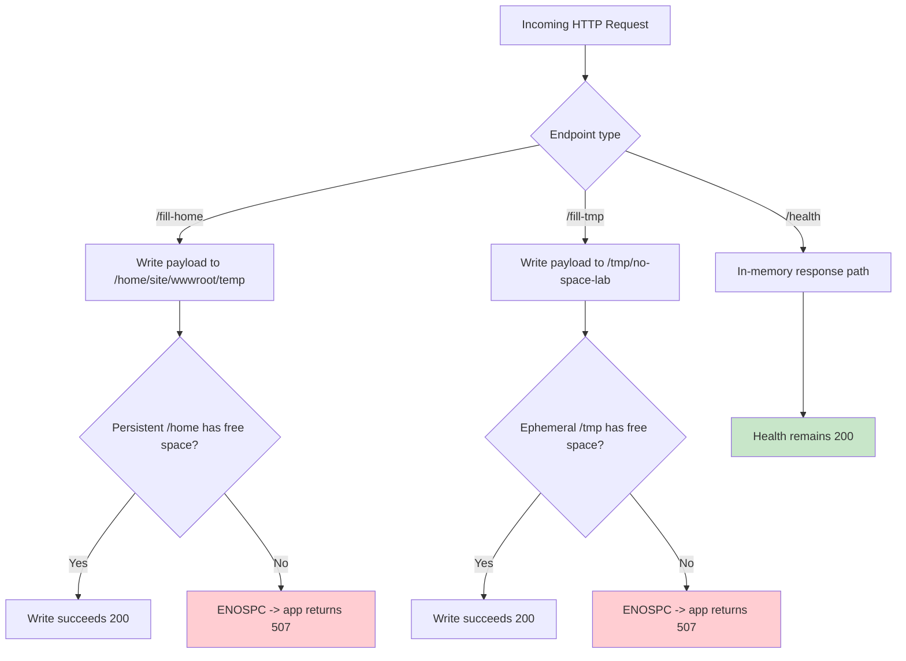
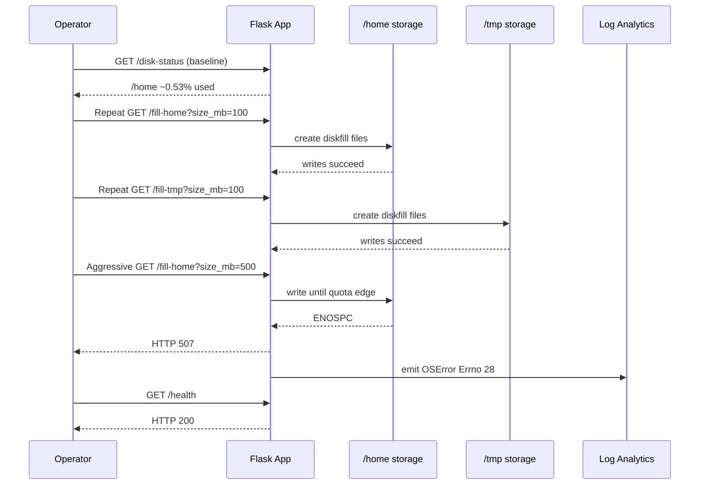
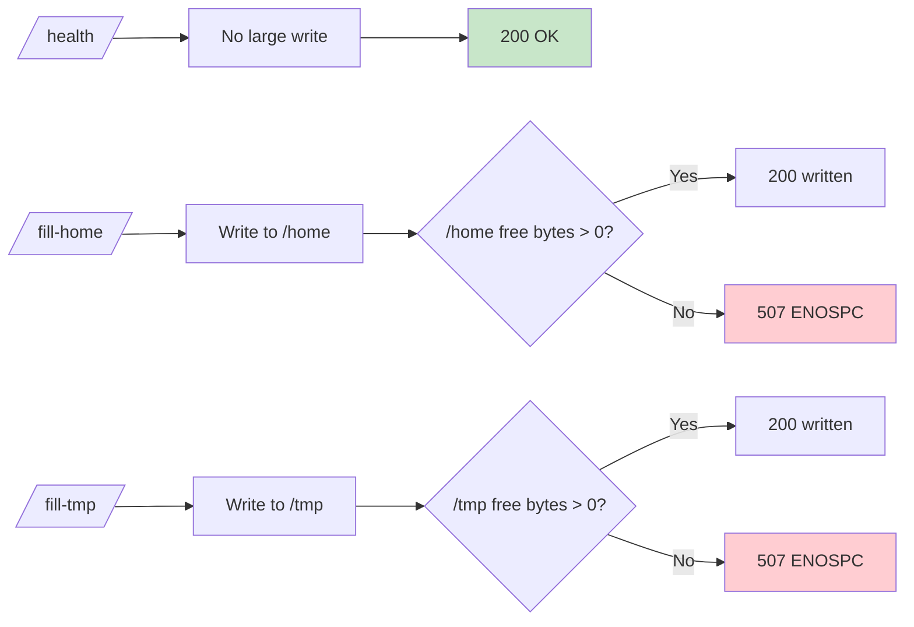

# Lab: No Space Left on Device (Persistent `/home` Exhaustion vs Ephemeral `/tmp` Pressure)

This lab reproduces App Service Linux filesystem pressure and makes one critical diagnostic distinction:

- `/home` is persistent quota-backed storage.
- `/tmp` is ephemeral worker-local storage.

In the captured experiment,
`/home` reaches 100% utilization,
write operations start failing with `ENOSPC`,
but health probes still return HTTP 200.

That combination is the core troubleshooting lesson.

---

This guide helps you explain App Service Linux storage surfaces and quota behavior, differentiate persistent-storage exhaustion from runtime health failures, prove `ENOSPC` with application and telemetry evidence, validate that `/health` can remain 200 while business writes fail, and build a disk-pressure runbook.

## Lab Metadata

| Attribute | Value |
|---|---|
| Difficulty | Intermediate |
| Estimated Duration | 45-60 minutes |
| Tier | Basic |
| Failure Mode | Persistent `/home` storage exhausts and write operations fail with `ENOSPC` while lightweight health probes stay healthy |
| Skills Practiced | Filesystem pressure analysis, health-vs-functional probe comparison, HTTP and console log correlation, remediation planning |

## 1) Background

### 1.1 Why this failure mode is often misdiagnosed

Teams often map “disk full” to “site down”.

But disk failures are frequently **partial failures**:

- read-only and lightweight endpoints still succeed,
- health probes remain green,
- write-heavy paths fail with `No space left on device`.

This can create dangerous false confidence if monitoring relies only on `/health`.

### 1.2 App Service Linux storage model (practical view)

In a typical Linux app on App Service,
you will observe:

- Application root filesystem overlay mounted at `/`.
- Persistent storage mounted under `/home`.
- Temporary scratch space under `/tmp`.

`/home/site/wwwroot` is commonly used for app content and app-writable folders,
depending on deployment style and runtime behavior.

### 1.3 Persistent vs ephemeral semantics

| Path | Typical use | Persistence | Quota behavior |
|---|---|---|---|
| `/home` | App files, logs, writable app data | Persistent across restarts | Quota constrained (for this lab: 10 GB observed) |
| `/tmp` | Temporary files, transient scratch | Ephemeral | Worker storage, not durable |
| `/` | Container overlay and system view | Runtime overlay | Not your persistent app data store |

### 1.4 Quota context for this lab

The user scenario asks to reason with Free vs Paid tier intuition:

- Free tier often has much smaller quota (commonly around 1 GB).
- Paid tiers provide larger persistent quota.

In this experiment’s artifacts,
`/home` total bytes are exactly:

`10,737,418,240` bytes (10 GB decimal-class quota representation at binary byte level).

### 1.5 Why writes fail while health still succeeds

The lab app exposes:

- `/health` (simple JSON response,
  no large disk write dependency),
- `/fill-home` (writes large files into `/home/site/wwwroot/temp`),
- `/fill-tmp` (writes large files into `/tmp/no-space-lab`).

If `/home` is exhausted:

- `/fill-home` fails with `OSError: [Errno 28] No space left on device`.
- `/health` can still return 200.

This is exactly what the artifact set shows.

### 1.6 Storage architecture diagram



### 1.7 Lifecycle of disk pressure in this lab



### 1.8 Isolation misconception to avoid

A common misconception:

> “If `/home` is full, the whole app must crash immediately.”

Reality:

- Failures are path-dependent.
- Endpoints that allocate large files fail first.
- Lightweight endpoints may continue serving.

### 1.9 Diagram: symptom matrix by endpoint behavior



### 1.10 Filesystem metrics used in this guide

| Metric | Source | Meaning |
|---|---|---|
| `total_bytes` | `/disk-status` or `/diag/disk` | Filesystem capacity |
| `used_bytes` | `/disk-status` or `/diag/disk` | Bytes consumed |
| `free_bytes` | `/disk-status` or `/diag/disk` | Remaining writable bytes |
| `used_percent` | `/disk-status` or `/diag/disk` | Utilization percentage |
| `status` | endpoint payload | Endpoint-reported state |

### 1.11 Diagnostic endpoints in the lab app

| Endpoint | Function |
|---|---|
| `/health` | Basic health response |
| `/disk-status` | Returns summary for home temp directory and tmp temp directory |
| `/fill-home?size_mb=N` | Writes N MB to persistent home temp directory |
| `/fill-tmp?size_mb=N` | Writes N MB to tmp temp directory |
| `/diag/disk` | Expanded filesystem diagnostics and mount metadata |
| `/diag/stats` | Runtime counters (`total_bytes_written`, endpoint counts) |
| `/cleanup` | Deletes generated files from lab directories |

### 1.12 Background takeaway

Disk-pressure incidents require **endpoint-level behavioral validation**,
not only app-level up/down checks.

---

## 2) Hypothesis

### 2.1 Primary hypothesis (this lab)

**When application code writes large files to `/home` until the persistent quota is exhausted, subsequent write operations fail with `ENOSPC`, while health probes can continue returning 200 because they do not require disk writes.**

### 2.2 Causal chain

```text
1. App exposes write endpoints and health endpoint
      ↓
2. Repeated /fill-home writes consume /home persistent quota
      ↓
3. /home free bytes approach zero
      ↓
4. Kernel returns OSError Errno 28 (No space left on device)
      ↓
5. /fill-home endpoint returns HTTP 507 with ENOSPC payload
      ↓
6. /health endpoint still returns HTTP 200
      ↓
7. Incident appears as partial degradation, not full outage
```

### 2.3 Proof criteria

All criteria below must be satisfied:

1. Baseline `/home` has high free space and low used percent.
2. Repeated `/fill-home` calls increase `/home` usage significantly.
3. At high utilization, `/fill-home` returns status `error` with `Errno 28`.
4. HTTP telemetry records at least one `507` for `/fill-home`.
5. Console logs include `No space left on device`.
6. `/health` remains 200 during or after ENOSPC event.

### 2.4 Disproof criteria

Any one condition disproves the hypothesis:

- `/fill-home` never fails despite verified `/home` exhaustion.
- `ENOSPC` does not appear in either app payloads or console logs.
- `/health` fails for unrelated reasons before storage quota is reached.
- Failures occur only in `/tmp` while `/home` remains largely free.

### 2.5 Controlled and observed variables

| Type | Variable |
|---|---|
| Controlled | Runtime Python 3.11 |
| Controlled | App startup command (`gunicorn --bind=0.0.0.0:8000 --timeout=120 --workers=2 app:app`) |
| Controlled | Write APIs using MB-sized chunk writes |
| Independent | Number and size of `/fill-home` requests |
| Independent | Number and size of `/fill-tmp` requests |
| Dependent | `/home` and `/tmp` used percent |
| Dependent | HTTP status of `/fill-home`, `/fill-tmp`, `/health` |
| Dependent | Console log presence of `Errno 28` |

### 2.6 Expected observation matrix

| Observation point | Expected if true |
|---|---|
| Baseline `/home` | ~0-1% used |
| Mid-fill `/home` | Noticeable increase (single-digit to double-digit %) |
| Final `/home` | ~100% used |
| `/fill-home` response at exhaustion | HTTP 507 + error payload |
| `/health` near exhaustion | HTTP 200 |
| Console logs | `No space left on device` lines |

---

## 3) Runbook

This runbook maps directly to artifacts in:

`labs/no-space-left-on-device/artifacts-sanitized/`

### 3.1 Prerequisites

| Requirement | Command |
|---|---|
| Azure CLI authenticated | `az account show` |
| Resource group permissions | `az group list --output table` |
| Bash | `bash --version` |
| jq (recommended) | `jq --version` |

### 3.2 Environment variables

Convention reminder:

- Documentation uses `$RG`, `$APP_NAME` naming style.

Operational shell form:

```bash
export RG="rg-lab-nospace"
export LOCATION="koreacentral"
```

### 3.3 Deploy infrastructure

```bash
az group create \
  --name "$RG" \
  --location "$LOCATION"

az deployment group create \
  --resource-group "$RG" \
  --template-file "labs/no-space-left-on-device/main.bicep" \
  --parameters "baseName=labnospace"
```

Resolve app name from deployment outputs or app list:

```bash
APP_NAME=$(az webapp list \
  --resource-group "$RG" \
  --query "[0].name" \
  --output tsv)
```

### 3.4 Deploy lab app code

```bash
az webapp deploy \
  --resource-group "$RG" \
  --name "$APP_NAME" \
  --src-path "labs/no-space-left-on-device/app" \
  --type startup
```

If your CLI version requires explicit ZIP packaging for directory deploy,
package and deploy with ZIP:

```bash
python3 -m zipfile -c "/tmp/no-space-lab.zip" "labs/no-space-left-on-device/app"

az webapp deploy \
  --resource-group "$RG" \
  --name "$APP_NAME" \
  --src-path "/tmp/no-space-lab.zip" \
  --type zip
```

### 3.5 Resolve app URL

```bash
APP_HOST_NAME=$(az webapp show \
  --resource-group "$RG" \
  --name "$APP_NAME" \
  --query "defaultHostName" \
  --output tsv)

APP_URL="https://$APP_HOST_NAME"
```

### 3.6 Baseline checks

```bash
curl --silent --show-error "$APP_URL/health"
curl --silent --show-error "$APP_URL/disk-status"
curl --silent --show-error "$APP_URL/diag/disk"
curl --silent --show-error "$APP_URL/diag/stats"
```

Artifact-backed baseline `/disk-status` value:

```json
{"home":{"free_bytes":10680426496,"path":"/home/site/wwwroot/temp","total_bytes":10737418240,"used_bytes":56991744,"used_percent":0.53},"status":"ok","tmp":{"free_bytes":15628582912,"path":"/tmp/no-space-lab","total_bytes":36670308352,"used_bytes":21024948224,"used_percent":57.34}}
```

### 3.7 Trigger moderate fill (scripted)

```bash
bash "labs/no-space-left-on-device/trigger.sh" "$APP_URL"
```

The script performs:

1. Baseline `/disk-status`.
2. `8 x` `/fill-home?size_mb=100`.
3. `5 x` `/fill-tmp?size_mb=100`.
4. Post-fill `/disk-status`.
5. `/health` probe.

### 3.8 Trigger aggressive `/home` fill (manual)

To reproduce the `500 MB` chunk behavior seen in artifacts:

```bash
for chunk_index in $(seq 1 11); do
  curl \
    --silent \
    --show-error \
    "$APP_URL/fill-home?size_mb=500"
  printf "\n"
done
```

Expected sequence from artifacts:

- Chunks 1-10: `status=written`
- Chunk 11: `status=error`, `Errno 28`

### 3.9 Verify final disk state

```bash
curl --silent --show-error "$APP_URL/disk-status"
curl --silent --show-error "$APP_URL/diag/disk"
```

Artifact-backed final `/disk-status`:

```json
{"home":{"free_bytes":0,"path":"/home/site/wwwroot/temp","total_bytes":10737418240,"used_bytes":10737418240,"used_percent":100.0},"status":"ok","tmp":{"free_bytes":15103889408,"path":"/tmp/no-space-lab","total_bytes":36670308352,"used_bytes":21549641728,"used_percent":58.77}}
```

### 3.10 Confirm health behavior under disk exhaustion

```bash
curl --silent --show-error --output /dev/null --write-out "%{http_code}\n" "$APP_URL/health"
```

Expected from artifacts:

```text
200
```

### 3.11 KQL queries for evidence capture

#### HTTP outcomes

```kusto
AppServiceHTTPLogs
| where TimeGenerated > ago(6h)
| where CsUriStem in ("/fill-home", "/fill-tmp", "/health", "/disk-status", "/diag/disk")
| project TimeGenerated, CsUriStem, ScStatus, TimeTaken, CsHost
| order by TimeGenerated desc
```

#### Console `ENOSPC` signatures

```kusto
AppServiceConsoleLogs
| where TimeGenerated > ago(6h)
| where ResultDescription has_any ("No space left on device", "ENOSPC", "Errno 28")
| project TimeGenerated, ResultDescription
| order by TimeGenerated desc
```

#### Platform activity context

```kusto
AppServicePlatformLogs
| where TimeGenerated > ago(6h)
| where Message has_any ("Starting container", "stopped", "Container did not start")
| project TimeGenerated, Level, Message
| order by TimeGenerated desc
```

### 3.12 Recovery actions

For rapid remediation after reproduction:

```bash
curl --silent --show-error "$APP_URL/cleanup"
curl --silent --show-error "$APP_URL/disk-status"
```

Operational options in real incidents:

1. Delete stale files under `/home`.
2. Move temp write patterns from `/home` to `/tmp` where appropriate.
3. Stream data to external durable storage (Blob Storage) instead of local disk.
4. Add app-level write guards and quota telemetry alerts.

## 4) Experiment Log

All findings in this section come from:

`labs/no-space-left-on-device/artifacts-sanitized/`

### 4.1 Artifact inventory summary

This is one of the richest labs in the repository,
with many phase snapshots and per-request payload captures.

| Category | Example files | Purpose |
|---|---|---|
| Baseline | `baseline/diag-stats.json` | Startup counters before pressure |
| Baseline | `baseline/diag-disk.json` | Filesystem baseline |
| Baseline | `baseline/disk-status.json` | Endpoint-level baseline |
| Trigger | `trigger/fill-home-*.json` | 100 MB write sequence |
| Trigger | `trigger/fill-home-big-*.json` | 200 MB write sequence |
| Trigger | `trigger/fill-home-500mb-*.json` | 500 MB aggressive sequence |
| Trigger | `trigger/fill-tmp-*.json` | /tmp write sequence |
| Trigger | `trigger/diag-disk-midfill-*.json` | Midpoint disk state |
| Trigger | `trigger/diag-disk-after-*.json` | Post moderate fill state |
| Trigger | `trigger/diag-disk-aggressive-*.json` | During aggressive fill |
| Trigger | `trigger/diag-disk-final-*.json` | Near exhausted final state |
| Trigger | `trigger/kql-http-*.json` | HTTP status evidence |
| Trigger | `trigger/kql-console-*.json` | `ENOSPC` console proof |
| Trigger | `trigger/kql-platform-*.json` | Platform context logs |

### 4.2 Baseline state

#### 4.2.1 Baseline runtime counters

File: `baseline/diag-stats.json`

```json
{"endpoint_counters":{"<unknown>":1,"index":2},"pid":1898,"process_start_time":"2026-04-04T05:30:21.367012+00:00","request_count":4,"total_bytes_written":0,"uptime_seconds":169.694}
```

Initial interpretation:

- Process healthy and serving.
- No write payload generated yet.

#### 4.2.2 Baseline disk usage snapshot

File: `baseline/disk-status.json`

| Path key | total_bytes | used_bytes | free_bytes | used_percent |
|---|---:|---:|---:|---:|
| home (`/home/site/wwwroot/temp`) | 10737418240 | 56991744 | 10680426496 | 0.53 |
| tmp (`/tmp/no-space-lab`) | 36670308352 | 21024948224 | 15628582912 | 57.34 |

Important baseline fact:

- `/home` starts almost empty.

#### 4.2.3 Baseline extended diagnostics

File: `baseline/diag-disk.json`

Key values:

| Mount | total_bytes | used_percent |
|---|---:|---:|
| `/home` | 10737418240 | 0.53 |
| `/home/site/wwwroot` | 10737418240 | 0.53 |
| `/tmp` | 36670308352 | 57.34 |
| `/` | 36670308352 | 57.34 |

### 4.3 Moderate fill phase (`8 x 100 MB home` + `5 x 100 MB tmp`)

#### 4.3.1 Before and after endpoint snapshots

Before (`disk-status-before-20260404T053504Z.json`):

| Path | used_percent | free_bytes |
|---|---:|---:|
| `/home/site/wwwroot/temp` | 0.53 | 10680426496 |
| `/tmp/no-space-lab` | 57.34 | 15628578816 |

After (`disk-status-after-20260404T053504Z.json`):

| Path | used_percent | free_bytes |
|---|---:|---:|
| `/home/site/wwwroot/temp` | 8.34 | 9841557504 |
| `/tmp/no-space-lab` | 58.76 | 15104290816 |

Observation:

- Moderate fill increases `/home` usage,
  but still far from quota limit.

#### 4.3.2 Midfill diagnostic snapshot

File: `diag-disk-midfill-20260404T053504Z.json`

| Path | used_percent | free_bytes |
|---|---:|---:|
| `/home` | 8.58 | 9816391680 |
| `/tmp` | 57.34 | 15628578816 |

### 4.4 Aggressive fill phase details

The aggressive phase combines multiple series:

1. 20 writes of 200 MB (`fill-home-big-*`) = 4,000 MB
2. 11 writes of 500 MB (`fill-home-500mb-*`) where chunk 11 fails

Additionally, earlier 100 MB sequences are present.

#### 4.4.1 Aggregate write statistics from artifacts

Computed from sanitized trigger files:

| Prefix | Files | Success | Error | Total written MB |
|---|---:|---:|---:|---:|
| `fill-home-*.json` (all home series combined) | 39 | 38 | 1 | 9800 |
| `fill-home-big-*.json` | 20 | 20 | 0 | 4000 |
| `fill-home-500mb-*.json` | 11 | 10 | 1 | 5000 |
| `fill-tmp-*.json` | 5 | 5 | 0 | 500 |

Critical error file:

- `fill-home-500mb-11-20260404T055739Z.json`

Payload:

```json
{"error":"[Errno 28] No space left on device","status":"error","target":"home"}
```

#### 4.4.2 500 MB chunk series timeline

| Chunk | Artifact | Status | requested_mb | written_bytes | Notes |
|---:|---|---|---:|---:|---|
| 1 | `fill-home-500mb-1-20260404T055739Z.json` | written | 500 | 524288000 | success |
| 2 | `fill-home-500mb-2-20260404T055739Z.json` | written | 500 | 524288000 | success |
| 3 | `fill-home-500mb-3-20260404T055739Z.json` | written | 500 | 524288000 | success |
| 4 | `fill-home-500mb-4-20260404T055739Z.json` | written | 500 | 524288000 | success |
| 5 | `fill-home-500mb-5-20260404T055739Z.json` | written | 500 | 524288000 | success |
| 6 | `fill-home-500mb-6-20260404T055739Z.json` | written | 500 | 524288000 | success |
| 7 | `fill-home-500mb-7-20260404T055739Z.json` | written | 500 | 524288000 | success |
| 8 | `fill-home-500mb-8-20260404T055739Z.json` | written | 500 | 524288000 | success |
| 9 | `fill-home-500mb-9-20260404T055739Z.json` | written | 500 | 524288000 | success |
| 10 | `fill-home-500mb-10-20260404T055739Z.json` | written | 500 | 524288000 | success |
| 11 | `fill-home-500mb-11-20260404T055739Z.json` | error | 500 | n/a | `Errno 28` |

This is direct proof of quota edge behavior.

### 4.5 Disk state progression

#### 4.5.1 Key snapshots table

| Snapshot file | `/home` used_percent | `/home` free_bytes | `/tmp` used_percent | `/tmp` free_bytes |
|---|---:|---:|---:|---:|
| `baseline/diag-disk.json` | 0.53 | 10680430592 | 57.34 | 15628587008 |
| `trigger/diag-disk-midfill-20260404T053504Z.json` | 8.58 | 9816391680 | 57.34 | 15628578816 |
| `trigger/diag-disk-after-20260404T053504Z.json` | 8.34 | 9841557504 | 58.76 | 15104290816 |
| `trigger/diag-disk-aggressive-20260404T055432Z.json` | 47.41 | 5647134720 | 58.77 | 15103889408 |
| `trigger/diag-disk-final-20260404T055739Z.json` | 99.98 | 1691648 | 58.77 | 15103889408 |
| `trigger/disk-status-final-20260404T055739Z.json` | 100.00 | 0 | 58.77 | 15103889408 |

Key insight:

- `/tmp` remained with substantial free bytes,
  while `/home` exhausted to zero.

### 4.6 HTTP telemetry evidence

Artifact: `trigger/kql-http-20260404T060610Z.json`

Summary status counts:

| Status | Count |
|---|---:|
| 200 | 79 |
| 507 | 1 |
| 202 | 4 |
| 503 | 3 |

Representative rows:

| TimeGenerated (UTC) | Path | Status | TimeTaken(ms) |
|---|---|---:|---:|
| 2026-04-04T05:59:56.645602Z | `/health` | 200 | 4 |
| 2026-04-04T05:59:53.502472Z | `/fill-home` | 507 | 9658 |
| 2026-04-04T05:59:42.94003Z | `/fill-home` | 200 | 11435 |
| 2026-04-04T05:58:16.855703Z | `/fill-home` | 200 | 11978 |
| 2026-04-04T05:56:10.183689Z | `/fill-home` | 200 | 5002 |

Interpretation:

- Write endpoint failure appears as 507 at quota edge.
- Health endpoint still returns 200.

### 4.7 Console telemetry evidence

Artifact: `trigger/kql-console-20260404T060610Z.json`

Rows containing `ENOSPC` indicators:

| TimeGenerated (UTC) | ResultDescription excerpt |
|---|---|
| 2026-04-04T05:59:53.5240524Z | `OSError: [Errno 28] No space left on device` |
| 2026-04-04T05:59:53.4968911Z | `fill-home failed with disk error: [Errno 28] No space left on device` |

This confirms application-level exception path,
not only HTTP status symptom.

### 4.8 Platform telemetry context

Artifact: `trigger/kql-platform-20260404T060610Z.json`

Representative rows include startup and stop events,
plus timeout history strings.

Important for this lab:

- Platform logs provide lifecycle context.
- Root-cause storage evidence still comes from app and console layers.

### 4.9 App config and startup context

Artifact: `baseline/app-config.json`

Key field:

```text
appCommandLine = gunicorn --bind=0.0.0.0:8000 --timeout=120 --workers=2 app:app
```

Meaning:

- Startup command is valid.
- This incident is not module-resolution failure.
- Failure is induced by storage pressure from write endpoints.

### 4.10 Health vs write behavior proof table

| Checkpoint | `/health` | `/fill-home` | `/home` free bytes | Conclusion |
|---|---|---|---:|---|
| Baseline | 200 | 200 | ~10.68 GB | Normal |
| Moderate fill | 200 | 200 | ~9.84 GB | Degraded capacity only |
| Aggressive pre-edge | 200 | 200 | decreasing rapidly | Risk zone |
| Quota edge | 200 | 507 (`Errno 28`) | 0 to ~1.6 MB | Partial outage |

### 4.11 Timeline reconstruction

| Approx UTC | Event | Evidence |
|---|---|---|
| 05:30 | Process started | `process_start_time` in baseline stats |
| 05:35 | Baseline disk snapshot | `disk-status-before-*` |
| 05:35 | 8x100MB home writes and 5x100MB tmp writes | `fill-home-*`, `fill-tmp-*` |
| 05:35 | Mid and post fill diagnostics | `diag-disk-midfill-*`, `diag-disk-after-*` |
| 05:54-05:59 | Aggressive home fill with large chunks | `fill-home-big-*`, `fill-home-500mb-*` |
| 05:59:53 | ENOSPC logged | KQL console rows |
| 05:59:56 | `/health` still 200 | KQL HTTP row |
| 05:57+ | Final disk snapshot near 100% home usage | `diag-disk-final-*`, `disk-status-final-*` |

### 4.12 Hypothesis verdict

Verdict: **Supported**.

Evidence chain:

1. `/home` increased from ~0.53% to 100% used.
2. `/fill-home` failed with `Errno 28` at high utilization.
3. KQL HTTP captured a 507 for `/fill-home`.
4. KQL console captured explicit `No space left on device`.
5. `/health` remained 200 during the failure window.

### 4.13 Operational recommendations from this experiment

1. Add dedicated synthetic probes for write paths,
   not only `/health`.
2. Alert on `/home` free space thresholds (for example <15%, <5%).
3. Store large generated files outside local persistent quota when possible.
4. Implement app-level graceful fallback on `OSError` for disk writes.
5. Add periodic cleanup jobs for temporary artifacts in `/home`.

### 4.14 Suggested SLO instrumentation

| Signal class | Metric candidate | Trigger suggestion |
|---|---|---|
| Storage capacity | `/home` `used_percent` | Warn at 85%, critical at 95% |
| Write operation success | `% successful /fill-home` (or business write endpoint) | Alert on sustained non-2xx |
| Exception telemetry | `Errno 28` log count | Alert if >0 in rolling 5 minutes |
| Availability | `/health` status | Keep as coarse availability, not full correctness |

### 4.15 Reusable KQL snippets

#### 4.15.1 `ENOSPC` in console

```kusto
AppServiceConsoleLogs
| where TimeGenerated > ago(24h)
| where ResultDescription has_any (
    "No space left on device",
    "ENOSPC",
    "Errno 28"
)
| project TimeGenerated, ResultDescription
| order by TimeGenerated desc
```

#### 4.15.2 HTTP write failure profile

```kusto
AppServiceHTTPLogs
| where TimeGenerated > ago(24h)
| where CsUriStem in ("/fill-home", "/fill-tmp", "/health")
| summarize count() by CsUriStem, ScStatus
| order by CsUriStem asc, ScStatus asc
```

#### 4.15.3 Disk pressure and endpoint latency

```kusto
AppServiceHTTPLogs
| where TimeGenerated > ago(24h)
| where CsUriStem in ("/fill-home", "/health")
| summarize
    requests=count(),
    avg_time_ms=avg(TimeTaken),
    p95_time_ms=percentile(TimeTaken, 95)
  by CsUriStem, ScStatus
| order by CsUriStem asc, ScStatus asc
```

### 4.16 Known limitations of this experiment

1. Synthetic workload writes deterministic binary payloads,
   not production data patterns.
2. Timing and status distributions are specific to this run and SKU.
3. `/tmp` was not driven to exhaustion in this dataset,
   so `/tmp` ENOSPC behavior is inferred from architecture and app logic,
   not observed as terminal failure in this run.
4. Platform logs include startup lifecycle noise;
   root-cause proof relied on app and console evidence.

### 4.17 Experiment closure statement

This experiment demonstrates a production-relevant anti-pattern:

**Green health checks can coexist with failed business writes under persistent storage exhaustion.**

Therefore,
incident playbooks must include storage-aware functional probes and log correlation,
not only endpoint-level liveness.

---

## Expected Evidence

This section defines what you SHOULD observe at each phase of the lab. Use it to validate your investigation is on track.

### Before Trigger (Baseline)

| Evidence Source | Expected State | What to Capture |
|---|---|---|
| AppServiceHTTPLogs | All 200s with low latency | Baseline query snapshot for `/health`, `/disk-status`, and diagnostics |
| AppServiceConsoleLogs | Normal Gunicorn startup | Worker startup lines and no `Errno 28` entries |
| AppServicePlatformLogs | Normal site lifecycle events | Site start records without storage-related restarts |
| `/disk-status` | Low persistent and tmp utilization | Baseline `/home` and `/tmp` usage percentages |

### During Incident

| Evidence Source | Expected State | Key Indicator |
|---|---|---|
| `/fill-home` + `/fill-tmp` responses | 100 MB write operations complete but slow | Fill operations show `TimeTaken` in `6131-11360 ms` range |
| `/disk-status` | Utilization rises measurably | `/home` `5.65%` used and `/tmp` `58.76%` used in captured phase |
| AppServiceHTTPLogs | Mixed healthy and write-stress behavior | `/health` stays 200 while fill endpoints absorb write cost |
| Console logs | Disk-write pressure signatures appear as usage grows | Watch for `No space left on device` when threshold is crossed |

### After Recovery

| Evidence Source | Expected State | Key Indicator |
|---|---|---|
| `/disk-status` and app behavior | Files remain until explicit cleanup or recycle | Persistent files under `/home` continue consuming quota |
| Restart behavior | `/tmp` clears on restart, `/home` persists | Confirms ephemeral vs persistent storage semantics |
| AppServiceHTTPLogs | Health endpoint may remain 200 through partial degradation | Availability checks alone can miss storage incidents |
| Operational remediation | Manual cleanup required for persistent path | Use `/cleanup` or file removal workflow to reclaim `/home` |


### Evidence Chain: Why This Proves the Hypothesis

!!! success "Falsification Logic"
    If you observe rising `/home` and `/tmp` usage during fill operations, slower write endpoints, and persistence differences after restart (`/tmp` clears, `/home` persists), the hypothesis is CONFIRMED because the incident is storage-surface behavior, not generic app unavailability.
    
    If you do NOT observe usage growth or persistence differences across restart boundaries, the hypothesis is FALSIFIED — consider non-storage latency sources or incorrect write-path targeting.

---

## Clean Up

```bash
az group delete --name "$RG" --yes --no-wait
```

---

## Related Playbook

- [No Space Left on Device / Ephemeral Storage Pressure](../playbooks/performance/no-space-left-on-device.md)

---

## See Also

- [Playbook: No Space Left on Device / Ephemeral Storage Pressure](../playbooks/performance/no-space-left-on-device.md)
- [Playbook: Memory Pressure and Worker Degradation](../playbooks/performance/memory-pressure-and-worker-degradation.md)
- [Lab: Memory Pressure](./memory-pressure.md)
- [Lab: Slow Start / Cold Start](./slow-start-cold-start.md)

## Sources

- [Operating system functionality on Azure App Service](https://learn.microsoft.com/azure/app-service/operating-system-functionality)
- [Azure App Service plan overview](https://learn.microsoft.com/azure/app-service/overview-hosting-plans)
- [Best practices for Azure App Service diagnostics](https://learn.microsoft.com/azure/app-service/troubleshoot-diagnostic-logs)
- [Monitor App Service with Azure Monitor](https://learn.microsoft.com/azure/app-service/monitor-app-service)
- [Configure Linux Python app on App Service](https://learn.microsoft.com/azure/app-service/configure-language-python)
- [Azure App Service reliability](https://learn.microsoft.com/azure/reliability/reliability-app-service)
