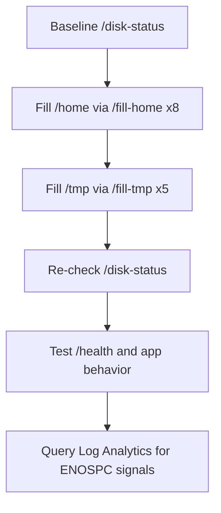

# Lab: No Space Left on Device / Ephemeral Storage Pressure

Reproduce disk-pressure symptoms on Azure App Service Linux by deploying a Python/Flask app on a B1 plan, then intentionally filling both persistent `/home` storage and ephemeral `/tmp` storage.

## Objective

Deploy and stress a Python App Service workload so you can observe `No space left on device` (`ENOSPC`) errors and distinguish persistent `/home` exhaustion from ephemeral `/tmp` exhaustion.

## Prerequisites

- Azure subscription
- Azure CLI installed and logged in
- Bash shell

## Deploy

```bash
# Create resource group
az group create --name rg-lab-diskfull --location koreacentral

# Deploy lab infrastructure
az deployment group create \
  --resource-group rg-lab-diskfull \
  --template-file lab-guides/no-space-left-on-device/main.bicep \
  --parameters baseName=labdisk

# Get generated app name
APP_NAME=$(az deployment group show \
  --resource-group rg-lab-diskfull \
  --name main \
  --query "properties.outputs.webAppName.value" \
  --output tsv)

# Deploy lab app code
az webapp deploy \
  --resource-group rg-lab-diskfull \
  --name "$APP_NAME" \
  --src-path lab-guides/no-space-left-on-device/app
```

## Trigger the Symptom

```bash
# Get the app URL
APP_URL=$(az webapp show --resource-group rg-lab-diskfull --name <app-name> --query "defaultHostName" --output tsv)

# Run the trigger script
bash lab-guides/no-space-left-on-device/trigger.sh "https://$APP_URL"
```

## Observe



1. Open Azure Portal → App Service → Diagnose and Solve Problems.
2. Check filesystem behavior in app logs as writes increase.
3. Query Log Analytics:

```kusto
AppServiceConsoleLogs
| where TimeGenerated > ago(1h)
| where ResultDescription has_any ("No space left", "ENOSPC", "disk", "/home", "/tmp")
| project TimeGenerated, ResultDescription
| order by TimeGenerated desc
```

## Expected Signals

- `/fill-home` eventually returns write errors as `/home` approaches quota
- `/fill-tmp` eventually returns write errors as ephemeral storage pressure increases
- Console logs show `No space left on device` or `ENOSPC`
- `/health` may degrade or fail under sustained storage pressure

## Clean Up

```bash
az group delete --name rg-lab-diskfull --yes --no-wait
```

## Related Playbook

- [No Space Left on Device / Ephemeral Storage Pressure](../playbooks/performance/no-space-left-on-device.md)

## References

- [Operating system functionality on Azure App Service](https://learn.microsoft.com/en-us/azure/app-service/operating-system-functionality)
- [Azure App Service plan overview](https://learn.microsoft.com/en-us/azure/app-service/overview-hosting-plans)
- [Quickstart: Create Bicep files with Visual Studio Code](https://learn.microsoft.com/en-us/azure/azure-resource-manager/bicep/quickstart-create-bicep-use-visual-studio-code)
- [Enable diagnostic logging for apps in Azure App Service](https://learn.microsoft.com/en-us/azure/app-service/troubleshoot-diagnostic-logs)
