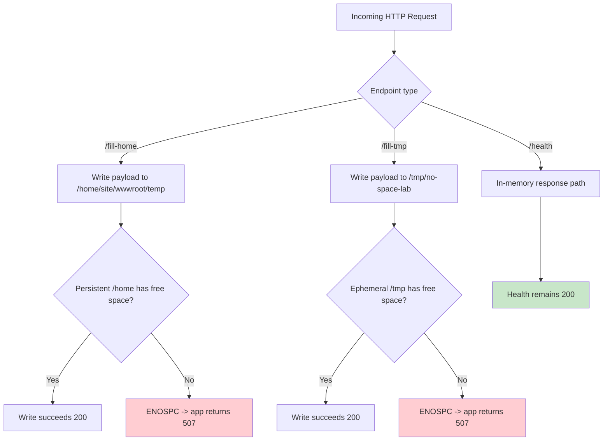
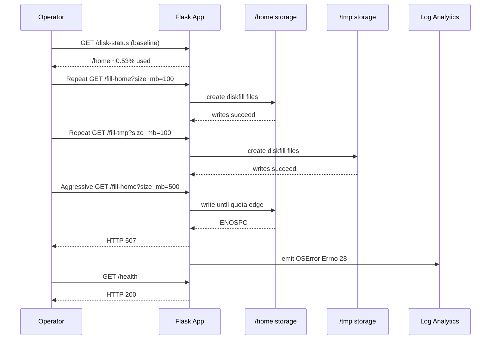
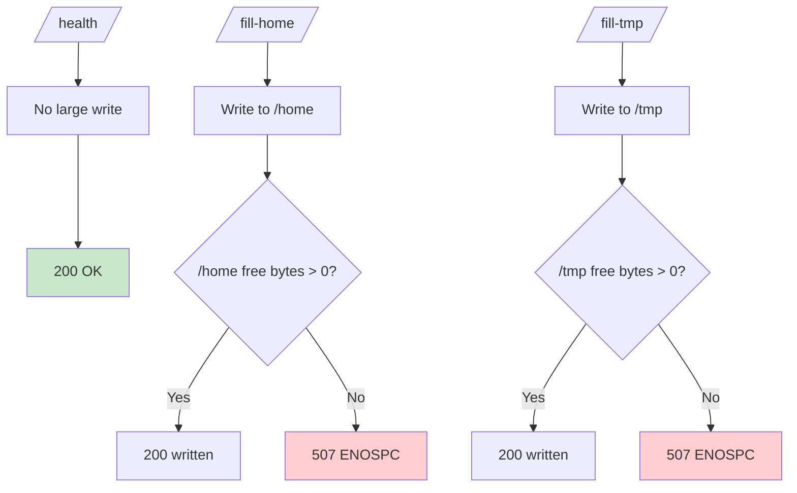
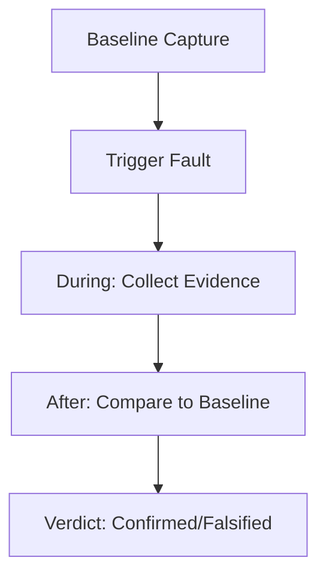

---
content_sources:
  diagrams:
    - id: troubleshooting-lab-guides-no-space-left-on-device-diagram-1
      type: flowchart
      source: self-generated
      justification: "Self-generated troubleshooting diagram synthesized from Microsoft Learn diagnostics and Azure App Service incident guidance for this guide."
      based_on:
        - https://learn.microsoft.com/en-us/azure/app-service/troubleshoot-diagnostic-logs
        - https://learn.microsoft.com/en-us/azure/app-service/troubleshoot-http-502-http-503
    - id: troubleshooting-lab-guides-no-space-left-on-device-diagram-2
      type: sequenceDiagram
      source: self-generated
      justification: "Self-generated troubleshooting diagram synthesized from Microsoft Learn diagnostics and Azure App Service incident guidance for this guide."
      based_on:
        - https://learn.microsoft.com/en-us/azure/app-service/troubleshoot-diagnostic-logs
        - https://learn.microsoft.com/en-us/azure/app-service/troubleshoot-http-502-http-503
    - id: troubleshooting-lab-guides-no-space-left-on-device-diagram-3
      type: graph
      source: self-generated
      justification: "Self-generated troubleshooting diagram synthesized from Microsoft Learn diagnostics and Azure App Service incident guidance for this guide."
      based_on:
        - https://learn.microsoft.com/en-us/azure/app-service/troubleshoot-diagnostic-logs
        - https://learn.microsoft.com/en-us/azure/app-service/troubleshoot-http-502-http-503
    - id: troubleshooting-lab-guides-no-space-left-on-device-diagram-4
      type: graph
      source: self-generated
      justification: "Self-generated troubleshooting diagram synthesized from Microsoft Learn diagnostics and Azure App Service incident guidance for this guide."
      based_on:
        - https://learn.microsoft.com/en-us/azure/app-service/troubleshoot-diagnostic-logs
        - https://learn.microsoft.com/en-us/azure/app-service/troubleshoot-http-502-http-503
---
# Lab: No Space Left on Device (Persistent `/home` Exhaustion vs Ephemeral `/tmp` Pressure)

This lab reproduces App Service Linux filesystem pressure and makes one critical diagnostic distinction:

- `/home` is persistent quota-backed storage.
- `/tmp` is ephemeral worker-local storage.

In the captured experiment,
`/home` reaches 100% utilization,
write operations start failing with `ENOSPC`,
but health probes still return HTTP 200.

That combination is the core troubleshooting lesson.

---

This guide helps you explain App Service Linux storage surfaces and quota behavior, differentiate persistent-storage exhaustion from runtime health failures, prove `ENOSPC` with application and telemetry evidence, validate that `/health` can remain 200 while business writes fail, and build a disk-pressure runbook.

## Lab Metadata

| Attribute | Value |
|---|---|
| Difficulty | Intermediate |
| Estimated Duration | 45-60 minutes |
| Tier | Basic |
| Failure Mode | Persistent `/home` storage exhausts and write operations fail with `ENOSPC` while lightweight health probes stay healthy |
| Skills Practiced | Filesystem pressure analysis, health-vs-functional probe comparison, HTTP and console log correlation, remediation planning |

## 1) Background

### 1.1 Why this failure mode is often misdiagnosed

Teams often map “disk full” to “site down”.

But disk failures are frequently **partial failures**:

- read-only and lightweight endpoints still succeed,
- health probes remain green,
- write-heavy paths fail with `No space left on device`.

This can create dangerous false confidence if monitoring relies only on `/health`.

### 1.2 App Service Linux storage model (practical view)

In a typical Linux app on App Service,
you will observe:

- Application root filesystem overlay mounted at `/`.
- Persistent storage mounted under `/home`.
- Temporary scratch space under `/tmp`.

`/home/site/wwwroot` is commonly used for app content and app-writable folders,
depending on deployment style and runtime behavior.

### 1.3 Persistent vs ephemeral semantics

| Path | Typical use | Persistence | Quota behavior |
|---|---|---|---|
| `/home` | App files, logs, writable app data | Persistent across restarts | Quota constrained (for this lab: 10 GB observed) |
| `/tmp` | Temporary files, transient scratch | Ephemeral | Worker storage, not durable |
| `/` | Container overlay and system view | Runtime overlay | Not your persistent app data store |

### 1.4 Quota context for this lab

The user scenario asks to reason with Free vs Paid tier intuition:

- Free tier often has much smaller quota (commonly around 1 GB).
- Paid tiers provide larger persistent quota.

In this experiment’s artifacts,
`/home` total bytes are exactly:

`10,737,418,240` bytes (10 GB decimal-class quota representation at binary byte level).

#### Portal view: App Service Plan Overview blade (pricing tier and shared-storage context)

[[[ shot("troubleshooting--app-service-plan--01-asp-overview") ]]]

The `App Service Plan` Overview blade confirms three platform-side facts that anchor this lab's assumptions - the `Pricing plan` value (here `P0v3`) confirms the SKU tier that controls compute resources (CPU, memory, scale-up options), the `Operating System: Linux` field confirms which storage model from section 1.2 applies, and the `App(s) / Slots: 1 / 1` field confirms that this plan currently hosts 1 app and 1 deployment slot. The `App(s) / Slots` field matters because `/home` storage is shared across every app and deployment slot bound to the same plan: a second app on the same plan would consume from the same pool described in section 1.3's persistent-vs-ephemeral semantics, which is the most common real-world source of "I didn't change anything and now I'm out of space". The `10,737,418,240` byte quota cited above comes from this lab's runtime artifacts (section 1.4) and from the official App Service limits documentation - this Overview blade does not surface that quota value as a field, so do not infer the quota directly from anything visible on this capture. Use this blade as your first stop when investigating "no space left on device" errors in production: confirm the SKU and OS first, click the `Pricing plan` link to reach the Scale up blade if compute starvation is in scope, or expand the left navigation to locate the plan's `Apps` blade and enumerate other apps that may be competing for the shared `/home` quota.

### 1.5 Why writes fail while health still succeeds

The lab app exposes:

- `/health` (simple JSON response,
  no large disk write dependency),
- `/fill-home` (writes large files into `/home/site/wwwroot/temp`),
- `/fill-tmp` (writes large files into `/tmp/no-space-lab`).

If `/home` is exhausted:

- `/fill-home` fails with `OSError: [Errno 28] No space left on device`.
- `/health` can still return 200.

This is exactly what the artifact set shows.

### 1.6 Storage architecture diagram

<!-- diagram-id: troubleshooting-lab-guides-no-space-left-on-device-diagram-1 -->

```mermaid
flowchart TD
    A[Incoming HTTP Request] --> B{Endpoint type}
    B -->|/health| C[In-memory response path]
    B -->|/fill-home| D[Write payload to /home/site/wwwroot/temp]
    B -->|/fill-tmp| E[Write payload to /tmp/no-space-lab]

    D --> F{Persistent /home has free space?}
    F -->|Yes| G[Write succeeds 200]
    F -->|No| H[ENOSPC -> app returns 507]

    E --> I{Ephemeral /tmp has free space?}
    I -->|Yes| J[Write succeeds 200]
    I -->|No| K[ENOSPC -> app returns 507]

    C --> L[Health remains 200]

    style L fill:#c8e6c9
    style H fill:#ffcdd2
    style K fill:#ffcdd2
```

### 1.7 Lifecycle of disk pressure in this lab

<!-- diagram-id: troubleshooting-lab-guides-no-space-left-on-device-diagram-2 -->

```mermaid
sequenceDiagram
    participant Operator
    participant App as Flask App
    participant Home as /home storage
    participant Tmp as /tmp storage
    participant Logs as Log Analytics

    Operator->>App: GET /disk-status (baseline)
    App-->>Operator: /home ~0.53% used
    Operator->>App: Repeat GET /fill-home?size_mb=100
    App->>Home: create diskfill files
    Home-->>App: writes succeed
    Operator->>App: Repeat GET /fill-tmp?size_mb=100
    App->>Tmp: create diskfill files
    Tmp-->>App: writes succeed
    Operator->>App: Aggressive GET /fill-home?size_mb=500
    App->>Home: write until quota edge
    Home-->>App: ENOSPC
    App-->>Operator: HTTP 507
    App->>Logs: emit OSError Errno 28
    Operator->>App: GET /health
    App-->>Operator: HTTP 200
```

### 1.8 Isolation misconception to avoid

A common misconception:

> “If `/home` is full, the whole app must crash immediately.”

Reality:

- Failures are path-dependent.
- Endpoints that allocate large files fail first.
- Lightweight endpoints may continue serving.

### 1.9 Diagram: symptom matrix by endpoint behavior

<!-- diagram-id: troubleshooting-lab-guides-no-space-left-on-device-diagram-3 -->

```mermaid
graph TD
    A[/health/] --> A1[No large write]
    A1 --> A2[200 OK]

    B[/fill-home/] --> B1[Write to /home]
    B1 --> B2{/home free bytes > 0?}
    B2 -->|Yes| B3[200 written]
    B2 -->|No| B4[507 ENOSPC]

    C[/fill-tmp/] --> C1[Write to /tmp]
    C1 --> C2{/tmp free bytes > 0?}
    C2 -->|Yes| C3[200 written]
    C2 -->|No| C4[507 ENOSPC]

    style A2 fill:#c8e6c9
    style B4 fill:#ffcdd2
    style C4 fill:#ffcdd2
```

### 1.10 Filesystem metrics used in this guide

| Metric | Source | Meaning |
|---|---|---|
| `total_bytes` | `/disk-status` or `/diag/disk` | Filesystem capacity |
| `used_bytes` | `/disk-status` or `/diag/disk` | Bytes consumed |
| `free_bytes` | `/disk-status` or `/diag/disk` | Remaining writable bytes |
| `used_percent` | `/disk-status` or `/diag/disk` | Utilization percentage |
| `status` | endpoint payload | Endpoint-reported state |

### 1.11 Diagnostic endpoints in the lab app

| Endpoint | Function |
|---|---|
| `/health` | Basic health response |
| `/disk-status` | Returns summary for home temp directory and tmp temp directory |
| `/fill-home?size_mb=N` | Writes N MB to persistent home temp directory |
| `/fill-tmp?size_mb=N` | Writes N MB to tmp temp directory |
| `/diag/disk` | Expanded filesystem diagnostics and mount metadata |
| `/diag/stats` | Runtime counters (`total_bytes_written`, endpoint counts) |
| `/cleanup` | Deletes generated files from lab directories |

### 1.12 Background takeaway

Disk-pressure incidents require **endpoint-level behavioral validation**,
not only app-level up/down checks.

---

## 2) Hypothesis

### 2.1 Primary hypothesis (this lab)

**When application code writes large files to `/home` until the persistent quota is exhausted, subsequent write operations fail with `ENOSPC`, while health probes can continue returning 200 because they do not require disk writes.**

### 2.2 Causal chain

```text
1. App exposes write endpoints and health endpoint
      ↓
2. Repeated /fill-home writes consume /home persistent quota
      ↓
3. /home free bytes approach zero
      ↓
4. Kernel returns OSError Errno 28 (No space left on device)
      ↓
5. /fill-home endpoint returns HTTP 507 with ENOSPC payload
      ↓
6. /health endpoint still returns HTTP 200
      ↓
7. Incident appears as partial degradation, not full outage
```

### 2.3 Proof criteria

All criteria below must be satisfied:

1. Baseline `/home` has high free space and low used percent.
2. Repeated `/fill-home` calls increase `/home` usage significantly.
3. At high utilization, `/fill-home` returns status `error` with `Errno 28`.
4. HTTP telemetry records at least one `507` for `/fill-home`.
5. Console logs include `No space left on device`.
6. `/health` remains 200 during or after ENOSPC event.

### 2.4 Disproof criteria

Any one condition disproves the hypothesis:

- `/fill-home` never fails despite verified `/home` exhaustion.
- `ENOSPC` does not appear in either app payloads or console logs.
- `/health` fails for unrelated reasons before storage quota is reached.
- Failures occur only in `/tmp` while `/home` remains largely free.

### 2.5 Controlled and observed variables

| Type | Variable |
|---|---|
| Controlled | Runtime Python 3.11 |
| Controlled | App startup command (`gunicorn --bind=0.0.0.0:8000 --timeout=120 --workers=2 app:app`) |
| Controlled | Write APIs using MB-sized chunk writes |
| Independent | Number and size of `/fill-home` requests |
| Independent | Number and size of `/fill-tmp` requests |
| Dependent | `/home` and `/tmp` used percent |
| Dependent | HTTP status of `/fill-home`, `/fill-tmp`, `/health` |
| Dependent | Console log presence of `Errno 28` |

### 2.6 Expected observation matrix

| Observation point | Expected if true |
|---|---|
| Baseline `/home` | ~0-1% used |
| Mid-fill `/home` | Noticeable increase (single-digit to double-digit %) |
| Final `/home` | ~100% used |
| `/fill-home` response at exhaustion | HTTP 507 + error payload |
| `/health` near exhaustion | HTTP 200 |
| Console logs | `No space left on device` lines |

---

## 3) Runbook

This runbook maps directly to artifacts in:

`labs/no-space-left-on-device/artifacts-sanitized/`

### 3.1 Prerequisites

| Requirement | Command |
|---|---|
| Azure CLI authenticated | `az account show` |
| Resource group permissions | `az group list --output table` |
| Bash | `bash --version` |
| jq (recommended) | `jq --version` |

### 3.2 Environment variables

Convention reminder:

- Documentation uses `$RG`, `$APP_NAME` naming style.

Operational shell form:

```bash
export RG="rg-lab-nospace"
export LOCATION="koreacentral"
```

### 3.3 Deploy infrastructure

```bash
az group create \
  --name "$RG" \
  --location "$LOCATION"

az deployment group create \
  --resource-group "$RG" \
  --template-file "labs/no-space-left-on-device/main.bicep" \
  --parameters "baseName=labnospace"
```

| Command/Flag | Purpose |
|---|---|
| `az group create` | Create the resource group for all lab resources |
| `--name` | Resource group name |
| `--location` | Azure region for deployment |
| `az deployment group create` | Deploy lab infrastructure using Bicep template |
| `--resource-group` | Target resource group for the deployment |
| `--template-file` | Path to Bicep template defining App Service plan and web app for storage testing |
| `--parameters` | Override base name prefix for resource naming |

Resolve app name from deployment outputs or app list:

```bash
APP_NAME=$(az webapp list \
  --resource-group "$RG" \
  --query "[0].name" \
  --output tsv)
```

| Command | Purpose |
|---------|---------|
| `az webapp list --resource-group "$RG" --query "[0].name" --output tsv` | Lists web apps in the lab resource group and returns the first app name. |
| `--resource-group "$RG" --query "[0].name" --output tsv` | Limits the app list to this resource group. |
| `--query "[0].name" --output tsv` | Selects the `name` field from the first item in the returned web-app array. |
| `--output tsv` | Returns the app name as plain text for shell variable assignment. |

### 3.4 Deploy lab app code

```bash
az webapp deploy \
  --resource-group "$RG" \
  --name "$APP_NAME" \
  --src-path "labs/no-space-left-on-device/app" \
  --type startup
```

| Command/Flag | Purpose |
|---|---|
| `az webapp deploy` | Deploy application code to the web app |
| `--resource-group` | Resource group containing the app |
| `--name` | Web app name |
| `--src-path` | Path to the lab application directory |
| `--type startup` | Deploy as startup script/directory deployment |

If your CLI version requires explicit ZIP packaging for directory deploy,
package and deploy with ZIP:

```bash
python3 -m zipfile -c "/tmp/no-space-lab.zip" "labs/no-space-left-on-device/app"

az webapp deploy \
  --resource-group "$RG" \
  --name "$APP_NAME" \
  --src-path "/tmp/no-space-lab.zip" \
  --type zip
```

| Command/Flag | Purpose |
|---|---|
| `az webapp deploy` | Deploy application as a ZIP package (alternative method) |
| `--resource-group` | Resource group containing the app |
| `--name` | Web app name |
| `--src-path` | Path to the locally built ZIP archive |
| `--type zip` | Deploy as ZIP package for CLI versions requiring explicit packaging |

### 3.5 Resolve app URL

```bash
APP_HOST_NAME=$(az webapp show \
  --resource-group "$RG" \
  --name "$APP_NAME" \
  --query "defaultHostName" \
  --output tsv)

APP_URL="https://$APP_HOST_NAME"
```

| Command | Purpose |
|---------|---------|
| `az webapp show --resource-group "$RG" --name "$APP_NAME" --query "defaultHostName" --output tsv` | Retrieves the app's default hostname so the runbook can build the public URL. |
| `--resource-group "$RG" --name "$APP_NAME" --query "defaultHostName" --output tsv` | Looks up the app in this resource group. |
| `--name "$APP_NAME" --query "defaultHostName" --output tsv` | Targets this web app. |
| `--query "defaultHostName" --output tsv` | Projects only the app's `defaultHostName` field. |
| `--output tsv` | Returns the hostname as plain text for shell variable assignment. |

### 3.6 Baseline checks

```bash
curl --silent --show-error "$APP_URL/health"
curl --silent --show-error "$APP_URL/disk-status"
curl --silent --show-error "$APP_URL/diag/disk"
curl --silent --show-error "$APP_URL/diag/stats"
```

Artifact-backed baseline `/disk-status` value:

```json
{"home":{"free_bytes":10680426496,"path":"/home/site/wwwroot/temp","total_bytes":10737418240,"used_bytes":56991744,"used_percent":0.53},"status":"ok","tmp":{"free_bytes":15628582912,"path":"/tmp/no-space-lab","total_bytes":36670308352,"used_bytes":21024948224,"used_percent":57.34}}
```

### 3.7 Trigger moderate fill (scripted)

```bash
bash "labs/no-space-left-on-device/trigger.sh" "$APP_URL"
```

The script performs:

1. Baseline `/disk-status`.
2. `8 x` `/fill-home?size_mb=100`.
3. `5 x` `/fill-tmp?size_mb=100`.
4. Post-fill `/disk-status`.
5. `/health` probe.

### 3.8 Trigger aggressive `/home` fill (manual)

To reproduce the `500 MB` chunk behavior seen in artifacts:

```bash
for chunk_index in $(seq 1 11); do
  curl \
    --silent \
    --show-error \
    "$APP_URL/fill-home?size_mb=500"
  printf "\n"
done
```

Expected sequence from artifacts:

- Chunks 1-10: `status=written`
- Chunk 11: `status=error`, `Errno 28`

### 3.9 Verify final disk state

```bash
curl --silent --show-error "$APP_URL/disk-status"
curl --silent --show-error "$APP_URL/diag/disk"
```

Artifact-backed final `/disk-status`:

```json
{"home":{"free_bytes":0,"path":"/home/site/wwwroot/temp","total_bytes":10737418240,"used_bytes":10737418240,"used_percent":100.0},"status":"ok","tmp":{"free_bytes":15103889408,"path":"/tmp/no-space-lab","total_bytes":36670308352,"used_bytes":21549641728,"used_percent":58.77}}
```

### 3.10 Confirm health behavior under disk exhaustion

```bash
curl --silent --show-error --output /dev/null --write-out "%{http_code}\n" "$APP_URL/health"
```

Expected from artifacts:

```text
200
```

### 3.11 KQL queries for evidence capture

#### Portal view: Log stream (live ENOSPC tail)

[[[ shot("troubleshooting--log-analytics--07-nolabspace-enospc-console-kql") ]]]

**Purpose**: Provide an independent Portal-side execution of the same KQL query whose exported results are stored in `trigger/kql-console-20260404T060610Z.json`, so a reviewer can confirm that the two `ENOSPC` rows shown in the §4.7 table are not an artifact of local export tooling (`az monitor log-analytics query`) but are the same records the Log Analytics service returns to an interactive Portal query against the `AppServiceConsoleLogs` table.

**Look for**:

- Blade heading reads "log-labdisk-uz2rvn6exc56q | Logs" and the sub-heading reads "Log Analytics workspace" — this confirms the query ran against the same workspace used for this lab's exported KQL evidence.
- The KQL editor shows exactly the query `AppServiceConsoleLogs | where ResultDescription has "No space left on device" | project TimeGenerated, ResultDescription | order by TimeGenerated desc | take 10` — the `has` operator matches whole tokens, so the filter is anchored on the specific phrase "No space left on device" and cannot silently match a substring inside an unrelated log line.
- The Results grid shows exactly 2 rows (pagination "1 - 2 of 2") — the same row count as the §4.7 table.
- Row 1 ResultDescription contains `OSError: [Errno 28] No space left on device` — Python's standard exception message for ENOSPC.
- Row 2 ResultDescription contains `[Errno 28] No space left on device` inside the app-level `fill-home failed with disk error` string — the app's own exception handler surfaced the same errno.
- Query duration in bottom left reads a small millisecond value (here `0s 459ms`) — confirming the workspace is not throttled and the query hit indexed data.

**Expected result**: The row count in the Portal (2) matches the row count in the exported JSON referenced by §4.7 (also 2). The two `TimeGenerated` values in the Portal fall within seconds of each other and are ordered by descending time, consistent with a single write attempt raising the OS-level `OSError` (row 1) and the app's exception handler logging the wrapped error message (row 2, logged milliseconds earlier). If instead the Portal returned zero rows against the same 24-hour window, suspect a Diagnostic Settings misconfiguration on the Web App (the `AppServiceConsoleLogs` category may not be enabled) and re-check `az monitor diagnostic-settings list --resource $APP` before concluding the ENOSPC log path is broken.

**Next step**: If the KQL row count in a future reproduction is much higher than 2 (say 20+), the app is retrying the failing `/fill-home` endpoint on its own — check the client-side reproduction script (`labs/no-space-left-on-device/trigger.sh`) for an inadvertent retry loop, because the intended lab shape is a single failed write followed by manual investigation, not a retry storm.

### 4.8 Platform telemetry context

Artifact: `trigger/kql-platform-20260404T060610Z.json`

Representative rows include startup and stop events,
plus timeout history strings.

Important for this lab:

- Platform logs provide lifecycle context.
- Root-cause storage evidence still comes from app and console layers.

### 4.9 App config and startup context

Artifact: `baseline/app-config.json`

Key field:

```text
appCommandLine = gunicorn --bind=0.0.0.0:8000 --timeout=120 --workers=2 app:app
```

Meaning:

- Startup command is valid.
- This incident is not module-resolution failure.
- Failure is induced by storage pressure from write endpoints.

### 4.10 Health vs write behavior proof table

| Checkpoint | `/health` | `/fill-home` | `/home` free bytes | Conclusion |
|---|---|---|---:|---|
| Baseline | 200 | 200 | ~10.68 GB | Normal |
| Moderate fill | 200 | 200 | ~9.84 GB | Degraded capacity only |
| Aggressive pre-edge | 200 | 200 | decreasing rapidly | Risk zone |
| Quota edge | 200 | 507 (`Errno 28`) | 0 to ~1.6 MB | Partial outage |

### 4.11 Timeline reconstruction

| Approx UTC | Event | Evidence |
|---|---|---|
| 05:30 | Process started | `process_start_time` in baseline stats |
| 05:35 | Baseline disk snapshot | `disk-status-before-*` |
| 05:35 | 8x100MB home writes and 5x100MB tmp writes | `fill-home-*`, `fill-tmp-*` |
| 05:35 | Mid and post fill diagnostics | `diag-disk-midfill-*`, `diag-disk-after-*` |
| 05:54-05:59 | Aggressive home fill with large chunks | `fill-home-big-*`, `fill-home-500mb-*` |
| 05:59:53 | ENOSPC logged | KQL console rows |
| 05:59:56 | `/health` still 200 | KQL HTTP row |
| 05:57+ | Final disk snapshot near 100% home usage | `diag-disk-final-*`, `disk-status-final-*` |

### 4.12 Hypothesis verdict

Verdict: **Supported**.

Evidence chain:

1. `/home` increased from ~0.53% to 100% used.
2. `/fill-home` failed with `Errno 28` at high utilization.
3. KQL HTTP captured a 507 for `/fill-home`.
4. KQL console captured explicit `No space left on device`.
5. `/health` remained 200 during the failure window.

### 4.13 Operational recommendations from this experiment

1. Add dedicated synthetic probes for write paths,
   not only `/health`.

2. Alert on `/home` free space thresholds (for example <15%, <5%).
3. Store large generated files outside local persistent quota when possible.
4. Implement app-level graceful fallback on `OSError` for disk writes.
5. Add periodic cleanup jobs for temporary artifacts in `/home`.

### 4.14 Suggested SLO instrumentation

| Signal class | Metric candidate | Trigger suggestion |
|---|---|---|
| Storage capacity | `/home` `used_percent` | Warn at 85%, critical at 95% |
| Write operation success | `% successful /fill-home` (or business write endpoint) | Alert on sustained non-2xx |
| Exception telemetry | `Errno 28` log count | Alert if >0 in rolling 5 minutes |
| Availability | `/health` status | Keep as coarse availability, not full correctness |

### 4.15 Reusable KQL snippets

#### 4.15.1 `ENOSPC` in console

```kusto
AppServiceConsoleLogs
| where TimeGenerated > ago(24h)
| where ResultDescription has_any (
    "No space left on device",
    "ENOSPC",
    "Errno 28"
)
| project TimeGenerated, ResultDescription
| order by TimeGenerated desc
```

#### 4.15.2 HTTP write failure profile

```kusto
AppServiceHTTPLogs
| where TimeGenerated > ago(24h)
| where CsUriStem in ("/fill-home", "/fill-tmp", "/health")
| summarize count() by CsUriStem, ScStatus
| order by CsUriStem asc, ScStatus asc
```

#### 4.15.3 Disk pressure and endpoint latency

```kusto
AppServiceHTTPLogs
| where TimeGenerated > ago(24h)
| where CsUriStem in ("/fill-home", "/health")
| summarize
    requests=count(),
    avg_time_ms=avg(TimeTaken),
    p95_time_ms=percentile(TimeTaken, 95)
  by CsUriStem, ScStatus
| order by CsUriStem asc, ScStatus asc
```

### 4.16 Known limitations of this experiment

1. Synthetic workload writes deterministic binary payloads,
   not production data patterns.

2. Timing and status distributions are specific to this run and SKU.
3. `/tmp` was not driven to exhaustion in this dataset,
   so `/tmp` ENOSPC behavior is inferred from architecture and app logic,
   not observed as terminal failure in this run.

4. Platform logs include startup lifecycle noise;
   root-cause proof relied on app and console evidence.

### 4.17 Experiment closure statement

This experiment demonstrates a production-relevant anti-pattern:

**Green health checks can coexist with failed business writes under persistent storage exhaustion.**

Therefore,
incident playbooks must include storage-aware functional probes and log correlation,
not only endpoint-level liveness.

---

## Expected Evidence

This section defines what you SHOULD observe at each phase of the lab. Use it to validate your investigation is on track.

### Before Trigger (Baseline)

| Evidence Source | Expected State | What to Capture |
|---|---|---|
| AppServiceHTTPLogs | All 200s with low latency | Baseline query snapshot for `/health`, `/disk-status`, and diagnostics |
| AppServiceConsoleLogs | Normal Gunicorn startup | Worker startup lines and no `Errno 28` entries |
| AppServicePlatformLogs | Normal site lifecycle events | Site start records without storage-related restarts |
| `/disk-status` | Low persistent and tmp utilization | Baseline `/home` and `/tmp` usage percentages |

### During Incident

| Evidence Source | Expected State | Key Indicator |
|---|---|---|
| `/fill-home` + `/fill-tmp` responses | 100 MB write operations complete but slow | Fill operations show `TimeTaken` in `6131-11360 ms` range |
| `/disk-status` | Utilization rises measurably | `/home` `5.65%` used and `/tmp` `58.76%` used in captured phase |
| AppServiceHTTPLogs | Mixed healthy and write-stress behavior | `/health` stays 200 while fill endpoints absorb write cost |
| Console logs | Disk-write pressure signatures appear as usage grows | Watch for `No space left on device` when threshold is crossed |

### After Recovery

| Evidence Source | Expected State | Key Indicator |
|---|---|---|
| `/disk-status` and app behavior | Files remain until explicit cleanup or recycle | Persistent files under `/home` continue consuming quota |
| Restart behavior | `/tmp` clears on restart, `/home` persists | Confirms ephemeral vs persistent storage semantics |
| AppServiceHTTPLogs | Health endpoint may remain 200 through partial degradation | Availability checks alone can miss storage incidents |
| Operational remediation | Manual cleanup required for persistent path | Use `/cleanup` or file removal workflow to reclaim `/home` |

### Evidence Timeline

<!-- diagram-id: troubleshooting-lab-guides-no-space-left-on-device-diagram-4 -->

```mermaid
graph TD
    A[Baseline Capture] --> B[Trigger Fault]
    B --> C[During: Collect Evidence]
    C --> D[After: Compare to Baseline]
    D --> E[Verdict: Confirmed/Falsified]
```

### Evidence Chain: Why This Proves the Hypothesis

!!! success "Falsification Logic"
    If you observe rising `/home` and `/tmp` usage during fill operations, slower write endpoints, and persistence differences after restart (`/tmp` clears, `/home` persists), the hypothesis is CONFIRMED because the incident is storage-surface behavior, not generic app unavailability.
    
    If you do NOT observe usage growth or persistence differences across restart boundaries, the hypothesis is FALSIFIED — consider non-storage latency sources or incorrect write-path targeting.

---

## Clean Up

```bash
az group delete --name "$RG" --yes --no-wait
```

| Command/Flag | Purpose |
|---|---|
| `az group delete` | Remove the entire resource group and all lab resources |
| `--name` | Resource group to delete |
| `--yes` | Skip confirmation prompt |
| `--no-wait` | Return immediately without waiting for deletion to complete |

---

## Related Playbook

- [No Space Left on Device / Ephemeral Storage Pressure](../playbooks/performance/no-space-left-on-device.md)

---

## See Also

- [Playbook: No Space Left on Device / Ephemeral Storage Pressure](../playbooks/performance/no-space-left-on-device.md)
- [Playbook: Memory Pressure and Worker Degradation](../playbooks/performance/memory-pressure-and-worker-degradation.md)
- [Lab: Memory Pressure](./memory-pressure.md)
- [Lab: Slow Start / Cold Start](./slow-start-cold-start.md)

## Sources

- [Operating system functionality on Azure App Service](https://learn.microsoft.com/en-us/azure/app-service/operating-system-functionality)
- [Azure App Service plan overview](https://learn.microsoft.com/en-us/azure/app-service/overview-hosting-plans)
- [Best practices for Azure App Service diagnostics](https://learn.microsoft.com/en-us/azure/app-service/troubleshoot-diagnostic-logs)
- [Monitor App Service with Azure Monitor](https://learn.microsoft.com/en-us/azure/app-service/monitor-app-service)
- [Configure Linux Python app on App Service](https://learn.microsoft.com/en-us/azure/app-service/configure-language-python)
- [Azure App Service reliability](https://learn.microsoft.com/en-us/azure/reliability/reliability-app-service)
