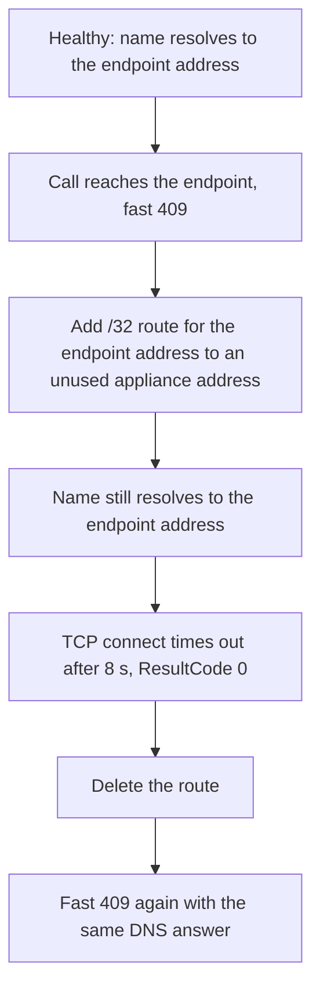

---
content_sources:
  diagrams:
    - id: troubleshooting-lab-guides-private-endpoint-route-diagram-1
      type: flowchart
      source: self-generated
      justification: "Self-generated lab phase diagram for a healthy, route-fault, and recovery sequence, synthesized from Microsoft Learn guidance on private endpoint network policies, user-defined routes, and App Service VNet integration."
      based_on:
        - https://learn.microsoft.com/en-us/azure/private-link/disable-private-endpoint-network-policy
        - https://learn.microsoft.com/en-us/azure/virtual-network/virtual-networks-udr-overview
        - https://learn.microsoft.com/en-us/azure/app-service/overview-vnet-integration
---
# Lab: Private Endpoint Route Fault with Correct DNS

This lab reproduces hypothesis H3 of the [Private Endpoint / Custom DNS / Route Confusion](../playbooks/outbound-network/private-endpoint-custom-dns-route-confusion.md) playbook: the storage name resolves to the private endpoint address, the endpoint is approved, and calls still fail because a user-defined route sends the traffic somewhere else. DNS is held correct in every phase, so the route is the only variable.

## Lab Metadata

| Attribute | Value |
|---|---|
| Difficulty | Advanced |
| Estimated Duration | 45-60 minutes |
| Tier | Basic (B1) |
| Failure Mode | A `/32` user-defined route on the integration subnet blackholes traffic to a private endpoint while DNS stays correct |
| Skills Practiced | Separating the DNS layer from the path layer, reading `AppDependencies` result codes, reversible A/B/A testing |
| Lab Files | `labs/private-endpoint-route-fault/` (`main.bicep`, `app/`, `trigger.sh`, `verify.sh`) |

## 1) Background

A private endpoint call depends on three separate layers: the endpoint (provisioned and approved), DNS (the name must resolve to the endpoint address), and the network path (packets from the integration subnet must reach that address). The [DNS lab](dns-vnet-resolution.md) breaks the DNS layer. This lab keeps DNS and the endpoint healthy and breaks only the path.

A private endpoint adds a `/32` system route for its address. Microsoft Learn documents that a user-defined route overrides that route only when private endpoint network policies for route tables are enabled on the endpoint subnet, and only when its prefix is no broader than the virtual network address space; a `0.0.0.0/0` route does not override it. This lab uses an exact `/32` route on the integration subnet, pointing at an unused address in an empty subnet, so the next hop never answers.

<!-- diagram-id: troubleshooting-lab-guides-private-endpoint-route-diagram-1 -->


The environment deployed by `main.bicep`:

- Linux App Service plan (B1) with a Python app integrated with `snet-<base>-int`, which has the route table attached (empty at deployment).
- Storage account with public network access disabled and a blob private endpoint in `snet-<base>-pep`, where private endpoint network policies are `Enabled`.
- `privatelink.blob.core.windows.net` private DNS zone, **linked** to the VNet, with the endpoint's A record through a zone group.
- Empty `snet-<base>-nva` subnet that provides the unused next-hop address `10.50.3.4`.
- Log Analytics workspace with App Service diagnostic logs, and workspace-based Application Insights, which records each storage call in `AppDependencies`.

The app exposes `/resolve` (resolver answers for the standard and `privatelink` names) and `/connect` (one anonymous `?comp=list` call to each name with an 8-second timeout). `/connect` always answers `200`; the outcome is in its JSON body.

## 2) Hypothesis

### Setup

Deploy `main.bicep`, deploy the app, and confirm `/resolve` returns the private endpoint address for the storage name before changing anything.

### Hypothesis

If a `/32` user-defined route on the integration subnet sends the private endpoint address to a next hop that does not forward traffic, calls to the storage account time out at the TCP connect stage while the storage name keeps resolving to the private endpoint address, and removing the route restores the calls without any DNS change.

| Outcome | Supports the hypothesis | Disproves the hypothesis |
|---|---|---|
| DNS answer during the fault | Unchanged private endpoint address | Answer changes (the fault would be DNS, not the route) |
| Storage call during the fault | Connect timeout | Same fast response as the healthy phase |
| After deleting the route | Fast response returns | Calls keep failing (something other than the route changed) |

## 3) Runbook

### Experiment

```bash
export RG="rg-lab-pe-route"
export LOCATION="koreacentral"

az group create --name "$RG" --location "$LOCATION"
az deployment group create \
    --resource-group "$RG" \
    --template-file labs/private-endpoint-route-fault/main.bicep \
    --parameters baseName=labpe
```

| Command/Flag | Purpose |
|---|---|
| `az group create` | Create the lab resource group |
| `--name` | Resource group name |
| `--location` | Azure region for the resource group |
| `az deployment group create` | Deploy the lab template into the resource group |
| `--resource-group` | Target resource group |
| `--template-file` | Path to the lab Bicep template |
| `--parameters` | Base name used to build resource names |

Package the `app/` directory as a ZIP and deploy it:

```bash
export APP_NAME=$(az webapp list --resource-group "$RG" --query "[0].name" --output tsv)
az webapp deploy --resource-group "$RG" --name "$APP_NAME" --src-path app.zip --type zip
```

| Command/Flag | Purpose |
|---|---|
| `az webapp list` | Find the web app created by the template |
| `--resource-group` | Resource group that contains the web app |
| `--query` | Select the web app name |
| `--output` | Print the value as plain text |
| `az webapp deploy` | Deploy the lab application package |
| `--name` | Target web app |
| `--src-path` | Local ZIP package of `labs/private-endpoint-route-fault/app` |
| `--type` | Deploy the package as a ZIP file |

Run three phases, probing `/resolve` and `/connect` about every 15 seconds in each:

1. **Healthy**: probe without changes.
2. **Fault**: `bash labs/private-endpoint-route-fault/trigger.sh "$RG" fault`, wait about 3 minutes, then probe.
3. **Recovery**: `bash labs/private-endpoint-route-fault/trigger.sh "$RG" restore`, wait about 3 minutes, then probe.

After each phase, run `bash labs/private-endpoint-route-fault/verify.sh "$RG"`. It prints whether the storage name still resolves to the endpoint address and the most recent `AppDependencies` result codes for the standard FQDN.

## 4) Experiment Log

### Execution

The lab ran on 2026-10-02 in Korea Central with one B1 instance. The healthy phase started at 17:29 UTC. The route was added at 17:31 UTC, and the fault phase probed 17:34-17:38 UTC. The route was deleted at 17:38 UTC, and the recovery phase probed 17:41-17:43 UTC. Each phase made 8 `/connect` and 8 `/resolve` calls. Endpoint state was `Succeeded` / `Approved` and the zone link state `Completed` throughout.

### Observation

| Phase | Storage name resolves to endpoint address | Standard FQDN call | `privatelink` FQDN call | Inbound `/connect` |
|---|---|---|---|---|
| Healthy | 8 of 8 | `409`, p50 160-210 ms | `ResultCode` `0`, about 170 ms | `200`, p50 about 450 ms |
| Fault (route added) | 8 of 8 | `ResultCode` `0`, about 8,050 ms | `ResultCode` `0`, about 8,050 ms | `200`, about 16,100 ms |
| Recovery (route deleted) | 8 of 8 | `409`, p50 155-280 ms | `ResultCode` `0`, about 165 ms | `200`, p50 370-565 ms |

??? note "Evidence notes"
    [Observed] During the fault every standard FQDN call ended with `Connection to <storage>.blob.core.windows.net timed out. (connect timeout=8)`, while `/resolve` returned the same private endpoint address as in the healthy phase.

    [Measured] `AppDependencies` recorded the fault-phase calls with `ResultCode` `0` and durations of 8,043-8,138 ms, which is the app's 8-second connect timeout. Healthy and recovery calls returned `409` with per-minute p50 of 156-277 ms and a maximum of 753 ms.

    [Observed] `AppServiceHTTPLogs` recorded `/connect` as `200` in every phase, with `TimeTaken` near 16 seconds during the fault (two sequential 8-second timeouts). No `5xx` was logged.

    [Observed] `AppServiceConsoleLogs` had no rows in the run window; the failure appears only in the app's JSON body and in `AppDependencies`.

    [Observed] Application Insights marks the `409` responses as `Success == false`, the same as the timeouts. Only the result code and duration separate a reachable endpoint from an unreachable one.

    [Observed] The `privatelink` FQDN failed fast with `ResultCode` `0` in the healthy and recovery phases, as in the DNS lab: calling the `privatelink` name directly is not a usable health probe.

    [Inferred] The `409` is a service response from the storage account to an anonymous request that reached it through the private endpoint; it shows reachability, not authorization success.

    [Not Proven] The site reported `vnetRouteAllEnabled` as `false` while the legacy `WEBSITE_VNET_ROUTE_ALL=1` app setting was present. The run does not show which of them governed routing; private-range traffic uses the integration path either way.

### Measurement

| Measure | Healthy | Fault | Recovery |
|---|---:|---:|---:|
| Standard FQDN calls | 8 | 8 | 8 |
| Standard FQDN connect timeouts | 0 | 8 | 0 |
| Resolver answer equal to endpoint address | 8 of 8 | 8 of 8 | 8 of 8 |
| Inbound `5xx` | 0 | 0 | 0 |

### Analysis

The DNS answer, the endpoint approval, and the zone link were identical across the three phases; the only change was the `/32` route. The calls failed when the route was added and recovered when it was removed. That A/B/A sequence isolates the route as the cause.

The fault does not show up in the signals most dashboards watch: inbound status stayed `200`, there were no `5xx`, and the console log was empty. The signals that changed were dependency duration rising to the client timeout and `ResultCode` changing from `409` to `0`.

### Conclusion

The hypothesis is supported: with DNS and the endpoint healthy, a `/32` user-defined route to a non-forwarding next hop turned fast storage responses into 8-second connect timeouts, and deleting the route restored them.

### Falsification

The recovery phase is the falsification step. If anything other than the route had caused the timeouts (DNS cache, endpoint state, storage throttling), deleting the route would not have restored the `409` responses. They returned within the 3-minute wait, with the same DNS answer as before.

### Evidence

The lab's `verify.sh` reproduces the two decisive checks: the resolver answer compared with the endpoint NIC address, and the newest `AppDependencies` result codes. Raw run output stayed outside the repository because it contains resource names and addresses.

### Solution

Remove or correct the user-defined route so traffic to the private endpoint address uses the endpoint's `/32` system route or a next hop that forwards it (for example, a firewall that allows the flow).

### Prevention

- When route tables are attached to an integration subnet, list every route whose prefix covers private endpoint addresses before changing it.
- Alert on dependency duration and `ResultCode` `0` for private dependencies, not only on inbound `5xx`.
- When forcing private endpoint traffic through an appliance, confirm the appliance forwards the flow before applying the route.

### Takeaway

Correct DNS does not prove a working private path. When the name resolves to the endpoint address and calls still time out, check routes on the integration subnet before changing DNS.

### Support Takeaway

Ask for the resolver answer and the dependency result code together. A private endpoint address with `ResultCode` `0` at the client timeout points at the path layer (route or NSG). A public address points at DNS. A fast HTTP status shows the endpoint was reached.

## Expected Evidence

| Phase | `/resolve` | `AppDependencies` (standard FQDN) | `AppServiceHTTPLogs` |
|---|---|---|---|
| Healthy | Endpoint address | Fast HTTP status (for example `409`) | `200`, sub-second |
| Fault | Endpoint address | `ResultCode` `0` at the client timeout | `200`, `TimeTaken` near the timeout |
| Recovery | Endpoint address | Fast HTTP status again | `200`, sub-second |

## Clean Up

```bash
az group delete --name "$RG" --yes --no-wait
```

| Command/Flag | Purpose |
|---|---|
| `az group delete` | Remove the entire resource group and all lab resources |
| `--name` | Resource group to delete |
| `--yes` | Skip confirmation prompt |
| `--no-wait` | Return immediately without waiting for deletion to complete |

## Related Playbook

- [Private Endpoint / Custom DNS / Route Confusion](../playbooks/outbound-network/private-endpoint-custom-dns-route-confusion.md)

## See Also

- [Lab: DNS Resolution (VNet)](dns-vnet-resolution.md)
- [DNS Resolution with VNet-Integrated App Service](../playbooks/outbound-network/dns-resolution-vnet-integrated-app-service.md)
- [Outbound network first-10-minutes checklist](../first-10-minutes/outbound-network.md)

## Sources

- [Manage network policies for private endpoints](https://learn.microsoft.com/en-us/azure/private-link/disable-private-endpoint-network-policy)
- [Virtual network traffic routing](https://learn.microsoft.com/en-us/azure/virtual-network/virtual-networks-udr-overview)
- [Azure private endpoint DNS configuration](https://learn.microsoft.com/en-us/azure/private-link/private-endpoint-dns)
- [Integrate your app with an Azure virtual network](https://learn.microsoft.com/en-us/azure/app-service/overview-vnet-integration)
