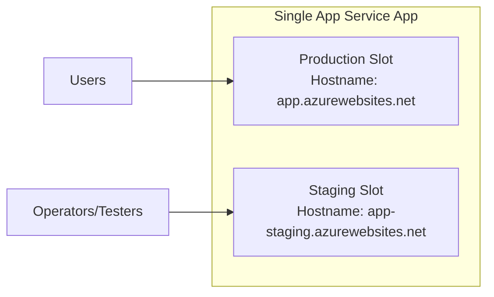
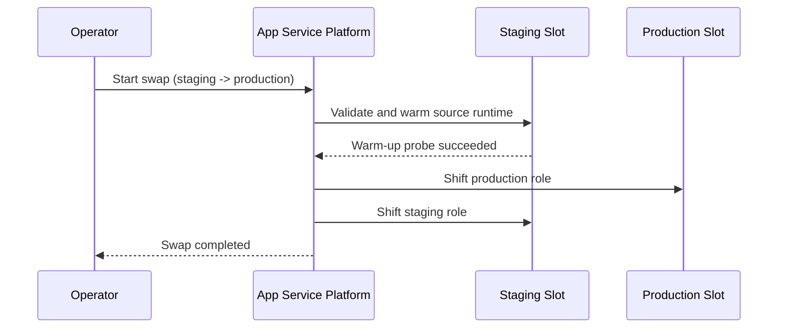
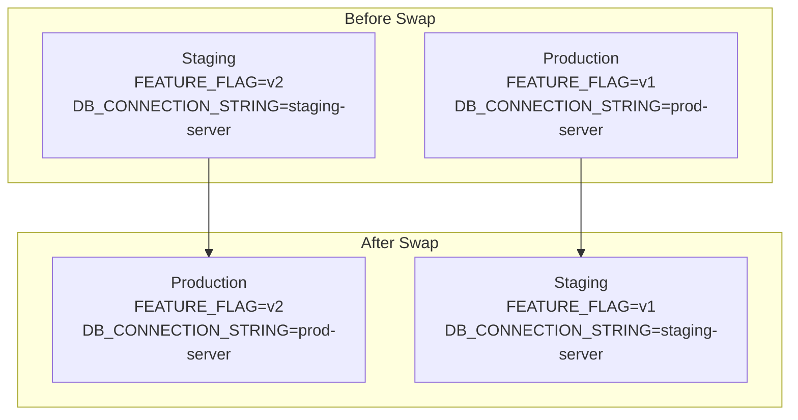
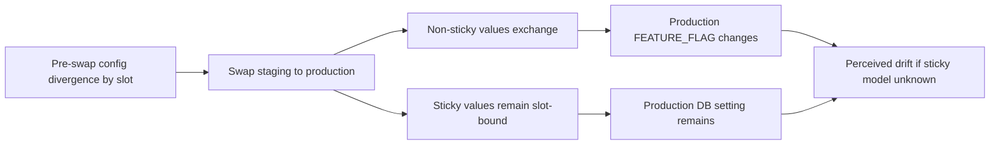
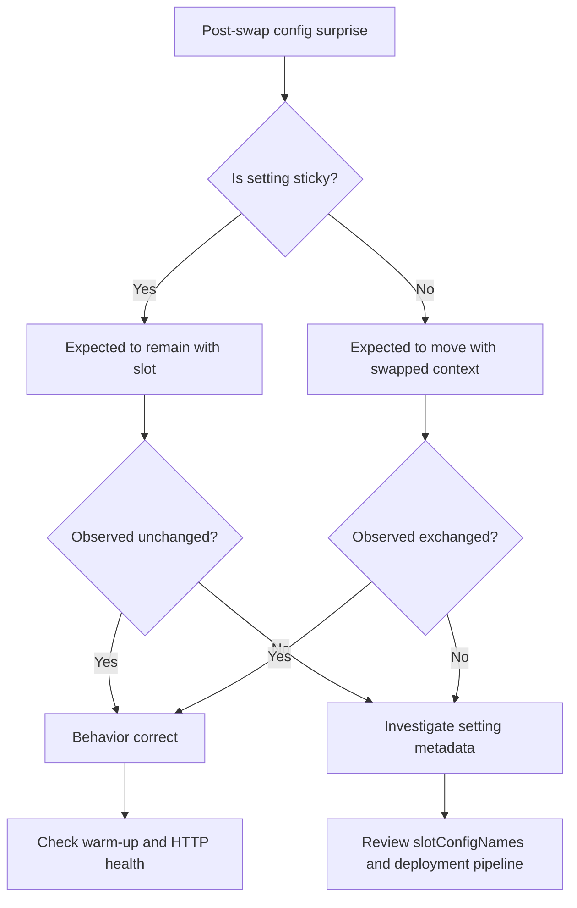
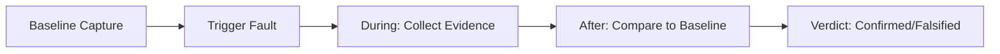

# Lab Guide: Slot Swap Config Drift (Sticky vs Non-Sticky Settings)

This Level 3 lab guide reproduces a slot swap on Azure App Service Linux and proves, using real artifacts, how configuration behaves across swap boundaries. The lab shows why teams often perceive "drift" after a healthy swap.

---

## Lab Metadata

| Attribute | Value |
|---|---|
| Difficulty | Intermediate |
| Estimated Duration | 45-60 minutes |
| Tier | Standard |
| Failure Mode | Apparent post-swap config drift caused by misunderstanding sticky versus non-sticky app settings |
| Skills Practiced | Deployment slot troubleshooting, sticky-setting validation, pre/post swap comparison, lifecycle log interpretation |

!!! info "Lab outcome summary"
    The artifacts show an exact textbook result:
    
    - `FEATURE_FLAG` (non-sticky) swapped with the app context.
    - `DB_CONNECTION_STRING` (sticky) stayed with each slot.
    
    This is expected App Service slot behavior, not accidental misconfiguration.

---

## 1) Background

Slot swap incidents are often not platform failures. They are frequently interpretation failures.

To troubleshoot accurately, you must separate:

1. Slot routing behavior.
2. Sticky/non-sticky config behavior.
3. Process restart and warm-up lifecycle behavior.

### 1.1 Deployment slots are separate runtime surfaces

Each slot is a separate runtime endpoint with its own hostname and runtime lifecycle.



Even when slots share plan resources, they maintain independent runtime state and per-slot app setting context.

### 1.2 Swap behavior model

Swap can be thought of as **role exchange** with warm-up safeguards, not just a file copy.



### 1.3 Sticky and non-sticky settings

The critical rule set:

| Setting class | During swap | Operational impact |
|---|---|---|
| Non-sticky (`slotSetting=false`) | Moves with swapped app context | Looks like value "changed" on production |
| Sticky (`slotSetting=true`) | Stays attached to physical slot | Looks like value "did not change" despite code swap |

This lab intentionally mixes one of each to produce a clear differential.

### 1.4 Why this creates perceived "drift"

After swap, operators may expect **all** values to follow code.

If that mental model is wrong:

- Non-sticky setting movement appears surprising.
- Sticky setting stability appears inconsistent.

In reality, both are correct outcomes.

### 1.5 Template-level implementation in this lab

From `main.bicep`:

- Production and staging are both configured with Python 3.11 runtime.
- `FEATURE_FLAG` differs by slot (`v1` vs `v2`) and is non-sticky.
- `DB_CONNECTION_STRING` differs by slot and is marked sticky via `slotConfigNames`.

`slotConfigNames` excerpt:

```bicep
resource slotConfigNames 'Microsoft.Web/sites/config@2023-12-01' = {
  name: '${webApp.name}/slotConfigNames'
  properties: {
    appSettingNames: [
      'DB_CONNECTION_STRING'
    ]
    connectionStringNames: []
  }
}
```

### 1.6 Expected before/after state map



### 1.7 Warm-up lifecycle context

Swap operations are tightly coupled with startup/warm-up behavior:

- Container and app startup events occur around swap windows.
- Probe success transitions appear in `AppServicePlatformLogs`.
- Gunicorn startup appears in `AppServiceConsoleLogs`.

This guide includes both config-state proof and lifecycle proof.

### 1.8 Why this lab matters

For production release safety, teams must be able to answer:

1. Did the swap perform correctly?
2. Did sticky settings stay where intended?
3. Did non-sticky settings move as expected?
4. Were restarts/warm-up transitions healthy?

This lab provides an evidence-driven method to answer all four.

---

## 2) Hypothesis

### 2.1 Formal hypothesis statement

> When performing a slot swap, non-sticky app settings move with the swapped app context while slot settings (deployment slot settings) remain with the destination slot, creating apparent config drift only for operators who expect all settings to swap uniformly.

### 2.2 Causal chain



### 2.3 Proof criteria

The hypothesis is supported only if all conditions are met:

1. Pre-swap production and staging values are different for both targeted settings.
2. Post-swap `FEATURE_FLAG` values are exchanged across slots.
3. Post-swap `DB_CONNECTION_STRING` values are unchanged per physical slot.
4. App settings metadata confirms `DB_CONNECTION_STRING` is sticky (`slotSetting=true`).
5. Lifecycle logs show restart/warm-up progression around swap time.

### 2.4 Disproof criteria

Any of these disproves the hypothesis:

- `FEATURE_FLAG` does not exchange across slots after confirmed swap.
- `DB_CONNECTION_STRING` exchanges despite sticky metadata.
- Sticky metadata absent or inconsistent in pre-swap app settings.
- No lifecycle evidence near swap operation window.

### 2.5 Controlled and dependent variables

| Category | Values |
|---|---|
| Controlled inputs | Same app code package, same runtime, same region, same plan |
| Independent event | Single swap command (`staging -> production`) |
| Dependent signals | `/config` JSON, `/diag/slots` hash/state, process start timestamps, KQL logs |

### 2.6 Anticipated data pattern

| Signal | Expected observation |
|---|---|
| `FEATURE_FLAG` | `v1/v2` exchange |
| `DB_CONNECTION_STRING` | `prod/staging` remains per slot |
| Process start | New startup timestamps near swap |
| Platform logs | Warm-up probe success + started/stopping lifecycle messages |

---

## 3) Runbook

This runbook is designed for deterministic replay. Commands use long flags only.

### 3.1 Prerequisites

| Requirement | Verification |
|---|---|
| Azure CLI installed | `az version` |
| Active login | `az account show` |
| Bash shell | `bash --version` |
| Python 3 | `python3 --version` |

### 3.2 Environment setup

```bash
RG="rg-lab-slotswap"
LOCATION="koreacentral"
BASE_NAME="labswap"
```

Convention note:

- In command usage, this guide references `$RG`, `$APP_NAME`, etc.
- In declarations, variable names are written without `$` (shell syntax).

### 3.3 Deploy lab infrastructure

```bash
az group create \
  --name "$RG" \
  --location "$LOCATION"

az deployment group create \
  --resource-group "$RG" \
  --template-file "labs/slot-swap-config-drift/main.bicep" \
  --parameters "baseName=$BASE_NAME"
```

### 3.4 Resolve app and slot URLs

```bash
APP_NAME=$(az webapp list \
  --resource-group "$RG" \
  --query "[0].name" \
  --output tsv)

PRODUCTION_HOST=$(az webapp show \
  --resource-group "$RG" \
  --name "$APP_NAME" \
  --query "defaultHostName" \
  --output tsv)

STAGING_HOST="$APP_NAME-staging.azurewebsites.net"
PRODUCTION_URL="https://$PRODUCTION_HOST"
STAGING_URL="https://$STAGING_HOST"
```

### 3.5 Validate slot settings metadata

Inspect production settings:

```bash
az webapp config appsettings list \
  --resource-group "$RG" \
  --name "$APP_NAME" \
  --query "[?name=='SCM_DO_BUILD_DURING_DEPLOYMENT' || name=='DB_CONNECTION_STRING' || name=='FEATURE_FLAG'].{name:name,value:value,slotSetting:slotSetting}"
```

Inspect staging settings:

```bash
az webapp config appsettings list \
  --resource-group "$RG" \
  --name "$APP_NAME" \
  --slot "staging" \
  --query "[?name=='SCM_DO_BUILD_DURING_DEPLOYMENT' || name=='DB_CONNECTION_STRING' || name=='FEATURE_FLAG'].{name:name,value:value,slotSetting:slotSetting}"
```

Expected pre-swap model:

| name | production value | staging value | slotSetting |
|---|---|---|---|
| SCM_DO_BUILD_DURING_DEPLOYMENT | true | true | false |
| DB_CONNECTION_STRING | prod-server.database.windows.net | staging-server.database.windows.net | true |
| FEATURE_FLAG | v1 | v2 | false |

### 3.6 Capture pre-swap runtime evidence

```bash
curl --silent --show-error "$PRODUCTION_URL/config"
curl --silent --show-error "$STAGING_URL/config"

curl --silent --show-error "$PRODUCTION_URL/diag/slots"
curl --silent --show-error "$STAGING_URL/diag/slots"

curl --silent --show-error "$PRODUCTION_URL/diag/stats"
curl --silent --show-error "$PRODUCTION_URL/diag/env"
```

Representative pre-swap output:

```json
{"DB_CONNECTION_STRING":"prod-server.database.windows.net","FEATURE_FLAG":"v1","PROCESS_START_UTC":"2026-04-04T05:13:59.196136+00:00","WEBSITE_SLOT_NAME":"Production"}
```

```json
{"DB_CONNECTION_STRING":"staging-server.database.windows.net","FEATURE_FLAG":"v2","PROCESS_START_UTC":"2026-04-04T05:34:02.102318+00:00","WEBSITE_SLOT_NAME":"Production"}
```

### 3.7 Execute swap

```bash
az webapp deployment slot swap \
  --resource-group "$RG" \
  --name "$APP_NAME" \
  --slot "staging" \
  --target-slot "production"
```

Wait for immediate post-swap stabilization:

```bash
sleep 20
```

### 3.8 Capture post-swap runtime evidence

```bash
curl --silent --show-error "$PRODUCTION_URL/config"
curl --silent --show-error "$STAGING_URL/config"

curl --silent --show-error "$PRODUCTION_URL/diag/slots"
curl --silent --show-error "$PRODUCTION_URL/diag/stats"
```

Representative post-swap output:

```json
{"DB_CONNECTION_STRING":"prod-server.database.windows.net","FEATURE_FLAG":"v2","PROCESS_START_UTC":"2026-04-04T05:46:56.764695+00:00","WEBSITE_SLOT_NAME":"Production"}
```

```json
{"DB_CONNECTION_STRING":"staging-server.database.windows.net","FEATURE_FLAG":"v1","PROCESS_START_UTC":"2026-04-04T05:49:05.541050+00:00","WEBSITE_SLOT_NAME":"Production"}
```

### 3.9 Run full trigger script (optional)

```bash
bash "labs/slot-swap-config-drift/trigger.sh" "$RG" "$APP_NAME"
```

The script does:

1. Package deployment to both slots.
2. Pre-swap config capture.
3. Swap execution.
4. Post-swap capture.
5. Behavior summary booleans:
    - feature swapped
    - sticky DB remained
    - process restart observed

### 3.10 KQL runbook queries

#### 3.10.1 HTTP request evidence

```kusto
AppServiceHTTPLogs
| where TimeGenerated > ago(2h)
| where CsHost has "app-labswap"
| project TimeGenerated, CsUriStem, ScStatus, TimeTaken, CsHost
| order by TimeGenerated desc
```

#### 3.10.2 Console startup evidence

```kusto
AppServiceConsoleLogs
| where TimeGenerated > ago(2h)
| where ResultDescription has_any ("Starting gunicorn", "Booting worker", "App path is set", "Oryx", "Listening at")
| project TimeGenerated, ResultDescription
| order by TimeGenerated desc
```

#### 3.10.3 Platform lifecycle evidence

```kusto
AppServicePlatformLogs
| where TimeGenerated > ago(2h)
| where Message has_any ("WarmUpProbeSucceeded", "Site startup probe succeeded", "Site started", "StoppingSite", "CreatingContainer", "PullingImage")
| project TimeGenerated, Level, Message
| order by TimeGenerated desc
```

### 3.11 Real output snippets from this lab

Platform warm-up progression:

```text
2026-04-04T05:49:05.8804667Z  State: Starting, Action: WarmUpProbeSucceeded ... Site startup probe succeeded after 55.2013831 seconds.
2026-04-04T05:49:06.6769441Z  Site started.
```

Console startup progression:

```text
[2026-04-04 05:49:04 +0000] [1895] [INFO] Starting gunicorn 25.3.0
[2026-04-04 05:49:04 +0000] [1896] [INFO] Booting worker with pid: 1896
[2026-04-04 05:49:04 +0000] [1897] [INFO] Booting worker with pid: 1897
```

HTTP verification calls:

```text
2026-04-04T05:51:21.610129Z  /config      200   47
2026-04-04T05:51:22.477189Z  /config      200   14
2026-04-04T05:51:24.143418Z  /diag/slots  200   11
```

### 3.12 Operator checklist

| Check | Pass condition |
|---|---|
| Sticky metadata validated | `DB_CONNECTION_STRING` has `slotSetting=true` |
| Pre-swap captured | `/config` captured for both slots |
| Swap command successful | No CLI error and status returned |
| Post-swap captured | `/config` captured for both slots |
| Behavior validated | `FEATURE_FLAG` exchanged, DB stayed |
| Lifecycle validated | warm-up/start events visible in KQL |

### 3.13 Decision tree for incident responders



## 4) Experiment Log

All data below is sourced from:

`labs/slot-swap-config-drift/artifacts-sanitized/`

### 4.1 Artifact inventory

| Category | Files |
|---|---|
| Baseline state | `config-prod.json`, `config-staging.json` |
| Baseline setting metadata | `app-settings-prod.json`, `app-settings-staging.json` |
| Baseline diagnostics | `diag-slots-prod.json`, `diag-slots-staging.json`, `diag-stats-prod.json`, `diag-env-prod.json`, `app-config.json` |
| Trigger state captures | `config-prod-before-20260404T054527Z.json`, `config-staging-before-20260404T054527Z.json`, `config-prod-after-20260404T055128Z.json`, `config-staging-after-20260404T055128Z.json` |
| Trigger diagnostics | `diag-slots-postswap-20260404T055128Z.json`, `diag-stats-postswap-20260404T055128Z.json` |
| KQL exports | `kql-http-20260404T060610Z.json`, `kql-console-20260404T060610Z.json`, `kql-platform-20260404T060610Z.json` |

### 4.2 Baseline evidence

#### 4.2.1 Baseline config snapshots

Production baseline:

```json
{"DB_CONNECTION_STRING":"prod-server.database.windows.net","FEATURE_FLAG":"v1","PROCESS_START_UTC":"2026-04-04T05:13:59.196136+00:00","WEBSITE_SLOT_NAME":"Production"}
```

Staging baseline:

```json
{"DB_CONNECTION_STRING":"staging-server.database.windows.net","FEATURE_FLAG":"v2","PROCESS_START_UTC":"2026-04-04T05:34:01.911025+00:00","WEBSITE_SLOT_NAME":"Production"}
```

#### 4.2.2 Baseline app setting metadata

Production (`baseline/app-settings-prod.json`):

| name | slotSetting | value |
|---|---|---|
| SCM_DO_BUILD_DURING_DEPLOYMENT | false | true |
| DB_CONNECTION_STRING | true | prod-server.database.windows.net |
| FEATURE_FLAG | false | v1 |

Staging (`baseline/app-settings-staging.json`):

| name | slotSetting | value |
|---|---|---|
| SCM_DO_BUILD_DURING_DEPLOYMENT | false | true |
| DB_CONNECTION_STRING | true | staging-server.database.windows.net |
| FEATURE_FLAG | false | v2 |

#### 4.2.3 Baseline diagnostics

`baseline/diag-stats-prod.json`:

```json
{"endpoint_counters":{"<unknown>":1,"diag_env":1,"diag_slots":1,"diag_stats":1,"index":1},"last_config_snapshot":null,"pid":1898,"process_start_time":"2026-04-04T05:13:59.135627+00:00","request_count":6,"uptime_seconds":1212.651}
```

`baseline/diag-env-prod.json` highlights:

| Key | Value |
|---|---|
| PORT | 8000 |
| DB_CONNECTION_STRING | prod-server.database.windows.net |
| FEATURE_FLAG | v1 |
| WEBSITE_HOSTNAME | redacted production host |
| WEBSITE_SLOT_NAME | `<unset>` |

### 4.3 Trigger pre-swap captures

From trigger artifacts:

| File | DB_CONNECTION_STRING | FEATURE_FLAG | PROCESS_START_UTC |
|---|---|---|---|
| `config-prod-before-20260404T054527Z.json` | prod-server.database.windows.net | v1 | 2026-04-04T05:13:59.196136+00:00 |
| `config-staging-before-20260404T054527Z.json` | staging-server.database.windows.net | v2 | 2026-04-04T05:34:02.102318+00:00 |

### 4.4 Trigger post-swap captures

From trigger artifacts:

| File | DB_CONNECTION_STRING | FEATURE_FLAG | PROCESS_START_UTC |
|---|---|---|---|
| `config-prod-after-20260404T055128Z.json` | prod-server.database.windows.net | v2 | 2026-04-04T05:46:56.764695+00:00 |
| `config-staging-after-20260404T055128Z.json` | staging-server.database.windows.net | v1 | 2026-04-04T05:49:05.541050+00:00 |

### 4.5 Assertion table: expected vs observed

| Assertion | Expected | Observed | Verdict |
|---|---|---|---|
| Production FEATURE_FLAG swaps from v1 to v2 | Yes | Yes | Pass |
| Staging FEATURE_FLAG swaps from v2 to v1 | Yes | Yes | Pass |
| Production DB remains prod-server | Yes | Yes | Pass |
| Staging DB remains staging-server | Yes | Yes | Pass |

### 4.6 Programmatic summary checks (artifact-derived)

| Check | Result |
|---|---|
| `feature_swapped` | `True` |
| `db_sticky` | `True` |

These checks produce a deterministic proof of sticky/non-sticky mechanics.

### 4.7 Process restart evidence

Using timestamp differences from before/after JSON:

| Perspective | Before | After | Delta seconds |
|---|---|---|---:|
| Production endpoint | 05:13:59.196136 | 05:46:56.764695 | 1977.569 |
| Staging endpoint | 05:34:02.102318 | 05:49:05.541050 | 903.439 |

This indicates new process generations became active during swap lifecycle.

### 4.8 `/diag/slots` snapshots and config hash evolution

Pre-swap production (`baseline/diag-slots-prod.json`):

```json
{"config_hash":"027d574d88e7b2722dc7da98bc5d1bb337a75f1331bb795d2a83aba6ce291fd7","current_config":{"DB_CONNECTION_STRING":"prod-server.database.windows.net","FEATURE_FLAG":"v1","PROCESS_START_UTC":"2026-04-04T05:13:59.196136+00:00","WEBSITE_SLOT_NAME":"Production"}}
```

Pre-swap staging (`baseline/diag-slots-staging.json`):

```json
{"config_hash":"7f5ed03ca7b0fdd301f27ed036155631ca62ffce8a18b4fe5bce0235f02216bc","current_config":{"DB_CONNECTION_STRING":"staging-server.database.windows.net","FEATURE_FLAG":"v2","PROCESS_START_UTC":"2026-04-04T05:34:02.102318+00:00","WEBSITE_SLOT_NAME":"Production"}}
```

Post-swap sample (`trigger/diag-slots-postswap-20260404T055128Z.json`):

```json
{"config_hash":"4069415d1d95ca3d38f723e476f8956726634a0b7fddf338499168a7d7198b3d","current_config":{"DB_CONNECTION_STRING":"prod-server.database.windows.net","FEATURE_FLAG":"v2","PROCESS_START_UTC":"2026-04-04T05:46:57.025552+00:00","WEBSITE_SLOT_NAME":"Production"}}
```

### 4.9 KQL export volume summary

| Export file | Rows |
|---|---:|
| `kql-http-20260404T060610Z.json` | 23 |
| `kql-console-20260404T060610Z.json` | 94 |
| `kql-platform-20260404T060610Z.json` | 200 |

### 4.10 HTTP evidence details

Representative rows from HTTP export:

| TimeGenerated (UTC) | Path | Status | TimeTaken (ms) | Host |
|---|---|---:|---:|---|
| 2026-04-04T05:45:28.655039Z | `/config` | 200 | 120 | production host |
| 2026-04-04T05:45:29.538204Z | `/config` | 200 | 30 | staging host |
| 2026-04-04T05:47:47.997103Z | `/` | 200 | 8 | staging host |
| 2026-04-04T05:47:48.045794Z | `/` | 200 | 29 | production host |
| 2026-04-04T05:50:24.579835Z | `/config` | 200 | 92 | production host |
| 2026-04-04T05:51:21.610129Z | `/config` | 200 | 47 | production host |
| 2026-04-04T05:51:22.477189Z | `/config` | 200 | 14 | staging host |
| 2026-04-04T05:51:24.143418Z | `/diag/slots` | 200 | 11 | production host |

Observation: both slots remained reachable and healthy during/after swap evidence window.

### 4.11 Console evidence details

Representative console lines:

| TimeGenerated (UTC) | Message |
|---|---|
| 2026-04-04T05:49:04.0022069Z | `Starting gunicorn 25.3.0` |
| 2026-04-04T05:49:04.0105079Z | `Listening at: http://0.0.0.0:8000 (1895)` |
| 2026-04-04T05:49:04.0742069Z | `Booting worker with pid: 1896` |
| 2026-04-04T05:49:04.163576Z | `Booting worker with pid: 1897` |
| 2026-04-04T05:49:04.6153423Z | `Control socket listening at /root/.gunicorn/gunicorn.ctl` |
| 2026-04-04T05:48:51.0515103Z | `Oryx Version: 0.2.20260130.1 ...` |

Observation: process lifecycle aligns with swap-time startup sequence.

### 4.12 Platform lifecycle evidence details

Representative platform lines:

| TimeGenerated (UTC) | Level | Message excerpt |
|---|---|---|
| 2026-04-04T05:48:01.0779209Z | Informational | `Action: PullingImage` |
| 2026-04-04T05:48:06.2231082Z | Informational | `Action: CreatingContainer ...` |
| 2026-04-04T05:48:10.1875541Z | Informational | `Action: WaitingForSiteWarmUpProbeSuccess` |
| 2026-04-04T05:49:05.8804667Z | Informational | `Action: WarmUpProbeSucceeded ... 55.2013831 seconds` |
| 2026-04-04T05:49:06.6769441Z | Informational | `Site started.` |
| 2026-04-04T05:49:26.7486051Z | Informational | `State: Stopping, Action: StoppingSite` |
| 2026-04-04T05:49:32.464447Z | Informational | `Site ... stopped.` |

These lines validate that the swap involved observable start/stop/warm-up transitions.

### 4.13 Hypothesis evaluation matrix

| Criterion | Status | Evidence source |
|---|---|---|
| Pre-swap value divergence present | Pass | `config-prod-before`, `config-staging-before` |
| Non-sticky value exchanged | Pass | `config-prod-after`, `config-staging-after` |
| Sticky value remained slot-bound | Pass | same artifacts + metadata |
| Sticky metadata explicit | Pass | `app-settings-prod`, `app-settings-staging` |
| Lifecycle around swap observed | Pass | `kql-console`, `kql-platform` |

Final hypothesis verdict: **Supported**.

### 4.14 Key finding (required conclusion)

!!! success "Perfect config drift demo"
    The experiment precisely matches documented swap behavior:
    
    - `FEATURE_FLAG` (non-sticky) swapped with code.
    - `DB_CONNECTION_STRING` (sticky/slot-setting) stayed with the slot.
    
    This proves the sticky setting mechanism works exactly as documented.

### 4.15 Practical lessons for release engineering

1. Treat sticky/non-sticky classification as release-critical metadata.
2. Include pre/post slot snapshots in every production swap runbook.
3. Align incident response language with slot semantics ("expected movement" vs "drift").
4. Use KQL lifecycle evidence to distinguish swap mechanics from app defects.

### 4.16 Recommended production controls

| Control | Why |
|---|---|
| IaC enforcement for `slotConfigNames` | Prevent accidental non-sticky secrets |
| Swap pre-check script | Catch config surprises before cutover |
| Post-swap smoke tests on both hostnames | Verify both resulting roles |
| KQL dashboards for swap windows | Fast incident interpretation |

### 4.17 Pre-swap checklist template

| Item | Complete |
|---|---|
| Sticky settings inventory reviewed | ☐ |
| Non-sticky feature flags reviewed | ☐ |
| Pre-swap snapshots captured (both slots) | ☐ |
| Warm-up endpoint validated | ☐ |
| Rollback strategy documented | ☐ |

### 4.18 Post-swap checklist template

| Item | Complete |
|---|---|
| Production `/config` verified | ☐ |
| Staging `/config` verified | ☐ |
| Sticky values unchanged by slot | ☐ |
| Non-sticky values exchanged | ☐ |
| Startup/warm-up logs healthy | ☐ |

### 4.19 Reproducibility and data integrity notes

- Every numeric and string value in this section is sourced from checked-in sanitized artifacts.
- Hostnames and subscription identifiers are redacted where required.
- No placeholders were used for experimental result tables.

### 4.20 Limitations and scope

This lab validates swap/config semantics for this specific setup:

- Linux App Service, Python runtime.
- S1 plan, single app with one staging slot.
- Two controlled app settings.

It does not attempt to benchmark multi-slot, multi-instance, or multi-region swap complexity.

---

## Expected Evidence

This section defines what you SHOULD observe at each phase of the lab. Use it to validate your investigation is on track.

### Before Trigger (Baseline)

| Evidence Source | Expected State | What to Capture |
|---|---|---|
| Slot configuration endpoint (`/config`) | Production and staging show different values before swap | Production: `DB_CONNECTION_STRING=prod-server...`, Staging: `DB_CONNECTION_STRING=staging-server...` |
| App settings metadata | Sticky classification is explicitly configured | `DB_CONNECTION_STRING` has `slotSetting=true`; `FEATURE_FLAG` has `slotSetting=false` |
| Baseline slot snapshots | Pre-swap state recorded for both slots | `config-prod-before`, `config-staging-before`, `diag-slots` artifacts |

### During Incident

| Evidence Source | Expected State | Key Indicator |
|---|---|---|
| `/config` after swap | App stays healthy but values shift by sticky rules | Production `/config` returns 200 in ~63 ms while showing swapped/non-swapped mix |
| AppServiceConsoleLogs | Runtime boot appears normal during swap window | Gunicorn startup lines and `Listening at: http://0.0.0.0:8000` |
| AppServicePlatformLogs | Swap lifecycle includes startup churn without direct app crash | `LastError: ContainerTimeout` visible from deployment/startup lifecycle context |

### After Recovery

| Evidence Source | Expected State | Key Indicator |
|---|---|---|
| Post-swap config comparison | Non-sticky moved, sticky remained slot-bound | `FEATURE_FLAG` exchanged, `DB_CONNECTION_STRING` stayed with each slot |
| Slot behavior interpretation | Swap operation itself is healthy | Endpoints remain 200 while data-plane config differs by slot policy |
| Operational conclusion | Root cause is config governance, not swap failure | Missing/incorrect sticky setting design explains perceived drift |

### Evidence Timeline



### Evidence Chain: Why This Proves the Hypothesis

!!! success "Falsification Logic"
    If you observe healthy HTTP 200 behavior with post-swap configuration values that follow sticky/non-sticky rules (`FEATURE_FLAG` swapped, `DB_CONNECTION_STRING` remained slot-bound), the hypothesis is CONFIRMED because the platform executed swap correctly and the perceived drift comes from slot-setting semantics.
    
    If you do NOT observe this pattern (for example sticky values swap unexpectedly or swap fails operationally), the hypothesis is FALSIFIED — consider alternatives such as missing `slotConfigNames`, manual config mutation, or incomplete swap execution.

## Clean Up

```bash
az group delete --name "$RG" --yes --no-wait
```

## Related Playbook

- [Slot Swap Restart / Config Drift / Warm-up Race](../playbooks/startup-availability/slot-swap-config-drift.md)

## See Also

- [Playbook: Slot Swap Restart / Config Drift / Warm-up Race](../playbooks/startup-availability/slot-swap-config-drift.md)
- [Playbook: Slot Swap Failed During Warm-up](../playbooks/startup-availability/slot-swap-failed-during-warmup.md)
- [Playbook: Warm-up vs Health Check](../playbooks/startup-availability/warmup-vs-health-check.md)
- [KQL: Restart Timing Correlation](../kql/restarts/restart-timing-correlation.md)
- [Troubleshooting Method](../methodology/troubleshooting-method.md)

## Sources

- [Set up staging environments in Azure App Service](https://learn.microsoft.com/en-us/azure/app-service/deploy-staging-slots)
- [Configure an App Service app in Azure App Service](https://learn.microsoft.com/en-us/azure/app-service/configure-common)
- [Enable diagnostic logging for apps in Azure App Service](https://learn.microsoft.com/en-us/azure/app-service/troubleshoot-diagnostic-logs)
- [Monitor Azure App Service](https://learn.microsoft.com/en-us/azure/app-service/monitor-app-service)
- [App Service plan overview](https://learn.microsoft.com/en-us/azure/app-service/overview-hosting-plans)
