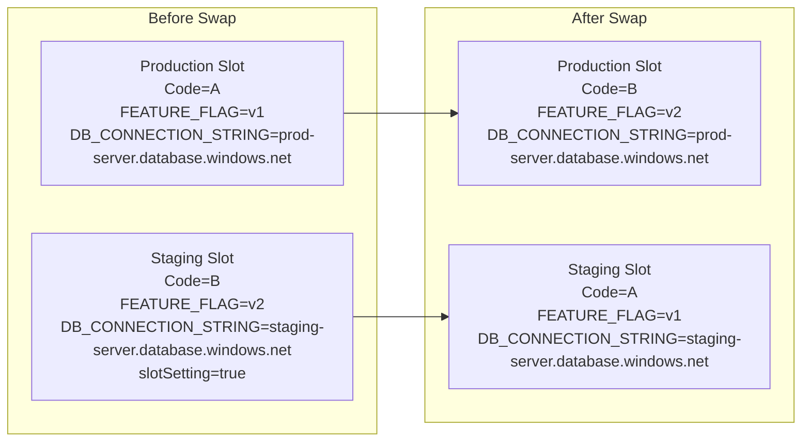

# Lab: Slot Swap Restart and Config Drift

Reproduce how Azure App Service Linux slot swap moves code and non-sticky settings, while sticky settings stay with the slot. This lab highlights why a successful swap can still trigger a production restart.

## Objective

Deploy a two-slot Python app (production + staging), execute a swap, and verify:

- `FEATURE_FLAG` (non-sticky) swaps between slots
- `DB_CONNECTION_STRING` (sticky) remains with each slot
- Production process restart occurs after swap due to effective non-sticky setting change

## Prerequisites

- Azure subscription
- Azure CLI installed and logged in
- Bash shell

## Architecture and Config Behavior



## Deploy

```bash
# Create resource group
az group create --name rg-lab-slotsw --location koreacentral

# Deploy lab infrastructure (B1 Linux, Python 3.11, production + staging slots)
az deployment group create \
  --resource-group rg-lab-slotsw \
  --template-file lab-guides/slot-swap-config-drift/main.bicep \
  --parameters baseName=labslot
```

Capture the app name from deployment output (`webAppName`) or query it:

```bash
APP_NAME=$(az webapp list --resource-group rg-lab-slotsw --query "[0].name" --output tsv)
echo "$APP_NAME"
```

## Trigger the Symptom

```bash
bash lab-guides/slot-swap-config-drift/trigger.sh rg-lab-slotsw "$APP_NAME"
```

The script does all of the following:

1. Deploys the Flask app to production and staging slots
2. Captures `/config` from both slots before swap
3. Runs:

```bash
az webapp deployment slot swap --resource-group rg-lab-slotsw --name "$APP_NAME" --slot staging --target-slot production
```

4. Captures `/config` again after swap and prints a behavior summary

## Verify Platform Events

```bash
bash lab-guides/slot-swap-config-drift/verify.sh rg-lab-slotsw "$APP_NAME"
```

This queries `AppServicePlatformLogs` for:

- swap-related events
- restart/recycle events

## Expected Signals

- Before swap:
  - Production: `FEATURE_FLAG=v1`, `DB_CONNECTION_STRING=prod-server.database.windows.net`
  - Staging: `FEATURE_FLAG=v2`, `DB_CONNECTION_STRING=staging-server.database.windows.net`
- After swap:
  - Production: `FEATURE_FLAG=v2` (swapped), `DB_CONNECTION_STRING=prod-server.database.windows.net` (stayed)
  - Staging: `FEATURE_FLAG=v1` (swapped), `DB_CONNECTION_STRING=staging-server.database.windows.net` (stayed)
- `AppServicePlatformLogs` show swap lifecycle plus restart/recycle signals around swap time

## Clean Up

```bash
az group delete --name rg-lab-slotsw --yes --no-wait
```

## Related Playbook

- [Slot Swap Restart / Config Drift / Warm-up Race](../playbooks/startup-availability/slot-swap-config-drift.md)

## References

- [Set up staging environments in Azure App Service](https://learn.microsoft.com/en-us/azure/app-service/deploy-staging-slots)
- [Configure an App Service app](https://learn.microsoft.com/en-us/azure/app-service/configure-common)
- [Quickstart: Create Bicep files with Visual Studio Code](https://learn.microsoft.com/en-us/azure/azure-resource-manager/bicep/quickstart-create-bicep-use-visual-studio-code)
- [Enable diagnostic logging for apps in Azure App Service](https://learn.microsoft.com/en-us/azure/app-service/troubleshoot-diagnostic-logs)
