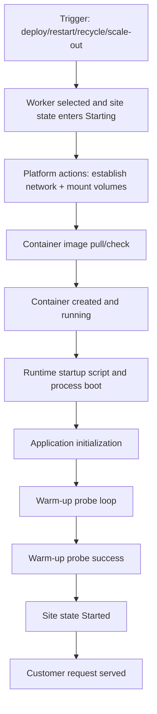
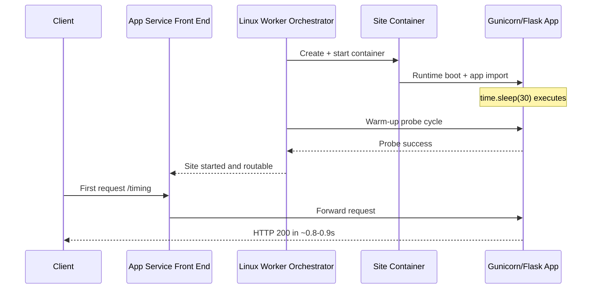
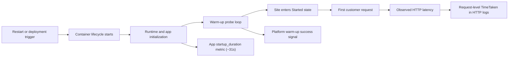
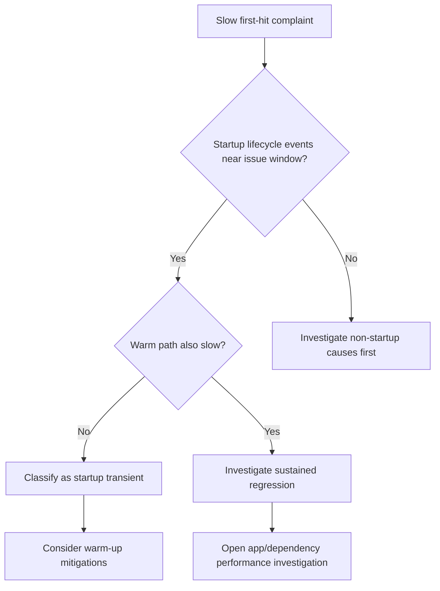
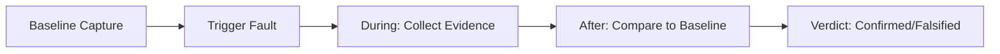

---
hide:
  - toc
content_sources:
  diagrams:
    - id: troubleshooting-lab-guides-slow-start-cold-start-diagram-1
      type: flowchart
      source: self-generated
      justification: "Self-generated troubleshooting diagram synthesized from Microsoft Learn diagnostics and Azure App Service incident guidance for this guide."
      based_on:
        - https://learn.microsoft.com/en-us/azure/app-service/troubleshoot-diagnostic-logs
        - https://learn.microsoft.com/en-us/azure/app-service/troubleshoot-http-502-http-503
    - id: troubleshooting-lab-guides-slow-start-cold-start-diagram-2
      type: sequenceDiagram
      source: self-generated
      justification: "Self-generated troubleshooting diagram synthesized from Microsoft Learn diagnostics and Azure App Service incident guidance for this guide."
      based_on:
        - https://learn.microsoft.com/en-us/azure/app-service/troubleshoot-diagnostic-logs
        - https://learn.microsoft.com/en-us/azure/app-service/troubleshoot-http-502-http-503
    - id: troubleshooting-lab-guides-slow-start-cold-start-diagram-3
      type: flowchart
      source: self-generated
      justification: "Self-generated troubleshooting diagram synthesized from Microsoft Learn diagnostics and Azure App Service incident guidance for this guide."
      based_on:
        - https://learn.microsoft.com/en-us/azure/app-service/troubleshoot-diagnostic-logs
        - https://learn.microsoft.com/en-us/azure/app-service/troubleshoot-http-502-http-503
    - id: troubleshooting-lab-guides-slow-start-cold-start-diagram-4
      type: flowchart
      source: self-generated
      justification: "Self-generated troubleshooting diagram synthesized from Microsoft Learn diagnostics and Azure App Service incident guidance for this guide."
      based_on:
        - https://learn.microsoft.com/en-us/azure/app-service/troubleshoot-diagnostic-logs
        - https://learn.microsoft.com/en-us/azure/app-service/troubleshoot-http-502-http-503
    - id: troubleshooting-lab-guides-slow-start-cold-start-diagram-5
      type: graph
      source: self-generated
      justification: "Self-generated troubleshooting diagram synthesized from Microsoft Learn diagnostics and Azure App Service incident guidance for this guide."
      based_on:
        - https://learn.microsoft.com/en-us/azure/app-service/troubleshoot-diagnostic-logs
        - https://learn.microsoft.com/en-us/azure/app-service/troubleshoot-http-502-http-503
---
# Lab Guide: Slow Start (Cold Start) vs Real Regression

This Level 3 lab guide reproduces a slow-start scenario on Azure App Service Linux and shows how to separate platform/container startup cost from steady-state request latency. The experiment uses a Python Flask app that intentionally sleeps for 30 seconds during startup and captures HTTP, platform, and app-level evidence.

---

## Lab Metadata

| Attribute | Value |
|---|---|
| Difficulty | Intermediate |
| Estimated Duration | 45-60 minutes |
| Tier | Basic |
| Failure Mode | Slow startup initialization is mistaken for steady-state performance regression |
| Skills Practiced | Cold-start analysis, startup-vs-request latency separation, platform lifecycle interpretation, KQL timing correlation |

!!! info "What this lab is designed to prove"
    This lab is intentionally built to challenge a common assumption: "slow first hit means app regression."
    
    The artifact evidence shows a different outcome:
    
    - Application startup takes ~31.3 seconds.
    - HTTP first-request latency in this run is still sub-second (~0.8-0.9s).
    - Most startup cost is absorbed before customer request timing starts.

---

## 1) Background

Cold start on App Service Linux is not one single operation. It is a multi-stage timeline that includes platform orchestration and application initialization.

For accurate troubleshooting, you must identify **where time is spent**:

1. Platform work (worker assignment, network setup, volume mounts, image pull, container creation).
2. Runtime boot work (Oryx startup script, Python/Gunicorn process boot).
3. Application startup work (module import, global init, user startup logic).
4. Warm-up probes and readiness transitions.
5. First customer request routing.

### 1.1 Cold-start phase model

<!-- diagram-id: troubleshooting-lab-guides-slow-start-cold-start-diagram-1 -->


### 1.2 Platform cold start vs app cold start

Two different cold-start scopes matter operationally:

| Scope | What changed | Typical indicators | Common triggers |
|---|---|---|---|
| Platform cold start | New container lifecycle on worker (site not running) | `AppServicePlatformLogs` show `PullingImage`, `CreatingContainer`, `WarmUpProbeSucceeded` | Restart, scale-out, recycle, host movement |
| App cold start | App process restarts within an existing site context | New app process start timestamp, startup logs, changed PID | Code deploy, process crash, app recycle |

In incident response, teams often mix these two and over-attribute latency to application code. This lab separates them with multiple evidence channels.

### 1.3 App under test: why startup is intentionally slow

The lab app contains `time.sleep(30)` during module import:

```python
INITIALIZATION_STARTED_AT = time.time()
...
time.sleep(30)
...
INITIALIZATION_COMPLETED_AT = time.time()
STARTUP_DURATION_SECONDS = INITIALIZATION_COMPLETED_AT - INITIALIZATION_STARTED_AT
```

The app then exposes startup telemetry via `/timing` and `/diag/stats`.

This makes the startup burden explicit and measurable.

### 1.4 Request-path and startup-path timing are not equivalent

A first customer request can be slow because:

- It waits behind startup completion.
- It hits a worker that has not completed warm-up.
- It reaches the app only after a platform probe success boundary.

But a first customer request can also be **fast** if startup cost was already paid during platform warm-up interval. That exact condition is demonstrated in this lab.

### 1.5 Timeline diagram: where cold-start latency can hide

<!-- diagram-id: troubleshooting-lab-guides-slow-start-cold-start-diagram-2 -->


### 1.6 Warm-up and mitigation controls

App Service offers several warm-up and cold-start mitigation knobs. Their effect depends on plan tier, runtime, and deployment pattern.

| Control | Purpose | Lab relevance |
|---|---|---|
| Always On | Keep app active and reduce idle cold starts | Disabled in this lab by design |
| Health check | Keep only healthy instances in rotation | Not set in this lab (`healthCheckPath: null`) |
| `WEBSITE_SWAP_WARMUP_PING_PATH` | Warm path for slot swap readiness | Not used in this single-slot lab |
| Slot warm-up and swap | Shift startup cost pre-cutover | Covered in companion slot-swap lab |

!!! warning "Tier behavior matters"
    On lower tiers, mitigation options may be limited or operationally different from Standard/Premium patterns.
    Always interpret cold-start behavior in context of App Service plan capability.

### 1.7 Why this matters for troubleshooting quality

Without phase-level attribution, teams may:

- Escalate false regressions to app teams.
- Roll back healthy releases.
- Miss platform lifecycle causes (restart/recycle/startup probe delays).

This guide aligns evidence from:

1. App telemetry (`startup_duration`, process timestamps).
2. HTTP logs (`TimeTaken`, paths, status).
3. Platform logs (container lifecycle and warm-up transitions).

### 1.8 MS Learn grounding for startup behavior

Core conceptual docs used by this runbook:

- App configuration and app settings behavior.
- Diagnostics logging for App Service.
- Hosting plan tier behavior.
- Staging/slot warm-up concepts for production deployments.

Links are listed in [Sources](#sources).

---

## 2) Hypothesis

### 2.1 Formal hypothesis statement

> On a B1 Linux App Service plan, cold start adds measurable latency to lifecycle readiness after restart, with the majority of time spent in container/application initialization rather than in the first user HTTP request itself.

### 2.2 Causal chain

<!-- diagram-id: troubleshooting-lab-guides-slow-start-cold-start-diagram-3 -->


### 2.3 Proof criteria

All of the following support the hypothesis:

1. Startup telemetry (`/diag/stats`, `/timing`) shows ~30+ second app initialization.
2. Platform logs include explicit startup lifecycle and probe success events.
3. HTTP first-hit latency is not necessarily equal to startup duration.
4. Steady-state warm requests remain in similar low range after startup.
5. Evidence shows startup cost can be paid before first external request.

### 2.4 Disproof criteria

Any of these weakens the hypothesis:

- App startup telemetry is short (<2s), but first request repeatedly spikes high.
- Platform logs show no lifecycle transitions near slow periods.
- Warm requests remain persistently degraded after startup window.
- Latency increase correlates with sustained app-level regression signals (CPU, errors, dependency slowdowns) rather than startup transitions.

### 2.5 Expected outcomes for this specific lab build

Because startup has an intentional `sleep(30)`, we expect:

- Startup metrics around ~31 seconds.
- Warm-up/probe lifecycle in platform logs.
- Warm and "cold-labeled" HTTP requests both in sub-second band for this run.
- Interpretation: startup delay is real, but not visible as a giant first HTTP spike.

### 2.6 Counter-hypothesis tested implicitly

Counter-hypothesis:

> "If startup is 31 seconds, first HTTP request must also be ~31 seconds."

This lab disproves that simplification and demonstrates why startup-window timing and customer request timing can diverge.

---

## 3) Runbook

This section is execution-oriented and uses long-form Azure CLI flags only.

### 3.1 Prerequisites

| Tool | Check command |
|---|---|
| Azure CLI | `az version` |
| Bash | `bash --version` |
| Python 3 | `python3 --version` |
| Authenticated session | `az account show` |

### 3.2 Variables

```bash
export RG="rg-lab-coldstart"
export LOCATION="koreacentral"
export BASE_NAME="labcold"
```

Use these variables in subsequent commands:

### 3.3 Deploy infrastructure

```bash
az group create \
  --name "$RG" \
  --location "$LOCATION"

az deployment group create \
  --resource-group "$RG" \
  --template-file "labs/slow-start-cold-start/main.bicep" \
  --parameters "baseName=$BASE_NAME"
```

Capture app name:

```bash
APP_NAME=$(az webapp list \
  --resource-group "$RG" \
  --query "[0].name" \
  --output tsv)

APP_HOSTNAME=$(az webapp show \
  --resource-group "$RG" \
  --name "$APP_NAME" \
  --query "defaultHostName" \
  --output tsv)

APP_URL="https://$APP_HOSTNAME"
```

### 3.4 Verify baseline configuration

Run these before trigger to confirm plan behavior assumptions:

```bash
az webapp config show \
  --resource-group "$RG" \
  --name "$APP_NAME"

curl --silent --show-error "$APP_URL/health"
curl --silent --show-error "$APP_URL/diag/stats"
curl --silent --show-error "$APP_URL/timing"
```

Observed baseline artifact evidence (sanitized):

```json
{"status":"healthy"}
```

```json
{"startup_duration_seconds":31.267,"request_count":4,"pid":1896}
```

```json
{"startup_duration":31.267,"uptime_seconds":1116.417}
```

### 3.5 Trigger measurement workflow

Use the provided trigger script:

```bash
bash "labs/slow-start-cold-start/trigger.sh" "$RG" "$BASE_NAME" "$LOCATION"
```

The script performs:

1. Infra deployment and zip deploy.
2. Initial request latency capture.
3. Ten warm `/fast` requests.
4. App restart.
5. Post-restart first request capture.
6. Warm-post request series.

### 3.6 Manual fallback (if you do not use trigger.sh)

#### 3.6.1 Deploy app package

```bash
az webapp deploy \
  --resource-group "$RG" \
  --name "$APP_NAME" \
  --src-path "labs/slow-start-cold-start/app.zip" \
  --type zip \
  --clean true \
  --restart true
```

#### 3.6.2 Measure request latency

```bash
curl --silent --show-error --output /dev/null --write-out "%{time_total}\n" "$APP_URL/timing"
curl --silent --show-error --output /dev/null --write-out "%{time_total}\n" "$APP_URL/fast"
```

#### 3.6.3 Force restart and re-measure

```bash
az webapp restart \
  --resource-group "$RG" \
  --name "$APP_NAME"

curl --silent --show-error --output /dev/null --write-out "%{time_total}\n" "$APP_URL/timing"
```

### 3.7 Collect KQL evidence

Retrieve HTTP log evidence:

```kusto
AppServiceHTTPLogs
| where TimeGenerated > ago(2h)
| where CsHost has "app-labcold"
| project TimeGenerated, CsUriStem, ScStatus, TimeTaken, CsHost
| order by TimeGenerated desc
```

Retrieve platform lifecycle evidence:

```kusto
AppServicePlatformLogs
| where TimeGenerated > ago(2h)
| where Message has_any ("WarmUpProbeSucceeded", "Site startup probe succeeded", "CreatingContainer", "PullingImage", "Site started", "stopped")
| project TimeGenerated, Level, Message
| order by TimeGenerated desc
```

Retrieve console evidence:

```kusto
AppServiceConsoleLogs
| where TimeGenerated > ago(2h)
| where ResultDescription has_any ("gunicorn", "Starting", "Booting worker", "ERROR")
| project TimeGenerated, ResultDescription
| order by TimeGenerated desc
```

### 3.8 Real output snippets (captured)

HTTP logs include sub-second request service times (TimeTaken is milliseconds):

```text
2026-04-04T05:45:18.910231Z  /fast   200  332
2026-04-04T05:45:19.792462Z  /fast   200   67
2026-04-04T05:45:22.347736Z  /fast   200   17
2026-04-04T05:45:42.509783Z  /timing 200    8
2026-04-04T05:45:53.949776Z  /timing 200   21
```

Platform logs capture warm-up lifecycle transitions:

```text
State: Starting, Action: WarmUpProbeSucceeded ... Site startup probe succeeded after 68.0508489 seconds.
Site startup probe succeeded after 68.0508489 seconds.
Site started.
```

App-level timing endpoint captures startup duration:

```json
{"startup_duration":31.305,"uptime_seconds":1864.177,"request_count":12}
```

### 3.9 Interpretation checklist during execution

Use this table while running the lab:

| Check | Evidence source | Pass condition |
|---|---|---|
| Startup duration present | `/timing`, `/diag/stats` | ~31 seconds reported |
| First-hit latency measured | `cold-latency-*.csv` | Values captured for restart cycles |
| Warm baseline measured | `warm-latencies-*.csv` | 10 values captured |
| Post-restart warm measured | `warm-post-latencies-*.csv` | Additional warm values captured |
| Platform startup lifecycle present | `kql-platform-*.json` | Warm-up/probe/start events visible |

### 3.10 Decision logic during triage

<!-- diagram-id: troubleshooting-lab-guides-slow-start-cold-start-diagram-4 -->


## 4) Experiment Log

This section uses only captured data under:

`labs/slow-start-cold-start/artifacts-sanitized/`

### 4.1 Artifact inventory

| Category | Files |
|---|---|
| Baseline | `diag-stats.json`, `app-config.json`, `health.json`, `timing.json`, `diag-env.json` |
| Trigger latency | `warm-latencies-20260404T054518Z.csv`, `cold-latency-20260404T054518Z.csv`, `warm-post-latencies-20260404T054518Z.csv` |
| Trigger app telemetry | `timing-response-20260404T054518Z.json`, `diag-stats-postcold-20260404T054518Z.json`, `diag-stats-final-20260404T054518Z.json` |
| KQL exports | `kql-http-20260404T060610Z.json`, `kql-console-20260404T060610Z.json`, `kql-platform-20260404T060610Z.json` |

### 4.2 Baseline evidence snapshot

#### 4.2.1 Baseline `/diag/stats`

```json
{"endpoint_counters":{"<unknown>":1,"diag_stats":2,"index":1},"initialization_completed_at":"2026-04-04T05:14:38.440202+00:00","initialization_started_at":"2026-04-04T05:14:07.173440+00:00","pid":1896,"process_start_time":"2026-04-04T05:14:38.440202+00:00","request_count":4,"startup_duration_seconds":31.267,"uptime_seconds":1114.875}
```

#### 4.2.2 Baseline `/timing`

```json
{"current_time":"2026-04-04T05:33:14.856715+00:00","request_count":5,"startup_duration":31.267,"uptime_seconds":1116.417}
```

#### 4.2.3 Baseline app config highlights

From `baseline/app-config.json`:

| Setting | Value |
|---|---|
| `alwaysOn` | `false` |
| `linuxFxVersion` | `PYTHON|3.11` |
| `appCommandLine` | `gunicorn --bind=0.0.0.0 --timeout=180 --workers=2 app:app` |
| `healthCheckPath` | `null` |
| `ftpsState` | `Disabled` |

### 4.3 Latency dataset (raw values)

#### 4.3.1 Warm pre-restart (10 requests)

| Label | Request index | Seconds |
|---|---:|---:|
| warm | 1 | 1.074682 |
| warm | 2 | 0.885271 |
| warm | 3 | 0.907336 |
| warm | 4 | 0.781947 |
| warm | 5 | 0.897924 |
| warm | 6 | 0.912066 |
| warm | 7 | 0.955691 |
| warm | 8 | 0.828223 |
| warm | 9 | 0.962603 |
| warm | 10 | 0.750138 |

#### 4.3.2 Cold-labeled measurements (restart cycles)

| Label | Restart cycle | Seconds |
|---|---:|---:|
| cold | 1 | 0.938001 |
| cold | 2 | 0.798990 |

#### 4.3.3 Warm post-restart (5 requests)

| Label | Request index | Seconds |
|---|---:|---:|
| warm_post | 1 | 0.888190 |
| warm_post | 2 | 0.869994 |
| warm_post | 3 | 0.817254 |
| warm_post | 4 | 0.773853 |
| warm_post | 5 | 0.698639 |

### 4.4 Latency summary statistics

Computed from the CSV artifacts:

| Metric | Value |
|---|---:|
| Warm average (10) | 0.895588 s |
| Warm minimum | 0.750138 s |
| Warm maximum | 1.074682 s |
| Cold average (2) | 0.868495 s |
| Cold minimum | 0.798990 s |
| Cold maximum | 0.938001 s |
| Warm-post average (5) | 0.809586 s |
| Warm-post minimum | 0.698639 s |
| Warm-post maximum | 0.888190 s |

Derived deltas:

| Comparison | Delta |
|---|---:|
| Cold average - Warm average | -27.09 ms |
| Cold average - Warm-post average | +58.91 ms |

### 4.5 App startup telemetry consistency

#### 4.5.1 Trigger timing response

```json
{"current_time":"2026-04-04T05:45:42.507800+00:00","request_count":12,"startup_duration":31.305,"uptime_seconds":1864.177}
```

#### 4.5.2 Trigger diag stats (post-cold capture)

```json
{"startup_duration_seconds":31.305,"request_count":13,"pid":1895}
```

#### 4.5.3 Trigger diag stats (final capture)

```json
{"startup_duration_seconds":31.267,"request_count":14,"pid":1896}
```

Across captures, startup duration remains consistently near **31.3 seconds**.

### 4.6 KQL export quantitative summary

| File | Row count |
|---|---:|
| `kql-http-20260404T060610Z.json` | 28 |
| `kql-console-20260404T060610Z.json` | 0 |
| `kql-platform-20260404T060610Z.json` | 127 |

### 4.7 HTTP log observations from export

Representative entries from `kql-http-20260404T060610Z.json`:

| TimeGenerated (UTC) | Path | Status | TimeTaken (ms) |
|---|---|---:|---:|
| 2026-04-04T05:45:18.910231Z | `/fast` | 200 | 332 |
| 2026-04-04T05:45:19.792462Z | `/fast` | 200 | 67 |
| 2026-04-04T05:45:20.730507Z | `/fast` | 200 | 17 |
| 2026-04-04T05:45:21.497297Z | `/fast` | 200 | 21 |
| 2026-04-04T05:45:42.509783Z | `/timing` | 200 | 8 |
| 2026-04-04T05:45:53.949776Z | `/timing` | 200 | 21 |

Observation: request execution times remain short while startup telemetry still indicates long initialization history.

### 4.8 Platform log observations from export

Representative lifecycle events:

| TimeGenerated (UTC) | Level | Message excerpt |
|---|---|---|
| 2026-04-04T05:13:27.5582572Z | Informational | `Action: PullingImage` |
| 2026-04-04T05:13:30.1113279Z | Informational | `Action: CreatingContainer ... successfully created and is running` |
| 2026-04-04T05:13:30.3607994Z | Informational | `Container start method finished after 2764 ms` |
| 2026-04-04T05:14:38.516515Z | Informational | `Site startup probe succeeded after 68.0508489 seconds.` |
| 2026-04-04T05:14:39.0727291Z | Informational | `Site started.` |
| 2026-04-04T05:45:52.5352677Z | Informational | `Image ... is pulled from registry` |
| 2026-04-04T05:45:54.5837782Z | Informational | `Container start method finished after 6054 ms` |

Interpretation:

- Platform-level startup timeline includes warm-up/probe duration significantly larger than per-request latency.
- This aligns with app-level startup-duration telemetry near 31 seconds.

### 4.9 Core finding and explanation

!!! success "Key finding (validated)"
    Startup duration is ~31.3 seconds, but cold-vs-warm request latency difference is minimal in this run (both mostly ~0.8-1.0 seconds).
    
    The startup penalty is primarily paid during container initialization and warm-up probe progression before customer request timing is observed.

This is exactly the analytical outcome this lab was designed to demonstrate.

### 4.10 Hypothesis verdict

| Criterion | Result | Evidence |
|---|---|---|
| Startup duration around 30+ seconds exists | Supported | `/timing`, `/diag/stats` (~31.267 to 31.305) |
| Platform startup lifecycle visible | Supported | `kql-platform-20260404T060610Z.json` |
| First HTTP request necessarily equals startup duration | Not supported (as expected) | `cold-latency` 0.799-0.938 s |
| Warm steady state remains similar band | Supported | warm and warm-post datasets |

Final verdict: **Hypothesis supported**, with nuanced interpretation that startup cost and request latency can be decoupled in observed telemetry windows.

### 4.11 Practical troubleshooting implications

1. Do not classify startup-duration telemetry as app regression without warm-path comparison.
2. Anchor triage on **time-window correlation** between platform lifecycle and HTTP latency.
3. Maintain separate dashboards/queries for:
    - startup lifecycle transitions,
    - first-hit behavior,
    - warm steady-state behavior.
4. Use slot warm-up strategies for production rollout if startup is expensive.

### 4.12 Reproducibility notes

- All artifact values in this document were copied from sanitized files in the repository.
- Subscription IDs and host domains are redacted where present.
- No synthetic placeholder values were inserted into experiment tables.

---

## Expected Evidence

This section defines what you SHOULD observe at each phase of the lab. Use it to validate your investigation is on track.

### Before Trigger (Baseline)

| Evidence Source | Expected State | What to Capture |
|---|---|---|
| Site runtime state | App is stopped, restarted, or otherwise cold before first measurement | Resource state and trigger/restart timestamp |
| Baseline endpoints (`/health`, `/diag/stats`) | App becomes healthy when started | Baseline health and startup telemetry snapshots |
| Plan/runtime context | Cold-start-prone configuration is present | B1 Linux context and `AlwaysOn=false` for this lab |

### During Incident

| Evidence Source | Expected State | Key Indicator |
|---|---|---|
| App timing endpoint (`/timing`) | First post-cold-start measurement reflects startup burden | `startup_duration` around `31.499s` |
| AppServicePlatformLogs | Startup probe lifecycle explicitly recorded | `Site startup probe succeeded` after startup window |
| AppServiceHTTPLogs | Requests return 200 while warm-state calls are much faster | `/timing` 200 with `TimeTaken=11ms` after warmup |

### After Recovery

| Evidence Source | Expected State | Key Indicator |
|---|---|---|
| Subsequent request timings | Warm requests remain low-latency | Repeated calls in ~`11-41ms` band |
| Worker/process telemetry | Startup cost is no longer paid per request | Stable PID/uptime and normal `/diag/stats` progression |
| Incident conclusion | Cold start explains initial delay, not steady-state regression | Warm traffic remains healthy and fast |

### Evidence Timeline

<!-- diagram-id: troubleshooting-lab-guides-slow-start-cold-start-diagram-5 -->


### Evidence Chain: Why This Proves the Hypothesis

!!! success "Falsification Logic"
    If you observe a long startup duration (~31.499s) during cold start, platform startup-probe success events, and then rapid warm-path request timings (for example 11-41ms), the hypothesis is CONFIRMED because initialization cost is front-loaded into container/runtime startup rather than persistent request execution.
    
    If you do NOT observe warm-path recovery (for example requests remain slow after startup stabilizes), the hypothesis is FALSIFIED — consider alternatives such as real app regression, dependency latency, CPU pressure, or plan capacity limits.

## Clean Up

```bash
az group delete --name "$RG" --yes --no-wait
```

## Related Playbook

- [Slow Start (Cold Start)](../playbooks/performance/slow-start-cold-start.md)

## See Also

- [Playbook: Slow Start (Cold Start)](../playbooks/performance/slow-start-cold-start.md)
- [Playbook: Warm-up vs Health Check](../playbooks/startup-availability/warmup-vs-health-check.md)
- [KQL: Restart Timing Correlation](../kql/restarts/restart-timing-correlation.md)
- [KQL: Slowest Requests by Path](../kql/http/slowest-requests-by-path.md)
- [Troubleshooting Method](../methodology/troubleshooting-method.md)

## Sources

- [Set up staging environments in Azure App Service](https://learn.microsoft.com/en-us/azure/app-service/deploy-staging-slots)
- [Configure an App Service app in Azure App Service](https://learn.microsoft.com/en-us/azure/app-service/configure-common)
- [Enable diagnostic logging for apps in Azure App Service](https://learn.microsoft.com/en-us/azure/app-service/troubleshoot-diagnostic-logs)
- [Monitor Azure App Service](https://learn.microsoft.com/en-us/azure/app-service/monitor-app-service)
- [App Service plan overview](https://learn.microsoft.com/en-us/azure/app-service/overview-hosting-plans)
