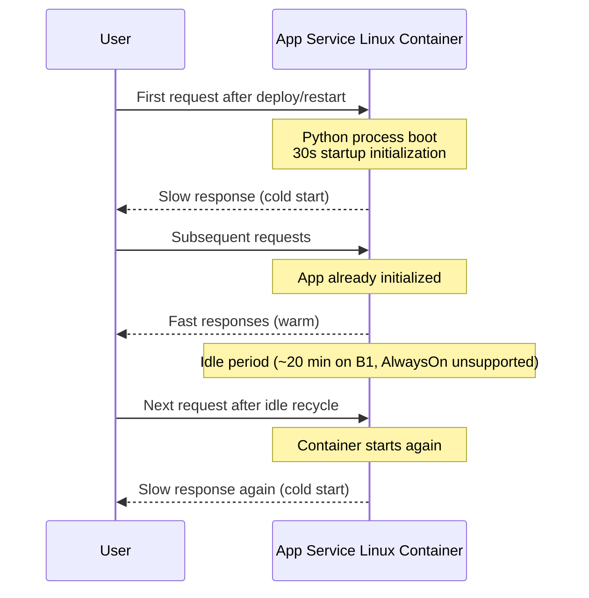

# Lab: Slow Start (Cold Start) vs Real Regression

Reproduce cold start behavior on Azure App Service Linux with a Python/Flask app that intentionally sleeps for 30 seconds at startup, then compare first-hit latency against warm steady-state latency.

## Objective

Demonstrate that a slow first request after deploy, restart, or idle recycle is a startup cost (cold start), not a sustained application regression.

## Prerequisites

- Azure subscription
- Azure CLI installed and logged in
- Bash shell

## Deploy

```bash
# Create resource group
az group create --name rg-lab-coldstart --location koreacentral

# Deploy lab infrastructure (B1 Linux plan, AlwaysOn disabled)
az deployment group create \
  --resource-group rg-lab-coldstart \
  --template-file lab-guides/slow-start-cold-start/main.bicep \
  --parameters baseName=labcold
```

## Trigger the Symptom

```bash
# End-to-end execution: deploy code, measure cold and warm latency, restart, measure again
bash lab-guides/slow-start-cold-start/trigger.sh rg-lab-coldstart labcold koreacentral
```

The trigger script executes these phases:

1. Deploy infra and app package
2. Measure first request latency (cold start)
3. Measure 10 warm requests
4. Restart the app to force cold start
5. Measure first request latency after restart
6. Print a cold vs warm summary table

## Timeline (Cold vs Warm)



## Observe

1. Run verification queries:

```bash
bash lab-guides/slow-start-cold-start/verify.sh rg-lab-coldstart
```

2. In Log Analytics, validate:
   - `AppServiceHTTPLogs` shows high first-hit latency and low warm latency.
   - `AppServicePlatformLogs` shows container lifecycle events near slow requests.

3. Optionally test manually:

```bash
APP_HOSTNAME=$(az webapp list --resource-group rg-lab-coldstart --query "[0].defaultHostName" --output tsv)
curl --silent "https://$APP_HOSTNAME/timing"
curl --silent "https://$APP_HOSTNAME/fast"
```

## Expected Signals

- First request after deploy or restart is around 30+ seconds.
- Warm requests are consistently fast.
- First request after restart becomes slow again.
- Platform logs show start/restart events aligning with slow requests.

## Why This Matters

Cold start latency is a one-time initialization cost per container instance. Treating that as a regression leads to false alarms. Real regression appears as sustained high latency across warm requests, not just first-hit spikes.

## Clean Up

```bash
az group delete --name rg-lab-coldstart --yes --no-wait
```

## References

- [Configure an App Service app](https://learn.microsoft.com/en-us/azure/app-service/configure-common)
- [Azure App Service plan overview](https://learn.microsoft.com/en-us/azure/app-service/overview-hosting-plans)
- [Quickstart: Create Bicep files with Visual Studio Code](https://learn.microsoft.com/en-us/azure/azure-resource-manager/bicep/quickstart-create-bicep-use-visual-studio-code)
- [Enable diagnostic logging for apps in Azure App Service](https://learn.microsoft.com/en-us/azure/app-service/troubleshoot-diagnostic-logs)
