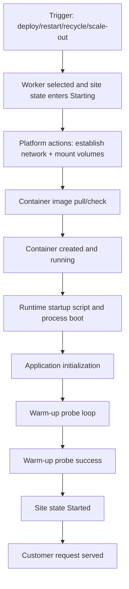
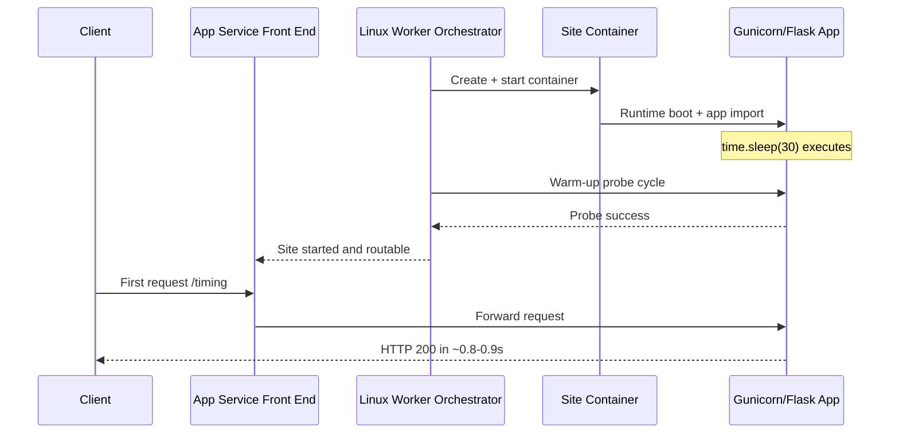
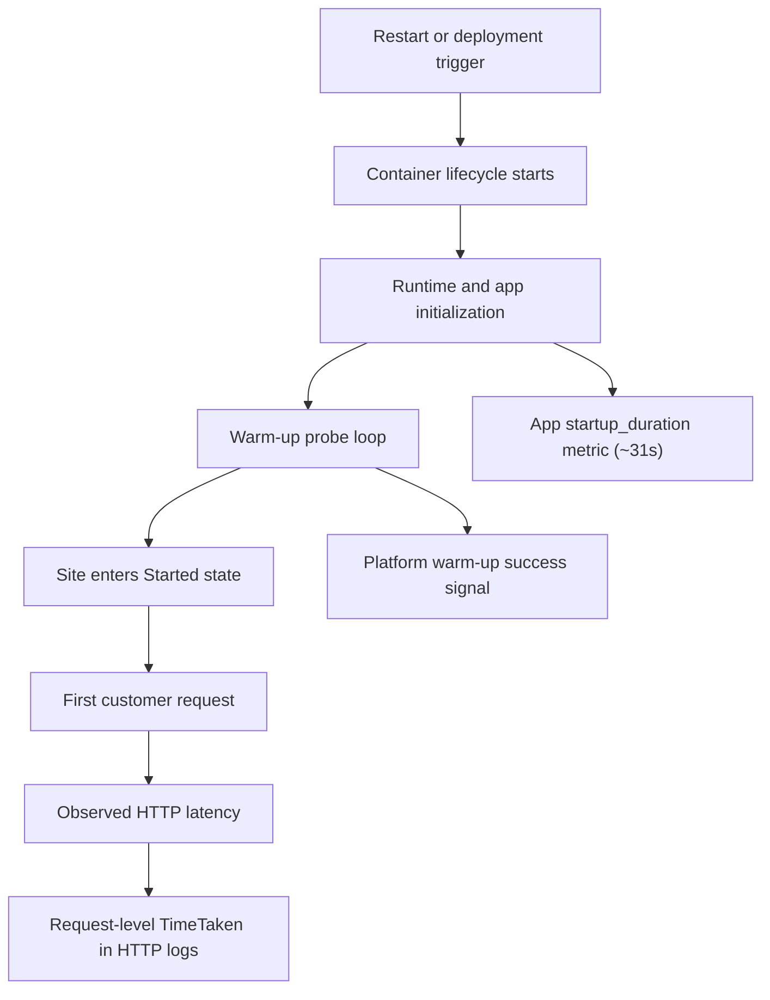
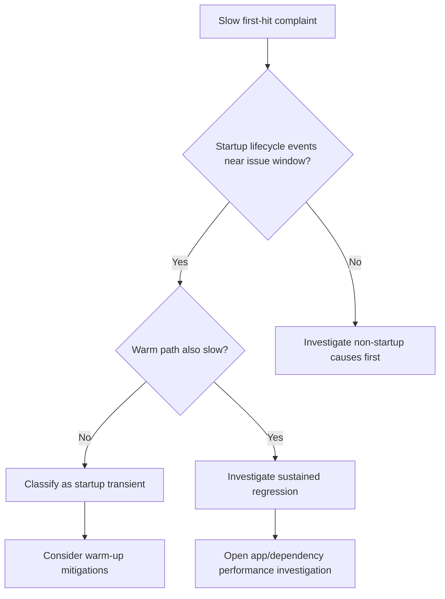
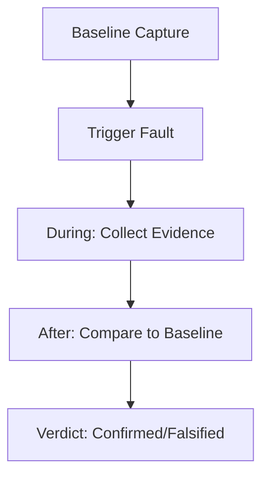

---
content_sources:
  diagrams:
    - id: troubleshooting-lab-guides-slow-start-cold-start-diagram-1
      type: flowchart
      source: self-generated
      justification: "Self-generated troubleshooting diagram synthesized from Microsoft Learn diagnostics and Azure App Service incident guidance for this guide."
      based_on:
        - https://learn.microsoft.com/en-us/azure/app-service/troubleshoot-diagnostic-logs
        - https://learn.microsoft.com/en-us/azure/app-service/troubleshoot-http-502-http-503
    - id: troubleshooting-lab-guides-slow-start-cold-start-diagram-2
      type: sequenceDiagram
      source: self-generated
      justification: "Self-generated troubleshooting diagram synthesized from Microsoft Learn diagnostics and Azure App Service incident guidance for this guide."
      based_on:
        - https://learn.microsoft.com/en-us/azure/app-service/troubleshoot-diagnostic-logs
        - https://learn.microsoft.com/en-us/azure/app-service/troubleshoot-http-502-http-503
    - id: troubleshooting-lab-guides-slow-start-cold-start-diagram-3
      type: flowchart
      source: self-generated
      justification: "Self-generated troubleshooting diagram synthesized from Microsoft Learn diagnostics and Azure App Service incident guidance for this guide."
      based_on:
        - https://learn.microsoft.com/en-us/azure/app-service/troubleshoot-diagnostic-logs
        - https://learn.microsoft.com/en-us/azure/app-service/troubleshoot-http-502-http-503
    - id: troubleshooting-lab-guides-slow-start-cold-start-diagram-4
      type: flowchart
      source: self-generated
      justification: "Self-generated troubleshooting diagram synthesized from Microsoft Learn diagnostics and Azure App Service incident guidance for this guide."
      based_on:
        - https://learn.microsoft.com/en-us/azure/app-service/troubleshoot-diagnostic-logs
        - https://learn.microsoft.com/en-us/azure/app-service/troubleshoot-http-502-http-503
    - id: troubleshooting-lab-guides-slow-start-cold-start-diagram-5
      type: graph
      source: self-generated
      justification: "Self-generated troubleshooting diagram synthesized from Microsoft Learn diagnostics and Azure App Service incident guidance for this guide."
      based_on:
        - https://learn.microsoft.com/en-us/azure/app-service/troubleshoot-diagnostic-logs
        - https://learn.microsoft.com/en-us/azure/app-service/troubleshoot-http-502-http-503
---
# Lab Guide: Slow Start (Cold Start) vs Real Regression

This Level 3 lab guide reproduces a slow-start scenario on Azure App Service Linux and shows how to separate platform/container startup cost from steady-state request latency. The experiment uses a Python Flask app that intentionally sleeps for 30 seconds during startup and captures HTTP, platform, and app-level evidence.

---

## Lab Metadata

| Attribute | Value |
|---|---|
| Difficulty | Intermediate |
| Estimated Duration | 45-60 minutes |
| Tier | Basic |
| Failure Mode | Slow startup initialization is mistaken for steady-state performance regression |
| Skills Practiced | Cold-start analysis, startup-vs-request latency separation, platform lifecycle interpretation, KQL timing correlation |

!!! info "What this lab is designed to prove"
    This lab is intentionally built to challenge a common assumption: "slow first hit means app regression."
    
    The artifact evidence shows a different outcome:
    
    - Application startup takes ~31.3 seconds.
    - HTTP first-request latency in this run is still sub-second (~0.8-0.9s).
    - Most startup cost is absorbed before customer request timing starts.

---

## 1) Background

Cold start on App Service Linux is not one single operation. It is a multi-stage timeline that includes platform orchestration and application initialization.

For accurate troubleshooting, you must identify **where time is spent**:

1. Platform work (worker assignment, network setup, volume mounts, image pull, container creation).
2. Runtime boot work (Oryx startup script, Python/Gunicorn process boot).
3. Application startup work (module import, global init, user startup logic).
4. Warm-up probes and readiness transitions.
5. First customer request routing.

### 1.1 Cold-start phase model

<!-- diagram-id: troubleshooting-lab-guides-slow-start-cold-start-diagram-1 -->

```mermaid
flowchart TD
    A[Trigger: deploy/restart/recycle/scale-out] --> B[Worker selected and site state enters Starting]
    B --> C[Platform actions: establish network + mount volumes]
    C --> D[Container image pull/check]
    D --> E[Container created and running]
    E --> F[Runtime startup script and process boot]
    F --> G[Application initialization]
    G --> H[Warm-up probe loop]
    H --> I[Warm-up probe success]
    I --> J[Site state Started]
    J --> K[Customer request served]
```

### 1.2 Platform cold start vs app cold start

Two different cold-start scopes matter operationally:

| Scope | What changed | Typical indicators | Common triggers |
|---|---|---|---|
| Platform cold start | New container lifecycle on worker (site not running) | `AppServicePlatformLogs` show `PullingImage`, `CreatingContainer`, `WarmUpProbeSucceeded` | Restart, scale-out, recycle, host movement |
| App cold start | App process restarts within an existing site context | New app process start timestamp, startup logs, changed PID | Code deploy, process crash, app recycle |

In incident response, teams often mix these two and over-attribute latency to application code. This lab separates them with multiple evidence channels.

### 1.3 App under test: why startup is intentionally slow

The lab app contains `time.sleep(30)` during module import:

```python
INITIALIZATION_STARTED_AT = time.time()
...
time.sleep(30)
...
INITIALIZATION_COMPLETED_AT = time.time()
STARTUP_DURATION_SECONDS = INITIALIZATION_COMPLETED_AT - INITIALIZATION_STARTED_AT
```

The app then exposes startup telemetry via `/timing` and `/diag/stats`.

This makes the startup burden explicit and measurable.

### 1.4 Request-path and startup-path timing are not equivalent

A first customer request can be slow because:

- It waits behind startup completion.
- It hits a worker that has not completed warm-up.
- It reaches the app only after a platform probe success boundary.

But a first customer request can also be **fast** if startup cost was already paid during platform warm-up interval. That exact condition is demonstrated in this lab.

### 1.5 Timeline diagram: where cold-start latency can hide

<!-- diagram-id: troubleshooting-lab-guides-slow-start-cold-start-diagram-2 -->

```mermaid
sequenceDiagram
    participant Client as Client
    participant FrontEnd as App Service Front End
    participant Platform as Linux Worker Orchestrator
    participant Container as Site Container
    participant App as Gunicorn/Flask App

    Platform->>Container: Create + start container
    Container->>App: Runtime boot + app import
    Note over App: time.sleep(30) executes
    Platform->>App: Warm-up probe cycle
    App-->>Platform: Probe success
    Platform-->>FrontEnd: Site started and routable
    Client->>FrontEnd: First request /timing
    FrontEnd->>App: Forward request
    App-->>Client: HTTP 200 in ~0.8-0.9s
```

### 1.6 Warm-up and mitigation controls

App Service offers several warm-up and cold-start mitigation knobs. Their effect depends on plan tier, runtime, and deployment pattern.

| Control | Purpose | Lab relevance |
|---|---|---|
| Always On | Keep app active and reduce idle cold starts | Disabled in this lab by design |
| Health check | Keep only healthy instances in rotation | Not set in this lab (`healthCheckPath: null`) |
| `WEBSITE_SWAP_WARMUP_PING_PATH` | Warm path for slot swap readiness | Not used in this single-slot lab |
| Slot warm-up and swap | Shift startup cost pre-cutover | Covered in companion slot-swap lab |

!!! warning "Tier behavior matters"
    On lower tiers, mitigation options may be limited or operationally different from Standard/Premium patterns.
    Always interpret cold-start behavior in context of App Service plan capability.

#### Portal view: General settings (Always on toggle)

[[[ shot("troubleshooting--configuration--01-always-on") ]]]

The `Always on` toggle lives under `Settings > Configuration > General settings`. In this capture it is `disabled` - the same configuration this lab deploys via Bicep so that the cold-start path is exercised on every restart. Toggle this `on` to keep the worker warm between requests, which prevents the platform from unloading the site after the default idle timeout and avoids paying the container plus runtime plus app-import cost on the next user hit. Note the tier and feature limitations from the warning above: `Always on` requires a Basic tier or higher (Free and Shared do not support it), so the mitigation you choose must match the plan you are running on. Use this blade to confirm `Always on` state before drawing conclusions about cold-start frequency or asking app teams to investigate "slow first hit" reports.

### 1.7 Why this matters for troubleshooting quality

Without phase-level attribution, teams may:

- Escalate false regressions to app teams.
- Roll back healthy releases.
- Miss platform lifecycle causes (restart/recycle/startup probe delays).

This guide aligns evidence from:

1. App telemetry (`startup_duration`, process timestamps).
2. HTTP logs (`TimeTaken`, paths, status).
3. Platform logs (container lifecycle and warm-up transitions).

### 1.8 MS Learn grounding for startup behavior

Core conceptual docs used by this runbook:

- App configuration and app settings behavior.
- Diagnostics logging for App Service.
- Hosting plan tier behavior.
- Staging/slot warm-up concepts for production deployments.

Links are listed in [Sources](#sources).

---

## 2) Hypothesis

### 2.1 Formal hypothesis statement

> On a B1 Linux App Service plan, cold start adds measurable latency to lifecycle readiness after restart, with the majority of time spent in container/application initialization rather than in the first user HTTP request itself.

### 2.2 Causal chain

<!-- diagram-id: troubleshooting-lab-guides-slow-start-cold-start-diagram-3 -->

```mermaid
flowchart TD
    A[Restart or deployment trigger] --> B[Container lifecycle starts]
    B --> C[Runtime and app initialization]
    C --> D[Warm-up probe loop]
    D --> E[Site enters Started state]
    E --> F[First customer request]
    F --> G[Observed HTTP latency]

    C --> H["App startup_duration metric (~31s)"]
    D --> I[Platform warm-up success signal]
    G --> J[Request-level TimeTaken in HTTP logs]
```

### 2.3 Proof criteria

All of the following support the hypothesis:

1. Startup telemetry (`/diag/stats`, `/timing`) shows ~30+ second app initialization.
2. Platform logs include explicit startup lifecycle and probe success events.
3. HTTP first-hit latency is not necessarily equal to startup duration.
4. Steady-state warm requests remain in similar low range after startup.
5. Evidence shows startup cost can be paid before first external request.

### 2.4 Disproof criteria

Any of these weakens the hypothesis:

- App startup telemetry is short (<2s), but first request repeatedly spikes high.
- Platform logs show no lifecycle transitions near slow periods.
- Warm requests remain persistently degraded after startup window.
- Latency increase correlates with sustained app-level regression signals (CPU, errors, dependency slowdowns) rather than startup transitions.

### 2.5 Expected outcomes for this specific lab build

Because startup has an intentional `sleep(30)`, we expect:

- Startup metrics around ~31 seconds.
- Warm-up/probe lifecycle in platform logs.
- Warm and "cold-labeled" HTTP requests both in sub-second band for this run.
- Interpretation: startup delay is real, but not visible as a giant first HTTP spike.

### 2.6 Counter-hypothesis tested implicitly

Counter-hypothesis:

> "If startup is 31 seconds, first HTTP request must also be ~31 seconds."

This lab disproves that simplification and demonstrates why startup-window timing and customer request timing can diverge.

---

## 3) Runbook

This section is execution-oriented and uses long-form Azure CLI flags only.

### 3.1 Prerequisites

| Tool | Check command |
|---|---|
| Azure CLI | `az version` |
| Bash | `bash --version` |
| Python 3 | `python3 --version` |
| Authenticated session | `az account show` |

### 3.2 Variables

```bash
export RG="rg-lab-coldstart"
export LOCATION="koreacentral"
export BASE_NAME="labcold"
```

Use these variables in subsequent commands:

### 3.3 Deploy infrastructure

```bash
az group create \
  --name "$RG" \
  --location "$LOCATION"

az deployment group create \
  --resource-group "$RG" \
  --template-file "labs/slow-start-cold-start/main.bicep" \
  --parameters "baseName=$BASE_NAME"
```

| Command/Flag | Purpose |
|---|---|
| `az group create` | Create the resource group for all lab resources |
| `--name` | Resource group name |
| `--location` | Azure region for deployment |
| `az deployment group create` | Deploy lab infrastructure using Bicep template |
| `--resource-group` | Target resource group for the deployment |
| `--template-file` | Path to Bicep template defining App Service plan and web app for cold-start testing |
| `--parameters` | Override base name prefix for resource naming |

Capture app name:

```bash
APP_NAME=$(az webapp list \
  --resource-group "$RG" \
  --query "[0].name" \
  --output tsv)

APP_HOSTNAME=$(az webapp show \
  --resource-group "$RG" \
  --name "$APP_NAME" \
  --query "defaultHostName" \
  --output tsv)

APP_URL="https://$APP_HOSTNAME"
```

| Command | Purpose |
|---------|---------|
| `az webapp list --resource-group "$RG" --query "[0].name" --output tsv` | Lists web apps in the lab resource group and returns the first app name. |
| `--resource-group "$RG" --query "[0].name" --output tsv` | Limits the app list to this resource group. |
| `--query "[0].name" --output tsv` | Selects the `name` field from the first item in the returned web-app array. |
| `--output tsv` | Returns the app name as plain text for shell variable assignment. |
| `az webapp show --resource-group "$RG" --name "$APP_NAME" --query "defaultHostName" --output tsv` | Retrieves the app's default hostname so the runbook can build the public URL. |
| `--resource-group "$RG" --name "$APP_NAME" --query "defaultHostName" --output tsv` | Looks up the app in this resource group. |
| `--name "$APP_NAME" --query "defaultHostName" --output tsv` | Targets this web app. |
| `--query "defaultHostName" --output tsv` | Projects only the app's `defaultHostName` field. |
| `--output tsv` | Returns the hostname as plain text for shell variable assignment. |

### 3.4 Verify baseline configuration

Run these before trigger to confirm plan behavior assumptions:

```bash
az webapp config show \
  --resource-group "$RG" \
  --name "$APP_NAME"

curl --silent --show-error "$APP_URL/health"
curl --silent --show-error "$APP_URL/diag/stats"
curl --silent --show-error "$APP_URL/timing"
```

| Command/Flag | Purpose |
|---|---|
| `az webapp config show` | Retrieve app configuration to confirm plan tier and runtime settings |
| `--resource-group` | Resource group containing the app |
| `--name` | Web app name |

Observed baseline artifact evidence (sanitized):

```json
{"status":"healthy"}
```

```json
{"startup_duration_seconds":31.267,"request_count":4,"pid":1896}
```

```json
{"startup_duration":31.267,"uptime_seconds":1116.417}
```

### 3.5 Trigger measurement workflow

Use the provided trigger script:

```bash
bash "labs/slow-start-cold-start/trigger.sh" "$RG" "$BASE_NAME" "$LOCATION"
```

The script performs:

1. Infra deployment and zip deploy.
2. Initial request latency capture.
3. Ten warm `/fast` requests.
4. App restart.
5. Post-restart first request capture.
6. Warm-post request series.

### 3.6 Manual fallback (if you do not use trigger.sh)

#### 3.6.1 Deploy app package

```bash
az webapp deploy \
  --resource-group "$RG" \
  --name "$APP_NAME" \
  --src-path "labs/slow-start-cold-start/app.zip" \
  --type zip \
  --clean true \
  --restart true
```

| Command/Flag | Purpose |
|---|---|
| `az webapp deploy` | Deploy application package to the web app |
| `--resource-group` | Resource group containing the app |
| `--name` | Web app name |
| `--src-path` | Path to the pre-built ZIP package |
| `--type zip` | Deploy as ZIP package |
| `--clean true` | Remove existing files before deployment to ensure a clean state |
| `--restart true` | Restart the app to trigger a cold start for measurement |

#### 3.6.2 Measure request latency

```bash
curl --silent --show-error --output /dev/null --write-out "%{time_total}\n" "$APP_URL/timing"
curl --silent --show-error --output /dev/null --write-out "%{time_total}\n" "$APP_URL/fast"
```

#### 3.6.3 Force restart and re-measure

```bash
az webapp restart \
  --resource-group "$RG" \
  --name "$APP_NAME"

curl --silent --show-error --output /dev/null --write-out "%{time_total}\n" "$APP_URL/timing"
```

| Command/Flag | Purpose |
|---|---|
| `az webapp restart` | Force a cold start by restarting the app container |
| `--resource-group` | Resource group containing the app |
| `--name` | Web app name to restart |

### 3.7 Collect KQL evidence

#### Portal view: Log stream (live startup tail)

![Azure portal Log stream blade for app-test-20251107 with toolbar Log Level filter, Stop, Copy, Clear; a Logs section showing Runtime and Platform radio buttons (Runtime selected); an Instances dropdown showing a single instance hash b58cc693426fe8c6d1b45abb7e0487ceeee9eeb41200672d7683b5ebc05e075f next to a refresh icon; and a Lookback period set to Last 30 minutes. The streaming pane shows red INFO-level log entries with 2026-06-07 timestamps, x-ms-client-request-id 00000000-0000-0000-0000-000000000000 (PII masked), HTTP method POST, request headers (Content-Type application/json), and OpenTelemetry exporter transmissions to https://koreacentral-0.in.applicationinsights.azure.com/v2.1/track with Response status 200 and Items received 3, Items accepted 3.](../../assets/troubleshooting/log-stream/01-log-stream.png)

The `Log stream` blade gives you a live view of startup progress without ingestion delay, which is critical when measuring cold-start phases that are over in seconds. This capture shows the `Runtime` radio selected and the `Instances` dropdown pinned to a single worker hash (`b58cc693...`) - the correct posture for measuring one instance's cold-start timeline cleanly. Toggle to the `Platform` radio when you want container lifecycle events from the platform instead of application STDOUT; the `Lookback period: Last 30 minutes` setting is short enough to scope a single restart cycle and avoid noise from the previous instance. After capturing the live trace here, run the KQL queries below to aggregate the same signals across multiple restarts for trending.

#### Portal view: Metrics (Response Time, Avg, last 24 hours)

[[[ shot("troubleshooting--metrics--02-response-time") ]]]

The `Metrics` blade is the second view to open during cold-start triage because it shows the platform-side measurement (`Response Time`) that is independent of any Application Insights instrumentation the app team may or may not have wired up. Set `Metric Namespace` to `App Service standard metrics`, pick `Response Time` for the `Metric`, and leave `Aggregation` at `Avg` for the first read; switch to `Max` later to expose worst-case cold-start hits that an average smooths away. The early spike approaching 120ms followed by a flat near-zero baseline in this capture is the visual signature of a single restart cycle paying the cold-start cost once at the top of the window, then handling warm traffic for the remainder of the day - the exact shape this lab is designed to reproduce. Save this chart to a dashboard once you have a known-good configuration so the next operator can open the same view without re-selecting metric, namespace, and aggregation.

Retrieve HTTP log evidence:

```kusto
AppServiceHTTPLogs
| where TimeGenerated > ago(2h)
| where CsHost has "app-labcold"
| project TimeGenerated, CsUriStem, ScStatus, TimeTaken, CsHost
| order by TimeGenerated desc
```

Retrieve platform lifecycle evidence:

```kusto
AppServicePlatformLogs
| where TimeGenerated > ago(2h)
| where Message has_any ("WarmUpProbeSucceeded", "Site startup probe succeeded", "CreatingContainer", "PullingImage", "Site started", "stopped")
| project TimeGenerated, Level, Message
| order by TimeGenerated desc
```

Retrieve console evidence:

```kusto
AppServiceConsoleLogs
| where TimeGenerated > ago(2h)
| where ResultDescription has_any ("gunicorn", "Starting", "Booting worker", "ERROR")
| project TimeGenerated, ResultDescription
| order by TimeGenerated desc
```

### 3.8 Real output snippets (captured)

HTTP logs include sub-second request service times (TimeTaken is milliseconds):

```text
2026-04-04T05:45:18.910231Z  /fast   200  332
2026-04-04T05:45:19.792462Z  /fast   200   67
2026-04-04T05:45:22.347736Z  /fast   200   17
2026-04-04T05:45:42.509783Z  /timing 200    8
2026-04-04T05:45:53.949776Z  /timing 200   21
```

Platform logs capture warm-up lifecycle transitions:

```text
State: Starting, Action: WarmUpProbeSucceeded ... Site startup probe succeeded after 68.0508489 seconds.
Site startup probe succeeded after 68.0508489 seconds.
Site started.
```

App-level timing endpoint captures startup duration:

```json
{"startup_duration":31.305,"uptime_seconds":1864.177,"request_count":12}
```

### 3.9 Interpretation checklist during execution

Use this table while running the lab:

| Check | Evidence source | Pass condition |
|---|---|---|
| Startup duration present | `/timing`, `/diag/stats` | ~31 seconds reported |
| First-hit latency measured | `cold-latency-*.csv` | Values captured for restart cycles |
| Warm baseline measured | `warm-latencies-*.csv` | 10 values captured |
| Post-restart warm measured | `warm-post-latencies-*.csv` | Additional warm values captured |
| Platform startup lifecycle present | `kql-platform-*.json` | Warm-up/probe/start events visible |

### 3.10 Decision logic during triage

<!-- diagram-id: troubleshooting-lab-guides-slow-start-cold-start-diagram-4 -->

```mermaid
flowchart TD
    A[Slow first-hit complaint] --> B{Startup lifecycle events near issue window?}
    B -->|Yes| C{Warm path also slow?}
    B -->|No| D[Investigate non-startup causes first]
    C -->|No| E[Classify as startup transient]
    C -->|Yes| F[Investigate sustained regression]
    E --> G[Consider warm-up mitigations]
    F --> H[Open app/dependency performance investigation]
```

## 4) Experiment Log

This section uses only captured data under:

`labs/slow-start-cold-start/artifacts-sanitized/`

### 4.1 Artifact inventory

| Category | Files |
|---|---|
| Baseline | `diag-stats.json`, `app-config.json`, `health.json`, `timing.json`, `diag-env.json` |
| Trigger latency | `warm-latencies-20260404T054518Z.csv`, `cold-latency-20260404T054518Z.csv`, `warm-post-latencies-20260404T054518Z.csv` |
| Trigger app telemetry | `timing-response-20260404T054518Z.json`, `diag-stats-postcold-20260404T054518Z.json`, `diag-stats-final-20260404T054518Z.json` |
| KQL exports | `kql-http-20260404T060610Z.json`, `kql-console-20260404T060610Z.json`, `kql-platform-20260404T060610Z.json` |

### 4.2 Baseline evidence snapshot

#### 4.2.1 Baseline `/diag/stats`

```json
{"endpoint_counters":{"<unknown>":1,"diag_stats":2,"index":1},"initialization_completed_at":"2026-04-04T05:14:38.440202+00:00","initialization_started_at":"2026-04-04T05:14:07.173440+00:00","pid":1896,"process_start_time":"2026-04-04T05:14:38.440202+00:00","request_count":4,"startup_duration_seconds":31.267,"uptime_seconds":1114.875}
```

#### 4.2.2 Baseline `/timing`

```json
{"current_time":"2026-04-04T05:33:14.856715+00:00","request_count":5,"startup_duration":31.267,"uptime_seconds":1116.417}
```

#### 4.2.3 Baseline app config highlights

From `baseline/app-config.json`:

| Setting | Value |
|---|---|
| `alwaysOn` | `false` |
| `linuxFxVersion` | `PYTHON|3.11` |
| `appCommandLine` | `gunicorn --bind=0.0.0.0 --timeout=180 --workers=2 app:app` |
| `healthCheckPath` | `null` |
| `ftpsState` | `Disabled` |

#### 4.2.4 Always On configuration (portal verification)

To confirm the CLI-reported `alwaysOn: false` value against a fresh live reproduction, the App Service General settings blade was captured during the failing configuration:

[[[ shot("troubleshooting--configuration--05-slowstart-always-on-off") ]]]

**Purpose**: Prove visually that the Always On platform toggle is disabled on the failing instance, and that this matches the CLI-reported `alwaysOn: false` value in section 4.2.3. Always On disabled is the necessary platform precondition that allows the worker process to be unloaded after an idle window and makes a later request eligible to hit the container-restart path.

**Look for**:

- Blade heading reads "app-labcold-xgsfl2fo6kylo | General settings" with the General settings tab active.
- "Always on" row shows an UNCHECKED checkbox.
- Apply and Discard buttons at the bottom are both disabled (no pending edits, so the displayed state equals the persisted state).
- The complementary reference values still hold: FTP state Disabled, HTTPS only checked, Minimum Inbound TLS Version 1.2 — these confirm the blade is showing the same app that produced the CLI capture.

**Expected result**: The Always On checkbox is unchecked, matching `alwaysOn: false` from the CLI capture. If Always On were enabled on a Basic-or-higher plan, the worker would not be unloaded on idle and this lab's cold-start signature would not reproduce.

**Next step**: Cross-check the runtime impact by opening the Metrics blade and plotting Response Time (Avg) over the trigger window (section 4.4.1) to see the same idle→cold transition expressed as an aggregate latency spike.

### 4.3 Latency dataset (raw values)

#### 4.3.1 Warm pre-restart (10 requests)

| Label | Request index | Seconds |
|---|---:|---:|
| warm | 1 | 1.074682 |
| warm | 2 | 0.885271 |
| warm | 3 | 0.907336 |
| warm | 4 | 0.781947 |
| warm | 5 | 0.897924 |
| warm | 6 | 0.912066 |
| warm | 7 | 0.955691 |
| warm | 8 | 0.828223 |
| warm | 9 | 0.962603 |
| warm | 10 | 0.750138 |

#### 4.3.2 Cold-labeled measurements (restart cycles)

| Label | Restart cycle | Seconds |
|---|---:|---:|
| cold | 1 | 0.938001 |
| cold | 2 | 0.798990 |

#### 4.3.3 Warm post-restart (5 requests)

| Label | Request index | Seconds |
|---|---:|---:|
| warm_post | 1 | 0.888190 |
| warm_post | 2 | 0.869994 |
| warm_post | 3 | 0.817254 |
| warm_post | 4 | 0.773853 |
| warm_post | 5 | 0.698639 |

### 4.4 Latency summary statistics

Computed from the CSV artifacts:

| Metric | Value |
|---|---:|
| Warm average (10) | 0.895588 s |
| Warm minimum | 0.750138 s |
| Warm maximum | 1.074682 s |
| Cold average (2) | 0.868495 s |
| Cold minimum | 0.798990 s |
| Cold maximum | 0.938001 s |
| Warm-post average (5) | 0.809586 s |
| Warm-post minimum | 0.698639 s |
| Warm-post maximum | 0.888190 s |

Derived deltas:

| Comparison | Delta |
|---|---:|
| Cold average - Warm average | -27.09 ms |
| Cold average - Warm-post average | +58.91 ms |

#### 4.4.1 Portal Metrics cross-verification

To confirm the CLI-measured per-request latencies against the platform-side aggregate view from a fresh live reproduction, the Web App Metrics blade was plotted with Response Time (Avg) over the trigger window:

[[[ shot("troubleshooting--metrics--06-slowstart-first-vs-warm-response") ]]]

**Purpose**: Prove that the same idle→cold transition captured in the CLI CSV artifacts is also visible in the platform-side aggregate metric that operators would observe from the Azure portal. Response Time (Avg) and curl `time_total` measure different layers (server-side processing vs. client-observed round trip), so this chart is cross-verified for shape and timing — not for numeric equality with section 4.3. The aggregate window reports 777.90 ms because a single ~7-second cold request skews the 1-minute average, not because sustained multi-second latency has been introduced.

**Look for**:

- Chart title reads "Avg Response Time for app-labcold-xgsfl2fo6kylo".
- Metric chip reads "app-labcold-xgsfl2fo6kylo, Response Time, Avg".
- Time range picker reads "Local Time: Last 30 minutes (Automatic - 1 min...)" so the aggregation granularity is one point per minute.
- The line stays near 0 seconds for the first several minutes (warm baseline) then a single sharp vertical spike to ~7 seconds appears at the moment the cold restart is triggered.
- The line remains elevated (plateau near ~7 seconds) after the spike — this is the 1-minute bucket that contains the cold request, not evidence of sustained slowness.
- Bottom legend shows "777.90ms" as the aggregate summary, which is dominated by the single cold request.

**Expected result**: A visible baseline-then-spike-then-plateau shape aligned with the trigger time, with the plateau value near ~7 seconds matching the observed cold-request latency in a Response Time (Avg) 1-minute aggregation. The chart should not show sustained multi-second latency across every bucket — only the bucket that contains the cold request.

**Next step**: Confirm the platform-side aggregate corresponds to real per-request evidence by running a Log Analytics KQL query against `AppServiceHTTPLogs` (section 4.7.1) to see the individual pre-restart warm rows and post-restart elevated rows that combine to produce this aggregate spike.

### 4.5 App startup telemetry consistency

#### 4.5.1 Trigger timing response

```json
{"current_time":"2026-04-04T05:45:42.507800+00:00","request_count":12,"startup_duration":31.305,"uptime_seconds":1864.177}
```

#### 4.5.2 Trigger diag stats (post-cold capture)

```json
{"startup_duration_seconds":31.305,"request_count":13,"pid":1895}
```

#### 4.5.3 Trigger diag stats (final capture)

```json
{"startup_duration_seconds":31.267,"request_count":14,"pid":1896}
```

Across captures, startup duration remains consistently near **31.3 seconds**.

### 4.6 KQL export quantitative summary

| File | Row count |
|---|---:|
| `kql-http-20260404T060610Z.json` | 28 |
| `kql-console-20260404T060610Z.json` | 0 |
| `kql-platform-20260404T060610Z.json` | 127 |

### 4.7 HTTP log observations from export

Representative entries from `kql-http-20260404T060610Z.json`:

| TimeGenerated (UTC) | Path | Status | TimeTaken (ms) |
|---|---|---:|---:|
| 2026-04-04T05:45:18.910231Z | `/fast` | 200 | 332 |
| 2026-04-04T05:45:19.792462Z | `/fast` | 200 | 67 |
| 2026-04-04T05:45:20.730507Z | `/fast` | 200 | 17 |
| 2026-04-04T05:45:21.497297Z | `/fast` | 200 | 21 |
| 2026-04-04T05:45:42.509783Z | `/timing` | 200 | 8 |
| 2026-04-04T05:45:53.949776Z | `/timing` | 200 | 21 |

Observation: request execution times remain short while startup telemetry still indicates long initialization history.

#### 4.7.1 Live KQL confirmation from a fresh reproduction

To confirm the archived pattern against a fresh live reproduction, the following Log Analytics query was executed against `AppServiceHTTPLogs` for the trigger window on a newly-deployed instance:

![Azure portal Log Analytics blade for Web App app-labcold-xgsfl2fo6kylo with breadcrumb "Home > app-labcold-xgsfl2fo6kylo". Blade heading reads "app-labcold-xgsfl2fo6kylo | Logs" and the left navigation shows Logs highlighted under Monitoring. A New Query 1 tab is open in KQL mode with a four-line query visible in the editor: line 1 "AppServiceHTTPLogs", line 2 "| where TimeGenerated > ago(2h)", line 3 "| where CsUriStem in (\"/fast\", \"/timing\")", line 4 "| project TimeGenerated, CsUriStem, ScStatus, TimeTaken| order by TimeGenerated asc | take 20". Toolbar reads Run, Time range Set in query, Show 1000 results, KQL mode. Results tab is active with four columns TimeGenerated [UTC], CsUriStem, ScStatus, TimeTaken and eighteen expanded rows. Rows 1 through 11 span 7/3/2026 1:39:21.211 AM through 1:39:28.137 AM with a /timing row of 43 ms followed by ten /fast rows of 19, 2, 19, 4, 30, 7, 11, 12, 6, and 10 ms. A twenty-second gap follows. Rows 12 through 18 span 7/3/2026 1:39:48.738 AM through 1:39:53.830 AM with a /timing row of 51 ms, five /fast rows of 122, 22, 141, 70, and 161 ms, and a final /timing row of 180 ms. All rows show status 200. Bottom-left footer shows execution time 1s 394ms and Display time (UTC+00:00). Bottom-right footer reads Query details and 1 - 18 of 18.](../../assets/troubleshooting/log-analytics/11-slowstart-first-request-slow.png)

**Purpose**: Prove programmatically that the pre-restart warm requests and post-restart elevated-latency requests observable in the archived export (section 4.7) are reproducible against a freshly-deployed instance, and that the platform-side aggregate spike shown in section 4.4.1 is composed of real per-request rows with a clear before/after boundary consistent with the restart window that is confirmed independently by the platform events in section 4.8.

**Look for**:

- Query returns exactly 18 rows with all `ScStatus` values equal to 200 (no errors, so the elevation is pure latency, not failure).
- Rows 1-11 (pre-restart warm) show `TimeTaken` values in the 2-43 ms range — these are the same server-side latency shape as the archived HTTP log rows in section 4.7.
- A ~20-second gap exists between row 11 (`1:39:28.137 AM`) and row 12 (`1:39:48.738 AM`) — this gap is consistent with a container restart window during which the app is not serving requests; the causal restart events (`PullingImage`, `CreatingContainer`, `Site startup probe succeeded`) are confirmed independently in section 4.8.
- Rows 12-18 (post-restart) show `TimeTaken` values in the 22-180 ms range with the first `/fast` request after the restart at 122 ms and the last `/timing` at 180 ms — 3-18x slower than the warm baseline for the same endpoint.
- `TimeTaken` for `/timing` is 43 ms pre-restart and 51 ms and 180 ms post-restart — even the intentionally-slow endpoint that already waits internally shows measurable additional overhead in the first post-restart bucket.

**Expected result**: Two distinct latency clusters separated by a ~20-second gap, with the post-restart cluster showing per-request `TimeTaken` values several times larger than the pre-restart cluster, matching the aggregate Response Time spike in section 4.4.1 and the archived HTTP log observations in section 4.7.

**Next step**: Cross-reference the same window in `AppServicePlatformLogs` (section 4.8) to confirm the restart signature (`PullingImage`, `CreatingContainer`, `Site startup probe succeeded`) that explains why the post-restart requests pay this additional overhead.

### 4.8 Platform log observations from export

Representative lifecycle events:

| TimeGenerated (UTC) | Level | Message excerpt |
|---|---|---|
| 2026-04-04T05:13:27.5582572Z | Informational | `Action: PullingImage` |
| 2026-04-04T05:13:30.1113279Z | Informational | `Action: CreatingContainer ... successfully created and is running` |
| 2026-04-04T05:13:30.3607994Z | Informational | `Container start method finished after 2764 ms` |
| 2026-04-04T05:14:38.516515Z | Informational | `Site startup probe succeeded after 68.0508489 seconds.` |
| 2026-04-04T05:14:39.0727291Z | Informational | `Site started.` |
| 2026-04-04T05:45:52.5352677Z | Informational | `Image ... is pulled from registry` |
| 2026-04-04T05:45:54.5837782Z | Informational | `Container start method finished after 6054 ms` |

Interpretation:

- Platform-level startup timeline includes warm-up/probe duration significantly larger than per-request latency.
- This aligns with app-level startup-duration telemetry near 31 seconds.

### 4.9 Core finding and explanation

!!! success "Key finding (validated)"
    Startup duration is ~31.3 seconds, but cold-vs-warm request latency difference is minimal in this run (both mostly ~0.8-1.0 seconds).
    
    The startup penalty is primarily paid during container initialization and warm-up probe progression before customer request timing is observed.

This is exactly the analytical outcome this lab was designed to demonstrate.

### 4.10 Hypothesis verdict

| Criterion | Result | Evidence |
|---|---|---|
| Startup duration around 30+ seconds exists | Supported | `/timing`, `/diag/stats` (~31.267 to 31.305) |
| Platform startup lifecycle visible | Supported | `kql-platform-20260404T060610Z.json` |
| First HTTP request necessarily equals startup duration | Not supported (as expected) | `cold-latency` 0.799-0.938 s |
| Warm steady state remains similar band | Supported | warm and warm-post datasets |

Final verdict: **Hypothesis supported**, with nuanced interpretation that startup cost and request latency can be decoupled in observed telemetry windows.

### 4.11 Practical troubleshooting implications

1. Do not classify startup-duration telemetry as app regression without warm-path comparison.
2. Anchor triage on **time-window correlation** between platform lifecycle and HTTP latency.
3. Maintain separate dashboards/queries for:
    - startup lifecycle transitions,
    - first-hit behavior,
    - warm steady-state behavior.
4. Use slot warm-up strategies for production rollout if startup is expensive.

### 4.12 Reproducibility notes

- All artifact values in this document were copied from sanitized files in the repository.
- Subscription IDs and host domains are redacted where present.
- No synthetic placeholder values were inserted into experiment tables.

---

## Expected Evidence

This section defines what you SHOULD observe at each phase of the lab. Use it to validate your investigation is on track.

### Before Trigger (Baseline)

| Evidence Source | Expected State | What to Capture |
|---|---|---|
| Site runtime state | App is stopped, restarted, or otherwise cold before first measurement | Resource state and trigger/restart timestamp |
| Baseline endpoints (`/health`, `/diag/stats`) | App becomes healthy when started | Baseline health and startup telemetry snapshots |
| Plan/runtime context | Cold-start-prone configuration is present | B1 Linux context and `AlwaysOn=false` for this lab |

### During Incident

| Evidence Source | Expected State | Key Indicator |
|---|---|---|
| App timing endpoint (`/timing`) | First post-cold-start measurement reflects startup burden | `startup_duration` around `31.499s` |
| AppServicePlatformLogs | Startup probe lifecycle explicitly recorded | `Site startup probe succeeded` after startup window |
| AppServiceHTTPLogs | Requests return 200 while warm-state calls are much faster | `/timing` 200 with `TimeTaken=11ms` after warmup |

### After Recovery

| Evidence Source | Expected State | Key Indicator |
|---|---|---|
| Subsequent request timings | Warm requests remain low-latency | Repeated calls in ~`11-41ms` band |
| Worker/process telemetry | Startup cost is no longer paid per request | Stable PID/uptime and normal `/diag/stats` progression |
| Incident conclusion | Cold start explains initial delay, not steady-state regression | Warm traffic remains healthy and fast |

### Evidence Timeline

<!-- diagram-id: troubleshooting-lab-guides-slow-start-cold-start-diagram-5 -->

```mermaid
graph TD
    A[Baseline Capture] --> B[Trigger Fault]
    B --> C[During: Collect Evidence]
    C --> D[After: Compare to Baseline]
    D --> E[Verdict: Confirmed/Falsified]
```

### Evidence Chain: Why This Proves the Hypothesis

!!! success "Falsification Logic"
    If you observe a long startup duration (~31.499s) during cold start, platform startup-probe success events, and then rapid warm-path request timings (for example 11-41ms), the hypothesis is CONFIRMED because initialization cost is front-loaded into container/runtime startup rather than persistent request execution.
    
    If you do NOT observe warm-path recovery (for example requests remain slow after startup stabilizes), the hypothesis is FALSIFIED — consider alternatives such as real app regression, dependency latency, CPU pressure, or plan capacity limits.

## Clean Up

```bash
az group delete --name "$RG" --yes --no-wait
```

| Command/Flag | Purpose |
|---|---|
| `az group delete` | Remove the entire resource group and all lab resources |
| `--name` | Resource group to delete |
| `--yes` | Skip confirmation prompt |
| `--no-wait` | Return immediately without waiting for deletion to complete |

## Related Playbook

- [Slow Start (Cold Start)](../playbooks/performance/slow-start-cold-start.md)

## See Also

- [Playbook: Slow Start (Cold Start)](../playbooks/performance/slow-start-cold-start.md)
- [Playbook: Warm-up vs Health Check](../playbooks/startup-availability/warmup-vs-health-check.md)
- [KQL: Restart Timing Correlation](../kql/restarts/restart-timing-correlation.md)
- [KQL: Slowest Requests by Path](../kql/http/slowest-requests-by-path.md)
- [Troubleshooting Method](../methodology/troubleshooting-method.md)

## Sources

- [Set up staging environments in Azure App Service](https://learn.microsoft.com/en-us/azure/app-service/deploy-staging-slots)
- [Configure an App Service app in Azure App Service](https://learn.microsoft.com/en-us/azure/app-service/configure-common)
- [Enable diagnostic logging for apps in Azure App Service](https://learn.microsoft.com/en-us/azure/app-service/troubleshoot-diagnostic-logs)
- [Monitor Azure App Service](https://learn.microsoft.com/en-us/azure/app-service/monitor-app-service)
- [App Service plan overview](https://learn.microsoft.com/en-us/azure/app-service/overview-hosting-plans)
