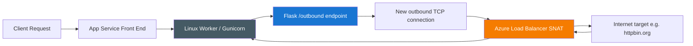
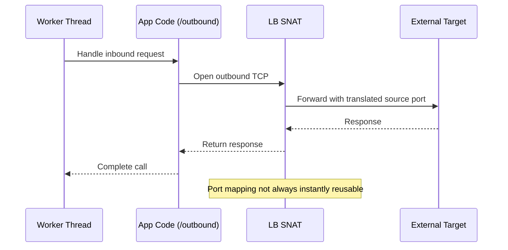
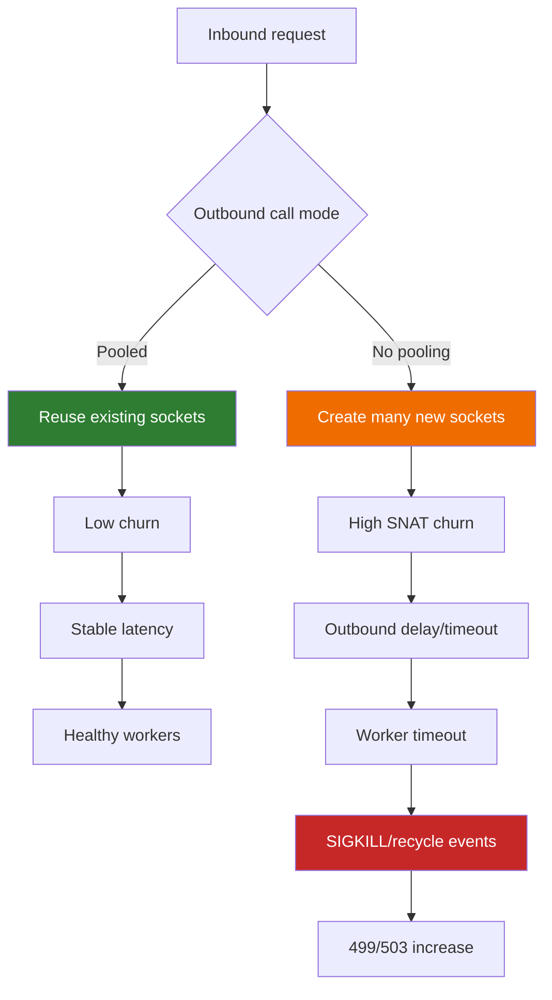

# Lab Guide (Level 3): SNAT Exhaustion on Azure App Service Linux

This lab is a full diagnostic reference for reproducing and proving outbound SNAT pressure on Azure App Service Linux using a Python/Flask workload. It expands the original scaffold into a complete investigation package with architecture background, falsifiable hypothesis, deterministic runbook, and artifact-backed experiment log.

---

## Lab Metadata

| Field | Value |
|---|---|
| Lab name | `snat-exhaustion` |
| Platform | Azure App Service (Linux) |
| Runtime | Python 3.11 + Gunicorn |
| App path | `labs/snat-exhaustion/app/app.py` |
| Trigger script | `labs/snat-exhaustion/trigger.sh` |
| Artifact root | `labs/snat-exhaustion/artifacts-sanitized/` |
| Focus | Outbound connection churn without pooling |
| Expected anti-pattern | New TCP connection per outbound call |
| Expected symptom family | 499/503, timeout bodies, worker churn, SIGKILL events |

!!! info "What this guide is"
    This is a troubleshooting **reference lab guide** intended for engineers who need repeatable, evidence-driven diagnosis. It is not a quickstart.

!!! warning "PII policy"
    All IDs in this guide are already sanitized. Keep all examples sanitized if you copy this structure for new investigations.

---

## 1) Background

SNAT exhaustion on App Service is rarely a single-event failure. It is usually a cascade:

1. App generates high outbound connection churn.
2. Platform SNAT mapping inventory gets stressed.
3. Pending outbound calls wait longer for usable translated ports.
4. Upstream call latency grows.
5. Worker threads block and queue expands.
6. Gunicorn workers timeout and get killed/recycled.
7. Inbound availability degrades (499/503/000 symptoms).

### 1.1 Outbound flow on App Service Linux

The following logical flow explains where SNAT sits in the path:



Key point: SNAT mapping happens on platform egress. Your code does not directly manage SNAT tables, but your connection behavior determines churn pressure.

### 1.2 Why per-request TCP creation is dangerous

In this lab app:

- `/outbound` uses `urllib.request` with `Connection: close`.
- Every outbound call tends to create a fresh TCP socket.
- Under concurrency, sockets accumulate in active and post-close states.

When requests finish, connections do not disappear immediately due to TCP lifecycle behavior (for example, `TIME_WAIT`). That lag means transient churn can still consume port inventory for a while.

### 1.3 SNAT port inventory and App Service guidance

Microsoft guidance for App Service outbound troubleshooting describes finite SNAT inventory and recommends connection reuse/pooling to avoid intermittent failures.

Operationally relevant concepts:

- Finite SNAT mappings per instance.
- Port reuse delay due to TCP lifecycle.
- Connection pooling reduces churn and improves stability.
- Symptom signatures: outbound timeout, connection refused, intermittent spikes.

### 1.4 Causal mechanics with TCP states



Under low traffic this is fine. Under burst concurrency with no pooling, the per-call setup/teardown overhead becomes dominant and error-prone.

### 1.5 Why this lab can also show worker SIGKILL

The lab does not claim SNAT directly kills a worker process. The chain is indirect:

- Outbound calls stall.
- Request handlers exceed worker timeout thresholds.
- Worker recycling/kill events increase.
- Platform and app become unstable.

This is a classic cascading failure pattern, where initial network pressure manifests as process churn.

### 1.6 Lab code paths relevant to diagnosis

| Endpoint | Purpose | Behavior |
|---|---|---|
| `/outbound` | Reproduce anti-pattern | no pooling, `Connection: close` |
| `/outbound-fixed` | Control path | `requests.Session()` + pooled adapter |
| `/diag/net` | Network diagnostics | sockstat, TCP line count, local port range |
| `/diag/stats` | Process counters | request counters + outbound counters |
| `/diag/env` | Runtime context | safe env projection |

### 1.7 Why this is not only an outbound problem

Outbound instability can surface as inbound errors:

- `499` in HTTP logs (client closed or downstream timeout path).
- `503` when process/service is degraded.
- `000` in synthetic probes (`curl` transport failure).

### 1.8 Diagram: healthy vs exhausted behavior



### 1.9 Baseline environment evidence (from artifacts)

Source files:

- `baseline/diag-net.json`
- `baseline/diag-stats.json`
- `baseline/diag-env.json`
- `baseline/app-config.json`
- `baseline/health.json`

Observed baseline values:

| Signal | Value |
|---|---|
| Health payload | `{"lab":"snat-exhaustion","status":"healthy"}` |
| Gunicorn startup command | `gunicorn --bind=0.0.0.0 --timeout=120 --workers=4 app:app` |
| `WEBSITES_PORT` | `8000` |
| `/proc/sys/net/ipv4/ip_local_port_range` | `32768-60999` |
| Baseline `connection_count` | `10` |
| Baseline sockstat TCP in-use | `5` |
| Baseline sockstat TCP `tw` | `4` |

---

## 2) Hypothesis

### 2.1 Statement (falsifiable)

**Hypothesis:**

When a Python/Flask app creates a new outbound TCP connection per request without connection pooling, SNAT ports exhaust within minutes under concurrent load, causing timeouts and SIGKILL'd workers.

### 2.2 Causal chain under test

```mermaid
flowchart LR
    A[No pooling in /outbound] --> B[High outbound socket churn]
    B --> C[SNAT mapping pressure]
    C --> D[Outbound timeout growth]
    D --> E[Gunicorn worker timeout]
    E --> F[Worker SIGKILL / recycle]
    F --> G[HTTP 499/503 and curl 000]

    style C fill:#ef6c00,color:#fff
    style E fill:#d84315,color:#fff
    style F fill:#b71c1c,color:#fff
```



### 2.3 Proof criteria

All of the following must be observed in the same trigger window:

1. **Transport failures appear under load**
   - `curl` results include `000` responses and long (~60s) waits.
2. **HTTP log degradation appears**
   - Large share of `499`/`503` with elevated `TimeTaken`.
3. **Application timeout signatures appear**
   - Body samples include timeout text (for example, `The read operation timed out`).
4. **Worker instability appears in console logs**
   - `WORKER TIMEOUT` and `SIGKILL` events recorded.
5. **Recovery indicator appears after pressure drops**
   - Diagnostic endpoints become reachable again and counters restart/new PID appears.

### 2.4 Disproof criteria

Any one of the following disconfirms this specific chain:

- High concurrency produces no transport failures and no elevated HTTP time.
- No worker timeout/SIGKILL events during failure period.
- Failures occur equally in pooled and non-pooled paths with equivalent concurrency.
- Artifact evidence shows stable outbound behavior and no timeout signatures.

### 2.5 Scope boundaries

This lab tests **application-driven outbound churn behavior**, not every possible outbound failure root cause.

Not in scope:

- Upstream service outage as primary fault.
- DNS-wide outage.
- VNet routing misconfiguration.
- TLS certificate trust misconfiguration.

### 2.6 Expected measurable variables

| Layer | Variable | Expected during failure |
|---|---|---|
| Trigger CSV | status code | many `000` |
| Trigger CSV | elapsed seconds | cluster near `60` |
| App response body | `sampleErrors` | timeout message present |
| HTTP logs | `ScStatus` | 499/503 rise |
| HTTP logs | `TimeTaken` | long-tail near timeout window |
| Console logs | Gunicorn events | `WORKER TIMEOUT`, `SIGKILL` |
| Diag endpoints | reachability | transient unreachability |

### 2.7 Competing explanations considered

| Alternative explanation | How assessed in this lab |
|---|---|
| App code crash unrelated to outbound | Console pattern shows repeated timeout->kill loop tied to pressure window |
| One-off platform restart | Repeated failure signals in multiple artifacts, not a single restart message |
| Pure client-side network issue | Server-side logs show timeout and worker churn signatures |

---

## 3) Runbook

This runbook is the repeatable execution path. Use long-form flags for Azure CLI commands.

### 3.1 Prerequisites

| Tool | Check command |
|---|---|
| Azure CLI | `az version` |
| Bash | `bash --version` |
| jq | `jq --version` |
| Authenticated session | `az account show` |

### 3.2 Variable setup

```bash
export RG="rg-lab-snat"
export LOCATION="koreacentral"
export TEMPLATE_FILE="labs/snat-exhaustion/main.bicep"
```

### 3.3 Deploy infrastructure

```bash
az group create --name "$RG" --location "$LOCATION"

az deployment group create \
  --resource-group "$RG" \
  --template-file "$TEMPLATE_FILE"
```

Capture app name:

```bash
export APP_NAME=$(az webapp list \
  --resource-group "$RG" \
  --query "[0].name" \
  --output tsv)

export APP_HOST=$(az webapp show \
  --resource-group "$RG" \
  --name "$APP_NAME" \
  --query "defaultHostName" \
  --output tsv)

export APP_URL="https://$APP_HOST"
```

### 3.4 Deploy lab app

```bash
az webapp deploy \
  --resource-group "$RG" \
  --name "$APP_NAME" \
  --src-path "labs/snat-exhaustion/app" \
  --type zip \
  --restart true
```

### 3.5 Baseline checks

```bash
curl --silent --show-error "$APP_URL/health"
curl --silent --show-error "$APP_URL/diag/env"
curl --silent --show-error "$APP_URL/diag/net"
curl --silent --show-error "$APP_URL/diag/stats"
```

Expected baseline shape:

- Health returns `status=healthy`.
- `WEBSITES_PORT` and/or `PORT` indicate container listener context.
- `/diag/net` returns low TCP pressure.

### 3.6 Trigger failure mode

```bash
bash "labs/snat-exhaustion/trigger.sh" "$APP_URL"
```

Trigger behavior from script:

- Sends 200 `/outbound?calls=40` requests.
- Runs concurrent batches (capped job count).
- Summarizes transport (`000`) and HTTP (`5xx`) failures.

### 3.7 Optional control check (pooled endpoint)

Run a smaller controlled load against pooled mode:

```bash
for request_number in $(seq 1 40); do
  curl \
    --silent \
    --show-error \
    --output /dev/null \
    --write-out "%{http_code}\n" \
    "$APP_URL/outbound-fixed?calls=40"
done
```

### 3.8 Collect platform diagnostics

#### HTTP signal query

```kusto
AppServiceHTTPLogs
| where TimeGenerated > ago(2h)
| where CsHost has "azurewebsites"
| where CsUriStem in ("/outbound", "/outbound-fixed", "/diag/net", "/health")
| project TimeGenerated, CsUriStem, ScStatus, TimeTaken, CsHost
| order by TimeGenerated desc
```

#### Console signal query

```kusto
AppServiceConsoleLogs
| where TimeGenerated > ago(2h)
| where ResultDescription has_any (
    "WORKER TIMEOUT",
    "SIGKILL",
    "timed out",
    "connection refused",
    "Cannot assign requested address",
    "EADDRNOTAVAIL"
)
| project TimeGenerated, ResultDescription
| order by TimeGenerated desc
```

#### Platform signal query

```kusto
AppServicePlatformLogs
| where TimeGenerated > ago(2h)
| where Message has_any (
    "warmup",
    "Container",
    "startup",
    "timeout"
)
| project TimeGenerated, Level, Message
| order by TimeGenerated desc
```

### 3.9 Azure CLI-based KQL execution (optional automation)

```bash
export WORKSPACE_ID="<log-analytics-workspace-id>"

az monitor log-analytics query \
  --workspace "$WORKSPACE_ID" \
  --analytics-query "AppServiceHTTPLogs | where TimeGenerated > ago(2h) | where CsUriStem in ('/outbound','/outbound-fixed','/diag/net') | project TimeGenerated, CsUriStem, ScStatus, TimeTaken | order by TimeGenerated desc" \
  --output json
```

### 3.10 Validate recovery state

```bash
curl --silent --show-error "$APP_URL/diag/net"
curl --silent --show-error "$APP_URL/diag/stats"
curl --silent --show-error "$APP_URL/health"
```

If reachable and stable after pressure window, recovery evidence is present.

### 3.11 Cleanup

```bash
az group delete --name "$RG" --yes --no-wait
```

---

## 4) Experiment Log (Artifact-backed)

This section is derived from actual sanitized lab artifacts:

`/root/Github/azure-appservice/labs/snat-exhaustion/artifacts-sanitized/`

### 4.1 Artifact inventory used

| Category | File |
|---|---|
| Baseline | `baseline/diag-stats.json` |
| Baseline | `baseline/diag-net.json` |
| Baseline | `baseline/diag-env.json` |
| Baseline | `baseline/app-config.json` |
| Baseline | `baseline/health.json` |
| Trigger | `trigger/outbound-targeted-20260404T055433Z.csv` |
| Trigger | `trigger/error-body-*_body-20260404T055433Z.txt` |
| Trigger | `trigger/diag-net-before-20260404T053447Z.json` |
| Trigger | `trigger/diag-net-posttrigger-20260404T054508Z.json` |
| Trigger | `trigger/diag-net-recovered-20260404T055433Z.json` |
| Trigger | `trigger/kql-http-20260404T060610Z.json` |
| Trigger | `trigger/kql-console-20260404T060610Z.json` |
| Trigger | `trigger/kql-platform-20260404T060610Z.json` |

### 4.2 Baseline snapshot

#### 4.2.1 `/diag/stats` baseline

Raw signal:

```json
{"endpoint_counters":{"diag_stats":1},"outbound_call_counters":{"with-pooling":{"failures":0,"successes":0},"without-pooling":{"failures":0,"successes":0}},"pid":1907,"process_start_time":"2026-04-04T05:05:40.566103+00:00","request_count":1,"uptime_seconds":1642.522}
```

Interpretation:

- Process was long-lived before trigger.
- No outbound failures accumulated yet.

#### 4.2.2 `/diag/net` baseline

Raw signal:

```json
{"connection_count":10,"ip_local_port_range":{"end":"60999","start":"32768"},"sockstat":{"sockets":{"used":"10"},"tcp":{"alloc":"196","inuse":"5","mem":"18","orphan":"1","tw":"4"},"udp":{"inuse":"1","mem":"0"}}}
```

Interpretation:

- Low active pressure.
- Existing `tw=4` confirms normal TCP post-close behavior.

### 4.3 Trigger output summary (targeted CSV)

Source: `trigger/outbound-targeted-20260404T055433Z.csv`

Derived summary:

| Metric | Value |
|---|---|
| Total requests | 30 |
| Transport failures (`000`) | 22 |
| HTTP 200 | 8 |
| Requests at ~60s | 22 |
| Fastest successful request | `31.967409s` |
| Slowest successful request | `57.227848s` |
| Avg successful request time | `44.16s` |

Selected rows:

| Row | Status | Elapsed (s) |
|---:|---:|---:|
| 1 | 000 | 60.0002131 |
| 2 | 200 | 36.500380 |
| 3 | 200 | 53.071651 |
| 5 | 000 | 60.0000175 |
| 9 | 000 | 59.9991789 |
| 14 | 200 | 32.898595 |
| 20 | 000 | 60.0002442 |
| 30 | 000 | 60.0002993 |

### 4.4 Error-body sample evidence

Sources:

- `error-body-2_body-20260404T055433Z.txt`
- `error-body-3_body-20260404T055433Z.txt`
- `error-body-10_body-20260404T055433Z.txt`
- `error-body-11_body-20260404T055433Z.txt`
- `error-body-14_body-20260404T055433Z.txt`

Aggregated findings:

| Metric | Value |
|---|---|
| Sample files analyzed | 5 |
| Files containing failures | 1 |
| Aggregate failures | 1 |
| Timeout text observed | `The read operation timed out` |

Representative payload with failure:

```json
{"calls":20,"elapsedMs":35774,"failures":1,"mode":"without-pooling","sampleErrors":["The read operation timed out"],"successes":19,"target":"https://httpbin.org/get"}
```

### 4.5 Diag endpoint reachability during pressure

| Checkpoint | Artifact | Observed |
|---|---|---|
| Pre-trigger | `diag-net-before-20260404T053447Z.json` | normal JSON (`connection_count=6`, `tw=0`) |
| During/after pressure | `diag-net-posttrigger-20260404T054508Z.json` | `504.0 GatewayTimeout` |
| Recovered | `diag-net-recovered-20260404T055433Z.json` | normal JSON (`connection_count=7`, `tw=1`) |

This confirms transient unreachability during the failure window.

### 4.6 HTTP KQL analysis

Source: `kql-http-20260404T060610Z.json`

Dataset size:

- Total rows: **195**

Status distribution:

| Status | Count |
|---:|---:|
| 200 | 47 |
| 202 | 2 |
| 499 | 129 |
| 503 | 17 |

Endpoint-focused findings:

| Metric | Value |
|---|---|
| `/outbound` total rows | 138 |
| `/outbound` with 499 | 122 |
| `/outbound` with 200 | 16 |
| Rows with `TimeTaken >= 59000ms` | 123 |
| `/outbound` rows with `499` and `TimeTaken >= 59000ms` | 118 |

Interpretation:

- HTTP telemetry matches timeout-dominated failure shape.
- The near-60s cluster strongly aligns with outbound wait/timeout behavior.

### 4.7 Console KQL analysis

Source: `kql-console-20260404T060610Z.json`

Dataset size and window:

| Metric | Value |
|---|---|
| Total rows | 500 |
| First row timestamp (oldest) | `2026-04-04T05:40:02.5061808Z` |
| Last row timestamp (newest) | `2026-04-04T05:59:43.0881145Z` |

Pattern counts:

| Signature | Count |
|---|---:|
| `WORKER TIMEOUT` | 18 |
| `SIGKILL` | 14 |

Representative lines:

```text
[2026-04-04 05:59:42 +0000] [1904] [CRITICAL] WORKER TIMEOUT (pid:1908)
[2026-04-04 05:59:43 +0000] [1904] [ERROR] Worker (pid:1908) was sent SIGKILL! Perhaps out of memory?
[2026-04-04 05:58:45 +0000] [1904] [CRITICAL] WORKER TIMEOUT (pid:1905)
[2026-04-04 05:58:46 +0000] [1904] [ERROR] Worker (pid:1905) was sent SIGKILL! Perhaps out of memory?
```

Interpretation:

- Strong process churn coincides with high outbound timeout phase.
- This supports cascading instability, not isolated request errors.

### 4.8 Platform KQL analysis

Source: `kql-platform-20260404T060610Z.json`

Rows sampled: **200**

Dominant content:

- Container lifecycle messages.
- Startup/warmup informational traces.
- No contradictory signal that would independently explain the timeout burst.

### 4.9 PID rollover evidence

Compare baseline vs recovered diagnostics:

| Snapshot | PID | Process start time |
|---|---:|---|
| Baseline `diag-stats.json` | 1907 | `2026-04-04T05:05:40.566103+00:00` |
| Recovered `diag-stats-recovered...json` | 1908 | `2026-04-04T05:52:07.242253+00:00` |

This indicates process turnover occurred during the trigger window.

### 4.10 Failure cascade timeline (reconstructed)

```mermaid
timeline
    title SNAT Lab Failure Cascade (artifact reconstruction)
    05:40:02 : Console window starts
    05:52:07 : New worker generation visible
    05:54-05:56 : Trigger pressure period
    05:56:00-05:57:26 : HTTP 499 near 59-60s dominates
    05:58-05:59 : Repeated WORKER TIMEOUT and SIGKILL events
    05:55+ : /diag endpoints eventually recover
```

### 4.11 Hypothesis verdict

| Criterion | Result | Evidence |
|---|---|---|
| Transport failures under load | ✅ Met | 22/30 probe rows = `000` |
| HTTP degradation with long times | ✅ Met | 129×499, 17×503, long `TimeTaken` cluster |
| Timeout body evidence | ✅ Met | `The read operation timed out` in sample |
| Worker churn evidence | ✅ Met | 18 `WORKER TIMEOUT`, 14 `SIGKILL` |
| Recovery after pressure | ✅ Met | `diag-net` recovers from `504` to JSON |

**Final verdict: Hypothesis supported by artifacts.**

### 4.12 Practical mitigation mapping

| Symptom | Mitigation |
|---|---|
| High churn outbound | Reuse sessions/connection pools |
| Timeout bursts | Reduce per-request outbound fan-out |
| Worker timeout/SIGKILL loops | Increase resiliency + reduce blocked call time |
| Recurrence under load | Scale out and validate outbound dependency behavior |

### 4.13 Recommended follow-up experiment

To make this lab even stronger, add a matched run against `/outbound-fixed` with the same trigger shape and log both runs side-by-side.

Suggested comparison table:

| Metric | No pooling | With pooling |
|---|---:|---:|
| curl `000` ratio | expected high | expected low |
| 499 count | expected high | expected low |
| Worker timeout events | expected present | expected rare/none |

---

## References

- [Troubleshoot intermittent outbound connection errors in Azure App Service](https://learn.microsoft.com/en-us/azure/app-service/troubleshoot-intermittent-outbound-connection-errors)
- [Azure Load Balancer outbound connections](https://learn.microsoft.com/en-us/azure/load-balancer/load-balancer-outbound-connections)
- [Configure a custom container for Azure App Service](https://learn.microsoft.com/en-us/azure/app-service/configure-custom-container)
- [Enable diagnostic logging for apps in Azure App Service](https://learn.microsoft.com/en-us/azure/app-service/troubleshoot-diagnostic-logs)
- [App Service diagnostics overview](https://learn.microsoft.com/en-us/azure/app-service/overview-diagnostics)

## See Also

- [SNAT or Application Issue? (Playbook)](../playbooks/outbound-network/snat-or-application-issue.md)
- [First 10 Minutes: App Service Linux Troubleshooting](../first-10-minutes.md)
