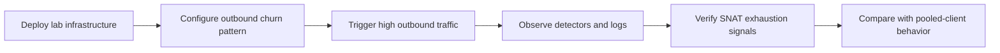

# Lab: SNAT Exhaustion on Azure App Service Linux

Reproduce SNAT exhaustion symptoms by deploying a Python/Flask app that creates high outbound connection churn without pooling, then compare behavior with a pooled-client endpoint.



## Objective

Deploy and stress a Linux App Service workload so you can observe timeout/refused outbound failures, latency spikes, and error patterns that align with SNAT pressure.

## Prerequisites

- Azure subscription
- Azure CLI installed and logged in
- Bash shell

## Deploy

```bash
# Create resource group
az group create --name rg-lab-snat --location koreacentral

# Deploy lab infrastructure
APP_NAME=$(az deployment group create \
  --resource-group rg-lab-snat \
  --template-file lab-guides/snat-exhaustion/main.bicep \
  --query "properties.outputs.webAppName.value" \
  --output tsv)

# Deploy the Flask lab app
az webapp deploy \
  --resource-group rg-lab-snat \
  --name "$APP_NAME" \
  --src-path lab-guides/snat-exhaustion/app

# Get app URL
APP_URL=$(az webapp show \
  --resource-group rg-lab-snat \
  --name "$APP_NAME" \
  --query "defaultHostName" \
  --output tsv)
```

## Trigger

```bash
bash lab-guides/snat-exhaustion/trigger.sh "https://$APP_URL"
```

## Observe

1. Open Azure Portal → App Service → Diagnose and Solve Problems.
2. Open **SNAT Port Exhaustion** and **TCP Connections** detectors.
3. Query Log Analytics:

```kusto
AppServiceHTTPLogs
| where TimeGenerated > ago(1h)
| where CsUriStem in ("/outbound", "/outbound-fixed")
| summarize Requests=count(), Failures=countif(ScStatus >= 500), P95TimeTaken=percentile(TimeTaken, 95) by bin(TimeGenerated, 5m), CsUriStem, SPort
| order by TimeGenerated desc
```

```kusto
AppServiceConsoleLogs
| where TimeGenerated > ago(1h)
| where ResultDescription has_any ("SNAT", "timeout", "timed out", "connection refused", "Cannot assign requested address", "EADDRNOTAVAIL")
| project TimeGenerated, Host, ContainerId, ResultDescription
| order by TimeGenerated desc
```

```bash
bash lab-guides/snat-exhaustion/verify.sh rg-lab-snat
```

## Expected Signals

- Increasing timeout/refused errors during heavy `/outbound` traffic
- Higher `TimeTaken` and/or 5xx in `AppServiceHTTPLogs` for `/outbound`
- Console log signatures containing timeout/refused/SNAT indicators
- Better behavior for `/outbound-fixed` due to connection reuse

## Clean Up

```bash
az group delete --name rg-lab-snat --yes --no-wait
```

## Related Playbook

- [SNAT or Application Issue? (Azure App Service Linux)](../playbooks/outbound-network/snat-or-application-issue.md)

## References

- [Troubleshoot outbound connection errors in Azure App Service](https://learn.microsoft.com/en-us/azure/app-service/troubleshoot-intermittent-outbound-connection-errors)
- [Azure Load Balancer outbound connections](https://learn.microsoft.com/en-us/azure/load-balancer/load-balancer-outbound-connections)
- [Quickstart: Create Bicep files with Visual Studio Code](https://learn.microsoft.com/en-us/azure/azure-resource-manager/bicep/quickstart-create-bicep-use-visual-studio-code)
- [Enable diagnostic logging for apps in Azure App Service](https://learn.microsoft.com/en-us/azure/app-service/troubleshoot-diagnostic-logs)
