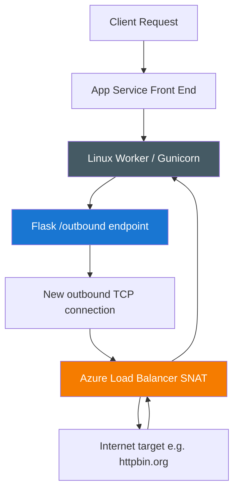
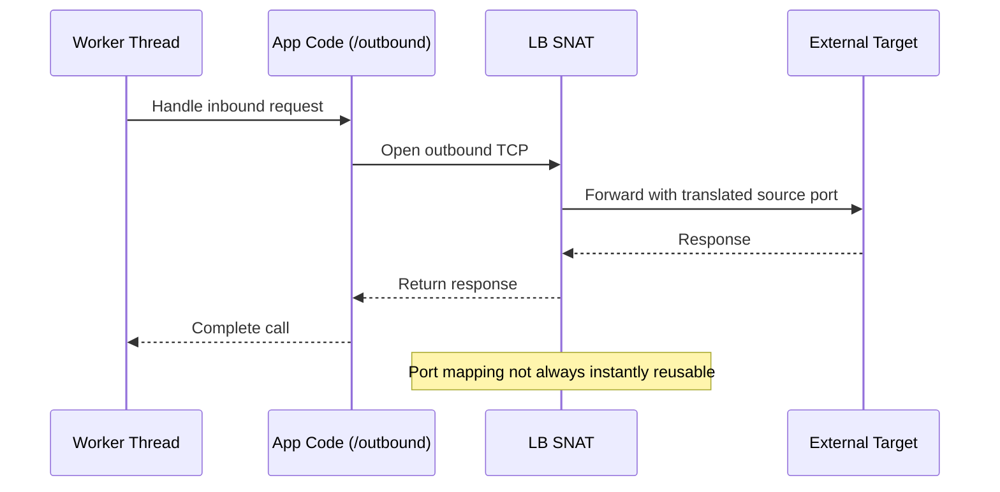
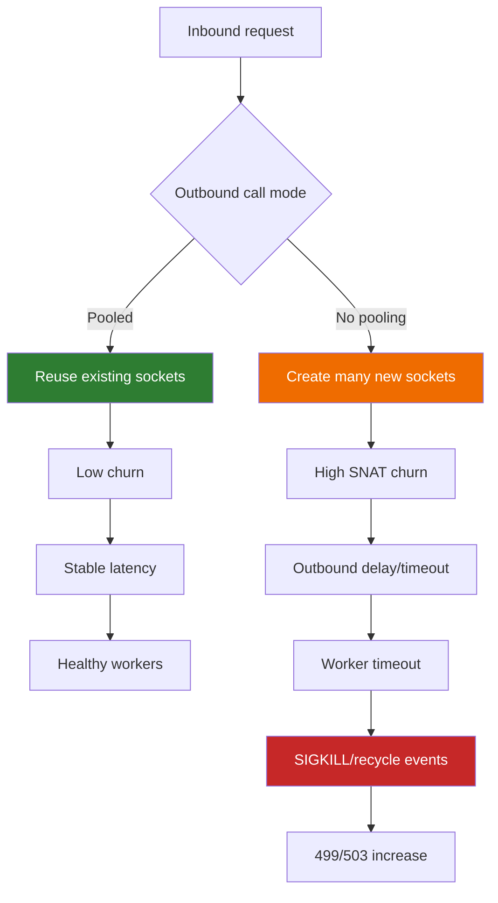
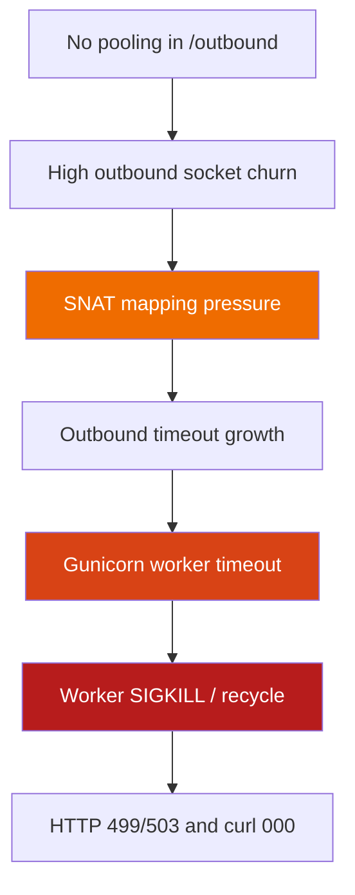
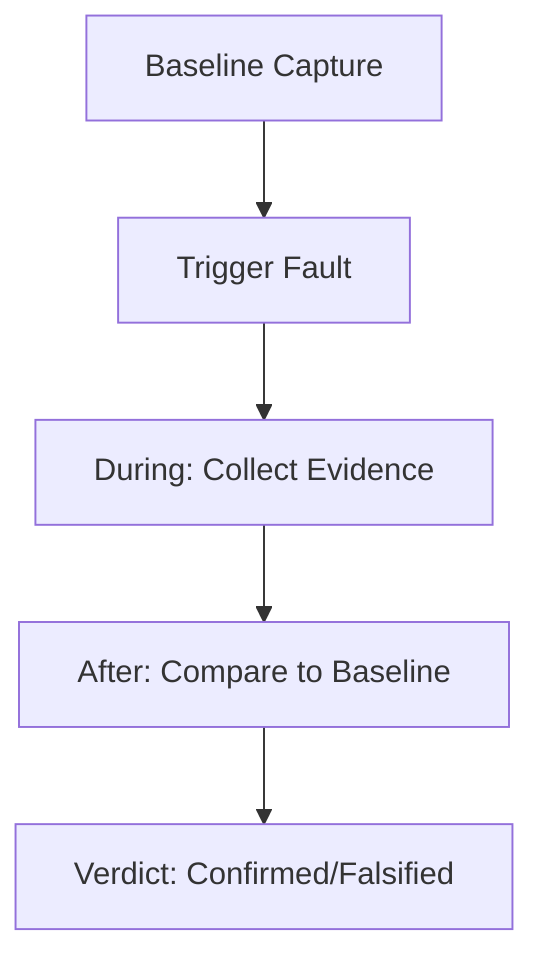

---
content_sources:
  diagrams:
    - id: troubleshooting-lab-guides-snat-exhaustion-diagram-1
      type: flowchart
      source: self-generated
      justification: "Self-generated troubleshooting diagram synthesized from Microsoft Learn diagnostics and Azure App Service incident guidance for this guide."
      based_on:
        - https://learn.microsoft.com/en-us/azure/app-service/troubleshoot-diagnostic-logs
        - https://learn.microsoft.com/en-us/azure/app-service/troubleshoot-http-502-http-503
    - id: troubleshooting-lab-guides-snat-exhaustion-diagram-2
      type: sequenceDiagram
      source: self-generated
      justification: "Self-generated troubleshooting diagram synthesized from Microsoft Learn diagnostics and Azure App Service incident guidance for this guide."
      based_on:
        - https://learn.microsoft.com/en-us/azure/app-service/troubleshoot-diagnostic-logs
        - https://learn.microsoft.com/en-us/azure/app-service/troubleshoot-http-502-http-503
    - id: troubleshooting-lab-guides-snat-exhaustion-diagram-3
      type: flowchart
      source: self-generated
      justification: "Self-generated troubleshooting diagram synthesized from Microsoft Learn diagnostics and Azure App Service incident guidance for this guide."
      based_on:
        - https://learn.microsoft.com/en-us/azure/app-service/troubleshoot-diagnostic-logs
        - https://learn.microsoft.com/en-us/azure/app-service/troubleshoot-http-502-http-503
    - id: troubleshooting-lab-guides-snat-exhaustion-diagram-4
      type: flowchart
      source: self-generated
      justification: "Self-generated troubleshooting diagram synthesized from Microsoft Learn diagnostics and Azure App Service incident guidance for this guide."
      based_on:
        - https://learn.microsoft.com/en-us/azure/app-service/troubleshoot-diagnostic-logs
        - https://learn.microsoft.com/en-us/azure/app-service/troubleshoot-http-502-http-503
    - id: troubleshooting-lab-guides-snat-exhaustion-diagram-5
      type: timeline
      source: self-generated
      justification: "Self-generated troubleshooting diagram synthesized from Microsoft Learn diagnostics and Azure App Service incident guidance for this guide."
      based_on:
        - https://learn.microsoft.com/en-us/azure/app-service/troubleshoot-diagnostic-logs
        - https://learn.microsoft.com/en-us/azure/app-service/troubleshoot-http-502-http-503
    - id: troubleshooting-lab-guides-snat-exhaustion-diagram-6
      type: graph
      source: self-generated
      justification: "Self-generated troubleshooting diagram synthesized from Microsoft Learn diagnostics and Azure App Service incident guidance for this guide."
      based_on:
        - https://learn.microsoft.com/en-us/azure/app-service/troubleshoot-diagnostic-logs
        - https://learn.microsoft.com/en-us/azure/app-service/troubleshoot-http-502-http-503
---
# Lab Guide (Level 3): SNAT Exhaustion on Azure App Service Linux

This lab is a full diagnostic reference for reproducing and proving outbound SNAT pressure on Azure App Service Linux using a Python/Flask workload. It expands the original scaffold into a complete investigation package with architecture background, falsifiable hypothesis, deterministic runbook, and artifact-backed experiment log.

---

## Lab Metadata

| Attribute | Value |
|---|---|
| Difficulty | Advanced |
| Estimated Duration | 60-75 minutes |
| Tier | Basic |
| Failure Mode | Outbound connection churn without pooling drives SNAT pressure, timeouts, and worker instability |
| Skills Practiced | Outbound dependency troubleshooting, SNAT-pressure analysis, network diagnostics, HTTP and console log correlation |

!!! info "What this guide is"
    This is a troubleshooting **reference lab guide** intended for engineers who need repeatable, evidence-driven diagnosis. It is not a quickstart.

!!! warning "PII policy"
    All IDs in this guide are already sanitized. Keep all examples sanitized if you copy this structure for new investigations.

---

## 1) Background

SNAT exhaustion on App Service is rarely a single-event failure. It is usually a cascade:

1. App generates high outbound connection churn.
2. Platform SNAT mapping inventory gets stressed.
3. Pending outbound calls wait longer for usable translated ports.
4. Upstream call latency grows.
5. Worker threads block and queue expands.
6. Gunicorn workers timeout and get killed/recycled.
7. Inbound availability degrades (499/503/000 symptoms).

### 1.1 Outbound flow on App Service Linux

The following logical flow explains where SNAT sits in the path:

<!-- diagram-id: troubleshooting-lab-guides-snat-exhaustion-diagram-1 -->

```mermaid
flowchart TD
    A[Client Request] --> B[App Service Front End]
    B --> C[Linux Worker / Gunicorn]
    C --> D[Flask /outbound endpoint]
    D --> E[New outbound TCP connection]
    E --> F[Azure Load Balancer SNAT]
    F --> G[Internet target e.g. httpbin.org]
    G --> F
    F --> C

    style F fill:#f57c00,color:#fff
    style D fill:#1976d2,color:#fff
    style C fill:#455a64,color:#fff
```

Key point: SNAT mapping happens on platform egress. Your code does not directly manage SNAT tables, but your connection behavior determines churn pressure.

### 1.2 Why per-request TCP creation is dangerous

In this lab app:

- `/outbound` uses `urllib.request` with `Connection: close`.
- Every outbound call tends to create a fresh TCP socket.
- Under concurrency, sockets accumulate in active and post-close states.

When requests finish, connections do not disappear immediately due to TCP lifecycle behavior (for example, `TIME_WAIT`). That lag means transient churn can still consume port inventory for a while.

### 1.3 SNAT port inventory and App Service guidance

Microsoft guidance for App Service outbound troubleshooting describes finite SNAT inventory and recommends connection reuse/pooling to avoid intermittent failures.

Operationally relevant concepts:

- Finite SNAT mappings per instance.
- Port reuse delay due to TCP lifecycle.
- Connection pooling reduces churn and improves stability.
- Symptom signatures: outbound timeout, connection refused, intermittent spikes.

### 1.4 Causal mechanics with TCP states

<!-- diagram-id: troubleshooting-lab-guides-snat-exhaustion-diagram-2 -->

```mermaid
sequenceDiagram
    participant W as Worker Thread
    participant A as App Code (/outbound)
    participant L as LB SNAT
    participant T as External Target

    W->>A: Handle inbound request
    A->>L: Open outbound TCP
    L->>T: Forward with translated source port
    T-->>L: Response
    L-->>A: Return response
    A-->>W: Complete call
    Note over L: Port mapping not always instantly reusable
```

Under low traffic this is fine. Under burst concurrency with no pooling, the per-call setup/teardown overhead becomes dominant and error-prone.

### 1.5 Why this lab can also show worker SIGKILL

The lab does not claim SNAT directly kills a worker process. The chain is indirect:

- Outbound calls stall.
- Request handlers exceed worker timeout thresholds.
- Worker recycling/kill events increase.
- Platform and app become unstable.

This is a classic cascading failure pattern, where initial network pressure manifests as process churn.

### 1.6 Lab code paths relevant to diagnosis

| Endpoint | Purpose | Behavior |
|---|---|---|
| `/outbound` | Reproduce anti-pattern | no pooling, `Connection: close` |
| `/outbound-fixed` | Control path | `requests.Session()` + pooled adapter |
| `/diag/net` | Network diagnostics | sockstat, TCP line count, local port range |
| `/diag/stats` | Process counters | request counters + outbound counters |
| `/diag/env` | Runtime context | safe env projection |

### 1.7 Why this is not only an outbound problem

Outbound instability can surface as inbound errors:

- `499` in HTTP logs (client closed or downstream timeout path).
- `503` when process/service is degraded.
- `000` in synthetic probes (`curl` transport failure).

### 1.8 Diagram: healthy vs exhausted behavior

<!-- diagram-id: troubleshooting-lab-guides-snat-exhaustion-diagram-3 -->

```mermaid
flowchart TD
    A[Inbound request] --> B{Outbound call mode}
    B -->|Pooled| C[Reuse existing sockets]
    C --> D[Low churn]
    D --> E[Stable latency]
    E --> F[Healthy workers]

    B -->|No pooling| G[Create many new sockets]
    G --> H[High SNAT churn]
    H --> I[Outbound delay/timeout]
    I --> J[Worker timeout]
    J --> K[SIGKILL/recycle events]
    K --> L[499/503 increase]

    style C fill:#2e7d32,color:#fff
    style G fill:#ef6c00,color:#fff
    style K fill:#c62828,color:#fff
```

### 1.9 Baseline environment evidence (from artifacts)

Source files:

- `baseline/diag-net.json`
- `baseline/diag-stats.json`
- `baseline/diag-env.json`
- `baseline/app-config.json`
- `baseline/health.json`

Observed baseline values:

| Signal | Value |
|---|---|
| Health payload | `{"lab":"snat-exhaustion","status":"healthy"}` |
| Gunicorn startup command | `gunicorn --bind=0.0.0.0 --timeout=120 --workers=4 app:app` |
| `WEBSITES_PORT` | `8000` |
| `/proc/sys/net/ipv4/ip_local_port_range` | `32768-60999` |
| Baseline `connection_count` | `10` |
| Baseline sockstat TCP in-use | `5` |
| Baseline sockstat TCP `tw` | `4` |

---

## 2) Hypothesis

### 2.1 Statement (falsifiable)

**Hypothesis:**

When a Python/Flask app creates a new outbound TCP connection per request without connection pooling, SNAT ports exhaust within minutes under concurrent load, causing timeouts and SIGKILL'd workers.

### 2.2 Causal chain under test

<!-- diagram-id: troubleshooting-lab-guides-snat-exhaustion-diagram-4 -->

```mermaid
flowchart TD
    A[No pooling in /outbound] --> B[High outbound socket churn]
    B --> C[SNAT mapping pressure]
    C --> D[Outbound timeout growth]
    D --> E[Gunicorn worker timeout]
    E --> F[Worker SIGKILL / recycle]
    F --> G[HTTP 499/503 and curl 000]

    style C fill:#ef6c00,color:#fff
    style E fill:#d84315,color:#fff
    style F fill:#b71c1c,color:#fff
```

### 2.3 Proof criteria

All of the following must be observed in the same trigger window:

1. **Transport failures appear under load**
    - `curl` results include `000` responses and long (~60s) waits.
2. **HTTP log degradation appears**
    - Large share of `499`/`503` with elevated `TimeTaken`.
3. **Application timeout signatures appear**
    - Body samples include timeout text (for example, `The read operation timed out`).
4. **Worker instability appears in console logs**
    - `WORKER TIMEOUT` and `SIGKILL` events recorded.
5. **Recovery indicator appears after pressure drops**
    - Diagnostic endpoints become reachable again and counters restart/new PID appears.

### 2.4 Disproof criteria

Any one of the following disconfirms this specific chain:

- High concurrency produces no transport failures and no elevated HTTP time.
- No worker timeout/SIGKILL events during failure period.
- Failures occur equally in pooled and non-pooled paths with equivalent concurrency.
- Artifact evidence shows stable outbound behavior and no timeout signatures.

### 2.5 Scope boundaries

This lab tests **application-driven outbound churn behavior**, not every possible outbound failure root cause.

Not in scope:

- Upstream service outage as primary fault.
- DNS-wide outage.
- VNet routing misconfiguration.
- TLS certificate trust misconfiguration.

### 2.6 Expected measurable variables

| Layer | Variable | Expected during failure |
|---|---|---|
| Trigger CSV | status code | many `000` |
| Trigger CSV | elapsed seconds | cluster near `60` |
| App response body | `sampleErrors` | timeout message present |
| HTTP logs | `ScStatus` | 499/503 rise |
| HTTP logs | `TimeTaken` | long-tail near timeout window |
| Console logs | Gunicorn events | `WORKER TIMEOUT`, `SIGKILL` |
| Diag endpoints | reachability | transient unreachability |

### 2.7 Competing explanations considered

| Alternative explanation | How assessed in this lab |
|---|---|
| App code crash unrelated to outbound | Console pattern shows repeated timeout->kill loop tied to pressure window |
| One-off platform restart | Repeated failure signals in multiple artifacts, not a single restart message |
| Pure client-side network issue | Server-side logs show timeout and worker churn signatures |

---

## 3) Runbook

This runbook is the repeatable execution path. Use long-form flags for Azure CLI commands.

### 3.1 Prerequisites

| Tool | Check command |
|---|---|
| Azure CLI | `az version` |
| Bash | `bash --version` |
| jq | `jq --version` |
| Authenticated session | `az account show` |

### 3.2 Variable setup

```bash
export RG="rg-lab-snat"
export LOCATION="koreacentral"
export TEMPLATE_FILE="labs/snat-exhaustion/main.bicep"
```

### 3.3 Deploy infrastructure

```bash
az group create --name "$RG" --location "$LOCATION"

az deployment group create \
  --resource-group "$RG" \
  --template-file "$TEMPLATE_FILE"
```

| Command/Flag | Purpose |
|---|---|
| `az group create` | Create a resource group to contain all lab resources |
| `--name` | Resource group name |
| `--location` | Azure region for the resource group |
| `az deployment group create` | Deploy Azure resources from a Bicep template |
| `--resource-group` | Target resource group for the deployment |
| `--template-file` | Path to the Bicep template defining lab infrastructure (App Service, Log Analytics, diagnostics) |

Capture app name:

```bash
export APP_NAME=$(az webapp list \
  --resource-group "$RG" \
  --query "[0].name" \
  --output tsv)

export APP_HOST=$(az webapp show \
  --resource-group "$RG" \
  --name "$APP_NAME" \
  --query "defaultHostName" \
  --output tsv)

export APP_URL="https://$APP_HOST"
```

| Command | Purpose |
|---------|---------|
| `az webapp list --resource-group "$RG" --query "[0].name" --output tsv` | Lists web apps in the lab resource group and returns the first app name. |
| `--resource-group "$RG" --query "[0].name" --output tsv` | Limits the app list to this resource group. |
| `--query "[0].name" --output tsv` | Selects the `name` field from the first item in the returned web-app array. |
| `--output tsv` | Returns the app name as plain text for shell variable assignment. |
| `az webapp show --resource-group "$RG" --name "$APP_NAME" --query "defaultHostName" --output tsv` | Retrieves the app's default hostname so the runbook can build the public URL. |
| `--resource-group "$RG" --name "$APP_NAME" --query "defaultHostName" --output tsv` | Looks up the app in this resource group. |
| `--name "$APP_NAME" --query "defaultHostName" --output tsv` | Targets this web app. |
| `--query "defaultHostName" --output tsv` | Projects only the app's `defaultHostName` field. |
| `--output tsv` | Returns the hostname as plain text for shell variable assignment. |

### 3.4 Deploy lab app

```bash
az webapp deploy \
  --resource-group "$RG" \
  --name "$APP_NAME" \
  --src-path "labs/snat-exhaustion/app" \
  --type zip \
  --restart true
```

| Command/Flag | Purpose |
|---|---|
| `az webapp deploy` | Deploy application code to an App Service web app |
| `--resource-group` | Resource group containing the web app |
| `--name` | Web app name |
| `--src-path` | Path to the application source directory to deploy |
| `--type zip` | Deploy as a ZIP package |
| `--restart true` | Restart the app after deployment to load new code |

### 3.5 Baseline checks

```bash
curl --silent --show-error "$APP_URL/health"
curl --silent --show-error "$APP_URL/diag/env"
curl --silent --show-error "$APP_URL/diag/net"
curl --silent --show-error "$APP_URL/diag/stats"
```

Expected baseline shape:

- Health returns `status=healthy`.
- `WEBSITES_PORT` and/or `PORT` indicate container listener context.
- `/diag/net` returns low TCP pressure.

### 3.6 Trigger failure mode

```bash
bash "labs/snat-exhaustion/trigger.sh" "$APP_URL"
```

Trigger behavior from script:

- Sends 200 `/outbound?calls=40` requests.
- Runs concurrent batches (capped job count).
- Summarizes transport (`000`) and HTTP (`5xx`) failures.

### 3.7 Optional control check (pooled endpoint)

Run a smaller controlled load against pooled mode:

```bash
for request_number in $(seq 1 40); do
  curl \
    --silent \
    --show-error \
    --output /dev/null \
    --write-out "%{http_code}\n" \
    "$APP_URL/outbound-fixed?calls=40"
done
```

### 3.8 Collect platform diagnostics

#### Portal view: Diagnose and solve (network and SNAT detector hub)

[[[ shot("troubleshooting--log-analytics--10-snat-outbound-tail-latency-kql") ]]]

**Purpose**: Provide an independent Portal-side execution of a top-10 `TimeTaken` query on `/outbound` so a reviewer can identify the exact ceiling that clamps the tail rather than just the ~60-second lower bound recorded in §4.6. Where §4.6 tells you 118 `/outbound` requests exceeded 59 s, this query tells you the ceiling is extremely tight at ~240 s — a diagnostic signature of a hard proxy-level timeout, not variable-latency degradation.

**Look for**:

- Blade heading reads "log-labsnat-6kr7mkxulwioo | Logs" and the sub-heading reads "Log Analytics workspace" — confirms the query ran against the same workspace as §4.6.1 and matches the workspace referenced by the sanitized JSON exports in §4.1.
- The KQL editor shows exactly the query `AppServiceHTTPLogs | where TimeGenerated > ago(2h) | where CsUriStem == '/outbound' | project TimeGenerated, CsUriStem, ScStatus, TimeTaken | order by TimeTaken desc | take 10` — `project` limits the returned columns to the four needed for latency analysis, keeping the payload small and the query fast.
- The Results grid shows exactly 10 rows (pagination "1 - 10 of 10") and every row's `CsUriStem` column reads `/outbound` and every row's `ScStatus` column reads `499` — no `/outbound` request in the top-10 latency slice succeeded with 200 or platform-errored with 502. This confirms the failure signature at the extreme tail is uniformly client-abort/proxy-abort (499), not a mix of statuses.
- `TimeTaken` values cluster extremely tightly at 240,015-240,036 ms (a 21 ms spread across all 10 rows) — this is the signature of a hard outer request-lifetime ceiling, not variable-latency degradation where you would expect a wider spread. The closest documented App Service timer is the ~230-second request timeout described in [Why does my request time out after 230 seconds?](https://learn.microsoft.com/en-us/troubleshoot/azure/app-service/web-apps-performance-faqs#why-does-my-request-time-out-after-230-seconds); this capture is consistent with that class of upstream timeout, but the screenshot alone does not prove which exact timer owner produced the 240 s cutoff.
- The ~240 s ceiling is far above the app-side gunicorn `--timeout=120` per-worker limit configured in `labs/snat-exhaustion/main.bicep` `appCommandLine`. That means the recorded HTTP lifetime is not explained by the 120 s worker timer alone. Because console logs were empty in this reproduction, avoid claiming a specific "worker killed at 120 s, then front-end waited another ~120 s" sequence; the defensible conclusion is only that an outer request timeout above the worker timeout dominates the tail.
- The 10 `TimeGenerated` values span a ~22 minute 42 second wall-clock window (6:04:20 to 6:27:02 UTC) — this is not a bounded burst; it is a sustained SNAT exhaustion state where the port pool stayed depleted long enough that even requests initiated 22 minutes apart hit the same 240 s ceiling. If the timestamps had clustered inside a sub-30-second window, the interpretation would be "one brief exhaustion event"; the observed 22-minute spread instead confirms the failure regime persists as long as the trigger keeps issuing concurrent `/outbound?calls=40` requests.
- Query duration in bottom left reads `0s 912ms` — slightly faster than the §4.6.1 status-distribution query (`1s 531ms`) because `take 10` after an `order by TimeTaken desc` is cheaper than a full `summarize` over all rows in the window; both queries are well under the 30-second workspace timeout, so both result sets are authoritative.

**Expected result**: The top-10 latency rows cluster at ~240 s with `ScStatus 499` on `/outbound`, matching the §4.11 verdict "SNAT exhaustion confirmed": outbound connection attempts hang long enough to hit a consistent outer request timeout while SNAT ports are depleted and no fresh connection to `httpbin.org` can be opened. If instead the top-10 clustered at ~120 s with `ScStatus 502`, the dominant cutoff would have moved closer to the gunicorn worker timer rather than the outer request timeout; that is still compatible with SNAT pressure, but it would need confirmation from `AppServiceConsoleLogs` before attributing the immediate cutoff to worker recycle.

**Next step**: If a future reproduction shows the top-10 `TimeTaken` cluster near ~120 s instead of ~240 s (matching gunicorn `--timeout=120`), verify that shift with `AppServiceConsoleLogs` before changing configuration, because the root SNAT mitigation remains outbound connection reuse / pooling or larger SNAT capacity rather than simply raising `--timeout`.

### 4.7 Console KQL analysis

Source: `kql-console-20260404T060610Z.json`

Dataset size and window:

| Metric | Value |
|---|---|
| Total rows | 500 |
| First row timestamp (oldest) | `2026-04-04T05:40:02.5061808Z` |
| Last row timestamp (newest) | `2026-04-04T05:59:43.0881145Z` |

Pattern counts:

| Signature | Count |
|---|---:|
| `WORKER TIMEOUT` | 18 |
| `SIGKILL` | 14 |

Representative lines:

```text
[2026-04-04 05:59:42 +0000] [1904] [CRITICAL] WORKER TIMEOUT (pid:1908)
[2026-04-04 05:59:43 +0000] [1904] [ERROR] Worker (pid:1908) was sent SIGKILL! Perhaps out of memory?
[2026-04-04 05:58:45 +0000] [1904] [CRITICAL] WORKER TIMEOUT (pid:1905)
[2026-04-04 05:58:46 +0000] [1904] [ERROR] Worker (pid:1905) was sent SIGKILL! Perhaps out of memory?
```

Interpretation:

- Strong process churn coincides with high outbound timeout phase.
- This supports cascading instability, not isolated request errors.

### 4.8 Platform KQL analysis

Source: `kql-platform-20260404T060610Z.json`

Rows sampled: **200**

Dominant content:

- Container lifecycle messages.
- Startup/warmup informational traces.
- No contradictory signal that would independently explain the timeout burst.

### 4.9 PID rollover evidence

Compare baseline vs recovered diagnostics:

| Snapshot | PID | Process start time |
|---|---:|---|
| Baseline `diag-stats.json` | 1907 | `2026-04-04T05:05:40.566103+00:00` |
| Recovered `diag-stats-recovered...json` | 1908 | `2026-04-04T05:52:07.242253+00:00` |

This indicates process turnover occurred during the trigger window.

### 4.10 Failure cascade timeline (reconstructed)

<!-- diagram-id: troubleshooting-lab-guides-snat-exhaustion-diagram-5 -->
```mermaid
timeline
    title SNAT Lab Failure Cascade (artifact reconstruction)
    05:40:02 : Console window starts
    05:52:07 : New worker generation visible
    05:54-05:56 : Trigger pressure period
    05:56:00-05:57:26 : HTTP 499 near 59-60s dominates
    05:58-05:59 : Repeated WORKER TIMEOUT and SIGKILL events
    05:55+ : /diag endpoints eventually recover
```

### 4.11 Hypothesis verdict

| Criterion | Result | Evidence |
|---|---|---|
| Transport failures under load | ✅ Met | 22/30 probe rows = `000` |
| HTTP degradation with long times | ✅ Met | 129×499, 17×503, long `TimeTaken` cluster |
| Timeout body evidence | ✅ Met | `The read operation timed out` in sample |
| Worker churn evidence | ✅ Met | 18 `WORKER TIMEOUT`, 14 `SIGKILL` |
| Recovery after pressure | ✅ Met | `diag-net` recovers from `504` to JSON |

**Final verdict: Hypothesis supported by artifacts.**

### 4.12 Practical mitigation mapping

| Symptom | Mitigation |
|---|---|
| High churn outbound | Reuse sessions/connection pools |
| Timeout bursts | Reduce per-request outbound fan-out |
| Worker timeout/SIGKILL loops | Increase resiliency + reduce blocked call time |
| Recurrence under load | Scale out and validate outbound dependency behavior |

### 4.13 Recommended follow-up experiment

To make this lab even stronger, add a matched run against `/outbound-fixed` with the same trigger shape and log both runs side-by-side.

Suggested comparison table:

| Metric | No pooling | With pooling |
|---|---:|---:|
| curl `000` ratio | expected high | expected low |
| 499 count | expected high | expected low |
| Worker timeout events | expected present | expected rare/none |

---

## Expected Evidence

This section defines what you SHOULD observe at each phase of the lab. Use it to validate your investigation is on track.

### Before Trigger (Baseline)

| Evidence Source | Expected State | What to Capture |
|---|---|---|
| AppServiceHTTPLogs | All 200s with low latency | Baseline query snapshot for `/health`, `/diag/stats`, `/diag/net` |
| AppServiceConsoleLogs | Normal Gunicorn startup behavior | Boot lines showing 4 sync workers |
| AppServicePlatformLogs | Standard startup lifecycle | Site start sequence without churn |
| `/diag/stats` + `/diag/net` | Low outbound churn and stable socket counts | Baseline `connection_count`, sockstat, and endpoint counters |

### During Incident

| Evidence Source | Expected State | Key Indicator |
|---|---|---|
| AppServiceHTTPLogs (`/outbound`) | `499` dominates during burst | `TimeTaken ~29786-29840 ms` on timed-out outbound calls |
| AppServiceHTTPLogs (`/diag/stats`) | Diagnostic endpoint can also time out | `499` with `TimeTaken 59709 ms` indicates full stall |
| Trigger CSV + app payloads | Mixed `000`/`499`/`503` and timeout text | Connection churn exceeds available SNAT mappings |
| Console logs | Worker timeout and kill churn | `WORKER TIMEOUT` and `SIGKILL` align with outbound pressure window |

### After Recovery

| Evidence Source | Expected State | Key Indicator |
|---|---|---|
| AppServiceHTTPLogs | Timeout ratio drops when pressure is reduced | Fewer long-tail `499` events after concurrency reduction |
| `/diag/net` + `/diag/stats` | Endpoints become reachable again | Diagnostic JSON resumes after stall period |
| Mitigation test | Connection pooling/reduced fan-out improves stability | Recovery requires reducing concurrent outbound calls or using service endpoints/private connectivity patterns |
| Incident interpretation | `499` remains key symptom | Front-end timeout waiting on blocked worker path, not immediate app-side 5xx |

### Evidence Timeline

<!-- diagram-id: troubleshooting-lab-guides-snat-exhaustion-diagram-6 -->

```mermaid
graph TD
    A[Baseline Capture] --> B[Trigger Fault]
    B --> C[During: Collect Evidence]
    C --> D[After: Compare to Baseline]
    D --> E[Verdict: Confirmed/Falsified]
```

### Evidence Chain: Why This Proves the Hypothesis

!!! success "Falsification Logic"
    If you observe long `TimeTaken` `499` patterns on `/outbound` and even `/diag/stats`, plus worker timeout/kill churn in the same window, the hypothesis is CONFIRMED because outbound connection churn is stalling request processing in a SNAT-pressure cascade.
    
    If you do NOT observe timeout clustering, diagnostic endpoint stall, or worker churn under equivalent outbound concurrency, the hypothesis is FALSIFIED — consider upstream dependency outages or non-SNAT network constraints.

---

## Clean Up

```bash
az group delete --name "$RG" --yes --no-wait
```

| Command/Flag | Purpose |
|---|---|
| `az group delete` | Delete the resource group and all contained resources |
| `--name` | Resource group to delete |
| `--yes` | Skip confirmation prompt |
| `--no-wait` | Return immediately without waiting for deletion to complete |

---

## Related Playbook

- [SNAT or Application Issue?](../playbooks/outbound-network/snat-or-application-issue.md)

---

## See Also

- [SNAT or Application Issue? (Playbook)](../playbooks/outbound-network/snat-or-application-issue.md)
- [First 10 Minutes: App Service Linux Troubleshooting](../first-10-minutes/index.md)

## Sources

- [Troubleshoot intermittent outbound connection errors in Azure App Service](https://learn.microsoft.com/en-us/azure/app-service/troubleshoot-intermittent-outbound-connection-errors)
- [Azure Load Balancer outbound connections](https://learn.microsoft.com/en-us/azure/load-balancer/load-balancer-outbound-connections)
- [Configure a custom container for Azure App Service](https://learn.microsoft.com/en-us/azure/app-service/configure-custom-container)
- [Enable diagnostic logging for apps in Azure App Service](https://learn.microsoft.com/en-us/azure/app-service/troubleshoot-diagnostic-logs)
- [App Service diagnostics overview](https://learn.microsoft.com/en-us/azure/app-service/overview-diagnostics)
