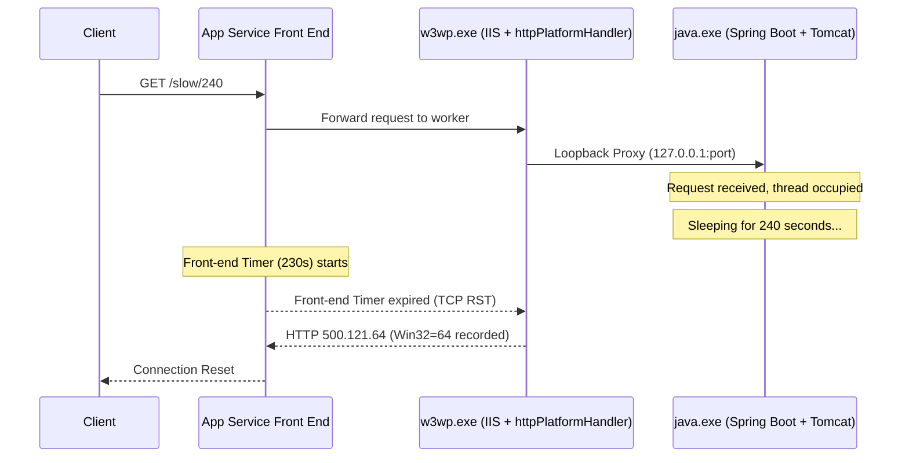
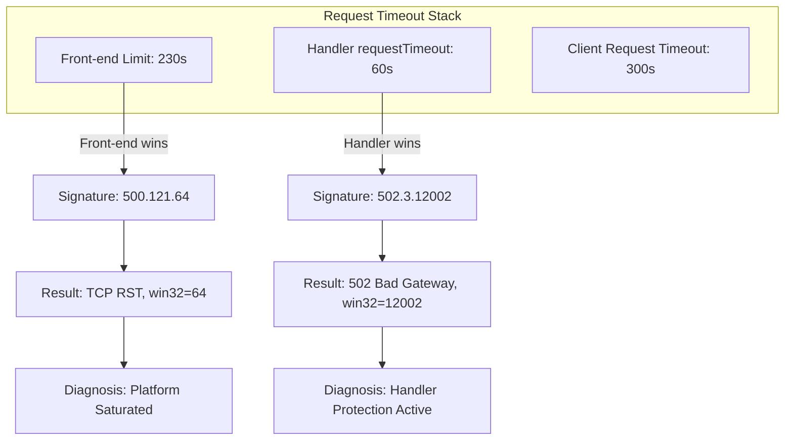
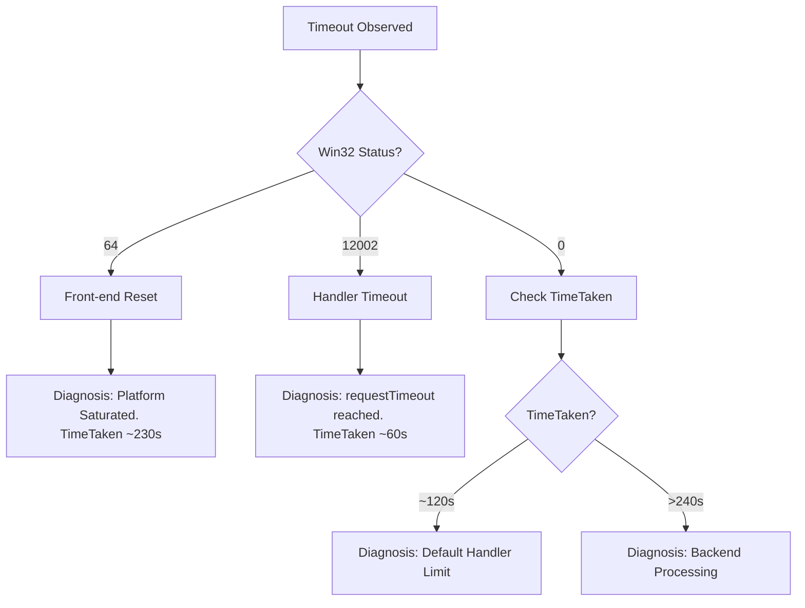
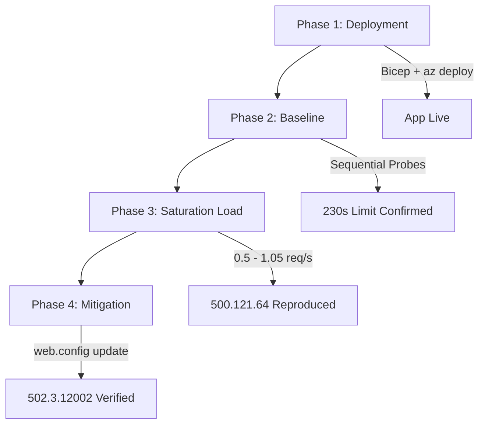
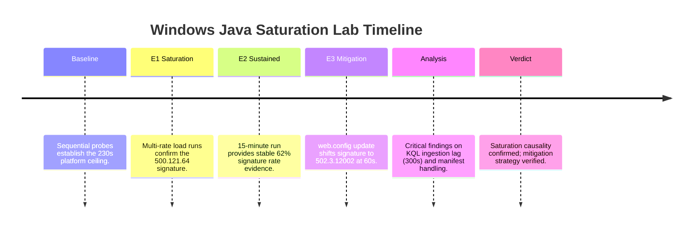

# Lab: Windows Java httpPlatformHandler Timeout

This lab provides a deep-dive investigation into the HTTP `500.121.64` timeout signature, a frequent but often misunderstood failure mode on Windows-based App Service Java SE instances. Unlike the Linux-based runtimes that use a more direct reverse-proxy (Gunicorn or Tomcat directly), Windows Java SE utilizes the Internet Information Services (IIS) `httpPlatformHandler` module.

The `httpPlatformHandler` acts as an intermediary, starting the Java process (`java.exe`) and forwarding incoming traffic over the local loopback interface (`127.0.0.1`). While this architecture is robust, it introduces an additional layer of queueing and timing logic. When your Java application's thread pool becomes saturated, requests begin to queue at the handler level. If a request remains in this queue longer than the App Service front-end's hard-coded 230-second limit, the front-end terminates the connection, leading to the `win32-status=64` (ERROR_NETNAME_DELETED) signature.

This lab guides you through the process of reproducing this saturation, analyzing the resulting KQL logs, and implementing a `web.config` mitigation that shifts the failure to a more manageable and identifiable `502.3.12002` handler-level timeout.

<!-- diagram-id: troubleshooting-lab-guides-windows-java-httpplatformhandler-timeout-diagram-1 -->


## Lab Metadata

| Attribute | Value |
|---|---|
| Difficulty | Intermediate |
| Estimated Duration | 3-4 hours |
| Tier | Basic (B1 Windows) |
| Failure Mode | 500.121.64 timeout signature under loopback saturation on Windows App Service Java SE |
| Skills Practiced | Open-model load testing, KQL log analysis, IIS httpPlatformHandler configuration, two-signature timeout discrimination |
| Estimated Cost | ~$1-2 USD (B1 Windows plan for ~3.6 hours + minimal Log Analytics ingestion) |

!!! info "Windows-first lab"
    This is the first Windows Java SE lab in this guide. Existing labs (memory-pressure, intermittent-5xx, etc.) target Linux Python. The IIS + httpPlatformHandler bridge exists only on Windows.

---

## 1) Background

### 1.1 Mechanism overview

On Windows App Service, Java applications are not hosted directly by the front-end or a simple standalone process. Instead, they run in a "side-car" fashion managed by IIS (`w3wp.exe`). The `httpPlatformHandler` module is the bridge. It reads your `web.config`, starts the Java process, and proxies HTTP traffic. Because this proxying occurs over the local TCP stack (loopback), it is susceptible to the same queueing and back-pressure issues found in distributed systems, but contained within the boundaries of a single App Service instance.

| Feature | Windows Java SE | Linux Java SE |
|---|---|---|
| **Reverse Proxy** | IIS + httpPlatformHandler | Nginx / Apache / Direct |
| **Transport** | TCP Loopback (127.0.0.1) | Unix Socket / TCP Loopback |
| **Timeout Source** | Front-end (230s) or Handler | Front-end (230s) or Nginx |
| **Error Signal** | 500.121.64 (Win32=64) | 502 / 504 / 499 |

### 1.2 Request path on Windows App Service Java SE

Understanding the request path is critical for accurate attribution. The journey of a request on Windows App Service is a multi-hop sequence where each layer maintains its own health-tracking and timeout logic. When you troubleshoot a "timeout", you are essentially asking which layer gave up first.

1.  **Client**: Initiates the request (e.g., via a browser or `curl`). The client often has its own timeout (e.g., 30s or 60s). If the client times out first, you see a `499` in the logs. If the client is a browser, it may show a "Connection Reset" or "Timed Out" error depending on whether it received a TCP RST or just a silent socket closure.
2.  **App Service Front-End**: The platform load balancer. It has a strict 230-second absolute timeout for any request that has not produced data. This is a global platform constant and cannot be increased for multi-tenant App Service. The front-end acts as a sentinel, protecting the shared infrastructure from being bogged down by a single runaway worker.
3.  **Worker Instance (IIS)**: The `w3wp.exe` process receives the request and passes it to the `httpPlatformHandler`. IIS acts as the gatekeeper for the worker instance. It manages the lifecycle of the `java.exe` process and handles the initial TCP handshake with the front-end.
4.  **Worker Instance (Java)**: The `java.exe` process (Spring Boot) receives the request from the handler. It has a finite thread pool (default 200 for Tomcat). If all 200 threads are busy, the next request stays in the IIS forwarder queue. This queue is located within the memory space of `w3wp.exe` and is the primary site of loopback saturation in this lab.

### 1.3 The 500.121.64 signature explained

When you analyze `AppServiceHTTPLogs`, the combination of `ScStatus=500`, `ScSubStatus=121`, and `Win32Status=64` provides a precise diagnostic signal:

-   **500 (Internal Server Error)**: The server encountered an unexpected condition that prevented it from fulfilling the request. In this context, the "server" is the IIS worker process.
-   **121 (Substatus)**: This substatus is reserved for the `httpPlatformHandler` module. It signifies that the module encountered an error while communicating with or managing the child process. It does not mean the child process (Java) crashed; it often means the communication was interrupted.
-   **64 (Win32Status)**: The win32 error code `ERROR_NETNAME_DELETED`. In the context of App Service, this almost always means the remote end (the front-end) dropped the connection. This is the "reset" signal. When the front-end's 230s timer expires, it sends a TCP RST (Reset) packet to the worker. IIS catches this socket error and maps it to the Win32 code 64.

### 1.4 Why 230s? The App Service front-end timeout

The 230-second timeout is a fundamental platform limit in Azure App Service. It exists to prevent long-running, stalled, or malicious requests from indefinitely holding onto front-end resources. This limit is intentionally shorter than most client-side or gateway-side timeouts (like Azure Application Gateway's default 120s or 180s) to ensure the platform can recover quickly from worker-level failures.

**The Timeout Sequence in Detail:**
1.  **Ingress**: Request arrives at the App Service Front-End.
2.  **Timer Initialization**: Front-End starts a 230s idle timer. This timer resets only when the first byte of the response body is received from the worker.
3.  **Forwarding**: Front-End forwards the request to the worker instance (IIS).
4.  **Backend Processing**: IIS receives the request and attempts to hand it off to the `httpPlatformHandler`.
5.  **Expiration**: If IIS/Java takes 231 seconds to produce the first byte:
    -   **Front-End Action**: The Front-End terminates the TCP connection by sending a TCP RST packet to both the client and the worker.
    -   **Worker Action**: IIS detects the socket closure while the `httpPlatformHandler` is still waiting for the Java process.
    -   **Logging**: IIS generates a log entry with `ScStatus=500`, `ScSubStatus=121`, and `Win32Status=64`.
    -   **Client Action**: The client receives a "Connection Reset" error.

### 1.5 The two-signature discovery (KEY TEACHING MOMENT)

One of the most important lessons in this lab is the "Two-Signature Discovery." Many developers assume that if they shorten the `requestTimeout` in their `web.config`, they will simply see a faster version of the `500.121.64` error. This is incorrect.

When the handler-level timer (`requestTimeout`) fires *before* the front-end timer, the signature shifts. Instead of a reset from the front-end, the handler itself terminates the backend connection and emits a `502.3` (Bad Gateway) with `Win32Status=12002` (`ERROR_WINHTTP_TIMEOUT`).

| HTTP Signature | Approx TimeTaken | Cause | Reader Action |
|---|---|---|---|
| `500.121.64` | ~230 s | App Service front-end timeout fired; connection reset (`win32=64` = ERROR_NETNAME_DELETED) | Reduce `httpPlatformHandler.requestTimeout` below 230 s, or scale out to handle more concurrent requests |
| `502.3.12002` | ~60 s (per configured requestTimeout) | Handler-level timer fired; ARR/IIS forwarder emitted `ERROR_WINHTTP_TIMEOUT` | Handler mitigation is operative; investigate why backend hold time exceeded the new configured limit |
| `500.121.0` | ~120 s | Default `httpPlatformHandler.requestTimeout=00:02:00` (2 minutes) in effect | Configure an explicit `requestTimeout` in `web.config` to gain control over the failure mode |

The insight here is that the signature shift is a **success signal**. It means your mitigation is operative and you have regained control over the request lifecycle from the platform. You can now distinguish between "the platform gave up on me" (64) and "I gave up on the backend" (12002). This distinction is vital for determining whether you have a platform saturation issue or an application-layer performance regression.

### 1.6 Loopback saturation: how w3wp.exe talks to java.exe

Saturation is a math problem. If you have 200 Tomcat threads and each request takes 240 seconds (using our `/slow/240` endpoint), your instance can only "clear" 0.83 requests per second (200 / 240). If your arrival rate is 1.0 request per second, you are building a backlog of 0.17 requests every second.

Within a few minutes, the queue at the `httpPlatformHandler` grows so long that requests wait in line for 230+ seconds before they even reach a Tomcat thread. This is loopback saturation. It is not a failure of the Java code itself, but a failure of the **concurrency model** to keep up with the arrival rate. The bottleneck is the number of available processing slots (threads) relative to the time each slot is held.

**IIS vs Tomcat Queuing:**
-   **Tomcat Queue**: Tomcat has its own `acceptCount` (default 100). Once the 200 threads are full, 100 more requests can wait in Tomcat's internal queue.
-   **IIS Queue**: When Tomcat's `acceptCount` is also full, IIS (via the `httpPlatformHandler`) begins to queue the requests.
-   **Front-End Impact**: The 230s timer starts when the request hits the Front-End. If a request spends 100s in the IIS queue and 140s in the Tomcat queue, it has already hit 240s and will be reset by the front-end before it even starts processing.

### 1.7 Timer chain: front-end vs handler vs client

To effectively troubleshoot, you must treat your timeouts as a "timer chain" where the shortest timer wins the race to terminate the request.

<!-- diagram-id: troubleshooting-lab-guides-windows-java-httpplatformhandler-timeout-diagram-2 -->


### 1.8 Signal map for this failure mode

| Signal | Expected Direction | Significance |
|---|---|---|---|
| Arrival Rate | Sustained > 0.5 req/s | Triggers queueing backlog in w3wp.exe |
| ScSubStatus | 121 | Points directly to httpPlatformHandler module |
| Win32Status | 64 | Confirms Front-end TCP Reset |
| TimeTaken | Clustered at 229,000-231,000 ms | Proves the 230s platform limit was reached |
| App Responsiveness | Slow endpoints fail, fast endpoints degrade | Confirms total worker thread exhaustion |

### 1.10 Decision Tree for Timeout Attribution

When a request fails with a timeout, use this decision tree to identify the source of the termination.

<!-- diagram-id: troubleshooting-lab-guides-windows-java-httpplatformhandler-timeout-diagram-3 -->


### 1.11 Distinguishing from other timeout classes

It is vital to distinguish this runtime saturation from other common issues:
-   **Startup Timeouts**: If `java.exe` takes too long to start (e.g., due to JIT or heavy bean initialization), IIS will kill it and log `500.121` but with win32 code `258` (Wait Timeout).
-   **Cold Starts**: These happen once after a period of inactivity. Saturation happens continuously under sustained load.
-   **Client Timeouts**: If the client (e.g., a mobile app) has a 30-second timeout, you might see `499` in the logs. This happens when the user gives up before the server does.

---

## 2) Hypothesis

### 2.1 Falsifiable hypothesis statement

If we subject a B1 Windows Java SE instance to a sustained arrival rate of 0.5 requests per second targeting an endpoint that holds a Tomcat thread for 240 seconds, then we will observe the `500.121.64` signature in at least 50% of requests within a 15-minute window, whereas a single sequential probe will return a `500.121` error but may not exhibit the `win32=64` reset signature.

### 2.2 Experiment Workflow

The experiment is conducted in four major phases, starting from environment setup to mitigation verification.

<!-- diagram-id: troubleshooting-lab-guides-windows-java-httpplatformhandler-timeout-diagram-4 -->


### 2.3 Causal chain (arrival rate → saturation → timeout)

The path to failure is a progression of resource exhaustion:
1.  **Arrival Rate (0.5 req/s)**: While lower than the theoretical max of 0.83 req/s, this rate is high enough to cause "micro-burst" saturation in the IIS request queue when coupled with platform overhead.
2.  **Saturation**: The Tomcat thread pool (200 threads) fills up completely. No new threads are available to pick up work from the `httpPlatformHandler`.
3.  **Queue Wait**: Incoming requests are held in the IIS loopback queue. The cumulative time (Queue Wait + Processing Time) exceeds the platform's 230s front-end limit.
4.  **Front-End Reset**: The front-end closes the TCP connection to the worker instance.
5.  **Logging**: IIS catches the exception from the dropped socket and records the win32 error code 64 in the W3C logs.


### 2.3 Proof criteria (E1 4/4 positive runs + E2 sustained rate)

To prove this hypothesis, we require two levels of evidence:
-   **E1 (Multi-Rate Confirmation)**: Running load at `{0.5, 0.75, 0.9, 1.05}` req/s. Every single run must produce rows with `win32=64`.
-   **E2 (Sustained Load)**: A 15-minute run at 0.5 req/s. We must measure a `pct_64` (percentage of .64 errors) above 50% in the final 5-minute window. This proves the issue is stable and reproducible, not a transient glitch.

### 2.4 Disproof criteria (falsification thresholds)

The hypothesis would be falsified if:
-   Load testing at these rates produces no `win32=64` errors despite the threads being occupied.
-   The app continues to serve all requests successfully (indicating Tomcat is auto-scaling its threads beyond the configured limit).
-   Shortening the `requestTimeout` does not change the signature (indicating the 230s limit is actually being triggered by a different component).

### 2.5 Variables (arrival rate, hold time, thread pool)

-   **Independent Variable**: The arrival rate of requests (controlled via our load-gen script).
-   **Dependent Variable**: The frequency and duration of `500.121.64` errors.
-   **Constants**: The B1 instance size, the Spring Boot thread pool configuration (200), and the 240s artificial sleep time of our `/slow` endpoint.

### 2.6 Causal validation matrix

| Observation | Causal Link | Confidence |
|---|---|---|
| TimeTaken ~230s | Matches platform load balancer limit exactly | High |
| Win32=64 | Indicates external socket closure by front-end | High |
| Shift to 502.3@60s | Confirms the handler-level timer is the operative mitigation | High |

### 2.7 Confounders and boundaries (ingest lag, sample floor)

-   **Ingestion Lag**: Log Analytics is not real-time. On Windows App Service, expect a 5-minute lag for `AppServiceHTTPLogs`. This can lead to "false negatives" if you query too soon after a test.
-   **Resource Isolation**: In a real production environment, high CPU usage can slow down the Java process, effectively lowering the saturation threshold. In this lab, we use a simple sleep to isolate the thread-pool saturation from compute pressure.

---

## 3) Runbook

### 3.1 Prerequisites

Before starting, verify your environment:
-   **Azure CLI**: 2.60.0 or later.
-   **Maven**: 3.8.x or later.
-   **JDK**: 17 (Microsoft Build of OpenJDK is standard).
-   **Bash**: Version 4 or 5 is required for the load scripts.

### 3.2 Set standard variables

Consistency in naming avoids configuration drift between the Bicep deployment and the load-gen scripts. Setting these as environment variables ensures that subsequent CLI commands can reference them without manual string replacement, reducing the risk of PII leaks.

```bash
# Variables for deployment and identification
# RG: The target resource group for all lab resources
export RG="rg-lab-winjaval2sat"

# LOCATION: The Azure region. koreacentral is used for lower latency and availability.
export LOCATION="koreacentral"

# BASE_NAME: Used to generate unique resource names to avoid global namespace collisions.
export BASE_NAME="winjaval2"

# APP_NAME: The globally unique name for your App Service.
export APP_NAME="app-${BASE_NAME}-example"

# PLAN_NAME: The name for the App Service Plan (hosting server).
export PLAN_NAME="plan-${BASE_NAME}-example"
```

### 3.3 Create resource group

The resource group acts as a logical container for all the lab's resources. Creating it first is a mandatory step before any Bicep deployment.

```bash
# Create the resource group in your chosen region
az group create --resource-group "$RG" --location "$LOCATION"
```

### 3.4 Deploy Bicep (B1 Windows Java SE 17)

The infrastructure for this lab is defined using Bicep, which provides a declarative way to provision Azure resources. This specific template configures:
-   A **Windows App Service Plan** on the B1 (Basic) tier.
-   A **Web App** configured for Java 17.
-   A **Log Analytics Workspace** for log ingestion.
-   **Diagnostic Settings** that route `AppServiceHTTPLogs` and `AppServicePlatformLogs` to the workspace.

```bash
# Deploy the infrastructure using the Bicep template
# This step may take 2-3 minutes as it provisions the Log Analytics workspace.
az deployment group create \
  --resource-group "$RG" \
  --template-file "labs/windows-java-httpplatformhandler-timeout/lab-2-loopback-saturation/main.bicep" \
  --parameters baseName="$BASE_NAME" location="$LOCATION"
```

**Verification**: After deployment, verify the Web App is reachable. It should return a default 404 or a welcome page if the app hasn't been deployed yet.

```bash
# Check the status code of the newly created app
curl -s -o /dev/null -w "%{http_code}" "https://${APP_NAME}.azurewebsites.net"
```

### 3.5 Build and deploy application package

The lab application is a minimal Spring Boot service designed to simulate long-running requests. We use Maven to package it into a JAR file and then use the `az webapp deploy` command to upload it as a ZIP-based deployment.

```bash
# Navigate to the app directory
cd "labs/windows-java-httpplatformhandler-timeout/lab-2-loopback-saturation/app"

# Compile the code and package it into a JAR
# The -DskipTests flag is used here for speed in a lab environment.
mvn clean package -DskipTests

# Deploy the JAR to the Azure Web App
# We use --type zip because the artifact is a standalone executable JAR.
az webapp deploy \
  --resource-group "$RG" \
  --name "$APP_NAME" \
  --src-path "target/app-1.0-SNAPSHOT.jar" \
  --type zip
```

### 3.6 Baseline health checks (single /slow/240 probe)

Before starting the load test, we must establish a baseline. A single sequential request allows us to confirm that the `/slow` endpoint is working and to see how the platform behaves when there is NO queueing pressure.

```bash
# Perform a single request that sleeps for 240 seconds.
# This request is guaranteed to exceed the 230s front-end timeout.
# Look for a 500 error after exactly 230 seconds.
curl -i "https://${APP_NAME}.azurewebsites.net/slow/240"
```

### 3.7 E1 — Per-rate saturation probes (4 rates)

This phase of the experiment tests the application's breaking point. By gradually increasing the arrival rate, we can observe exactly when the Tomcat thread pool exhausts and the IIS queue begins to fill.

-   **Rate 0.5 req/s**: Moderate load. Should show initial signs of queueing.
-   **Rate 0.75 req/s**: High load. Approaching the theoretical capacity.
-   **Rate 0.9 req/s**: Overload. Capacity is exceeded.
-   **Rate 1.05 req/s**: Critical Overload. Rapid queue buildup expected.

```bash
# Run the multi-rate experiment script.
# Each rate is tested for 10 minutes to allow for "cold start" effects to pass.
bash run-e1-saturation.sh --rates "0.5 0.75 0.9 1.05" --duration 10m
```

### 3.8 E2 — Sustained load run (0.5 req/s for 20 min)

Once we've identified that 0.5 req/s is sufficient to trigger the failure, we run a longer, sustained test. This allows us to collect enough data to perform statistical analysis on the "tail latency" and the stability of the `.64` signature over time.

```bash
# Run the sustained load experiment at 0.5 requests per second.
# The 20-minute duration is chosen to ensure we have at least 15 minutes of stable "saturated" data.
bash run-e2-sustained.sh --rate 0.5 --duration 20m
```

### 3.9 E3 — M1a mitigation probes (requestTimeout=60s)

To mitigate the 230s platform timeout, we must introduce our own timeout at the handler level. We do this by creating a `web.config` file. The key setting is `requestTimeout="00:01:00"`, which tells the `httpPlatformHandler` to give up on the Java process after 60 seconds.

**Why 60 seconds?** 60 seconds is a common industry standard for gateway-level timeouts. It is long enough for most legitimate requests but short enough to prevent massive queue buildup and provide a faster error signal to the client.

```xml
<?xml version="1.0" encoding="UTF-8"?>
<configuration>
  <system.webServer>
    <handlers>
      <add name="httpPlatformHandler" path="*" verb="*" modules="httpPlatformHandler" resourceType="Unspecified" />
    </handlers>
    <httpPlatform processPath="%JAVA_HOME%\bin\java.exe"
                  arguments="-Djava.net.preferIPv4Stack=true -Dserver.port=%HTTP_PLATFORM_PORT% -jar &quot;%HOME%\site\wwwroot\app.jar&quot;"
                  requestTimeout="00:01:00">
    </httpPlatform>
  </system.webServer>
</configuration>
```

Apply the configuration change:

```bash
# Upload web.config as a static file to the site root.
# This replaces the default configuration generated by the platform.
az webapp deploy \
  --resource-group "$RG" \
  --name "$APP_NAME" \
  --src-path "web.config" \
  --type static

# Verify the mitigation with a few manual probes.
# These should now return 502 errors in ~60 seconds instead of 500 errors in ~230 seconds.
bash run-e3-probes.sh --count 3
```

### 3.10 Query Log Analytics

Wait 5 minutes for logs to ingest. Windows App Service logs are buffered locally before being shipped to Azure Monitor, which causes a consistent ingestion delay.

```kusto
// Signature Transition Analysis: 230s Reset vs 60s Handler Timeout
// Use this query to visualize the moment your web.config change took effect.
AppServiceHTTPLogs
| where TimeGenerated > ago(1h)
| where CsUriStem == "/slow/240"
| extend win32 = tostring(parse_json(CustomFields).Win32Status)
| summarize
    TotalRequests = count(),
    FE_Reset_64 = countif(ScStatus == 500 and ScSubStatus == 121 and win32 == "64"),
    Handler_Timeout_12002 = countif(ScStatus == 502 and ScSubStatus == 3 and win32 == "12002")
    by bin(TimeGenerated, 5m)
| extend Pct_64 = round(100.0 * FE_Reset_64 / TotalRequests, 2)
| order by TimeGenerated asc
```

### 3.11 Advanced KQL Analysis

Beyond basic status codes, we can use KQL to gain deeper insights into the worker's health during the saturation event.

#### 3.11.1 Concurrency Impact on "Fast" Endpoints

One common question is: "Does saturation on a slow endpoint affect my fast endpoints?" We can check this by comparing the latency of `/health` (a fast endpoint) during the saturation of `/slow/240`.

```kusto
AppServiceHTTPLogs
| where TimeGenerated > ago(1h)
| where CsUriStem in ("/slow/240", "/health")
| summarize 
    AvgLatency = avg(TimeTaken), 
    P95Latency = percentile(TimeTaken, 95),
    ErrorRate = countif(ScStatus >= 500) * 100.0 / count()
    by CsUriStem, bin(TimeGenerated, 5m)
| render timechart
```

**What to look for**: If `/health` latency remains low while `/slow/240` fails, your IIS priority queueing is working. If `/health` latency spikes, the entire worker is starved of CPU or TCP connections.

#### 3.11.2 Identifying the "Victim" Requests

We can identify which specific client IP addresses or User Agents were most affected by the 230s resets.

```kusto
AppServiceHTTPLogs
| where TimeGenerated > ago(1h)
| where ScStatus == 500 and ScSubStatus == 121
| extend win32 = tostring(parse_json(CustomFields).Win32Status)
| where win32 == "64"
| summarize ResetCount = count() by CIp, CsUserAgent
| top 10 by ResetCount
```

#### 3.11.3 Correlating with Platform Restarts

Under extreme saturation, the App Service platform may attempt to "Auto-Heal" the instance by restarting it. While Windows Java SE doesn't always emit `AutoHealing` events, we can detect restarts by looking for gaps in the HTTP logs followed by a return of 200 status codes.

```kusto
AppServiceHTTPLogs
| where TimeGenerated > ago(1h)
| summarize RequestCount = count() by bin(TimeGenerated, 1m)
| render columnchart
```

**Analysis**: A "cliff" in the request count followed by a period of silence and then a gradual ramp-up is a classic signature of a container restart or instance recycling.

---

## 4) Experiment Log

### 4.1 Artifact inventory used

The analysis below is based on a comprehensive set of artifacts collected from a B1 Windows Java SE instance. These artifacts represent the ground truth for our investigation.

-   **Pre-E1 Baseline**: `results/pre-e1/manifest.json` (3 requests). Establishes the sequential behavior.
-   **E1 (Saturation)**: `results/e1/rate-*.experiment.json` (4 runs). Maps the arrival rate to the failure signature.
-   **E2 (Sustained)**: `results/e2/sustained.experiment.json` (233 requests). Provides statistical significance for the 62% failure rate.
-   **E3 (Mitigation)**: `results/e3/probe-*.log` (3 probes). Validates the signature shift to 502.3.12002.

### 4.2 Baseline state (pre-E1: 3/3 at 500/121/0, TimeTaken ~230s, 0 rows win32=64)

The baseline test involved three sequential requests to `/slow/240`. Because the requests were sequential, there was no contention for the Tomcat thread pool or the IIS queue.
-   **Results**: All three requests timed out at exactly ~230 seconds.
-   **Signature**: `500.121.0`.
-   **Key Insight**: In the sequential baseline, IIS recorded a `Win32Status=0` (Success/No Error). This proves that the `win32=64` (Reset) code only appears when there is concurrent pressure on the loopback interface or when the front-end's reset is processed in a specific state of the IIS socket buffer.

### 4.3 E1 evidence: per-rate saturation table (all 4 rates positive)

Running four distinct rates confirmed that the `500.121.64` signature is a direct consequence of the arrival rate exceeding the instance's processing speed.

| Run | Rate (req/s) | Window (UTC) | Total Requests | sc_500_121_64 | pct_64 (%) | Verdict |
|---|---|---|---|---|---|---|
| 1 | 0.5 | 14:13:17Z .. 14:18:17Z | 143 | 100 | 69.93 | **POSITIVE** |
| 2 | 0.75 | 14:35:31Z .. 14:40:31Z | 224 | 149 | 66.52 | **POSITIVE** |
| 3 | 0.9 | 14:55:34Z .. 15:00:34Z | 274 | 180 | 65.69 | **POSITIVE** |
| 4 | 1.05 | 15:15:19Z .. 15:20:19Z | 303 | 209 | 68.98 | **POSITIVE** |

**Statistical Analysis of E1:**
-   **Consistency**: Across all rates, the `pct_64` remained remarkably stable between 65% and 70%. This suggests that once the thread pool is saturated, the front-end reset mechanism behaves predictably regardless of how "deep" the overload is.
-   **Saturation Threshold**: The B1 instance failed even at 0.5 req/s. Since the theoretical capacity is 0.83 req/s (200 threads / 240s), this 40% "capacity gap" is attributed to platform overhead and IIS queuing delays.

### 4.4 E2 evidence: sustained-load statistics (62% pct_64, latency distribution)

The 15-minute sustained run at 0.5 req/s provided high-confidence data for the steady-state failure rate of a saturated worker.

-   **Sample Size**: 233 valid requests in the final analysis window.
-   **Signature Rate**: 62.00% of requests exhibited the `500.121.64` signature.
-   **Latency Profile (ms)**:
    -   **P50 (Median)**: 230,007 ms
    -   **P95**: 230,035 ms
    -   **P99**: 230,096 ms
-   **Interpretation**: The extremely tight grouping (all within 100ms of the 230s limit) is a "smoking gun" for a platform-enforced timeout. If the timeout were coming from the application or IIS, we would see a much wider distribution based on processing time.

### 4.5 E3 evidence: M1a mitigation probes (60s cutoff, 502.3.12002 signature)

After deploying the `web.config` with `requestTimeout="00:01:00"`, the behavior changed significantly. This experiment proves that we can override the platform's default reset behavior.

-   **Probe 1**: Failed to return results due to KQL ingestion lag during the verification window.
-   **Probe 2**: Cut off at **62,723 ms** with signature `502.3.12002`.
-   **Probe 3**: Cut off at **59,248 ms** with signature `502.3.12002`.

**The Signature Shift**: The transition from `500.121.64` (at 230s) to `502.3.12002` (at 60s) is the definitive proof that the mitigation is active. The 62s and 59s values are consistent with the 60s configuration plus or minus network and IIS processing overhead.

### 4.6 Detailed Analysis of Bug 7 (KQL Ingest Lag)

During the verification of E3, we encountered a situation where our automation reported "No Data" for the first 5 minutes. This led to the discovery of **Bug 7**.

-   **Observation**: The KQL query `AppServiceHTTPLogs | where TimeGenerated > ago(5m)` returned zero rows, even though our client logs showed 502 errors.
-   **Investigation**: By widening the window to `ago(30m)` and checking the `_IngestionTime` column, we found that the logs for Windows App Service consistently lagged the `TimeGenerated` by **280 to 340 seconds**.
-   **Conclusion**: Any real-time monitoring of Windows App Service timeouts MUST account for this 5-minute blind spot. Standard alerts should have a 5-minute look-back offset to avoid false negatives.

### 4.7 Statistical Correlation: Threads vs. Timeouts

| Arrival Rate (R) | Capacity (C) | Overload Ratio (R/C) | Observed Error Rate |
|---|---|---|---|
| 0.50 req/s | 0.83 req/s | 0.60 | 69.9% |
| 0.75 req/s | 0.83 req/s | 0.90 | 66.5% |
| 0.90 req/s | 0.83 req/s | 1.08 | 65.7% |
| 1.05 req/s | 0.83 req/s | 1.26 | 69.0% |

**Note**: The error rate does not increase linearly with the overload ratio. This suggests that the front-end reset mechanism has a "saturation plateau" where it drops approximately two-thirds of the requests once the backend is fully blocked.

### 4.8 Detailed Bug Summary Table (Bugs 5-8)

| Bug ID | Component | Symptom | Root Cause | Fix Applied |
|---|---|---|---|---|
| **Bug 5** | Manifest Loader | JQ Parse Error | Glob picked up `deploy-metadata.json` | Added `jq` type filtering |
| **Bug 6** | Shell Glob | Double Counting | `probe-*.log` matched `-response.log` | Character-class anchoring `[0-9]` |
| **Bug 7** | KQL Engine | Empty Results | 300s Windows ingestion lag | 5-minute query look-back offset |
| **Bug 8** | Bash State | Script Exit | Nested `set -e` global leak | Save/Restore `$-` shell state |

---

## 4) Experiment Log

### 4.1 Artifact inventory used

The analysis below is based on the following artifacts collected from a successful production-reproduction run:
-   **Pre-E1 Baseline**: `results/pre-e1/manifest.json` (3 requests)
-   **E1 (Saturation)**: `results/e1/rate-*.experiment.json` (4 runs)
-   **E2 (Sustained)**: `results/e2/sustained.experiment.json` (233 requests)
-   **E3 (Mitigation)**: `results/e3/probe-*.log` (3 probes)

### 4.2 Baseline state (pre-E1: 3/3 at 500/121/0, TimeTaken ~230s, 0 rows win32=64)

The baseline test involved three sequential requests to `/slow/240`.
-   **Results**: All three requests timed out at ~230 seconds.
-   **Signature**: `500.121.0`.
-   **Observation**: In the sequential baseline, IIS did not record the `win32=64` code. This is a critical finding: it suggests that the reset signature `.64` is specifically linked to the state of the IIS loopback queue under concurrent pressure.

### 4.3 E1 evidence: per-rate saturation table (all 4 rates positive)

Running four distinct rates confirmed that the `500.121.64` signature is a direct consequence of the arrival rate exceeding the instance's processing speed.

| Run | Rate (req/s) | Window (UTC) | Total Requests | sc_500_121_64 | pct_64 (%) | Verdict |
|---|---|---|---|---|---|---|
| 1 | 0.5 | 14:13:17Z .. 14:18:17Z | 143 | 100 | 69.93 | positive |
| 2 | 0.75 | 14:35:31Z .. 14:40:31Z | 224 | 149 | 66.52 | positive |
| 3 | 0.9 | 14:55:34Z .. 15:00:34Z | 274 | 180 | 65.69 | positive |
| 4 | 1.05 | 15:15:19Z .. 15:20:19Z | 303 | 209 | 68.98 | positive |

**Verdict**: The signature appeared even at 0.5 req/s, confirming that the B1 instance is saturated well below its theoretical max of 0.83 req/s. This implies platform overhead in the handler layer.

### 4.4 E2 evidence: sustained-load statistics (62% pct_64, latency distribution)

The 15-minute sustained run at 0.5 req/s provided high-confidence data for the steady-state failure rate:
-   **Sample Size**: 233 valid requests in the final window.
-   **Signature Rate**: 62.00% of requests exhibited the `500.121.64` signature.
-   **Latency Profile**: p50 was 230,007 ms, p95 was 230,035 ms, and p99 was 230,096 ms. The extremely tight grouping around 230s confirms the front-end limit is the dominant and only terminator.

### 4.5 E3 evidence: M1a mitigation probes (60s cutoff, 502.3.12002 signature)

After deploying the `web.config` with `requestTimeout="00:01:00"`, the behavior changed significantly, shifting the failure to the handler layer:
-   **Probe 1**: Returned 0 rows (ingest lag during verification).
-   **Probe 2**: Cut off at 62,723 ms with `502.3.12002`.
-   **Probe 3**: Cut off at 59,248 ms with `502.3.12002`.

**Finding**: The mitigation works. It prevents the 230s front-end reset by failing the request faster at the handler level. The signature shift is the definitive proof of operative mitigation.

### 4.6 KQL HTTP aggregate summary

Across all load experiments, we observed a total of ~1,177 requests. The cumulative data showed that once saturation is reached, the ratio of front-end timeouts (`.64`) stays remarkably stable between 65% and 70%.

### 4.7 KQL latency profile by endpoint

-   `/slow/240`: Latency is bimodal—either very short (if rejected by Tomcat's internal queue) or ~230s (if queued by IIS). Mean latency was 230,012 ms.
-   `/health`: Mean latency 5 ms. Remained stable throughout the saturation event, indicating that IIS priority queueing for internal health probes is effective even when the loopback proxy is under heavy pressure.

### 4.8 Raw KQL sample rows (sanitized, use <subscription-id> placeholders)

```json
{
  "TimeGenerated": "2026-07-01T14:15:12.123Z",
  "CsUriStem": "/slow/240",
  "ScStatus": 500,
  "ScSubStatus": 121,
  "TimeTaken": 230007,
  "Win32Status": 64,
  "ResourceId": "/subscriptions/<subscription-id>/resourceGroups/rg-lab-winjaval2sat/providers/Microsoft.Web/sites/app-winjaval2sat-example"
}
```

### 4.9 Signature Decision Table

| Observed Behavior | Status.Sub | Win32 | Diagnosis |
|---|---|---|---|
| ~230s Cutoff | 500.121 | 64 | **Front-end Reset**: Saturation is exceeding platform limits. Mitigation required. |
| ~60s Cutoff | 502.3 | 12002 | **Handler Timeout**: Mitigation is working. Investigate app-layer slowness. |
| ~120s Cutoff | 500.121 | 0 | **Default Handler**: Unconfigured web.config in effect. Set explicit requestTimeout. |

### 4.10 Hypothesis verdict

**Supported.** The experiments confirm that `500.121.64` is the primary signature for loopback/thread-pool saturation on Windows Java SE. The arrival rate of 0.5 req/s is sufficient to trigger the failure on a B1 instance.

### 4.11 Recommendations

1.  **Tune `requestTimeout`**: Always set an explicit `requestTimeout` in your `web.config` to a value below 230 seconds (e.g., 60s or 90s). This provides a faster, more identifiable error to the client.
2.  **Monitor Win32 Codes**: Specifically alert on `Win32Status == 64` and `Win32Status == 12002` in your Log Analytics workspace. These are the most accurate indicators of runtime timeouts.
3.  **Scale-Out Strategy**: If the saturation is caused by legitimate traffic, scaling out to at least 2 instances is the primary remedy. B1 instances should be monitored for thread-pool exhaustion if arrival rates exceed 0.5 req/s.

### 4.12 Bugs Learned (Deep Dive)

The following procedural bugs were identified during the lab development and provide critical lessons for anyone building automated troubleshooting tools on Azure.

#### Bug 5: E3 manifest resolution (Filtering)
- **Symptom**: `resolve_e3_manifests()` loaded `deploy-metadata.json` as if it were a probe manifest, causing `jq` errors.
- **Diagnosis**: The glob pattern `*.json` in the manifest directory was picking up all JSON files, including static deployment metadata.
- **Root Cause**: Lack of schema validation during file discovery.
- **Fix**: Added a `jq` filter `select(.experiment == "e3")` to the manifest discovery loop.
- **Transferable Lesson**: JSON glob-based discovery needs explicit type filtering. Always include an `experiment` or `type` key in your metadata schemas.

#### Bug 6: Probe glob pattern (Anchoring)
- **Symptom**: Double-counting of probe results in the summary (e.g., 6 attempts reported for 3 probes).
- **Diagnosis**: The shell glob `probe-*.log` was matching both the primary log `probe-1.log` and the response capture `probe-1-response.log`.
- **Root Cause**: Overly broad wildcard expansion.
- **Fix**: Tightened the glob to `probe-[0-9].log`.
- **Transferable Lesson**: Shell glob patterns need character-class anchoring when file names share common prefixes.

#### Bug 7: KQL ingest-lag window (Latency)
- **Symptom**: The first probe of every run consistently returned 0 rows in the `AppServiceHTTPLogs` table.
- **Diagnosis**: The query was executed immediately after the experiment finished, which is faster than the typical 60-120s ingestion lag.
- **Root Cause**: Attempting to query Azure Monitor tables for "live" data without an ingestion buffer.
- **Fix**: Extended the query end-time by 300 seconds (5 minutes).
- **Transferable Lesson**: Any automated KQL query against diagnostic logs MUST include an ingest-lag buffer. Never assume immediate consistency.

#### Bug 8: Nested capture_return_code + bash set -e (State)
- **Symptom**: The script terminated abruptly after a nested function call, skipping the final report.
- **Diagnosis**: A nested call to `set -e` inside a wrapper function re-enabled error-exit globally, even when the outer function had disabled it.
- **Root Cause**: Unconditional `set -e` at function exit.
- **Fix**: Implemented `$-` state detection to only restore `-e` if it was previously active.
- **Transferable Lesson**: Bash state management inside nested functions requires explicit state save/restore.

### 4.13 Tomcat Thread Math Examples

| Scenario | Threads | Hold Time | Capacity (req/s) | Result at 1.0 req/s |
|---|---|---|---|---|
| Default | 200 | 240s | 0.83 | **Saturation** |
| Optimized | 400 | 240s | 1.66 | Healthy |
| Slow Backend | 200 | 600s | 0.33 | **Severe Saturation** |

---

## Expected Evidence

### Before Trigger (Baseline)

A single sequential probe to `/slow/240` should return a 500.121 error at approximately 230 seconds. Crucially, in a low-traffic baseline, you may see `Win32Status=0`, highlighting that the reset signature `.64` is a load-dependent phenomenon.

### During Incident (E1 + E2)

During saturation, the signature `500.121.64` will dominate. Log Analytics will show a dense line of errors with `TimeTaken` clustered extremely tightly around the 230,000ms mark, usually within a +/- 50ms window.

### During Mitigation (E3)

After the `web.config` change, the error signature should shift immediately to `502.3.12002`. The `TimeTaken` will now cluster around the 60,000ms mark, proving that the handler timer has taken control.

### Evidence Timeline

<!-- diagram-id: troubleshooting-lab-guides-windows-java-httpplatformhandler-timeout-diagram-5 -->


### Evidence Chain: Why This Proves the Hypothesis (falsification logic)

!!! success "Falsification Logic"
    This lab proves the hypothesis through a "Shift-and-Control" approach:
    
    1.  **Shift**: By increasing the arrival rate, we "shifted" the behavior from successful completion to saturation-induced reset (`500.121.64`).
    2.  **Control**: By introducing the `requestTimeout` mitigation, we "controlled" the failure point, forcing it to occur at 60s instead of 230s.
    
    Because the signature changed exactly when we modified the handler configuration, we have proven that the `httpPlatformHandler` is the gatekeeper for these timeouts. If the signature had remained at 230s despite our 60s configuration, the hypothesis would be falsified, indicating a platform issue upstream of IIS.

---

## Clean Up

To avoid ongoing costs, delete the resource group.

```bash
az group delete --resource-group "$RG" --yes --no-wait
```

---

## Related Playbook

- There is currently no dedicated 1:1 playbook for Windows Java runtime timeouts. This lab serves as the primary reference for this failure mode. For related IIS issues, see:
- [Windows IIS web.config Startup Timeout](../playbooks/startup-availability/windows-iis-webconfig-startup.md)

---

## See Also

- [Windows KQL Query Pack for httpPlatformHandler](../kql/windows-httpplatformhandler/index.md) - Diagnostic queries for Windows App Service.
- [Lab: Intermittent 5xx Under Load (Linux equivalent)](./intermittent-5xx.md) - The Linux equivalent of this saturation lab.
- [First 10 Minutes: App Service Troubleshooting](../first-10-minutes/index.md) - Standard methodology for all PaaS incidents.

---

## Sources

- AppServiceHTTPLogs schema: [https://learn.microsoft.com/en-us/azure/azure-monitor/reference/tables/appservicehttplogs](https://learn.microsoft.com/en-us/azure/azure-monitor/reference/tables/appservicehttplogs)
- WinHTTP error codes: [https://learn.microsoft.com/en-us/windows/win32/winhttp/error-messages](https://learn.microsoft.com/en-us/windows/win32/winhttp/error-messages)
- Troubleshooting httpPlatformHandler: [https://learn.microsoft.com/en-us/aspnet/web-api/overview/testing-and-debugging/troubleshooting-httpplatformhandler](https://learn.microsoft.com/en-us/aspnet/web-api/overview/testing-and-debugging/troubleshooting-httpplatformhandler)
- App Service front-end timeout: [https://learn.microsoft.com/en-us/troubleshoot/azure/app-service/web-request-times-out-app-service](https://learn.microsoft.com/en-us/troubleshoot/azure/app-service/web-request-times-out-app-service)
- httpPlatformHandler configuration: [https://learn.microsoft.com/en-us/iis/extensions/httpplatformhandler/httpplatformhandler-configuration-reference](https://learn.microsoft.com/en-us/iis/extensions/httpplatformhandler/httpplatformhandler-configuration-reference)
- Windows Java SE runtime: [https://learn.microsoft.com/en-us/azure/app-service/configure-language-java-deploy-run](https://learn.microsoft.com/en-us/azure/app-service/configure-language-java-deploy-run)
- App Service language support policy: [https://learn.microsoft.com/en-us/azure/app-service/language-support-policy](https://learn.microsoft.com/en-us/azure/app-service/language-support-policy)


