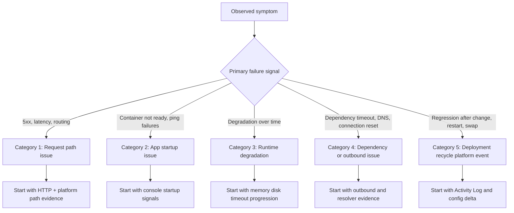

---
hide:
  - toc
title: Troubleshooting Mental Model
slug: mental-model
doc_type: map
section: troubleshooting
topics:
  - troubleshooting
  - methodology
  - classification
products:
  - azure-app-service
prerequisites:
  - how-app-service-works
  - request-lifecycle
related:
  - troubleshooting-architecture-overview
  - evidence-map
  - decision-tree
summary: Classification model for App Service incidents - request path, startup, degradation, dependency, deployment.
status: stable
last_reviewed: 2026-04-08
content_sources:
  diagrams:
    - id: troubleshooting-mental-model-diagram-1
      type: flowchart
      source: self-generated
      justification: "Self-generated troubleshooting diagram synthesized from Microsoft Learn diagnostics and Azure App Service incident guidance for this guide."
      based_on:
        - https://learn.microsoft.com/en-us/azure/app-service/troubleshoot-diagnostic-logs
        - https://learn.microsoft.com/en-us/azure/app-service/troubleshoot-http-502-http-503
---
# Troubleshooting Mental Model

This page provides a classification model for App Service incidents so you can start with the correct evidence source instead of guessing.

**Core idea**: classify the problem first, then investigate deeply.

## Why this model matters

Most incident delays come from category mistakes:

- startup failures investigated as pure application bugs
- outbound DNS/SNAT failures investigated as CPU problems
- deployment events ignored while symptoms are treated as random instability

This classification helps you avoid looking at the wrong logs from the start.

## Classification flowchart

<!-- diagram-id: troubleshooting-mental-model-diagram-1 -->


## Category summary matrix

| Category | Typical Symptoms | First Signal to Check | Common Mistake |
|---|---|---|---|
| Request path issue | 5xx, latency spikes, forwarding errors | `AppServiceHTTPLogs` status/time trend | assuming every 5xx is app code |
| App startup issue | container did not respond, warm-up timeout | `AppServiceConsoleLogs` startup sequence | checking only live request traces |
| Runtime degradation | slow over time, recycle, queue timeout | memory/disk trend + console timeout signatures | looking only at CPU |
| Dependency/outbound issue | connect timeout, DNS failures, reset/refused | console/app dependency errors + DNS checks | restarting app without validating outbound cause |
| Deployment/recycle/platform event | incident starts after deploy/swap/config change | Activity Log + platform lifecycle events | treating change-related incidents as random noise |

## 1) Category: Request Path Issue

Request path issues are failures in the inbound flow from client to app response.

### Typical symptom patterns

- 500/502/503 appearing at endpoint level
- latency increase before error-rate increase
- only specific routes or methods failing
- proxy/forwarding failures in incident timeline

### First signal to check

```kusto
AppServiceHTTPLogs
| where TimeGenerated > ago(2h)
| summarize total=count(), err5xx=countif(ScStatus >= 500 and ScStatus < 600), p95=percentile(TimeTaken,95) by bin(TimeGenerated, 5m), CsUriStem
| order by TimeGenerated asc
```

### Common mistakes

- interpreting one status code in isolation without timing context
- ignoring route concentration (`CsUriStem`) and focusing only on global totals
- skipping platform logs that can explain 502/503 transitions

### Recommended playbooks

- [Intermittent 5xx Under Load](playbooks/performance/intermittent-5xx-under-load.md)
- [Slow Response but Low CPU](playbooks/performance/slow-response-but-low-cpu.md)
- [Failed to Forward Request](playbooks/startup-availability/failed-to-forward-request.md)

## 2) Category: App Startup Issue

Startup issues occur when runtime readiness never stabilizes after deployment, recycle, or slot event.

### Typical symptom patterns

- deployment marked successful but app unavailable
- `container didn't respond to HTTP pings`
- warm-up succeeds in one slot but fails after swap
- immediate 503 after restart or rollout

### First signal to check

```kusto
AppServiceConsoleLogs
| where TimeGenerated > ago(6h)
| where ResultDescription has_any ("startup", "didn't respond", "could not bind", "listen", "warm-up", "health")
| project TimeGenerated, ResultDescription, Host
| order by TimeGenerated desc
```

### Common mistakes

- assuming deployment success equals startup success
- validating only app code and skipping startup command/port binding
- confusing warm-up path behavior with health check behavior

### Recommended playbooks

- [Container Didn't Respond to HTTP Pings](playbooks/startup-availability/container-didnt-respond-to-http-pings.md)
- [Warm-up vs Health Check](playbooks/startup-availability/warmup-vs-health-check.md)
- [Deployment Succeeded but Startup Failed](playbooks/startup-availability/deployment-succeeded-startup-failed.md)
- [Slot Swap Failed During Warm-up](playbooks/startup-availability/slot-swap-failed-during-warmup.md)

## 3) Category: Runtime Degradation

Runtime degradation means the app starts correctly but performance deteriorates due to memory, disk, or worker execution behavior.

### Typical symptom patterns

- increasing latency over hours followed by restart/recycle
- intermittent timeout errors while CPU appears moderate
- `No space left on device` and logging/write failures
- request queueing and worker timeout under burst traffic

### First signal to check

```kusto
AppServiceConsoleLogs
| where TimeGenerated > ago(24h)
| where ResultDescription has_any ("No space left on device", "OOM", "killed", "timeout", "WORKER TIMEOUT")
| project TimeGenerated, ResultDescription
| order by TimeGenerated desc
```

### Common mistakes

- relying on CPU as the only capacity metric
- missing trend-based failures because only point-in-time checks are used
- restarting repeatedly instead of identifying memory/disk growth pattern

### Recommended playbooks

- [Memory Pressure and Worker Degradation](playbooks/performance/memory-pressure-and-worker-degradation.md)
- [No Space Left on Device](playbooks/performance/no-space-left-on-device.md)
- [Slow Start / Cold Start](playbooks/performance/slow-start-cold-start.md)

## 4) Category: Dependency / Outbound Issue

Outbound issues occur when the app runtime is healthy but calls to external systems fail due to DNS, SNAT, routing, or dependency-side latency.

### Typical symptom patterns

- connection timeout, reset, or refused errors during dependency calls
- failures cluster on endpoints that call one external service
- DNS resolution failures in VNet-integrated environments
- intermittent behavior that worsens with outbound concurrency

### First signal to check

```kusto
AppServiceConsoleLogs
| where TimeGenerated > ago(6h)
| where ResultDescription has_any ("getaddrinfo", "Name or service not known", "Temporary failure in name resolution", "ConnectTimeout", "ReadTimeout", "connection reset", "connection refused")
| project TimeGenerated, ResultDescription
| order by TimeGenerated desc
```

### Common mistakes

- treating all dependency failures as provider outages
- skipping DNS verification from inside app context
- assuming SNAT without correlating with traffic shape and outbound fan-out

### Recommended playbooks

- [SNAT or Application Issue?](playbooks/outbound-network/snat-or-application-issue.md)
- [DNS Resolution (VNet-Integrated)](playbooks/outbound-network/dns-resolution-vnet-integrated-app-service.md)
- [Private Endpoint / Custom DNS Route Confusion](playbooks/outbound-network/private-endpoint-custom-dns-route-confusion.md)

## 5) Category: Deployment / Recycle / Platform Event

This category covers incidents triggered by operational changes rather than steady-state code behavior.

### Typical symptom patterns

- errors begin immediately after deployment or configuration update
- instability appears after slot swap
- restart/recycle events correlate with outage window
- app behavior differs between staging and production slot

### First signal to check

```bash
az monitor activity-log list --resource-group <resource-group> --offset 24h
az webapp config appsettings list --resource-group <resource-group> --name <app-name>
az webapp config show --resource-group <resource-group> --name <app-name>
```

```kusto
AppServicePlatformLogs
| where TimeGenerated > ago(24h)
| where ResultDescription has_any ("restart", "recycle", "swap", "deploy", "configuration", "health")
| project TimeGenerated, OperationName, ResultDescription
| order by TimeGenerated desc
```

### Common mistakes

- treating deployment/change correlation as coincidence
- failing to compare slot-specific settings and sticky configuration
- applying runtime mitigations without first validating config drift

### Recommended playbooks

- [Deployment Succeeded but Startup Failed](playbooks/startup-availability/deployment-succeeded-startup-failed.md)
- [Slot Swap Config Drift](playbooks/startup-availability/slot-swap-config-drift.md)
- [Slot Swap Failed During Warm-up](playbooks/startup-availability/slot-swap-failed-during-warmup.md)

## Classification workflow in practice

1. Pick one dominant symptom and timestamp window.
2. Map to one of the five categories using the flowchart.
3. Run only the first evidence query for that category.
4. If evidence contradicts the category, reclassify immediately.
5. Open the linked playbook and continue with hypothesis-driven analysis.

## Anti-patterns this model prevents

- **Wrong-table bias**: querying the same table for every incident type.
- **Single-metric bias**: letting CPU charts decide all hypotheses.
- **No-change blind spot**: ignoring deployment and config events.
- **Premature root cause**: selecting one familiar explanation before evidence correlation.

!!! tip "Use category labels in incident notes"
    Add an explicit category label in the first incident update.
    Example: "Initial classification: Category 4 (Dependency/Outbound), confidence medium."
    This keeps the team aligned on which evidence to collect first.

## See Also

- [Troubleshooting Method](methodology/troubleshooting-method.md)
- [Detector Map](methodology/detector-map.md)
- [Architecture Overview](architecture-overview.md)
- [Evidence Map](evidence-map.md)
- [Decision Tree](decision-tree.md)
- [Playbooks Index](playbooks/index.md)
- [KQL Query Library](kql/index.md)

## Sources

- [Azure App Service diagnostics overview](https://learn.microsoft.com/en-us/azure/app-service/overview-diagnostics)
- [Monitor Azure App Service](https://learn.microsoft.com/en-us/azure/app-service/monitor-app-service)
- [Enable diagnostic logging for apps in Azure App Service](https://learn.microsoft.com/en-us/azure/app-service/troubleshoot-diagnostic-logs)
- [Troubleshoot intermittent outbound connection errors in Azure App Service](https://learn.microsoft.com/en-us/azure/app-service/troubleshoot-intermittent-outbound-connection-errors)
- [Configure health checks in Azure App Service](https://learn.microsoft.com/en-us/azure/app-service/monitor-instances-health-check)
