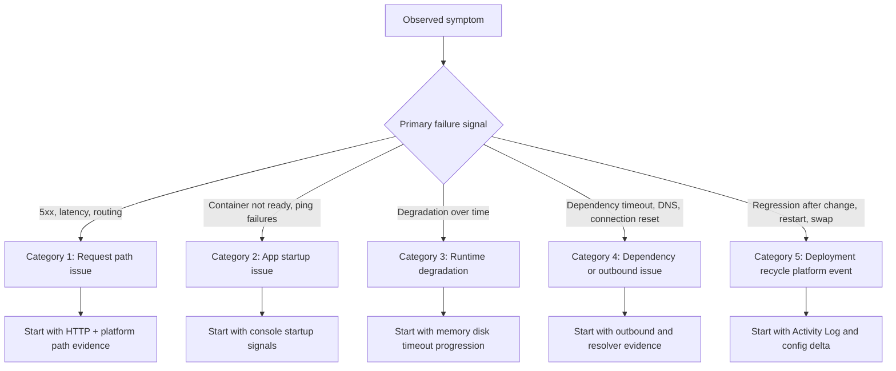

# Troubleshooting Mental Model

This page provides a classification model for App Service incidents so you can start with the correct evidence source instead of guessing.

**Core idea**: classify the problem first, then investigate deeply.

## Why this model matters

Most incident delays come from category mistakes:

- startup failures investigated as pure application bugs
- outbound DNS/SNAT failures investigated as CPU problems
- deployment events ignored while symptoms are treated as random instability

This classification helps you avoid looking at the wrong logs from the start.

## Classification flowchart

<!-- diagram-id: troubleshooting-mental-model-diagram-1 -->

```mermaid
flowchart TD
    A[Observed symptom] --> B{Primary failure signal}
    B -->|5xx, latency, routing| C[Category 1: Request path issue]
    B -->|Container not ready, ping failures| D[Category 2: App startup issue]
    B -->|Degradation over time| E[Category 3: Runtime degradation]
    B -->|Dependency timeout, DNS, connection reset| F[Category 4: Dependency or outbound issue]
    B -->|Regression after change, restart, swap| G[Category 5: Deployment recycle platform event]

    C --> C1[Start with HTTP + platform path evidence]
    D --> D1[Start with console startup signals]
    E --> E1[Start with memory disk timeout progression]
    F --> F1[Start with outbound and resolver evidence]
    G --> G1[Start with Activity Log and config delta]
```

#### Portal view: Diagnose and solve problems landing page

![Diagnose and solve problems blade for the `app-test-20251107` Web App. A `Search for common problems or tools` box sits at the top with `Refresh` and `Feedback` actions. Two tabs are visible: `Common Solutions` (selected) and `AI-powered Diagnostics (preview)`. A `Risk alerts` section shows an `Availability` card with a red X icon, `2 Critical`, and a `View more details` link. The `Troubleshooting categories` grid contains seven cards: `Availability and Performance` ("Check your app's health and discover app or platform issues" with links Application Logs, App Down Workflow, Web App Down), `Configuration and Management` ("Find out if your app service features are misconfigured" with links Investigate EasyAuth errors, IP Address Configuration, All Scaling Operations), `Risk Assessments` ("Analyze your app for optimal performance and configurations" with links Availability risks, Configuration risks), `Deployment` ("Discover and resolve issues with your application code deployments" with Troubleshoot link), `Networking` ("Discover and resolve any networking related issues with your resources" with Troubleshoot link), `Diagnostic Tools` ("Run proactive tools to automatically mitigate the app" with links Auto-Heal, Network Troubleshooter, Advanced Application Restart), and `Load Test your App` ("Generate high-scale load on your application to identify performance bottlenecks" with Create Load Test link). A `Popular troubleshooting tools` list at the bottom shows Application Logs, App Down Workflow, Web App Down, Web App Slow, and Process Full List. A `Privacy` link sits in the bottom-right corner.](../assets/troubleshooting/diagnose-and-solve/01-overview.png)

The Portal's own `Diagnose and solve problems` blade is the operational mirror of the five-category classification above. `Availability and Performance` aligns to Category 1 (Request path) and Category 3 (Runtime degradation). `Configuration and Management` plus `Deployment` align to Category 5 (Deployment/recycle/platform event). `Networking` is the direct counterpart to Category 4 (Dependency/outbound), and `Diagnostic Tools` (Auto-Heal, Network Troubleshooter) is the mitigation toolbox. The `Risk alerts` panel at the top (here showing `2 Critical` availability issues) is the fastest pre-classification signal — when it is non-empty, click `View more details` before running any KQL. The `AI-powered Diagnostics (preview)` tab provides ML-based pattern matching that can short-circuit the manual classification when the symptom is familiar.

## Category summary matrix

| Category | Typical Symptoms | First Signal to Check | Common Mistake |
|---|---|---|---|
| Request path issue | 5xx, latency spikes, forwarding errors | `AppServiceHTTPLogs` status/time trend | assuming every 5xx is app code |
| App startup issue | container did not respond, warm-up timeout | `AppServiceConsoleLogs` startup sequence | checking only live request traces |
| Runtime degradation | slow over time, recycle, queue timeout | memory/disk trend + console timeout signatures | looking only at CPU |
| Dependency/outbound issue | connect timeout, DNS failures, reset/refused | console/app dependency errors + DNS checks | restarting app without validating outbound cause |
| Deployment/recycle/platform event | incident starts after deploy/swap/config change | Activity Log + platform lifecycle events | treating change-related incidents as random noise |

## 1) Category: Request Path Issue

Request path issues are failures in the inbound flow from client to app response.

### Typical symptom patterns

- 500/502/503 appearing at endpoint level
- latency increase before error-rate increase
- only specific routes or methods failing
- proxy/forwarding failures in incident timeline

#### Portal view: Application Insights Overview as the first signal

![Application Insights Overview for `ai-test-20251107` showing four pinned tiles: Failed requests (pink area chart, value 10), Server response time (blue dashed line at 1ms, value 1.07ms), Server requests (blue line with spikes, value 15), and Availability (flat green line at 0%, value --). The Essentials panel above lists Resource group rg-test-20251107, Location Korea Central, Subscription Visual Studio Enterprise Subscription, and a redacted Instrumentation key 00000000-0000-0000-0000-000000000000. A Show data for last tab strip has 1 hour selected.](../assets/troubleshooting/app-insights/01-overview.png)

For Category 1 incidents, the Application Insights `Failed requests` and `Server response time` tiles are the first signal — together they reveal whether the request path is failing outright or simply slow. The `1 hour` window is the right starting scope; widen to compare against the 24-hour baseline if needed. Click `Failed requests` to drill into the per-endpoint breakdown that maps to the `CsUriStem` grouping in the KQL query below. `Server requests` count is the denominator — a request spike with no failure-rate increase is normal load, while flat requests with rising failures indicates a routing or upstream issue.

### First signal to check

```kusto
AppServiceHTTPLogs
| where TimeGenerated > ago(2h)
| summarize total=count(), err5xx=countif(ScStatus >= 500 and ScStatus < 600), p95=percentile(TimeTaken,95) by bin(TimeGenerated, 5m), CsUriStem
| order by TimeGenerated asc
```

### Common mistakes

- interpreting one status code in isolation without timing context
- ignoring route concentration (`CsUriStem`) and focusing only on global totals
- skipping platform logs that can explain 502/503 transitions

### Recommended playbooks

- [Intermittent 5xx Under Load](playbooks/performance/intermittent-5xx-under-load.md)
- [Slow Response but Low CPU](playbooks/performance/slow-response-but-low-cpu.md)
- [Failed to Forward Request](playbooks/startup-availability/failed-to-forward-request.md)

## 2) Category: App Startup Issue

Startup issues occur when runtime readiness never stabilizes after deployment, recycle, or slot event.

### Typical symptom patterns

- deployment marked successful but app unavailable
- `container didn't respond to HTTP pings`
- warm-up succeeds in one slot but fails after swap
- immediate 503 after restart or rollout

### First signal to check

```kusto
AppServiceConsoleLogs
| where TimeGenerated > ago(6h)
| where ResultDescription has_any ("startup", "didn't respond", "could not bind", "listen", "warm-up", "health")
| project TimeGenerated, ResultDescription, Host
| order by TimeGenerated desc
```

### Common mistakes

- assuming deployment success equals startup success
- validating only app code and skipping startup command/port binding
- confusing warm-up path behavior with health check behavior

### Recommended playbooks

- [Container Didn't Respond to HTTP Pings](playbooks/startup-availability/container-didnt-respond-to-http-pings.md)
- [Warm-up vs Health Check](playbooks/startup-availability/warmup-vs-health-check.md)
- [Deployment Succeeded but Startup Failed](playbooks/startup-availability/deployment-succeeded-startup-failed.md)
- [Slot Swap Failed During Warm-up](playbooks/startup-availability/slot-swap-failed-during-warmup.md)

## 3) Category: Runtime Degradation

Runtime degradation means the app starts correctly but performance deteriorates due to memory, disk, or worker execution behavior.

### Typical symptom patterns

- increasing latency over hours followed by restart/recycle
- intermittent timeout errors while CPU appears moderate
- `No space left on device` and logging/write failures
- request queueing and worker timeout under burst traffic

### First signal to check

```kusto
AppServiceConsoleLogs
| where TimeGenerated > ago(24h)
| where ResultDescription has_any ("No space left on device", "OOM", "killed", "timeout", "WORKER TIMEOUT")
| project TimeGenerated, ResultDescription
| order by TimeGenerated desc
```

### Common mistakes

- relying on CPU as the only capacity metric
- missing trend-based failures because only point-in-time checks are used
- restarting repeatedly instead of identifying memory/disk growth pattern

### Recommended playbooks

- [Memory Pressure and Worker Degradation](playbooks/performance/memory-pressure-and-worker-degradation.md)
- [No Space Left on Device](playbooks/performance/no-space-left-on-device.md)
- [Slow Start / Cold Start](playbooks/performance/slow-start-cold-start.md)

## 4) Category: Dependency / Outbound Issue

Outbound issues occur when the app runtime is healthy but calls to external systems fail due to DNS, SNAT, routing, or dependency-side latency.

### Typical symptom patterns

- connection timeout, reset, or refused errors during dependency calls
- failures cluster on endpoints that call one external service
- DNS resolution failures in VNet-integrated environments
- intermittent behavior that worsens with outbound concurrency

### First signal to check

```kusto
AppServiceConsoleLogs
| where TimeGenerated > ago(6h)
| where ResultDescription has_any ("getaddrinfo", "Name or service not known", "Temporary failure in name resolution", "ConnectTimeout", "ReadTimeout", "connection reset", "connection refused")
| project TimeGenerated, ResultDescription
| order by TimeGenerated desc
```

### Common mistakes

- treating all dependency failures as provider outages
- skipping DNS verification from inside app context
- assuming SNAT without correlating with traffic shape and outbound fan-out

### Recommended playbooks

- [SNAT or Application Issue?](playbooks/outbound-network/snat-or-application-issue.md)
- [DNS Resolution (VNet-Integrated)](playbooks/outbound-network/dns-resolution-vnet-integrated-app-service.md)
- [Private Endpoint / Custom DNS Route Confusion](playbooks/outbound-network/private-endpoint-custom-dns-route-confusion.md)

## 5) Category: Deployment / Recycle / Platform Event

This category covers incidents triggered by operational changes rather than steady-state code behavior.

### Typical symptom patterns

- errors begin immediately after deployment or configuration update
- instability appears after slot swap
- restart/recycle events correlate with outage window
- app behavior differs between staging and production slot

#### Portal view: Activity log as the first signal

![Activity log blade for app-test-20251107 with filter chips set to Subscription Visual Studio Enterprise Subscription, Event severity All, Timespan Last 6 hours, Resource group rg-test-20251107, and Resource app-test-20251107. The table shows 11 items including ValidateUpgradePath, multiple Get Web App Publishing Profile entries, Get Web App Slots Differences, and List Web App Slot Security Sensitive Settings — all with Succeeded status, times spanning an hour ago to 4 hours ago, and user@example.com as the initiator.](../assets/troubleshooting/activity-log/01-activity-log.png)

For Category 5 incidents, the Activity log is the authoritative timeline of every control-plane change against this Web App. The first question to answer is "what operation immediately preceded the incident window?" — sort by `Time` descending and look for `Update Site`, `Update Configuration`, `Update App Settings`, `Microsoft.Web/sites/publish/Action`, or any slot-swap operation in the hour before symptoms began. The `Event initiated by` column distinguishes a human deploy from a CI/CD service principal or platform-initiated change. The `Timespan: Last 6 hours` filter chip should match the incident window; widen to 24 hours if the suspected change is older. Pair this with the CLI/KQL commands below to extract the change details (`Update App Settings` operations log the new values in their JSON payload).

### First signal to check

```bash
az monitor activity-log list --resource-group <resource-group> --offset 24h
az webapp config appsettings list --resource-group <resource-group> --name <app-name>
az webapp config show --resource-group <resource-group> --name <app-name>
```

| Command | Purpose |
|---------|---------|
| `az monitor activity-log list --resource-group <resource-group> --offset 24h` | Lists recent control-plane operations in the resource group so you can correlate symptoms with restarts, deployments, or configuration changes. |
| `--resource-group <resource-group> --offset 24h` | Scopes the activity-log search to this resource group. |
| `--offset 24h` | Limits the activity-log query to this recent time window. |
| `az webapp config appsettings list --resource-group <resource-group> --name <app-name>` | Lists the app settings currently applied to this web app so you can inspect runtime or deployment configuration. |
| `--resource-group <resource-group> --name <app-name>` | Looks up the resource in this resource group. |
| `--name <app-name>` | Targets this web app. |
| `az webapp config show --resource-group <resource-group> --name <app-name>` | Shows the web app's site configuration so you can inspect runtime, startup, logging, or auth settings. |
| `--resource-group <resource-group> --name <app-name>` | Looks up the resource in this resource group. |
| `--name <app-name>` | Targets this web app. |

```kusto
AppServicePlatformLogs
| where TimeGenerated > ago(24h)
| where ResultDescription has_any ("restart", "recycle", "swap", "deploy", "configuration", "health")
| project TimeGenerated, OperationName, ResultDescription
| order by TimeGenerated desc
```

### Common mistakes

- treating deployment/change correlation as coincidence
- failing to compare slot-specific settings and sticky configuration
- applying runtime mitigations without first validating config drift

### Recommended playbooks

- [Deployment Succeeded but Startup Failed](playbooks/startup-availability/deployment-succeeded-startup-failed.md)
- [Slot Swap Config Drift](playbooks/startup-availability/slot-swap-config-drift.md)
- [Slot Swap Failed During Warm-up](playbooks/startup-availability/slot-swap-failed-during-warmup.md)

## Classification workflow in practice

1. Pick one dominant symptom and timestamp window.
2. Map to one of the five categories using the flowchart.
3. Run only the first evidence query for that category.
4. If evidence contradicts the category, reclassify immediately.
5. Open the linked playbook and continue with hypothesis-driven analysis.

## Anti-patterns this model prevents

- **Wrong-table bias**: querying the same table for every incident type.
- **Single-metric bias**: letting CPU charts decide all hypotheses.
- **No-change blind spot**: ignoring deployment and config events.
- **Premature root cause**: selecting one familiar explanation before evidence correlation.

!!! tip "Use category labels in incident notes"
    Add an explicit category label in the first incident update.
    Example: "Initial classification: Category 4 (Dependency/Outbound), confidence medium."
    This keeps the team aligned on which evidence to collect first.

## See Also

- [Troubleshooting Method](methodology/troubleshooting-method.md)
- [Detector Map](methodology/detector-map.md)
- [Architecture Overview](architecture-overview.md)
- [Evidence Map](evidence-map.md)
- [Decision Tree](decision-tree.md)
- [Playbooks Index](playbooks/index.md)
- [KQL Query Library](kql/index.md)

## Sources

- [Azure App Service diagnostics overview](https://learn.microsoft.com/en-us/azure/app-service/overview-diagnostics)
- [Monitor Azure App Service](https://learn.microsoft.com/en-us/azure/app-service/monitor-app-service)
- [Enable diagnostic logging for apps in Azure App Service](https://learn.microsoft.com/en-us/azure/app-service/troubleshoot-diagnostic-logs)
- [Troubleshoot intermittent outbound connection errors in Azure App Service](https://learn.microsoft.com/en-us/azure/app-service/troubleshoot-intermittent-outbound-connection-errors)
- [Configure health checks in Azure App Service](https://learn.microsoft.com/en-us/azure/app-service/monitor-instances-health-check)
