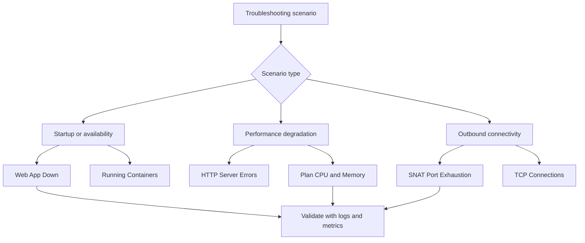

---
hide:
  - toc
content_sources:
  diagrams:
    - id: troubleshooting-methodology-detector-map-diagram-1
      type: graph
      source: self-generated
      justification: "Self-generated troubleshooting diagram synthesized from Microsoft Learn diagnostics and Azure App Service incident guidance for this guide."
      based_on:
        - https://learn.microsoft.com/en-us/azure/app-service/troubleshoot-diagnostic-logs
        - https://learn.microsoft.com/en-us/azure/app-service/troubleshoot-http-502-http-503
---
# Detector Map

Quick reference for Azure App Service Diagnostics detectors relevant to Linux/OSS troubleshooting.

<!-- diagram-id: troubleshooting-methodology-detector-map-diagram-1 -->


## How to Access

Navigate to your App Service in the Azure Portal → **Diagnose and solve problems**.

## Detector Reference

| Detector | Category | What It Shows | When to Use | Related Playbook |
|----------|----------|--------------|-------------|-----------------|
| Web App Down | Availability | Whether the app is responding to requests | App not loading, 503 errors | container-didnt-respond-to-http-pings |
| Linux - Number of Running Containers | Availability | Container count over time, start/stop events | Startup failures, unexpected restarts | container-didnt-respond-to-http-pings |
| SNAT Port Exhaustion | Networking | SNAT port allocation and usage per instance | Outbound connection failures, intermittent timeouts | snat-or-application-issue |
| TCP Connections | Networking | Active TCP connections per instance | Connection leak detection, pool exhaustion | snat-or-application-issue |
| HTTP Server Errors | Performance | 5xx error trends over time | Intermittent server errors under load | intermittent-5xx-under-load |
| App Service Plan CPU | Performance | Plan-level CPU utilization percentage | Performance degradation investigation | slow-response-but-low-cpu |
| App Service Plan Memory | Performance | Plan-level memory utilization percentage | Memory pressure, gradual degradation | memory-pressure-and-worker-degradation |
| Application Logs | Diagnostics | App stdout/stderr output | Runtime errors, crash investigation | All playbooks |
| Deployment Logs | Configuration | Deployment history and status | Post-deployment failures | All startup playbooks |

## Detector Limitations

- **Data refresh delay**: 5–15 minute lag between an event and its appearance in diagnostics.
- **Sampling**: High-volume detectors may sample events rather than capturing every occurrence.
- **Linux coverage gaps**: Some Windows-only profiling tools (e.g., CLR Profiler) have no Linux equivalent.
- **Platform-level focus**: Detectors see stdout/stderr but cannot inspect application memory or stack without Application Insights.
- **Time scope**: Some detectors only analyze the last 24 hours — use Log Analytics directly for older data.
- **Starting point, not conclusion**: Detector output is a hypothesis generator. Always validate with logs and metrics.

## CLI Equivalents

```bash
# Application logs (same data as Application Logs detector)
az webapp log show --resource-group $RG --name $APP_NAME

# CPU metrics (same data as App Service Plan CPU detector)
az monitor metrics list --resource $RESOURCE_ID --metric "CpuPercentage" --interval PT5M

# Memory metrics (same data as App Service Plan Memory detector)
az monitor metrics list --resource $RESOURCE_ID --metric "MemoryPercentage" --interval PT5M

# Container log stream (useful for startup troubleshooting)
az webapp log tail --name $APP_NAME --resource-group $RG
```

## See Also

- [Troubleshooting Method](troubleshooting-method.md)
- [Decision Tree](../decision-tree.md)
- [Evidence Map](../evidence-map.md)
- [First 10 Minutes Checklists](../first-10-minutes/index.md)

## Sources

- [Azure App Service diagnostics overview](https://learn.microsoft.com/en-us/azure/app-service/overview-diagnostics)
- [Monitor Azure App Service](https://learn.microsoft.com/en-us/azure/app-service/monitor-app-service)
