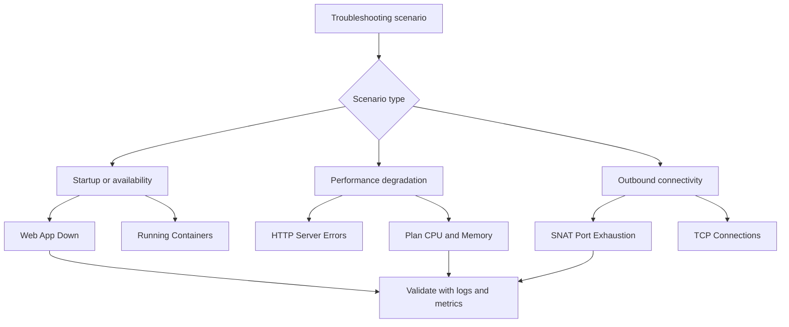

---
content_validation:
  status: verified
  last_reviewed: "2026-04-12"
  reviewer: agent
  core_claims:
    - claim: "Azure App Service Diagnostics includes detectors such as Web App Down and SNAT Port Exhaustion."
      source: "https://learn.microsoft.com/en-us/azure/app-service/overview-diagnostics"
      verified: true
    - claim: "Azure App Service diagnostics groups detectors into troubleshooting categories such as Availability and Performance, Deployment, and Networking."
      source: "https://learn.microsoft.com/en-us/azure/app-service/overview-diagnostics"
      verified: true
content_sources:
  diagrams:
    - id: troubleshooting-methodology-detector-map-diagram-1
      type: graph
      source: self-generated
      justification: "Self-generated troubleshooting diagram synthesized from Microsoft Learn diagnostics and Azure App Service incident guidance for this guide."
      based_on:
        - https://learn.microsoft.com/en-us/azure/app-service/troubleshoot-diagnostic-logs
        - https://learn.microsoft.com/en-us/azure/app-service/troubleshoot-http-502-http-503
---
# Detector Map

Quick reference for Azure App Service Diagnostics detectors relevant to Linux/OSS troubleshooting.

<!-- diagram-id: troubleshooting-methodology-detector-map-diagram-1 -->

```mermaid
graph TD
    A[Troubleshooting scenario] --> B{Scenario type}
    B --> C[Startup or availability]
    B --> D[Performance degradation]
    B --> E[Outbound connectivity]
    C --> F[Web App Down]
    C --> G[Running Containers]
    D --> H[HTTP Server Errors]
    D --> I[Plan CPU and Memory]
    E --> J[SNAT Port Exhaustion]
    E --> K[TCP Connections]
    F --> L[Validate with logs and metrics]
    I --> L
    J --> L
```

## How to Access

Navigate to your App Service in the Azure Portal → **Diagnose and solve problems**.

#### Portal view: Diagnose and solve problems hub (category landing)

![Azure portal Diagnose and solve problems blade for app-test-20251107 with the Common Solutions tab selected (AI-powered Diagnostics (preview) tab also visible) and a top toolbar showing a Search for common problems or tools search box, Refresh, and Feedback. A Risk alerts section shows a single Availability card with 2 Critical alerts and a View more details link. Seven Troubleshooting categories follow: Availability and Performance (Application Logs, App Down Workflow, Web App Down), Configuration and Management (Investigate EasyAuth errors, IP Address Configuration, All Scaling Operations), Risk Assessments (Availability risks, Configuration risks), Deployment (Troubleshoot), Networking (Troubleshoot), Diagnostic Tools (Auto-Heal, Network Troubleshooter, Advanced Application Restart), and Load Test your App (Create Load Test). A Popular troubleshooting tools list at the bottom shows Application Logs, App Down Workflow, Web App Down, Web App Slow, and Process Full List. Left nav highlights Diagnose and solve problems.](../../assets/troubleshooting/diagnose-and-solve/01-overview.png)

This is the landing page for every detector in the reference table below. The seven category cards map directly to the **Category** column - the visible quick links under **Availability and Performance** are `Application Logs`, `App Down Workflow`, and `Web App Down`, while **Networking** and **Configuration and Management** expose their own troubleshoot links (the table below maps the full detector set per category). The `Risk alerts` Availability card with `2 Critical` surfaces detectors that have already flagged anomalies for this app, so triaging risks here before running individual detectors is the fastest path to a hypothesis. The **Common Solutions** tab (currently selected) lists pre-built workflows; the adjacent **AI-powered Diagnostics (preview)** tab gives a synthesized narrative across detectors, but per the [Detector Limitations](#detector-limitations) section it remains a starting point - validate with logs.

## Detector Reference

| Detector | Category | What It Shows | When to Use | Related Playbook |
|----------|----------|--------------|-------------|-----------------|
| Web App Down | Availability | Whether the app is responding to requests | App not loading, 503 errors | container-didnt-respond-to-http-pings |
| Linux - Number of Running Containers | Availability | Container count over time, start/stop events | Startup failures, unexpected restarts | container-didnt-respond-to-http-pings |
| SNAT Port Exhaustion | Networking | SNAT port allocation and usage per instance | Outbound connection failures, intermittent timeouts | snat-or-application-issue |
| TCP Connections | Networking | Active TCP connections per instance | Connection leak detection, pool exhaustion | snat-or-application-issue |
| HTTP Server Errors | Performance | 5xx error trends over time | Intermittent server errors under load | intermittent-5xx-under-load |
| App Service Plan CPU | Performance | Plan-level CPU utilization percentage | Performance degradation investigation | slow-response-but-low-cpu |
| App Service Plan Memory | Performance | Plan-level memory utilization percentage | Memory pressure, gradual degradation | memory-pressure-and-worker-degradation |
| Application Logs | Diagnostics | App stdout/stderr output | Runtime errors, crash investigation | All playbooks |
| Deployment Logs | Configuration | Deployment history and status | Post-deployment failures | All startup playbooks |

#### Portal view: Web App Down detector (healthy baseline output)

![Azure portal Diagnose and solve problems blade scoped to the Web App Down detector for app-test-20251107. The detector header reads "Web App Down" with breadcrumb "Diagnose and solve problems > Availability and Performance > Web App Down". Two KPI tiles: App Availability 100% (blue) and Platform Availability 100% (green). Organic SLA shown as 100%. A green-bordered banner reads "No downtimes were identified for this Web App in the last 24 hours". Detector navigation list on the left shows related detectors including Container Issues, Linux CPU Drill Down, Linux Memory Drill Down, Web App Restarted, Web App Slow, SNAT Port Exhaustion, and HTTP Server Errors.](../../assets/troubleshooting/diagnose-and-solve/02-detector-web-app-down.png)

This is what `Web App Down` looks like when the app is healthy - both `App Availability` and `Platform Availability` at 100%, `Organic SLA: 100%`, and the explicit "No downtimes were identified" banner. The distinction between **App Availability** (your code responding) and **Platform Availability** (the App Service infrastructure healthy) is critical for triage: a low App Availability with high Platform Availability points to application/container issues (use `container-didnt-respond-to-http-pings`); a low Platform Availability points to platform incidents - check [Azure Status](https://status.azure.com/) before code changes. The left-rail detector list also reveals the sibling detectors you'd hop to next: `Container Issues`, `Linux CPU Drill Down`, `Web App Restarted`. The 24-hour scope shown here is the detector default and matches the **Time scope** limitation noted below.

## Detector Limitations

- **Data refresh delay**: 5–15 minute lag between an event and its appearance in diagnostics.
- **Sampling**: High-volume detectors may sample events rather than capturing every occurrence.
- **Linux coverage gaps**: Some Windows-only profiling tools (e.g., CLR Profiler) have no Linux equivalent.
- **Platform-level focus**: Detectors see stdout/stderr but cannot inspect application memory or stack without Application Insights.
- **Time scope**: Some detectors only analyze the last 24 hours — use Log Analytics directly for older data.
- **Starting point, not conclusion**: Detector output is a hypothesis generator. Always validate with logs and metrics.

## CLI Equivalents

```bash
# Application logs (same data as Application Logs detector)
az webapp log show --resource-group $RG --name $APP_NAME

# CPU metrics (same data as App Service Plan CPU detector)
az monitor metrics list --resource $RESOURCE_ID --metric "CpuPercentage" --interval PT5M

# Memory metrics (same data as App Service Plan Memory detector)
az monitor metrics list --resource $RESOURCE_ID --metric "MemoryPercentage" --interval PT5M

# Container log stream (useful for startup troubleshooting)
az webapp log tail --name $APP_NAME --resource-group $RG
```

| Command | Purpose |
|---------|---------|
| `az webapp log show --resource-group $RG --name $APP_NAME` | Shows the current App Service logging configuration and enabled log outputs for this web app. |
| `--resource-group $RG --name $APP_NAME` | Looks up the resource in this resource group. |
| `--name $APP_NAME` | Targets this web app. |
| `az monitor metrics list --resource $RESOURCE_ID --metric "CpuPercentage" --interval PT5M` | Fetches Azure Monitor metrics for the selected resource and incident window. |
| `--resource $RESOURCE_ID` | Scopes the metric query to this specific Azure resource. |
| `--metric "CpuPercentage"` | Requests exactly these metrics from Azure Monitor for this check. |
| `--interval PT5M` | Samples the metrics at this time granularity. |
| `az monitor metrics list --resource $RESOURCE_ID --metric "MemoryPercentage" --interval PT5M` | Fetches Azure Monitor metrics for the selected resource and incident window. |
| `--resource $RESOURCE_ID` | Scopes the metric query to this specific Azure resource. |
| `--metric "MemoryPercentage"` | Requests exactly these metrics from Azure Monitor for this check. |
| `--interval PT5M` | Samples the metrics at this time granularity. |
| `az webapp log tail --name $APP_NAME --resource-group $RG` | Streams live web app logs so you can watch startup, runtime, or dependency errors as they happen. |
| `--resource-group $RG` | Looks up the web app in this resource group. |
| `--name $APP_NAME --resource-group $RG` | Targets this web app. |

## See Also

- [Troubleshooting Method](troubleshooting-method.md)
- [Decision Tree](../decision-tree.md)
- [Evidence Map](../evidence-map.md)
- [First 10 Minutes Checklists](../first-10-minutes/index.md)

## Sources

- [Azure App Service diagnostics overview](https://learn.microsoft.com/en-us/azure/app-service/overview-diagnostics)
- [Monitor Azure App Service](https://learn.microsoft.com/en-us/azure/app-service/monitor-app-service)
