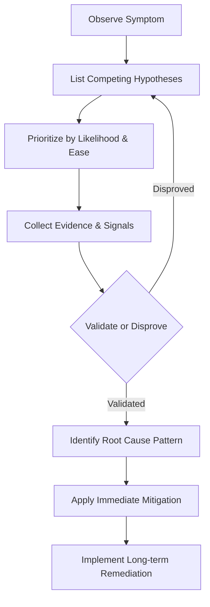

---
hide:
  - toc
content_validation:
  status: verified
  last_reviewed: "2026-04-12"
  reviewer: ai-agent
  core_claims:
    - claim: "Troubleshooting performance degradation in Azure App Service involves observing app behavior, collecting data, and mitigating the issue."
      source: "https://learn.microsoft.com/azure/app-service/troubleshoot-performance-degradation"
      verified: true
    - claim: "Azure App Service diagnostics is an interactive experience that helps troubleshoot apps with no configuration required."
      source: "https://learn.microsoft.com/azure/app-service/overview-diagnostics"
      verified: true
content_sources:
  diagrams:
    - id: troubleshooting-methodology-troubleshooting-method-diagram-1
      type: graph
      source: self-generated
      justification: "Self-generated troubleshooting diagram synthesized from Microsoft Learn diagnostics and Azure App Service incident guidance for this guide."
      based_on:
        - https://learn.microsoft.com/en-us/azure/app-service/troubleshoot-diagnostic-logs
        - https://learn.microsoft.com/en-us/azure/app-service/troubleshoot-http-502-http-503
---
# Troubleshooting Method

Troubleshooting complex issues in Azure App Service Linux requires more than just a list of steps. It requires a mindset that treats every failure as a mystery to be solved with evidence. The hypothesis-driven method documented here is designed to move you from ambiguous symptoms to concrete, data-backed conclusions. This structured approach is essential for identifying root causes in a platform where platform-level events can often look like application-level errors.

## Why Hypothesis-Driven Troubleshooting?

When an application fails in production, it is tempting to jump to the most familiar cause or the easiest mitigation. However, complex systems like App Service Linux often have multiple, overlapping causes for the same symptom.

- **Ambiguity and complexity**: A high CPU metric could mean an infinite loop in your code, or it could mean the underlying platform is struggling to schedule containers on a saturated node.
- **Multiple causes**: Sometimes, a problem is not caused by one single failure but by a combination of configuration errors and unexpected load.
- **Checklists alone are insufficient**: While checklists are useful for ensuring basic configuration is correct, they cannot resolve complex, multi-cause scenarios. They do not handle the ambiguity of many production issues.
- **Avoiding bias**: Engineers naturally gravitate toward the last issue they solved. A structured method forces you to consider alternative explanations you might otherwise overlook.
- **Efficiency**: By listing and prioritizing hypotheses, you avoid "rabbit holes" and focus your effort on the most likely or easiest-to-test causes first.
- **Structured approach**: This methodology ensures that you do not reach a premature conclusion based on a single, misleading signal.

## The Method Step-by-Step

The following seven steps form the foundation of every investigation in this repository.

### 1. Observe the Symptom

The first step is to describe what you see, not what you think is happening. Avoid using labels like "the app is down" or "it's slow." Instead, record specific observations.

- **What is happening?**: For example, "HTTP 502 Bad Gateway errors are occurring for 15% of all requests."
- **When is it happening?**: Is the issue constant, or does it spike at a specific time of day?
- **What is the scope?**: Does it affect all users, or only those in a specific region? Is only one endpoint slow, or is the entire application affected?
- **Be precise**: Use metrics and log timestamps to define the window of the issue. Avoid premature labeling or jumping to conclusions at this stage. Note the frequency and timing of every observable signal.

### 2. List Competing Hypotheses

Once you have a clear symptom, generate at least two to four plausible causes. Do not settle for just one. Force yourself to consider different domains:

- **Platform**: Could this be a platform upgrade, a noisy neighbor on the same node, or a regional outage?
- **Application**: Is there a memory leak, a thread pool exhaustion, or an unhandled exception in the code?
- **Dependency**: Is the database slow? Is an external API timing out? Is a cache layer unavailable?
- **Configuration**: Did a recent deployment change an environment variable, a VNet setting, or a scaling rule?

Each hypothesis must be independently falsifiable. This means you should be able to say, "If X is true, we will see Y in the logs." If Y is not present, the hypothesis is likely false.

### 3. Prioritize

You cannot investigate everything at once. Rank your hypotheses based on two criteria:

- **Likelihood**: How often have we seen this before? Does it match the observed signals?
- **Ease of validation**: Use the "cheapest test" principle. If one hypothesis can be checked in 30 seconds with a single portal metric, check it first, even if it is less likely than a more complex one.

### 4. Collect Evidence

Gather the data needed to test your hypotheses. In App Service Linux, this usually involves:

- **Metrics**: CPU, memory, network in/out, and average response time from the Azure portal.
- **Logs**:
    - **AppServiceHTTPLogs**: For understanding response codes and latencies.
    - **AppServiceConsoleLogs**: For application-level errors and stdout/stderr output.
    - **AppServicePlatformLogs**: For container start/stop events and platform-level health signals.
- **Detector Signals**: Use the "Diagnose and Solve Problems" tool in the Azure portal for automated insights and recommendations.
- **Configuration Snapshots**: Compare the current configuration to a known good state or a previous version.

All evidence must be time-correlated. A CPU spike that happened two hours after the outage is not relevant evidence for that outage.

### 5. Validate or Disprove Each Hypothesis

For each hypothesis, identify what signals would support it and what signals would weaken it.

- **Supportive Evidence**: "We suspect a memory leak. The memory metric shows a steady upward trend over the last 24 hours until the container restarted."
- **Contradictory Evidence**: "We suspected a platform restart, but the AppServicePlatformLogs show the container has been running for 10 days without interruption."

A hypothesis is disproved when its expected signals are absent and contradictory signals are present. Do not ignore data that does not fit your favorite theory.

### 6. Identify Root Cause Pattern

The surviving hypothesis with the strongest evidence becomes your working conclusion. Keep in mind that sometimes multiple causes contribute simultaneously. For example, a slow database might be the primary cause, but a small application thread pool might be making the impact much worse. Identifying the root cause pattern means connecting the validated hypothesis to a known platform behavior or application failure mode.

### 7. Apply Mitigation

Mitigation happens in two phases:

- **Immediate Mitigation**: Actions taken to reduce impact right now, such as scaling up, restarting the app, or rolling back a deployment. Document what was done and why it was effective.
- **Long-term Remediation**: Actions taken to prevent the issue from ever happening again, such as fixing the code bug, adding more robust health checks, or improving monitoring alerts.

Document the entire process from symptom to final remediation to ensure that the team can learn from the incident.

## Methodology Flowchart

<!-- diagram-id: troubleshooting-methodology-troubleshooting-method-diagram-1 -->

## Common Anti-Patterns

- **Jumping to the first plausible cause**: Never stop at the first thing that looks "broken." Many systems have minor, unrelated errors that are not the cause of the current outage.
- **Confirmation bias**: Only looking for evidence that supports your initial guess while ignoring data that suggests you are wrong.
- **Confusing correlation with causation**: Just because two things happened at the same time does not mean one caused the other. For example, a restart might have happened after an application crashed due to a memory leak. The restart is a symptom of the crash, not the cause of the outage.
- **Ignoring disproving evidence**: If a signal says your hypothesis is impossible, accept it and move on. Do not try to "explain away" inconvenient data because it doesn't fit your theory.
- **Fixing symptoms without understanding root cause**: Restarting an application every time it gets slow is a mitigation, not a fix. Without finding the underlying leak or bottleneck, the problem will always return.
- **Over-reliance on a single signal**: A CPU metric might look fine because the application is stuck waiting for a database response. One signal rarely tells the whole story.
- **Not recording what was checked**: Always keep a log of which hypotheses were ruled out and why. This prevents other engineers from repeating the same work later during the same incident.

## Evidence Hierarchy

Not all signals are created equal. Use this hierarchy to weight your findings:

1. **Direct Measurement (Strongest)**: Metrics and logs with precise timestamps that directly show the failure as it occurred.
2. **Cross-signal Correlation (Strong)**: When multiple independent sources (e.g., HTTP logs and database metrics) show a spike at the exact same millisecond.
3. **Configuration Inference (Moderate)**: Analyzing settings to see if they could cause the issue, such as a missing environment variable or an incorrect VNet configuration.
4. **Single Anecdotal Observation (Weak)**: A single user saying "it was slow for me once" without any supporting data from the logs or metrics.
5. **Speculation (Not Evidence)**: Assumptions about how the platform or the application works without any observable signals to back them up.

## Evidence Categories

Categorize evidence into five primary types to build a multidimensional view of an incident:

1.  **Metrics**: CPU/Memory utilization, latency percentiles (P90/P99), request counts, and SNAT port usage. Source: Azure Monitor.
2.  **Logs**: AppServiceHTTPLogs for traffic, AppServiceConsoleLogs for stack traces (stdout/stderr), and AppServicePlatformLogs for container lifecycle events. Source: Log Analytics.
3.  **Detectors**: High-level platform insights from the "Diagnose and solve problems" blade.
4.  **Configuration**: App settings, VNet integration, and scaling rules. Source: Configuration blade or `az webapp show`.
5.  **Runtime Behavior**: Observed HTTP responses (headers/body) and behavior under synthetic load. Source: `curl`, load testing.

## Key KQL Tables Reference

Use these tables in Log Analytics to extract evidence:

| Table | Description | Key Columns |
|-------|-------------|-------------|
| **AppServiceHTTPLogs** | HTTP request/response data for all traffic. | `ScStatus`, `TimeTaken`, `CsUriStem`, `SPort` |
| **AppServiceConsoleLogs** | Standard output and error from the container. | `ResultDescription`, `Host`, `ContainerId` |
| **AppServicePlatformLogs** | Events from the App Service platform. | `OperationName`, `ContainerId`, `ResultDescription` |
| **AppServiceAppLogs** | Custom application-level log messages. | `CustomLevel`, `ResultDescription`, `Logger` |

## How to Correlate Evidence

Evidence is most powerful when multiple signals align:

-   **Time-window alignment**: Compare different signals within the same window using `bin(TimeGenerated, 1m)` in KQL.
-   **Request correlation**: Trace a single request through HTTP and application logs using `Operation_Id` or `Request_Id`.
-   **Instance correlation**: Use the `Host` column to see if an issue is isolated to a single instance or spread across the plan.
-   **Deployment/Scale correlation**: Overlay deployment or autoscale timestamps with error patterns to identify regressions.

## Worked Example

**Scenario**: A web application is intermittently returning HTTP 500 errors.

1. **Observe the Symptom**: HTTP responses show 5% error rate on the /api/data endpoint. P95 latency for successful requests is 200ms. CPU and Memory are at 15%.
2. **List Hypotheses**:
    - **Hypothesis A**: Random platform blips in the region.
    - **Hypothesis B**: Unhandled exception in the application code for specific input.
    - **Hypothesis C**: Outbound SNAT port exhaustion when calling the backend database.
3. **Prioritize**: Hypothesis B is the easiest to check via logs. Hypothesis C can be checked via portal detectors. Hypothesis A is a last resort if all others are disproved.
4. **Collect Evidence**:
    - Check AppServiceConsoleLogs for stack traces and error messages.
    - Check the "SNAT Port Exhaustion" detector in the portal.
5. **Validate or Disprove**:
    - **Logs (Hypothesis B)**: Show "NullReferenceException" at DataService.cs:42 every time the error occurs. (Validated)
    - **Detectors (Hypothesis C)**: SNAT usage is at 2%, which is well below the limit. (Disproved)
6. **Identify Root Cause Pattern**: The code does not handle cases where the database returns an empty result set for certain IDs.
7. **Apply Mitigation**: Add a null check in the application code and deploy the fix. Add a unit test to cover this specific scenario in the future to prevent recurrence.

## See Also

- [Decision Tree](../decision-tree.md)
- [Evidence Map](../evidence-map.md)
- [Detector Map](detector-map.md)
- [First 10 Minutes Checklists](../first-10-minutes/index.md)

## Sources

- [Azure App Service diagnostics overview](https://learn.microsoft.com/en-us/azure/app-service/overview-diagnostics)
- [Monitor Azure App Service](https://learn.microsoft.com/en-us/azure/app-service/monitor-app-service)
- [Enable diagnostic logging for apps in Azure App Service](https://learn.microsoft.com/en-us/azure/app-service/troubleshoot-diagnostic-logs)
