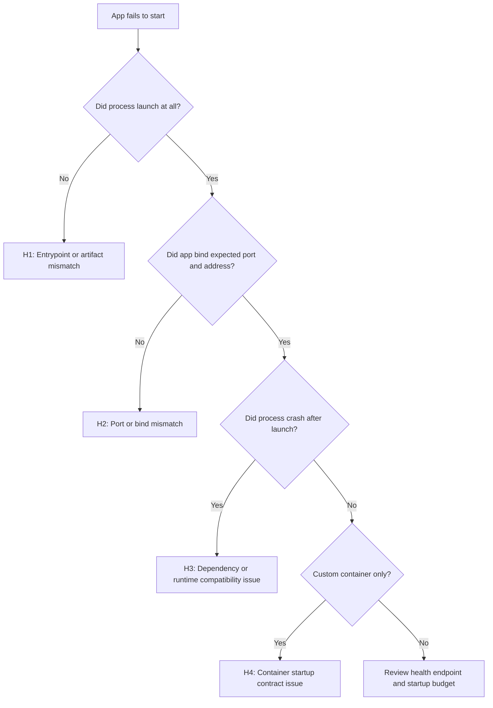

---
content_sources:
  diagrams:
    - id: app-startup-failures-flow
      type: flowchart
      source: self-generated
      justification: "Synthesized startup triage branches from Microsoft Learn guidance on App Service startup readiness, warm-up settings, and 502/503 troubleshooting."
      based_on:
        - https://learn.microsoft.com/en-us/azure/app-service/troubleshoot-http-502-http-503
        - https://learn.microsoft.com/en-us/azure/app-service/reference-app-settings
        - https://learn.microsoft.com/en-us/azure/app-service/configure-custom-container
content_validation:
  status: verified
  last_reviewed: "2026-04-12"
  reviewer: ai-agent
  core_claims:
    - claim: "Azure App Service provides built-in diagnostic logging to help debug app issues."
      source: "https://learn.microsoft.com/azure/app-service/troubleshoot-diagnostic-logs"
      verified: true
    - claim: "App Service supports deployment logging, and deployment logging happens automatically."
      source: "https://learn.microsoft.com/azure/app-service/troubleshoot-diagnostic-logs"
      verified: true
    - claim: "App Service streams console output and files ending in .txt, .log, or .htm from the /home/LogFiles directory."
      source: "https://learn.microsoft.com/azure/app-service/troubleshoot-diagnostic-logs"
      verified: true
    - claim: "For Linux or custom containers, Kudu log downloads include the contents of the /home/LogFiles directory."
      source: "https://learn.microsoft.com/azure/app-service/troubleshoot-diagnostic-logs"
      verified: true
---

# App Startup Failures

## 1. Summary

This playbook applies when an Azure App Service app deploys or restarts but never becomes reachable, repeatedly restarts, or fails to answer platform startup probes. Use it for built-in Linux stacks and custom containers when the main symptom is "the app will not start" rather than a later functional error.

### Symptoms

- The site returns `503 Service Unavailable` right after deployment or restart.
- The platform reports `Container didn't respond to HTTP pings on port`.
- Console logs show immediate crashes, missing modules, port-binding failures, or entrypoint errors.
- A custom container starts locally but never becomes ready on App Service.

### Common error messages

- `Container didn't respond to HTTP pings on port: 8000`.
- `ModuleNotFoundError`, `Cannot find module`, `ClassNotFoundException`, or `No such file or directory`.
- `Failed to start site. Revert by stopping site.`
- `Site startup probe failed after ... seconds.`
- `failed to bind`, `address already in use`, or `permission denied`.

<!-- diagram-id: app-startup-failures-flow -->


## 2. Common Misreadings

| Observation | Often Misread As | Actually Means |
|---|---|---|
| App Service says `Running` | Application is healthy | Control plane state only shows the site object is enabled, not that the worker is ready. |
| No console rows exist | Logging is broken | The process may have failed before meaningful stdout/stderr was emitted. |
| App works locally | Platform issue in Azure | Port, working directory, environment variables, and runtime image can differ in App Service. |
| HTTP 503 appears | Application generated the response | On startup incidents, 503 often comes from the platform while waiting for readiness. |
| Custom container image pulls successfully | Container contract is satisfied | The container can still fail due to wrong port, health behavior, or startup time. |

## 3. Competing Hypotheses

| Hypothesis | Likelihood | Key Discriminator |
|---|---|---|
| H1: Entrypoint, startup command, or artifact path is wrong | High | Console logs show command-not-found, module-not-found, or bad class/module reference. |
| H2: App binds the wrong port or address | High | Process starts, but no listener appears on the port App Service expects. |
| H3: Runtime or dependency mismatch causes a crash loop | High | Startup begins, then exits with missing package or incompatible runtime errors. |
| H4: Custom container startup contract is not met | Medium | Container image starts elsewhere but App Service cannot validate readiness in time. |
| H5: Slow initialization exceeds startup budget | Medium | Normal bootstrap eventually appears, but only after platform timeout. |

## 4. What to Check First

1. **Inspect current runtime stack and startup command**

    ```bash
    az webapp config show \
        --resource-group $RG \
        --name $APP_NAME \
        --query "{linuxFxVersion:linuxFxVersion,appCommandLine:appCommandLine,alwaysOn:alwaysOn}" \
        --output json
    ```

2. **Inspect startup-related app settings**

    ```bash
    az webapp config appsettings list \
        --resource-group $RG \
        --name $APP_NAME \
        --query "[?name=='WEBSITES_PORT' || name=='PORT' || name=='WEBSITES_CONTAINER_START_TIME_LIMIT' || name=='SCM_DO_BUILD_DURING_DEPLOYMENT'].{name:name,value:value}" \
        --output table
    ```

3. **Confirm site state and host inventory**

    ```bash
    az webapp show \
        --resource-group $RG \
        --name $APP_NAME \
        --query "{state:state,enabled:enabled,defaultHostName:defaultHostName}" \
        --output json
    ```

4. **If using containers, inspect container settings**

    ```bash
    az webapp config container show \
        --resource-group $RG \
        --name $APP_NAME \
        --output json
    ```

## 5. Evidence to Collect

Capture the first startup attempt after a restart or deployment. Later retries often hide the original failure mode.

### 5.1 KQL Queries

#### Query 1: Startup timeout and restart sequence

```kusto
AppServicePlatformLogs
| where TimeGenerated > ago(24h)
| where Message has_any ("startup probe failed", "ContainerTimeout", "Failed to start site", "terminated during site startup", "Restarting")
| project TimeGenerated, Level, Message
| order by TimeGenerated asc
```

| Column | Example data | Interpretation |
|---|---|---|
| `Message` | `Site startup probe failed after 44.1 seconds.` | The app did not become ready in time. |
| `Message` | `terminated during site startup` | Worker lifecycle ended before readiness. |
| `Level` | `Error` | Strong evidence of startup-phase failure rather than request-path regression. |

!!! tip "How to Read This"
    Read these rows as a lifecycle story: platform starts the site, waits, gives up, then stops it. That sequence narrows the issue to startup, not normal request handling.

#### Query 2: Console startup lines and fatal errors

```kusto
AppServiceConsoleLogs
| where TimeGenerated > ago(24h)
| where ResultDescription has_any ("Listening at", "Starting", "ModuleNotFoundError", "Cannot find module", "ClassNotFoundException", "address already in use", "permission denied")
| project TimeGenerated, Level, ResultDescription
| order by TimeGenerated asc
```

| Column | Example data | Interpretation |
|---|---|---|
| `ResultDescription` | `Listening at: http://0.0.0.0:8000` | Confirms the process started and bound correctly. |
| `ResultDescription` | `ModuleNotFoundError: No module named 'app'` | Entrypoint or artifact path mismatch. |
| `ResultDescription` | `Error: listen EACCES` | Port or permission contract is broken. |

!!! tip "How to Read This"
    One positive listener line can disprove H1. One fatal import or bind line can almost close the incident immediately.

#### Query 3: HTTP symptoms during startup failure

```kusto
AppServiceHTTPLogs
| where TimeGenerated > ago(24h)
| summarize Requests=count(), P95=percentile(TimeTaken,95) by bin(TimeGenerated, 5m), ScStatus
| where ScStatus >= 500
| order by TimeGenerated asc
```

| Column | Example data | Interpretation |
|---|---|---|
| `ScStatus` | `503` | Often platform-generated unavailability during startup. |
| `P95` | `49982` | Long waits strongly suggest readiness timeout behavior. |
| `Requests` | `210` | External health checks or user traffic observed the failure. |

!!! tip "How to Read This"
    Uniform `503` plus near-identical long latency values usually means the app never became probe-ready rather than producing its own error pages.

### 5.2 CLI Investigation

```bash
# Show runtime stack and startup command
az webapp config show \
    --resource-group $RG \
    --name $APP_NAME \
    --query "{linuxFxVersion:linuxFxVersion,appCommandLine:appCommandLine}" \
    --output json
```

Sample output:

```json
{
  "appCommandLine": "gunicorn --bind 0.0.0.0:8000 src.app:app",
  "linuxFxVersion": "PYTHON|3.11"
}
```

Interpretation:

- Compare the command to the actual project layout.
- Confirm the runtime stack matches the application expectations.

```bash
# Show startup-related app settings
az webapp config appsettings list \
    --resource-group $RG \
    --name $APP_NAME \
    --query "[?name=='WEBSITES_PORT' || name=='PORT' || name=='WEBSITES_CONTAINER_START_TIME_LIMIT'].{name:name,value:value}" \
    --output table
```

Sample output:

```text
Name                                   Value
-------------------------------------  -----
WEBSITES_PORT                          8000
WEBSITES_CONTAINER_START_TIME_LIMIT    230
```

Interpretation:

- `WEBSITES_PORT` must align with the listener inside the app or container.
- A longer startup budget can help only after fixing real startup inefficiency or dependency delays.

## 6. Validation and Disproof by Hypothesis

### H1: Entrypoint, startup command, or artifact path mismatch

**Proves if** the first fatal message is command-not-found, import-not-found, bad module path, or missing startup file.

**Disproves if** the app starts and listens successfully.

Validation steps:

1. Compare startup command to deployed artifact layout.
2. Confirm the working module/class/file exists where the runtime expects it.
3. If using build-on-deploy, confirm the generated output preserves the needed entrypoint.

### H2: Port or bind mismatch

**Proves if** logs show the process listening on a different port, localhost only, or failing to bind.

**Disproves if** the app listens on `0.0.0.0` and the expected port.

Validation steps:

1. Compare `WEBSITES_PORT` or `PORT` with the actual listener log line.
2. Ensure custom containers expose the same port they advertise to App Service.
3. Avoid hardcoding localhost bindings.

### H3: Runtime or dependency mismatch

**Proves if** the process starts, then crashes with missing package, incompatible runtime, or native dependency errors.

**Disproves if** the same runtime and dependency set stays stable long enough to serve healthy requests.

Validation steps:

1. Confirm the language/runtime version in App Service matches the app assumptions.
2. Reconcile dependency installation method with deployment method.
3. Check for native library requirements and architecture mismatches.

### H4: Custom container startup contract issue

**Proves if** the image is pulled but App Service never gets a valid readiness response.

**Disproves if** built-in stacks show the same failure or the container logs show a correct listener quickly.

Validation steps:

1. Verify exposed port, listener address, and startup command inside the image.
2. Reduce startup work that blocks readiness.
3. Keep the first health endpoint lightweight and unauthenticated.

## 7. Likely Root Cause Patterns

| Pattern | Evidence | Resolution |
|---|---|---|
| Wrong module/class path | Import or startup command error in console logs | Fix startup command to match artifact layout. |
| Wrong port binding | Listener uses another port or localhost | Bind `0.0.0.0` to the expected port. |
| Missing dependencies | Immediate crash after startup begins | Rebuild artifact or enable correct build automation. |
| Slow cold initialization | Logs eventually show readiness after timeout | Optimize startup path and use lighter warm-up behavior. |
| Container contract mismatch | Custom image starts elsewhere but not on App Service | Align image entrypoint, exposed port, and readiness behavior. |

## 8. Immediate Mitigations

1. Restart once only after capturing logs from the first failing attempt.
2. Revert to the last known good package or image if production is affected.
3. Correct obvious startup command and port mismatches before changing timeout values.
4. For slot-based releases, validate staging startup on its own hostname before swap.
5. If initialization is heavy, temporarily remove nonessential bootstrap work from the critical path.
6. Re-test with one clear startup timeline and confirm healthy HTTP responses appear.

## 9. Prevention

### Prevention checklist

- [ ] Keep startup commands version-controlled and reviewed with each repo layout change.
- [ ] Standardize one port-binding convention across environments.
- [ ] Capture startup logs centrally in Log Analytics or Application Insights.
- [ ] Test startup on a staging slot before production promotion.
- [ ] Keep readiness endpoints lightweight and free from expensive dependency checks.

## See Also

- [Playbooks](index.md)
- [Container Didn't Respond to HTTP Pings](startup-availability/container-didnt-respond-to-http-pings.md)
- [Deployment Succeeded but Startup Failed](startup-availability/deployment-succeeded-startup-failed.md)
- [Health and Recovery Operations](../../operations/health-recovery.md)

## Sources

- [Troubleshoot container startup in Azure App Service (Microsoft Learn)](https://learn.microsoft.com/en-us/azure/app-service/configure-custom-container#troubleshoot-custom-containers)
- [Configure a custom startup file for Azure App Service Linux (Microsoft Learn)](https://learn.microsoft.com/en-us/azure/app-service/configure-language-python#customize-startup-command)
- [Enable diagnostics logging for Azure App Service (Microsoft Learn)](https://learn.microsoft.com/en-us/azure/app-service/troubleshoot-diagnostic-logs)
