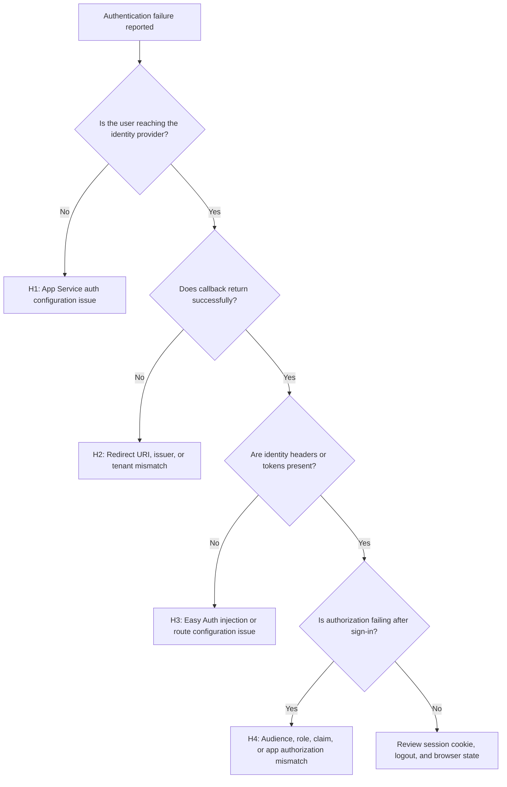

---
hide:
  - toc
content_sources:
  diagrams:
    - id: authentication-failures-flow
      type: flowchart
      source: self-generated
      justification: "Synthesized App Service authentication failure paths from Microsoft Learn guidance on built-in auth configuration, redirect handling, and slot-specific auth behavior."
      based_on:
        - https://learn.microsoft.com/en-us/azure/app-service/overview-authentication-authorization
        - https://learn.microsoft.com/en-us/azure/app-service/deploy-staging-slots
---

# Authentication Failures

## 1. Summary

This playbook applies when Azure App Service Authentication (Easy Auth), Microsoft Entra ID integration, login redirects, token injection, or identity-based access flows stop working. Use it when users cannot sign in, APIs return unauthorized responses unexpectedly, or App Service-managed identity context is missing or inconsistent.

### Symptoms

- Users are redirected in loops during sign-in.
- The app returns `401`, `403`, or provider callback errors after authentication.
- `X-MS-*` identity headers are missing when the app expects Easy Auth.
- Token store or identity provider changes broke login, logout, or callback behavior.

### Common error messages

- `401 Unauthorized` or `403 Forbidden`.
- `AADSTS50011` redirect URI mismatch.
- `The reply URL specified in the request does not match the reply URLs configured`.
- `App Service Authentication is not configured correctly`.
- `IDX10214` audience validation failed or issuer/tenant mismatch errors.

<!-- diagram-id: authentication-failures-flow -->


## 2. Common Misreadings

| Observation | Often Misread As | Actually Means |
|---|---|---|
| `401` from one endpoint | Identity provider outage | Route-level auth or audience configuration may be wrong while sign-in itself works. |
| Login page appears | Easy Auth is fully configured | Provider registration, callback URL, and issuer settings may still be incorrect. |
| `X-MS-CLIENT-PRINCIPAL` missing locally | App Service auth is broken | Those headers are injected only when the request passes through App Service Authentication. |
| `403` after successful login | User typed the wrong password | Authentication succeeded, but claims, role mapping, or app authorization failed. |
| Redirect loop | Browser cache only | Redirect URI mismatch, HTTPS enforcement, or multiple auth layers can create deterministic loops. |

## 3. Competing Hypotheses

| Hypothesis | Likelihood | Key Discriminator |
|---|---|---|
| H1: App Service Authentication is disabled or misconfigured | High | CLI auth settings do not match the intended provider and unauthenticated action. |
| H2: Redirect URI, issuer, tenant, or callback mismatch | High | The provider returns explicit callback or reply URL errors such as `AADSTS50011`. |
| H3: Easy Auth headers/tokens are not reaching the app | Medium | Sign-in appears successful, but `X-MS-*` headers or token store context are absent. |
| H4: Authorization fails after authentication | High | Users authenticate but receive `403`, missing roles, or audience/claim validation failures. |
| H5: Multiple auth layers or stale session state cause loops | Medium | Browser redirect loops or unexpected challenge behavior occur despite valid base config. |

## 4. What to Check First

1. **Inspect App Service auth configuration**

    ```bash
    az webapp auth show \
        --resource-group $RG \
        --name $APP_NAME \
        --output json
    ```

2. **Inspect Microsoft provider settings**

    ```bash
    az webapp auth microsoft show \
        --resource-group $RG \
        --name $APP_NAME \
        --output json
    ```

3. **Confirm app state and hostnames used in callback URLs**

    ```bash
    az webapp show \
        --resource-group $RG \
        --name $APP_NAME \
        --query "{defaultHostName:defaultHostName,hostNames:hostNames,httpsOnly:httpsOnly}" \
        --output json
    ```

4. **Review related app settings**

    ```bash
    az webapp config appsettings list \
        --resource-group $RG \
        --name $APP_NAME \
        --query "[?contains(name, 'WEBSITE_AUTH') || contains(name, 'MICROSOFT_PROVIDER')].{name:name,value:value}" \
        --output table
    ```

## 5. Evidence to Collect

Capture the full login journey: initial request, redirect to provider, callback, final app response, and any header/claim evidence at the app boundary.

### 5.1 KQL Queries

#### Query 1: HTTP status and auth path behavior

```kusto
AppServiceHTTPLogs
| where TimeGenerated > ago(24h)
| where CsUriStem has_any ("/.auth", "/signin", "/login", "/api") or ScStatus in (401, 403)
| summarize Requests=count(), P95=percentile(TimeTaken,95) by CsUriStem, ScStatus
| order by Requests desc
```

| Column | Example data | Interpretation |
|---|---|---|
| `CsUriStem` | `/.auth/login/aad/callback` | Callback path visibility helps isolate H2. |
| `ScStatus` | `401` | Challenge or failed auth behavior. |
| `ScStatus` | `403` | Auth succeeded but authorization likely failed. |
| `Requests` | `380` | Repeated callback hits with no success can indicate redirect loop behavior. |

!!! tip "How to Read This"
    Separate `401` from `403`. They point to different stages of failure: authentication challenge versus post-login authorization rejection.

#### Query 2: Console or app-side auth errors

```kusto
AppServiceConsoleLogs
| where TimeGenerated > ago(24h)
| where ResultDescription has_any ("AADSTS", "IDX", "Unauthorized", "Forbidden", "token", "claims", "issuer", "audience")
| project TimeGenerated, Level, ResultDescription
| order by TimeGenerated desc
```

| Column | Example data | Interpretation |
|---|---|---|
| `ResultDescription` | `AADSTS50011: The redirect URI ... does not match` | Strong proof of H2. |
| `ResultDescription` | `IDX10214: Audience validation failed` | Authentication completed but app-side validation rejects the token. |
| `ResultDescription` | `missing X-MS-CLIENT-PRINCIPAL` | Easy Auth header injection did not reach the expected code path. |

!!! tip "How to Read This"
    Console logs are especially valuable when the app performs additional token validation beyond Easy Auth.

#### Query 3: Application Insights failed requests by result code (if enabled)

```kusto
requests
| where timestamp > ago(24h)
| where resultCode in ("401", "403", "500")
| summarize Requests=count(), P95=percentile(duration,95) by name, resultCode, success
| order by Requests desc
```

| Column | Example data | Interpretation |
|---|---|---|
| `name` | `GET /api/admin` | Highlights which protected endpoint is failing most. |
| `resultCode` | `403` | Usually an authorization or role claim issue. |
| `success` | `false` | Confirms the failure is app-observed, not only browser-perceived. |

!!! tip "How to Read This"
    If only a subset of protected routes fail, look beyond provider registration and into route-level authorization assumptions.

### 5.2 CLI Investigation

```bash
# Show App Service auth configuration
az webapp auth show \
    --resource-group $RG \
    --name $APP_NAME \
    --output json
```

Sample output:

```json
{
  "enabled": true,
  "runtimeVersion": "~1",
  "unauthenticatedClientAction": "RedirectToLoginPage"
}
```

Interpretation:

- `enabled` must be true for Easy Auth scenarios.
- `unauthenticatedClientAction` must match the app type: redirect for browsers, 401 patterns for APIs.

```bash
# Show Microsoft identity provider configuration
az webapp auth microsoft show \
    --resource-group $RG \
    --name $APP_NAME \
    --output json
```

Sample output:

```json
{
  "clientId": "<app-registration-client-id>",
  "enabled": true,
  "loginParameters": [],
  "registration": {
    "openIdIssuer": "https://login.microsoftonline.com/<tenant-id>/v2.0"
  }
}
```

Interpretation:

- Client ID, issuer, and callback host assumptions must match the Entra app registration.
- Tenant mismatch here explains many immediate login failures.

## 6. Validation and Disproof by Hypothesis

### H1: App Service Authentication misconfiguration

**Proves if** auth settings are disabled, inconsistent, or not aligned with the intended unauthenticated behavior.

**Disproves if** Easy Auth is enabled correctly and provider configuration matches design.

Validation steps:

1. Confirm auth is enabled and the desired provider is active.
2. Check whether browser apps use redirect mode and APIs use the expected auth response pattern.
3. Remove overlapping app-side auth middleware only if it is clearly duplicating Easy Auth behavior.

### H2: Redirect URI, issuer, or tenant mismatch

**Proves if** the provider returns explicit reply URL or issuer errors.

**Disproves if** callback completes cleanly and headers appear in the app.

Validation steps:

1. Compare current hostnames with Entra app registration redirect URIs.
2. Ensure HTTPS-only and canonical hostname choices align with provider config.
3. Re-test after one coordinated update rather than many partial changes.

### H3: Missing Easy Auth headers or tokens

**Proves if** sign-in succeeds but app code never receives `X-MS-*` context where expected.

**Disproves if** the app consistently sees injected identity headers after callback.

Validation steps:

1. Validate the request path is truly traversing App Service Authentication.
2. Confirm the app is not bypassing the front end with unsupported direct assumptions.
3. Check token store or forwarded header expectations only after provider sign-in is confirmed healthy.

### H4: Authorization mismatch after successful authentication

**Proves if** the user signs in but only protected routes or specific roles fail.

**Disproves if** all login attempts fail before callback or header injection.

Validation steps:

1. Compare required roles, audiences, and claims to the actual principal.
2. Inspect app-side token validation errors.
3. Test with a user known to have the intended group or app-role assignment.

## 7. Likely Root Cause Patterns

| Pattern | Evidence | Resolution |
|---|---|---|
| Redirect URI mismatch | `AADSTS50011` in callback flow | Update Entra app registration and App Service host assumptions. |
| Wrong unauthenticated action | Browser/API challenge behavior is unexpected | Align auth policy with app type. |
| Missing identity headers | Login appears successful but app sees anonymous request | Ensure request flows through Easy Auth and app expects `X-MS-*` only in App Service. |
| Claim or audience mismatch | `403` or `IDX` errors after login | Fix app roles, allowed audiences, or issuer validation. |
| Dual auth layers | Redirect loops or conflicting challenges | Simplify to one clear authentication boundary. |

## 8. Immediate Mitigations

1. If production login is broken, revert the most recent auth configuration or provider registration change.
2. For redirect URI errors, fix the callback URLs before changing token validation logic.
3. If only specific protected APIs fail, temporarily relax app-side authorization only when business risk permits and only long enough to restore service.
4. Remove duplicate redirect or auth middleware that competes with Easy Auth.
5. Re-test with one known-good user and capture the full callback path before widening changes.

## 9. Prevention

### Prevention checklist

- [ ] Keep App Service auth settings and Entra app registration changes under change control.
- [ ] Document canonical hostnames and callback URLs for every environment.
- [ ] Test both browser sign-in and API authorization paths after changes.
- [ ] Monitor spikes in `401`, `403`, and callback failures.
- [ ] Avoid stacking multiple authentication layers unless the ownership boundary is explicit.

## See Also

- [Playbooks](index.md)
- [Authentication Architecture](../../platform/authentication-architecture.md)
- [Security Operations](../../operations/security.md)
- [Easy Auth](../../language-guides/python/recipes/easy-auth.md)

## Sources

- [Authentication and authorization in Azure App Service (Microsoft Learn)](https://learn.microsoft.com/en-us/azure/app-service/overview-authentication-authorization)
- [Tutorial: Authenticate users end-to-end in Azure App Service (Microsoft Learn)](https://learn.microsoft.com/en-us/azure/app-service/tutorial-auth-aad)
- [Configure Microsoft identity provider authentication for App Service (Microsoft Learn)](https://learn.microsoft.com/en-us/azure/app-service/configure-authentication-provider-aad)
