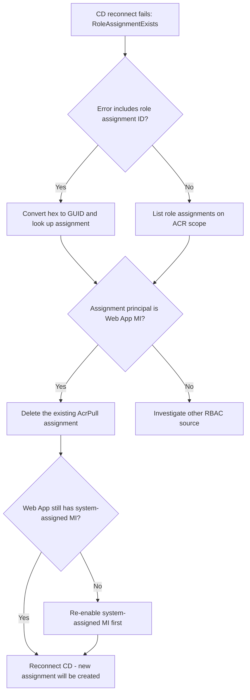

# Continuous Deployment RBAC Role Assignment Conflict

## 1. Summary

### Symptom

When you reconnect (or first connect) Deployment Center container continuous deployment for an App Service Web App that uses **Managed Identity** to pull from Azure Container Registry, the Portal or `az deployment group create` returns:

```text
RoleAssignmentExists: The role assignment already exists.
The ID of the existing role assignment is <32-char-hex>.
```

The error appears during the deployment step that grants the Web App's system-assigned managed identity the `AcrPull` role on the registry. The CD setup fails atomically: the GitHub Actions workflow may still be committed, but the Azure-side image-pull permission setup did not complete cleanly. The Web App itself continues to serve the previously deployed image, but the next pull attempt with a new image tag will fail with an authentication error if the AcrPull assignment is in an inconsistent state.

### Why this scenario is confusing

The error message suggests something about the *new* assignment is wrong, but the actual cause is leftover state from the *previous* CD setup or from a separate IaC/manual grant. The Deployment Center "Disconnect" action removes the GitHub-side artifacts (workflow file, secrets) and clears site config bindings, but it does **not** reliably delete the AcrPull role assignment that was granted to the Web App's managed identity on the registry.

When you reconnect using the same Web App (same managed identity principal) and the same registry, ARM tries to create a role assignment with the same `(scope, principalId, roleDefinitionId)` triple but with a freshly generated assignment GUID. Azure RBAC rejects this because that triple is the unique key for a role assignment — you cannot have two assignments of the same role to the same principal on the same scope.

It is also confusing because the error refers to a role assignment ID, not to the principal or the role name, so you cannot tell from the message alone which permission is conflicting.

!!! info "Why ad-hoc CLI testing does not reproduce this"
    `az role assignment create --assignee-object-id <id> --role AcrPull --scope <acr>` is idempotent in modern Azure CLI: when the same `(scope, principal, role)` triple already exists, it returns the existing assignment instead of failing. The `RoleAssignmentExists` error surfaces only through ARM deployments — including Deployment Center, the Portal CD wizard, and any Bicep or ARM template — because they create a `Microsoft.Authorization/roleAssignments` resource with a freshly generated assignment GUID on every run. The new GUID conflicts with the existing assignment's unique key, and ARM does not silently swallow the duplicate the way the CLI does.

### Troubleshooting decision flow

<!-- diagram-id: troubleshooting-decision-flow -->


## 2. Common Misreadings

- "Disconnect cleans up everything." Disconnect removes GitHub workflow and site config bindings only; the AcrPull role assignment on the registry usually remains.
- "Recreating the Web App fixed identity, so RBAC must be clean too." Deleting the Web App removes its managed identity principal, but the orphaned role assignment lingers (assignment principal is now a deleted object) until explicitly removed.
- "The error mentions a new role assignment, so the new one is malformed." The error is a uniqueness conflict — the old assignment exists and blocks the new identical one.
- "Just retry the wizard." Retrying produces the same conflict because the offending assignment is still there.
- "I should grant a different role." The container pull path requires `AcrPull` specifically (or a custom role with `Microsoft.ContainerRegistry/registries/pull/read`). Granting `Reader` or `Contributor` does not satisfy `acrUseManagedIdentityCreds`.

## 3. Competing Hypotheses

| Hypothesis | Typical Evidence For | Typical Evidence Against |
|---|---|---|
| H1: Orphaned AcrPull assignment from previous Deployment Center CD setup | Error includes role assignment ID; `az role assignment show` returns an `AcrPull` assignment whose principal is the current Web App's MI | The principal in the conflicting assignment is unrelated to this Web App |
| H2: AcrPull was previously granted by IaC (Bicep, Terraform, ARM) and Deployment Center is now trying to re-grant it | A Bicep/Terraform module in the repo or a prior deployment shows a `Microsoft.Authorization/roleAssignments` resource on the same ACR scope for the same principal | No IaC artifact references this ACR scope |
| H3: Orphaned assignment from a deleted Web App reusing the same name | The assignment's `principalId` cannot be resolved in Microsoft Entra ID; `az ad sp show --id <principalId>` returns "not found" | Principal resolves and matches the current Web App's `identity.principalId` |
| H4: AcrPull was granted manually for testing | Conflicting principal is a user account (`principalType: User`) or a service principal unrelated to the Web App | Principal matches the Web App's system-assigned MI |
| H5: Same registry shared by multiple Web Apps, all granted at once via a script | Multiple Web App MIs hold AcrPull on this ACR, including the current one | Only one matching assignment exists on this ACR |

## 4. What to Check First

### Error message details

The error returned by the deployment includes the conflicting role assignment ID without hyphens:

```text
The ID of the existing role assignment is 561ed7ada306588a8d5f2746e0ae4fca
```

Convert this 32-character hex string into a standard GUID by inserting hyphens at positions 8, 12, 16, and 20:

```text
561ed7ad-a306-588a-8d5f-2746e0ae4fca
```

### Platform Signals

```bash
SUBSCRIPTION_ID="<subscription-id>"
ROLE_ASSIGNMENT_ID="561ed7ad-a306-588a-8d5f-2746e0ae4fca"

az role assignment list \
    --subscription "$SUBSCRIPTION_ID" \
    --query "[?name=='$ROLE_ASSIGNMENT_ID']" \
    --output json

az role assignment show \
    --ids "/subscriptions/$SUBSCRIPTION_ID/providers/Microsoft.Authorization/roleAssignments/$ROLE_ASSIGNMENT_ID" \
    --output json
```

The output reveals the principal ID, role definition (`AcrPull`), and scope (the registry) of the conflicting assignment, which is enough to confirm hypothesis H1 or H2.

### Cross-check related leftovers

```bash
RG="<your-resource-group>"
APP_NAME="<your-web-app-name>"
ACR_NAME="<your-acr-name>"

ACR_ID=$(az acr show --name "$ACR_NAME" --resource-group "$RG" --query id --output tsv)
APP_PRINCIPAL_ID=$(az webapp identity show --name "$APP_NAME" --resource-group "$RG" --query principalId --output tsv)

az role assignment list --scope "$ACR_ID" --output table
az role assignment list --assignee "$APP_PRINCIPAL_ID" --all --output table
az webapp config show --name "$APP_NAME" --resource-group "$RG" \
    --query "{linuxFxVersion:linuxFxVersion, acrUseManagedIdentityCreds:acrUseManagedIdentityCreds, acrUserManagedIdentityID:acrUserManagedIdentityID}" \
    --output table
```

The `acrUseManagedIdentityCreds: true` setting confirms the Web App expects to authenticate to ACR via its own MI. If `acrUserManagedIdentityID` is set, a user-assigned MI is in use instead — adjust the principal lookup accordingly (`az identity show`).

## 5. Evidence to Collect

### Required Evidence

| Evidence | Command/Query | Purpose |
|---|---|---|
| Conflicting assignment details | `az role assignment show --ids "/subscriptions/$SUBSCRIPTION_ID/providers/Microsoft.Authorization/roleAssignments/$ROLE_ASSIGNMENT_ID" --output json` | Identifies principal, role, and scope of the blocking assignment |
| All role assignments on ACR | `az role assignment list --scope "$ACR_ID" --output table` | Reveals all CD-related and unrelated assignments on registry scope |
| All role assignments held by Web App MI | `az role assignment list --assignee "$APP_PRINCIPAL_ID" --all --output table` | Confirms whether the Web App MI already holds AcrPull and on which scope |
| Web App identity state | `az webapp identity show --name "$APP_NAME" --resource-group "$RG"` | Confirms the system-assigned MI is enabled and returns `principalId` |
| Web App container config | `az webapp config show --name "$APP_NAME" --resource-group "$RG" --query "{linuxFxVersion:linuxFxVersion, acrUseManagedIdentityCreds:acrUseManagedIdentityCreds}"` | Confirms the Web App is configured to pull via MI from ACR |

### Useful Context

- Record when the previous CD was disconnected and what cleanup was performed (workflow deletion, site config update, role assignment delete attempts).
- Record whether the previous CD used a system-assigned managed identity, a user-assigned managed identity, admin credentials, or a service principal.
- Record whether the same Web App or a recreated one with the same name is involved.
- Record whether AcrPull was ever granted by IaC outside of Deployment Center (Bicep, Terraform, manual `az role assignment create`).

## 6. Validation and Disproof by Hypothesis

### H1: Orphaned AcrPull assignment from previous Deployment Center CD setup

**Signals that support:**

- `az role assignment show` returns an assignment whose `roleDefinitionName` is `AcrPull` on the ACR scope.
- The `principalId` matches the current Web App's `identity.principalId`.
- The `createdOn` timestamp predates the current reconnect attempt and lines up with a previous Deployment Center configuration date.

**Signals that weaken:**

- The assignment was created today and references a principal you provisioned manually.
- The principal is unrelated to the Web App.

**What to verify:**

```bash
az role assignment show \
    --ids "/subscriptions/$SUBSCRIPTION_ID/providers/Microsoft.Authorization/roleAssignments/$ROLE_ASSIGNMENT_ID" \
    --query "{principal:principalId, role:roleDefinitionName, scope:scope, created:createdOn}" \
    --output json

az webapp identity show --name "$APP_NAME" --resource-group "$RG" --query principalId --output tsv
```

If both `principalId` values match and `roleDefinitionName` is `AcrPull` scoped to the ACR, H1 is confirmed.

### H2: AcrPull was previously granted by IaC and Deployment Center is now trying to re-grant it

**Signals that support:**

- Repository contains a Bicep/Terraform module that creates `Microsoft.Authorization/roleAssignments` for `7f951dda-4ed3-4680-a7ca-43fe172d538d` (the AcrPull built-in role) on this ACR scope.
- The most recent successful deployment of that module precedes the failed Deployment Center attempt.
- `az deployment group list --resource-group "$RG" --output table` shows a prior `Succeeded` deployment that granted the same assignment.

**Signals that weaken:**

- No IaC artifact references this ACR scope.
- The IaC-managed assignment principal is different from the Web App MI.

**What to verify:** Search the repository for `7f951dda-4ed3-4680-a7ca-43fe172d538d` or `'AcrPull'` in Bicep/Terraform files. Confirm the deployment history with `az deployment group list`.

### H3: Orphaned assignment from a deleted Web App reusing the same name

**Signals that support:**

- The `principalId` in the conflicting assignment cannot be resolved to an active object in Microsoft Entra ID.
- `az ad sp show --id <principalId>` returns "not found" (the previous Web App's MI was deleted with the previous Web App).
- The current Web App has a different `principalId` from the one in the assignment.

**Signals that weaken:**

- The principal resolves and equals the current Web App's `principalId`.

**What to verify:**

```bash
PRINCIPAL_ID=$(az role assignment show \
    --ids "/subscriptions/$SUBSCRIPTION_ID/providers/Microsoft.Authorization/roleAssignments/$ROLE_ASSIGNMENT_ID" \
    --query principalId --output tsv)
az ad sp show --id "$PRINCIPAL_ID" --output json 2>&1 || echo "principal does not exist"
```

### H4: AcrPull was granted manually for testing

**Signals that support:**

- `principalType` in the conflicting assignment is `User`, or it is a service principal unrelated to App Service.

**Signals that weaken:**

- The principal matches the Web App MI exactly.

**What to verify:**

```bash
az role assignment show \
    --ids "/subscriptions/$SUBSCRIPTION_ID/providers/Microsoft.Authorization/roleAssignments/$ROLE_ASSIGNMENT_ID" \
    --query "principalType" \
    --output tsv
```

### H5: Same registry shared by multiple Web Apps, all granted at once via a script

**Signals that support:**

- `az role assignment list --scope "$ACR_ID" --query "[?roleDefinitionName=='AcrPull']" --output table` returns multiple assignments, one per Web App MI sharing the registry.
- The current Web App's MI appears in that list with a `createdOn` value that predates the current reconnect attempt.

**Signals that weaken:**

- Only one AcrPull assignment exists on this ACR.

**What to verify:**

```bash
az role assignment list --scope "$ACR_ID" \
    --query "[?roleDefinitionName=='AcrPull'].{principalId:principalId, principalName:principalName, createdOn:createdOn}" \
    --output table
```

## 7. Likely Root Cause Patterns

| Pattern | Frequency | First Signal | Typical Resolution |
|---|---|---|---|
| Orphaned `AcrPull` assignment from previous Deployment Center CD setup | High | Error references registry scope; `principalId` equals current Web App MI | Delete the orphaned assignment by ID, then reconnect |
| Re-grant attempted on top of an IaC-managed AcrPull assignment | High | Repo contains Bicep/Terraform that grants AcrPull on this ACR | Skip the Deployment Center role assignment step (use IaC as the single source of truth) or delete the IaC-managed assignment before letting Deployment Center own it |
| Stale assignment whose principal is a deleted Web App MI | Medium | `az ad sp show --id <principalId>` returns "not found" | Delete the orphaned assignment by ID |
| Manual test grant left in place | Low | `principalType` is `User` or unrelated SP | Delete the manual assignment, then reconnect |
| Deployment Center retries on the same ACR after a previous successful grant | Low | First Deployment Center attempt succeeded; second attempt with a different image fails | Delete the existing assignment, then let Deployment Center recreate it cleanly |

## 8. Immediate Mitigations

1. Convert the role assignment ID from the error message into GUID format and capture the assignment details.

    ```bash
    SUBSCRIPTION_ID="<subscription-id>"
    ROLE_ASSIGNMENT_ID="561ed7ad-a306-588a-8d5f-2746e0ae4fca"
    az role assignment show \
        --ids "/subscriptions/$SUBSCRIPTION_ID/providers/Microsoft.Authorization/roleAssignments/$ROLE_ASSIGNMENT_ID" \
        --output json
    ```

2. Confirm the conflicting principal is the current Web App's managed identity.

    ```bash
    az webapp identity show --name "$APP_NAME" --resource-group "$RG" --query principalId --output tsv
    ```

3. Delete the conflicting role assignment.

    ```bash
    ACR_ID=$(az acr show --name "$ACR_NAME" --resource-group "$RG" --query id --output tsv)
    az role assignment delete \
        --ids "${ACR_ID}/providers/Microsoft.Authorization/roleAssignments/$ROLE_ASSIGNMENT_ID"
    ```

4. List remaining AcrPull assignments on the ACR scope and remove any other CD-related orphans for this Web App.

    ```bash
    az role assignment list --scope "$ACR_ID" \
        --query "[?roleDefinitionName=='AcrPull']" \
        --output table
    ```

5. Wait 15-30 seconds for RBAC propagation, then retry the Deployment Center connect (Portal) or re-run the failing ARM deployment.

    ```bash
    sleep 30
    az deployment group create \
        --resource-group "$RG" \
        --name "cd-reconnect-retry" \
        --template-file "<your-cd-template>.bicep" \
        --parameters webAppName="$APP_NAME" registryName="$ACR_NAME"
    ```

6. Verify the new assignment exists and the Web App can pull the image.

    ```bash
    az role assignment list --assignee "$(az webapp identity show --name "$APP_NAME" --resource-group "$RG" --query principalId --output tsv)" \
        --scope "$ACR_ID" \
        --output table

    az webapp log tail --name "$APP_NAME" --resource-group "$RG"
    ```

## 9. Prevention

- Treat Deployment Center disconnect as a multi-step cleanup: workflow file, GitHub secrets, site config (`acrUseManagedIdentityCreds`, `linuxFxVersion`), and the AcrPull role assignment on ACR.
- Pick **one** owner for the AcrPull grant: either Deployment Center or IaC (Bicep/Terraform). Do not let both manage the same assignment — they will fight on every reconnect.
- Manage CD identities and their role assignments in IaC so disconnects show up as code changes and orphaned assignments are obvious in drift detection.
- Use distinct Web App names per environment to avoid recycling the exact `(scope, principal, role)` triple.
- Document which identity model your team uses for container pulls (system-assigned MI, user-assigned MI, or admin credentials) so reconnects always pick the same option.
- Add a pre-flight check before reconnect that lists AcrPull assignments on the registry scope and warns about CD-related leftovers tied to the same Web App MI.
- Keep the role assignment ID returned by failures in your incident notes; it is the fastest path to root cause for future occurrences.

## See Also

- [CD Reconnect RBAC Conflict Lab](../lab-guides/cd-reconnect-rbac-conflict.md)
- [Authentication Failures](authentication-failures.md)
- [Deployment Failures](deployment-failures.md)

## Sources

- <https://learn.microsoft.com/azure/app-service/configure-custom-container?tabs=debian&pivots=container-linux>
- <https://learn.microsoft.com/azure/app-service/deploy-container-github-action>
- <https://learn.microsoft.com/azure/role-based-access-control/role-assignments-cli>
- <https://learn.microsoft.com/azure/role-based-access-control/troubleshooting>
- <https://learn.microsoft.com/azure/role-based-access-control/built-in-roles/containers#acrpull>
