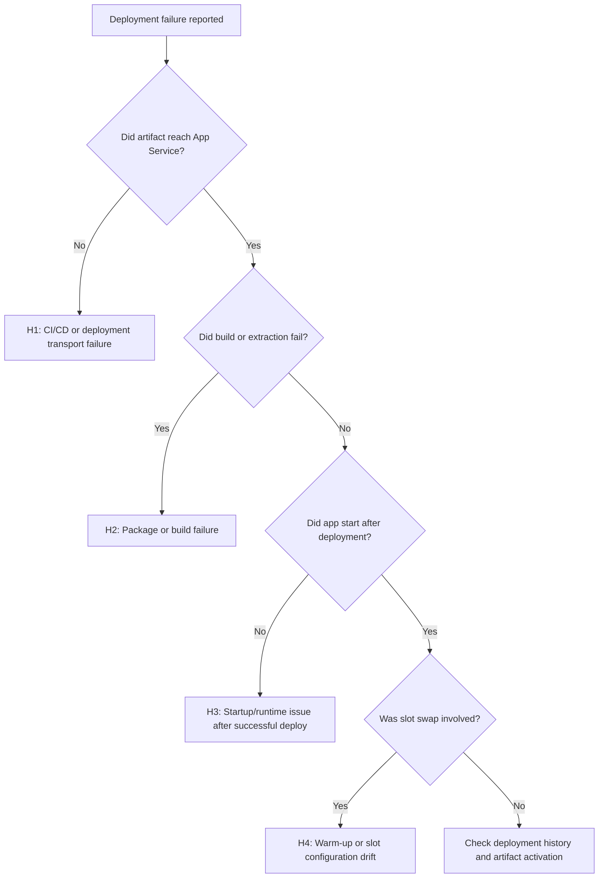

# Deployment Failures

## 1. Summary

This playbook applies when deployment to Azure App Service finishes with an error, appears successful but does not activate correctly, or fails during slot swap and promotion. Use it for ZipDeploy, GitHub Actions, Azure DevOps, local ZIP pushes, container image updates, and deployment slot swap workflows.

### Symptoms

- Deployment Center or CI/CD shows `Deployment failed`, `Package deployment using ZIP Deploy failed`, or `Oryx build failed`.
- A slot swap reports warm-up timeout, validation failure, or rollback.
- New content exists in the staging slot, but production still serves the old version.
- Deployment history shows success while the app returns `503`, `500`, or health check failures immediately after release.

### Common error messages

- `Failed to deploy web package to App Service.`
- `Package deployment failed. Extract zip failed.`
- `The deployment request failed because the app is restarting.`
- `Slot swap operation has failed because the source slot could not be warmed up.`
- `Container didn't respond to HTTP pings on port`.



## 2. Common Misreadings

| Observation | Often Misread As | Actually Means |
|---|---|---|
| CI job failed near the end | App Service platform outage | The package upload, Kudu build, or post-deploy restart may have failed in a narrow step. |
| Deployment history says `success` | Release is production-ready | Deployment transport and runtime activation are separate phases. |
| Slot swap failed | Staging code is always broken | Warm-up path, slot settings, or health behavior may be the actual blocker. |
| Old version is still serving | CDN caching only | The new package may not have been activated, or swap never completed. |
| Oryx logs mention warnings | Build definitely failed | Many warnings are survivable; isolate the first fatal line and the exit code. |

## 3. Competing Hypotheses

| Hypothesis | Likelihood | Key Discriminator |
|---|---|---|
| H1: Deployment transport or Kudu orchestration failed | High | Deployment logs show upload interruption, SCM restart, auth failure, or timeout before extraction/build finishes. |
| H2: Artifact, package shape, or build phase failed | High | Oryx, extraction, or post-deploy script logs contain fatal build or packaging errors. |
| H3: Deployment succeeded but startup failed | High | Deployment history is green, but platform and console logs show startup or port-binding errors. |
| H4: Slot swap warm-up or slot-specific config caused release failure | Medium | Swap timeline aligns with warm-up timeout, unhealthy endpoint, or slot setting drift. |
| H5: Release completed, but traffic still targets old content | Medium | Deployment metadata changed, but host/slot state or routing indicates old slot or stale package path. |

## 4. What to Check First

1. **Inspect deployment history and the latest deployment record**

    ```bash
    az webapp log deployment list \
        --resource-group $RG \
        --name $APP_NAME \
        --output table
    ```

2. **Check app state, host name, and current slot swap status**

    ```bash
    az webapp show \
        --resource-group $RG \
        --name $APP_NAME \
        --query "{state:state,defaultHostName:defaultHostName,slotSwapStatus:slotSwapStatus}" \
        --output json
    ```

3. **If slots are involved, list slot inventory and state**

    ```bash
    az webapp deployment slot list \
        --resource-group $RG \
        --name $APP_NAME \
        --query "[].{name:name,state:state,host:defaultHostName}" \
        --output table
    ```

4. **Inspect runtime configuration that affects activation after deployment**

    ```bash
    az webapp config show \
        --resource-group $RG \
        --name $APP_NAME \
        --query "{linuxFxVersion:linuxFxVersion,appCommandLine:appCommandLine,alwaysOn:alwaysOn}" \
        --output json
    ```

5. **Review deployment-critical app settings**

    ```bash
    az webapp config appsettings list \
        --resource-group $RG \
        --name $APP_NAME \
        --query "[?name=='SCM_DO_BUILD_DURING_DEPLOYMENT' || name=='WEBSITE_RUN_FROM_PACKAGE' || name=='WEBSITES_PORT' || name=='WEBSITE_SWAP_WARMUP_PING_PATH'].{name:name,value:value}" \
        --output table
    ```

## 5. Evidence to Collect

Collect one timeline that includes deployment start, deployment end, app restart, first healthy response, and any swap event. That timeline prevents mixing build failures with startup failures.

### 5.1 KQL Queries

#### Query 1: Deployment-adjacent platform failures

```kusto
AppServicePlatformLogs
| where TimeGenerated > ago(24h)
| where Message has_any ("deployment", "ZipDeploy", "ContainerTimeout", "StoppingSiteContainers", "swap")
| project TimeGenerated, Level, Message
| order by TimeGenerated desc
```

| Column | Example data | Interpretation |
|---|---|---|
| `TimeGenerated` | `2026-04-07 08:11:43` | Aligns the failure with the release window. |
| `Level` | `Error` | Prioritize error rows near deployment completion. |
| `Message` | `Slot swap operation failed during warm-up` | Distinguishes deployment transport from slot validation issues. |

!!! tip "How to Read This"
    If deployment logs are ambiguous, platform lifecycle rows usually reveal whether App Service failed during activation, warm-up, or immediate restart.

#### Query 2: HTTP behavior after release

```kusto
AppServiceHTTPLogs
| where TimeGenerated > ago(24h)
| summarize Requests=count(), Errors=countif(ScStatus >= 500), P95=percentile(TimeTaken, 95) by bin(TimeGenerated, 5m), ScStatus
| order by TimeGenerated asc
```

| Column | Example data | Interpretation |
|---|---|---|
| `Requests` | `420` | Confirms whether traffic reached the app after deployment. |
| `Errors` | `420` | If all requests are failures, activation likely did not succeed. |
| `P95` | `49780` | Near-50-second latency often maps to startup timeout behavior. |
| `ScStatus` | `503` | Platform-generated unavailability is different from app-level 500s. |

!!! tip "How to Read This"
    A sudden wall of `503` or elevated latency right after deployment means the package may be present but the worker is not healthy enough to serve traffic.

#### Query 3: Startup console evidence after a green deployment

```kusto
AppServiceConsoleLogs
| where TimeGenerated > ago(24h)
| where ResultDescription has_any ("Oryx", "gunicorn", "Listening at", "ModuleNotFoundError", "npm ERR", "dotnet", "java")
| project TimeGenerated, Level, ResultDescription
| order by TimeGenerated desc
```

| Column | Example data | Interpretation |
|---|---|---|
| `ResultDescription` | `ModuleNotFoundError: No module named 'src'` | Build succeeded but startup command or artifact layout is wrong. |
| `ResultDescription` | `Listening at: http://0.0.0.0:8000` | Positive evidence that the process started. |
| `Level` | `Error` | On Linux, console severity can still contain benign runtime INFO lines, so read the full message body. |

!!! tip "How to Read This"
    This query is the fastest way to separate package delivery problems from runtime activation problems. Presence of normal startup lines weakens H1 and H2.

### 5.2 CLI Investigation

```bash
# Show the latest deployment records
az webapp log deployment list \
    --resource-group $RG \
    --name $APP_NAME \
    --output json
```

Sample output:

```json
[
  {
    "active": true,
    "author": "GitHubActions",
    "complete": true,
    "deployer": "ZipDeploy",
    "end_time": "2026-04-07T08:11:39Z",
    "id": "e4a2a5d6-1111-2222-3333-444444444444",
    "message": "Created via push deployment"
  }
]
```

Interpretation:

- `complete: true` proves transport finished.
- `active: true` means this package should be the active content unless startup or routing failed afterward.
- A green deployment record does not disprove H3.

```bash
# Inspect slot state and swap status
az webapp show \
    --resource-group $RG \
    --name $APP_NAME \
    --query "{state:state,slotSwapStatus:slotSwapStatus,host:defaultHostName}" \
    --output json
```

Sample output:

```json
{
  "host": "app-contoso.azurewebsites.net",
  "slotSwapStatus": {
    "destinationSlotName": "production",
    "sourceSlotName": "staging",
    "timestampUtc": "2026-04-07T08:12:01Z"
  },
  "state": "Running"
}
```

Interpretation:

- Running control plane state does not guarantee the worker is ready.
- Recent `slotSwapStatus` confirms the release path included slot promotion.
- Correlate this with HTTP and platform logs before repeating the swap.

## 6. Validation and Disproof by Hypothesis

### H1: Deployment transport or Kudu orchestration failed

**Proves if** deployment history is incomplete, missing, or ends before activation with timeout/auth/upload errors.

**Disproves if** the latest record is complete and logs move on to startup evidence.

Validation steps:

1. Confirm the latest deployment shows `complete: true`.
2. Re-check whether SCM restarted or a second deployment interrupted the first one.
3. If using external CI/CD, compare pipeline timestamp with App Service deployment timestamp.

### H2: Artifact, package shape, or build phase failed

**Proves if** build logs contain the first fatal package, dependency, extraction, or post-build command failure.

**Disproves if** the artifact is deployed and startup logs show the app process actually launching.

Validation steps:

1. Identify whether `SCM_DO_BUILD_DURING_DEPLOYMENT` matches the artifact type.
2. Confirm the artifact includes the expected startup files and dependency manifest.
3. If `WEBSITE_RUN_FROM_PACKAGE` is enabled, verify the package itself contains the runnable app layout.

### H3: Deployment succeeded but startup failed

**Proves if** deployment history is green while platform logs show `ContainerTimeout`, port mismatch, crash loop, or repeated restarts.

**Disproves if** the app serves healthy traffic immediately after deployment.

Validation steps:

1. Correlate deployment end time with the first startup error.
2. Inspect console logs for entrypoint, port, dependency, or runtime-version mismatches.
3. Follow [Deployment Succeeded but Startup Failed](startup-availability/deployment-succeeded-startup-failed.md) if H3 dominates.

### H4: Slot swap warm-up or slot config drift

**Proves if** staging is healthy enough for manual browsing but swap still fails during warm-up or rollback.

**Disproves if** no slots were used or swap was never triggered.

Validation steps:

1. Compare staging and production slot settings that should or should not be sticky.
2. Review warm-up path, accepted statuses, and startup budget.
3. Follow [Slot Swap Failed During Warm-up](startup-availability/slot-swap-failed-during-warmup.md) for deeper isolation.

## 7. Likely Root Cause Patterns

| Pattern | Evidence | Resolution |
|---|---|---|
| Oryx/build mode mismatch | `SCM_DO_BUILD_DURING_DEPLOYMENT` conflicts with prebuilt artifact expectations | Align CI output with deployment mode and redeploy. |
| Startup command drift | Green deployment but console log shows module/path/command error | Correct `appCommandLine` or package layout. |
| Warm-up contract too strict | Swap fails though staging URL works | Simplify warm-up endpoint and fix slot-specific settings. |
| Partial release / stale routing | Deployment record changed but traffic still serves old content | Verify swap completion, active slot, and package activation path. |
| App restart during release | Platform log shows stop/start loops immediately after deploy | Remove bad app setting, reduce startup pressure, and redeploy. |

## 8. Immediate Mitigations

1. Freeze repeated deployments until one full evidence set is captured.
2. If production is unhealthy, roll back by swapping back or redeploying the last known good package.
3. If only staging is broken, stop promotion and validate startup in the slot URL before retrying.
4. Correct deployment mode mismatches such as run-from-package vs build-on-deploy.
5. If warm-up is the blocker, temporarily use a lighter readiness path that proves the worker can accept traffic.
6. Re-run the release only after confirming the first failing phase is fixed.

## 9. Prevention

### Prevention checklist

- [ ] Standardize one deployment method per app and document whether build happens in CI or in App Service.
- [ ] Keep a lightweight health or readiness path available for swap validation.
- [ ] Validate startup command, runtime stack, and slot-sticky settings before production promotion.
- [ ] Record deployment ID, commit SHA, and release timestamp in the app for quick correlation.
- [ ] Test rollback regularly so teams can recover without improvisation.

## See Also

- [Playbooks](index.md)
- [Deployment Succeeded but Startup Failed](startup-availability/deployment-succeeded-startup-failed.md)
- [Slot Swap Failed During Warm-up](startup-availability/slot-swap-failed-during-warmup.md)
- [Deployment Slots Operations](../../operations/deployment-slots.md)

## Sources

- [Deploy files to Azure App Service (Microsoft Learn)](https://learn.microsoft.com/en-us/azure/app-service/deploy-zip)
- [Deploy to deployment slots in Azure App Service (Microsoft Learn)](https://learn.microsoft.com/en-us/azure/app-service/deploy-staging-slots)
- [Enable diagnostics logging for Azure App Service (Microsoft Learn)](https://learn.microsoft.com/en-us/azure/app-service/troubleshoot-diagnostic-logs)
