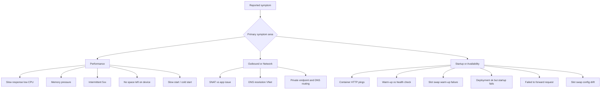

---
content_sources:
  diagrams:
    - id: playbook-map
      type: flowchart
      source: self-generated
      justification: "Synthesized the playbook symptom map from Microsoft Learn troubleshooting topics that anchor this section."
      based_on:
        - https://learn.microsoft.com/en-us/azure/app-service/troubleshoot-diagnostic-logs
        - https://learn.microsoft.com/en-us/azure/app-service/troubleshoot-http-502-http-503
        - https://learn.microsoft.com/en-us/troubleshoot/azure/app-service/troubleshoot-performance-degradation
        - https://learn.microsoft.com/en-us/troubleshoot/azure/app-service/connection-issues-with-ssl-or-tls/troubleshoot-domain-and-tls-ssl-certificates
---

# Playbooks

Symptom-oriented troubleshooting guides for Azure App Service Linux.

Each playbook follows a hypothesis-driven structure: start from the symptom, list competing hypotheses, collect evidence, validate or disprove, and identify the root cause.

<!-- diagram-id: playbook-map -->

---

## Performance

| Playbook | Symptom |
|----------|---------|
| [Performance Degradation](performance-degradation.md) | Slow response times, latency spikes, CPU or memory stress |
| [Slow Response but Low CPU](performance/slow-response-but-low-cpu.md) | High latency with CPU below saturation |
| [Memory Pressure & Worker Degradation](performance/memory-pressure-and-worker-degradation.md) | Gradual slowdown without CPU spikes |
| [Intermittent 5xx Under Load](performance/intermittent-5xx-under-load.md) | Sporadic server errors during traffic bursts |
| [No Space Left on Device](performance/no-space-left-on-device.md) | Disk full errors from /home or /tmp exhaustion |
| [Slow Start / Cold Start vs Regression](performance/slow-start-cold-start.md) | First request slow after deploy or idle — cold start or real problem? |

## Core Platform Playbooks

| Playbook | Symptom |
|----------|---------|
| [Deployment Failures](deployment-failures.md) | Failed deployments, slot issues, or swap failures |
| [App Startup Failures](app-startup-failures.md) | Application or container never becomes ready |
| [SSL Certificate Issues](ssl-certificate-issues.md) | Custom domain TLS binding, renewal, or hostname mismatch problems |
| [Authentication Failures](authentication-failures.md) | Easy Auth, Entra ID, or identity-related sign-in failures |

## Outbound / Network

| Playbook | Symptom |
|----------|---------|
| [SNAT or Application Issue?](outbound-network/snat-or-application-issue.md) | Intermittent outbound connection failures |
| [DNS Resolution (VNet)](outbound-network/dns-resolution-vnet-integrated-app-service.md) | Name resolution failures in VNet-integrated apps |
| [Private Endpoint / DNS Confusion](outbound-network/private-endpoint-custom-dns-route-confusion.md) | Unreachable dependencies despite Private Endpoint |

## Startup / Availability

| Playbook | Symptom |
|----------|---------|
| [Container Didn't Respond to HTTP Pings](startup-availability/container-didnt-respond-to-http-pings.md) | Site fails to start after container launch |
| [Warm-up vs Health Check](startup-availability/warmup-vs-health-check.md) | Confusion between startup probing and health checks |
| [Slot Swap Failed During Warm-up](startup-availability/slot-swap-failed-during-warmup.md) | Swap fails due to warm-up timeout |
| [Deployment Succeeded but Startup Failed](startup-availability/deployment-succeeded-startup-failed.md) | Deploy green but app down — startup command or artifact mismatch |
| [Failed to Forward Request](startup-availability/failed-to-forward-request.md) | Platform proxy cannot reach app container at runtime |
| [Slot Swap Config Drift / Restart Race](startup-availability/slot-swap-config-drift.md) | Swap succeeds but production restarts or config breaks |

## See Also

- [Troubleshooting](../index.md)
- [First 10 Minutes Checklists](../first-10-minutes/index.md)
- [Hands-on Labs](../lab-guides/index.md)
