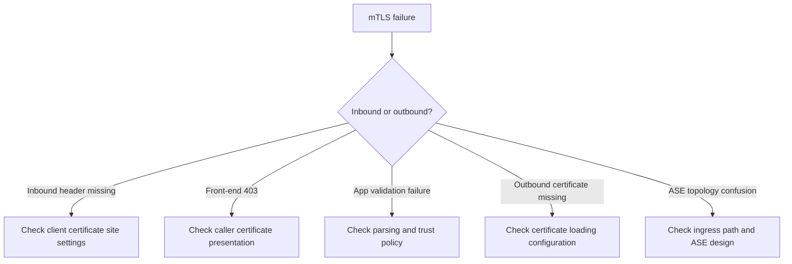

---
content_sources:
  diagrams:
    - id: app-service-mtls-troubleshooting-flow
      type: flowchart
      source: self-generated
      justification: "Synthesized App Service mTLS failure branches from Microsoft Learn guidance for TLS mutual auth, certificate loading in code, and ASE architecture."
      based_on:
        - https://learn.microsoft.com/en-us/azure/app-service/app-service-web-configure-tls-mutual-auth
        - https://learn.microsoft.com/en-us/azure/app-service/configure-ssl-certificate-in-code
        - https://learn.microsoft.com/en-us/azure/app-service/environment/overview
content_validation:
  status: pending_review
  last_reviewed: "2026-04-25"
  reviewer: ai-agent
  core_claims:
    - claim: "App Service forwards inbound client certificates in the X-ARR-ClientCert header when the feature is enabled."
      source: "https://learn.microsoft.com/en-us/azure/app-service/app-service-web-configure-tls-mutual-auth"
      verified: true
    - claim: "App Service does not validate the inbound client certificate and application code must validate it."
      source: "https://learn.microsoft.com/en-us/azure/app-service/app-service-web-configure-tls-mutual-auth"
      verified: true
    - claim: "Private certificates can be loaded into application code through App Service certificate-loading features."
      source: "https://learn.microsoft.com/en-us/azure/app-service/configure-ssl-certificate-in-code"
      verified: false
---

# mTLS Failures

## Symptom

- `X-ARR-ClientCert` is missing in app code
- App Service returns `403` when inbound client certificates are required
- Application code fails certificate parsing or trust validation
- Outbound mTLS calls fail because the client certificate cannot be found or loaded
- ASE deployments show behavior differences between expected private ingress and actual certificate flow

<!-- diagram-id: app-service-mtls-troubleshooting-flow -->


## Possible Causes

- `clientCertEnabled` is false
- request path is covered by `clientCertExclusionPaths`
- caller used HTTP instead of HTTPS
- caller never presented a certificate to the front end
- application assumed the platform validated the chain
- outbound certificate thumbprint or path is wrong
- App Service certificate-loading configuration is incomplete
- ASE ingress topology is different from what the application team assumed
- an upstream gateway or proxy changes how client-certificate authentication is performed before the request reaches App Service

## Diagnosis Steps

### 1. `X-ARR-ClientCert` header missing at the app

Check the site settings:

```bash
az webapp show \
  --resource-group $RG \
  --name $APP_NAME \
  --query "{clientCertEnabled:clientCertEnabled,clientCertMode:clientCertMode,clientCertExclusionPaths:clientCertExclusionPaths,httpsOnly:httpsOnly}" \
  --output json
```

Interpretation:

- `clientCertEnabled=false`: missing header is expected
- request path matches `clientCertExclusionPaths`: missing header can be expected on that route
- `httpsOnly=false`: callers may be bypassing the intended TLS path

### 2. `403` from the front end with `clientCertMode=Required`

Compare a request without and with a certificate:

```bash
curl --include "https://$APP_NAME.azurewebsites.net/cert-info"

curl --include \
  --cert ./client.pem \
  --key ./client.key \
  "https://$APP_NAME.azurewebsites.net/cert-info"
```

If only the second request reaches the app, the platform enforcement path is working and the failing caller is not presenting a certificate.

### 3. Chain validation failure in app code

Check for these patterns:

- treating `X-ARR-ClientCert` as full PEM instead of base64 content
- failing to add PEM markers before parsing
- validating only CN when the security model depends on issuer or SAN
- expired intermediate or untrusted issuing CA in your application trust policy

### 4. `WEBSITE_LOAD_CERTIFICATES` is set but the cert is still missing

Verify:

- thumbprint matches exactly
- expected certificate format was uploaded
- the application is looking in the correct OS-specific location or store
- the app restarted after configuration change

!!! warning "Certificate-loading details are OS-specific"
    On App Service, outbound certificate access differs between Windows and Linux. Validate your exact hosting OS before debugging application code.

### 5. ASE-specific ingress confusion

For ASE or ILB ASE deployments, confirm:

- where ingress actually enters the App Service front-end layer
- whether an upstream proxy or gateway changes the expected request path
- whether the ingress chain preserves the standard `X-ARR-ClientCert` application contract

## Resolution

- Enable `clientCertEnabled` and set the intended `clientCertMode`
- remove only the exclusion paths you no longer need
- enforce HTTPS-only and retest with an actual client certificate
- reconstruct PEM correctly before parsing `X-ARR-ClientCert`
- validate the certificate chain and authorization policy in application code
- correct outbound certificate thumbprint, path, or store lookup logic
- review ASE ingress design and document the actual front-end trust boundary instead of assuming ASE behaves exactly like the public multitenant ingress path

## Prevention

- Keep inbound and outbound mTLS runbooks separate
- add a lower-environment `/cert-info` diagnostics endpoint for rollout testing
- document every `clientCertExclusionPaths` entry with business justification
- validate certificate loading and rotation during planned maintenance windows
- treat ASE as a topology change, not as a new certificate format

## See Also

- [Mutual TLS Architecture](../../platform/mtls.md)
- [Incoming Client Certificates](../../operations/incoming-client-certificates.md)
- [Outbound Client Certificates](../../operations/outbound-client-certificates.md)
- [SSL Certificate Issues](ssl-certificate-issues.md)

## Sources

- [Set up TLS mutual authentication for Azure App Service (Microsoft Learn)](https://learn.microsoft.com/en-us/azure/app-service/app-service-web-configure-tls-mutual-auth)
- [Use TLS/SSL certificates in your application code in Azure App Service (Microsoft Learn)](https://learn.microsoft.com/en-us/azure/app-service/configure-ssl-certificate-in-code)
- [App Service Environment overview (Microsoft Learn)](https://learn.microsoft.com/en-us/azure/app-service/environment/overview)
