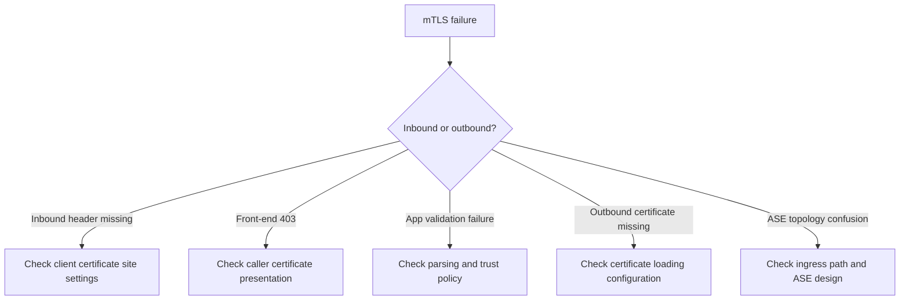

---
content_sources:
  diagrams:
    - id: app-service-mtls-troubleshooting-flow
      type: flowchart
      source: self-generated
      justification: "Synthesized App Service mTLS failure branches from Microsoft Learn guidance for TLS mutual auth, certificate loading in code, and ASE architecture."
      based_on:
        - https://learn.microsoft.com/en-us/azure/app-service/app-service-web-configure-tls-mutual-auth
        - https://learn.microsoft.com/en-us/azure/app-service/configure-ssl-certificate-in-code
        - https://learn.microsoft.com/en-us/azure/app-service/environment/overview
content_validation:
  status: verified
  last_reviewed: "2026-04-25"
  reviewer: agent
  core_claims:
    - claim: "App Service forwards inbound client certificates in the X-ARR-ClientCert header when the feature is enabled."
      source: "https://learn.microsoft.com/en-us/azure/app-service/app-service-web-configure-tls-mutual-auth"
      verified: true
    - claim: "App Service does not validate the inbound client certificate and application code must validate it."
      source: "https://learn.microsoft.com/en-us/azure/app-service/app-service-web-configure-tls-mutual-auth"
      verified: true
    - claim: "Private certificates can be loaded into application code through App Service certificate-loading features."
      source: "https://learn.microsoft.com/en-us/azure/app-service/configure-ssl-certificate-in-code"
      verified: true
---

# mTLS Failures

This playbook covers mutual TLS (mTLS) failures on Azure App Service, ranging from client certificate configuration issues to app-side chain validation and certificate loading problems.

## 1. Summary

### Symptoms

- `X-ARR-ClientCert` is missing in app code
- App Service returns `403` when inbound client certificates are required
- Application code fails certificate parsing or trust validation
- Outbound mTLS calls fail because the client certificate cannot be found or loaded
- ASE deployments show behavior differences between expected private ingress and actual certificate flow

### Common error messages

- `X-ARR-ClientCert` header absent from the request
- `403` from the App Service front end
- Chain validation failure in application code
- `clientCertEnabled` is false in site configuration

<!-- diagram-id: app-service-mtls-troubleshooting-flow -->

```mermaid
flowchart TD
    Start[mTLS failure] --> A{Inbound or outbound?}
    A -->|Inbound header missing| B[Check client certificate site settings]
    A -->|Front-end 403| C[Check caller certificate presentation]
    A -->|App validation failure| D[Check parsing and trust policy]
    A -->|Outbound certificate missing| E[Check certificate loading configuration]
    A -->|ASE topology confusion| F[Check ingress path and ASE design]
```

## 2. Common Misreadings

| Observation | Often Misread As | Actually Means |
|---|---|---|
| `X-ARR-ClientCert` missing | Platform bug | `clientCertEnabled=false` or `clientCertExclusionPaths` matches the request path |
| `403` from front end | App-side auth failure | Caller never presented a certificate; platform rejected the handshake |
| App parses `X-ARR-ClientCert` and fails | Certificate is corrupt | App is treating base64-encoded content as full PEM without adding markers |
| Outbound certificate not found | Certificate did not upload | `WEBSITE_LOAD_CERTIFICATES` thumbprint mismatch, OS-specific store path wrong, or app not restarted after config change |
| Behavior differs on ASE | ASE bug | Ingress topology is different from public multitenant path; upstream gateway may alter certificate flow |

## 3. Competing Hypotheses

| Hypothesis | Key Discriminator |
|---|---|
| H1: `clientCertEnabled` false or exclusion path match | `az webapp show --query clientCertEnabled` returns false, or request path matches an entry in `clientCertExclusionPaths` |
| H2: Caller not presenting certificate | Request without `--cert` returns 403; request with `--cert` reaches the app |
| H3: App-side chain/parse failure | Certificate is present in the header but parsing or validation throws in application code |
| H4: Outbound cert not loaded correctly | `WEBSITE_LOAD_CERTIFICATES` set but application-side lookup returns null |
| H5: ASE ingress topology confusion | Behavior differs between multitenant test app and ASE-hosted app despite identical configuration |

## 4. What to Check First

1. Confirm `clientCertEnabled` is true and `clientCertMode` matches the intended behavior:

    ```bash
    az webapp show \
      --resource-group $RG \
      --name $APP_NAME \
      --query "{clientCertEnabled:clientCertEnabled,clientCertMode:clientCertMode,clientCertExclusionPaths:clientCertExclusionPaths,httpsOnly:httpsOnly}" \
      --output json
    ```

    | Command | Purpose |
    |---------|---------|
    | `az webapp show --resource-group $RG --name $APP_NAME --query "{clientCertEnabled:clientCertEnabled,clientCertMode:clientCertMode,clientCertExclusionPaths:clientCertExclusionPaths,httpsOnly:httpsOnly}" --output json` | Shows the client-certificate and HTTPS settings so you can verify how App Service handles inbound mTLS for this app. |
    | `--resource-group $RG` | Selects the resource group that contains the target web app or related resource. |
    | `--name $APP_NAME` | Specifies the target web app name for this command. |
    | `--query "{clientCertEnabled:clientCertEnabled,clientCertMode:clientCertMode,clientCertExclusionPaths:clientCertExclusionPaths,httpsOnly:httpsOnly}"` | Projects only these named top-level properties into a smaller object before formatting the output. |
    | `--output json` | Formats the command output as JSON for full-fidelity inspection. |

2. Verify the request path is not covered by `clientCertExclusionPaths`.

3. Confirm the expected certificate thumbprint matches and the application has restarted after configuration change.

4. For ASE deployments, verify where ingress actually enters the App Service front-end layer.

    #### Portal view: Networking blade as entry point for mTLS configuration

    ![Azure portal Networking blade showing Inbound traffic configuration column (Public network access Enabled with no access restrictions Using default behavior, App assigned address Not configured, Private endpoints 0 private endpoints, Inbound IPv4 <ip-redacted>, Inbound IPv6 <ipv6-redacted>) and Outbound traffic configuration column (Virtual network integration Not configured, Hybrid connections Not configured, Outbound DNS Default Azure-provided, list of Outbound IPv4 and IPv6 addresses), Integration subnet configuration card showing NAT gateway N/A, NSG N/A, UDR N/A, toolbar with Refresh, Troubleshoot, Send us your feedback buttons](../../assets/troubleshooting/networking/01-networking-hub.png)

    The `Networking` blade is the orientation surface for inbound-path verification. The `Inbound traffic configuration` column lists `Public network access` (`Enabled with no access restrictions`), `Private endpoints` (`0 private endpoints`), `Inbound IPv4` (`<ip-redacted>`), and `Inbound IPv6` (`<ipv6-redacted>`) — together these describe every surface on which an inbound client connection (including an mTLS handshake) can land for this app. The `Outbound traffic configuration` column (`Virtual network integration: Not configured`, `Hybrid connections: Not configured`) confirms no VNet egress detour exists in this baseline. The toolbar `Troubleshoot` button is the platform-supplied network-diagnostics launcher.

## 5. Evidence to Collect

### 5.1 CLI Investigation

```bash
az webapp show \
  --resource-group $RG \
  --name $APP_NAME \
  --query "{clientCertEnabled:clientCertEnabled,clientCertMode:clientCertMode,clientCertExclusionPaths:clientCertExclusionPaths,httpsOnly:httpsOnly}" \
  --output json
```

| Command | Purpose |
|---------|---------|
| `az webapp show --resource-group $RG --name $APP_NAME --query "{clientCertEnabled:clientCertEnabled,clientCertMode:clientCertMode,clientCertExclusionPaths:clientCertExclusionPaths,httpsOnly:httpsOnly}" --output json` | Shows the client-certificate and HTTPS settings so you can verify how App Service handles inbound mTLS for this app. |
| `--resource-group $RG` | Selects the resource group that contains the target web app or related resource. |
| `--name $APP_NAME` | Specifies the target web app name for this command. |
| `--query "{clientCertEnabled:clientCertEnabled,clientCertMode:clientCertMode,clientCertExclusionPaths:clientCertExclusionPaths,httpsOnly:httpsOnly}"` | Projects only these named top-level properties into a smaller object before formatting the output. |
| `--output json` | Formats the command output as JSON for full-fidelity inspection. |

```bash
curl --include "https://$APP_NAME.azurewebsites.net/cert-info"

curl --include \
  --cert ./client.pem \
  --key ./client.key \
  "https://$APP_NAME.azurewebsites.net/cert-info"
```

### 5.2 What to Look For

- `clientCertEnabled=false`: missing header is expected
- Request path matches `clientCertExclusionPaths`: missing header can be expected on that route
- `httpsOnly=false`: callers may be bypassing the intended TLS path
- If only the second request (with `--cert`) reaches the app, the platform enforcement path is working and the failing caller is not presenting a certificate
- Treating `X-ARR-ClientCert` as full PEM instead of base64 content
- Failing to add PEM markers before parsing
- Validating only CN when the security model depends on issuer or SAN
- Expired intermediate or untrusted issuing CA in your application trust policy

## 6. Validation and Disproof by Hypothesis

### H1: X-ARR-ClientCert header missing

**Proves if** `clientCertEnabled` is false, or the request path matches a `clientCertExclusionPaths` entry, or `httpsOnly` is false and callers are using HTTP.

**Disproves if** `clientCertEnabled` is true, request path is not excluded, and HTTPS is enforced.

Validation steps:

1. Confirm `clientCertEnabled` is true.
2. Confirm the request path is not covered by `clientCertExclusionPaths`.
3. Confirm `httpsOnly` is true or callers are verified to be using HTTPS.

### H2: 403 from front end with certificate required

**Proves if** a request without `--cert` returns 403 while a request with `--cert` reaches the app.

**Disproves if** both requests (with and without certificate) fail identically, suggesting a different cause.

Validation steps:

1. Compare a request without and with a certificate using `curl`.
2. If only the second request reaches the app, the failing caller is not presenting a certificate.

### H3: Chain validation failure in app code

**Proves if** the certificate is present in the `X-ARR-ClientCert` header but parsing or validation throws in application code.

**Disproves if** the header is absent (which points to H1 or H2 instead).

Validation steps:

1. Check for treating `X-ARR-ClientCert` as full PEM instead of base64 content.
2. Check for failing to add PEM markers before parsing.
3. Check for validating only CN when the security model depends on issuer or SAN.
4. Check for expired intermediate or untrusted issuing CA in the application trust policy.

### H4: WEBSITE_LOAD_CERTIFICATES certificate missing

**Proves if** `WEBSITE_LOAD_CERTIFICATES` is set but the application-side lookup returns null or cannot find the certificate.

**Disproves if** the certificate loads correctly and the issue is in a different stage of the mTLS flow.

Validation steps:

1. Verify thumbprint matches exactly.
2. Verify expected certificate format was uploaded.
3. Verify the application is looking in the correct OS-specific location or store.
4. Verify the app restarted after configuration change.

!!! warning "Certificate-loading details are OS-specific"
    On App Service, outbound certificate access differs between Windows and Linux. Validate your exact hosting OS before debugging application code.

### H5: ASE-specific ingress topology

**Proves if** behavior differs between a multitenant test app and an ASE-hosted app despite identical configuration.

**Disproves if** the same behavior manifests on both multitenant and ASE environments.

Validation steps:

1. Confirm where ingress actually enters the App Service front-end layer.
2. Confirm whether an upstream proxy or gateway changes the expected request path.
3. Confirm whether the ingress chain preserves the standard `X-ARR-ClientCert` application contract.

## 7. Likely Root Cause Patterns

| Pattern | Evidence | Resolution |
|---|---|---|
| Client cert not enabled | `clientCertEnabled=false` | Enable client certificate authentication and choose the intended `clientCertMode` |
| Exclusion path unexpectedly matches | Request path in `clientCertExclusionPaths` | Remove only the exclusion entries no longer needed |
| HTTP instead of HTTPS | `httpsOnly=false` and callers use HTTP | Enable HTTPS-only and retest |
| PEM reconstruction bug | App treats base64 content as full PEM | Prepend and append PEM markers before parsing `X-ARR-ClientCert` |
| ASE ingress differs from multitenant | Behavior gap between test app and ASE app | Document the actual front-end trust boundary for ASE; do not assume public path parity |

## 8. Immediate Mitigations

1. Enable `clientCertEnabled` and set the intended `clientCertMode`
2. Remove only the exclusion paths you no longer need
3. Enforce HTTPS-only and retest with an actual client certificate
4. Reconstruct PEM correctly before parsing `X-ARR-ClientCert`
5. Validate the certificate chain and authorization policy in application code
6. Correct outbound certificate thumbprint, path, or store lookup logic
7. Review ASE ingress design and document the actual front-end trust boundary instead of assuming ASE behaves exactly like the public multitenant ingress path

## 9. Prevention

- Keep inbound and outbound mTLS runbooks separate
- add a lower-environment `/cert-info` diagnostics endpoint for rollout testing
- document every `clientCertExclusionPaths` entry with business justification
- validate certificate loading and rotation during planned maintenance windows
- treat ASE as a topology change, not as a new certificate format

## See Also

- [Mutual TLS Architecture](../../platform/mtls.md)
- [Incoming Client Certificates](../../operations/incoming-client-certificates.md)
- [Outbound Client Certificates](../../operations/outbound-client-certificates.md)
- [SSL Certificate Issues](ssl-certificate-issues.md)

## Sources

- [Set up TLS mutual authentication for Azure App Service (Microsoft Learn)](https://learn.microsoft.com/en-us/azure/app-service/app-service-web-configure-tls-mutual-auth)
- [Use TLS/SSL certificates in your application code in Azure App Service (Microsoft Learn)](https://learn.microsoft.com/en-us/azure/app-service/configure-ssl-certificate-in-code)
- [App Service Environment overview (Microsoft Learn)](https://learn.microsoft.com/en-us/azure/app-service/environment/overview)
