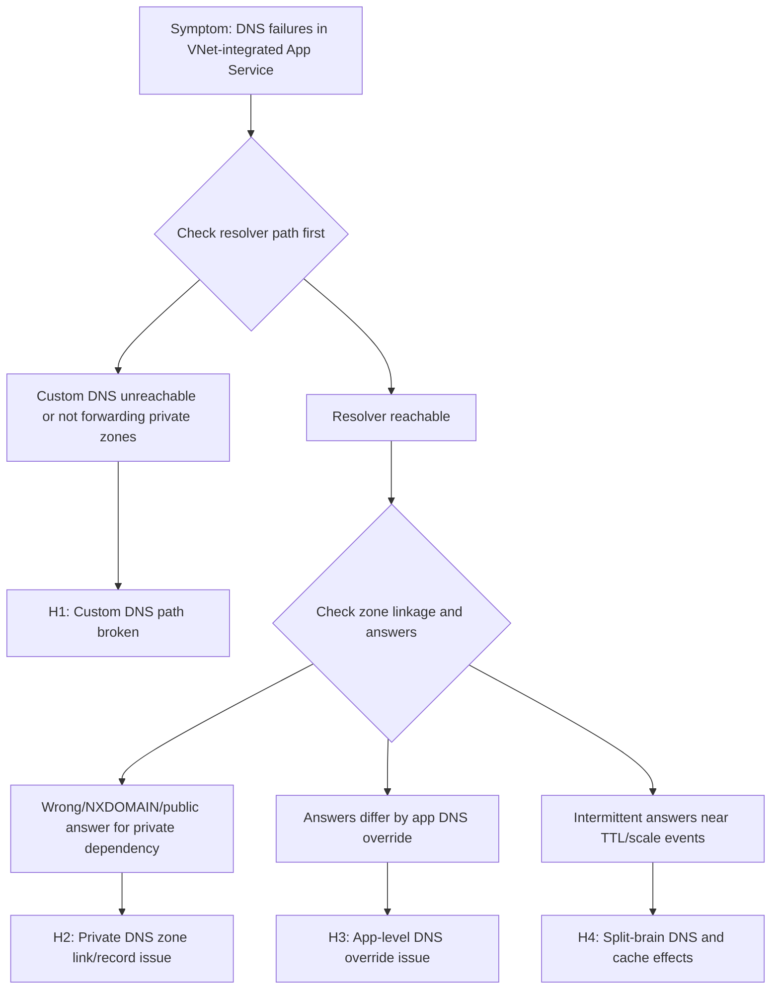

# DNS Resolution with VNet-Integrated App Service (Azure App Service Linux)

## 1. Summary
### Symptom
Outbound calls from an Azure App Service Linux app fail because hostnames for internal or private dependencies do not resolve correctly after enabling VNet integration. Errors commonly include `ENOTFOUND`, `Temporary failure in name resolution`, `Name or service not known`, or intermittent `SERVFAIL`.

### Why this scenario is confusing
The same FQDN may resolve successfully from a VM in the VNet, from your local machine through VPN, or from another app, while the failing App Service instance still returns DNS errors. Teams often assume "VNet integration means DNS is automatically identical everywhere," but runtime DNS path, custom resolver behavior, private zone linking, and app-level DNS settings can diverge.

### Troubleshooting decision flow


## 2. Common Misreadings
- "VNet integration is enabled, so DNS must already be correct."
- "The private endpoint exists, therefore name resolution cannot be the issue."
- "If one lookup worked once, DNS is ruled out."
- "Setting `WEBSITE_DNS_SERVER` always fixes everything."
- "Only network routes matter; DNS zones and forwarders are secondary."

## 3. Competing Hypotheses
- H1: Custom DNS servers are configured but unreachable, unhealthy, or not forwarding Azure private zones correctly from the integration subnet.
- H2: Private DNS zones are missing required VNet links or contain incorrect/stale records, so names resolve to public IPs, wrong private IPs, or NXDOMAIN.
- H3: App-level DNS override (`WEBSITE_DNS_SERVER` or `WEBSITE_DNS_ALT_SERVER`) points to an unintended resolver path that differs from expected VNet DNS.
- H4: Split-brain DNS and caching effects (resolver cache, library cache, TTL mismatch) cause intermittent success/failure across instances and retries.

## 4. What to Check First
### Metrics
- App response failure trend (5xx and dependency timeout spikes) aligned to DNS error windows.
- Instance count/scale events around incident start time (to detect cache and per-instance variance).
- TCP connection behavior to confirm this is not primarily SNAT/connectivity exhaustion.

### Logs
- `AppServiceConsoleLogs` for resolver signatures (`ENOTFOUND`, `EAI_AGAIN`, `Name or service not known`, `SERVFAIL`, `NXDOMAIN`).
- `AppServiceHTTPLogs` for endpoint/path correlation during periods where downstream hostname lookups fail.
- Application framework logs (Python `socket.gaierror`, `requests`/`httpx` exception traces).

### Platform Signals
- App Service VNet integration status and subnet assignment.
- Effective DNS settings for the app (`WEBSITE_DNS_SERVER`, `WEBSITE_DNS_ALT_SERVER`, app settings drift).
- Private Endpoint + Private DNS zone linkage health.
- Azure DNS Private Resolver inbound/outbound endpoint path (if used).

## 5. Evidence to Collect
### Required Evidence
- Exact failing FQDN(s), error text, and UTC timestamps for at least 3-5 incidents.
- Current VNet integration configuration for the app and integration subnet.
- DNS-related app settings currently applied to the app.
- Proof of resolution result from inside the running Linux container (multiple attempts).
- Private DNS zone records and VNet link status for each affected namespace.

### Useful Context
- Whether the dependency is Private Endpoint-backed Azure PaaS, internal IaaS, or on-prem through DNS forwarders.
- Whether custom DNS is implemented via domain controllers, BIND/Infoblox, or Azure DNS Private Resolver.
- Recent changes: zone record edits, resolver patching, subnet NSG/UDR updates, scale events, slot swaps.
- Expected split-horizon behavior (public answer externally, private answer internally) documented by design.

## 6. Validation and Disproof by Hypothesis

### H1: Custom DNS server path is broken
**Signals that support**
- DNS errors begin after moving from Azure-provided DNS to custom resolver IPs.
- Intermittent `SERVFAIL`/timeout appears across multiple hostnames, not only one dependency.
- Resolver health checks show packet loss/high latency from the integration subnet path.

**Signals that weaken**
- Repeated lookups from app instances consistently succeed through the same resolver.
- Only one zone/fqdn fails while others resolve normally via the same resolver.
- DNS failures persist even when custom DNS settings are removed in a controlled test.

**What to verify**
1. Confirm current DNS-related app settings:

```bash
az webapp config appsettings list --resource-group "$RG" --name "$APP_NAME" --query "[?name=='WEBSITE_DNS_SERVER' || name=='WEBSITE_DNS_ALT_SERVER']"
```

2. Validate VNet integration details:

```bash
az webapp vnet-integration list --resource-group "$RG" --name "$APP_NAME"
```

3. Check resolver error signatures in platform logs:

```kusto
AppServiceConsoleLogs
| where TimeGenerated > ago(6h)
| where ResultDescription has_any ("ENOTFOUND", "EAI_AGAIN", "Temporary failure in name resolution", "SERVFAIL", "Name or service not known")
| project TimeGenerated, _ResourceId, ResultDescription
| order by TimeGenerated desc
```

### H2: Private DNS zone linkage or record set is incorrect
**Signals that support**
- FQDN resolves to public IP when private endpoint resolution is expected.
- Affected zone lacks VNet link to the integration VNet or link is not in expected state.
- Record drift exists between intended private endpoint IP and zone A-record target.

**Signals that weaken**
- Zone links and A-records are correct, and lookup from app consistently returns expected private IP.
- Same hostname resolves correctly and connection succeeds from app during incident window.
- Failures are resolver timeout-only with no incorrect answer patterns.

**What to verify**
1. Inspect private DNS zone VNet links:

```bash
az network private-dns link vnet list --resource-group "$DNS_RG" --zone-name "$PRIVATE_ZONE"
```

2. Inspect relevant record sets:

```bash
az network private-dns record-set a list --resource-group "$DNS_RG" --zone-name "$PRIVATE_ZONE"
```

3. Correlate DNS incident windows with HTTP failures:

```kusto
AppServiceHTTPLogs
| where TimeGenerated > ago(6h)
| summarize Requests=count(), Failures=countif(ScStatus >= 500), P95DurationMs=percentile(TimeTaken, 95)
          by bin(TimeGenerated, 5m), CsHost, CsUriStem
| order by TimeGenerated desc
```

### H3: App-level DNS override causes unintended resolver behavior
**Signals that support**
- `WEBSITE_DNS_SERVER` was recently changed and aligns with incident onset.
- Only this app fails while another app in same VNet resolves correctly without override.
- Rollback of DNS app setting in test slot restores consistent resolution.

**Signals that weaken**
- App has no DNS override settings and uses expected default resolution path.
- Both apps with and without overrides fail identically at same timestamps.
- Failures map to missing private zone records rather than resolver selection.

**What to verify**
1. Compare DNS settings between working and failing apps:

```bash
az webapp config appsettings list --resource-group "$RG" --name "$APP_NAME" --query "[?contains(name, 'DNS')]"
```

2. Capture runtime lookup output from the app container (SSH/Kudu) repeatedly for affected names.
3. Validate whether fallback resolver behavior is expected in your architecture (for example when primary custom DNS is unavailable).

```kusto
AppServiceConsoleLogs
| where TimeGenerated > ago(6h)
| where ResultDescription has_any ("dns", "resolver", "gaierror", "EAI_AGAIN", "ENOTFOUND")
| project TimeGenerated, _ResourceId, ResultDescription
| order by TimeGenerated desc
```

### H4: Split-brain DNS plus cache/TTL effects create intermittent failures
**Signals that support**
- Different app instances return different answers for the same FQDN during short windows.
- Failures cluster near TTL expiry boundaries or after scale-out/slot swap events.
- Public vs private answer differs by resolver path, and app alternates between paths.

**Signals that weaken**
- All instances return the same wrong answer continuously.
- TTL/cache flushing has no effect and root issue is persistent record misconfiguration.
- Resolver and zone data are stable, but dependency service itself is down.

**What to verify**
1. During incident, run repeated lookups over time from the same app instance and compare across instances.
2. Review deployment/scale timeline versus first-failure timestamps.
3. Validate TTL values in private zones and resolver cache policy against expected failover behavior.

```bash
az monitor metrics list --resource "/subscriptions/<subscription-id>/resourceGroups/$RG/providers/Microsoft.Web/sites/$APP_NAME" --metric "Http5xx" --interval PT5M --aggregation Total
```

## 7. Likely Root Cause Patterns
- Pattern A: Custom DNS forwarders do not forward Azure private zones (for example `privatelink.*`) to the proper upstream path.
- Pattern B: Private DNS zone exists but VNet link is missing for the app integration VNet, so app resolves wrong or no records.
- Pattern C: App-specific `WEBSITE_DNS_SERVER` override diverges from enterprise DNS architecture and bypasses intended resolver chain.
- Pattern D: Split-horizon DNS with aggressive cache/TTL mismatch yields intermittent wrong-answer windows after scale events.

## 8. Immediate Mitigations
- Revert recent DNS app setting changes (`WEBSITE_DNS_SERVER`, `WEBSITE_DNS_ALT_SERVER`) in a controlled slot first. **Risk: medium** (can impact other name resolution dependencies).
- Add/fix missing private DNS VNet links and correct wrong A-record targets. **Risk: medium-high** (zone-wide blast radius if edited incorrectly).
- Temporarily pin dependency hostname to validated resolver path via enterprise DNS forwarder policy. **Risk: medium** (operational debt, can mask architecture issues).
- Reduce DNS volatility by aligning TTLs with expected failover behavior and avoiding ultra-low TTL unless required. **Risk: low-medium**.
- If using Azure DNS Private Resolver, validate and repair inbound/outbound endpoint forwarding rules. **Risk: medium**.

## 9. Long-term Fixes
- Standardize DNS architecture for App Service VNet integration (authoritative zones, forwarding hierarchy, ownership model).
- Use infrastructure-as-code for private DNS zones, links, and record lifecycle to prevent configuration drift.
- Establish resolver health monitoring and synthetic DNS probes from representative app subnets.
- Document split-brain design explicitly (which resolver should return public vs private answers and why).
- Add deployment guardrails: change-review checks for DNS app settings and private DNS link integrity.

## 10. Investigation Notes
- Regional VNet integration provides a network path, but does not automatically enable route-all or make all outbound traffic private. DNS outcome depends on resolver configuration and zone linkage, while routing outcome depends on `vnetRouteAllEnabled` and subnet route tables — these are separate checks.
- A successful `nslookup` once does not prove resolver stability; perform repeated checks across time and instances.
- Private Endpoint connectivity requires both route reachability and correct DNS resolution to the private IP.
- Linux workloads may surface DNS exceptions differently by runtime (Python, Node.js, Java), but lookup-layer signatures are comparable.
- Avoid embedding resolver IP assumptions in application code; keep resolver control in platform/network configuration.

## 11. Related Queries
- [`../../kql/http/5xx-trend-over-time.md`](../../kql/http/5xx-trend-over-time.md)
- [`../../kql/http/latency-trend-by-status-code.md`](../../kql/http/latency-trend-by-status-code.md)
- [`../../kql/correlation/latency-vs-errors.md`](../../kql/correlation/latency-vs-errors.md)

## 12. Related Checklists
- [`../../first-10-minutes/outbound-network.md`](../../first-10-minutes/outbound-network.md)

## 13. Related Labs
- [Lab: DNS Resolution (VNet)](../../lab-guides/dns-vnet-resolution.md)

## 14. Limitations
- This playbook focuses on Azure App Service **Linux** and OSS workloads only.
- It does not provide exhaustive Windows-specific DNS client behavior.
- It assumes Log Analytics ingestion is available for App Service HTTP/console telemetry.
- Hybrid/on-prem conditional forwarding nuances vary by enterprise DNS implementation and are validated case by case.

## 15. Quick Conclusion
When DNS failures occur in a VNet-integrated App Service Linux app, treat resolver path, private DNS linkage, and app-level DNS overrides as equally likely suspects until disproven. The fastest durable resolution is to prove each hypothesis with concrete in-app lookup evidence, App Service logs, and Azure DNS configuration checks, then standardize DNS architecture to eliminate drift and split-brain surprises.

## Sample Log Patterns

### AppServiceHTTPLogs (dns-vnet lab)

```text
[AppServiceHTTPLogs]
2026-04-04T11:23:04Z  GET  /diag/env    200    15
2026-04-04T11:23:03Z  GET  /diag/stats  200    24
2026-04-04T11:22:19Z  GET  /connect     200    975
2026-04-04T11:22:18Z  GET  /resolve     200    512
2026-04-04T11:18:02Z  GET  /            200    148
2026-04-04T11:17:12Z  GET  /diag/stats  499    24400
```

### AppServiceConsoleLogs (dns-vnet lab)

```text
[AppServiceConsoleLogs]
0 rows returned for incident window.
```

### AppServicePlatformLogs (dns-vnet lab)

```text
[AppServicePlatformLogs]
2026-04-04T11:17:11Z  Informational  Site is running with patch version PYTHON 3.11.14
2026-04-04T11:17:11Z  Informational  State: Started, Action: None, LastError: , LastErrorTimestamp: 01/01/0001 00:00:00
2026-04-04T11:17:11Z  Informational  Site started.
2026-04-04T11:17:11Z  Informational  Site is running with deployment version: xxxxxxxx-xxxx-xxxx-xxxx-xxxxxxxxxxxx
2026-04-04T11:17:10Z  Informational  State: Starting, Action: WarmUpProbeSucceeded
2026-04-04T11:17:10Z  Informational  Site startup probe succeeded after 36.3947007 seconds.
```

!!! tip "How to Read This"
    This pattern shows the app process is healthy (`Site started`) while DNS-dependent endpoints show abnormal latency and occasional client-disconnect (`499`). That combination strongly suggests dependency resolution/path issues, not app startup failure.

## KQL Queries with Example Output

### Query 1: Endpoint behavior around DNS tests

```kusto
AppServiceHTTPLogs
| where TimeGenerated between (datetime(2026-04-04 11:17:00) .. datetime(2026-04-04 11:24:00))
| where CsUriStem in ("/resolve", "/connect", "/diag/stats", "/diag/env")
| project TimeGenerated, CsMethod, CsUriStem, ScStatus, TimeTaken
| order by TimeGenerated desc
```

**Example Output:**

| TimeGenerated | CsMethod | CsUriStem | ScStatus | TimeTaken |
|---|---|---|---|---|
| 2026-04-04 11:23:04 | GET | /diag/env | 200 | 15 |
| 2026-04-04 11:23:03 | GET | /diag/stats | 200 | 24 |
| 2026-04-04 11:22:19 | GET | /connect | 200 | 975 |
| 2026-04-04 11:22:18 | GET | /resolve | 200 | 512 |
| 2026-04-04 11:17:12 | GET | /diag/stats | 499 | 24400 |

!!! tip "How to Read This"
    `200` alone does not mean DNS is correct. Focus on `/resolve` and `/connect` latency patterns and payload evidence. Here, `/resolve` and `/connect` are significantly slower than baseline health endpoints, indicating external dependency lookup/connect path stress.

### Query 2: Platform startup health vs DNS incident window

```kusto
AppServicePlatformLogs
| where TimeGenerated between (datetime(2026-04-04 11:17:00) .. datetime(2026-04-04 11:18:00))
| project TimeGenerated, Level, Message
| order by TimeGenerated asc
```

**Example Output:**

| TimeGenerated | Level | Message |
|---|---|---|
| 2026-04-04 11:17:10 | Informational | Site startup probe succeeded after 36.3947007 seconds. |
| 2026-04-04 11:17:10 | Informational | State: Starting, Action: WarmUpProbeSucceeded |
| 2026-04-04 11:17:11 | Informational | Site is running with deployment version: xxxxxxxx-xxxx-xxxx-xxxx-xxxxxxxxxxxx |
| 2026-04-04 11:17:11 | Informational | Site started. |

!!! tip "How to Read This"
    Clean startup telemetry eliminates startup regression hypotheses. Keep focus on DNS resolver path, private zone linking, and split-horizon resolution outcomes.

### Query 3: Console log presence check

```kusto
AppServiceConsoleLogs
| where TimeGenerated between (datetime(2026-04-04 11:17:00) .. datetime(2026-04-04 11:24:00))
| project TimeGenerated, Level, ResultDescription
| order by TimeGenerated asc
```

**Example Output:**

| TimeGenerated | Level | ResultDescription |
|---|---|---|
| _No rows_ |  |  |

!!! tip "How to Read This"
    No console rows plus healthy platform startup usually means app process started, but diagnostic detail must come from HTTP endpoint behavior and Azure DNS configuration data.

## CLI Investigation Commands

```bash
# Check app VNet integration and route-all state
az webapp show --resource-group <resource-group> --name <app-name> --query "{virtualNetworkSubnetId:virtualNetworkSubnetId,vnetRouteAllEnabled:siteConfig.vnetRouteAllEnabled}" --output table

# Check DNS override settings on app
az webapp config appsettings list --resource-group <resource-group> --name <app-name> --query "[?name=='WEBSITE_DNS_SERVER' || name=='WEBSITE_DNS_ALT_SERVER'].{name:name,value:value}" --output table

# Check private DNS VNet links for blob private zone
az network private-dns link vnet list --resource-group <dns-resource-group> --zone-name privatelink.blob.core.windows.net --output table

# Check A records for storage account in private zone
az network private-dns record-set a list --resource-group <dns-resource-group> --zone-name privatelink.blob.core.windows.net --output table
```

**Example Output:**

```text
VirtualNetworkSubnetId                                                                                                        VnetRouteAllEnabled
----------------------------------------------------------------------------------------------------------------------------  -------------------
/subscriptions/<subscription-id>/resourceGroups/<resource-group>/providers/Microsoft.Network/virtualNetworks/<vnet>/subnets/<subnet>  true

Name                 Value
-------------------  -----
WEBSITE_DNS_SERVER
WEBSITE_DNS_ALT_SERVER

Name                      VirtualNetwork
------------------------  ------------------------------------------------------------------------------
link-hub-vnet             /subscriptions/<subscription-id>/resourceGroups/<resource-group>/providers/Microsoft.Network/virtualNetworks/<hub-vnet>

Name                 IPv4Address
-------------------  ----------------
stlabdnsvnet         10.20.2.4
```

!!! tip "How to Read This"
    If private zone links or A records are missing/incorrect, the app can resolve to public IPs even with VNet integration enabled. VNet integration confirms network path, not DNS correctness.

## Normal vs Abnormal Comparison

| Signal | Normal DNS-private path | Abnormal (dns-vnet incident pattern) |
|---|---|---|
| `/resolve` result | `*.privatelink.blob.core.windows.net` resolves to private IP (for example 10.x) | `*.privatelink.blob.core.windows.net` resolves to public IP `20.60.200.161` |
| `/connect` result | TLS/connect succeeds to private endpoint path | SSL/connect error against privatelink URL due to public endpoint routing |
| `/diag/env` and `/diag/stats` | Low latency, consistent 200 | Mostly 200 but occasional 499/high latency spikes |
| Platform startup logs | `Site started`, no startup errors | Same (healthy startup), proving issue is post-start dependency path |
| Interpretation | Private DNS + route chain is aligned | Private DNS zone link/record path is misconfigured (H2/H3 focus) |

## Related Labs

- [Lab: DNS Resolution (VNet)](../../lab-guides/dns-vnet-resolution.md)

## References
- [Integrate your app with an Azure virtual network](https://learn.microsoft.com/en-us/azure/app-service/overview-vnet-integration)
- [Azure DNS private zones overview](https://learn.microsoft.com/en-us/azure/dns/private-dns-overview)
- [Name resolution for resources in Azure virtual networks](https://learn.microsoft.com/en-us/azure/virtual-network/virtual-networks-name-resolution-for-vms-and-role-instances)
- [Azure App Service networking features](https://learn.microsoft.com/en-us/azure/app-service/networking-features)
