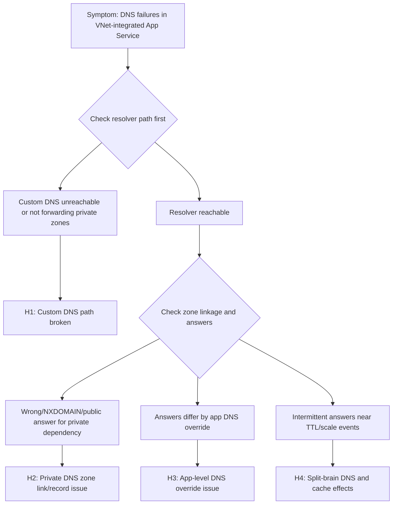

# DNS Resolution with VNet-Integrated App Service (Azure App Service Linux)

## 1. Summary
### Symptom
Outbound calls from an Azure App Service Linux app fail because hostnames for internal or private dependencies do not resolve correctly after enabling VNet integration. Errors commonly include `ENOTFOUND`, `Temporary failure in name resolution`, `Name or service not known`, or intermittent `SERVFAIL`.

### Why this scenario is confusing
The same FQDN may resolve successfully from a VM in the VNet, from your local machine through VPN, or from another app, while the failing App Service instance still returns DNS errors. Teams often assume "VNet integration means DNS is automatically identical everywhere," but runtime DNS path, custom resolver behavior, private zone linking, and app-level DNS settings can diverge.

### Troubleshooting decision flow
<!-- diagram-id: dns-vnet-resolution-flow -->

```mermaid
graph TD
    A[Symptom: DNS failures in VNet-integrated App Service] --> B{Check resolver path first}
    B --> C[Custom DNS unreachable or not forwarding private zones]
    B --> D[Resolver reachable]
    C --> H1[H1: Custom DNS path broken]
    D --> E{Check zone linkage and answers}
    E --> F[Wrong/NXDOMAIN/public answer for private dependency]
    E --> G[Answers differ by app DNS override]
    E --> I[Intermittent answers near TTL/scale events]
    F --> H2[H2: Private DNS zone link/record issue]
    G --> H3[H3: App-level DNS override issue]
    I --> H4[H4: Split-brain DNS and cache effects]
```

### Scope and limitations
- This playbook focuses on Azure App Service **Linux** and OSS workloads only.
- It does not provide exhaustive Windows-specific DNS client behavior.
- It assumes Log Analytics ingestion is available for App Service HTTP/console telemetry.
- Hybrid/on-prem conditional forwarding nuances vary by enterprise DNS implementation and are validated case by case.

### Quick conclusion
When DNS failures occur in a VNet-integrated App Service Linux app, treat resolver path, private DNS linkage, and app-level DNS overrides as equally likely suspects until disproven. The fastest durable resolution is to prove each hypothesis with concrete in-app lookup evidence, App Service logs, and Azure DNS configuration checks, then standardize DNS architecture to eliminate drift and split-brain surprises.

## 2. Common Misreadings
- "VNet integration is enabled, so DNS must already be correct."
- "The private endpoint exists, therefore name resolution cannot be the issue."
- "If one lookup worked once, DNS is ruled out."
- "Setting `WEBSITE_DNS_SERVER` always fixes everything."
- "Only network routes matter; DNS zones and forwarders are secondary."

## 3. Competing Hypotheses
- H1: Custom DNS servers are configured but unreachable, unhealthy, or not forwarding Azure private zones correctly from the integration subnet.
- H2: Private DNS zones are missing required VNet links or contain incorrect/stale records, so names resolve to public IPs, wrong private IPs, or NXDOMAIN.
- H3: App-level DNS override (`WEBSITE_DNS_SERVER` or `WEBSITE_DNS_ALT_SERVER`) points to an unintended resolver path that differs from expected VNet DNS.
- H4: Split-brain DNS and caching effects (resolver cache, library cache, TTL mismatch) cause intermittent success/failure across instances and retries.

## 4. What to Check First
### Metrics
- App response failure trend (5xx and dependency timeout spikes) aligned to DNS error windows.
- Instance count/scale events around incident start time (to detect cache and per-instance variance).
- TCP connection behavior to confirm this is not primarily SNAT/connectivity exhaustion.

### Logs
- `AppServiceConsoleLogs` for resolver signatures (`ENOTFOUND`, `EAI_AGAIN`, `Name or service not known`, `SERVFAIL`, `NXDOMAIN`).
- `AppServiceHTTPLogs` for endpoint/path correlation during periods where downstream hostname lookups fail.
- Application framework logs (Python `socket.gaierror`, `requests`/`httpx` exception traces).

### Platform Signals
- App Service VNet integration status and subnet assignment.
- Effective DNS settings for the app (`WEBSITE_DNS_SERVER`, `WEBSITE_DNS_ALT_SERVER`, app settings drift).
- Private Endpoint + Private DNS zone linkage health.
- Azure DNS Private Resolver inbound/outbound endpoint path (if used).

#### Portal view

The App Service **Networking** blade exposes the two settings that determine DNS outcome for a VNet-integrated app: `Virtual network integration` (which subnet resolver requests originate from) and `Outbound DNS` (which resolver is used). Rather than read it as one screenshot, walk it as an ordered trail. See [Section 10 — Portal Evidence](#10-portal-evidence) for the step-by-step diagnostic walk of this blade, keyed to each card in the order you should verify it.

### Investigation Notes
- Regional VNet integration provides a network path, but does not automatically enable route-all or make all outbound traffic private. DNS outcome depends on resolver configuration and zone linkage, while routing outcome depends on `vnetRouteAllEnabled` and subnet route tables — these are separate checks.
- A successful `nslookup` once does not prove resolver stability; perform repeated checks across time and instances.
- Private Endpoint connectivity requires both route reachability and correct DNS resolution to the private IP.
- Linux workloads may surface DNS exceptions differently by runtime (Python, Node.js, Java), but lookup-layer signatures are comparable.
- Avoid embedding resolver IP assumptions in application code; keep resolver control in platform/network configuration.

## 5. Evidence to Collect
### Required Evidence
- Exact failing FQDN(s), error text, and UTC timestamps for at least 3-5 incidents.
- Current VNet integration configuration for the app and integration subnet.
- DNS-related app settings currently applied to the app.
- Proof of resolution result from inside the running Linux container (multiple attempts).
- Private DNS zone records and VNet link status for each affected namespace.

### Useful Context
- Whether the dependency is Private Endpoint-backed Azure PaaS, internal IaaS, or on-prem through DNS forwarders.
- Whether custom DNS is implemented via domain controllers, BIND/Infoblox, or Azure DNS Private Resolver.
- Recent changes: zone record edits, resolver patching, subnet NSG/UDR updates, scale events, slot swaps.
- Expected split-horizon behavior (public answer externally, private answer internally) documented by design.

### Sample Log Patterns
#### AppServiceHTTPLogs (dns-vnet lab)

```text
[AppServiceHTTPLogs]
2026-04-04T11:23:04Z  GET  /diag/env    200    15
2026-04-04T11:23:03Z  GET  /diag/stats  200    24
2026-04-04T11:22:19Z  GET  /connect     200    975
2026-04-04T11:22:18Z  GET  /resolve     200    512
2026-04-04T11:18:02Z  GET  /            200    148
2026-04-04T11:17:12Z  GET  /diag/stats  499    24400
```

#### AppServiceConsoleLogs (dns-vnet lab)

```text
[AppServiceConsoleLogs]
0 rows returned for incident window.
```

#### AppServicePlatformLogs (dns-vnet lab)

```text
[AppServicePlatformLogs]
2026-04-04T11:17:11Z  Informational  Site is running with patch version PYTHON 3.11.14
2026-04-04T11:17:11Z  Informational  State: Started, Action: None, LastError: , LastErrorTimestamp: 01/01/0001 00:00:00
2026-04-04T11:17:11Z  Informational  Site started.
2026-04-04T11:17:11Z  Informational  Site is running with deployment version: xxxxxxxx-xxxx-xxxx-xxxx-xxxxxxxxxxxx
2026-04-04T11:17:10Z  Informational  State: Starting, Action: WarmUpProbeSucceeded
2026-04-04T11:17:10Z  Informational  Site startup probe succeeded after 36.3947007 seconds.
```

!!! tip "How to Read This"
    This pattern shows the app process is healthy (`Site started`) while DNS-dependent endpoints show abnormal latency and occasional client-disconnect (`499`). That combination strongly suggests dependency resolution/path issues, not app startup failure.

### KQL Queries with Example Output
#### Query 1: Endpoint behavior around DNS tests

```kusto
AppServiceHTTPLogs
| where TimeGenerated between (datetime(2026-04-04 11:17:00) .. datetime(2026-04-04 11:24:00))
| where CsUriStem in ("/resolve", "/connect", "/diag/stats", "/diag/env")
| project TimeGenerated, CsMethod, CsUriStem, ScStatus, TimeTaken
| order by TimeGenerated desc
```

**Example Output:**

| TimeGenerated | CsMethod | CsUriStem | ScStatus | TimeTaken |
|---|---|---|---|---|
| 2026-04-04 11:23:04 | GET | /diag/env | 200 | 15 |
| 2026-04-04 11:23:03 | GET | /diag/stats | 200 | 24 |
| 2026-04-04 11:22:19 | GET | /connect | 200 | 975 |
| 2026-04-04 11:22:18 | GET | /resolve | 200 | 512 |
| 2026-04-04 11:17:12 | GET | /diag/stats | 499 | 24400 |

!!! tip "How to Read This"
    `200` alone does not mean DNS is correct. Focus on `/resolve` and `/connect` latency patterns and payload evidence. Here, `/resolve` and `/connect` are significantly slower than baseline health endpoints, indicating external dependency lookup/connect path stress.

#### Query 2: Platform startup health vs DNS incident window

```kusto
AppServicePlatformLogs
| where TimeGenerated between (datetime(2026-04-04 11:17:00) .. datetime(2026-04-04 11:18:00))
| project TimeGenerated, Level, Message
| order by TimeGenerated asc
```

**Example Output:**

| TimeGenerated | Level | Message |
|---|---|---|
| 2026-04-04 11:17:10 | Informational | Site startup probe succeeded after 36.3947007 seconds. |
| 2026-04-04 11:17:10 | Informational | State: Starting, Action: WarmUpProbeSucceeded |
| 2026-04-04 11:17:11 | Informational | Site is running with deployment version: xxxxxxxx-xxxx-xxxx-xxxx-xxxxxxxxxxxx |
| 2026-04-04 11:17:11 | Informational | Site started. |

!!! tip "How to Read This"
    Clean startup telemetry eliminates startup regression hypotheses. Keep focus on DNS resolver path, private zone linking, and split-horizon resolution outcomes.

#### Query 3: Console log presence check

```kusto
AppServiceConsoleLogs
| where TimeGenerated between (datetime(2026-04-04 11:17:00) .. datetime(2026-04-04 11:24:00))
| project TimeGenerated, Level, ResultDescription
| order by TimeGenerated asc
```

**Example Output:**

| TimeGenerated | Level | ResultDescription |
|---|---|---|
| _No rows_ |  |  |

!!! tip "How to Read This"
    No console rows plus healthy platform startup usually means app process started, but diagnostic detail must come from HTTP endpoint behavior and Azure DNS configuration data.

### CLI Investigation Commands

```bash
# Check app VNet integration and route-all state
az webapp show --resource-group <resource-group> --name <app-name> --query "{virtualNetworkSubnetId:virtualNetworkSubnetId,vnetRouteAllEnabled:siteConfig.vnetRouteAllEnabled}" --output table

# Check DNS override settings on app
az webapp config appsettings list --resource-group <resource-group> --name <app-name> --query "[?name=='WEBSITE_DNS_SERVER' || name=='WEBSITE_DNS_ALT_SERVER'].{name:name,value:value}" --output table

# Check private DNS VNet links for blob private zone
az network private-dns link vnet list --resource-group <dns-resource-group> --zone-name privatelink.blob.core.windows.net --output table

# Check A records for storage account in private zone
az network private-dns record-set a list --resource-group <dns-resource-group> --zone-name privatelink.blob.core.windows.net --output table
```

| Command | Purpose |
|---------|---------|
| `az webapp show --resource-group <resource-group> --name <app-name> --query "{virtualNetworkSubnetId:virtualNetworkSubnetId,vnetRouteAllEnabled:siteConfig.vnetRouteAllEnabled}" --output table` | Shows the integration subnet resource ID and the nested `siteConfig.vnetRouteAllEnabled` flag for this app. |
| `--resource-group <resource-group> --name <app-name> --query "{virtualNetworkSubnetId:virtualNetworkSubnetId,vnetRouteAllEnabled:siteConfig.vnetRouteAllEnabled}" --output table` | Looks up the resource in this resource group. |
| `--name <app-name> --query "{virtualNetworkSubnetId:virtualNetworkSubnetId,vnetRouteAllEnabled:siteConfig.vnetRouteAllEnabled}" --output table` | Targets this web app. |
| `--query "{virtualNetworkSubnetId:virtualNetworkSubnetId,vnetRouteAllEnabled:siteConfig.vnetRouteAllEnabled}"` | Projects only the fields needed here: the top-level integration subnet ID and the nested `siteConfig.vnetRouteAllEnabled` value. |
| `--output table` | Formats the projected web app fields as a table for quick reading. |
| `az webapp config appsettings list --resource-group <resource-group> --name <app-name> --query "[?name=='WEBSITE_DNS_SERVER' \|\| name=='WEBSITE_DNS_ALT_SERVER'].{name:name,value:value}" --output table` | Lists only the DNS override app settings so you can see whether this app is forcing a non-default resolver path. |
| `--resource-group <resource-group> --name <app-name> --query "[?name=='WEBSITE_DNS_SERVER' \|\| name=='WEBSITE_DNS_ALT_SERVER'].{name:name,value:value}" --output table` | Looks up the resource in this resource group. |
| `--name <app-name> --query "[?name=='WEBSITE_DNS_SERVER' \|\| name=='WEBSITE_DNS_ALT_SERVER'].{name:name,value:value}" --output table` | Targets this web app. |
| `--query "[?name=='WEBSITE_DNS_SERVER' \|\| name=='WEBSITE_DNS_ALT_SERVER'].{name:name,value:value}"` | Filters the app-settings list to the two DNS override entries and projects only their `name` and `value` fields. |
| `--output table` | Formats the app-settings result for quick reading in this investigation. |
| `az network private-dns link vnet list --resource-group <dns-resource-group> --zone-name privatelink.blob.core.windows.net --output table` | Lists the virtual-network links for this Private DNS zone so you can confirm whether the expected VNet is linked. |
| `--resource-group <dns-resource-group> --zone-name privatelink.blob.core.windows.net --output table` | Scopes the lookup to the resource group that owns the Private DNS zone. |
| `--zone-name privatelink.blob.core.windows.net --output table` | Targets this Private DNS zone. |
| `--output table` | Formats the VNet-link results as a table for quick verification. |
| `az network private-dns record-set a list --resource-group <dns-resource-group> --zone-name privatelink.blob.core.windows.net --output table` | Lists the A records in this Private DNS zone so you can confirm whether the dependency name points to the expected private IP. |
| `--resource-group <dns-resource-group> --zone-name privatelink.blob.core.windows.net --output table` | Scopes the lookup to the resource group that owns the Private DNS zone. |
| `--zone-name privatelink.blob.core.windows.net --output table` | Targets this Private DNS zone. |
| `--output table` | Formats the record list as a table for quick comparison. |

**Example Output:**

```text
VirtualNetworkSubnetId                                                                                                        VnetRouteAllEnabled
----------------------------------------------------------------------------------------------------------------------------  -------------------
/subscriptions/<subscription-id>/resourceGroups/<resource-group>/providers/Microsoft.Network/virtualNetworks/<vnet>/subnets/<subnet>  true

Name                 Value
-------------------  -----
WEBSITE_DNS_SERVER
WEBSITE_DNS_ALT_SERVER

Name                      VirtualNetwork
------------------------  ------------------------------------------------------------------------------
link-hub-vnet             /subscriptions/<subscription-id>/resourceGroups/<resource-group>/providers/Microsoft.Network/virtualNetworks/<hub-vnet>

Name                 IPv4Address
-------------------  ----------------
stlabdnsvnet         10.20.2.4
```

!!! tip "How to Read This"
    If private zone links or A records are missing/incorrect, the app can resolve to public IPs even with VNet integration enabled. VNet integration confirms network path, not DNS correctness.

### Dependency Telemetry (Application Insights)

When the app is instrumented with Application Insights, the `dependencies` table records the resolved outcome of each outbound call. A DNS failure surfaces here as a failed dependency whose `data`/`target` shows the hostname that could not be resolved, which is more precise than the `499` latency spikes in `AppServiceHTTPLogs`.

```kusto
dependencies
| where timestamp > ago(6h)
| where success == false
| summarize Failures=count(), P95Ms=percentile(duration, 95), SampleResult=any(resultCode), SampleData=any(data)
          by target, type, bin(timestamp, 5m)
| order by Failures desc, timestamp desc
```

!!! tip "How to Read This"
    A `target` that is a private-dependency FQDN with failures clustered around resolver `SERVFAIL`/timeout behavior supports **H1** (custom resolver path) or **H2** (missing zone link). Failures that appear and disappear across short windows for the same `target` — especially near TTL or scale events — support **H4** (split-brain/cache). Cross-check the failing `target` against the private DNS zone link and record checks in Section 6.

## 6. Validation and Disproof by Hypothesis

### H1: Custom DNS server path is broken
**Signals that support**
- DNS errors begin after moving from Azure-provided DNS to custom resolver IPs.
- Intermittent `SERVFAIL`/timeout appears across multiple hostnames, not only one dependency.
- Resolver health checks show packet loss/high latency from the integration subnet path.

**Signals that weaken**
- Repeated lookups from app instances consistently succeed through the same resolver.
- Only one zone/fqdn fails while others resolve normally via the same resolver.
- DNS failures persist even when custom DNS settings are removed in a controlled test.

**What to verify**

1. Confirm current DNS-related app settings:

```bash
az webapp config appsettings list --resource-group "$RG" --name "$APP_NAME" --query "[?name=='WEBSITE_DNS_SERVER' || name=='WEBSITE_DNS_ALT_SERVER']"
```

| Command | Purpose |
|---------|---------|
| `az webapp config appsettings list --resource-group "$RG" --name "$APP_NAME" --query "[?name=='WEBSITE_DNS_SERVER' \|\| name=='WEBSITE_DNS_ALT_SERVER']"` | Lists only the DNS override app settings so you can see whether this app is forcing a non-default resolver path. |
| `--resource-group "$RG" --name "$APP_NAME" --query "[?name=='WEBSITE_DNS_SERVER' \|\| name=='WEBSITE_DNS_ALT_SERVER']"` | Looks up the resource in this resource group. |
| `--name "$APP_NAME" --query "[?name=='WEBSITE_DNS_SERVER' \|\| name=='WEBSITE_DNS_ALT_SERVER']"` | Targets this web app. |
| `--query "[?name=='WEBSITE_DNS_SERVER' \|\| name=='WEBSITE_DNS_ALT_SERVER']"` | Filters the app-settings list to just the DNS override entries. |

2. Validate VNet integration details:

```bash
az webapp vnet-integration list --resource-group "$RG" --name "$APP_NAME"
```

| Command | Purpose |
|---------|---------|
| `az webapp vnet-integration list --resource-group "$RG" --name "$APP_NAME"` | Lists the web app's VNet integration bindings so you can confirm whether the expected subnet integration exists. |
| `--resource-group "$RG" --name "$APP_NAME"` | Looks up the resource in this resource group. |
| `--name "$APP_NAME"` | Targets this web app. |

3. Check resolver error signatures in platform logs:

```kusto
AppServiceConsoleLogs
| where TimeGenerated > ago(6h)
| where ResultDescription has_any ("ENOTFOUND", "EAI_AGAIN", "Temporary failure in name resolution", "SERVFAIL", "Name or service not known")
| project TimeGenerated, _ResourceId, ResultDescription
| order by TimeGenerated desc
```

### H2: Private DNS zone linkage or record set is incorrect
**Signals that support**
- FQDN resolves to public IP when private endpoint resolution is expected.
- Affected zone lacks VNet link to the integration VNet or link is not in expected state.
- Record drift exists between intended private endpoint IP and zone A-record target.

**Signals that weaken**
- Zone links and A-records are correct, and lookup from app consistently returns expected private IP.
- Same hostname resolves correctly and connection succeeds from app during incident window.
- Failures are resolver timeout-only with no incorrect answer patterns.

**What to verify**

1. Inspect private DNS zone VNet links:

```bash
az network private-dns link vnet list --resource-group "$DNS_RG" --zone-name "$PRIVATE_ZONE"
```

| Command | Purpose |
|---------|---------|
| `az network private-dns link vnet list --resource-group "$DNS_RG" --zone-name "$PRIVATE_ZONE"` | Lists the virtual-network links for this Private DNS zone so you can confirm whether the expected VNet is linked. |
| `--resource-group "$DNS_RG" --zone-name "$PRIVATE_ZONE"` | Scopes the lookup to the resource group that owns the Private DNS zone. |
| `--zone-name "$PRIVATE_ZONE"` | Targets this Private DNS zone. |

2. Inspect relevant record sets:

```bash
az network private-dns record-set a list --resource-group "$DNS_RG" --zone-name "$PRIVATE_ZONE"
```

| Command | Purpose |
|---------|---------|
| `az network private-dns record-set a list --resource-group "$DNS_RG" --zone-name "$PRIVATE_ZONE"` | Lists the A records in this Private DNS zone so you can confirm whether the dependency name points to the expected private IP. |
| `--resource-group "$DNS_RG" --zone-name "$PRIVATE_ZONE"` | Scopes the lookup to the resource group that owns the Private DNS zone. |
| `--zone-name "$PRIVATE_ZONE"` | Targets this Private DNS zone. |

3. Correlate DNS incident windows with HTTP failures:

```kusto
AppServiceHTTPLogs
| where TimeGenerated > ago(6h)
| summarize Requests=count(), Failures=countif(ScStatus >= 500), P95DurationMs=percentile(TimeTaken, 95)
          by bin(TimeGenerated, 5m), CsHost, CsUriStem
| order by TimeGenerated desc
```

### H3: App-level DNS override causes unintended resolver behavior
**Signals that support**
- `WEBSITE_DNS_SERVER` was recently changed and aligns with incident onset.
- Only this app fails while another app in same VNet resolves correctly without override.
- Rollback of DNS app setting in test slot restores consistent resolution.

**Signals that weaken**
- App has no DNS override settings and uses expected default resolution path.
- Both apps with and without overrides fail identically at same timestamps.
- Failures map to missing private zone records rather than resolver selection.

**What to verify**

1. Compare DNS settings between working and failing apps:

```bash
az webapp config appsettings list --resource-group "$RG" --name "$APP_NAME" --query "[?contains(name, 'DNS')]"
```

| Command | Purpose |
|---------|---------|
| `az webapp config appsettings list --resource-group "$RG" --name "$APP_NAME" --query "[?contains(name, 'DNS')]"` | Lists only app settings whose names contain `DNS` so you can compare resolver-related overrides between apps. |
| `--resource-group "$RG" --name "$APP_NAME" --query "[?contains(name, 'DNS')]"` | Looks up the resource in this resource group. |
| `--name "$APP_NAME" --query "[?contains(name, 'DNS')]"` | Targets this web app. |
| `--query "[?contains(name, 'DNS')]"` | Filters the app-settings list to keys whose names contain `DNS`. |

2. Capture runtime lookup output from the app container (SSH/Kudu) repeatedly for affected names.
3. Validate whether fallback resolver behavior is expected in your architecture (for example when primary custom DNS is unavailable).

```kusto
AppServiceConsoleLogs
| where TimeGenerated > ago(6h)
| where ResultDescription has_any ("dns", "resolver", "gaierror", "EAI_AGAIN", "ENOTFOUND")
| project TimeGenerated, _ResourceId, ResultDescription
| order by TimeGenerated desc
```

### H4: Split-brain DNS plus cache/TTL effects create intermittent failures
**Signals that support**
- Different app instances return different answers for the same FQDN during short windows.
- Failures cluster near TTL expiry boundaries or after scale-out/slot swap events.
- Public vs private answer differs by resolver path, and app alternates between paths.

**Signals that weaken**
- All instances return the same wrong answer continuously.
- TTL/cache flushing has no effect and root issue is persistent record misconfiguration.
- Resolver and zone data are stable, but dependency service itself is down.

**What to verify**

1. During incident, run repeated lookups over time from the same app instance and compare across instances.
2. Review deployment/scale timeline versus first-failure timestamps.
3. Validate TTL values in private zones and resolver cache policy against expected failover behavior.

```bash
az monitor metrics list --resource "/subscriptions/<subscription-id>/resourceGroups/$RG/providers/Microsoft.Web/sites/$APP_NAME" --metric "Http5xx" --interval PT5M --aggregation Total
```

| Command | Purpose |
|---------|---------|
| `az monitor metrics list --resource "/subscriptions/<subscription-id>/resourceGroups/$RG/providers/Microsoft.Web/sites/$APP_NAME" --metric "Http5xx" --interval PT5M --aggregation Total` | Fetches Azure Monitor metrics for the selected resource and incident window. |
| `--resource "/subscriptions/<subscription-id>/resourceGroups/$RG/providers/Microsoft.Web/sites/$APP_NAME"` | Scopes the metric query to this specific Azure resource. |
| `--metric "Http5xx"` | Requests exactly these metrics from Azure Monitor for this check. |
| `--interval PT5M` | Samples the metrics at this time granularity. |
| `--aggregation Total` | Returns these aggregation(s) for each metric time bucket. |

### Normal vs Abnormal Comparison

| Signal | Normal DNS-private path | Abnormal (dns-vnet incident pattern) |
|---|---|---|
| `/resolve` result | `*.privatelink.blob.core.windows.net` resolves to private IP (for example 10.x) | `*.privatelink.blob.core.windows.net` resolves to public IP `<ip-redacted>` |
| `/connect` result | TLS/connect succeeds to private endpoint path | SSL/connect error against privatelink URL due to public endpoint routing |
| `/diag/env` and `/diag/stats` | Low latency, consistent 200 | Mostly 200 but occasional 499/high latency spikes |
| Platform startup logs | `Site started`, no startup errors | Same (healthy startup), proving issue is post-start dependency path |
| Interpretation | Private DNS + route chain is aligned | Private DNS zone link/record path is misconfigured (H2/H3 focus) |

## 7. Likely Root Cause Patterns
- Pattern A: Custom DNS forwarders do not forward Azure private zones (for example `privatelink.*`) to the proper upstream path.
- Pattern B: Private DNS zone exists but VNet link is missing for the app integration VNet, so app resolves wrong or no records.
- Pattern C: App-specific `WEBSITE_DNS_SERVER` override diverges from enterprise DNS architecture and bypasses intended resolver chain.
- Pattern D: Split-horizon DNS with aggressive cache/TTL mismatch yields intermittent wrong-answer windows after scale events.

## 8. Immediate Mitigations
- Revert recent DNS app setting changes (`WEBSITE_DNS_SERVER`, `WEBSITE_DNS_ALT_SERVER`) in a controlled slot first. **Risk: medium** (can impact other name resolution dependencies).
- Add/fix missing private DNS VNet links and correct wrong A-record targets. **Risk: medium-high** (zone-wide blast radius if edited incorrectly).
- Temporarily pin dependency hostname to validated resolver path via enterprise DNS forwarder policy. **Risk: medium** (operational debt, can mask architecture issues).
- Reduce DNS volatility by aligning TTLs with expected failover behavior and avoiding ultra-low TTL unless required. **Risk: low-medium**.
- If using Azure DNS Private Resolver, validate and repair inbound/outbound endpoint forwarding rules. **Risk: medium**.

## 9. Prevention
- Standardize DNS architecture for App Service VNet integration (authoritative zones, forwarding hierarchy, ownership model).
- Use infrastructure-as-code for private DNS zones, links, and record lifecycle to prevent configuration drift.
- Establish resolver health monitoring and synthetic DNS probes from representative app subnets.
- Document split-brain design explicitly (which resolver should return public vs private answers and why).
- Add deployment guardrails: change-review checks for DNS app settings and private DNS link integrity.

## 10. Portal Evidence

This section walks the App Service **Networking** blade **in diagnostic order**, as a *step-by-step* trail rather than a single blade read. All four steps below read different cards of the **same** capture — the blade is one screen, but the diagnostic value comes from reading its cards in the order that separates a resolver-path problem (H1/H3) from a private-zone linkage problem (H2) from a route-reachability precondition (H4). The capture is a real, PII-cleaned Azure Portal screenshot from a Linux App Service; the inbound/outbound IP values shown are RFC-5737 (`192.0.2.x`) and RFC-3849 (`2001:db8::`) documentation ranges, not real addresses.

![Azure portal Networking blade for a Linux Web App, showing the Inbound traffic configuration column (Public network access Enabled with no access restrictions, App assigned address Not configured, Private endpoints 0 private endpoints, Inbound IPv4 and IPv6 addresses) and the Outbound traffic configuration column (Virtual network integration Not configured, Hybrid connections Not configured, Outbound DNS Default Azure-provided, Outbound IPv4 and IPv6 address lists), with the Integration subnet configuration card showing NAT gateway N/A, Network security group N/A, User defined route N/A, and a toolbar with Refresh, Troubleshoot, and Send us your feedback buttons](../../../assets/troubleshooting/networking/01-networking-hub.png)

### Step 1 — Confirm the resolver-origin prerequisite: `Outbound traffic configuration > Virtual network integration`

Purpose: DNS answers depend on *which subnet* the app's resolver requests originate from — Private DNS zone records are only returned when the query reaches the integration VNet those zones are linked to.
Look for: The **Outbound traffic configuration** column, **Virtual network integration** row.
Expected result: A subnet ID means lookups originate from that integration subnet, so `privatelink.*` zones linked to its VNet can be returned. The captured `Not configured` state means the app resolves over the default path and never consults private zones linked to any integration VNet.
Abnormal: `Not configured` while private-dependency names are expected to resolve privately is the root precondition for **H2** (zone linkage cannot help an unintegrated app). Confirm integration, then re-check the resolver.
Next step: Read the **Outbound DNS** row to identify the resolver in effect.

### Step 2 — Identify the resolver path: `Outbound traffic configuration > Outbound DNS`

Purpose: Decide whether the app uses Azure-provided DNS, a custom resolver from app settings, or the integration VNet's DNS servers — each has a different failure mode across H1/H3.
Look for: The **Outbound DNS** row.
Expected result: `Default (Azure-provided)` — the value shown in this capture — sends lookups to Azure DNS `168.63.129.16`, which returns private zone records **only** when the matching `privatelink.*` zone is linked to the integration VNet. Once VNet integration is in place this row instead reflects the resolver origin: an app-settings override (`WEBSITE_DNS_SERVER`, an **H3** app-level override) or the integration VNet's own `dhcpOptions.dnsServers` (an **H1** custom-resolver path). Those non-default states are not present in this capture — confirm the live value on your own blade rather than assuming a specific label string.
Abnormal: The captured `Default (Azure-provided)` combined with a public-IP answer for a private dependency (Section 5, `/resolve`) points to a missing zone link (**H2**). A custom-resolver value that cannot forward `privatelink.*` is an **H1/H3** finding.
Next step: Read the **Integration subnet configuration** card to confirm the resolver is reachable over the network path.

### Step 3 — Verify route reachability to the resolver: `Integration subnet configuration` (User defined route / NSG)

Purpose: A custom or private resolver is only useful if the integration subnet can actually reach it — a UDR or NSG can silently break the path and produce resolver timeouts that look like DNS misconfiguration.
Look for: The **Integration subnet configuration** card — the **User defined route** and **Network security group** rows.
Expected result: For the resolver path to work, no UDR should black-hole the resolver's IP and no NSG should block DNS (UDP/TCP 53). The captured `N/A` values indicate no route table or NSG is attached (consistent with the `Not configured` integration state from Step 1).
Abnormal: A UDR or NSG that blocks the resolver's IP/port produces `SERVFAIL`/timeout signatures (Section 6, H1) that are route problems masquerading as DNS problems — validate with effective routes and in-app `nslookup`.
Next step: Disambiguate the inbound `Private endpoints` red herring (Step 4).

### Step 4 — Disambiguate the inbound `Private endpoints` red herring

Purpose: Prevent the common misread that the inbound **Private endpoints** count proves the dependency resolves and connects privately.
Look for: The **Inbound traffic configuration** column, **Private endpoints** row (captured as `0 private endpoints`).
Expected result: This count describes private endpoints *into the App Service itself* (inbound access to the app), not the DNS resolution of the app's *outbound* dependencies. A `0` here says nothing about whether `privatelink.*` names resolve correctly for the app.
Abnormal: Concluding "DNS is fine because a private endpoint exists" (Section 2, Common Misreadings) is a category error — private endpoint object health and private-name resolution are independent. Use the `Troubleshoot` toolbar button to launch the integrated network diagnostics, then confirm resolution with in-app lookups (Section 6).

!!! warning "Do not screenshot secrets or real addresses"
    When capturing the Networking blade, never include real subscription/tenant identifiers, and follow the repository PII text-replacement rules. The inbound/outbound IP values in this capture are RFC-5737 / RFC-3849 documentation ranges, not live addresses.

## See Also
- [`../../kql/http/5xx-trend-over-time.md`](../../kql/http/5xx-trend-over-time.md)
- [`../../kql/http/latency-trend-by-status-code.md`](../../kql/http/latency-trend-by-status-code.md)
- [`../../kql/correlation/latency-vs-errors.md`](../../kql/correlation/latency-vs-errors.md)
- [`../../first-10-minutes/outbound-network.md`](../../first-10-minutes/outbound-network.md)
- [Lab: DNS Resolution (VNet)](../../lab-guides/dns-vnet-resolution.md)

## Sources
- [Integrate your app with an Azure virtual network](https://learn.microsoft.com/en-us/azure/app-service/overview-vnet-integration)
- [Azure DNS private zones overview](https://learn.microsoft.com/en-us/azure/dns/private-dns-overview)
- [Name resolution for resources in Azure virtual networks](https://learn.microsoft.com/en-us/azure/virtual-network/virtual-networks-name-resolution-for-vms-and-role-instances)
- [Azure App Service networking features](https://learn.microsoft.com/en-us/azure/app-service/networking-features)
