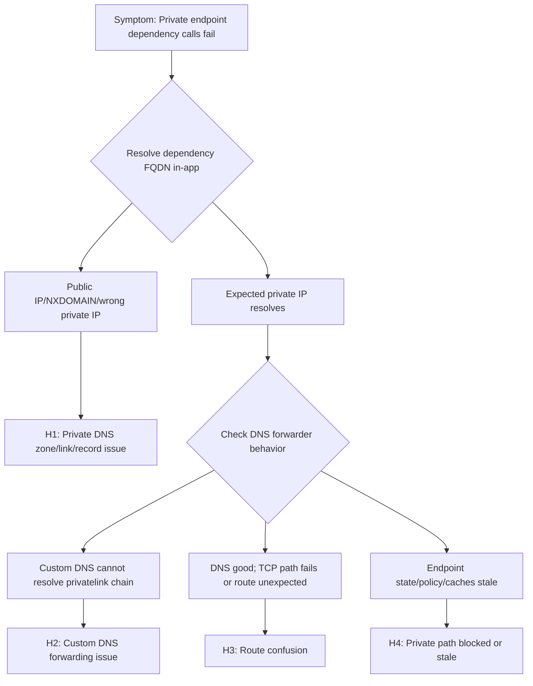

---
hide:
  - toc
content_sources:
  diagrams:
    - id: private-endpoint-dns-route-flow
      type: flowchart
      source: self-generated
      justification: "Synthesized private endpoint, DNS, and route validation steps from Microsoft Learn guidance on App Service private endpoints, VNet integration, and networking features."
      based_on:
        - https://learn.microsoft.com/en-us/azure/app-service/overview-private-endpoint
        - https://learn.microsoft.com/en-us/azure/app-service/overview-vnet-integration
        - https://learn.microsoft.com/en-us/azure/app-service/networking-features
        - https://learn.microsoft.com/en-us/troubleshoot/azure/app-service/troubleshoot-vnet-integration-apps
---

# Private Endpoint / Custom DNS / Route Confusion (Azure App Service Linux)

## 1. Summary
### Symptom
Outbound calls from an Azure App Service Linux app to a dependency expected over Private Endpoint fail with timeout/refused errors, or the hostname resolves to a public IP instead of the expected private IP.

### Why this scenario is confusing
Private Endpoint health, DNS resolution, and route policy are separate layers. Portal status may look healthy while runtime traffic still takes a public or blocked path.

### Troubleshooting decision flow
<!-- diagram-id: private-endpoint-dns-route-flow -->


### Scope and limitations
- Linux/OSS scope only; Windows-specific worker behavior is out of scope.
- Authentication-only incidents are covered only when routing or DNS confusion is involved.
- Vendor-specific firewall tuning is intentionally excluded.

### Quick conclusion
For this incident class, prove DNS answer, route path, and policy allowance independently from inside the Linux app. Most durable fixes come from correcting private DNS links/forwarding, aligning route-all with UDR intent, and removing policy/cache mismatches that keep traffic from the intended private endpoint.

## 2. Common Misreadings
- "Private Endpoint is approved, so DNS is correct."
- "It resolves on my laptop, so App Service resolution is identical."
- "VNet Integration means all outbound is private by default."
- "Intermittent failures prove platform instability" (often TTL/cache transition).

## 3. Competing Hypotheses
- H1: Private DNS zone is missing, unlinked, or has wrong A record.
- H2: Custom DNS does not forward `privatelink.*` zones correctly (e.g., missing conditional forwarding to Azure DNS `168.63.129.16`, or enterprise resolver misconfiguration).
- H3: Route confusion (route-all off, conflicting UDR, split-horizon design mismatch).
- H4: Private path is blocked or stale (NSG/firewall deny, endpoint not approved, old DNS cache).

## 4. What to Check First
### Metrics
- App Service HTTP 5xx and latency trend during dependency calls.
- Dependency-side connectivity failure metrics in the same time window.
- Firewall or NVA deny counters for destination private IP/port.

### Logs
- Resolver errors: `ENOTFOUND`, `EAI_AGAIN`, `Name or service not known`.
- Connect errors: `ETIMEDOUT`, `ECONNREFUSED`, `No route to host`.
- DNS forwarder logs for `privatelink.*` queries.

### Platform Signals
- VNet Integration state and subnet assignment.
- Private Endpoint connection state (`Approved`, `Pending`, `Rejected`, `Disconnected`).
- Private DNS zone links and A record values.
- Effective routes and NSG rules on integration/private endpoint subnets.

### Investigation Notes
- Always validate from inside Linux App Service runtime; external resolver behavior is not authoritative.
- Private connectivity requires both correct DNS answer and permitted network path.
- Different services use different private FQDN patterns; verify the exact expected name.
- Intermittent behavior after endpoint changes often maps to TTL and cache layering.
- Keep all timeline correlation in UTC.

## 5. Evidence to Collect
### Required Evidence
- In-app resolution output for exact dependency FQDN (`nslookup`, `getent hosts`).
- Private Endpoint NIC IP and subresource mapping.
- Private DNS zone link list and record-set values.
- Integration subnet route table and effective allow/deny controls.
- UTC timestamped app failures.

### Useful Context
- Custom DNS architecture and forwarder chain.
- Current route-all setting for the app.
- Recent changes to endpoint, DNS, route table, NSG, firewall policy.
- DNS TTL and known cache layers (runtime, resolver, forwarder).

### Sample Log Patterns
#### AppServiceHTTPLogs (dns-vnet lab)

```text
[AppServiceHTTPLogs]
2026-04-04T11:23:04Z  GET  /diag/env    200    15
2026-04-04T11:23:03Z  GET  /diag/stats  200    24
2026-04-04T11:22:19Z  GET  /connect     200    975
2026-04-04T11:22:18Z  GET  /resolve     200    512
2026-04-04T11:18:02Z  GET  /            200    148
2026-04-04T11:17:12Z  GET  /diag/stats  499    24400
```

#### AppServiceConsoleLogs (dns-vnet lab)

```text
[AppServiceConsoleLogs]
0 rows returned for incident window.
```

#### AppServicePlatformLogs (dns-vnet lab)

```text
[AppServicePlatformLogs]
2026-04-04T11:17:11Z  Informational  Site is running with patch version PYTHON 3.11.14
2026-04-04T11:17:11Z  Informational  State: Started, Action: None, LastError: , LastErrorTimestamp: 01/01/0001 00:00:00
2026-04-04T11:17:11Z  Informational  Site started.
2026-04-04T11:17:11Z  Informational  Site is running with deployment version: xxxxxxxx-xxxx-xxxx-xxxx-xxxxxxxxxxxx
2026-04-04T11:17:10Z  Informational  State: Starting, Action: WarmUpProbeSucceeded
2026-04-04T11:17:10Z  Informational  Site startup probe succeeded after 36.3947007 seconds.
```

!!! tip "How to Read This"
    Healthy startup + successful app health endpoints does not prove private endpoint path correctness. In this incident class, the deciding evidence is `/resolve` answer quality and `/connect` destination behavior.

### KQL Queries with Example Output
#### Query 1: Focus on `/resolve` and `/connect` timeline

```kusto
AppServiceHTTPLogs
| where TimeGenerated between (datetime(2026-04-04 11:17:00) .. datetime(2026-04-04 11:24:00))
| where CsUriStem in ("/resolve", "/connect", "/diag/stats")
| project TimeGenerated, CsMethod, CsUriStem, ScStatus, TimeTaken
| order by TimeGenerated desc
```

**Example Output:**

| TimeGenerated | CsMethod | CsUriStem | ScStatus | TimeTaken |
|---|---|---|---|---|
| 2026-04-04 11:22:19 | GET | /connect | 200 | 975 |
| 2026-04-04 11:22:18 | GET | /resolve | 200 | 512 |
| 2026-04-04 11:17:12 | GET | /diag/stats | 499 | 24400 |

!!! tip "How to Read This"
    `/resolve` and `/connect` returning `200` only means handlers completed, not that they used private path. Validate their payload details (resolved IP and SSL/connect details) before concluding network is healthy.

#### Query 2: Verify startup baseline is healthy

```kusto
AppServicePlatformLogs
| where TimeGenerated between (datetime(2026-04-04 11:17:00) .. datetime(2026-04-04 11:18:00))
| project TimeGenerated, Level, Message
| order by TimeGenerated asc
```

**Example Output:**

| TimeGenerated | Level | Message |
|---|---|---|
| 2026-04-04 11:17:10 | Informational | Site startup probe succeeded after 36.3947007 seconds. |
| 2026-04-04 11:17:11 | Informational | Site started. |
| 2026-04-04 11:17:11 | Informational | Site is running with deployment version: xxxxxxxx-xxxx-xxxx-xxxx-xxxxxxxxxxxx |

!!! tip "How to Read This"
    This removes startup instability from the root-cause set and strengthens H1/H2/H3 (DNS/forwarding/route confusion) over generic app crash hypotheses.

#### Query 3: Verify console diagnostic gap

```kusto
AppServiceConsoleLogs
| where TimeGenerated between (datetime(2026-04-04 11:17:00) .. datetime(2026-04-04 11:24:00))
| project TimeGenerated, Level, ResultDescription
| order by TimeGenerated asc
```

**Example Output:**

| TimeGenerated | Level | ResultDescription |
|---|---|---|
| _No rows_ |  |  |

!!! tip "How to Read This"
    A console-log gap is common here. Use endpoint diagnostics and Azure network/DNS control-plane evidence as primary proof.

### CLI Investigation Commands

```bash
# Confirm private endpoint state and private IP
az network private-endpoint show --resource-group <resource-group> --name <private-endpoint-name> --query "{name:name,ip:networkInterfaces[0].id,provisioningState:provisioningState}" --output table

# Validate private DNS zone links
az network private-dns link vnet list --resource-group <dns-resource-group> --zone-name privatelink.blob.core.windows.net --output table

# Validate private DNS A records
az network private-dns record-set a list --resource-group <dns-resource-group> --zone-name privatelink.blob.core.windows.net --output table

# Confirm app VNet integration and route-all
az webapp show --resource-group <resource-group> --name <app-name> --query "{virtualNetworkSubnetId:virtualNetworkSubnetId,vnetRouteAllEnabled:siteConfig.vnetRouteAllEnabled}" --output table
```

**Example Output:**

```text
Name                     ProvisioningState
-----------------------  -----------------
pe-stlabdnsvnet-blob     Succeeded

Name                       VirtualNetwork
-------------------------  --------------------------------------------------------------------------------
link-spoke-vnet            /subscriptions/<subscription-id>/resourceGroups/<resource-group>/providers/Microsoft.Network/virtualNetworks/<spoke-vnet>

Name                 IPv4Address
-------------------  ----------------
stlabdnsvnet         10.20.2.4

VirtualNetworkSubnetId                                                                                                        VnetRouteAllEnabled
----------------------------------------------------------------------------------------------------------------------------  -------------------
/subscriptions/<subscription-id>/resourceGroups/<resource-group>/providers/Microsoft.Network/virtualNetworks/<vnet>/subnets/<subnet>  true
```

!!! tip "How to Read This"
    In the dns-vnet incident, `/resolve` proved `stlabdnsvnet....blob.core.windows.net` and `stlabdnsvnet....privatelink.blob.core.windows.net` resolved to public `20.60.200.161`, and `/connect` showed SSL failure to the privatelink URL. That evidence is definitive for DNS/link/forwarding misconfiguration, not endpoint approval failure.

## 6. Validation and Disproof by Hypothesis

### H1: Private DNS zone/link/record is wrong
**Signals that support**
- App resolves dependency to public IP or NXDOMAIN.
- Zone exists but VNet link to integration VNet is missing.
- A record points to an old private endpoint IP.

**Signals that weaken**
- App resolves consistently to current endpoint private IP.
- Zone link and record remain correct across incident windows.

**Validation (CLI + KQL)**
```bash
nslookup <dependency-fqdn>
getent hosts <dependency-fqdn>
az network private-dns zone show --resource-group <resource-group> --name <private-dns-zone>
az network private-dns link vnet list --resource-group <resource-group> --zone-name <private-dns-zone> --output table
az network private-dns record-set a show --resource-group <resource-group> --zone-name <private-dns-zone> --name <record-name>
```

```kusto
AppServiceConsoleLogs
| where TimeGenerated > ago(6h)
| where ResultDescription has_any ("ENOTFOUND", "EAI_AGAIN", "NXDOMAIN", "Name or service not known")
| project TimeGenerated, _ResourceId, ResultDescription
| order by TimeGenerated desc
```

### H2: Custom DNS is not forwarding to Azure DNS
**Signals that support**
- Query against custom DNS fails, but query against `168.63.129.16` returns expected private IP.
- Failures affect multiple private endpoint dependencies.

**Signals that weaken**
- Custom DNS resolves private and public names consistently.
- Failures persist when DNS resolution is proven correct.

**Validation (CLI + KQL)**
```bash
az network vnet show --resource-group <resource-group> --name <vnet-name> --query "dhcpOptions.dnsServers"
nslookup <dependency-fqdn> <custom-dns-ip>
nslookup <dependency-fqdn> 168.63.129.16
az webapp show --resource-group <resource-group> --name <app-name> --query "siteConfig.vnetRouteAllEnabled"
```

```kusto
AppServiceConsoleLogs
| where TimeGenerated > ago(12h)
| where ResultDescription has_any ("Temporary failure in name resolution", "DNS", "lookup")
| summarize Failures=count() by bin(TimeGenerated, 15m)
| order by TimeGenerated desc
```

### H3: Route confusion (route-all/UDR/split-horizon)
**Signals that support**
- DNS resolves to private IP, but TCP to destination port times out.
- Effective routes show unexpected next hop.
- Route-all is disabled while design expects centralized inspection path.

**Signals that weaken**
- Effective route is valid and direct/private path tests succeed.
- Failures are resolver-only, not connect-path failures.

**Validation (CLI + KQL)**
```bash
az webapp show --resource-group <resource-group> --name <app-name> --query "{vnetRouteAllEnabled:siteConfig.vnetRouteAllEnabled, virtualNetworkSubnetId:virtualNetworkSubnetId}"
az webapp vnet-integration list --resource-group <resource-group> --name <app-name>
az network vnet subnet show --resource-group <resource-group> --vnet-name <vnet-name> --name <integration-subnet-name>
az network route-table route list --resource-group <resource-group> --route-table-name <route-table-name> --output table
nc -vz <private-endpoint-ip> <port>
curl --verbose --connect-timeout 5 https://<dependency-fqdn>
```

```kusto
AppServiceConsoleLogs
| where TimeGenerated > ago(6h)
| where ResultDescription has_any ("ETIMEDOUT", "ECONNREFUSED", "No route to host", "connect timeout")
| project TimeGenerated, _ResourceId, ResultDescription
| order by TimeGenerated desc
```

### H4: Private path blocked or stale state
**Signals that support**
- Endpoint state is `Pending`/`Rejected`/`Disconnected`.
- NSG/firewall denies destination private IP/port.
- Endpoint was recreated and DNS cache still points to old IP until TTL expiry.

**Signals that weaken**
- Endpoint is approved, NSG/firewall allows path, DNS record equals current NIC IP.
- Failures continue long after TTL with no route/policy changes.

**Validation (CLI + KQL)**
```bash
az network private-endpoint show --resource-group <resource-group> --name <private-endpoint-name>
az network private-endpoint-connection list --resource-group <resource-group> --name <resource-name> --type <resource-provider-type>
az network vnet subnet show --resource-group <resource-group> --vnet-name <vnet-name> --name <integration-subnet-name> --query "networkSecurityGroup.id"
az network nsg rule list --resource-group <resource-group> --nsg-name <nsg-name> --output table
```

```kusto
AppServiceConsoleLogs
| where TimeGenerated > ago(6h)
| where ResultDescription has_any ("ETIMEDOUT", "timeout", "connection refused")
| summarize Errors=count() by bin(TimeGenerated, 10m)
| order by TimeGenerated desc
```

### Normal vs Abnormal Comparison

| Signal | Normal private endpoint path | Abnormal route/DNS confusion pattern |
|---|---|---|
| Public storage FQDN resolution | May resolve publicly from non-private path contexts | In-app private scenario should use private chain, not public answer |
| `*.privatelink.blob.core.windows.net` resolution | Resolves to private IP (10.x) tied to private endpoint NIC | Resolves to public IP `20.60.200.161` |
| `/connect` to privatelink URL | TLS/connect success using private route | SSL/connect failure due to public endpoint routing |
| Private endpoint state | Approved/Succeeded and matched DNS mapping | Endpoint may appear healthy while DNS points elsewhere |
| App/platform startup logs | Healthy | Healthy (not a startup issue) |
| Interpretation | DNS + route policy aligned | DNS zone link/forwarding missing or incorrect despite healthy endpoint object |

## 7. Likely Root Cause Patterns
- Pattern A: Private DNS zone link missing for the integration VNet.
- Pattern B: Custom DNS forwarder does not correctly resolve `privatelink.*` zones (missing conditional forwarding to Azure DNS `168.63.129.16` or Azure DNS Private Resolver misconfiguration).
- Pattern C: Route-all expectation mismatch with UDR/firewall design.
- Pattern D: NSG/firewall deny introduced during policy hardening.
- Pattern E: Endpoint recreation changed private IP, but caches retained old mapping.

## 8. Immediate Mitigations
- Fix zone link and A record for the affected private zone. **Risk: Low**.
- Add conditional forwarding for private zones to `168.63.129.16`. **Risk: Medium** (shared impact if misconfigured).
- Align route-all and UDR behavior with intended architecture. **Risk: Medium** (egress behavior can shift broadly).
- Add explicit allow rules for integration subnet to endpoint IP/port. **Risk: Medium** (scope carefully).
- Temporarily shorten DNS TTL during cutover and monitor cache convergence. **Risk: Low**.

## 9. Prevention
- Automate Private Endpoint onboarding checks (approval, DNS link, record correctness, route policy).
- Standardize DNS forwarding architecture for Azure private zones.
- Add CI policy tests to block route/NSG changes that break private endpoint reachability.
- Run synthetic DNS + TCP probes from App Service runtime for critical dependencies.
- Track DNS change windows with explicit rollback paths.

## See Also
- [`../../kql/http/5xx-trend-over-time.md`](../../kql/http/5xx-trend-over-time.md)
- [`../../kql/http/latency-trend-by-status-code.md`](../../kql/http/latency-trend-by-status-code.md)
- [`../../kql/correlation/latency-vs-errors.md`](../../kql/correlation/latency-vs-errors.md)
- [`../../first-10-minutes/outbound-network.md`](../../first-10-minutes/outbound-network.md)
- [Lab: DNS Resolution (VNet)](../../lab-guides/dns-vnet-resolution.md)
- [Outbound Network (First 10 Minutes)](../../first-10-minutes/outbound-network.md)
- [DNS Resolution (VNet-integrated App Service)](dns-resolution-vnet-integrated-app-service.md)

## Sources
- [Azure Private Endpoint DNS configuration](https://learn.microsoft.com/en-us/azure/private-link/private-endpoint-dns)
- [Integrate your app with an Azure virtual network](https://learn.microsoft.com/en-us/azure/app-service/overview-vnet-integration)
- [Azure App Service networking features](https://learn.microsoft.com/en-us/azure/app-service/networking-features)
- [What is Azure Private Link?](https://learn.microsoft.com/en-us/azure/private-link/private-link-overview)
- [Azure DNS private zones overview](https://learn.microsoft.com/en-us/azure/dns/private-dns-overview)
