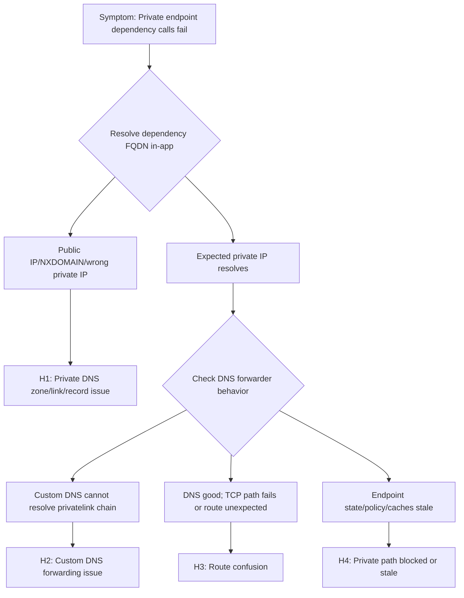

---
content_sources:
  diagrams:
    - id: private-endpoint-dns-route-flow
      type: flowchart
      source: self-generated
      justification: "Synthesized private endpoint, DNS, and route validation steps from Microsoft Learn guidance on App Service private endpoints, VNet integration, and networking features."
      based_on:
        - https://learn.microsoft.com/en-us/azure/app-service/overview-private-endpoint
        - https://learn.microsoft.com/en-us/azure/app-service/overview-vnet-integration
        - https://learn.microsoft.com/en-us/azure/app-service/networking-features
        - https://learn.microsoft.com/en-us/troubleshoot/azure/app-service/troubleshoot-vnet-integration-apps
content_validation:
  status: verified
  last_reviewed: "2026-04-12"
  reviewer: agent
  core_claims:
    - claim: "Private Endpoint health, DNS resolution, and route policy are separate layers."
      source: "https://learn.microsoft.com/en-us/azure/app-service/networking-features"
      verified: true
    - claim: "Private connectivity requires both correct DNS answer and permitted network path."
      source: "https://learn.microsoft.com/en-us/azure/app-service/overview-vnet-integration"
      verified: true
---

# Private Endpoint / Custom DNS / Route Confusion (Azure App Service Linux)

## 1. Summary
### Symptom
Outbound calls from an Azure App Service Linux app to a dependency expected over Private Endpoint fail with timeout/refused errors, or the hostname resolves to a public IP instead of the expected private IP.

### Why this scenario is confusing
Private Endpoint health, DNS resolution, and route policy are separate layers. Portal status may look healthy while runtime traffic still takes a public or blocked path.

### Troubleshooting decision flow
<!-- diagram-id: private-endpoint-dns-route-flow -->

```mermaid
graph TD
    A[Symptom: Private endpoint dependency calls fail] --> B{Resolve dependency FQDN in-app}
    B --> C[Public IP/NXDOMAIN/wrong private IP]
    B --> D[Expected private IP resolves]
    C --> H1[H1: Private DNS zone/link/record issue]
    D --> E{Check DNS forwarder behavior}
    E --> F[Custom DNS cannot resolve privatelink chain]
    E --> G[DNS good; TCP path fails or route unexpected]
    E --> I[Endpoint state/policy/caches stale]
    F --> H2[H2: Custom DNS forwarding issue]
    G --> H3[H3: Route confusion]
    I --> H4[H4: Private path blocked or stale]
```

### Scope and limitations
- Linux/OSS scope only; Windows-specific worker behavior is out of scope.
- Authentication-only incidents are covered only when routing or DNS confusion is involved.
- Vendor-specific firewall tuning is intentionally excluded.

### Quick conclusion
For this incident class, prove DNS answer, route path, and policy allowance independently from inside the Linux app. Most durable fixes come from correcting private DNS links/forwarding, aligning route-all with UDR intent, and removing policy/cache mismatches that keep traffic from the intended private endpoint.

## 2. Common Misreadings
- "Private Endpoint is approved, so DNS is correct."
- "It resolves on my laptop, so App Service resolution is identical."
- "VNet Integration means all outbound is private by default."
- "Intermittent failures prove platform instability" (often TTL/cache transition).

## 3. Competing Hypotheses
- H1: Private DNS zone is missing, unlinked, or has wrong A record.
- H2: Custom DNS does not forward `privatelink.*` zones correctly (e.g., missing conditional forwarding to Azure DNS `<ip-redacted>`, or enterprise resolver misconfiguration).
- H3: Route confusion (route-all off, conflicting UDR, split-horizon design mismatch).
- H4: Private path is blocked or stale (NSG/firewall deny, endpoint not approved, old DNS cache).

## 4. What to Check First
### Metrics
- App Service HTTP 5xx and latency trend during dependency calls.
- Dependency-side connectivity failure metrics in the same time window.
- Firewall or NVA deny counters for destination private IP/port.

### Logs
- Resolver errors: `ENOTFOUND`, `EAI_AGAIN`, `Name or service not known`.
- Connect errors: `ETIMEDOUT`, `ECONNREFUSED`, `No route to host`.
- DNS forwarder logs for `privatelink.*` queries.

### Platform Signals
- VNet Integration state and subnet assignment.
- Private Endpoint connection state (`Approved`, `Pending`, `Rejected`, `Disconnected`).
- Private DNS zone links and A record values.
- Effective routes and NSG rules on integration/private endpoint subnets.

#### Portal view

The App Service **Networking** blade is the single control panel that separates the three layers this playbook keeps apart — DNS answer, route path, and policy allowance. Rather than read it as one screenshot, walk it as an ordered trail. See [Section 10 — Portal Evidence](#10-portal-evidence) for the step-by-step diagnostic walk of this blade, keyed to each card in the order you should verify it.

### Investigation Notes
- Always validate from inside Linux App Service runtime; external resolver behavior is not authoritative.
- Private connectivity requires both correct DNS answer and permitted network path.
- Different services use different private FQDN patterns; verify the exact expected name.
- Intermittent behavior after endpoint changes often maps to TTL and cache layering.
- Keep all timeline correlation in UTC.

## 5. Evidence to Collect
### Required Evidence
- In-app resolution output for exact dependency FQDN (`nslookup`, `getent hosts`).
- Private Endpoint NIC IP and subresource mapping.
- Private DNS zone link list and record-set values.
- Integration subnet route table and effective allow/deny controls.
- UTC timestamped app failures.

### Useful Context
- Custom DNS architecture and forwarder chain.
- Current route-all setting for the app.
- Recent changes to endpoint, DNS, route table, NSG, firewall policy.
- DNS TTL and known cache layers (runtime, resolver, forwarder).

### Sample Log Patterns
#### AppServiceHTTPLogs (dns-vnet lab)

```text
[AppServiceHTTPLogs]
2026-04-04T11:23:04Z  GET  /diag/env    200    15
2026-04-04T11:23:03Z  GET  /diag/stats  200    24
2026-04-04T11:22:19Z  GET  /connect     200    975
2026-04-04T11:22:18Z  GET  /resolve     200    512
2026-04-04T11:18:02Z  GET  /            200    148
2026-04-04T11:17:12Z  GET  /diag/stats  499    24400
```

#### AppServiceConsoleLogs (dns-vnet lab)

```text
[AppServiceConsoleLogs]
0 rows returned for incident window.
```

#### AppServicePlatformLogs (dns-vnet lab)

```text
[AppServicePlatformLogs]
2026-04-04T11:17:11Z  Informational  Site is running with patch version PYTHON 3.11.14
2026-04-04T11:17:11Z  Informational  State: Started, Action: None, LastError: , LastErrorTimestamp: 01/01/0001 00:00:00
2026-04-04T11:17:11Z  Informational  Site started.
2026-04-04T11:17:11Z  Informational  Site is running with deployment version: xxxxxxxx-xxxx-xxxx-xxxx-xxxxxxxxxxxx
2026-04-04T11:17:10Z  Informational  State: Starting, Action: WarmUpProbeSucceeded
2026-04-04T11:17:10Z  Informational  Site startup probe succeeded after 36.3947007 seconds.
```

!!! tip "How to Read This"
    Healthy startup + successful app health endpoints does not prove private endpoint path correctness. In this incident class, the deciding evidence is `/resolve` answer quality and `/connect` destination behavior.

### KQL Queries with Example Output
#### Query 1: Focus on `/resolve` and `/connect` timeline

```kusto
AppServiceHTTPLogs
| where TimeGenerated between (datetime(2026-04-04 11:17:00) .. datetime(2026-04-04 11:24:00))
| where CsUriStem in ("/resolve", "/connect", "/diag/stats")
| project TimeGenerated, CsMethod, CsUriStem, ScStatus, TimeTaken
| order by TimeGenerated desc
```

**Example Output:**

| TimeGenerated | CsMethod | CsUriStem | ScStatus | TimeTaken |
|---|---|---|---|---|
| 2026-04-04 11:22:19 | GET | /connect | 200 | 975 |
| 2026-04-04 11:22:18 | GET | /resolve | 200 | 512 |
| 2026-04-04 11:17:12 | GET | /diag/stats | 499 | 24400 |

!!! tip "How to Read This"
    `/resolve` and `/connect` returning `200` only means handlers completed, not that they used private path. Validate their payload details (resolved IP and SSL/connect details) before concluding network is healthy.

#### Query 2: Verify startup baseline is healthy

```kusto
AppServicePlatformLogs
| where TimeGenerated between (datetime(2026-04-04 11:17:00) .. datetime(2026-04-04 11:18:00))
| project TimeGenerated, Level, Message
| order by TimeGenerated asc
```

**Example Output:**

| TimeGenerated | Level | Message |
|---|---|---|
| 2026-04-04 11:17:10 | Informational | Site startup probe succeeded after 36.3947007 seconds. |
| 2026-04-04 11:17:11 | Informational | Site started. |
| 2026-04-04 11:17:11 | Informational | Site is running with deployment version: xxxxxxxx-xxxx-xxxx-xxxx-xxxxxxxxxxxx |

!!! tip "How to Read This"
    This removes startup instability from the root-cause set and strengthens H1/H2/H3 (DNS/forwarding/route confusion) over generic app crash hypotheses.

#### Query 3: Verify console diagnostic gap

```kusto
AppServiceConsoleLogs
| where TimeGenerated between (datetime(2026-04-04 11:17:00) .. datetime(2026-04-04 11:24:00))
| project TimeGenerated, Level, ResultDescription
| order by TimeGenerated asc
```

**Example Output:**

| TimeGenerated | Level | ResultDescription |
|---|---|---|
| _No rows_ |  |  |

!!! tip "How to Read This"
    A console-log gap is common here. Use endpoint diagnostics and Azure network/DNS control-plane evidence as primary proof.

### CLI Investigation Commands

```bash
# Confirm private endpoint state and private IP
az network private-endpoint show --resource-group <resource-group> --name <private-endpoint-name> --query "{name:name,ip:networkInterfaces[0].id,provisioningState:provisioningState}" --output table

# Validate private DNS zone links
az network private-dns link vnet list --resource-group <dns-resource-group> --zone-name privatelink.blob.core.windows.net --output table

# Validate private DNS A records
az network private-dns record-set a list --resource-group <dns-resource-group> --zone-name privatelink.blob.core.windows.net --output table

# Confirm app VNet integration and route-all
az webapp show --resource-group <resource-group> --name <app-name> --query "{virtualNetworkSubnetId:virtualNetworkSubnetId,vnetRouteAllEnabled:siteConfig.vnetRouteAllEnabled}" --output table
```

| Command | Purpose |
|---------|---------|
| `az network private-endpoint show --resource-group <resource-group> --name <private-endpoint-name> --query "{name:name,ip:networkInterfaces[0].id,provisioningState:provisioningState}" --output table` | Shows the private endpoint name, the attached NIC resource ID (projected into the `ip` field here), and the provisioning state. |
| `--resource-group <resource-group> --name <private-endpoint-name> --query "{name:name,ip:networkInterfaces[0].id,provisioningState:provisioningState}" --output table` | Scopes the lookup to the resource group containing the private endpoint. |
| `--name <private-endpoint-name> --query "{name:name,ip:networkInterfaces[0].id,provisioningState:provisioningState}" --output table` | Targets this private endpoint. |
| `--query "{name:name,ip:networkInterfaces[0].id,provisioningState:provisioningState}"` | Projects the endpoint name, the first attached NIC resource ID, and the provisioning state from the private endpoint resource. |
| `--output table` | Formats the projected private-endpoint fields as a table. |
| `az network private-dns link vnet list --resource-group <dns-resource-group> --zone-name privatelink.blob.core.windows.net --output table` | Lists the virtual-network links for this Private DNS zone so you can confirm whether the expected VNet is linked. |
| `--resource-group <dns-resource-group> --zone-name privatelink.blob.core.windows.net --output table` | Scopes the lookup to the resource group that owns the Private DNS zone. |
| `--zone-name privatelink.blob.core.windows.net --output table` | Targets this Private DNS zone. |
| `--output table` | Formats the VNet-link results as a table for quick verification. |
| `az network private-dns record-set a list --resource-group <dns-resource-group> --zone-name privatelink.blob.core.windows.net --output table` | Lists the A records in this Private DNS zone so you can confirm whether the dependency name points to the expected private IP. |
| `--resource-group <dns-resource-group> --zone-name privatelink.blob.core.windows.net --output table` | Scopes the lookup to the resource group that owns the Private DNS zone. |
| `--zone-name privatelink.blob.core.windows.net --output table` | Targets this Private DNS zone. |
| `--output table` | Formats the record list as a table for quick comparison. |
| `az webapp show --resource-group <resource-group> --name <app-name> --query "{virtualNetworkSubnetId:virtualNetworkSubnetId,vnetRouteAllEnabled:siteConfig.vnetRouteAllEnabled}" --output table` | Shows the integration subnet resource ID and the nested `siteConfig.vnetRouteAllEnabled` flag for this app. |
| `--resource-group <resource-group> --name <app-name> --query "{virtualNetworkSubnetId:virtualNetworkSubnetId,vnetRouteAllEnabled:siteConfig.vnetRouteAllEnabled}" --output table` | Looks up the resource in this resource group. |
| `--name <app-name> --query "{virtualNetworkSubnetId:virtualNetworkSubnetId,vnetRouteAllEnabled:siteConfig.vnetRouteAllEnabled}" --output table` | Targets this web app. |
| `--query "{virtualNetworkSubnetId:virtualNetworkSubnetId,vnetRouteAllEnabled:siteConfig.vnetRouteAllEnabled}"` | Projects only the fields needed here: the top-level integration subnet ID and the nested `siteConfig.vnetRouteAllEnabled` value. |
| `--output table` | Formats the projected web app fields as a table for quick reading. |

**Example Output:**

```text
Name                     ProvisioningState
-----------------------  -----------------
pe-stlabdnsvnet-blob     Succeeded

Name                       VirtualNetwork
-------------------------  --------------------------------------------------------------------------------
link-spoke-vnet            /subscriptions/<subscription-id>/resourceGroups/<resource-group>/providers/Microsoft.Network/virtualNetworks/<spoke-vnet>

Name                 IPv4Address
-------------------  ----------------
stlabdnsvnet         10.20.2.4

VirtualNetworkSubnetId                                                                                                        VnetRouteAllEnabled
----------------------------------------------------------------------------------------------------------------------------  -------------------
/subscriptions/<subscription-id>/resourceGroups/<resource-group>/providers/Microsoft.Network/virtualNetworks/<vnet>/subnets/<subnet>  true
```

!!! tip "How to Read This"
    In the dns-vnet incident, `/resolve` proved `stlabdnsvnet....blob.core.windows.net` and `stlabdnsvnet....privatelink.blob.core.windows.net` resolved to public `<ip-redacted>`, and `/connect` showed SSL failure to the privatelink URL. That evidence is definitive for DNS/link/forwarding misconfiguration, not endpoint approval failure.

### Dependency Telemetry (Application Insights)

When the app is instrumented with Application Insights, the `dependencies` table records each outbound call's target, result, and duration — the most direct telemetry for a private-endpoint dependency failure. `AppServiceHTTPLogs` only shows the *inbound* request that triggered the call; `dependencies` shows the outbound leg itself.

```kusto
dependencies
| where timestamp > ago(6h)
| where type in ("HTTP", "Azure blob", "Azure queue", "Azure table", "SQL")
| summarize Calls=count(), Failures=countif(success == false), P95Ms=percentile(duration, 95)
          by target, type, bin(timestamp, 5m)
| order by Failures desc, timestamp desc
```

!!! tip "How to Read This"
    A `target` resolving to a **public** FQDN (or a spike in `Failures` with `duration` near a TLS/connect timeout) for a dependency that should be private confirms the traffic is not taking the private endpoint path — corroborating the `/resolve` and `/connect` evidence above. Correlate the failing `target` with the private DNS zone and route checks in Section 6.

## 6. Validation and Disproof by Hypothesis

### H1: Private DNS zone/link/record is wrong
**Signals that support**
- App resolves dependency to public IP or NXDOMAIN.
- Zone exists but VNet link to integration VNet is missing.
- A record points to an old private endpoint IP.

**Signals that weaken**
- App resolves consistently to current endpoint private IP.
- Zone link and record remain correct across incident windows.

**Validation (CLI + KQL)**
```bash
nslookup <dependency-fqdn>
getent hosts <dependency-fqdn>
az network private-dns zone show --resource-group <resource-group> --name <private-dns-zone>
az network private-dns link vnet list --resource-group <resource-group> --zone-name <private-dns-zone> --output table
az network private-dns record-set a show --resource-group <resource-group> --zone-name <private-dns-zone> --name <record-name>
```

| Command | Purpose |
|---------|---------|
| `nslookup <dependency-fqdn>` | Resolves the hostname using the current resolver path from the local shell or app container context. |
| `getent hosts <dependency-fqdn>` | Queries libc host resolution so you can compare the OS resolver answer that application code typically uses. |
| `az network private-dns zone show --resource-group <resource-group> --name <private-dns-zone>` | Shows the Private DNS zone resource so you can confirm the zone exists and inspect its properties. |
| `--resource-group <resource-group> --name <private-dns-zone>` | Scopes the lookup to the resource group that owns the Private DNS zone. |
| `--name <private-dns-zone>` | Targets this Private DNS zone. |
| `az network private-dns link vnet list --resource-group <resource-group> --zone-name <private-dns-zone> --output table` | Lists the virtual-network links for this Private DNS zone so you can confirm whether the expected VNet is linked. |
| `--resource-group <resource-group> --zone-name <private-dns-zone> --output table` | Scopes the lookup to the resource group that owns the Private DNS zone. |
| `--zone-name <private-dns-zone> --output table` | Targets this Private DNS zone. |
| `--output table` | Formats the VNet-link results as a table for quick verification. |
| `az network private-dns record-set a show --resource-group <resource-group> --zone-name <private-dns-zone> --name <record-name>` | Shows one specific A record set so you can verify the exact private IP mapping for this record name. |
| `--resource-group <resource-group> --zone-name <private-dns-zone> --name <record-name>` | Scopes the lookup to the resource group that owns the Private DNS zone. |
| `--zone-name <private-dns-zone> --name <record-name>` | Targets this Private DNS zone. |
| `--name <record-name>` | Targets this specific A-record set within the zone. |

```kusto
AppServiceConsoleLogs
| where TimeGenerated > ago(6h)
| where ResultDescription has_any ("ENOTFOUND", "EAI_AGAIN", "NXDOMAIN", "Name or service not known")
| project TimeGenerated, _ResourceId, ResultDescription
| order by TimeGenerated desc
```

### H2: Custom DNS is not forwarding to Azure DNS
**Signals that support**
- Query against custom DNS fails, but query against `<ip-redacted>` returns expected private IP.
- Failures affect multiple private endpoint dependencies.

**Signals that weaken**
- Custom DNS resolves private and public names consistently.
- Failures persist when DNS resolution is proven correct.

**Validation (CLI + KQL)**
```bash
az network vnet show --resource-group <resource-group> --name <vnet-name> --query "dhcpOptions.dnsServers"
nslookup <dependency-fqdn> <custom-dns-ip>
nslookup <dependency-fqdn> <ip-redacted>
az webapp show --resource-group <resource-group> --name <app-name> --query "siteConfig.vnetRouteAllEnabled"
```

| Command | Purpose |
|---------|---------|
| `az network vnet show --resource-group <resource-group> --name <vnet-name> --query "dhcpOptions.dnsServers"` | Shows the VNet resource so you can inspect the configured custom DNS server list for this network. |
| `--resource-group <resource-group> --name <vnet-name> --query "dhcpOptions.dnsServers"` | Scopes the lookup to the resource group that owns the VNet. |
| `--name <vnet-name> --query "dhcpOptions.dnsServers"` | Targets this virtual network. |
| `--query "dhcpOptions.dnsServers"` | Projects only the VNet's `dhcpOptions.dnsServers` list. |
| `nslookup <dependency-fqdn> <custom-dns-ip>` | Resolves the hostname by querying this specific DNS server directly so you can compare resolver behavior. |
| `nslookup <dependency-fqdn> <ip-redacted>` | Resolves the hostname by querying this specific DNS server directly so you can compare resolver behavior. |
| `az webapp show --resource-group <resource-group> --name <app-name> --query "siteConfig.vnetRouteAllEnabled"` | Shows the web app resource so you can inspect the current control-plane configuration and state. |
| `--resource-group <resource-group> --name <app-name> --query "siteConfig.vnetRouteAllEnabled"` | Looks up the resource in this resource group. |
| `--name <app-name> --query "siteConfig.vnetRouteAllEnabled"` | Targets this web app. |
| `--query "siteConfig.vnetRouteAllEnabled"` | Projects only the requested field(s) from the web app resource. |

```kusto
AppServiceConsoleLogs
| where TimeGenerated > ago(12h)
| where ResultDescription has_any ("Temporary failure in name resolution", "DNS", "lookup")
| summarize Failures=count() by bin(TimeGenerated, 15m)
| order by TimeGenerated desc
```

### H3: Route confusion (route-all/UDR/split-horizon)
**Signals that support**
- DNS resolves to private IP, but TCP to destination port times out.
- Effective routes show unexpected next hop.
- Route-all is disabled while design expects centralized inspection path.

**Signals that weaken**
- Effective route is valid and direct/private path tests succeed.
- Failures are resolver-only, not connect-path failures.

**Validation (CLI + KQL)**
```bash
az webapp show --resource-group <resource-group> --name <app-name> --query "{vnetRouteAllEnabled:siteConfig.vnetRouteAllEnabled, virtualNetworkSubnetId:virtualNetworkSubnetId}"
az webapp vnet-integration list --resource-group <resource-group> --name <app-name>
az network vnet subnet show --resource-group <resource-group> --vnet-name <vnet-name> --name <integration-subnet-name>
az network route-table route list --resource-group <resource-group> --route-table-name <route-table-name> --output table
nc -vz <private-endpoint-ip> <port>
curl --verbose --connect-timeout 5 https://<dependency-fqdn>
```

| Command | Purpose |
|---------|---------|
| `az webapp show --resource-group <resource-group> --name <app-name> --query "{vnetRouteAllEnabled:siteConfig.vnetRouteAllEnabled, virtualNetworkSubnetId:virtualNetworkSubnetId}"` | Shows the nested route-all flag and the integration subnet resource ID so you can validate the outbound routing posture. |
| `--resource-group <resource-group> --name <app-name> --query "{vnetRouteAllEnabled:siteConfig.vnetRouteAllEnabled, virtualNetworkSubnetId:virtualNetworkSubnetId}"` | Looks up the resource in this resource group. |
| `--name <app-name> --query "{vnetRouteAllEnabled:siteConfig.vnetRouteAllEnabled, virtualNetworkSubnetId:virtualNetworkSubnetId}"` | Targets this web app. |
| `--query "{vnetRouteAllEnabled:siteConfig.vnetRouteAllEnabled, virtualNetworkSubnetId:virtualNetworkSubnetId}"` | Projects only the fields needed here: the top-level integration subnet ID and the nested `siteConfig.vnetRouteAllEnabled` value. |
| `az webapp vnet-integration list --resource-group <resource-group> --name <app-name>` | Lists the web app's VNet integration bindings so you can confirm whether the expected subnet integration exists. |
| `--resource-group <resource-group> --name <app-name>` | Looks up the resource in this resource group. |
| `--name <app-name>` | Targets this web app. |
| `az network vnet subnet show --resource-group <resource-group> --vnet-name <vnet-name> --name <integration-subnet-name>` | Shows the integration subnet resource so you can inspect route-table, service-endpoint, NAT, or NSG attachments that affect this path. |
| `--resource-group <resource-group> --vnet-name <vnet-name> --name <integration-subnet-name>` | Scopes the lookup to the resource group that owns the VNet. |
| `--vnet-name <vnet-name> --name <integration-subnet-name>` | Targets this virtual network. |
| `--name <integration-subnet-name>` | Targets this specific subnet. |
| `az network route-table route list --resource-group <resource-group> --route-table-name <route-table-name> --output table` | Lists the user-defined routes in this route table so you can see whether they steer traffic away from the intended private path. |
| `--resource-group <resource-group> --route-table-name <route-table-name> --output table` | Scopes the lookup to the resource group containing the route table. |
| `--route-table-name <route-table-name> --output table` | Targets this route table. |
| `--output table` | Formats the route list as a table for quick route review. |
| `nc -vz <private-endpoint-ip> <port>` | Attempts a TCP connection to the target host and port and reports whether the socket opens successfully. |
| `nc -vz` | Runs `netcat` in verbose mode and checks only whether the TCP connection can be established. |
| `curl --verbose --connect-timeout 5 https://<dependency-fqdn>` | Makes an HTTPS request with verbose output and a short connect timeout so you can see TLS/HTTP behavior on the private path. |
| `--verbose` | Prints detailed request, TLS, and response information for troubleshooting. |
| `--connect-timeout 5` | Fails the connection attempt after 5 seconds so route problems surface quickly. |

```kusto
AppServiceConsoleLogs
| where TimeGenerated > ago(6h)
| where ResultDescription has_any ("ETIMEDOUT", "ECONNREFUSED", "No route to host", "connect timeout")
| project TimeGenerated, _ResourceId, ResultDescription
| order by TimeGenerated desc
```

### H4: Private path blocked or stale state
**Signals that support**
- Endpoint state is `Pending`/`Rejected`/`Disconnected`.
- NSG/firewall denies destination private IP/port.
- Endpoint was recreated and DNS cache still points to old IP until TTL expiry.

**Signals that weaken**
- Endpoint is approved, NSG/firewall allows path, DNS record equals current NIC IP.
- Failures continue long after TTL with no route/policy changes.

**Validation (CLI + KQL)**
```bash
az network private-endpoint show --resource-group <resource-group> --name <private-endpoint-name>
az network private-endpoint-connection list --resource-group <resource-group> --name <resource-name> --type <resource-provider-type>
az network vnet subnet show --resource-group <resource-group> --vnet-name <vnet-name> --name <integration-subnet-name> --query "networkSecurityGroup.id"
az network nsg rule list --resource-group <resource-group> --nsg-name <nsg-name> --output table
```

| Command | Purpose |
|---------|---------|
| `az network private-endpoint show --resource-group <resource-group> --name <private-endpoint-name>` | Shows the full private endpoint resource so you can inspect connection, NIC, and policy details. |
| `--resource-group <resource-group> --name <private-endpoint-name>` | Scopes the lookup to the resource group containing the private endpoint. |
| `--name <private-endpoint-name>` | Targets this private endpoint. |
| `az network private-endpoint-connection list --resource-group <resource-group> --name <resource-name> --type <resource-provider-type>` | Lists private-endpoint connection objects on the target resource so you can see whether approval state blocks the private path. |
| `--resource-group <resource-group> --name <resource-name> --type <resource-provider-type>` | Scopes the lookup to the resource group containing the target resource. |
| `--name <resource-name> --type <resource-provider-type>` | Targets this resource when listing its private-endpoint connections. |
| `--type <resource-provider-type>` | Specifies the target resource provider/type whose private-endpoint connections you want to list. |
| `az network vnet subnet show --resource-group <resource-group> --vnet-name <vnet-name> --name <integration-subnet-name> --query "networkSecurityGroup.id"` | Shows the integration subnet resource so you can inspect route-table, service-endpoint, NAT, or NSG attachments that affect this path. |
| `--resource-group <resource-group> --vnet-name <vnet-name> --name <integration-subnet-name> --query "networkSecurityGroup.id"` | Scopes the lookup to the resource group that owns the VNet. |
| `--vnet-name <vnet-name> --name <integration-subnet-name> --query "networkSecurityGroup.id"` | Targets this virtual network. |
| `--name <integration-subnet-name> --query "networkSecurityGroup.id"` | Targets this specific subnet. |
| `--query "networkSecurityGroup.id"` | Projects only the subnet's nested `networkSecurityGroup.id` value. |
| `az network nsg rule list --resource-group <resource-group> --nsg-name <nsg-name> --output table` | Lists the NSG rules so you can confirm whether any rule blocks the dependency IP or port. |
| `--resource-group <resource-group> --nsg-name <nsg-name> --output table` | Scopes the lookup to the resource group containing the NSG. |
| `--nsg-name <nsg-name> --output table` | Targets this network security group. |
| `--output table` | Formats the NSG rules as a table for quick inspection. |

```kusto
AppServiceConsoleLogs
| where TimeGenerated > ago(6h)
| where ResultDescription has_any ("ETIMEDOUT", "timeout", "connection refused")
| summarize Errors=count() by bin(TimeGenerated, 10m)
| order by TimeGenerated desc
```

### Normal vs Abnormal Comparison

| Signal | Normal private endpoint path | Abnormal route/DNS confusion pattern |
|---|---|---|
| Public storage FQDN resolution | May resolve publicly from non-private path contexts | In-app private scenario should use private chain, not public answer |
| `*.privatelink.blob.core.windows.net` resolution | Resolves to private IP (10.x) tied to private endpoint NIC | Resolves to public IP `<ip-redacted>` |
| `/connect` to privatelink URL | TLS/connect success using private route | SSL/connect failure due to public endpoint routing |
| Private endpoint state | Approved/Succeeded and matched DNS mapping | Endpoint may appear healthy while DNS points elsewhere |
| App/platform startup logs | Healthy | Healthy (not a startup issue) |
| Interpretation | DNS + route policy aligned | DNS zone link/forwarding missing or incorrect despite healthy endpoint object |

## 7. Likely Root Cause Patterns
- Pattern A: Private DNS zone link missing for the integration VNet.
- Pattern B: Custom DNS forwarder does not correctly resolve `privatelink.*` zones (missing conditional forwarding to Azure DNS `<ip-redacted>` or Azure DNS Private Resolver misconfiguration).
- Pattern C: Route-all expectation mismatch with UDR/firewall design.
- Pattern D: NSG/firewall deny introduced during policy hardening.
- Pattern E: Endpoint recreation changed private IP, but caches retained old mapping.

## 8. Immediate Mitigations
- Fix zone link and A record for the affected private zone. **Risk: Low**.
- Add conditional forwarding for private zones to `<ip-redacted>`. **Risk: Medium** (shared impact if misconfigured).
- Align route-all and UDR behavior with intended architecture. **Risk: Medium** (egress behavior can shift broadly).
- Add explicit allow rules for integration subnet to endpoint IP/port. **Risk: Medium** (scope carefully).
- Temporarily shorten DNS TTL during cutover and monitor cache convergence. **Risk: Low**.

## 9. Prevention
- Automate Private Endpoint onboarding checks (approval, DNS link, record correctness, route policy).
- Standardize DNS forwarding architecture for Azure private zones.
- Add CI policy tests to block route/NSG changes that break private endpoint reachability.
- Run synthetic DNS + TCP probes from App Service runtime for critical dependencies.
- Track DNS change windows with explicit rollback paths.

## 10. Portal Evidence

This section walks the App Service **Networking** blade **in diagnostic order**, as a *step-by-step* trail rather than a single blade read. All four steps below read different cards of the **same** capture — the blade is one screen, but the diagnostic value comes from reading its cards in the order that separates a DNS problem (H1/H2) from a route problem (H3) from a policy/stale-state problem (H4). The capture is a real, PII-cleaned Azure Portal screenshot from a Linux App Service; the inbound/outbound IP values shown are RFC-5737 (`192.0.2.x`) and RFC-3849 (`2001:db8::`) documentation ranges, not real addresses.

![Azure portal Networking blade for a Linux Web App, showing the Inbound traffic configuration column (Public network access Enabled with no access restrictions, App assigned address Not configured, Private endpoints 0 private endpoints, Inbound IPv4 and IPv6 addresses) and the Outbound traffic configuration column (Virtual network integration Not configured, Hybrid connections Not configured, Outbound DNS Default Azure-provided, Outbound IPv4 and IPv6 address lists), with the Integration subnet configuration card showing NAT gateway N/A, Network security group N/A, User defined route N/A, and a toolbar with Refresh, Troubleshoot, and Send us your feedback buttons](../../../assets/troubleshooting/networking/01-networking-hub.png)

### Step 1 — Confirm the integration prerequisite: `Outbound traffic configuration > Virtual network integration`

Purpose: Before DNS or routes can matter, the app must actually egress *through* the integration VNet — otherwise private DNS zones linked to that VNet are never consulted and the private endpoint is unreachable by design.
Look for: The **Outbound traffic configuration** column, **Virtual network integration** row.
Expected result: For any private-endpoint dependency, this must name an integration subnet. The captured `Not configured` state means the app egresses over the **public** path by default — without VNet integration the app does not use Private DNS zones linked to the integration VNet, so the `privatelink.*` private-IP answer is not returned and the private endpoint path stays unreachable regardless of zone or route configuration.
Abnormal: `Not configured` while the dependency is expected over a private endpoint supports an H1/H2 finding at the routing prerequisite level — fix VNet integration first, then re-verify DNS. Only once integration is configured should you read Step 2.
Next step: Read the **Outbound DNS** row to establish which resolver answers the app's lookups.

### Step 2 — Establish the resolver path: `Outbound traffic configuration > Outbound DNS`

Purpose: Decide whether the app resolves through Azure-provided DNS (which returns private zone records only when zones are linked to the integration VNet) or a custom resolver (which bypasses Azure DNS and must forward `privatelink.*` itself).
Look for: The **Outbound DNS** row.
Expected result: `Default (Azure-provided)` — the value shown in this capture — returns the private endpoint's private IP **only if** the matching `privatelink.*` Private DNS zone is linked to the integration VNet; a custom-resolver value means an enterprise resolver decides the answer and must conditionally forward the `privatelink.*` zones to Azure DNS `168.63.129.16`. Confirm the live value on your own blade rather than assuming a specific label string.
Abnormal: The captured `Default (Azure-provided)` state combined with a public-IP resolution result (see Section 5, `/resolve`) points to a missing zone link — an **H1** finding. A custom-resolver value that cannot resolve the `privatelink.*` chain is an **H2** finding.
Next step: Read the **Integration subnet configuration** card to rule out a route or policy block on the path to the private IP.

### Step 3 — Rule out route/policy interference: `Integration subnet configuration` (NSG / User defined route)

Purpose: Even with a correct private IP answer, a route table or NSG on the integration subnet can steer or block traffic to the dependency's private IP — this is the H3 (route confusion) / H4 (blocked path) layer.
Look for: The **Integration subnet configuration** card — the **Network security group** and **User defined route** rows (and **NAT gateway**, which affects public egress).
Expected result: For a direct private path, no UDR should redirect the dependency's private IP to an NVA/firewall that denies it, and no NSG rule should block the destination port. The captured `N/A` values indicate no route table or NSG is attached (consistent with the `Not configured` integration state from Step 1).
Abnormal: A UDR whose next hop is a firewall that denies the private IP/port, or an NSG deny rule, supports an **H3/H4** finding — validate with effective routes and `nc`/`curl` from inside the app (Section 6, H3/H4).
Next step: Confirm you are not misreading an inbound control as an outbound one (Step 4).

### Step 4 — Disambiguate the inbound `Private endpoints` red herring

Purpose: Prevent the single most common misread of this blade — treating the inbound **Private endpoints** count as evidence about the *outbound* dependency.
Look for: The **Inbound traffic configuration** column, **Private endpoints** row (captured as `0 private endpoints`).
Expected result: This count describes private endpoints *into the App Service itself* (inbound access to the app), which is unrelated to the app's *outbound* call to a private-endpoint dependency. A `0` here says nothing about whether the app can reach its dependency privately.
Abnormal: Concluding "outbound is broken because inbound private endpoints is 0" is a category error. Use the `Troubleshoot` toolbar button to launch the integrated network diagnostics, which test each outbound layer's reachability directly.

!!! warning "Do not screenshot secrets or real addresses"
    When capturing the Networking blade, never include real subscription/tenant identifiers, and follow the repository PII text-replacement rules. The inbound/outbound IP values in this capture are RFC-5737 / RFC-3849 documentation ranges, not live addresses.

## See Also
- [`../../kql/http/5xx-trend-over-time.md`](../../kql/http/5xx-trend-over-time.md)
- [`../../kql/http/latency-trend-by-status-code.md`](../../kql/http/latency-trend-by-status-code.md)
- [`../../kql/correlation/latency-vs-errors.md`](../../kql/correlation/latency-vs-errors.md)
- [`../../first-10-minutes/outbound-network.md`](../../first-10-minutes/outbound-network.md)
- [Lab: DNS Resolution (VNet)](../../lab-guides/dns-vnet-resolution.md)
- [Outbound Network (First 10 Minutes)](../../first-10-minutes/outbound-network.md)
- [DNS Resolution (VNet-integrated App Service)](dns-resolution-vnet-integrated-app-service.md)

## Sources
- [Azure Private Endpoint DNS configuration](https://learn.microsoft.com/en-us/azure/private-link/private-endpoint-dns)
- [Integrate your app with an Azure virtual network](https://learn.microsoft.com/en-us/azure/app-service/overview-vnet-integration)
- [Azure App Service networking features](https://learn.microsoft.com/en-us/azure/app-service/networking-features)
- [What is Azure Private Link?](https://learn.microsoft.com/en-us/azure/private-link/private-link-overview)
- [Azure DNS private zones overview](https://learn.microsoft.com/en-us/azure/dns/private-dns-overview)
