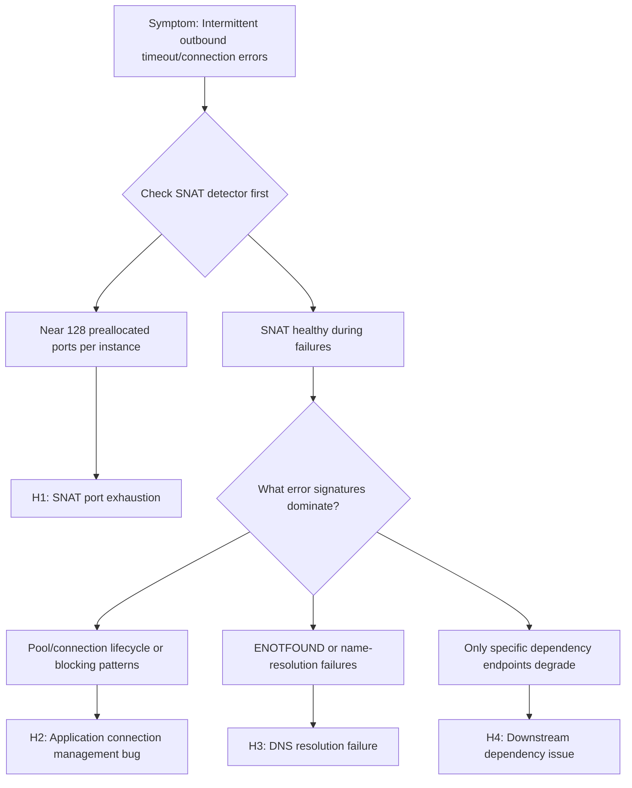

# SNAT or Application Issue? (Azure App Service Linux)

## 1. Summary
### Symptom
Outbound calls from the App Service app intermittently fail with timeouts or connection errors. The app can reach some external endpoints but fails on others, or failures appear under load but not during light traffic.

### Why this scenario is confusing
SNAT port exhaustion and application-level timeout/connection bugs produce nearly identical symptoms: intermittent outbound failures. Engineers often cannot tell whether the platform (SNAT) or the app (connection handling) is at fault.

### Troubleshooting decision flow


## 2. Common Misreadings
- "Outbound calls fail, so it must be a networking issue"
- "We're not making that many connections, so SNAT can't be the issue"
- "It works sometimes, so the network path is fine"
- "Adding more instances will fix it" (scale-out adds per-instance SNAT pools but does not fix bad connection patterns — the root cause persists and may mask the problem temporarily)

## 3. Competing Hypotheses
- H1: SNAT port exhaustion — app creates too many short-lived outbound connections without reuse, exceeding the 128 preallocated SNAT ports per instance
- H2: Application connection management bug — connection pool exhaustion, not closing HttpClient/connections, synchronous blocking
- H3: DNS resolution failure — VNet-integrated app cannot resolve private DNS, or DNS TTL caching issues
- H4: Downstream dependency issue — the target service is slow/down, causing connection queue buildup that looks like SNAT

## 4. What to Check First
### Metrics
- SNAT Port Exhaustion detector in App Service Diagnostics
- TCP Connections metric
- Outbound connection count per instance

### Logs
- AppServiceConsoleLogs: look for "connection refused", "timeout", "SNAT" messages
- AppServiceHTTPLogs: correlate slow/failed requests with outbound dependency endpoints

### Platform Signals
- SNAT Port Exhaustion detector
- TCP Connections detector
- VNet integration status (if applicable)
- NAT Gateway configuration (if applicable)

## 5. Evidence to Collect
### Required Evidence
- SNAT port allocation timeline from diagnostics
- TCP connection count over time
- Application-level connection pool configuration
- Outbound call patterns (how many unique destination IP:port combinations)

### Useful Context
- Whether app uses connection pooling (HttpClient reuse, database connection pooling)
- VNet integration settings
- NAT Gateway presence
- Private Endpoint configuration for dependencies
- Recent scale-out events (more instances = more SNAT demand if patterns are bad)

## 6. Validation and Disproof by Hypothesis

### H1: SNAT port exhaustion
**Signals that support**
- SNAT Port Exhaustion detector shows instances frequently at or near the preallocated 128 ports during incident windows.
- TCP Connections rises sharply on affected instances, and failures begin when connection churn increases (for example, traffic spikes or batch jobs).
- AppServiceConsoleLogs show outbound socket creation/connection timeout errors concentrated around the same timestamps as high SNAT utilization.
- Failures are most visible for public endpoints (internet or public PaaS FQDNs), while Private Endpoint traffic remains healthy.

**Signals that weaken**
- Detector shows low SNAT utilization with ample available ports during failures.
- Failures occur even at low traffic with stable connection counts and no connection churn.
- Only one dependency FQDN fails consistently while other outbound dependencies are unaffected.

**What to verify**
1. In App Service Diagnostics, open **SNAT Port Exhaustion** and inspect per-instance trends over the failure timeframe.
2. Open the **TCP Connections** detector and compare connection count behavior to error timestamps.
3. Query AppServiceConsoleLogs for connection timeout/refused patterns and correlation in time:

```kusto
AppServiceConsoleLogs
| where TimeGenerated > ago(6h)
| where ResultDescription has_any ("timeout", "timed out", "connection refused", "ECONNRESET", "SNAT")
| project TimeGenerated, _ResourceId, ResultDescription
| order by TimeGenerated desc
```

### H2: Application connection management bug
**Signals that support**
- SNAT Port Exhaustion detector is not near limits, but outbound failures continue.
- Errors include pool starvation patterns (for example, HTTP client pool exhausted, max connections reached, task/thread starvation).
- Code paths create new outbound client objects per request (for example, per-call HttpClient, per-call `requests` usage without Session reuse).
- Latency grows before outright failures, consistent with queueing inside the app runtime rather than immediate network rejection.

**Signals that weaken**
- Clear SNAT saturation on the same instance/time window as errors.
- After enabling client reuse/keep-alive, no measurable change in error rate.
- Identical requests from a test workload succeed consistently while production only fails at DNS resolution stage.

**What to verify**
1. Review application code and DI/container lifetime for outbound clients (singleton/shared client expected for most HTTP SDKs).
2. Inspect runtime logs for pool and socket lifecycle errors in AppServiceConsoleLogs.
3. Use AppServiceHTTPLogs to map high-latency responses to handlers that invoke outbound calls:

```kusto
AppServiceHTTPLogs
| where TimeGenerated > ago(6h)
| summarize Requests=count(), P95DurationMs=percentile(TimeTaken, 95), Failures=countif(ScStatus >= 500)
          by bin(TimeGenerated, 5m), CsUriStem
| order by TimeGenerated desc
```

### H3: DNS resolution failure
**Signals that support**
- Error text is resolution-specific (`Name or service not known`, `ENOTFOUND`, `Temporary failure in name resolution`) rather than connect timeout after DNS success.
- Failures cluster to hostname-based endpoints; direct IP tests succeed.
- VNet-integrated app recently changed custom DNS settings, private DNS zone links, or forwarder configuration.
- Incidents are intermittent around TTL boundaries or resolver instability rather than strictly load-linked.

**Signals that weaken**
- Errors are socket/connect timeout to resolved IPs, with no resolver error signatures.
- `nslookup` for affected hostnames from the app sandbox consistently returns expected records.
- Private Endpoint names resolve and connect reliably while only high-RPS paths fail.

**What to verify**
1. From Kudu/SSH on the Linux app container, run `nslookup <hostname>` repeatedly for affected dependencies.
2. Validate App Service VNet integration and DNS server settings (custom DNS IPs, route reachability, private DNS zone links).
3. Query AppServiceConsoleLogs for resolution-specific strings:

```kusto
AppServiceConsoleLogs
| where TimeGenerated > ago(6h)
| where ResultDescription has_any ("ENOTFOUND", "name resolution", "Name or service not known", "DNS")
| project TimeGenerated, _ResourceId, ResultDescription
| order by TimeGenerated desc
```

### H4: Downstream dependency issue
**Signals that support**
- One or a small set of dependencies show increased latency/5xx while others remain healthy from the same app instance.
- Independent telemetry from the dependency confirms degradation during the same period.
- Retries/circuit-breaker logs show repeated remote failures (HTTP 429/5xx, upstream timeout) after connection establishment.
- Synthetic checks from outside App Service also fail or degrade against the same endpoint.

**Signals that weaken**
- All outbound dependencies degrade at once in proportion to connection churn.
- Dependency health dashboards show normal latency/error rates while only this app reports failures.
- Failures disappear immediately after reducing local connection churn without any downstream change.

**What to verify**
1. Compare AppServiceHTTPLogs failure windows to dependency-side health dashboards/APM traces.
2. Run external synthetic probes (for example, from another Azure host) to confirm if dependency slowness reproduces.
3. Segment logs by dependency endpoint in application logs and check whether failure distribution is endpoint-specific.

## 7. Likely Root Cause Patterns
- Pattern A: New HttpClient per request (classic .NET anti-pattern, also applies to Python requests.Session not reused)
- Pattern B: Connection pool too small for traffic volume
- Pattern C: Synchronous outbound calls blocking threads, causing connection queue backup
- Pattern D: Scale-out without fixing connection patterns (more instances provide additional per-instance SNAT pools, but the underlying connection anti-pattern persists and may resurface under higher load)

## 8. Immediate Mitigations
- Enable connection pooling / reuse existing clients (diagnostic, production-safe)
- Reduce outbound connection creation rate (diagnostic, production-safe)
- Add NAT Gateway for dedicated outbound IP and larger port pool (temporary/permanent, production-safe)
- Use Private Endpoints for Azure dependencies to bypass SNAT entirely (permanent, production-safe)
- Use NAT Gateway for dedicated outbound IP and expanded port pool if SNAT pressure is per-instance (permanent, production-safe, requires VNet integration)

## 9. Long-term Fixes
- Implement proper connection pooling across all outbound clients
- Use Private Endpoints for all Azure PaaS dependencies
- Add NAT Gateway for non-Azure outbound traffic
- Implement circuit breaker pattern for dependency calls
- Monitor SNAT usage as a standard operational metric

## 10. Investigation Notes
- SNAT applies only to outbound connections to PUBLIC IP addresses. Private Endpoint and Service Endpoint traffic does NOT consume SNAT ports.
- 128 SNAT ports per instance is the preallocated amount; Azure may dynamically allocate more, but don't rely on it.
- NAT Gateway provides 64,000 SNAT ports per public IP, shared across all instances.
- Connection reuse is the single most impactful fix.
- Python: use requests.Session() or httpx.Client() for connection pooling. Do NOT create new requests.get() for every call.
- Node.js: use keep-alive agents. Default http.Agent does not enable keep-alive.

## 11. Related Queries

- [`../../kql/http/latency-trend-by-status-code.md`](../../kql/http/latency-trend-by-status-code.md)
- [`../../kql/correlation/latency-vs-errors.md`](../../kql/correlation/latency-vs-errors.md)

## 12. Related Checklists

- [`../../first-10-minutes/outbound-network.md`](../../first-10-minutes/outbound-network.md)

## 13. Related Labs
- [Lab: SNAT Exhaustion](../../lab-guides/snat-exhaustion.md)

## 14. Limitations
- Windows-specific SNAT behavior is out of scope
- This playbook does not cover ASE (App Service Environment) specific networking
- Detailed framework-specific connection pooling configuration is referenced but not exhaustively documented

## 15. Quick Conclusion
Start by proving or disproving SNAT with the SNAT Port Exhaustion and TCP Connections detectors before changing code or scaling strategy. If SNAT is not near exhaustion, treat the incident as an application or dependency reliability problem and validate connection pooling, DNS behavior, and downstream health in parallel. In Azure App Service Linux, the fastest durable outcome is usually client connection reuse plus Private Endpoints and NAT Gateway where appropriate.

## References
- [Troubleshoot outbound connection errors in Azure App Service](https://learn.microsoft.com/en-us/azure/app-service/troubleshoot-intermittent-outbound-connection-errors)
- [Integrate your app with an Azure virtual network](https://learn.microsoft.com/en-us/azure/app-service/overview-vnet-integration)
- [Azure App Service diagnostics overview](https://learn.microsoft.com/en-us/azure/app-service/overview-diagnostics)
- [Azure Load Balancer outbound connections](https://learn.microsoft.com/en-us/azure/load-balancer/load-balancer-outbound-connections)
