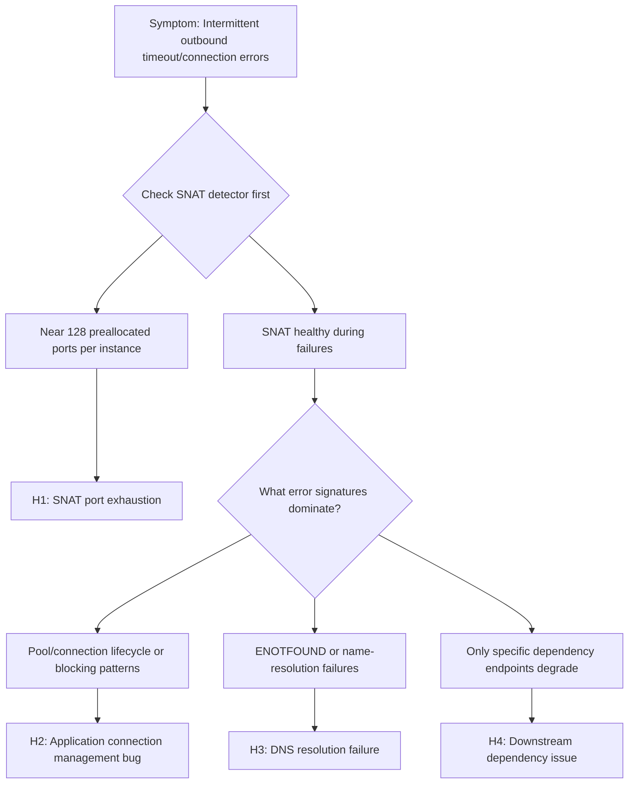

# SNAT or Application Issue? (Azure App Service Linux)

## 1. Summary
### Symptom
Outbound calls from the App Service app intermittently fail with timeouts or connection errors. The app can reach some external endpoints but fails on others, or failures appear under load but not during light traffic.

### Why this scenario is confusing
SNAT port exhaustion and application-level timeout/connection bugs produce nearly identical symptoms: intermittent outbound failures. Engineers often cannot tell whether the platform (SNAT) or the app (connection handling) is at fault.

### Troubleshooting decision flow
<!-- diagram-id: snat-or-application-issue-flow -->

```mermaid
graph TD
    A[Symptom: Intermittent outbound timeout/connection errors] --> B{Check SNAT detector first}
    B --> C[Near 128 preallocated ports per instance]
    B --> D[SNAT healthy during failures]
    C --> H1[H1: SNAT port exhaustion]
    D --> E{What error signatures dominate?}
    E --> F[Pool/connection lifecycle or blocking patterns]
    E --> G[ENOTFOUND or name-resolution failures]
    E --> I[Only specific dependency endpoints degrade]
    F --> H2[H2: Application connection management bug]
    G --> H3[H3: DNS resolution failure]
    I --> H4[H4: Downstream dependency issue]
```

### Scope and limitations
- Windows-specific SNAT behavior is out of scope.
- This playbook does not cover ASE (App Service Environment) specific networking.
- Detailed framework-specific connection pooling configuration is referenced but not exhaustively documented.

### Quick conclusion
Start by proving or disproving SNAT with the SNAT Port Exhaustion and TCP Connections detectors before changing code or scaling strategy. If SNAT is not near exhaustion, treat the incident as an application or dependency reliability problem and validate connection pooling, DNS behavior, and downstream health in parallel. In Azure App Service Linux, the fastest durable outcome is usually client connection reuse plus Private Endpoints and NAT Gateway where appropriate.

## 2. Common Misreadings
- "Outbound calls fail, so it must be a networking issue"
- "We're not making that many connections, so SNAT can't be the issue"
- "It works sometimes, so the network path is fine"
- "Adding more instances will fix it" (scale-out adds per-instance SNAT pools but does not fix bad connection patterns — the root cause persists and may mask the problem temporarily)

## 3. Competing Hypotheses
- H1: SNAT port exhaustion — app creates too many short-lived outbound connections without reuse, exceeding the 128 preallocated SNAT ports per instance.
- H2: Application connection management bug — connection pool exhaustion, not closing HttpClient/connections, synchronous blocking.
- H3: DNS resolution failure — VNet-integrated app cannot resolve private DNS, or DNS TTL caching issues.
- H4: Downstream dependency issue — the target service is slow/down, causing connection queue buildup that looks like SNAT.

## 4. What to Check First
### Metrics
- SNAT Port Exhaustion detector in App Service Diagnostics.
- TCP Connections metric.
- Outbound connection count per instance.

### Logs
- AppServiceConsoleLogs: look for "connection refused", "timeout", "SNAT" messages.
- AppServiceHTTPLogs: correlate slow/failed requests with outbound dependency endpoints.

### Platform Signals
- SNAT Port Exhaustion detector.
- TCP Connections detector.
- VNet integration status (if applicable).
- NAT Gateway configuration (if applicable).

#### Portal view

The App Service **Networking** blade is the single source of truth for whether the app uses the SNAT-mitigation mechanisms — a NAT Gateway (dedicated, expanded SNAT port pool) or Private Endpoints to dependencies (which bypass SNAT entirely) — that this playbook recommends as the durable fix for H1. Rather than read it as one screenshot, walk it as an ordered trail. See [Section 10 — Portal Evidence](#10-portal-evidence) for the step-by-step diagnostic walk of this blade, keyed to each card in the order you should verify it.

### Investigation Notes
- SNAT applies only to outbound connections to PUBLIC IP addresses. Private Endpoint and Service Endpoint traffic does NOT consume SNAT ports.
- 128 SNAT ports per instance is the preallocated amount; Azure may dynamically allocate more, but don't rely on it.
- NAT Gateway provides 64,000 SNAT ports per public IP, shared across all instances.
- Connection reuse is the single most impactful fix.
- Python: use requests.Session() or httpx.Client() for connection pooling. Do NOT create new requests.get() for every call.
- Node.js: use keep-alive agents. Default http.Agent does not enable keep-alive.

## 5. Evidence to Collect
### Required Evidence
- SNAT port allocation timeline from diagnostics.
- TCP connection count over time.
- Application-level connection pool configuration.
- Outbound call patterns (how many unique destination IP:port combinations).

### Useful Context
- Whether app uses connection pooling (HttpClient reuse, database connection pooling).
- VNet integration settings.
- NAT Gateway presence.
- Private Endpoint configuration for dependencies.
- Recent scale-out events (more instances = more SNAT demand if patterns are bad).

### Sample Log Patterns
#### AppServiceHTTPLogs (snat-exhaustion lab)

```text
[AppServiceHTTPLogs]
2026-04-04T11:24:40Z  GET  /diag/env    200    36786
2026-04-04T11:24:03Z  GET  /diag/stats  499    59709
2026-04-04T11:22:20Z  GET  /outbound    499    29840
2026-04-04T11:22:20Z  GET  /outbound    499    29834
2026-04-04T11:22:20Z  GET  /outbound    499    29830
2026-04-04T11:22:20Z  GET  /outbound    499    29819
2026-04-04T11:22:20Z  GET  /outbound    499    29820
2026-04-04T11:22:20Z  GET  /outbound    499    29786
```

#### AppServiceConsoleLogs (snat-exhaustion lab)

```text
[AppServiceConsoleLogs]
2026-04-04T11:14:18Z  Error  [2026-04-04 11:14:18 +0000] [1896] [INFO] Control socket listening at /root/.gunicorn/gunicorn.ctl
2026-04-04T11:14:17Z  Error  [2026-04-04 11:14:17 +0000] [1900] [INFO] Booting worker with pid: 1900
2026-04-04T11:14:17Z  Error  [2026-04-04 11:14:17 +0000] [1899] [INFO] Booting worker with pid: 1899
2026-04-04T11:14:17Z  Error  [2026-04-04 11:14:17 +0000] [1898] [INFO] Booting worker with pid: 1898
2026-04-04T11:14:17Z  Error  [2026-04-04 11:14:17 +0000] [1897] [INFO] Booting worker with pid: 1897
2026-04-04T11:14:17Z  Error  [2026-04-04 11:14:17 +0000] [1896] [INFO] Using worker: sync
2026-04-04T11:14:17Z  Error  [2026-04-04 11:14:17 +0000] [1896] [INFO] Listening at: http://0.0.0.0:8000 (1896)
2026-04-04T11:14:17Z  Error  [2026-04-04 11:14:17 +0000] [1896] [INFO] Starting gunicorn 25.3.0
```

#### AppServicePlatformLogs (snat-exhaustion lab)

```text
[AppServicePlatformLogs]
2026-04-04T11:14:47Z  Informational  Site: <app-name> stopped.
2026-04-04T11:14:47Z  Informational  Container is terminated. Total time elapsed: 5648 ms.
2026-04-04T11:14:41Z  Informational  State: Stopping, Action: StoppingSiteContainers
```

!!! tip "How to Read This"
    Repeated `/outbound` `499` responses near ~30 seconds indicate client-side timeout/disconnect under outbound pressure. Combined with sync Gunicorn workers, requests block worker slots while outbound connections stall.

### KQL Queries with Example Output
#### Query 1: Outbound endpoint timeout signature

```kusto
AppServiceHTTPLogs
| where TimeGenerated between (datetime(2026-04-04 11:22:00) .. datetime(2026-04-04 11:25:00))
| where CsUriStem in ("/outbound", "/diag/stats", "/diag/env")
| project TimeGenerated, CsMethod, CsUriStem, ScStatus, TimeTaken
| order by TimeGenerated desc
```

**Example Output:**

| TimeGenerated | CsMethod | CsUriStem | ScStatus | TimeTaken |
|---|---|---|---|---|
| 2026-04-04 11:24:40 | GET | /diag/env | 200 | 36786 |
| 2026-04-04 11:24:03 | GET | /diag/stats | 499 | 59709 |
| 2026-04-04 11:22:20 | GET | /outbound | 499 | 29840 |
| 2026-04-04 11:22:20 | GET | /outbound | 499 | 29834 |
| 2026-04-04 11:22:20 | GET | /outbound | 499 | 29786 |

!!! tip "How to Read This"
    The tight cluster of `/outbound` `499` around ~29.8-29.9 seconds is a classic timeout boundary signature. This supports connection pressure/SNAT or blocked worker behavior more than random downstream app exceptions.

#### Query 2: Worker model evidence from console logs

```kusto
AppServiceConsoleLogs
| where TimeGenerated between (datetime(2026-04-04 11:14:00) .. datetime(2026-04-04 11:15:00))
| project TimeGenerated, Level, ResultDescription
| order by TimeGenerated asc
```

**Example Output:**

| TimeGenerated | Level | ResultDescription |
|---|---|---|
| 2026-04-04 11:14:17 | Error | [INFO] Starting gunicorn 25.3.0 |
| 2026-04-04 11:14:17 | Error | [INFO] Listening at: http://0.0.0.0:8000 (1896) |
| 2026-04-04 11:14:17 | Error | [INFO] Using worker: sync |
| 2026-04-04 11:14:17 | Error | [INFO] Booting worker with pid: 1897 |
| 2026-04-04 11:14:17 | Error | [INFO] Booting worker with pid: 1898 |
| 2026-04-04 11:14:17 | Error | [INFO] Booting worker with pid: 1899 |
| 2026-04-04 11:14:17 | Error | [INFO] Booting worker with pid: 1900 |

!!! tip "How to Read This"
    Four sync workers means each slow outbound call can pin a worker until timeout. Under connection pressure, worker exhaustion amplifies user-visible latency and `499` rates.

#### Query 3: Platform lifecycle sanity check

```kusto
AppServicePlatformLogs
| where TimeGenerated between (datetime(2026-04-04 11:14:35) .. datetime(2026-04-04 11:14:50))
| project TimeGenerated, Level, Message
| order by TimeGenerated asc
```

**Example Output:**

| TimeGenerated | Level | Message |
|---|---|---|
| 2026-04-04 11:14:41 | Informational | State: Stopping, Action: StoppingSiteContainers |
| 2026-04-04 11:14:47 | Informational | Container is terminated. Total time elapsed: 5648 ms. |
| 2026-04-04 11:14:47 | Informational | Site: <app-name> stopped. |

!!! tip "How to Read This"
    These rows confirm lifecycle events but do not explain timeout clusters by themselves. Root-cause signal is primarily in `/outbound` timeout pattern plus worker model and SNAT detector evidence.

### CLI Investigation Commands

```bash
# Check app worker/process-relevant settings
az webapp config show --resource-group <resource-group> --name <app-name> --query "{linuxFxVersion:linuxFxVersion,appCommandLine:appCommandLine,alwaysOn:alwaysOn}" --output table

# Inspect app settings commonly tied to outbound pressure behavior
az webapp config appsettings list --resource-group <resource-group> --name <app-name> --query "[?name=='WEBSITES_PORT' || name=='WEBSITE_VNET_ROUTE_ALL' || name=='PYTHON_GUNICORN_CUSTOM_THREAD_NUM' || name=='PYTHON_VERSION'].{name:name,value:value}" --output table

# Confirm VNet integration and route-all posture (needed for NAT Gateway/PE architecture)
az webapp show --resource-group <resource-group> --name <app-name> --query "{virtualNetworkSubnetId:virtualNetworkSubnetId,vnetRouteAllEnabled:siteConfig.vnetRouteAllEnabled}" --output table

# Check recent app restart timeline
az webapp show --resource-group <resource-group> --name <app-name> --query "{state:state,lastModifiedTimeUtc:lastModifiedTimeUtc}" --output table
```

| Command | Purpose |
|---------|---------|
| `az webapp config show --resource-group <resource-group> --name <app-name> --query "{linuxFxVersion:linuxFxVersion,appCommandLine:appCommandLine,alwaysOn:alwaysOn}" --output table` | Shows the runtime stack, startup command line, and Always On flag that shape worker behavior and startup timing. |
| `--resource-group <resource-group> --name <app-name> --query "{linuxFxVersion:linuxFxVersion,appCommandLine:appCommandLine,alwaysOn:alwaysOn}" --output table` | Looks up the resource in this resource group. |
| `--name <app-name> --query "{linuxFxVersion:linuxFxVersion,appCommandLine:appCommandLine,alwaysOn:alwaysOn}" --output table` | Targets this web app. |
| `--query "{linuxFxVersion:linuxFxVersion,appCommandLine:appCommandLine,alwaysOn:alwaysOn}"` | Projects only the runtime stack, startup command line, and Always On fields from the site configuration. |
| `--output table` | Formats the selected site-configuration fields as a table. |
| `az webapp config appsettings list --resource-group <resource-group> --name <app-name> --query "[?name=='WEBSITES_PORT' \|\| name=='WEBSITE_VNET_ROUTE_ALL' \|\| name=='PYTHON_GUNICORN_CUSTOM_THREAD_NUM' \|\| name=='PYTHON_VERSION'].{name:name,value:value}" --output table` | Lists the app settings currently applied to this web app so you can inspect runtime or deployment configuration. |
| `--resource-group <resource-group> --name <app-name> --query "[?name=='WEBSITES_PORT' \|\| name=='WEBSITE_VNET_ROUTE_ALL' \|\| name=='PYTHON_GUNICORN_CUSTOM_THREAD_NUM' \|\| name=='PYTHON_VERSION'].{name:name,value:value}" --output table` | Looks up the resource in this resource group. |
| `--name <app-name> --query "[?name=='WEBSITES_PORT' \|\| name=='WEBSITE_VNET_ROUTE_ALL' \|\| name=='PYTHON_GUNICORN_CUSTOM_THREAD_NUM' \|\| name=='PYTHON_VERSION'].{name:name,value:value}" --output table` | Targets this web app. |
| `--query "[?name=='WEBSITES_PORT' \|\| name=='WEBSITE_VNET_ROUTE_ALL' \|\| name=='PYTHON_GUNICORN_CUSTOM_THREAD_NUM' \|\| name=='PYTHON_VERSION'].{name:name,value:value}"` | Filters the app-settings list to worker, timeout, port, or route-all settings that influence this failure mode. |
| `--output table` | Formats the app-settings result for quick reading in this investigation. |
| `az webapp show --resource-group <resource-group> --name <app-name> --query "{virtualNetworkSubnetId:virtualNetworkSubnetId,vnetRouteAllEnabled:siteConfig.vnetRouteAllEnabled}" --output table` | Shows the integration subnet resource ID and the nested `siteConfig.vnetRouteAllEnabled` flag for this app. |
| `--resource-group <resource-group> --name <app-name> --query "{virtualNetworkSubnetId:virtualNetworkSubnetId,vnetRouteAllEnabled:siteConfig.vnetRouteAllEnabled}" --output table` | Looks up the resource in this resource group. |
| `--name <app-name> --query "{virtualNetworkSubnetId:virtualNetworkSubnetId,vnetRouteAllEnabled:siteConfig.vnetRouteAllEnabled}" --output table` | Targets this web app. |
| `--query "{virtualNetworkSubnetId:virtualNetworkSubnetId,vnetRouteAllEnabled:siteConfig.vnetRouteAllEnabled}"` | Projects only the fields needed here: the top-level integration subnet ID and the nested `siteConfig.vnetRouteAllEnabled` value. |
| `--output table` | Formats the projected web app fields as a table for quick reading. |
| `az webapp show --resource-group <resource-group> --name <app-name> --query "{state:state,lastModifiedTimeUtc:lastModifiedTimeUtc}" --output table` | Shows the current app state and last control-plane modification time for restart-timeline checks. |
| `--resource-group <resource-group> --name <app-name> --query "{state:state,lastModifiedTimeUtc:lastModifiedTimeUtc}" --output table` | Looks up the resource in this resource group. |
| `--name <app-name> --query "{state:state,lastModifiedTimeUtc:lastModifiedTimeUtc}" --output table` | Targets this web app. |
| `--query "{state:state,lastModifiedTimeUtc:lastModifiedTimeUtc}"` | Projects only the app state and last-modified timestamp from the web app resource. |
| `--output table` | Formats the projected web app fields as a table for quick reading. |

**Example Output:**

```text
LinuxFxVersion    AppCommandLine                                      AlwaysOn
----------------  --------------------------------------------------  --------
PYTHON|3.11       gunicorn --bind 0.0.0.0:8000 --workers 4 app:app   True

Name                Value
------------------  -----
WEBSITES_PORT       8000
PYTHON_VERSION      3.11

VirtualNetworkSubnetId                                                                                                        VnetRouteAllEnabled
----------------------------------------------------------------------------------------------------------------------------  -------------------
/subscriptions/<subscription-id>/resourceGroups/<resource-group>/providers/Microsoft.Network/virtualNetworks/<vnet>/subnets/<subnet>  true
```

!!! tip "How to Read This"
    This confirms runtime shape (4 sync workers) and networking posture. Correlate with SNAT detector trends: if ports are saturated during `/outbound` spikes, H1 dominates; if not, H2 (application connection pattern) dominates.

### Dependency Telemetry (Application Insights)

When the app is instrumented with Application Insights, the `dependencies` table exposes the per-target outbound call rate and duration — the signal that separates SNAT pressure (H1, broad degradation across many public targets) from a single-dependency problem (H4).

```kusto
dependencies
| where timestamp > ago(6h)
| summarize Calls=count(), Failures=countif(success == false), P95Ms=percentile(duration, 95), DcountTargets=dcount(target)
          by bin(timestamp, 5m)
| order by timestamp desc
```

!!! tip "How to Read This"
    A high, rising `Calls` rate with a large `DcountTargets` (many distinct public targets in the same window) and failures clustered near a connect-timeout boundary supports **H1** (SNAT exhaustion) — the app is opening too many short-lived outbound connections across a broad fan-out. A low `DcountTargets` (failures concentrated on one or two targets) points to **H4** (a single downstream dependency) instead. To see the per-target breakdown, add `target, type` back into the `by` clause.

## 6. Validation and Disproof by Hypothesis

### H1: SNAT port exhaustion
**Signals that support**
- SNAT Port Exhaustion detector shows instances frequently at or near the preallocated 128 ports during incident windows.
- TCP Connections rises sharply on affected instances, and failures begin when connection churn increases (for example, traffic spikes or batch jobs).
- AppServiceConsoleLogs show outbound socket creation/connection timeout errors concentrated around the same timestamps as high SNAT utilization.
- Failures are most visible for public endpoints (internet or public PaaS FQDNs), while Private Endpoint traffic remains healthy.

**Signals that weaken**
- Detector shows low SNAT utilization with ample available ports during failures.
- Failures occur even at low traffic with stable connection counts and no connection churn.
- Only one dependency FQDN fails consistently while other outbound dependencies are unaffected.

**What to verify**

1. In App Service Diagnostics, open **SNAT Port Exhaustion** and inspect per-instance trends over the failure timeframe.
2. Open the **TCP Connections** detector and compare connection count behavior to error timestamps.
3. Query AppServiceConsoleLogs for connection timeout/refused patterns and correlation in time:

```kusto
AppServiceConsoleLogs
| where TimeGenerated > ago(6h)
| where ResultDescription has_any ("timeout", "timed out", "connection refused", "ECONNRESET", "SNAT")
| project TimeGenerated, _ResourceId, ResultDescription
| order by TimeGenerated desc
```

### H2: Application connection management bug
**Signals that support**
- SNAT Port Exhaustion detector is not near limits, but outbound failures continue.
- Errors include pool starvation patterns (for example, HTTP client pool exhausted, max connections reached, task/thread starvation).
- Code paths create new outbound client objects per request (for example, per-call HttpClient, per-call `requests` usage without Session reuse).
- Latency grows before outright failures, consistent with queueing inside the app runtime rather than immediate network rejection.

**Signals that weaken**
- Clear SNAT saturation on the same instance/time window as errors.
- After enabling client reuse/keep-alive, no measurable change in error rate.
- Identical requests from a test workload succeed consistently while production only fails at DNS resolution stage.

**What to verify**

1. Review application code and DI/container lifetime for outbound clients (singleton/shared client expected for most HTTP SDKs).
2. Inspect runtime logs for pool and socket lifecycle errors in AppServiceConsoleLogs.
3. Use AppServiceHTTPLogs to map high-latency responses to handlers that invoke outbound calls:

```kusto
AppServiceHTTPLogs
| where TimeGenerated > ago(6h)
| summarize Requests=count(), P95DurationMs=percentile(TimeTaken, 95), Failures=countif(ScStatus >= 500)
          by bin(TimeGenerated, 5m), CsUriStem
| order by TimeGenerated desc
```

### H3: DNS resolution failure
**Signals that support**
- Error text is resolution-specific (`Name or service not known`, `ENOTFOUND`, `Temporary failure in name resolution`) rather than connect timeout after DNS success.
- Failures cluster to hostname-based endpoints; direct IP tests succeed.
- VNet-integrated app recently changed custom DNS settings, private DNS zone links, or forwarder configuration.
- Incidents are intermittent around TTL boundaries or resolver instability rather than strictly load-linked.

**Signals that weaken**
- Errors are socket/connect timeout to resolved IPs, with no resolver error signatures.
- `nslookup` for affected hostnames from the app sandbox consistently returns expected records.
- Private Endpoint names resolve and connect reliably while only high-RPS paths fail.

**What to verify**

1. From Kudu/SSH on the Linux app container, run `nslookup <hostname>` repeatedly for affected dependencies.
2. Validate App Service VNet integration and DNS server settings (custom DNS IPs, route reachability, private DNS zone links).
3. Query AppServiceConsoleLogs for resolution-specific strings:

```kusto
AppServiceConsoleLogs
| where TimeGenerated > ago(6h)
| where ResultDescription has_any ("ENOTFOUND", "name resolution", "Name or service not known", "DNS")
| project TimeGenerated, _ResourceId, ResultDescription
| order by TimeGenerated desc
```

### H4: Downstream dependency issue
**Signals that support**
- One or a small set of dependencies show increased latency/5xx while others remain healthy from the same app instance.
- Independent telemetry from the dependency confirms degradation during the same period.
- Retries/circuit-breaker logs show repeated remote failures (HTTP 429/5xx, upstream timeout) after connection establishment.
- Synthetic checks from outside App Service also fail or degrade against the same endpoint.

**Signals that weaken**
- All outbound dependencies degrade at once in proportion to connection churn.
- Dependency health dashboards show normal latency/error rates while only this app reports failures.
- Failures disappear immediately after reducing local connection churn without any downstream change.

**What to verify**

1. Compare AppServiceHTTPLogs failure windows to dependency-side health dashboards/APM traces.
2. Run external synthetic probes (for example, from another Azure host) to confirm if dependency slowness reproduces.
3. Segment logs by dependency endpoint in application logs and check whether failure distribution is endpoint-specific.

### Normal vs Abnormal Comparison

| Signal | Normal outbound behavior | Abnormal (snat-exhaustion lab pattern) |
|---|---|---|
| `/outbound` status | Mostly 200 with moderate latency | Burst of 499 responses |
| `/outbound` `TimeTaken` | Variable, generally below timeout boundary | Tight cluster near ~29,786-29,840 ms (timeout boundary) |
| Worker model impact | Workers free quickly; queue stable | Sync workers held by slow outbound calls, queue grows |
| `/diag/stats` health | 200 with low latency | 499 up to ~59,709 ms under pressure |
| SNAT detector expectation | Ports below pressure threshold | Ports near/exceed threshold during incidents |
| Interpretation | Healthy dependency + connection lifecycle | Outbound connection pressure (SNAT and/or app connection management) |

## 7. Likely Root Cause Patterns
- Pattern A: New HttpClient per request (classic .NET anti-pattern, also applies to Python requests.Session not reused).
- Pattern B: Connection pool too small for traffic volume.
- Pattern C: Synchronous outbound calls blocking threads, causing connection queue backup.
- Pattern D: Scale-out without fixing connection patterns (more instances provide additional per-instance SNAT pools, but the underlying connection anti-pattern persists and may resurface under higher load).

## 8. Immediate Mitigations
- Enable connection pooling / reuse existing clients (diagnostic, production-safe).
- Reduce outbound connection creation rate (diagnostic, production-safe).
- Add NAT Gateway for dedicated outbound IP and larger port pool (temporary/permanent, production-safe).
- Use Private Endpoints for Azure dependencies to bypass SNAT entirely (permanent, production-safe).
- Use NAT Gateway for dedicated outbound IP and expanded port pool if SNAT pressure is per-instance (permanent, production-safe, requires VNet integration).

## 9. Prevention
- Implement proper connection pooling across all outbound clients.
- Use Private Endpoints for all Azure PaaS dependencies.
- Add NAT Gateway for non-Azure outbound traffic.
- Implement circuit breaker pattern for dependency calls.
- Monitor SNAT usage as a standard operational metric.

## 10. Portal Evidence

This section walks the App Service **Networking** blade **in diagnostic order**, as a *step-by-step* trail rather than a single blade read. All four steps below read different cards of the **same** capture — the blade is one screen, but the diagnostic value comes from reading its cards in the order that establishes whether the app is on the constrained default SNAT pool (supports H1) or has a SNAT-mitigation topology in place — an expanded NAT Gateway pool or a dependency-side Private Endpoint bypass, which weakens H1 and shifts focus to H2/H3/H4. The capture is a real, PII-cleaned Azure Portal screenshot from a Linux App Service; the inbound/outbound IP values shown are RFC-5737 (`192.0.2.x`) and RFC-3849 (`2001:db8::`) documentation ranges, not real addresses.

![Azure portal Networking blade for a Linux Web App, showing the Inbound traffic configuration column (Public network access Enabled with no access restrictions, App assigned address Not configured, Private endpoints 0 private endpoints, Inbound IPv4 and IPv6 addresses) and the Outbound traffic configuration column (Virtual network integration Not configured, Hybrid connections Not configured, Outbound DNS Default Azure-provided, Outbound IPv4 and IPv6 address lists), with the Integration subnet configuration card showing NAT gateway N/A, Network security group N/A, User defined route N/A, and a toolbar with Refresh, Troubleshoot, and Send us your feedback buttons](../../../assets/troubleshooting/networking/01-networking-hub.png)

### Step 1 — Establish the SNAT-mitigation prerequisite: `Outbound traffic configuration > Virtual network integration`

Purpose: A NAT Gateway (expanded port pool) and dependency-side Private Endpoints (true SNAT bypass) — the two durable SNAT-mitigation paths — both require VNet integration first. Confirm whether the prerequisite exists before interpreting SNAT pressure.
Look for: The **Outbound traffic configuration** column, **Virtual network integration** row.
Expected result: A subnet ID here means the app *can* route outbound through a NAT Gateway or reach dependencies over Private Endpoints. The captured `Not configured` state means no mitigation is possible — every outbound call to a **public** IP shares the default per-instance pool of 128 preallocated SNAT ports.
Abnormal: `Not configured` combined with the timeout-cluster signature in Section 5 supports **H1** (SNAT exhaustion) — the app is on the constrained default pool. Fix requires VNet integration first.
Next step: Read the **Integration subnet configuration** card to check for a NAT Gateway.

### Step 2 — Check for a dedicated SNAT port pool: `Integration subnet configuration > NAT gateway`

Purpose: A NAT Gateway replaces the 128-port per-instance default with a much larger shared pool (~64,000 ports per public IP), which is the primary platform-level fix for H1.
Look for: The **Integration subnet configuration** card, **NAT gateway** row.
Expected result: A NAT Gateway name here means SNAT is served from the NAT Gateway's dedicated port pool (~64,000 ports per public IP) rather than the constrained default pool — H1 is unlikely and you should pivot to H2 (app connection management). The captured `N/A` confirms no NAT Gateway, so the constrained default pool is still in force (consistent with the `Not configured` integration state from Step 1).
Abnormal: `N/A` while the app makes high volumes of short-lived outbound connections to public endpoints strengthens **H1**. Note `Network security group` and `User defined route` in the same card also read `N/A` — no route/NSG interference to consider here.
Next step: Read the **Outbound IPv4 addresses** list to understand the shared source-IP baseline the default pool draws from.

### Step 3 — Note the shared outbound source pool: `Outbound traffic configuration > Outbound IPv4 addresses`

Purpose: On the default (non-NAT-Gateway) path, all instances share this set of platform outbound IPs, and the per-instance 128-port SNAT allocation is drawn against them — this is the resource H1 exhausts.
Look for: The **Outbound IPv4 addresses** (and **Outbound IPv6 addresses**) list.
Expected result: A fixed set of platform-assigned addresses. On the default path these are shared and cannot be expanded without a NAT Gateway or scale-out (which adds per-instance pools but does not fix a bad connection pattern — see Section 7, Pattern D).
Abnormal: Nothing abnormal is visible here directly; this step establishes *why* the port pool is finite. Correlate with the **SNAT Port Exhaustion** detector in App Service Diagnostics (Section 4) to quantify saturation during incident windows.
Next step: Disambiguate the inbound `Private endpoints` red herring (Step 4).

### Step 4 — Disambiguate the inbound `Private endpoints` red herring

Purpose: Prevent the common misread that the inbound **Private endpoints** count reflects SNAT-bypass coverage. For SNAT bypass, the Private Endpoints that matter are on the *dependency* resources, not on the App Service itself.
Look for: The **Inbound traffic configuration** column, **Private endpoints** row (captured as `0 private endpoints`).
Expected result: This count describes private endpoints *into the App Service* (inbound access to the app). Private Endpoint traffic to *dependencies* does not consume SNAT ports, but that configuration lives on the dependency resources and is not shown by this count.
Abnormal: Concluding "SNAT bypass is not configured because inbound private endpoints is 0" is a category error. Use the `Troubleshoot` toolbar button to launch the integrated network diagnostics for outbound reachability, and verify dependency-side Private Endpoints on those resources directly.

!!! warning "Do not screenshot secrets or real addresses"
    When capturing the Networking blade, never include real subscription/tenant identifiers, and follow the repository PII text-replacement rules. The inbound/outbound IP values in this capture are RFC-5737 / RFC-3849 documentation ranges, not live addresses.

## See Also
- [`../../kql/http/latency-trend-by-status-code.md`](../../kql/http/latency-trend-by-status-code.md)
- [`../../kql/correlation/latency-vs-errors.md`](../../kql/correlation/latency-vs-errors.md)
- [`../../first-10-minutes/outbound-network.md`](../../first-10-minutes/outbound-network.md)
- [Lab: SNAT Exhaustion](../../lab-guides/snat-exhaustion.md)
- [Outbound Network (First 10 Minutes)](../../first-10-minutes/outbound-network.md)
- [SNAT Exhaustion Lab](../../lab-guides/snat-exhaustion.md)

## Sources
- [Troubleshoot outbound connection errors in Azure App Service](https://learn.microsoft.com/en-us/azure/app-service/troubleshoot-intermittent-outbound-connection-errors)
- [Integrate your app with an Azure virtual network](https://learn.microsoft.com/en-us/azure/app-service/overview-vnet-integration)
- [Azure App Service diagnostics overview](https://learn.microsoft.com/en-us/azure/app-service/overview-diagnostics)
- [Azure Load Balancer outbound connections](https://learn.microsoft.com/en-us/azure/load-balancer/load-balancer-outbound-connections)
