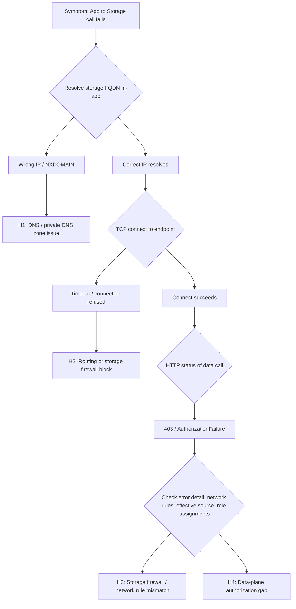

---
content_sources:
  diagrams:
    - id: storage-connectivity-four-layer-flow
      type: flowchart
      source: self-generated
      justification: "Synthesized a four-layer (DNS, routing, storage firewall, data-plane authorization) diagnosis flow from Microsoft Learn guidance on App Service VNet integration, storage network security, and Azure Storage data authorization."
      based_on:
        - https://learn.microsoft.com/en-us/azure/app-service/overview-vnet-integration
        - https://learn.microsoft.com/en-us/azure/storage/common/storage-network-security
        - https://learn.microsoft.com/en-us/azure/storage/common/authorize-data-access
        - https://learn.microsoft.com/en-us/azure/app-service/networking-features
content_validation:
  status: verified
  last_reviewed: "2026-07-16"
  reviewer: agent
  core_claims:
    - claim: "Azure Storage firewall grants access from a virtual network through service endpoints or private endpoints when the app uses virtual network integration."
      source: "https://learn.microsoft.com/en-us/azure/storage/common/storage-network-security"
      verified: true
    - claim: "Passing the storage account network rules does not authorize data access; data access still requires a shared key, a SAS token, or a data-plane RBAC role."
      source: "https://learn.microsoft.com/en-us/azure/storage/common/authorize-data-access"
      verified: true
    - claim: "When a service endpoint is used, the source address of the request switches to a private VNet address, so public IP network rules no longer apply to that traffic."
      source: "https://learn.microsoft.com/en-us/azure/storage/common/storage-network-security"
      verified: true
    - claim: "IP network rules have no effect on requests originating from the same Azure region as the storage account, because same-region Azure services use private Azure IP addresses."
      source: "https://learn.microsoft.com/en-us/azure/storage/common/storage-network-security-limitations#restrictions-for-ip-network-rules"
      verified: true
---

# App Service to Azure Storage: Firewall and Authorization Confusion (Linux)

## 1. Summary
### Symptom
Outbound calls from an Azure App Service Linux app to an Azure Storage account (Blob, Files, Queue, or Table) fail. Symptoms include connection timeouts, `AuthorizationFailure` / `403` responses, `This request is not authorized to perform this operation`, or a hostname that resolves to a public IP instead of the expected private endpoint IP.

### Why this scenario is confusing
An App Service to Storage connection must pass through four independent layers — **DNS resolution**, **routing / egress path**, **storage firewall (network authorization)**, and **data-plane authorization** — and each layer fails with a different signature. A `403` / `AuthorizationFailure` is ambiguous on its own: the storage firewall (a network-rule denial) and a data-plane authorization gap (missing role, expired SAS, disabled shared key) can *both* surface as `403 AuthorizationFailure`. Do not assume a `403` is a role problem until you have checked the Storage error detail, the account's network rules, the request's effective source, and the identity's role assignments. Conversely, a timeout is a *network path* problem that no RBAC change will fix.

### Troubleshooting decision flow
<!-- diagram-id: storage-connectivity-four-layer-flow -->


### Scope and limitations
- Linux/OSS scope only; Windows worker specifics are out of scope.
- Covers Blob, Files, Queue, and Table data-plane connectivity from App Service.
- Vendor-specific NVA/firewall tuning is intentionally excluded.

### Quick conclusion
Prove each layer independently and in order: **(1)** the storage FQDN resolves to the intended IP, **(2)** TCP reaches the endpoint, **(3)** the storage firewall admits the request's effective source, and **(4)** the calling identity holds a valid data-plane credential or role. Most durable fixes come from correcting private DNS links, aligning VNet integration with a service or private endpoint, and adding the missing data-plane RBAC role.

## 2. Common Misreadings
- "The firewall passed, so the app is authorized." (Network access and data authorization are separate layers.)
- "Route All is on, so Storage is private." (Route All changes the egress path, not the storage account's public endpoint.)
- "I added the app's outbound IPs to the storage firewall." (Same-region App Service IPs are not honored; a service endpoint switches the source to a private address anyway.)
- "It works from my laptop, so DNS is correct." (In-app resolution can differ, especially with private endpoints.)

## 3. Competing Hypotheses
- **H1 (DNS layer):** The storage FQDN resolves to the wrong IP — a missing/unlinked `privatelink.<service>.core.windows.net` zone, a wrong A record, or a custom DNS forwarder that does not resolve the privatelink chain.
- **H2 (Routing layer):** VNet integration/route-all/UDR is not steering traffic through the path the storage firewall expects, so the request never reaches the account.
- **H3 (Storage firewall layer):** The storage network rules do not admit the request's *effective* source — for example an IP allowlist that is ignored for same-region service-endpoint traffic, or a missing subnet/private-endpoint rule.
- **H4 (Authorization layer):** The network path is fine but the calling identity lacks a valid data-plane credential — no data-plane RBAC role, an expired SAS, a disabled shared key, or `403 AuthorizationFailure`.

## 4. What to Check First
### Metrics
- App Service HTTP 5xx and latency trend during storage calls.
- Storage account `Transactions` metric split by `ResponseType` (look for `AuthorizationError`, `NetworkError`, `Success`).
- Firewall or NVA deny counters for the storage private IP/port (443).

### Logs
- Connect errors: `ETIMEDOUT`, `ECONNREFUSED`, `No route to host`.
- Resolver errors: `ENOTFOUND`, `EAI_AGAIN`, `Name or service not known`.
- Data-plane errors: `AuthorizationFailure`, `AuthorizationPermissionMismatch`, `403`, `This request is not authorized to perform this operation using this permission`.

### Platform Signals
- VNet Integration state and integration subnet assignment.
- Storage account `publicNetworkAccess`, `defaultAction`, virtual network rules, IP rules, and private endpoint connections.
- Private DNS zone links and A record values for the storage privatelink zone.
- Role assignments on the storage account for the app's managed identity.

### Investigation Notes
- Always validate from inside the Linux App Service runtime; external resolver behavior is not authoritative.
- A `403` / `AuthorizationFailure` is ambiguous: it can be a storage network-rule (firewall) denial *or* a data-plane role/credential gap. Distinguish them by checking the Storage error detail, the account network rules, the request's effective source, and the role assignments — a data-plane gap is confirmed only after the network path is proven open.
- Passing the storage network rules does not grant data access — that still requires a shared key, SAS, or data-plane RBAC role.
- When a service endpoint is used, the request's source becomes a private VNet address, so public IP allowlist rules no longer apply.
- Keep all timeline correlation in UTC.

## 5. Evidence to Collect
### Required Evidence
- In-app resolution output for the exact storage FQDN (`nslookup`, `getent hosts`).
- Storage account network configuration (`publicNetworkAccess`, `defaultAction`, `virtualNetworkRules`, `ipRules`).
- Private endpoint NIC IP and subresource (`blob`/`file`/`queue`/`table`) mapping.
- Role assignments for the app's managed identity on the storage scope.
- UTC timestamped app failures and the HTTP status of the failing data call.

### Useful Context
- Custom DNS architecture and forwarder chain.
- Current `vnetRouteAllEnabled` setting for the app.
- Recent changes to the storage firewall, endpoint, DNS, or role assignments.
- Authentication method in use (managed identity vs shared key vs SAS).

### CLI Investigation Commands

```bash
# App VNet integration and route-all state
az webapp show --resource-group <resource-group> --name <app-name> --query "{virtualNetworkSubnetId:virtualNetworkSubnetId,vnetRouteAllEnabled:siteConfig.vnetRouteAllEnabled}" --output table

# Storage network configuration
az storage account show --resource-group <resource-group> --name <storage-account-name> --query "{publicNetworkAccess:publicNetworkAccess,defaultAction:networkRuleSet.defaultAction,ipRules:networkRuleSet.ipRules,vnetRules:networkRuleSet.virtualNetworkRules}" --output json

# Private endpoint state and private IP
az network private-endpoint show --resource-group <resource-group> --name <private-endpoint-name> --query "{name:name,provisioningState:provisioningState}" --output table

# Data-plane role assignments for the app identity
az role assignment list --assignee <app-managed-identity-object-id> --scope <storage-account-resource-id> --query "[].{role:roleDefinitionName,scope:scope}" --output table
```

| Command | Purpose |
|---------|---------|
| `az webapp show --resource-group <resource-group> --name <app-name> --query "{virtualNetworkSubnetId:virtualNetworkSubnetId,vnetRouteAllEnabled:siteConfig.vnetRouteAllEnabled}" --output table` | Shows the integration subnet resource ID and the nested `siteConfig.vnetRouteAllEnabled` flag for this app. |
| `--resource-group <resource-group> --name <app-name> --query "{virtualNetworkSubnetId:virtualNetworkSubnetId,vnetRouteAllEnabled:siteConfig.vnetRouteAllEnabled}" --output table` | Looks up the resource in this resource group. |
| `--name <app-name> --query "{virtualNetworkSubnetId:virtualNetworkSubnetId,vnetRouteAllEnabled:siteConfig.vnetRouteAllEnabled}" --output table` | Targets this web app. |
| `--query "{virtualNetworkSubnetId:virtualNetworkSubnetId,vnetRouteAllEnabled:siteConfig.vnetRouteAllEnabled}"` | Projects only the fields needed here: the top-level integration subnet ID and the nested `siteConfig.vnetRouteAllEnabled` value. |
| `--output table` | Formats the projected web app fields as a table for quick reading. |
| `az storage account show --resource-group <resource-group> --name <storage-account-name> --query "{publicNetworkAccess:publicNetworkAccess,defaultAction:networkRuleSet.defaultAction,ipRules:networkRuleSet.ipRules,vnetRules:networkRuleSet.virtualNetworkRules}" --output json` | Shows the storage account's network settings so you can distinguish firewall behavior from authorization failures. |
| `--resource-group <resource-group> --name <storage-account-name> --query "{publicNetworkAccess:publicNetworkAccess,defaultAction:networkRuleSet.defaultAction,ipRules:networkRuleSet.ipRules,vnetRules:networkRuleSet.virtualNetworkRules}" --output json` | Scopes the lookup to the resource group containing the storage account. |
| `--name <storage-account-name> --query "{publicNetworkAccess:publicNetworkAccess,defaultAction:networkRuleSet.defaultAction,ipRules:networkRuleSet.ipRules,vnetRules:networkRuleSet.virtualNetworkRules}" --output json` | Targets this storage account. |
| `--query "{publicNetworkAccess:publicNetworkAccess,defaultAction:networkRuleSet.defaultAction,ipRules:networkRuleSet.ipRules,vnetRules:networkRuleSet.virtualNetworkRules}"` | Projects the storage account's `publicNetworkAccess` value and nested network-rule fields (`networkRuleSet.defaultAction`, `ipRules`, and `virtualNetworkRules`). |
| `--output json` | Formats the storage-account data in the requested output format. |
| `az network private-endpoint show --resource-group <resource-group> --name <private-endpoint-name> --query "{name:name,provisioningState:provisioningState}" --output table` | Shows the private endpoint name and provisioning state so you can confirm whether the object itself is healthy. |
| `--resource-group <resource-group> --name <private-endpoint-name> --query "{name:name,provisioningState:provisioningState}" --output table` | Scopes the lookup to the resource group containing the private endpoint. |
| `--name <private-endpoint-name> --query "{name:name,provisioningState:provisioningState}" --output table` | Targets this private endpoint. |
| `--query "{name:name,provisioningState:provisioningState}"` | Projects only the requested private-endpoint field(s). |
| `--output table` | Formats the projected private-endpoint fields as a table. |
| `az role assignment list --assignee <app-managed-identity-object-id> --scope <storage-account-resource-id> --query "[].{role:roleDefinitionName,scope:scope}" --output table` | Lists Azure RBAC role assignments for this principal at the storage account scope so you can determine whether any assignment grants the required storage data-plane access. |
| `--assignee <app-managed-identity-object-id> --scope <storage-account-resource-id> --query "[].{role:roleDefinitionName,scope:scope}" --output table` | Looks up role assignments for this principal object ID. |
| `--scope <storage-account-resource-id> --query "[].{role:roleDefinitionName,scope:scope}" --output table` | Limits the role-assignment search to this resource scope. |
| `--query "[].{role:roleDefinitionName,scope:scope}"` | Projects each role assignment to only its role name and scope. |
| `--output table` | Formats the role-assignment results as a table for quick inspection. |

!!! tip "How to Read This"
    If `defaultAction` is `Deny` and there is no `virtualNetworkRules` entry for the integration subnet (and no private endpoint), the firewall is blocking the app — an H2/H3 problem. If the network config is correct but `az role assignment list` returns no data-plane role (for example `Storage Blob Data Reader`), the failure is H4, and no network change will fix it.

## 6. Validation and Disproof by Hypothesis

### H1: DNS resolves to the wrong IP
**Signals that support**
- App resolves the storage FQDN to a public IP when a private endpoint is expected, or returns NXDOMAIN.
- The `privatelink.<service>.core.windows.net` zone is missing or not linked to the integration VNet.

**Signals that weaken**
- App resolves consistently to the current private endpoint NIC IP.

**Validation**
```bash
nslookup <storage-account-name>.blob.core.windows.net
getent hosts <storage-account-name>.blob.core.windows.net
az network private-dns link vnet list --resource-group <resource-group> --zone-name privatelink.blob.core.windows.net --output table
az network private-dns record-set a list --resource-group <resource-group> --zone-name privatelink.blob.core.windows.net --output table
```

| Command | Purpose |
|---------|---------|
| `nslookup <storage-account-name>.blob.core.windows.net` | Resolves the hostname using the current resolver path from the local shell or app container context. |
| `getent hosts <storage-account-name>.blob.core.windows.net` | Queries libc host resolution so you can compare the OS resolver answer that application code typically uses. |
| `az network private-dns link vnet list --resource-group <resource-group> --zone-name privatelink.blob.core.windows.net --output table` | Lists the virtual-network links for this Private DNS zone so you can confirm whether the expected VNet is linked. |
| `--resource-group <resource-group> --zone-name privatelink.blob.core.windows.net --output table` | Scopes the lookup to the resource group that owns the Private DNS zone. |
| `--zone-name privatelink.blob.core.windows.net --output table` | Targets this Private DNS zone. |
| `--output table` | Formats the VNet-link results as a table for quick verification. |
| `az network private-dns record-set a list --resource-group <resource-group> --zone-name privatelink.blob.core.windows.net --output table` | Lists the A records in this Private DNS zone so you can confirm whether the dependency name points to the expected private IP. |
| `--resource-group <resource-group> --zone-name privatelink.blob.core.windows.net --output table` | Scopes the lookup to the resource group that owns the Private DNS zone. |
| `--zone-name privatelink.blob.core.windows.net --output table` | Targets this Private DNS zone. |
| `--output table` | Formats the record list as a table for quick comparison. |

### H2: Routing / egress path blocked
**Signals that support**
- DNS resolves correctly, but TCP to port 443 times out.
- `vnetRouteAllEnabled` is off while the storage firewall requires the VNet path, or a UDR steers traffic to a firewall that denies the storage IP.

**Signals that weaken**
- Effective routes are valid and a direct connect test to the endpoint succeeds.

**Validation**
```bash
az webapp show --resource-group <resource-group> --name <app-name> --query "siteConfig.vnetRouteAllEnabled"
az network vnet subnet show --resource-group <resource-group> --vnet-name <vnet-name> --name <integration-subnet-name> --query "{serviceEndpoints:serviceEndpoints,routeTable:routeTable.id}"
nc -vz <storage-account-name>.blob.core.windows.net 443
```

| Command | Purpose |
|---------|---------|
| `az webapp show --resource-group <resource-group> --name <app-name> --query "siteConfig.vnetRouteAllEnabled"` | Shows the web app resource so you can inspect the current control-plane configuration and state. |
| `--resource-group <resource-group> --name <app-name> --query "siteConfig.vnetRouteAllEnabled"` | Looks up the resource in this resource group. |
| `--name <app-name> --query "siteConfig.vnetRouteAllEnabled"` | Targets this web app. |
| `--query "siteConfig.vnetRouteAllEnabled"` | Projects only the requested field(s) from the web app resource. |
| `az network vnet subnet show --resource-group <resource-group> --vnet-name <vnet-name> --name <integration-subnet-name> --query "{serviceEndpoints:serviceEndpoints,routeTable:routeTable.id}"` | Shows the integration subnet resource so you can inspect route-table, service-endpoint, NAT, or NSG attachments that affect this path. |
| `--resource-group <resource-group> --vnet-name <vnet-name> --name <integration-subnet-name> --query "{serviceEndpoints:serviceEndpoints,routeTable:routeTable.id}"` | Scopes the lookup to the resource group that owns the VNet. |
| `--vnet-name <vnet-name> --name <integration-subnet-name> --query "{serviceEndpoints:serviceEndpoints,routeTable:routeTable.id}"` | Targets this virtual network. |
| `--name <integration-subnet-name> --query "{serviceEndpoints:serviceEndpoints,routeTable:routeTable.id}"` | Targets this specific subnet. |
| `--query "{serviceEndpoints:serviceEndpoints,routeTable:routeTable.id}"` | Projects the subnet's service-endpoint list and nested route-table resource ID only. |
| `nc -vz <storage-account-name>.blob.core.windows.net 443` | Attempts a TCP connection to the target host and port and reports whether the socket opens successfully. |
| `nc -vz` | Runs `netcat` in verbose mode and checks only whether the TCP connection can be established. |

### H3: Storage firewall rule mismatch
**Signals that support**
- `defaultAction` is `Deny` and the integration subnet is not in `virtualNetworkRules`.
- An IP allowlist was added for App Service outbound IPs but the app and storage are in the same region (rules not honored), or a service endpoint changed the source to a private address the IP rule does not match.

**Signals that weaken**
- The integration subnet has a `Microsoft.Storage` service endpoint AND a matching virtual network rule, or a private endpoint exists and is approved.

**Validation**
```bash
az storage account network-rule list --resource-group <resource-group> --account-name <storage-account-name> --output json
az network vnet subnet show --resource-group <resource-group> --vnet-name <vnet-name> --name <integration-subnet-name> --query "serviceEndpoints"
```

| Command | Purpose |
|---------|---------|
| `az storage account network-rule list --resource-group <resource-group> --account-name <storage-account-name> --output json` | Lists the storage account's firewall rules so you can see exactly which IP and VNet rules are in effect. |
| `--resource-group <resource-group> --account-name <storage-account-name> --output json` | Scopes the lookup to the resource group containing the storage account. |
| `--account-name <storage-account-name> --output json` | Targets this storage account's network-rule set. |
| `--output json` | Formats the full firewall rule set as JSON for detailed inspection. |
| `az network vnet subnet show --resource-group <resource-group> --vnet-name <vnet-name> --name <integration-subnet-name> --query "serviceEndpoints"` | Shows the integration subnet resource so you can inspect route-table, service-endpoint, NAT, or NSG attachments that affect this path. |
| `--resource-group <resource-group> --vnet-name <vnet-name> --name <integration-subnet-name> --query "serviceEndpoints"` | Scopes the lookup to the resource group that owns the VNet. |
| `--vnet-name <vnet-name> --name <integration-subnet-name> --query "serviceEndpoints"` | Targets this virtual network. |
| `--name <integration-subnet-name> --query "serviceEndpoints"` | Targets this specific subnet. |
| `--query "serviceEndpoints"` | Projects only the subnet's `serviceEndpoints` array. |

!!! warning "Same-region IP allowlists are ignored"
    Adding App Service outbound IPs to the storage firewall does not work when the app and storage account are in the same region — those IP rules are not honored. Use a `Microsoft.Storage` service endpoint with a virtual network rule, or a private endpoint.

### H4: Data-plane authorization gap
**Signals that support**
- The data call returns `403 AuthorizationFailure` or `AuthorizationPermissionMismatch` *after* the network path is proven open.
- The app uses managed identity but has no data-plane role (for example `Storage Blob Data Contributor`) on the storage scope.
- Shared key access is disabled on the account, or a SAS token has expired.

**Signals that weaken**
- The identity holds a data-plane role at the correct scope and the same call succeeds intermittently (points back to a network/transient issue).

**Validation**
```bash
az role assignment list --assignee <app-managed-identity-object-id> --scope <storage-account-resource-id> --output table
az storage account show --resource-group <resource-group> --name <storage-account-name> --query "allowSharedKeyAccess"
```

| Command | Purpose |
|---------|---------|
| `az role assignment list --assignee <app-managed-identity-object-id> --scope <storage-account-resource-id> --output table` | Lists the role assignments for this principal at the target scope so you can verify what access is actually granted. |
| `--assignee <app-managed-identity-object-id> --scope <storage-account-resource-id> --output table` | Looks up role assignments for this principal object ID. |
| `--scope <storage-account-resource-id> --output table` | Limits the role-assignment search to this resource scope. |
| `--output table` | Formats the role-assignment results as a table for quick inspection. |
| `az storage account show --resource-group <resource-group> --name <storage-account-name> --query "allowSharedKeyAccess"` | Reads the storage account's `allowSharedKeyAccess` setting so you can tell whether shared-key authentication is permitted. |
| `--resource-group <resource-group> --name <storage-account-name> --query "allowSharedKeyAccess"` | Scopes the lookup to the resource group containing the storage account. |
| `--name <storage-account-name> --query "allowSharedKeyAccess"` | Targets this storage account. |
| `--query "allowSharedKeyAccess"` | Projects only the storage account's `allowSharedKeyAccess` property. |

!!! tip "How to Read This"
    Control-plane roles like **Contributor** or **Owner** do NOT grant data-plane access to blobs, files, queues, or tables. For code that calls the storage data plane with a managed identity, assign a data-plane role such as **Storage Blob Data Reader/Contributor**, **Storage Queue Data Contributor**, or **Storage Table Data Contributor** to the app's identity. The **Storage File Data SMB Share Reader/Contributor** roles apply only to identity-based SMB access to Azure Files — they do **not** apply to an App Service *Bring Your Own Storage* (BYOS) path mount, which authenticates with the storage account key, not with the app's managed identity or RBAC. A BYOS mount therefore fails on the account key or storage firewall path, not on a missing SMB share role.

### Normal vs Abnormal Comparison

| Signal | Normal path | Abnormal pattern |
|---|---|---|
| Storage FQDN resolution | Resolves to the intended (private or public) IP | Resolves to public IP when private endpoint expected, or NXDOMAIN |
| TCP connect to 443 | Succeeds | Times out (routing / firewall block) |
| Firewall admits request | Service endpoint or private endpoint rule matches | `defaultAction Deny` with no matching VNet/private-endpoint rule |
| Data call HTTP status | 200 / 201 | `403 AuthorizationFailure` (network-rule denial *or* missing data-plane role — disambiguate before fixing) |
| Interpretation | All four layers aligned | One layer blocks; identify which by signature |

## 7. Likely Root Cause Patterns
- Pattern A: Storage `publicNetworkAccess Disabled` / `defaultAction Deny` without a service endpoint or private endpoint for the integration subnet.
- Pattern B: Private DNS zone for the storage service not linked to the integration VNet, so the FQDN resolves publicly.
- Pattern C: IP allowlist added for App Service outbound IPs in the same region (silently ignored).
- Pattern D: App migrated to managed identity but never granted a data-plane RBAC role.
- Pattern E: Shared key access disabled on the account while the app still uses a connection string.

## 8. Immediate Mitigations
- Add a `Microsoft.Storage` service endpoint on the integration subnet and a matching virtual network rule on the storage account. **Risk: Low**.
- Create/approve a private endpoint and link the `privatelink.<service>.core.windows.net` zone to the integration VNet. **Risk: Medium** (DNS change).
- Assign the correct data-plane RBAC role to the app's managed identity. **Risk: Low**.
- Re-enable shared key access temporarily if the app depends on a connection string, then plan the migration to managed identity. **Risk: Medium** (weakens auth posture).

## 9. Prevention
- Standardize on managed identity + data-plane RBAC for storage access; avoid connection strings.
- Automate storage onboarding checks: firewall default action, VNet/private-endpoint rule, private DNS link, and required data-plane role.
- Add synthetic probes from App Service runtime that both resolve and perform a real data-plane read against critical storage dependencies.
- Document the four-layer model in runbooks so a `403` is disambiguated across the storage firewall (network authorization) and data-plane authorization, instead of being assumed to be one or the other.

## 10. Portal Evidence

This section walks the four connectivity layers **in diagnostic order (Layer 1 → Layer 4)**, each as a *step-by-step* trail rather than a single blade. Layers 2, 3, and 4 are backed by real, PII-cleaned Azure Portal captures taken from a live repro environment (a Linux Python App Service and a Standard StorageV2 account, both in the same resource group). Layer 1 is a reproducible **command** procedure with representative output, because DNS resolution is verified from inside the runtime rather than from a static blade — the Kudu SSH console renders its output on an HTML canvas that the repository PII text-replacement tooling cannot sanitize, so it is intentionally documented as text, not a screenshot. Do not treat the Layer 1 command output as if a verified screenshot exists.

### Layer 1 — DNS resolution (command procedure, no screenshot)

Resolve the storage FQDN from *inside* the runtime, because the app's own resolver — not your workstation — decides which endpoint the app reaches.

Step 1 — Open a shell on the app:

1. Open the App Service in the Azure Portal.
2. Go to **Development Tools** → **Advanced Tools (Kudu)** → **Go**, then open **SSH** (or use **Diagnose and solve problems** for a read-only view).

Step 2 — Resolve the storage endpoint and inspect the CNAME chain:

```bash
nslookup <storage-account-name>.blob.core.windows.net
```

This example targets the **Blob** endpoint; substitute the relevant suffix (`.queue.`, `.table.`, `.file.`) for the service the app actually calls.

Representative output for a public-access account (no private endpoint):

```text
<storage-account-name>.blob.core.windows.net	canonical name = blob.<stamp>.store.core.windows.net.
Name:	blob.<stamp>.store.core.windows.net
Address: 20.150.x.x
```

Purpose: Prove the app resolves the storage FQDN to the intended endpoint before blaming the firewall or RBAC.
Look for: The CNAME target (`blob.<stamp>.store.core.windows.net` for the public path, or a `privatelink.blob.core.windows.net` chain for a private endpoint) and the final `Address`.
Expected result: A public-access path resolves to a **public** Azure Storage IP from Microsoft-published Azure public ranges (validate a specific address against the `Storage` service tag in the [Azure IP Ranges and Service Tags](https://learn.microsoft.com/en-us/azure/virtual-network/service-tags-overview) JSON; observed examples may include `20.x.x.x` or `4.x.x.x`); a private endpoint path resolves *through* the `privatelink.blob.core.windows.net` zone to the **private** endpoint NIC IP inside the integrated VNet.
Abnormal: `NXDOMAIN` (name does not exist); a public IP returned when a private endpoint is required (missing `privatelink` Private DNS zone link); or a private IP that does not match the expected private endpoint NIC IP. Any of these supports an H1 (DNS) finding. Only after DNS resolves to the intended endpoint should you move to Layer 2.

### Layer 2 — App Service outbound routing evidence (captured)

Step 1 — Confirm the app and its hosting from the **Overview** blade:

[[[ shot("troubleshooting--networking--02-app-overview") ]]]

Purpose: Establish the app baseline (runtime, plan, region) so the routing state you inspect next is attributed to the right resource.
Look for: **Status: Running**, the **Operating System / Runtime Stack**, the **App Service Plan**, and the **Networking** section at the bottom listing the app's outbound IP addresses.
Expected result: A running app with a known plan and region. Note the outbound IP addresses — these are the source addresses a storage IP-rule allowlist would have to match on the public path.
Caveat: When the app and the storage account are in the **same Azure region**, storage IP network rules do **not** reliably match these public outbound IPs — Azure may route the traffic over the backbone so it arrives with an internal address the IP rule never sees. Do not rely on a same-region IP allowlist; use a VNet rule or private endpoint instead (this is expanded in Layer 3, Step 2, and Section 6, H3).
Next step: Open the **Networking** blade (left nav) to read the outbound routing configuration.

Step 2 — Read the outbound routing configuration on the **Networking** blade:

[[[ shot("troubleshooting--networking--03-app-networking-blade") ]]]

Purpose: Confirm the App Service outbound routing state before diagnosing the storage firewall or a private endpoint, because a routing gap masquerades as a firewall or authorization problem.
Look for: The **Outbound traffic configuration** panel — specifically `Virtual network integration: Not configured`, `Outbound DNS: Default (Azure-provided)`, and the `Integration subnet configuration` rows (NAT gateway / Network security group / User defined route all `N/A` when no VNet is attached).
Expected result: For a storage **private endpoint** or a storage **VNet rule** to take effect, `Virtual network integration` must be configured to the intended subnet. The captured `Not configured` state means the app egresses over the **public** path with Azure-default DNS — so a private endpoint or VNet rule on the storage side cannot be reached, supporting an H2 (routing) finding.
Next step: If the app is *supposed* to reach storage privately, configure VNet integration to the delegated subnet (and set `vnetRouteAllEnabled` as needed) before treating the failure as a storage firewall (Layer 3) or RBAC (Layer 4) problem. If the app is supposed to use the public path, proceed to Layer 3.

### Layer 3 — Storage firewall evidence (captured)

Step 1 — Read the storage firewall state at a glance from the **Overview** blade:

[[[ shot("troubleshooting--storage-firewall--01-storage-overview") ]]]

Purpose: Get the storage-side network and key posture in one view before opening the detailed Networking blade, because `Public network access: Disabled` alone explains a total egress block.
Look for: The **Networking** section (`Public network access`, `Private endpoint connections`) and the **Security** section (`Storage account key access`). The captured account shows `Public network access: Disabled` **and** `Storage account key access: Disabled`.
Expected result: For the app to reach the account over the **public** path, `Public network access` must be either `Enabled from all networks` (no rule required) **or** `Enabled from selected virtual networks and IP addresses` with a VNet/IP rule that matches the app's source. A `Disabled` state blocks all public egress — including the app's public outbound path.
Next step: Open the **Networking** blade to confirm exactly why the rules are not in effect.

Step 2 — Confirm the firewall detail on the **Networking** blade:

[[[ shot("troubleshooting--storage-firewall--02-networking-disabled") ]]]

Purpose: Disambiguate a firewall block from a data-plane authorization gap (Layer 4), since both surface as `403`.
Look for: The **Public access** tab — `Public network access`, and the **Resource settings** note about whether virtual network and IP rules are in effect.
Expected result: The captured `Public network access: Disabled` state (with the note `Virtual networks and IP address(es) settings are not in effect. Public network access is disabled.`) supports an H3 (storage firewall) finding.
Next step: For this `Disabled` state, use a private endpoint plus matching private DNS. A `Microsoft.Storage` service endpoint plus a virtual network rule is *not* sufficient on its own here — service-endpoint and IP rules are ignored while public access is disabled, so that path also requires re-enabling public access to **Selected networks** first. Resolve the network path before treating the failure as a Layer 4 authorization problem. Remember that same-region App Service IP allowlist rules are ignored (see the warning in Section 6, H3).

### Layer 4 — Data-plane authorization evidence (captured)

Step 1 — Open the storage account **Access control (IAM)** blade:

[[[ shot("troubleshooting--storage-iam--01-iam-landing") ]]]

Purpose: Reach the storage-account IAM surface — the only place that reveals whether the app's managed identity holds a *data-plane* role. This is only meaningful after the network path (Layer 3) is proven open.
Look for: The **Access control (IAM)** blade with the **Check access / Role assignments / Roles / Deny assignments** tabs.
Next step: Open the **Role assignments** tab to enumerate the identity's roles and their scopes.

Step 2 — Enumerate the managed identity's roles on the **Role assignments** tab:

[[[ shot("troubleshooting--storage-iam--02-role-assignments") ]]]

Purpose: Confirm whether the App Service managed identity holds a *data-plane* storage role (Layer 4).
Look for: The **Role assignments** tab (grouped by **Role**). Locate the app's managed identity and read its **Role** and **Scope** columns. In the capture, the app identity appears under the **Reader** group with `Reader` at `This resource` scope.
Expected result: The identity must hold an appropriate **data-plane** role for the operation — choose the least-privilege role that covers the required action (read vs write):

- Blob: **Storage Blob Data Reader / Contributor / Owner** as appropriate.
- Queue: **Storage Queue Data Contributor** (or the equivalent required role).
- Table: **Storage Table Data Contributor** (or the equivalent required role).

Abnormal: The captured state shows the managed identity holding only a management-plane **Reader** role at `This resource` scope and no data-plane role — a `Reader` grants control-plane read but zero blob/queue/table data access, so managed-identity data-plane calls return HTTP `403` with a Storage authorization error such as `AuthorizationPermissionMismatch` or `AuthorizationFailure` unless another valid credential (shared key or SAS) is used. This supports an H4 (data-plane authorization) finding. Evaluate this layer only once DNS (Layer 1), routing (Layer 2), and the storage firewall (Layer 3) are aligned — i.e. when the app receives a Storage `403` rather than a DNS failure, timeout, or connection refusal; otherwise the data plane is still unreachable and RBAC cannot be meaningfully diagnosed.
Next step: Assign the correct data-plane role at the appropriate scope. If the app uses shared-key authorization, check the storage account **Configuration** blade for `Allow storage account key access` (the Overview capture in Layer 3, Step 1 shows it `Disabled`). If it uses a SAS, note that `Allow storage account key access: Disabled` invalidates **account SAS and service SAS** (both signed with the account key) but **not user delegation SAS** (signed with a Microsoft Entra key) — confirm which SAS type the app uses and that the token has not expired.

!!! warning "Do not screenshot secrets"
    When capturing storage-account blades, never include connection strings, account keys, SAS tokens, or account-specific identifiers. Follow the repository PII text-replacement rules.

## See Also
- [App Service to Azure Storage connectivity](../../../platform/storage-connectivity.md)
- [Best Practices - Networking](../../../best-practices/networking.md)
- [Common Anti-Patterns](../../../best-practices/common-anti-patterns.md)
- [DNS Resolution (VNet-integrated App Service)](dns-resolution-vnet-integrated-app-service.md)
- [Private Endpoint / Custom DNS / Route Confusion](private-endpoint-custom-dns-route-confusion.md)
- [Outbound Network (First 10 Minutes)](../../first-10-minutes/outbound-network.md)

## Sources
- [Configure Azure Storage firewalls and virtual networks](https://learn.microsoft.com/en-us/azure/storage/common/storage-network-security)
- [Restrictions for IP network rules](https://learn.microsoft.com/en-us/azure/storage/common/storage-network-security-limitations#restrictions-for-ip-network-rules)
- [Authorize access to data in Azure Storage](https://learn.microsoft.com/en-us/azure/storage/common/authorize-data-access)
- [Integrate your app with an Azure virtual network](https://learn.microsoft.com/en-us/azure/app-service/overview-vnet-integration)
- [Azure App Service networking features](https://learn.microsoft.com/en-us/azure/app-service/networking-features)
- [Assign an Azure role for access to blob data](https://learn.microsoft.com/en-us/azure/storage/blobs/assign-azure-role-data-access)
