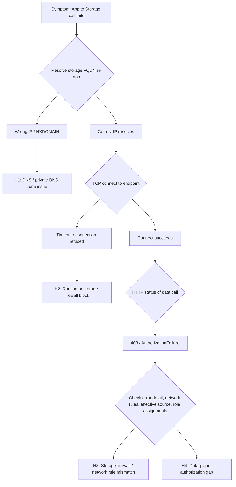

---
content_sources:
  diagrams:
    - id: storage-connectivity-four-layer-flow
      type: flowchart
      source: self-generated
      justification: "Synthesized a four-layer (DNS, routing, storage firewall, data-plane authorization) diagnosis flow from Microsoft Learn guidance on App Service VNet integration, storage network security, and Azure Storage data authorization."
      based_on:
        - https://learn.microsoft.com/en-us/azure/app-service/overview-vnet-integration
        - https://learn.microsoft.com/en-us/azure/storage/common/storage-network-security
        - https://learn.microsoft.com/en-us/azure/storage/common/authorize-data-access
        - https://learn.microsoft.com/en-us/azure/app-service/networking-features
content_validation:
  status: verified
  last_reviewed: "2026-07-16"
  reviewer: agent
  core_claims:
    - claim: "Azure Storage firewall grants access from a virtual network through service endpoints or private endpoints when the app uses virtual network integration."
      source: "https://learn.microsoft.com/en-us/azure/storage/common/storage-network-security"
      verified: true
    - claim: "Passing the storage account network rules does not authorize data access; data access still requires a shared key, a SAS token, or a data-plane RBAC role."
      source: "https://learn.microsoft.com/en-us/azure/storage/common/authorize-data-access"
      verified: true
    - claim: "When a service endpoint is used, the source address of the request switches to a private VNet address, so public IP network rules no longer apply to that traffic."
      source: "https://learn.microsoft.com/en-us/azure/storage/common/storage-network-security"
      verified: true
    - claim: "IP network rules have no effect on requests originating from the same Azure region as the storage account, because same-region Azure services use private Azure IP addresses."
      source: "https://learn.microsoft.com/en-us/azure/storage/common/storage-network-security-limitations#restrictions-for-ip-network-rules"
      verified: true
---

# App Service to Azure Storage: Firewall and Authorization Confusion (Linux)

## 1. Summary
### Symptom
Outbound calls from an Azure App Service Linux app to an Azure Storage account (Blob, Files, Queue, or Table) fail. Symptoms include connection timeouts, `AuthorizationFailure` / `403` responses, `This request is not authorized to perform this operation`, or a hostname that resolves to a public IP instead of the expected private endpoint IP.

### Why this scenario is confusing
An App Service to Storage connection must pass through four independent layers — **DNS resolution**, **routing / egress path**, **storage firewall (network authorization)**, and **data-plane authorization** — and each layer fails with a different signature. A `403` / `AuthorizationFailure` is ambiguous on its own: the storage firewall (a network-rule denial) and a data-plane authorization gap (missing role, expired SAS, disabled shared key) can *both* surface as `403 AuthorizationFailure`. Do not assume a `403` is a role problem until you have checked the Storage error detail, the account's network rules, the request's effective source, and the identity's role assignments. Conversely, a timeout is a *network path* problem that no RBAC change will fix.

### Troubleshooting decision flow
<!-- diagram-id: storage-connectivity-four-layer-flow -->


### Scope and limitations
- Linux/OSS scope only; Windows worker specifics are out of scope.
- Covers Blob, Files, Queue, and Table data-plane connectivity from App Service.
- Vendor-specific NVA/firewall tuning is intentionally excluded.

### Quick conclusion
Prove each layer independently and in order: **(1)** the storage FQDN resolves to the intended IP, **(2)** TCP reaches the endpoint, **(3)** the storage firewall admits the request's effective source, and **(4)** the calling identity holds a valid data-plane credential or role. Most durable fixes come from correcting private DNS links, aligning VNet integration with a service or private endpoint, and adding the missing data-plane RBAC role.

## 2. Common Misreadings
- "The firewall passed, so the app is authorized." (Network access and data authorization are separate layers.)
- "Route All is on, so Storage is private." (Route All changes the egress path, not the storage account's public endpoint.)
- "I added the app's outbound IPs to the storage firewall." (Same-region App Service IPs are not honored; a service endpoint switches the source to a private address anyway.)
- "It works from my laptop, so DNS is correct." (In-app resolution can differ, especially with private endpoints.)

## 3. Competing Hypotheses
- **H1 (DNS layer):** The storage FQDN resolves to the wrong IP — a missing/unlinked `privatelink.<service>.core.windows.net` zone, a wrong A record, or a custom DNS forwarder that does not resolve the privatelink chain.
- **H2 (Routing layer):** VNet integration/route-all/UDR is not steering traffic through the path the storage firewall expects, so the request never reaches the account.
- **H3 (Storage firewall layer):** The storage network rules do not admit the request's *effective* source — for example an IP allowlist that is ignored for same-region service-endpoint traffic, or a missing subnet/private-endpoint rule.
- **H4 (Authorization layer):** The network path is fine but the calling identity lacks a valid data-plane credential — no data-plane RBAC role, an expired SAS, a disabled shared key, or `403 AuthorizationFailure`.

## 4. What to Check First
### Metrics
- App Service HTTP 5xx and latency trend during storage calls.
- Storage account `Transactions` metric split by `ResponseType` (look for `AuthorizationError`, `NetworkError`, `Success`).
- Firewall or NVA deny counters for the storage private IP/port (443).

### Logs
- Connect errors: `ETIMEDOUT`, `ECONNREFUSED`, `No route to host`.
- Resolver errors: `ENOTFOUND`, `EAI_AGAIN`, `Name or service not known`.
- Data-plane errors: `AuthorizationFailure`, `AuthorizationPermissionMismatch`, `403`, `This request is not authorized to perform this operation using this permission`.

### Platform Signals
- VNet Integration state and integration subnet assignment.
- Storage account `publicNetworkAccess`, `defaultAction`, virtual network rules, IP rules, and private endpoint connections.
- Private DNS zone links and A record values for the storage privatelink zone.
- Role assignments on the storage account for the app's managed identity.

### Investigation Notes
- Always validate from inside the Linux App Service runtime; external resolver behavior is not authoritative.
- A `403` / `AuthorizationFailure` is ambiguous: it can be a storage network-rule (firewall) denial *or* a data-plane role/credential gap. Distinguish them by checking the Storage error detail, the account network rules, the request's effective source, and the role assignments — a data-plane gap is confirmed only after the network path is proven open.
- Passing the storage network rules does not grant data access — that still requires a shared key, SAS, or data-plane RBAC role.
- When a service endpoint is used, the request's source becomes a private VNet address, so public IP allowlist rules no longer apply.
- Keep all timeline correlation in UTC.

## 5. Evidence to Collect
### Required Evidence
- In-app resolution output for the exact storage FQDN (`nslookup`, `getent hosts`).
- Storage account network configuration (`publicNetworkAccess`, `defaultAction`, `virtualNetworkRules`, `ipRules`).
- Private endpoint NIC IP and subresource (`blob`/`file`/`queue`/`table`) mapping.
- Role assignments for the app's managed identity on the storage scope.
- UTC timestamped app failures and the HTTP status of the failing data call.

### Useful Context
- Custom DNS architecture and forwarder chain.
- Current `vnetRouteAllEnabled` setting for the app.
- Recent changes to the storage firewall, endpoint, DNS, or role assignments.
- Authentication method in use (managed identity vs shared key vs SAS).

### CLI Investigation Commands

```bash
# App VNet integration and route-all state
az webapp show --resource-group <resource-group> --name <app-name> --query "{virtualNetworkSubnetId:virtualNetworkSubnetId,vnetRouteAllEnabled:siteConfig.vnetRouteAllEnabled}" --output table

# Storage network configuration
az storage account show --resource-group <resource-group> --name <storage-account-name> --query "{publicNetworkAccess:publicNetworkAccess,defaultAction:networkRuleSet.defaultAction,ipRules:networkRuleSet.ipRules,vnetRules:networkRuleSet.virtualNetworkRules}" --output json

# Private endpoint state and private IP
az network private-endpoint show --resource-group <resource-group> --name <private-endpoint-name> --query "{name:name,provisioningState:provisioningState}" --output table

# Data-plane role assignments for the app identity
az role assignment list --assignee <app-managed-identity-object-id> --scope <storage-account-resource-id> --query "[].{role:roleDefinitionName,scope:scope}" --output table
```

!!! tip "How to Read This"
    If `defaultAction` is `Deny` and there is no `virtualNetworkRules` entry for the integration subnet (and no private endpoint), the firewall is blocking the app — an H2/H3 problem. If the network config is correct but `az role assignment list` returns no data-plane role (for example `Storage Blob Data Reader`), the failure is H4, and no network change will fix it.

## 6. Validation and Disproof by Hypothesis

### H1: DNS resolves to the wrong IP
**Signals that support**
- App resolves the storage FQDN to a public IP when a private endpoint is expected, or returns NXDOMAIN.
- The `privatelink.<service>.core.windows.net` zone is missing or not linked to the integration VNet.

**Signals that weaken**
- App resolves consistently to the current private endpoint NIC IP.

**Validation**
```bash
nslookup <storage-account-name>.blob.core.windows.net
getent hosts <storage-account-name>.blob.core.windows.net
az network private-dns link vnet list --resource-group <resource-group> --zone-name privatelink.blob.core.windows.net --output table
az network private-dns record-set a list --resource-group <resource-group> --zone-name privatelink.blob.core.windows.net --output table
```

### H2: Routing / egress path blocked
**Signals that support**
- DNS resolves correctly, but TCP to port 443 times out.
- `vnetRouteAllEnabled` is off while the storage firewall requires the VNet path, or a UDR steers traffic to a firewall that denies the storage IP.

**Signals that weaken**
- Effective routes are valid and a direct connect test to the endpoint succeeds.

**Validation**
```bash
az webapp show --resource-group <resource-group> --name <app-name> --query "siteConfig.vnetRouteAllEnabled"
az network vnet subnet show --resource-group <resource-group> --vnet-name <vnet-name> --name <integration-subnet-name> --query "{serviceEndpoints:serviceEndpoints,routeTable:routeTable.id}"
nc -vz <storage-account-name>.blob.core.windows.net 443
```

### H3: Storage firewall rule mismatch
**Signals that support**
- `defaultAction` is `Deny` and the integration subnet is not in `virtualNetworkRules`.
- An IP allowlist was added for App Service outbound IPs but the app and storage are in the same region (rules not honored), or a service endpoint changed the source to a private address the IP rule does not match.

**Signals that weaken**
- The integration subnet has a `Microsoft.Storage` service endpoint AND a matching virtual network rule, or a private endpoint exists and is approved.

**Validation**
```bash
az storage account network-rule list --resource-group <resource-group> --account-name <storage-account-name> --output json
az network vnet subnet show --resource-group <resource-group> --vnet-name <vnet-name> --name <integration-subnet-name> --query "serviceEndpoints"
```

!!! warning "Same-region IP allowlists are ignored"
    Adding App Service outbound IPs to the storage firewall does not work when the app and storage account are in the same region — those IP rules are not honored. Use a `Microsoft.Storage` service endpoint with a virtual network rule, or a private endpoint.

### H4: Data-plane authorization gap
**Signals that support**
- The data call returns `403 AuthorizationFailure` or `AuthorizationPermissionMismatch` *after* the network path is proven open.
- The app uses managed identity but has no data-plane role (for example `Storage Blob Data Contributor`) on the storage scope.
- Shared key access is disabled on the account, or a SAS token has expired.

**Signals that weaken**
- The identity holds a data-plane role at the correct scope and the same call succeeds intermittently (points back to a network/transient issue).

**Validation**
```bash
az role assignment list --assignee <app-managed-identity-object-id> --scope <storage-account-resource-id> --output table
az storage account show --resource-group <resource-group> --name <storage-account-name> --query "allowSharedKeyAccess"
```

!!! tip "How to Read This"
    Control-plane roles like **Contributor** or **Owner** do NOT grant data-plane access to blobs, files, queues, or tables. For code that calls the storage data plane with a managed identity, assign a data-plane role such as **Storage Blob Data Reader/Contributor**, **Storage Queue Data Contributor**, or **Storage Table Data Contributor** to the app's identity. The **Storage File Data SMB Share Reader/Contributor** roles apply only to identity-based SMB access to Azure Files — they do **not** apply to an App Service *Bring Your Own Storage* (BYOS) path mount, which authenticates with the storage account key, not with the app's managed identity or RBAC. A BYOS mount therefore fails on the account key or storage firewall path, not on a missing SMB share role.

### Normal vs Abnormal Comparison

| Signal | Normal path | Abnormal pattern |
|---|---|---|
| Storage FQDN resolution | Resolves to the intended (private or public) IP | Resolves to public IP when private endpoint expected, or NXDOMAIN |
| TCP connect to 443 | Succeeds | Times out (routing / firewall block) |
| Firewall admits request | Service endpoint or private endpoint rule matches | `defaultAction Deny` with no matching VNet/private-endpoint rule |
| Data call HTTP status | 200 / 201 | `403 AuthorizationFailure` (network-rule denial *or* missing data-plane role — disambiguate before fixing) |
| Interpretation | All four layers aligned | One layer blocks; identify which by signature |

## 7. Likely Root Cause Patterns
- Pattern A: Storage `publicNetworkAccess Disabled` / `defaultAction Deny` without a service endpoint or private endpoint for the integration subnet.
- Pattern B: Private DNS zone for the storage service not linked to the integration VNet, so the FQDN resolves publicly.
- Pattern C: IP allowlist added for App Service outbound IPs in the same region (silently ignored).
- Pattern D: App migrated to managed identity but never granted a data-plane RBAC role.
- Pattern E: Shared key access disabled on the account while the app still uses a connection string.

## 8. Immediate Mitigations
- Add a `Microsoft.Storage` service endpoint on the integration subnet and a matching virtual network rule on the storage account. **Risk: Low**.
- Create/approve a private endpoint and link the `privatelink.<service>.core.windows.net` zone to the integration VNet. **Risk: Medium** (DNS change).
- Assign the correct data-plane RBAC role to the app's managed identity. **Risk: Low**.
- Re-enable shared key access temporarily if the app depends on a connection string, then plan the migration to managed identity. **Risk: Medium** (weakens auth posture).

## 9. Prevention
- Standardize on managed identity + data-plane RBAC for storage access; avoid connection strings.
- Automate storage onboarding checks: firewall default action, VNet/private-endpoint rule, private DNS link, and required data-plane role.
- Add synthetic probes from App Service runtime that both resolve and perform a real data-plane read against critical storage dependencies.
- Document the four-layer model in runbooks so a `403` is disambiguated across the storage firewall (network authorization) and data-plane authorization, instead of being assumed to be one or the other.

## See Also
- [App Service to Azure Storage connectivity](../../../platform/storage-connectivity.md)
- [Best Practices - Networking](../../../best-practices/networking.md)
- [Common Anti-Patterns](../../../best-practices/common-anti-patterns.md)
- [DNS Resolution (VNet-integrated App Service)](dns-resolution-vnet-integrated-app-service.md)
- [Private Endpoint / Custom DNS / Route Confusion](private-endpoint-custom-dns-route-confusion.md)
- [Outbound Network (First 10 Minutes)](../../first-10-minutes/outbound-network.md)

## Sources
- [Configure Azure Storage firewalls and virtual networks](https://learn.microsoft.com/en-us/azure/storage/common/storage-network-security)
- [Restrictions for IP network rules](https://learn.microsoft.com/en-us/azure/storage/common/storage-network-security-limitations#restrictions-for-ip-network-rules)
- [Authorize access to data in Azure Storage](https://learn.microsoft.com/en-us/azure/storage/common/authorize-data-access)
- [Integrate your app with an Azure virtual network](https://learn.microsoft.com/en-us/azure/app-service/overview-vnet-integration)
- [Azure App Service networking features](https://learn.microsoft.com/en-us/azure/app-service/networking-features)
- [Assign an Azure role for access to blob data](https://learn.microsoft.com/en-us/azure/storage/blobs/assign-azure-role-data-access)
