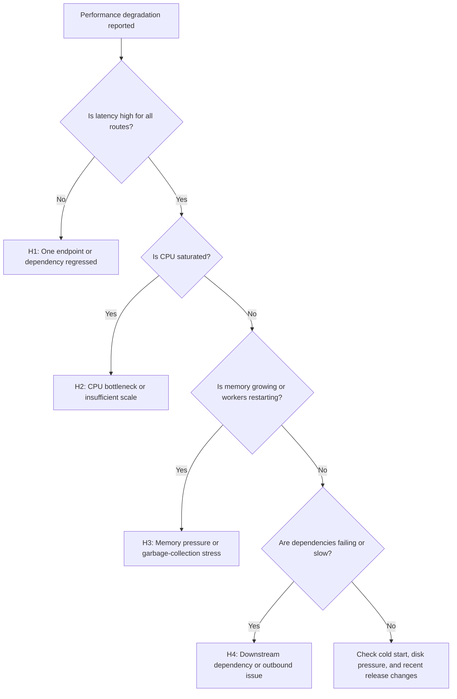

---
hide:
  - toc
content_sources:
  diagrams:
    - id: performance-degradation-flow
      type: flowchart
      source: self-generated
      justification: "Synthesized performance triage branches from Microsoft Learn troubleshooting guidance for App Service slowdowns, resource pressure, and 5xx symptoms."
      based_on:
        - https://learn.microsoft.com/en-us/troubleshoot/azure/app-service/troubleshoot-performance-degradation
        - https://learn.microsoft.com/en-us/azure/app-service/troubleshoot-http-502-http-503
        - https://learn.microsoft.com/en-us/azure/app-service/troubleshoot-diagnostic-logs
content_validation:
  status: verified
  last_reviewed: "2026-04-12"
  reviewer: ai-agent
  core_claims:
    - claim: "Slow App Service performance often occurs because of application-level problems such as long network requests, inefficient code or database queries, high memory or CPU use, or exceptions."
      source: "https://learn.microsoft.com/en-us/troubleshoot/azure/app-service/troubleshoot-performance-degradation"
      verified: true
    - claim: "App Service metrics that can be monitored for performance issues include average memory working set, CPU time, memory working set, requests, and response time."
      source: "https://learn.microsoft.com/en-us/troubleshoot/azure/app-service/troubleshoot-performance-degradation"
      verified: true
    - claim: "App Service provides diagnostic functionality for both web server diagnostics and application diagnostics."
      source: "https://learn.microsoft.com/en-us/troubleshoot/azure/app-service/troubleshoot-performance-degradation"
      verified: true
    - claim: "App Service includes a Kudu debug console that provides environment settings, log stream, diagnostic dump, and a debug console."
      source: "https://learn.microsoft.com/en-us/troubleshoot/azure/app-service/troubleshoot-performance-degradation"
      verified: true
    - claim: "Scaling out an App Service app provides more processing capability and some fault tolerance."
      source: "https://learn.microsoft.com/en-us/troubleshoot/azure/app-service/troubleshoot-performance-degradation"
      verified: true
---

# Performance Degradation

## 1. Summary

This playbook applies when an Azure App Service app becomes slow, latency rises, throughput drops, or CPU and memory behavior degrade under load or after a release. Use it when the site still responds but users experience timeouts, slow APIs, queueing, or intermittent `5xx` errors tied to resource pressure.

### Symptoms

- Requests that normally finish in milliseconds now take seconds.
- P95 or P99 latency spikes while request volume stays similar.
- CPU or memory rises and the app becomes unstable or restarts.
- The app serves intermittent `500`, `502`, `503`, or `504` responses during busy periods.

### Common error messages

- `The request timed out`.
- `502 Bad Gateway`, `503 Service Unavailable`, or `504 Gateway Timeout`.
- `OutOfMemory`, worker recycle, or repeated restart messages.
- `SNAT exhaustion`-style dependency failures that look like app slowness.

<!-- diagram-id: performance-degradation-flow -->


## 2. Common Misreadings

| Observation | Often Misread As | Actually Means |
|---|---|---|
| CPU is low but requests are slow | App Service is underutilized and healthy | Latency can come from downstream waits, thread starvation, lock contention, or SNAT issues. |
| Memory is high | App definitely has a leak | Some runtimes reserve memory aggressively; correlate with restart behavior and request latency. |
| `503` appears during load | Networking outage only | The app may be overloaded, restarting, or not accepting requests fast enough. |
| One slow route dominates user complaints | Whole platform is degraded | Path-specific code or one dependency may be the real bottleneck. |
| Scaling out helped briefly | Root cause is fixed | Scale can mask but not remove inefficient code, hot paths, or memory churn. |

## 3. Competing Hypotheses

| Hypothesis | Likelihood | Key Discriminator |
|---|---|---|
| H1: One endpoint, query, or code path regressed | High | Slowest requests cluster on a small set of URIs or operations. |
| H2: CPU saturation or insufficient worker capacity | High | CPU trend and latency/error trend rise together during demand spikes. |
| H3: Memory pressure or worker degradation | High | Memory climbs, response times worsen, and restarts or recycling appear. |
| H4: Downstream dependency or outbound networking issue | Medium | Dependency calls fail or slow while app CPU remains relatively low. |
| H5: Release introduced cold-start or configuration regression | Medium | Symptoms begin exactly after deployment or instance movement. |

## 4. What to Check First

1. **Confirm app state and plan relationship**

    ```bash
    az webapp show \
        --resource-group $RG \
        --name $APP_NAME \
        --query "{state:state,serverFarmId:serverFarmId,enabled:enabled}" \
        --output json
    ```

2. **Inspect autoscale or instance count context if applicable**

    ```bash
    az appservice plan show \
        --resource-group $RG \
        --name $PLAN_NAME \
        --query "{sku:sku.name,workerSize:workerSize,numberOfWorkers:numberOfWorkers,maximumElasticWorkerCount:maximumElasticWorkerCount}" \
        --output json
    ```

3. **Review startup and runtime settings that influence performance behavior**

    ```bash
    az webapp config show \
        --resource-group $RG \
        --name $APP_NAME \
        --query "{alwaysOn:alwaysOn,http20Enabled:http20Enabled,minimumTlsVersion:minTlsVersion,appCommandLine:appCommandLine}" \
        --output json
    ```

4. **If a release just occurred, inspect recent deployment history**

    ```bash
    az webapp log deployment list \
        --resource-group $RG \
        --name $APP_NAME \
        --output table
    ```

## 5. Evidence to Collect

Use one shared incident window across HTTP logs, console/platform logs, and Application Insights requests or dependencies if available.

### 5.1 KQL Queries

#### Query 1: Request latency and error trend

```kusto
AppServiceHTTPLogs
| where TimeGenerated > ago(24h)
| summarize Requests=count(), Errors=countif(ScStatus >= 500), P95=percentile(TimeTaken, 95), P99=percentile(TimeTaken, 99) by bin(TimeGenerated, 5m)
| order by TimeGenerated asc
```

| Column | Example data | Interpretation |
|---|---|---|
| `Requests` | `6200` | Shows whether demand increased materially. |
| `Errors` | `180` | Rising errors with rising latency suggest saturation or dependency failure. |
| `P95` | `2800` | Main symptom metric for user pain. |
| `P99` | `9200` | Tail latency helps isolate queueing and severe outliers. |

!!! tip "How to Read This"
    If request volume is flat but latency jumps, suspect regression, resource contention, or dependency delays before assuming traffic surge.

#### Query 2: Slowest request paths

```kusto
AppServiceHTTPLogs
| where TimeGenerated > ago(24h)
| summarize Requests=count(), P95=percentile(TimeTaken, 95), MaxTime=max(TimeTaken) by CsUriStem
| order by P95 desc
| take 15
```

| Column | Example data | Interpretation |
|---|---|---|
| `CsUriStem` | `/api/orders` | Pinpoints the route driving the incident. |
| `P95` | `6400` | High path-specific latency supports H1. |
| `Requests` | `22000` | High frequency plus high latency makes this path operationally dominant. |

!!! tip "How to Read This"
    A small set of expensive routes usually means application logic or dependency behavior is more important than platform-wide tuning.

#### Query 3: Restart and pressure correlation

```kusto
AppServicePlatformLogs
| where TimeGenerated > ago(24h)
| where Message has_any ("Restarting", "ContainerTimeout", "OutOfMemory", "Stopping container", "recycle")
| project TimeGenerated, Level, Message
| order by TimeGenerated asc
```

| Column | Example data | Interpretation |
|---|---|---|
| `Message` | `Stopping container` | Worker instability can explain sharp latency cliffs. |
| `Message` | `OutOfMemory` | Strong evidence for H3 rather than H2. |
| `TimeGenerated` | `aligned to P95 spike` | Correlation matters more than isolated restarts. |

!!! tip "How to Read This"
    Resource-pressure symptoms often show up first as latency and only later as explicit restarts. Build the timeline before tuning scale.

#### Query 4: Application Insights dependency latency (if enabled)

```kusto
dependencies
| where timestamp > ago(24h)
| summarize Calls=count(), Failures=countif(success == false), P95=percentile(duration, 95) by target, type, bin(timestamp, 5m)
| order by timestamp asc
```

| Column | Example data | Interpretation |
|---|---|---|
| `target` | `sql-prod.database.windows.net` | Isolates the downstream dependency under stress. |
| `Failures` | `42` | Dependency instability can drive app latency with normal CPU. |
| `P95` | `00:00:03.2000000` | Elevated dependency duration supports H4. |

!!! tip "How to Read This"
    If dependency latency rises before HTTP latency, the app is probably waiting on something external rather than burning CPU locally.

### 5.2 CLI Investigation

```bash
# Check plan capacity context
az appservice plan show \
    --resource-group $RG \
    --name $PLAN_NAME \
    --query "{sku:sku.name,numberOfWorkers:numberOfWorkers,maximumElasticWorkerCount:maximumElasticWorkerCount}" \
    --output json
```

Sample output:

```json
{
  "maximumElasticWorkerCount": 1,
  "numberOfWorkers": 2,
  "sku": "P1v3"
}
```

Interpretation:

- Low worker count during sustained traffic supports H2, but only when logs also show load-driven degradation.
- Scale context alone never proves the app is the bottleneck.

```bash
# Show app configuration relevant to warm and steady-state performance
az webapp config show \
    --resource-group $RG \
    --name $APP_NAME \
    --query "{alwaysOn:alwaysOn,http20Enabled:http20Enabled,appCommandLine:appCommandLine}" \
    --output json
```

Sample output:

```json
{
  "alwaysOn": true,
  "appCommandLine": "gunicorn --workers 4 --bind 0.0.0.0:8000 src.app:app",
  "http20Enabled": true
}
```

Interpretation:

- This output helps distinguish configuration regressions from capacity issues.
- Compare worker/process configuration to the observed CPU and latency profile.

## 6. Validation and Disproof by Hypothesis

### H1: One endpoint, query, or code path regressed

**Proves if** only a small set of URIs dominates P95/P99 latency or error increases.

**Disproves if** latency is uniform across nearly all routes and no path stands out.

Validation steps:

1. Sort slowest paths by P95 and request count.
2. Compare incident path set to the last known good release.
3. Check whether one dependency or database call aligns only to those endpoints.

### H2: CPU saturation or insufficient capacity

**Proves if** latency and errors rise with demand and scale context is tight.

**Disproves if** CPU remains modest while dependency latency or memory pressure explains the symptom better.

Validation steps:

1. Correlate workload growth with the latency trend.
2. Confirm the app is not simply blocked on external dependencies.
3. Scale temporarily only to test the hypothesis, not as permanent proof.

### H3: Memory pressure or worker degradation

**Proves if** restarts, recycling, or out-of-memory signatures align with latency growth.

**Disproves if** workers stay stable and no pressure signatures appear.

Validation steps:

1. Review platform log restarts during the incident.
2. Compare request latency before and after each restart.
3. Use existing memory-focused playbooks if the pattern is confirmed.

### H4: Downstream dependency or outbound issue

**Proves if** dependency latency/failure rises before or during app latency while local CPU remains lower.

**Disproves if** no dependency trend is visible and local resource pressure dominates.

Validation steps:

1. Check Application Insights dependencies or route-specific downstream errors.
2. If outbound networking is suspected, compare with SNAT/DNS playbooks.
3. Validate whether retries amplify latency.

## 7. Likely Root Cause Patterns

| Pattern | Evidence | Resolution |
|---|---|---|
| Hot endpoint regression | One route dominates slow-path query | Optimize code path, cache strategy, or backing query. |
| CPU-bound worker pool | Rising latency with heavy compute and tight worker count | Tune concurrency and scale appropriately. |
| Memory churn or leak | Gradual slowdown followed by recycle | Reduce allocation pressure and right-size the plan. |
| Slow dependency | App latency tracks dependency P95 and failures | Fix downstream bottleneck or retry strategy. |
| Post-release configuration change | Incident starts immediately after deployment | Revert or compare config drift against last good state. |

## 8. Immediate Mitigations

1. If a release triggered the issue, consider rollback before broad tuning changes.
2. Reduce pressure by scaling out temporarily if the app is still serving traffic.
3. Disable or rate-limit the worst offender endpoint if one route is dominating the outage.
4. Short-circuit expensive startup or background tasks that run on every worker recycle.
5. If dependency latency is dominant, reduce retries and timeouts that amplify queueing.
6. Re-collect latency evidence after each change and stop once user-facing latency returns to baseline.

## 9. Prevention

### Prevention checklist

- [ ] Track P50, P95, P99, error rate, and dependency latency for every production app.
- [ ] Load-test hot endpoints before major releases.
- [ ] Keep staging or canary validation for new builds and config changes.
- [ ] Monitor memory and restart patterns, not just average CPU.
- [ ] Maintain clear SLO-based alerts for latency and failure rate.

## See Also

- [Playbooks](index.md)
- [Slow Response but Low CPU](performance/slow-response-but-low-cpu.md)
- [Memory Pressure and Worker Degradation](performance/memory-pressure-and-worker-degradation.md)
- [Intermittent 5xx Under Load](performance/intermittent-5xx-under-load.md)

## Sources

- [Monitor instances in Azure App Service (Microsoft Learn)](https://learn.microsoft.com/en-us/azure/app-service/web-sites-monitor)
- [Enable Application Insights for Azure App Service (Microsoft Learn)](https://learn.microsoft.com/en-us/azure/azure-monitor/app/azure-web-apps)
- [Troubleshoot performance issues in App Service (Microsoft Learn)](https://learn.microsoft.com/en-us/azure/app-service/troubleshoot-performance-degradation)
