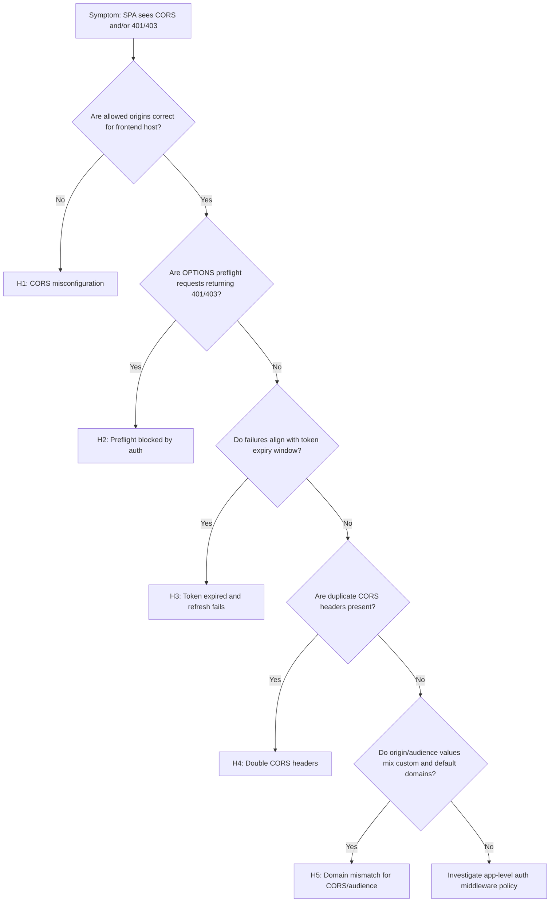
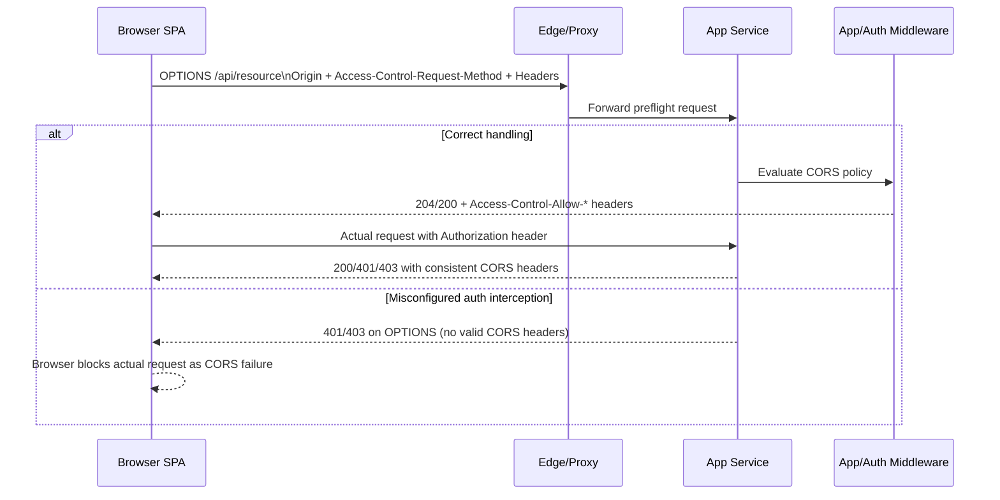
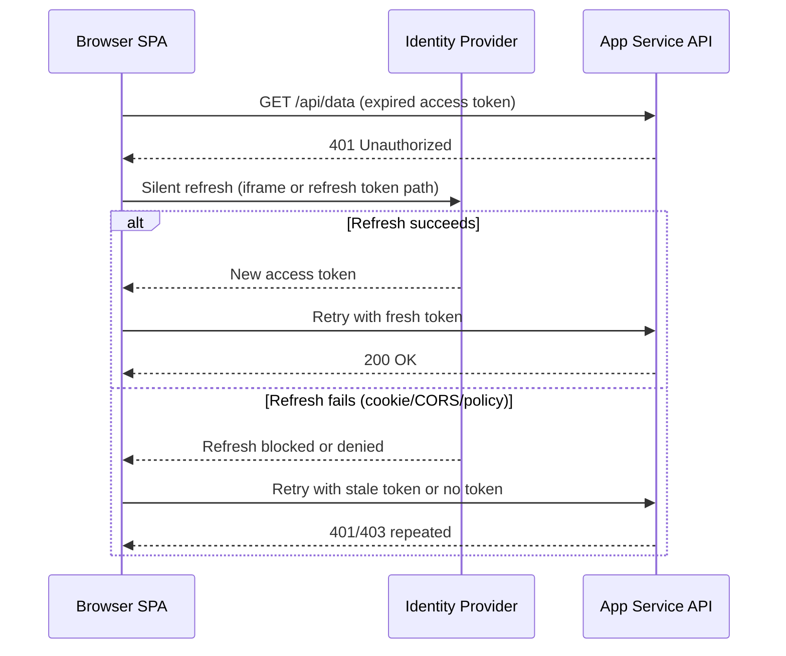

# CORS Failures and Token Errors (Azure App Service Linux)

## 1. Summary

### Symptom

A frontend SPA fails to call an API hosted on App Service. Browser console shows CORS failures (for example missing `Access-Control-Allow-Origin`) or requests return unexpected `401/403` despite recent sign-in.

### Why this scenario is confusing

CORS and authentication failures overlap in browser behavior. A preflight rejection can look like an auth problem, and token validation failures can look like CORS policy problems. The same endpoint can fail differently depending on method, headers, credential mode, and token lifetime.

### Troubleshooting decision flow



## 2. Symptom

- Browser console reports `Access-Control-Allow-Origin` or preflight errors.
- `OPTIONS` calls fail or do not return expected CORS headers.
- API returns `401` or `403` unexpectedly from SPA, especially after idle periods.
- Same API call may succeed in server-to-server tools but fail in-browser.

### CORS preflight flow with App Service Auth in path



### Token expiration and refresh failure flow



## 3. Hypotheses

- **H1: CORS not configured or misconfigured** — Allowed origins do not include frontend domain, or wildcard (`*`) is combined with credentials.
- **H2: Preflight OPTIONS request blocked by auth** — App Service Auth or app auth layer challenges OPTIONS before CORS handling.
- **H3: Token expired and silent refresh fails** — Access token expires, and refresh path fails due to cookie restrictions or cross-origin policy.
- **H4: Double CORS headers** — Both App Service platform CORS and application middleware emit CORS headers, causing browser rejection.
- **H5: Custom domain vs default domain mismatch** — SPA origin and token audience/issuer expectations use different domains (`contoso.com` vs `azurewebsites.net`).

## 4. Evidence Collection

### Required Evidence

- Browser network capture including preflight `OPTIONS` and failing API call pair.
- App Service CORS/auth configuration snapshots.
- `AppServiceHTTPLogs` for `OPTIONS` + `401/403` behavior.
- `AppServiceAuthenticationLogs` for token validation/issuer/audience failures.

### Core commands

```bash
az webapp cors show --resource-group <resource-group> --name <app-name>
az webapp auth show --resource-group <resource-group> --name <app-name>
az webapp config appsettings list --resource-group <resource-group> --name <app-name>
az webapp show --resource-group <resource-group> --name <app-name>
```

### KQL: 401/403 with OPTIONS method

```kusto
AppServiceHTTPLogs
| where TimeGenerated > ago(6h)
| where CsMethod == "OPTIONS"
| summarize total=count(), s401=countif(ScStatus == 401), s403=countif(ScStatus == 403), s2xx=countif(ScStatus between (200 .. 299)) by bin(TimeGenerated, 5m), CsUriStem
| order by TimeGenerated asc
```

```kusto
AppServiceHTTPLogs
| where TimeGenerated > ago(6h)
| where ScStatus in (401, 403)
| summarize hits=count() by CsMethod, CsUriStem, ScStatus
| order by hits desc
```

### KQL: auth/token validation failure patterns

```kusto
AppServiceAuthenticationLogs
| where TimeGenerated > ago(6h)
| where ResultDescription has_any ("token", "expired", "issuer", "audience", "signature", "nonce", "forbidden", "unauthorized")
| summarize failures=count() by ResultDescription, bin(TimeGenerated, 5m)
| order by TimeGenerated asc
```

```kusto
AppServiceAuthenticationLogs
| where TimeGenerated > ago(6h)
| project TimeGenerated, OperationName, ResultDescription
| order by TimeGenerated desc
```

## 5. Validation

### H1: CORS not configured or misconfigured

- **Signals that support**
  - Frontend origin missing from allowed origins.
  - `*` configured while requests use credentials (cookies or auth headers) and browser rejects response.
  - Preflight response lacks expected `Access-Control-Allow-*` fields.
- **Signals that weaken**
  - Allowed origins exactly match active SPA origin(s), including scheme and port.
  - Preflight succeeds with correct headers and status.
- **What to verify**
  1. Compare browser `Origin` to exact configured origins.
  2. Validate credential mode and CORS policy compatibility.

### H2: Preflight OPTIONS blocked by auth

- **Signals that support**
  - `OPTIONS` requests return `401/403` while `GET/POST` behavior differs.
  - Auth logs show challenge or unauthorized outcomes for preflight endpoints.
  - Temporarily bypassing auth for OPTIONS resolves CORS failure.
- **Signals that weaken**
  - OPTIONS consistently returns 2xx with proper CORS headers.
  - No auth events associated with preflight timing.
- **What to verify**
  1. Query `AppServiceHTTPLogs` for OPTIONS status distribution.
  2. Confirm request pipeline allows preflight before auth challenge logic.

### H3: Token expired and silent refresh fails

- **Signals that support**
  - Failures spike at token lifetime boundaries.
  - Auth logs show expired token or refresh-related failures.
  - Browser indicates blocked third-party cookie/silent refresh path.
- **Signals that weaken**
  - Fresh token acquisition works and API still returns 401/403.
  - Failures occur immediately after interactive login without expiry relation.
- **What to verify**
  1. Correlate 401 bursts to access token expiry interval.
  2. Validate refresh flow requirements (cookie policy, redirect URI, CORS allowances).

### H4: Double CORS headers

- **Signals that support**
  - Response contains duplicate or conflicting `Access-Control-Allow-Origin` headers.
  - Platform CORS and app middleware both enabled.
  - Browser rejects despite apparent allowed origin.
- **Signals that weaken**
  - Only one CORS authority emits headers consistently.
  - No duplicate header evidence in network trace.
- **What to verify**
  1. Inspect raw response headers in browser and server logs.
  2. Disable one CORS layer and retest.

### H5: Custom domain vs default domain mismatch

- **Signals that support**
  - SPA runs on custom domain, but API audience/issuer or CORS origins point to `azurewebsites.net` only.
  - Tokens minted for one audience are sent to another-domain API endpoint.
  - Failures disappear when hostnames are aligned end-to-end.
- **Signals that weaken**
  - Origin, audience, and endpoint host all use consistent domain strategy.
  - Token validation passes for same domain endpoints.
- **What to verify**
  1. Compare SPA origin, API URL, token audience, and issuer values.
  2. Ensure CORS origins and auth audiences cover active production hostnames only.

## 6. Mitigation

- **For H1**: Add exact frontend origin(s), remove invalid wildcard-with-credentials pattern, and redeploy policy.
- **For H2**: Exempt OPTIONS preflight from auth challenge or reorder middleware so CORS preflight is processed first.
- **For H3**: Reduce token lifetime mismatch effects, harden refresh flow, and fix cookie/CORS conditions required for silent refresh.
- **For H4**: Use a single CORS authority (platform or app), not both.
- **For H5**: Align custom domain strategy across SPA origin, API endpoint, token audience, and CORS configuration.

## 7. Prevention

- Treat CORS and auth as one contract in deployment validation (origin, audience, issuer, credential mode).
- Add automated preflight tests for critical endpoints and headers (`Authorization`, custom headers, credentials).
- Monitor `OPTIONS` 401/403 trends and token validation failures with alerts.
- Keep domain migration runbooks explicit: default domain and custom domain must not be mixed unintentionally.
- Version-control CORS and auth config with environment-specific review gates.

## 8. See Also

- [Intermittent 5xx Under Load](intermittent-5xx-under-load.md)
- [Slow Response but Low CPU](slow-response-but-low-cpu.md)
- [Troubleshooting KQL Queries](../../kql/)

## References

- [Configure CORS in Azure App Service](https://learn.microsoft.com/en-us/azure/app-service/app-service-web-tutorial-rest-api)
- [Authentication and authorization in Azure App Service](https://learn.microsoft.com/en-us/azure/app-service/overview-authentication-authorization)
- [Use OAuth 2.0 authorization code flow with Microsoft identity platform](https://learn.microsoft.com/en-us/entra/identity-platform/v2-oauth2-auth-code-flow)
- [Browser cookies and SameSite guidance for identity scenarios](https://learn.microsoft.com/en-us/entra/identity-platform/howto-handle-samesite-cookie-changes-chrome-browser)
- [Troubleshoot HTTP 401 and 403 errors in Azure App Service](https://learn.microsoft.com/en-us/troubleshoot/azure/app-service/diagnostic-information)
